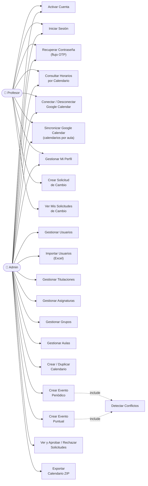
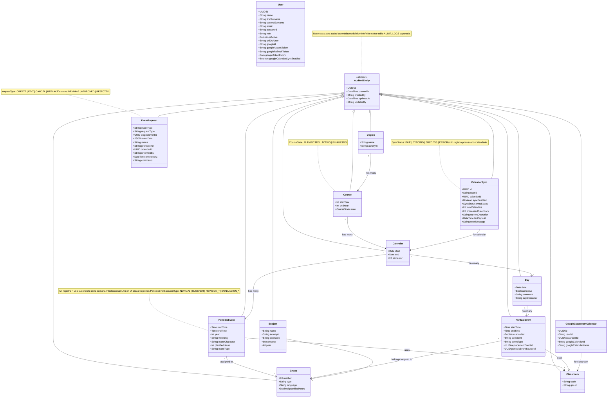
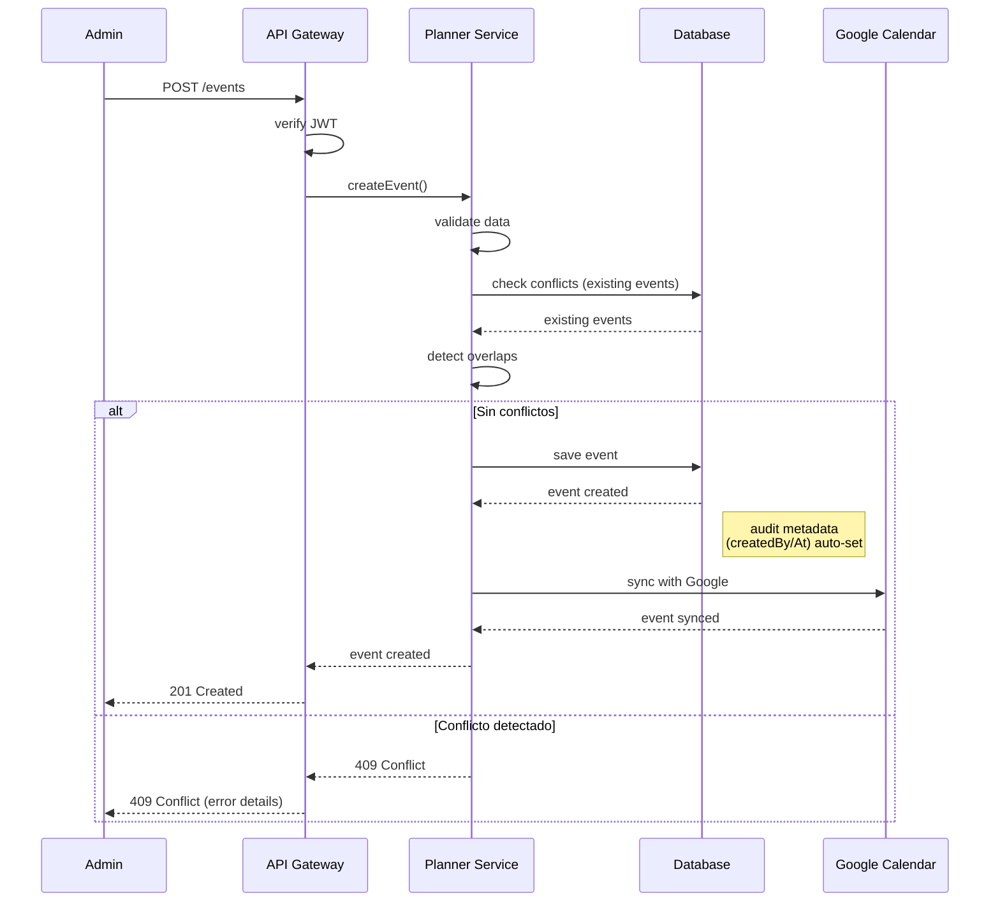
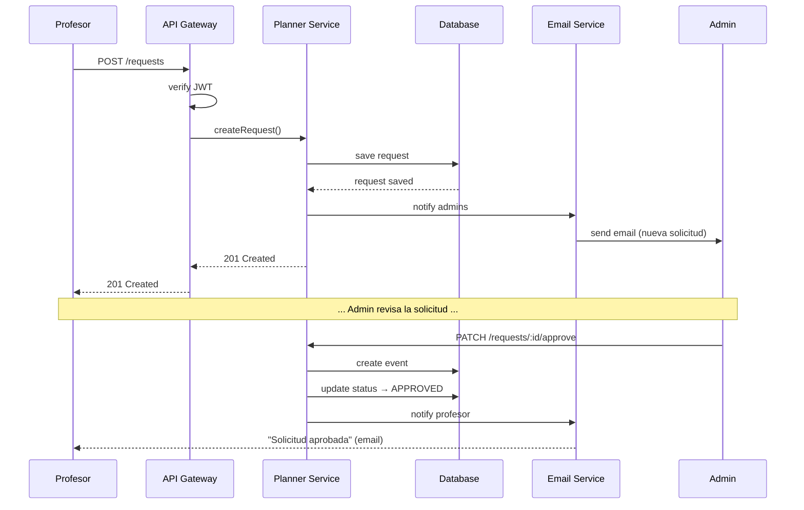
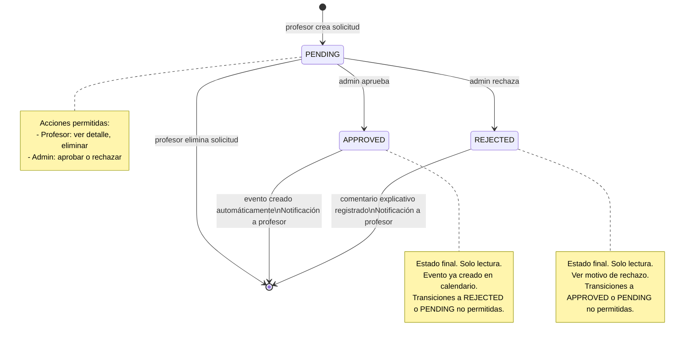
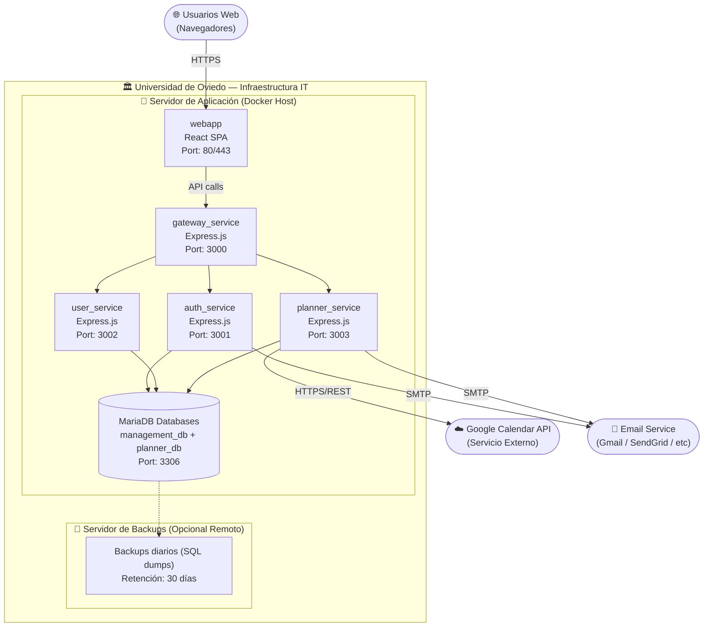

# 5. Apéndices - TeachingPlanner SRS

## 5.1 Diagramas UML

### 5.1.1 Diagrama de Casos de Uso

> **Nota v1.0:** No existe actor anónimo en v1.0. Todos los casos de uso requieren autenticación (salvo el flujo de recuperación de contraseña que es público). El acceso público a horarios está previsto en v2.0.

### 5.1.2 Diagrama de Clases (Modelo de Dominio)

### 5.1.3 Diagrama de Secuencia: Crear Evento con Validación de Conflictos

### 5.1.4 Diagrama de Secuencia: Solicitud de Cambio (Profesor → Admin)

### 5.1.5 Diagrama de Estados: Solicitud de Cambio

### 5.1.6 Diagrama de Despliegue

## 5.2 Matriz de Trazabilidad de Requisitos

### 5.2.1 Matriz Requisitos - Stakeholders

| Requisito | STK-01 | STK-02 | STK-03 | STK-04 | STK-05 | STK-08 | Prioridad |
|-----------|--------|--------|--------|--------|--------|--------|-----------|
| **Funcionales** |
| RF-AUTH-01 a 06 | ● | ● | ● | ○ | ● | ● | ALTA |
| RF-USER-01 a 03 | ● | ● | ○ | ○ | ● | ○ | ALTA |
| RF-DEGREE-01 a 04 | ● | ● | ○ | ○ | ○ | ○ | ALTA |
| RF-SUBJECT-01 a 04 | ● | ● | ○ | ○ | ○ | ○ | ALTA |
| RF-GROUP-01 a 04 | ● | ● | ○ | ○ | ○ | ○ | ALTA |
| RF-CLASSROOM-01 a 04 | ● | ● | ○ | ○ | ○ | ○ | ALTA |
| RF-CAL-01 a 05 | ● | ● | ○ | ○ | ● | ○ | CRÍTICA |
| RF-EVENT-01 a 08 | ● | ● | ○ | ○ | ● | ○ | CRÍTICA |
| RF-REQ-01 a 06 | ● | ● | ● | ○ | ● | ○ | ALTA |
| RF-VIEW-01 | ○ | ○ | ● | ● | ○ | ○ | CRÍTICA |
| RF-SYNC-01 a 05 | ○ | ○ | ● | ○ | ○ | ● | ALTA |
| RF-AUDIT-01 a 03 | ● | ● | ○ | ○ | ● | ● | ALTA |
| RF-EXPORT-01 a 03 | ● | ● | ○ | ○ | ○ | ○ | ALTA |
| **No Funcionales** |
| RNF-PERF-01 a 04 | ● | ● | ● | ● | ● | ● | ALTA |
| RNF-SCALE-01 a 03 | ● | ● | ○ | ● | ● | ● | ALTA |
| RNF-DISP-01 a 04 | ● | ● | ● | ● | ● | ● | CRÍTICA |
| RNF-SEC-01 a 06 | ● | ● | ● | ○ | ● | ● | CRÍTICA |
| RNF-UI-01 a 04 | ○ | ● | ● | ● | ○ | ○ | ALTA |
| RNF-MAINT-01 a 05 | ○ | ○ | ○ | ○ | ○ | ● | ALTA |

**Leyenda:**
- ● = Afecta directamente / Alta relevancia
- ○ = Afecta indirectamente / Baja relevancia
- (vacío) = No afecta

### 5.2.2 Matriz Requisitos - Casos de Uso

| Caso de Uso | Requisitos Funcionales | Requisitos No Funcionales | Actor Principal |
|-------------|----------------------|--------------------------|-----------------|
| Login | RF-AUTH-03 | RNF-SEC-01, RNF-PERF-01 | Todos |
| Registro de Usuario | RF-AUTH-01, RF-USER-01 | RNF-SEC-04 | Admin |
| Activación de Cuenta | RF-AUTH-02 | RNF-INT-03 | Usuario Nuevo |
| Crear Calendario | RF-CAL-01 | RNF-PERF-01, RNF-AUDIT-01 | Admin |
| Duplicar Calendario | RF-CAL-04 | RNF-PERF-01 | Admin |
| Crear Evento Periódico | RF-EVENT-01, RF-EVENT-07 | RNF-PERF-03, RNF-SEC-02 | Admin |
| Crear Evento Puntual | RF-EVENT-02, RF-EVENT-07 | RNF-PERF-03 | Admin |
| Solicitar Cambio | RF-REQ-01 | RNF-INT-03, RNF-SEC-02 | Profesor |
| Aprobar Solicitud | RF-REQ-04 | RNF-AUDIT-01, RNF-INT-03 | Admin |
| Rechazar Solicitud | RF-REQ-05 | RNF-AUDIT-01, RNF-INT-03 | Admin |
| Ver Horarios por Calendario | RF-VIEW-01 | RNF-PERF-01, RNF-UI-02 | Autenticado |
| Sincronizar Google (por aula) | RF-SYNC-01 a 05 | RNF-INT-02, RNF-SEC-03 | Admin |
| Exportar Calendario ZIP | RF-EXPORT-01 | RNF-PERF-01 | Admin |
| Importar Usuarios Excel | RF-EXPORT-03 | RNF-PERF-01, RNF-SEC-04 | Admin |
| Ver metadatos auditoría | RF-AUDIT-01 | RNF-SEC-02 | Admin |

### 5.2.3 Matriz de Cobertura de Tests

| Módulo | Requisitos | Tests Unitarios | Tests Integración | Tests E2E | Cobertura Objetivo |
|--------|-----------|-----------------|-------------------|-----------|-------------------|
| Autenticación | RF-AUTH-01 a 06 | ● | ● | ● | >80% |
| Usuarios | RF-USER-01 a 03 | ● | ● | ○ | >70% |
| Estructura Académica | RF-DEGREE, RF-SUBJECT, RF-GROUP | ● | ● | ○ | >70% |
| Calendarios | RF-CAL-01 a 05 | ● | ● | ● | >80% |
| Eventos | RF-EVENT-01 a 08 | ● | ● | ● | >85% |
| Solicitudes | RF-REQ-01 a 06 | ● | ● | ● | >80% |
| Vista Horarios (auth) | RF-VIEW-01 | ○ | ● | ● | >70% |
| Sincronización Google | RF-SYNC-01 a 05 | ● | ● | ○ | >75% |
| Auditoría (metadatos) | RF-AUDIT-01 | ● | ● | ○ | >70% |
| Exportación / Importación | RF-EXPORT-01 a 03 | ○ | ● | ○ | >60% |

**Leyenda:**
- ● = Cobertura requerida
- ○ = Cobertura opcional/parcial

## 5.3 Glosario Técnico

### Términos de Dominio

**Calendario Académico:** Conjunto de días lectivos asociados a un curso académico y semestre específico, que define el periodo en el que se imparten clases.

**Código SIES:** Identificador único asignado por el Sistema Integrado de Información Universitaria del Ministerio a cada asignatura oficial.

**Curso Académico:** Periodo lectivo anual, generalmente de septiembre a junio, identificado por dos años consecutivos (ej: 2026-2027).

**Día Lectivo:** Día incluido en un calendario académico en el que potencialmente hay docencia. Se excluyen sábados, domingos y festivos.

**Evento Periódico:** Sesión de clase que se repite regularmente según un patrón de días de la semana (ej: lunes y miércoles de 9:00 a 11:00).

**Evento Puntual:** Sesión de clase única que ocurre en una fecha específica, como seminarios, recuperaciones o excepciones.

**Grupo:** Subdivisión de una asignatura identificada por tipo (teoría, prácticas), número e idioma de impartición.

**Semestre:** División del curso académico en dos periodos: primer semestre (septiembre-enero) y segundo semestre (febrero-junio).

**Solicitud de Cambio:** Petición formal de un profesor para modificar un evento en el calendario, sujeta a aprobación administrativa.

**Titulación:** Programa de estudios oficial que conduce a un grado universitario (ej: Grado en Ingeniería Informática).

### Términos Técnicos

**API REST:** Interfaz de Programación de Aplicaciones que sigue principios RESTful, usando HTTP para operaciones CRUD.

**Bcrypt:** Algoritmo de hashing criptográfico utilizado para almacenar contraseñas de forma segura.

**CORS (Cross-Origin Resource Sharing):** Mecanismo de seguridad que permite solicitudes HTTP desde diferentes dominios.

**CSRF (Cross-Site Request Forgery):** Tipo de ataque web que explota la confianza de un sitio en el navegador del usuario.

**Docker:** Plataforma de contenedores que empaqueta aplicaciones con sus dependencias en unidades aisladas.

**ECTS (European Credit Transfer System):** Sistema europeo de transferencia y acumulación de créditos universitarios.

**ERD (Entity-Relationship Diagram):** Diagrama que muestra las entidades de un sistema y sus relaciones.

**HTTPS:** Protocolo HTTP sobre TLS/SSL que cifra la comunicación entre cliente y servidor.

**JWT (JSON Web Token):** Estándar abierto (RFC 7519) para crear tokens de acceso que afirman claims JSON.

**OAuth 2.0:** Protocolo de autorización que permite acceso limitado a recursos sin compartir credenciales.

**ORM (Object-Relational Mapping):** Técnica que mapea objetos de programación a tablas de base de datos relacional.

**Rate Limiting:** Técnica para controlar la cantidad de peticiones que un cliente puede hacer en un periodo de tiempo.

**RBAC (Role-Based Access Control):** Modelo de control de acceso basado en roles de usuario.

**RGPD (Reglamento General de Protección de Datos):** Regulación europea (GDPR en inglés) sobre privacidad y protección de datos personales.

**RPO (Recovery Point Objective):** Máxima cantidad de datos que una organización puede permitirse perder medida en tiempo.

**RTO (Recovery Time Objective):** Tiempo máximo aceptable para restaurar un sistema tras una interrupción.

**SPA (Single Page Application):** Aplicación web que carga una única página HTML y actualiza dinámicamente el contenido.

**SQL Injection:** Técnica de ataque que inserta código SQL malicioso en consultas a bases de datos.

**TLS/SSL (Transport Layer Security / Secure Sockets Layer):** Protocolos criptográficos para comunicación segura por red.

**TypeORM:** ORM para TypeScript y JavaScript que soporta múltiples bases de datos.

**WCAG (Web Content Accessibility Guidelines):** Directrices de accesibilidad para contenido web.

**XSS (Cross-Site Scripting):** Vulnerabilidad que permite inyectar scripts maliciosos en páginas web.

### Acrónimos del Proyecto

| Acrónimo | Significado |
|----------|-------------|
| EII | Escuela de Ingeniería Informática |
| GII | Grado en Ingeniería Informática |
| GIIIS | Grado en Ingeniería Informática del Software |
| GIS | Geographic Information System (para URLs de ubicación de aulas) |
| SIES | Sistema Integrado de Información Universitaria |
| SUTIC | Servicio Universitario de Tecnologías de la Información y Comunicaciones |
| UniOvi | Universidad de Oviedo |

## 5.4 Resumen de Verificación de Requisitos

### Tabla de Verificabilidad de Requisitos

| ID Requisito | Verificación | Método | Criterio de Aceptación |
|--------------|--------------|--------|------------------------|
| RF-AUTH-01 | ✓ | Test automatizado + Manual | Usuario recibe email de activación en <2 min |
| RF-AUTH-03 | ✓ | Test automatizado | Login exitoso en <1s, JWT válido generado |
| RF-EVENT-07 | ✓ | Test automatizado | 100% de conflictos detectados, 0 falsos negativos |
| RF-CAL-04 | ✓ | Test manual | Duplicación completa en <10s, eventos copiados correctamente |
| RF-VIEW-01 | ✓ | Test E2E | Carga de la vista de horarios <3s, requiere autenticación |
| RF-SYNC-01 | ✓ | Test integración | Conexión OAuth exitosa, tokens almacenados encriptados |
| RNF-PERF-01 | ✓ | Test rendimiento | Tiempo de respuesta medido con JMeter, percentil 95 |
| RNF-SEC-01 | ✓ | Test seguridad | Contraseñas hasheadas con bcrypt, auditoría de código |
| RNF-DISP-01 | ✓ | Monitorización | Uptime medido por herramienta externa durante 1 año |
| RNF-UI-02 | ✓ | Test responsive | Validación en Chrome DevTools + dispositivos reales |

### Defectos Encontrados Durante Revisión de Requisitos

| ID Defecto | Tipo | Descripción | Estado | Corrección |
|------------|------|-------------|--------|-----------|
| DEF-001 | Ambigüedad | RF-USER-03 no especificaba si eliminación es hard delete o soft delete | RESUELTO | Aclarado: Hard delete (elimina registro de la BD) |
| DEF-002 | Inconsistencia | RF-EVENT-01 y RF-EVENT-07 duplicaban validación de conflictos | RESUELTO | Separados: RF-EVENT-01 crea, RF-EVENT-07 valida |
| DEF-003 | Falta de requisito | No se especificó comportamiento cuando profesor tiene múltiples grupos | RESUELTO | Agregado: Sincronización incluye todos los grupos asignados |
| DEF-004 | Ambigüedad | RNF-PERF-01 no especificaba percentil para tiempos de respuesta | RESUELTO | Aclarado: Percentil 95 |
| DEF-005 | Conflicto | RF-CAL-05 permitía eliminar calendario actual, contradiciendo restricción de negocio | RESUELTO | Agregada validación: No eliminar calendario del semestre en curso |

## 5.5 Plan de Implementación Sugerido

### Fase 1: MVP (Minimum Viable Product) - 3 meses
**Objetivo:** Sistema funcional básico para una titulación

**Características:**
- Autenticación (RF-AUTH-01 a 05)
- Gestión de usuarios (RF-USER-01 a 03)
- Estructura académica básica (RF-DEGREE, RF-SUBJECT, RF-GROUP, RF-CLASSROOM)
- Calendarios (RF-CAL-01 a 03, 05)
- Eventos periódicos (RF-EVENT-01, RF-EVENT-07)
- Vista de horarios con autenticación (RF-VIEW-01)
- Auditoría mediante metadatos de entidad (RF-AUDIT-01)

**Excluido del MVP:**
- Eventos puntuales
- Solicitudes de cambio
- Sincronización con Google Calendar
- Duplicación de calendarios
- Exportaciones

### Fase 2: Funcionalidades Avanzadas - 2 meses
**Objetivo:** Completar funcionalidades para profesores

**Características:**
- Eventos puntuales (RF-EVENT-02)
- Solicitudes de cambio (RF-REQ-01 a 06)
- Sincronización con Google Calendar (RF-SYNC-01 a 05)
- Duplicación de calendarios (RF-CAL-04)
- Sincronización Google Calendar por aula (RF-SYNC-01 a 05)

### Fase 3: Optimización y Escalado - 1 mes
**Objetivo:** Preparar para múltiples titulaciones

**Características:**
- Optimización de rendimiento (RNF-PERF-04 caché)
- Exportación ZIP de calendarios (RF-EXPORT-01)
- Importación de usuarios desde Excel (RF-EXPORT-03)
- Testing completo
- Documentación de usuario

### Fase 4: Despliegue y Estabilización - 1 mes
**Objetivo:** Puesta en producción

**Actividades:**
- Migración de datos históricos
- Formación a administradores
- Formación a profesores
- Monitorización y ajustes
- Corrección de bugs reportados

**Total estimado:** 7 meses

## 5.6 Conclusiones

Este documento de Especificación de Requisitos de Software (SRS) para el sistema **TeachingPlanner** ha establecido una base sólida para el desarrollo del proyecto. Los puntos clave son:

### Alcance Completo
- **18 stakeholders** identificados con sus necesidades específicas
- **60+ requisitos funcionales** detallados con criterios de aceptación
- **30+ requisitos no funcionales** que garantizan calidad, seguridad y rendimiento
- Trazabilidad completa entre stakeholders, requisitos y casos de uso

### Prioridades Claras
Los requisitos críticos están claramente identificados:
- Detección automática de conflictos de horario (RF-EVENT-07)
- Vista de horarios por titulación y semestre (RF-VIEW-01)
- Seguridad y cumplimiento RGPD (RNF-SEC-01 a 06)
- Disponibilidad y copias de seguridad (RNF-DISP-01 a 03)

### Viabilidad Técnica
- Arquitectura de microservicios escalable
- Tecnologías probadas (Node.js, MariaDB, React)
- Integración con servicios externos bien definida
- Plan de implementación por fases realista

### Cumplimiento Normativo
- Conforme con RGPD y protección de datos
- Alineado con normativa universitaria
- Accesibilidad WCAG 2.1 nivel AA
- Auditoría completa para trazabilidad

### Próximos Pasos Recomendados
1. **Validación:** Revisión de SRS con stakeholders principales (STK-01, STK-02, STK-05)
2. **Prototipado:** Crear prototipos de interfaz para validar UX
3. **Diseño Detallado:** Elaborar diseño técnico detallado y arquitectura
4. **Planificación:** Crear backlog de producto con historias de usuario
5. **Desarrollo:** Iniciar Fase 1 (MVP) según plan de implementación

---

**Documento elaborado por:** Equipo TeachingPlanner
**Fecha:** 02/03/2026
**Versión:** 1.0
**Estado:** Pendiente de aprobación

---
