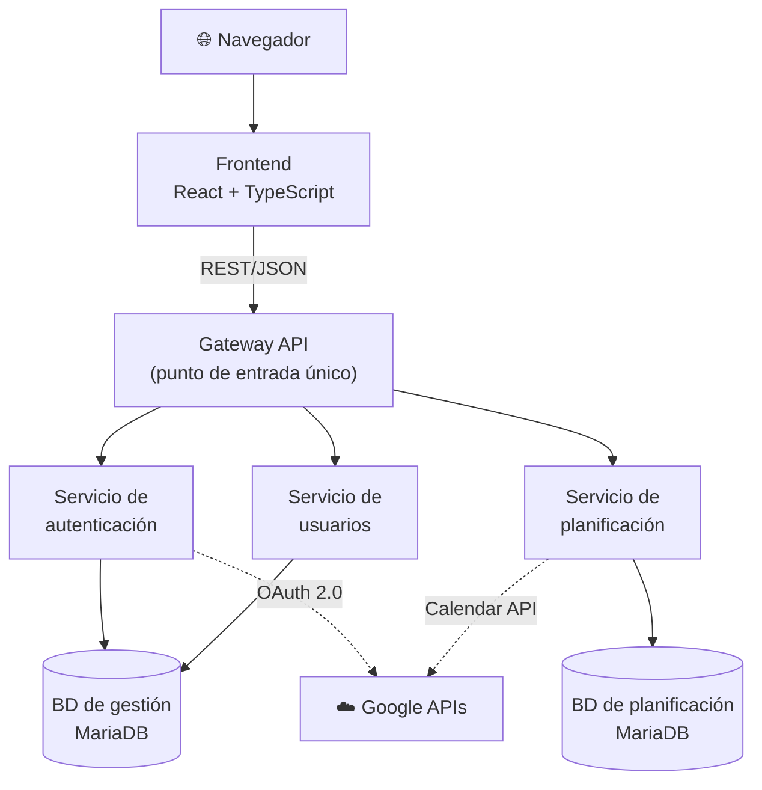
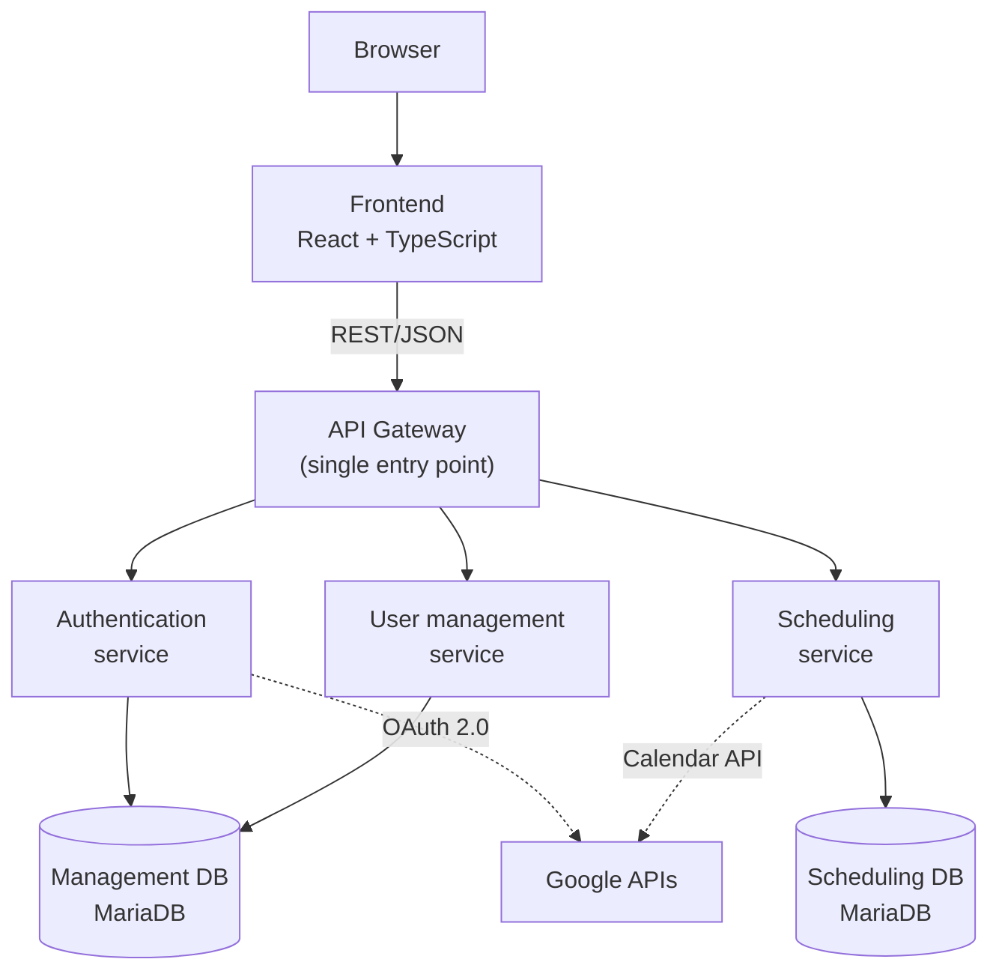

# Abstract

## TeachingPlanner: Sistema de Gestión de Horarios Académicos para la Escuela de Ingeniería Informática de la Universidad de Oviedo

---

La planificación y gestión de horarios académicos en una escuela universitaria es una tarea de considerable complejidad. No se trata simplemente de asignar horas a asignaturas: implica coordinar cientos de sesiones semanales repartidas en un número limitado de aulas con capacidades y equipamientos distintos, garantizando que no existan solapamientos ni incompatibilidades entre ellas. Cualquier error en este proceso, ya sea un solapamiento entre dos eventos en la misma aula, una clase asignada a un aula sin el equipamiento necesario, o una modificación de última hora no comunicada correctamente, tiene consecuencias directas y visibles para estudiantes, profesores y personal administrativo. Gestionar todo esto de forma eficiente y sin herramientas adecuadas es, en la práctica, una tarea que consume un tiempo y un esfuerzo desproporcionados.

Este proyecto surge precisamente para dar respuesta a esa necesidad concreta en la Escuela de Ingeniería Informática (EII) de la Universidad de Oviedo. Se trata de un encargo real de la propia institución, motivado por las limitaciones del sistema que se encuentra actualmente en funcionamiento y que, con el paso del tiempo, ha evidenciado carencias importantes que dificultan el trabajo del personal administrativo y docente del centro.

---

### La situación de partida

Para entender qué aporta este proyecto, es necesario conocer cómo funciona actualmente la gestión de horarios en la EII. La herramienta existente consta de dos componentes: un **visualizador público** sin autenticación, desplegado en los servidores de la universidad, que permite a cualquier persona consultar los horarios de los grupos del grado —con tres formatos de salida: lista web, tabla y CSV para Google Calendar— e incluye enlaces directos al sistema GIS de la universidad para localizar físicamente cada aula; y el conjunto de ficheros de texto que alimentan dicho visualizador, que deben mantenerse de forma enteramente manual. **No existe ninguna interfaz web de administración**: la componente pública del sistema es exclusivamente de lectura, y toda la gestión de datos se realiza en el nivel del sistema de ficheros, lo que presenta serias limitaciones que afectan tanto a la fiabilidad de los datos como a la experiencia de quienes deben mantenerlos a diario.

> 📷 **Figura sugerida 1 — Captura del visualizador público actual de la EII** (formato de lista o tabla), para mostrar la interfaz que se pretende sustituir.

El sistema actual se alimenta de **cinco ficheros de texto plano** por semestre, con el carácter `:` como separador de campos. Cada fichero tiene un propósito específico: `asignaturas.txt` recoge el catálogo de asignaturas con sus grupos de teoría, seminario, laboratorio y tutoría grupal, tanto en español como en inglés; `calendario.txt` contiene el calendario lectivo, con cada fecha etiquetada mediante un **código de letra** que indica si es festivo o qué tipo de grupo tiene clase ese día; `horarios.txt` define los eventos periódicos, vinculando cada grupo a un día de la semana, una franja horaria y un aula; `excepciones.txt` registra los eventos puntuales, incluida la posibilidad de eliminar un evento existente indicando −1 como hora de inicio; y `ubicaciones.txt` asocia cada aula con su URL en el sistema GIS de la universidad. Para modificar cualquiera de estos datos es necesario **conectarse por SSH al puerto 22 de la máquina virtual** que aloja la aplicación y editar directamente los ficheros con un editor de línea de comandos.

El aspecto más frágil de este diseño es el mecanismo de los **códigos de letra**: la periodicidad de los grupos no semanales depende de que el código asignado en `calendario.txt` y en `horarios.txt` sea exactamente el mismo en ambos ficheros. Cualquier divergencia tipográfica —una mayúscula distinta, un espacio de más— hace que el grupo desaparezca silenciosamente del horario publicado sin que el sistema emita ninguna advertencia. Este fallo es especialmente peligroso porque no produce ningún error visible: el horario simplemente muestra menos eventos de los esperados.

> 📷 **Figura sugerida 2 — Fragmento de `horarios.txt` o `calendario.txt` abierto en una sesión SSH**, para ilustrar el proceso de edición manual en línea de comandos.

Este enfoque presenta problemas graves desde varios ángulos. En primer lugar, **no existe ninguna validación de formato**: si al editar un fichero se introduce un error de sintaxis (un campo mal separado, una línea incompleta, un carácter incorrecto), el sistema no lo detecta ni avisa. El dato erróneo queda registrado silenciosamente y puede dar lugar a comportamientos inesperados en el horario mostrado. En segundo lugar, y quizás más importante, en el momento en que se guarda un cambio **no se comprueba si dicho cambio genera conflictos** con el resto de eventos del horario: un aula puede quedar reservada dos veces a la misma hora sin que el sistema emita ningún tipo de advertencia. La integridad del horario depende enteramente de la atención y el cuidado de quien lo edita.

A esto se suma otra limitación operativa de gran impacto en el día a día del centro: el proceso para solicitar cambios en los horarios. Cuando un docente necesita modificar una clase (cambiar el aula, el día, el horario, o cualquier otro parámetro), el canal habitual es el **correo electrónico**. El docente envía un mensaje a jefatura de estudios solicitando el cambio, y desde jefatura se comprueba manualmente si dicho cambio es viable, consultando el horario actual. Si no lo es, se responde indicándolo, el docente propone una alternativa, y así sucesivamente. Este proceso puede derivar en **hilos de correo largos y difíciles de gestionar**, que consumen tiempo tanto al docente como al personal administrativo, y en los que la posibilidad de malentendidos o de que algún mensaje quede sin respuesta es considerable. Además, el docente no dispone de ninguna herramienta para saber de antemano si su solicitud genera un conflicto: debe enviar el correo y esperar la respuesta para saberlo.

Cabe señalar que el sistema actual sí ofrece una funcionalidad de exportación a CSV, pensada para que los alumnos puedan importar su horario en herramientas como Google Calendar. Sin embargo, no existe ningún mecanismo en la interfaz para exportar los datos de vuelta al formato de los cinco ficheros `.txt`, lo que supone un problema de interoperabilidad relevante: existe otra aplicación en el ecosistema de la EII que también se alimenta de esos mismos ficheros, y cualquier cambio realizado en el sistema de horarios que no se propague manualmente a dichos ficheros puede dejar ambas aplicaciones desincronizadas.

Por último, el visualizador presenta limitaciones de usabilidad: la presentación de los eventos en formato de lista o tabla resulta poco intuitiva para obtener una visión rápida del horario semanal de un grupo, y la aplicación no está diseñada para funcionar en dispositivos móviles, lo que limita su accesibilidad en un entorno donde tanto docentes como alumnos consultan información habitualmente desde el teléfono.

> 📷 **Figura sugerida 3 — Captura del visualizador heredado en un dispositivo móvil**, mostrando la ausencia de diseño responsive.

---

### Qué es TeachingPlanner y qué aporta

TeachingPlanner es una **aplicación web** desarrollada desde cero para sustituir el sistema descrito y resolver todas las limitaciones mencionadas. No es una reforma o ampliación del visualizador existente, sino un sistema completo que, por primera vez, incorpora una **interfaz web de administración** junto a la consulta pública de horarios.

La premisa principal es sencilla: cualquier operación que actualmente requiere conectarse por SSH y editar ficheros de texto a mano debe poder realizarse desde una interfaz web clara, accesible desde cualquier navegador, sin necesidad de conocimientos técnicos avanzados. Eso incluye crear y modificar calendarios académicos, gestionar asignaturas, cursos y grupos, asignar aulas, y consultar o actualizar horarios, todo desde pantallas con formularios validados y retroalimentación inmediata. Al mismo tiempo, TeachingPlanner conserva y mejora lo que el visualizador heredado ofrecía: la consulta pública de horarios sin necesidad de autenticación, la exportación a CSV compatible con Google Calendar, y el acceso a la información geográfica de cada espacio docente.

> 📷 **Figura sugerida 4 — Vista principal del calendario semanal en TeachingPlanner**, mostrando la presentación de un horario de grupo frente al formato de lista del sistema anterior.

Uno de los pilares fundamentales de la aplicación es la **detección de conflictos en tiempo real**. Antes de confirmar cualquier asignación o cambio, el sistema comprueba automáticamente si existe alguna colisión con otros eventos ya registrados: dos clases en la misma aula a la misma hora u otro tipo de solapamiento. Esta validación ocurre de forma inmediata, en el mismo momento en que el usuario introduce los datos, lo que evita que errores de este tipo lleguen a guardarse y afecten al horario publicado.

> 📷 **Figura sugerida 5 — Diálogo de conflicto en tiempo real**, mostrando el aviso que recibe el usuario al intentar asignar un evento que choca con otro existente.

En relación con las solicitudes de cambio, TeachingPlanner incorpora un **sistema de solicitudes integrado** que reemplaza completamente el flujo basado en correo electrónico. Cuando un docente desea solicitar una modificación (cambiar el aula de una clase, mover una sesión a otro día, ajustar el horario), puede hacerlo directamente desde la propia aplicación. Antes de enviar la solicitud, el sistema le informa de inmediato si el cambio que está pidiendo genera algún conflicto con el horario existente, de modo que el docente puede ajustar su petición antes de enviarla. Una vez enviada, los administradores del sistema reciben la solicitud en su panel, pueden revisarla, aprobarla tal cual o con modificaciones, o rechazarla con una justificación. Todo este proceso queda registrado y es visible para ambas partes en todo momento, eliminando la ambigüedad y la dispersión propias del correo electrónico.

> 📷 **Figura sugerida 6 — Panel de solicitudes de cambio**, mostrando la vista del administrador con las solicitudes pendientes de revisión.

La aplicación define tres perfiles de usuario con niveles de acceso diferenciados. Los **administradores** tienen control total sobre el sistema: pueden crear y modificar todos los elementos (calendarios, asignaturas, cursos, grupos, aulas, usuarios) y gestionar las solicitudes de cambio. Los **docentes** pueden consultar los horarios de los grupos que tienen asignados, ver el calendario completo y crear solicitudes de cambio. Finalmente, cualquier persona puede acceder como **usuario anónimo** para consultar los horarios publicados sin necesidad de autenticarse, lo que facilita que estudiantes y cualquier interesado puedan ver el horario vigente sin barreras de acceso.

Entre las funcionalidades adicionales destaca la **integración con Google Calendar**: los **administradores** pueden conectar su cuenta de Google para sincronizar los horarios con Google Calendar, creando automáticamente **un Google Calendar por cada aula registrada** en la escuela. Esta funcionalidad es exclusiva del rol de administrador de forma deliberada: concentrar la sincronización en una única cuenta limita el número de llamadas a la API de Google Calendar, cuya cuota es compartida a nivel de proyecto de Google Cloud. Esta funcionalidad es fundamental porque existe otra aplicación en el ecosistema de la EII, utilizada por jefatura de estudios, que se alimenta directamente de estos calendarios de Google para su funcionamiento. Antes de TeachingPlanner, cuando se realizaba cualquier cambio en los ficheros `.txt`, ese cambio debía propagarse también manualmente al calendario de Google correspondiente, creando un proceso de doble mantenimiento costoso y propenso a desincronizaciones. Ahora, la sincronización elimina y recrea los eventos desde cero, lo que garantiza que el calendario de Google queda 100% sincronizado con el estado actual del sistema. La situación ideal sería sincronizar con cada cambio individual en el calendario, pero no resulta factible por el coste en número de llamadas que impondría a la cuota de la API.

Al igual que el sistema anterior, TeachingPlanner también permite la **exportación a CSV** compatible con Google Calendar, para que los alumnos puedan importar su horario personal directamente en cualquier herramienta de calendario.

La aplicación incorpora también la posibilidad de **importar y exportar los cinco ficheros `.txt`** del sistema heredado. La exportación genera una instantánea fiel del estado actual del calendario, respetando íntegramente las convenciones del formato original —incluido el mecanismo de códigos-letra— lo que permite que otras herramientas del ecosistema de la EII que dependen de ese formato continúen funcionando sin ninguna adaptación. La importación facilita la adopción sin fricciones: el personal puede cargar los datos del semestre en curso y comenzar a operar de inmediato, sin tener que reintroducir la información desde cero.

El sistema también incorpora un **registro de actividad** completo que guarda un historial de todas las modificaciones realizadas, con información del usuario que las efectuó y la fecha y hora correspondiente, lo que facilita la trazabilidad y la auditoría de cambios.

En cuanto a la experiencia de usuario, se ha prestado especial atención a que la interfaz sea clara, moderna e intuitiva, mejorando significativamente la visualización del sistema anterior. La presentación de los horarios en formato calendario es visualmente coherente y fácil de interpretar. Además, la aplicación es completamente **responsive**: está diseñada para adaptarse a cualquier tamaño de pantalla y funciona correctamente en dispositivos móviles, algo que el sistema actual no contemplaba en absoluto. La interfaz está además completamente **internacionalizada**: toda la aplicación está disponible en español e inglés, lo que permite su uso tanto por personal y alumnado hispanohablante como por quienes forman parte de los grupos del programa en inglés de la EII.

> 📷 **Figura sugerida 7 — TeachingPlanner en dispositivo móvil**, mostrando la vista del calendario adaptada a pantalla pequeña.

---

### Aspectos técnicos relevantes

Desde el punto de vista técnico, TeachingPlanner está construida sobre una **arquitectura de microservicios**: el sistema utiliza un **gateway de API** como punto de entrada único y tres servicios de dominio independientes (autenticación, gestión de usuarios y planificación), cada uno con su propia base de datos MariaDB y su propio contenedor Docker. El frontend es una aplicación React con TypeScript, servida de forma independiente. Esta separación facilita el mantenimiento y permite que cada parte del sistema evolucione de forma autónoma.

Todo el entorno está **contenerizado con Docker** y orquestado mediante Docker Compose, con configuraciones diferenciadas para entornos de desarrollo, despliegue en Azure y servidor propio. Esto simplifica enormemente la instalación y el mantenimiento del sistema en cualquier infraestructura.

El proyecto incorpora un **pipeline de integración y despliegue continuo (CI/CD) implementado con GitHub Actions**, con múltiples etapas que incluyen análisis estático del código, comprobaciones de calidad y seguridad, y despliegue automatizado. La calidad del código es monitorizada mediante **SonarQube**, integrado en el propio pipeline, lo que garantiza un estándar de calidad sostenido a lo largo del desarrollo.

*Figura 8 — Arquitectura simplificada de TeachingPlanner: gateway como punto de entrada único hacia los tres servicios de dominio, sus bases de datos y las APIs externas de Google.*

---

### Estado actual y perspectivas

TeachingPlanner es un proyecto para un cliente real: la Escuela de Ingeniería Informática de la Universidad de Oviedo. La aplicación está actualmente **desplegada en una máquina virtual de la universidad**, accesible a través de la VPN institucional (FortiClient / GlobalProtect de la UO), que es la misma infraestructura de red privada que se utiliza en algunas asignaturas del propio grado.

Como parte del proceso de presentación a la institución, se ha realizado una **charla informativa dirigida a personal de la universidad** para presentar la aplicación, explicar su funcionamiento y plantear su adopción como sustituto del sistema actual. Esta presentación supone un primer paso concreto hacia la puesta en producción de la herramienta en el entorno real para el que fue diseñada.

En definitiva, TeachingPlanner es una solución completa, moderna y en producción real, que responde a una necesidad concreta y documentada de la EII de la Universidad de Oviedo. Sustituye un sistema con limitaciones operativas importantes por una herramienta robusta, usable y mantenible, que mejora tanto la fiabilidad de los datos como los procesos de trabajo del personal implicado en la gestión de horarios académicos. Su despliegue en la infraestructura universitaria y la presentación formal a la institución suponen el primer paso hacia su adopción definitiva como sistema oficial de gestión de horarios del centro.

---

## TeachingPlanner: Academic Schedule Management System for the School of Computer Engineering at the University of Oviedo

---

Planning and managing academic schedules at a university school is a task of considerable complexity. It is not simply a matter of assigning hours to subjects: it involves coordinating hundreds of weekly sessions across a limited number of classrooms with different capacities and equipment, ensuring that no overlaps or incompatibilities exist between them. Any error in this process, whether a clash between two events in the same room, a class assigned to a classroom without the necessary equipment, or a last-minute change that is not properly communicated, has direct and visible consequences for students, teaching staff, and administrative personnel. Managing all of this efficiently without adequate tools is, in practice, a task that consumes a disproportionate amount of time and effort.

This project was created precisely to address that specific need at the School of Computer Engineering (EII) of the University of Oviedo. It is a real institutional commission, motivated by the limitations of the system currently in use, which over time has revealed significant shortcomings that hinder the daily work of the school's administrative and teaching staff.

---

### The starting point

To understand what this project contributes, it is necessary to know how schedule management currently works at the EII. The existing tool consists of two components: a **public viewer** with no authentication, deployed on the university's servers, that allows anyone to consult the degree timetables in three output formats (web list, table, and CSV for Google Calendar) and includes direct links to the university's GIS system to physically locate each classroom; and the set of text files that feed that viewer, which must be maintained entirely by hand. **There is no web administration interface**: the public component of the system is read-only, and all data management takes place at the file system level, which presents serious limitations affecting both data reliability and the experience of those who must maintain it daily.

> 📷 **Suggested figure 1: Screenshot of the current EII public viewer** (list or table format), showing the interface this project replaces.

The current system is fed by **five plain-text files** per semester, using `:` as a field separator. Each file has a specific purpose: `asignaturas.txt` contains the subject catalogue with their theory, seminar, laboratory, and group tutorial groups in both Spanish and English; `calendario.txt` holds the academic calendar, with each date labelled with a **letter code** indicating whether it is a holiday or which type of group has class that day; `horarios.txt` defines the recurring events, linking each group to a day of the week, a time slot, and a classroom; `excepciones.txt` records one-off events, including the option to remove an existing event by specifying -1 as the start time; and `ubicaciones.txt` maps each classroom to its URL in the university GIS system. To modify any of this data, it is necessary to **connect via SSH to port 22 of the virtual machine** hosting the application and edit the files directly using a command-line editor.

The most fragile aspect of this design is the **letter code mechanism**: the recurrence pattern of non-weekly groups depends on the code assigned in `calendario.txt` and `horarios.txt` being exactly the same in both files. Any typographical discrepancy, such as a different capitalisation or an extra space, causes the group to silently disappear from the published timetable without the system issuing any warning. This failure is particularly dangerous because it produces no visible error: the timetable simply shows fewer events than expected.

> 📷 **Suggested figure 2: Fragment of `horarios.txt` or `calendario.txt` open in an SSH session**, illustrating the manual command-line editing process.

This approach presents serious problems from several angles. First, **there is no format validation**: if a syntax error is introduced while editing a file, such as a misplaced separator, an incomplete line, or an incorrect character, the system neither detects it nor raises an alert. The erroneous data is silently recorded and can lead to unexpected behaviour in the displayed timetable. Second, and perhaps more importantly, when a change is saved **no check is made to see whether that change creates conflicts** with the rest of the schedule: a classroom can be double-booked at the same time without the system issuing any kind of warning. The integrity of the timetable depends entirely on the care and attention of the person editing it.

A further operational limitation with significant day-to-day impact concerns the process for requesting schedule changes. When a member of teaching staff needs to modify a class, whether to change the room, the day, the time, or any other parameter, the usual channel is **email**. The teacher sends a message to the head of studies requesting the change, and the head of studies manually checks whether the change is feasible by consulting the current timetable. If it is not, a reply is sent, the teacher proposes an alternative, and so on. This process can result in **long and unwieldy email threads** that consume time for both the teacher and the administrative staff, and in which the possibility of misunderstandings or unanswered messages is considerable. Furthermore, the teacher has no way of knowing in advance whether a request will cause a conflict: they must send the email and wait for a reply to find out.

It should also be noted that the current system does offer a CSV export feature, designed to allow students to import their timetable into tools such as Google Calendar. However, there is no mechanism in the interface to export data back to the format of the five `.txt` files, which creates a relevant interoperability problem: there is another application in the EII ecosystem that also relies on those same files, and any change made in the schedule system that is not manually propagated to those files can leave both applications out of sync.

Finally, the viewer has usability limitations: the presentation of events in list or table format is not intuitive for getting a quick overview of a group's weekly timetable, and the application is not designed to work on mobile devices, which limits its accessibility in an environment where both teaching staff and students routinely look up information on their phones.

> 📷 **Suggested figure 3: Screenshot of the legacy viewer on a mobile device**, showing the lack of responsive design.

---

### What TeachingPlanner is and what it brings

TeachingPlanner is a **web application** built from scratch to replace the system described above and resolve all of the limitations mentioned. It is not a reform or extension of the existing viewer but a complete system that, for the first time, combines a **web administration interface** with the public timetable view.

The core premise is straightforward: any operation that currently requires an SSH connection and manual file editing should be possible from a clear web interface, accessible from any browser, without requiring advanced technical knowledge. This includes creating and modifying academic calendars, managing subjects, courses, and groups, assigning classrooms, and viewing or updating timetables, all from screens with validated forms and immediate feedback. At the same time, TeachingPlanner preserves and improves what the legacy viewer offered: public timetable access without authentication, CSV export compatible with Google Calendar, and access to the geographical information for each teaching space.

> 📷 **Suggested figure 4: Main weekly calendar view in TeachingPlanner**, showing the group timetable presentation compared to the list format of the previous system.

One of the fundamental pillars of the application is **real-time conflict detection**. Before confirming any assignment or change, the system automatically checks whether a collision exists with other already-registered events, such as two classes in the same room at the same time or any other kind of overlap. This validation happens immediately, at the moment the user enters the data, preventing errors of this kind from being saved and affecting the published timetable.

> 📷 **Suggested figure 5: Real-time conflict dialogue**, showing the warning a user receives when attempting to assign an event that clashes with an existing one.

Regarding change requests, TeachingPlanner includes an **integrated request system** that completely replaces the email-based workflow. When a member of teaching staff wants to request a modification, such as changing the room for a class, moving a session to another day, or adjusting the time, they can do so directly from within the application. Before submitting the request, the system immediately informs them whether the change they are requesting creates any conflict with the existing timetable, so they can adjust their request before sending it. Once submitted, administrators receive the request in their panel and can review it, approve it as submitted or with modifications, or reject it with a justification. The entire process is recorded and visible to both parties at all times, eliminating the ambiguity and fragmentation inherent in email.

> 📷 **Suggested figure 6: Change request panel**, showing the administrator's view with pending requests.

The application defines three user profiles with differentiated access levels. **Administrators** have full control over the system: they can create and modify all elements including calendars, subjects, courses, groups, classrooms, and users, and they manage change requests. **Teachers** can view the timetables for their assigned groups, see the full calendar, and submit change requests. Finally, anyone can access the system as an **anonymous user** to view the published timetables without authenticating, making it easy for students and anyone else to see the current timetable without any barriers.

Among the additional features, the **Google Calendar integration** stands out: administrators can connect their Google account to synchronise timetables with Google Calendar, automatically creating **one Google Calendar per registered classroom** in the school. This feature is intentionally restricted to the administrator role: concentrating synchronisation in a single account limits the number of calls to the Google Calendar API, whose quota is shared at the Google Cloud project level. This functionality is essential because there is another application in the EII ecosystem, used by the head of studies, that depends directly on these Google Calendars to operate. Before TeachingPlanner, any change made to the `.txt` files also had to be manually propagated to the corresponding Google Calendar, creating a costly double-maintenance process prone to desynchronisation. Now, the synchronisation deletes and recreates events from scratch, guaranteeing that the Google Calendar is 100% in sync with the current state of the system. Synchronising on each individual change would be the ideal approach, but it is not feasible given the cost in API quota calls that it would impose.

Like the previous system, TeachingPlanner also supports **CSV export** compatible with Google Calendar, so that students can import their personal timetable directly into any calendar application.

The application also includes the ability to **import and export the five legacy `.txt` files**. The export generates a faithful snapshot of the current calendar state, fully respecting the conventions of the original format, including the letter-code mechanism, which allows other tools in the EII ecosystem that depend on that format to continue working without any adaptation. The import feature enables friction-free adoption: staff can load the current semester's data and start working immediately, without having to re-enter information from scratch.

The system also includes a complete **activity log** that maintains a history of all modifications made, with information about the user who made them and the corresponding date and time, facilitating traceability and change auditing.

Particular attention has been paid to making the interface clear, modern, and intuitive, significantly improving on the presentation of the legacy system. The calendar format for displaying timetables is visually coherent and easy to interpret. The application is also fully **responsive**: it is designed to adapt to any screen size and works correctly on mobile devices, something the current system did not address at all. The interface is also fully **internationalised**: the entire application is available in both Spanish and English, enabling its use by both Spanish-speaking staff and students and by those participating in the EII's English-language programme.

> 📷 **Suggested figure 7: TeachingPlanner on a mobile device**, showing the calendar view adapted to a small screen.

---

### Key technical aspects

From a technical standpoint, TeachingPlanner is built on a **microservices architecture**: the system uses an **API gateway** as a single entry point and three independent domain services (authentication, user management, and scheduling), each with its own MariaDB database and its own Docker container. The frontend is a React application with TypeScript, served independently. This separation facilitates maintenance and allows each part of the system to evolve autonomously.

The entire environment is **containerised with Docker** and orchestrated using Docker Compose, with separate configurations for development, Azure deployment, and self-hosted server environments. This greatly simplifies installation and maintenance on any infrastructure.

The project includes a **CI/CD pipeline implemented with GitHub Actions**, with multiple stages covering static code analysis, quality and security checks, and automated deployment. Code quality is monitored via **SonarQube**, integrated into the pipeline itself, ensuring a sustained quality standard throughout development.

*Figure 8: Simplified TeachingPlanner architecture: gateway as the single entry point to the three domain services, their databases, and the external Google APIs.*

---

### Current status and outlook

TeachingPlanner is a project for a real client: the School of Computer Engineering at the University of Oviedo. The application is currently **deployed on a university virtual machine**, accessible through the institutional VPN (FortiClient / GlobalProtect), which is the same private network infrastructure used in some of the degree's own courses.

As part of the process of presenting the system to the institution, an **informational session for university staff** was held to introduce the application, explain how it works, and propose its adoption as a replacement for the current system. This presentation represents a concrete first step towards putting the tool into production in the real environment for which it was designed.

TeachingPlanner is a complete, modern, and genuinely deployed solution that addresses a concrete and documented need at the EII of the University of Oviedo. It replaces a system with significant operational limitations with a robust, usable, and maintainable tool that improves both data reliability and the working processes of the staff involved in academic schedule management. Its deployment on the university infrastructure and formal presentation to the institution mark the first step towards its definitive adoption as the school's official schedule management system.
