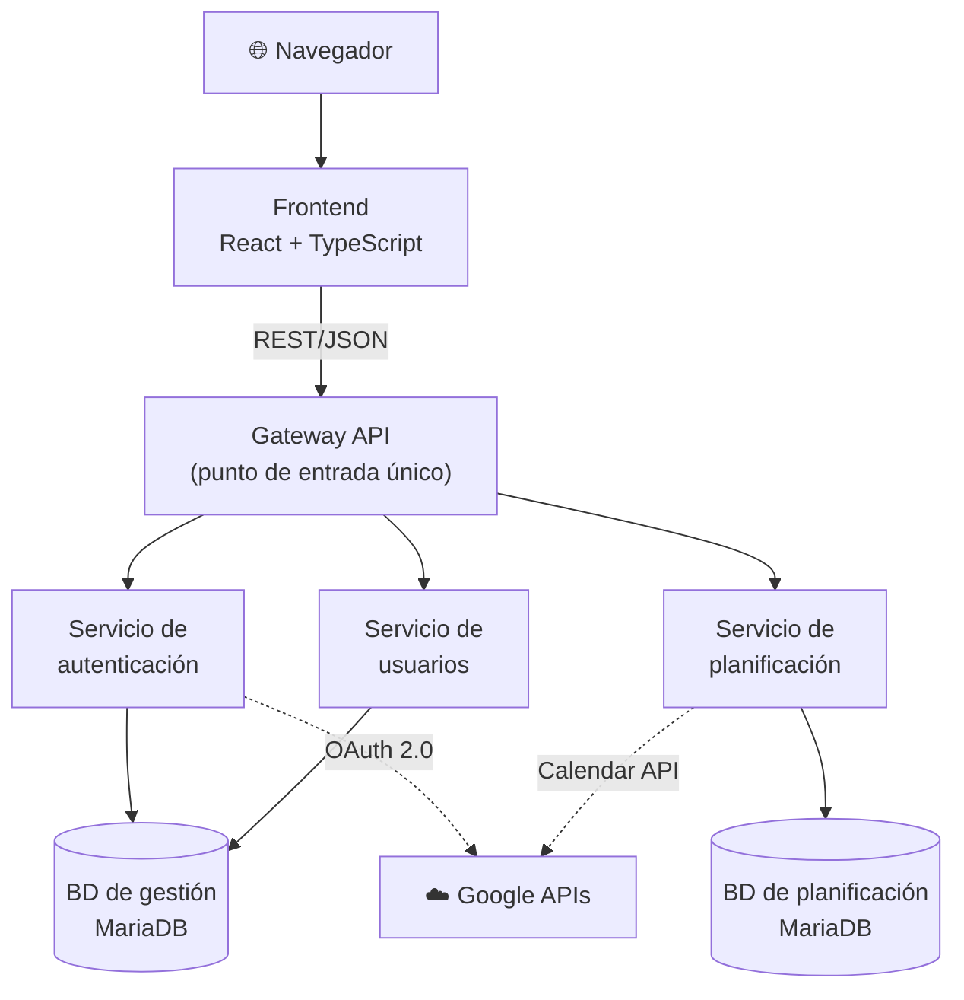

# Abstract

## TeachingPlanner: Sistema de Gestión de Horarios Académicos para la Escuela de Ingeniería Informática de la Universidad de Oviedo

---

La planificación y gestión de horarios académicos en una escuela universitaria es una tarea de considerable complejidad. No se trata simplemente de asignar horas a asignaturas: implica coordinar cientos de sesiones semanales repartidas en un número limitado de aulas con capacidades y equipamientos distintos, garantizando que no existan solapamientos ni incompatibilidades entre ellas. Cualquier error en este proceso, ya sea un solapamiento entre dos eventos en la misma aula, una clase asignada a un aula sin el equipamiento necesario, o una modificación de última hora no comunicada correctamente, tiene consecuencias directas y visibles para estudiantes, profesores y personal administrativo. Gestionar todo esto de forma eficiente y sin herramientas adecuadas es, en la práctica, una tarea que consume un tiempo y un esfuerzo desproporcionados.

Este proyecto surge precisamente para dar respuesta a esa necesidad concreta en la Escuela de Ingeniería Informática (EII) de la Universidad de Oviedo. Se trata de un encargo real de la propia institución, motivado por las limitaciones del sistema que se encuentra actualmente en funcionamiento y que, con el paso del tiempo, ha evidenciado carencias importantes que dificultan el trabajo del personal administrativo y docente del centro.

---

### La situación de partida

Para entender qué aporta este proyecto, es necesario conocer cómo funciona actualmente la gestión de horarios en la EII. La herramienta existente consta de dos componentes: un **visualizador público** sin autenticación, desplegado en los servidores de la universidad, que permite a cualquier persona consultar los horarios de los grupos del grado —con tres formatos de salida: lista web, tabla y CSV para Google Calendar— e incluye enlaces directos al sistema GIS de la universidad para localizar físicamente cada aula; y el conjunto de ficheros de texto que alimentan dicho visualizador, que deben mantenerse de forma enteramente manual. **No existe ninguna interfaz web de administración**: la componente pública del sistema es exclusivamente de lectura, y toda la gestión de datos se realiza en el nivel del sistema de ficheros, lo que presenta serias limitaciones que afectan tanto a la fiabilidad de los datos como a la experiencia de quienes deben mantenerlos a diario.

> 📷 **Figura sugerida 1 — Captura del visualizador público actual de la EII** (formato de lista o tabla), para mostrar la interfaz que se pretende sustituir.

El sistema actual se alimenta de **cinco ficheros de texto plano** por semestre, con el carácter `:` como separador de campos. Cada fichero tiene un propósito específico: `asignaturas.txt` recoge el catálogo de asignaturas con sus grupos de teoría, seminario, laboratorio y tutoría grupal, tanto en español como en inglés; `calendario.txt` contiene el calendario lectivo, con cada fecha etiquetada mediante un **código de letra** que indica si es festivo o qué tipo de grupo tiene clase ese día; `horarios.txt` define los eventos periódicos, vinculando cada grupo a un día de la semana, una franja horaria y un aula; `excepciones.txt` registra los eventos puntuales, incluida la posibilidad de eliminar un evento existente indicando −1 como hora de inicio; y `ubicaciones.txt` asocia cada aula con su URL en el sistema GIS de la universidad. Para modificar cualquiera de estos datos es necesario **conectarse por SSH al puerto 22 de la máquina virtual** que aloja la aplicación y editar directamente los ficheros con un editor de línea de comandos.

El aspecto más frágil de este diseño es el mecanismo de los **códigos de letra**: la periodicidad de los grupos no semanales depende de que el código asignado en `calendario.txt` y en `horarios.txt` sea exactamente el mismo en ambos ficheros. Cualquier divergencia tipográfica —una mayúscula distinta, un espacio de más— hace que el grupo desaparezca silenciosamente del horario publicado sin que el sistema emita ninguna advertencia. Este fallo es especialmente peligroso porque no produce ningún error visible: el horario simplemente muestra menos eventos de los esperados.

> 📷 **Figura sugerida 2 — Fragmento de `horarios.txt` o `calendario.txt` abierto en una sesión SSH**, para ilustrar el proceso de edición manual en línea de comandos.

Este enfoque presenta problemas graves desde varios ángulos. En primer lugar, **no existe ninguna validación de formato**: si al editar un fichero se introduce un error de sintaxis (un campo mal separado, una línea incompleta, un carácter incorrecto), el sistema no lo detecta ni avisa. El dato erróneo queda registrado silenciosamente y puede dar lugar a comportamientos inesperados en el horario mostrado. En segundo lugar, y quizás más importante, en el momento en que se guarda un cambio **no se comprueba si dicho cambio genera conflictos** con el resto de eventos del horario: un aula puede quedar reservada dos veces a la misma hora sin que el sistema emita ningún tipo de advertencia. La integridad del horario depende enteramente de la atención y el cuidado de quien lo edita.

A esto se suma otra limitación operativa de gran impacto en el día a día del centro: el proceso para solicitar cambios en los horarios. Cuando un docente necesita modificar una clase (cambiar el aula, el día, el horario, o cualquier otro parámetro), el canal habitual es el **correo electrónico**. El docente envía un mensaje a jefatura de estudios solicitando el cambio, y desde jefatura se comprueba manualmente si dicho cambio es viable, consultando el horario actual. Si no lo es, se responde indicándolo, el docente propone una alternativa, y así sucesivamente. Este proceso puede derivar en **hilos de correo largos y difíciles de gestionar**, que consumen tiempo tanto al docente como al personal administrativo, y en los que la posibilidad de malentendidos o de que algún mensaje quede sin respuesta es considerable. Además, el docente no dispone de ninguna herramienta para saber de antemano si su solicitud genera un conflicto: debe enviar el correo y esperar la respuesta para saberlo.

Cabe señalar que el sistema actual sí ofrece una funcionalidad de exportación a CSV, pensada para que los alumnos puedan importar su horario en herramientas como Google Calendar. Sin embargo, no existe ningún mecanismo en la interfaz para exportar los datos de vuelta al formato de los cinco ficheros `.txt`, lo que supone un problema de interoperabilidad relevante: existe otra aplicación en el ecosistema de la EII que también se alimenta de esos mismos ficheros, y cualquier cambio realizado en el sistema de horarios que no se propague manualmente a dichos ficheros puede dejar ambas aplicaciones desincronizadas.

Por último, el visualizador presenta limitaciones de usabilidad: la presentación de los eventos en formato de lista o tabla resulta poco intuitiva para obtener una visión rápida del horario semanal de un grupo, y la aplicación no está diseñada para funcionar en dispositivos móviles, lo que limita su accesibilidad en un entorno donde tanto docentes como alumnos consultan información habitualmente desde el teléfono.

> 📷 **Figura sugerida 3 — Captura del visualizador heredado en un dispositivo móvil**, mostrando la ausencia de diseño responsive.

---

### Qué es TeachingPlanner y qué aporta

TeachingPlanner es una **aplicación web** desarrollada desde cero para sustituir el sistema descrito y resolver todas las limitaciones mencionadas. No es una reforma o ampliación del visualizador existente, sino un sistema completo que, por primera vez, incorpora una **interfaz web de administración** junto a la consulta pública de horarios.

La premisa principal es sencilla: cualquier operación que actualmente requiere conectarse por SSH y editar ficheros de texto a mano debe poder realizarse desde una interfaz web clara, accesible desde cualquier navegador, sin necesidad de conocimientos técnicos avanzados. Eso incluye crear y modificar calendarios académicos, gestionar asignaturas, cursos y grupos, asignar aulas, y consultar o actualizar horarios, todo desde pantallas con formularios validados y retroalimentación inmediata. Al mismo tiempo, TeachingPlanner conserva y mejora lo que el visualizador heredado ofrecía: la consulta pública de horarios sin necesidad de autenticación, la exportación a CSV compatible con Google Calendar, y el acceso a la información geográfica de cada espacio docente.

> 📷 **Figura sugerida 4 — Vista principal del calendario semanal en TeachingPlanner**, mostrando la presentación de un horario de grupo frente al formato de lista del sistema anterior.

Uno de los pilares fundamentales de la aplicación es la **detección de conflictos en tiempo real**. Antes de confirmar cualquier asignación o cambio, el sistema comprueba automáticamente si existe alguna colisión con otros eventos ya registrados: dos clases en la misma aula a la misma hora u otro tipo de solapamiento. Esta validación ocurre de forma inmediata, en el mismo momento en que el usuario introduce los datos, lo que evita que errores de este tipo lleguen a guardarse y afecten al horario publicado.

> 📷 **Figura sugerida 5 — Diálogo de conflicto en tiempo real**, mostrando el aviso que recibe el usuario al intentar asignar un evento que choca con otro existente.

En relación con las solicitudes de cambio, TeachingPlanner incorpora un **sistema de solicitudes integrado** que reemplaza completamente el flujo basado en correo electrónico. Cuando un docente desea solicitar una modificación (cambiar el aula de una clase, mover una sesión a otro día, ajustar el horario), puede hacerlo directamente desde la propia aplicación. Antes de enviar la solicitud, el sistema le informa de inmediato si el cambio que está pidiendo genera algún conflicto con el horario existente, de modo que el docente puede ajustar su petición antes de enviarla. Una vez enviada, los administradores del sistema reciben la solicitud en su panel, pueden revisarla, aprobarla tal cual o con modificaciones, o rechazarla con una justificación. Todo este proceso queda registrado y es visible para ambas partes en todo momento, eliminando la ambigüedad y la dispersión propias del correo electrónico.

> 📷 **Figura sugerida 6 — Panel de solicitudes de cambio**, mostrando la vista del administrador con las solicitudes pendientes de revisión.

La aplicación define tres perfiles de usuario con niveles de acceso diferenciados. Los **administradores** tienen control total sobre el sistema: pueden crear y modificar todos los elementos (calendarios, asignaturas, cursos, grupos, aulas, usuarios) y gestionar las solicitudes de cambio. Los **docentes** pueden consultar los horarios de los grupos que tienen asignados, ver el calendario completo y crear solicitudes de cambio. Finalmente, cualquier persona puede acceder como **usuario anónimo** para consultar los horarios publicados sin necesidad de autenticarse, lo que facilita que estudiantes y cualquier interesado puedan ver el horario vigente sin barreras de acceso.

Entre las funcionalidades adicionales destaca la **integración con Google Calendar**: los **administradores** pueden conectar su cuenta de Google para sincronizar los horarios con Google Calendar, creando automáticamente **un Google Calendar por cada aula registrada** en la escuela. Esta funcionalidad es exclusiva del rol de administrador de forma deliberada: concentrar la sincronización en una única cuenta limita el número de llamadas a la API de Google Calendar, cuya cuota es compartida a nivel de proyecto de Google Cloud. Esta funcionalidad es fundamental porque existe otra aplicación en el ecosistema de la EII, utilizada por jefatura de estudios, que se alimenta directamente de estos calendarios de Google para su funcionamiento. Antes de TeachingPlanner, cuando se realizaba cualquier cambio en los ficheros `.txt`, ese cambio debía propagarse también manualmente al calendario de Google correspondiente, creando un proceso de doble mantenimiento costoso y propenso a desincronizaciones. Ahora, la sincronización elimina y recrea los eventos desde cero, lo que garantiza que el calendario de Google queda 100% sincronizado con el estado actual del sistema. La situación ideal sería sincronizar con cada cambio individual en el calendario, pero no resulta factible por el coste en número de llamadas que impondría a la cuota de la API.

Al igual que el sistema anterior, TeachingPlanner también permite la **exportación a CSV** compatible con Google Calendar, para que los alumnos puedan importar su horario personal directamente en cualquier herramienta de calendario.

La aplicación incorpora también la posibilidad de **importar y exportar los cinco ficheros `.txt`** del sistema heredado. La exportación genera una instantánea fiel del estado actual del calendario, respetando íntegramente las convenciones del formato original —incluido el mecanismo de códigos-letra— lo que permite que otras herramientas del ecosistema de la EII que dependen de ese formato continúen funcionando sin ninguna adaptación. La importación facilita la adopción sin fricciones: el personal puede cargar los datos del semestre en curso y comenzar a operar de inmediato, sin tener que reintroducir la información desde cero.

El sistema también incorpora un **registro de actividad** completo que guarda un historial de todas las modificaciones realizadas, con información del usuario que las efectuó y la fecha y hora correspondiente, lo que facilita la trazabilidad y la auditoría de cambios.

En cuanto a la experiencia de usuario, se ha prestado especial atención a que la interfaz sea clara, moderna e intuitiva, mejorando significativamente la visualización del sistema anterior. La presentación de los horarios en formato calendario es visualmente coherente y fácil de interpretar. Además, la aplicación es completamente **responsive**: está diseñada para adaptarse a cualquier tamaño de pantalla y funciona correctamente en dispositivos móviles, algo que el sistema actual no contemplaba en absoluto. La interfaz está además completamente **internacionalizada**: toda la aplicación está disponible en español e inglés, lo que permite su uso tanto por personal y alumnado hispanohablante como por quienes forman parte de los grupos del programa en inglés de la EII.

> 📷 **Figura sugerida 7 — TeachingPlanner en dispositivo móvil**, mostrando la vista del calendario adaptada a pantalla pequeña.

---

### Aspectos técnicos relevantes

Desde el punto de vista técnico, TeachingPlanner está construida sobre una **arquitectura de microservicios**: el sistema utiliza un **gateway de API** como punto de entrada único y tres servicios de dominio independientes (autenticación, gestión de usuarios y planificación), cada uno con su propia base de datos MariaDB y su propio contenedor Docker. El frontend es una aplicación React con TypeScript, servida de forma independiente. Esta separación facilita el mantenimiento y permite que cada parte del sistema evolucione de forma autónoma.

Todo el entorno está **contenerizado con Docker** y orquestado mediante Docker Compose, con configuraciones diferenciadas para entornos de desarrollo, despliegue en Azure y servidor propio. Esto simplifica enormemente la instalación y el mantenimiento del sistema en cualquier infraestructura.

El proyecto incorpora un **pipeline de integración y despliegue continuo (CI/CD) implementado con GitHub Actions**, con múltiples etapas que incluyen análisis estático del código, comprobaciones de calidad y seguridad, y despliegue automatizado. La calidad del código es monitorizada mediante **SonarQube**, integrado en el propio pipeline, lo que garantiza un estándar de calidad sostenido a lo largo del desarrollo.

*Figura 8 — Arquitectura simplificada de TeachingPlanner: gateway como punto de entrada único hacia los tres servicios de dominio, sus bases de datos y las APIs externas de Google.*

---

### Estado actual y perspectivas

TeachingPlanner es un proyecto para un cliente real: la Escuela de Ingeniería Informática de la Universidad de Oviedo. La aplicación está actualmente **desplegada en una máquina virtual de la universidad**, accesible a través de la VPN institucional (FortiClient / GlobalProtect de la UO), que es la misma infraestructura de red privada que se utiliza en algunas asignaturas del propio grado.

Como parte del proceso de presentación a la institución, se ha realizado una **charla informativa dirigida a personal de la universidad** para presentar la aplicación, explicar su funcionamiento y plantear su adopción como sustituto del sistema actual. Esta presentación supone un primer paso concreto hacia la puesta en producción de la herramienta en el entorno real para el que fue diseñada.

En definitiva, TeachingPlanner es una solución completa, moderna y en producción real, que responde a una necesidad concreta y documentada de la EII de la Universidad de Oviedo. Sustituye un sistema con limitaciones operativas importantes por una herramienta robusta, usable y mantenible, que mejora tanto la fiabilidad de los datos como los procesos de trabajo del personal implicado en la gestión de horarios académicos. Su despliegue en la infraestructura universitaria y la presentación formal a la institución suponen el primer paso hacia su adopción definitiva como sistema oficial de gestión de horarios del centro.
