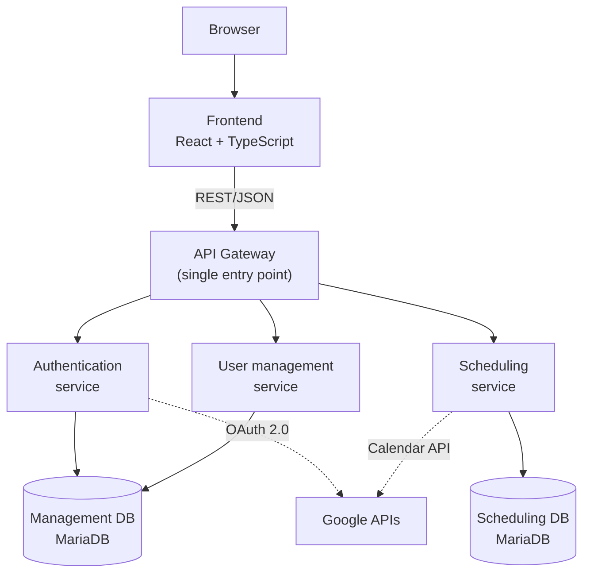

# Chapter 1: GENERAL DESCRIPTION

## TeachingPlanner: Academic Schedule Management System for the School of Computer Engineering at the University of Oviedo

---

Planning and managing academic schedules at a university school is a task of considerable complexity. It is not simply a matter of assigning hours to subjects: it involves coordinating hundreds of weekly sessions across a limited number of classrooms with different capacities and equipment, ensuring that no overlaps or incompatibilities exist between them. Any error in this process, whether a clash between two events in the same room, a class assigned to a classroom without the necessary equipment, or a last-minute change that is not properly communicated, has direct and visible consequences for students, teaching staff, and administrative personnel. Managing all of this efficiently without adequate tools is, in practice, a task that consumes a disproportionate amount of time and effort.

This project was created precisely to address that specific need at the School of Computer Engineering (EII) of the University of Oviedo. It is a real institutional commission, motivated by the limitations of the system currently in use, which over time has revealed significant shortcomings that hinder the daily work of the school's administrative and teaching staff.

---

### The starting point

To understand what this project contributes, it is necessary to know how schedule management currently works at the EII. The existing tool consists of two components: a **public viewer** with no authentication, deployed on the university's servers, that allows anyone to consult the degree timetables in three output formats (web list, table, and CSV for Google Calendar) and includes direct links to the university's GIS system to physically locate each classroom; and the set of text files that feed that viewer, which must be maintained entirely by hand. **There is no web administration interface**: the public component of the system is read-only, and all data management takes place at the file system level, which presents serious limitations affecting both data reliability and the experience of those who must maintain it daily.

> 📷 **Suggested figure 1: Screenshot of the current EII public viewer** (list or table format), showing the interface this project replaces.

The current system is fed by **five plain-text files** per semester, using `:` as a field separator. Each file has a specific purpose: `asignaturas.txt` contains the subject catalogue with their theory, seminar, laboratory, and group tutorial groups in both Spanish and English; `calendario.txt` holds the academic calendar, with each date labelled with a **letter code** indicating whether it is a holiday or which type of group has class that day; `horarios.txt` defines the recurring events, linking each group to a day of the week, a time slot, and a classroom; `excepciones.txt` records one-off events, including the option to remove an existing event by specifying -1 as the start time; and `ubicaciones.txt` maps each classroom to its URL in the university GIS system. To modify any of this data, it is necessary to **connect via SSH to port 22 of the virtual machine** hosting the application and edit the files directly using a command-line editor.

The most fragile aspect of this design is the **letter code mechanism**: the recurrence pattern of non-weekly groups depends on the code assigned in `calendario.txt` and `horarios.txt` being exactly the same in both files. Any typographical discrepancy, such as a different capitalisation or an extra space, causes the group to silently disappear from the published timetable without the system issuing any warning. This failure is particularly dangerous because it produces no visible error: the timetable simply shows fewer events than expected.

> 📷 **Suggested figure 2: Fragment of `horarios.txt` or `calendario.txt` open in an SSH session**, illustrating the manual command-line editing process.

This approach presents serious problems from several angles. First, **there is no format validation**: if a syntax error is introduced while editing a file, such as a misplaced separator, an incomplete line, or an incorrect character, the system neither detects it nor raises an alert. The erroneous data is silently recorded and can lead to unexpected behaviour in the displayed timetable. Second, and perhaps more importantly, when a change is saved **no check is made to see whether that change creates conflicts** with the rest of the schedule: a classroom can be double-booked at the same time without the system issuing any kind of warning. The integrity of the timetable depends entirely on the care and attention of the person editing it.

A further operational limitation with significant day-to-day impact concerns the process for requesting schedule changes. When a member of teaching staff needs to modify a class, whether to change the room, the day, the time, or any other parameter, the usual channel is **email**. The teacher sends a message to the head of studies requesting the change, and the head of studies manually checks whether the change is feasible by consulting the current timetable. If it is not, a reply is sent, the teacher proposes an alternative, and so on. This process can result in **long and unwieldy email threads** that consume time for both the teacher and the administrative staff, and in which the possibility of misunderstandings or unanswered messages is considerable. Furthermore, the teacher has no way of knowing in advance whether a request will cause a conflict: they must send the email and wait for a reply to find out.

It should also be noted that the current system does offer a CSV export feature, designed to allow students to import their timetable into tools such as Google Calendar. However, there is no mechanism in the interface to export data back to the format of the five `.txt` files, which creates a relevant interoperability problem: there is another application in the EII ecosystem that also relies on those same files, and any change made in the schedule system that is not manually propagated to those files can leave both applications out of sync.

Finally, the viewer has usability limitations: the presentation of events in list or table format is not intuitive for getting a quick overview of a group's weekly timetable, and the application is not designed to work on mobile devices, which limits its accessibility in an environment where both teaching staff and students routinely look up information on their phones.

> 📷 **Suggested figure 3: Screenshot of the legacy viewer on a mobile device**, showing the lack of responsive design.

---

### What TeachingPlanner is and what it brings

TeachingPlanner is a **web application** built from scratch to replace the system described above and resolve all of the limitations mentioned. It is not a reform or extension of the existing viewer but a complete system that, for the first time, combines a **web administration interface** with the public timetable view.

The core premise is straightforward: any operation that currently requires an SSH connection and manual file editing should be possible from a clear web interface, accessible from any browser, without requiring advanced technical knowledge. This includes creating and modifying academic calendars, managing subjects, courses, and groups, assigning classrooms, and viewing or updating timetables, all from screens with validated forms and immediate feedback. At the same time, TeachingPlanner preserves and improves what the legacy viewer offered: public timetable access without authentication, CSV export compatible with Google Calendar, and access to the geographical information for each teaching space.

> 📷 **Suggested figure 4: Main weekly calendar view in TeachingPlanner**, showing the group timetable presentation compared to the list format of the previous system.

One of the fundamental pillars of the application is **real-time conflict detection**. Before confirming any assignment or change, the system automatically checks whether a collision exists with other already-registered events, such as two classes in the same room at the same time or any other kind of overlap. This validation happens immediately, at the moment the user enters the data, preventing errors of this kind from being saved and affecting the published timetable.

> 📷 **Suggested figure 5: Real-time conflict dialogue**, showing the warning a user receives when attempting to assign an event that clashes with an existing one.

Regarding change requests, TeachingPlanner includes an **integrated request system** that completely replaces the email-based workflow. When a member of teaching staff wants to request a modification, such as changing the room for a class, moving a session to another day, or adjusting the time, they can do so directly from within the application. Before submitting the request, the system immediately informs them whether the change they are requesting creates any conflict with the existing timetable, so they can adjust their request before sending it. Once submitted, administrators receive the request in their panel and can review it, approve it as submitted or with modifications, or reject it with a justification. The entire process is recorded and visible to both parties at all times, eliminating the ambiguity and fragmentation inherent in email.

> 📷 **Suggested figure 6: Change request panel**, showing the administrator's view with pending requests.

The application defines three user profiles with differentiated access levels. **Administrators** have full control over the system: they can create and modify all elements including calendars, subjects, courses, groups, classrooms, and users, and they manage change requests. **Teachers** can consult the full calendar, use the filter panel to locate the groups they teach, and submit change requests. Finally, anyone can access the system as an **anonymous user** to view the published timetables without authenticating, making it easy for students and anyone else to see the current timetable without any barriers.

Among the additional features, the **Google Calendar integration** stands out: administrators can connect their Google account to synchronise timetables with Google Calendar, automatically creating **one Google Calendar per registered classroom** in the school. This feature is intentionally restricted to the administrator role: concentrating synchronisation in a single account limits the number of calls to the Google Calendar API, whose quota is shared at the Google Cloud project level. This functionality is essential because there is another application in the EII ecosystem, used by the head of studies, that depends directly on these Google Calendars to operate. Before TeachingPlanner, any change made to the `.txt` files also had to be manually propagated to the corresponding Google Calendar, creating a costly double-maintenance process prone to desynchronisation. Now, the synchronisation deletes and recreates events from scratch, guaranteeing that the Google Calendar is 100% in sync with the current state of the system. Synchronising on each individual change would be the ideal approach, but it is not feasible given the cost in API quota calls that it would impose.

Like the previous system, TeachingPlanner also supports **CSV export** compatible with Google Calendar, so that students can import their personal timetable directly into any calendar application.

The application also includes the ability to **import and export the five legacy `.txt` files**. The export generates a faithful snapshot of the current calendar state, fully respecting the conventions of the original format, including the letter-code mechanism, which allows other tools in the EII ecosystem that depend on that format to continue working without any adaptation. The import feature enables friction-free adoption: staff can load the current semester's data and start working immediately, without having to re-enter information from scratch.

The system also includes a complete **activity log** that maintains a history of all modifications made, with information about the user who made them and the corresponding date and time, facilitating traceability and change auditing.

Particular attention has been paid to making the interface clear, modern, and intuitive, significantly improving on the presentation of the legacy system. The calendar format for displaying timetables is visually coherent and easy to interpret. The application is also fully **responsive**: it is designed to adapt to any screen size and works correctly on mobile devices, something the current system did not address at all. The interface is also fully **internationalised**: the entire application is available in both Spanish and English, enabling its use by both Spanish-speaking staff and students and by those participating in the EII's English-language programme.

> 📷 **Suggested figure 7: TeachingPlanner on a mobile device**, showing the calendar view adapted to a small screen.

---

### Key technical aspects

From a technical standpoint, TeachingPlanner is built on a **microservices architecture**: the system uses an **API gateway** as a single entry point and three independent domain services (authentication, user management, and scheduling), each with its own MariaDB database and its own Docker container. The frontend is a React application with TypeScript, served independently. This separation facilitates maintenance and allows each part of the system to evolve autonomously.

The entire environment is **containerised with Docker** and orchestrated using Docker Compose, with separate configurations for development, Azure deployment, and self-hosted server environments. This greatly simplifies installation and maintenance on any infrastructure.

The project includes a **CI/CD pipeline implemented with GitHub Actions**, with multiple stages covering static code analysis, quality and security checks, and automated deployment. Code quality is monitored via **SonarQube**, integrated into the pipeline itself, ensuring a sustained quality standard throughout development.

*Figure 8: Simplified TeachingPlanner architecture: gateway as the single entry point to the three domain services, their databases, and the external Google APIs.*

---

### Current status and outlook

TeachingPlanner is a project for a real client: the School of Computer Engineering at the University of Oviedo. The application is currently **deployed on a university virtual machine**, accessible through the institutional VPN (FortiClient / GlobalProtect), which is the same private network infrastructure used in some of the degree's own courses.

As part of the process of presenting the system to the institution, an **informational session for university staff** was held to introduce the application, explain how it works, and propose its adoption as a replacement for the current system. This presentation represents a concrete first step towards putting the tool into production in the real environment for which it was designed.

TeachingPlanner is a complete, modern, and genuinely deployed solution that addresses a concrete and documented need at the EII of the University of Oviedo. It replaces a system with significant operational limitations with a robust, usable, and maintainable tool that improves both data reliability and the working processes of the staff involved in academic schedule management. Its deployment on the university infrastructure and formal presentation to the institution mark the first step towards its definitive adoption as the school's official schedule management system.
