# Capítulo 2 — PLANNING AND MANAGEMENT (PLANIFICACIÓN Y GESTIÓN)

## 2.1 PROJECT PLANNING

This chapter covers the full planning and management of TeachingPlanner. Section 2.1 documents the initial plan: resources, work breakdown, schedule, risks, and budget. Section 2.2 records what actually happened during development: the incidents that arose and how they were managed. Section 2.3 closes the project with a comparison of plan versus reality, the final cost, and the key lessons learned.

**Project:** Academic Planning Management System: TeachingPlanner  
**Type:** Bachelor's Final Project (TFG)  
**Institution:** School of Computer Engineering, University of Oviedo  
**Start date:** 01/06/2025  
**End date:** 22/05/2026  
**Total duration:** 355 calendar days (approx. 51 weeks), with a critical path of 44.38 working days (MS Project, 1 h/day calendar)  
**Total estimated work:** 365.25 hours

*Note: Hours reflect the estimated real effort for development, documentation, and testing.*

### 2.1.1 Resources

#### 2.1.1.1 Work Resources

All roles were assumed by the same person throughout the project. The table below lists each one alongside its function.

*Table 2.1: Work roles and their function in the TFG*

| Initials | Role | Function in the TFG |
|----------|------|---------------------|
| PM | Project Manager | Planning, monitoring, meetings with supervisor |
| SA | Systems Analyst | Requirements analysis, system scope |
| ARCH | Software Architect | Microservices architecture design |
| TC | Technology Consultant | Technology decisions, stack, external APIs |
| DEV | Developer | Implementation of all microservices |
| GD | Graphic Designer | Interface design, wireframes, and prototypes |
| T | Tester | Integration, acceptance, E2E, and security testing |
| AS | Systems Administrator | Infrastructure configuration, containers, and continuous deployment |

#### 2.1.1.2 Material Resources

No hardware was purchased for the project. Two devices already available were used throughout:

*Table 2.2: Material resources*

| Resource | Use in the project |
|----------|--------------------|
| Desktop computer | All development, testing, and documentation work |
| Mobile device | Validation of the frontend responsive design |

#### 2.1.1.3 Cost Resources

All software tools and hosting were free of charge through academic programmes, so infrastructure costs were zero.

*Table 2.3: Cost resources: market price vs. actual cost*

| Resource | Market price | Actual cost | Note |
|----------|--------------|-------------|------|
| VM Azure B2s | ~€15/month | €0 | Initial deployment, covered by Azure for Students credit (€100) |
| EII Server | ~€15/month | €0 | Final production VM provided by the EII IT systems team |
| GitHub Pro | ~$4/month | €0 | Free licence via GitHub Student Developer Pack |
| Microsoft Project 2019 | ~€30/month | €0 | Academic licence included by the University of Oviedo |

### 2.1.2 Methodology

The project used an iterative and incremental approach, adapted to a single-developer setting. Rather than front-loading the full analysis, each service was designed, built and tested in sequence, with the next one starting only once the previous was stable enough to build on. GitHub Actions ran on every merge for continuous integration, and GitHub Issues served as the task backlog, reviewed at each supervisor meeting.

The plan was kept flexible, and design decisions were revisited during construction whenever the real complexity of a feature exceeded expectations. Documentation ran in parallel with the early technical phases, and formal testing was reserved until construction was complete.

The overall project management phase (1.1) runs in parallel with every other phase from start to finish. Within it, each technical phase has a dedicated management sub-group that starts at the same time as that phase: documentation management (1.1.2) alongside the documentation phase (1.2), analysis management (1.1.3) alongside system analysis (1.3), design management (1.1.5) alongside design and architecture (1.4), construction management (1.1.6) alongside construction (1.5), and testing management (1.1.7) alongside testing (1.6). This parallel structure is reflected in the Start-to-Start predecessor links in the task tables and is clearly visible in the Gantt charts in Section 2.1.6.

Table 2.4 lists the nine iterations with their main deliverable and calendar period.

*Table 2.4: Development iterations and periods*

| Iteration | Deliverable | Period |
|-----------|-------------|--------|
| 0 | Project setup, infrastructure, CI/CD pipeline | Jun–Aug 2025 |
| 1 | Gateway Service | Oct 2025 |
| 2 | Auth Service | Oct–Nov 2025 |
| 3 | User Service | Nov 2025 |
| 4 | Planner Service — base + academic structure | Nov–Dec 2025 |
| 5 | Planner Service — calendars, events, conflict detection | Dec 2025–Jan 2026 |
| 6 | Planner Service — change requests + Google Calendar sync | Jan–Mar 2026 |
| 7 | Webapp | Mar–Apr 2026 |
| 8 | Testing and bug fixing | Apr–May 2026 |

### 2.1.3 Responsibility Matrices

The matrices below map each task group to the roles involved in it. An X marks participation. The column headers use the role abbreviations defined in Table 2.1 (PM, SA, ARCH, TC, DEV, GD, T). Since all roles are performed by the same person, these matrices show the logical division of responsibility rather than the distribution of work between individuals.

*Tables 2.5a–2.5f: Responsibility matrices by phase*

**Phase 1.1: Project management**

| Task group | PM | SA | ARCH | TC | DEV | GD | T |
|---|---|---|---|---|---|---|---|
| Project initiation (kick-off, scope, meetings) | X | | | | | | |
| Phase monitoring (documentation, analysis, design, construction, testing) | X | X | X | X | X | | X |
| Infrastructure acquisition and setup | X | | | | X | | |
| Project closure | X | | | | | | |

**Phase 1.2: Documentation**

| Task group | PM | SA | ARCH | TC | DEV | GD | T |
|---|---|---|---|---|---|---|---|
| TFG report | X | X | X | X | X | | |
| Technical manuals (installation, configuration, user) | X | | | | X | | |
| REST API and integration documentation | X | | X | | X | | |
| Data model and migrations documentation | X | | X | | X | | |

**Phase 1.3: System analysis**

| Task group | PM | SA | ARCH | TC | DEV | GD | T |
|---|---|---|---|---|---|---|---|
| Current system analysis and scope definition | X | X | | | | | |
| Technology alternatives study and stack selection | X | | | X | | | |
| Functional and non-functional requirements | X | X | | | | | |
| Risk assessment and modules identification | X | X | | | | | |
| Data model definition | X | | X | | | | |

**Phase 1.4: Design and architecture**

| Task group | PM | SA | ARCH | TC | DEV | GD | T |
|---|---|---|---|---|---|---|---|
| System architecture and ADRs | X | | X | | | | |
| Use cases | X | X | | | | | |
| State and flow diagrams | X | | X | | X | | |
| User interface design and prototypes | X | | | | | X | |

**Phase 1.5: Construction**

| Task group | PM | SA | ARCH | TC | DEV | GD | T |
|---|---|---|---|---|---|---|---|
| All service implementation tasks | X | | X | | X | | |
| UI implementation (Webapp) | X | | X | | X | X | |

**Phase 1.6: Testing**

| Task group | PM | SA | ARCH | TC | DEV | GD | T |
|---|---|---|---|---|---|---|---|
| Integration, acceptance, E2E, and security tests | X | | | | X | | X |
| Bug fixing | X | | | | | | X |

### 2.1.4 Stakeholder Identification

A total of six stakeholders were identified for TeachingPlanner: the Head of Studies of the EII, the teaching staff, students and the general public, other applications in the EII ecosystem that depend on the system's outputs, the university IT service (SUTIC), and the development team. Identifying them early helped align expectations and shape the solution around the people who actually depend on it. Their roles, interests and influence on the requirements are described in full in Section 3.1.4 of the Stakeholder Requirements chapter.

### 2.1.5 OBS and PBS

#### 2.1.5.1 Organisation Breakdown Structure (OBS)

Although a single person carried out all the work, defining an organisational hierarchy makes it clear how decisions were structured. The Project Manager coordinated all other roles, the Software Architect supervised the implementation side, and technology choices went through the Architect and the Technology Consultant.

*Figure 2.1: Organisation breakdown structure (OBS)*

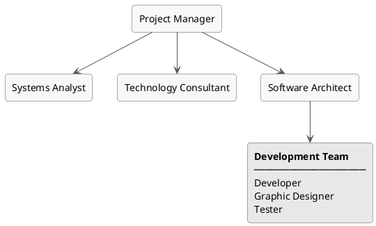

#### 2.1.5.2 Product Breakdown Structure (PBS)

While the WBS organises the work to be done, the PBS organises what the project actually produces. The two diagrams below show the eight product families at a high level, then expand each into its individual deliverables.

*Figure 2.2: PBS overview: eight product families*

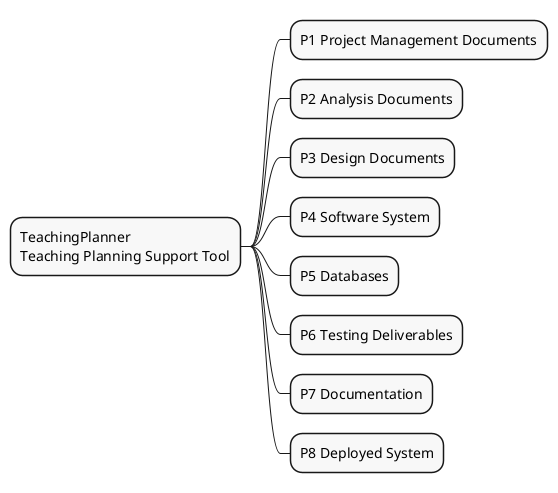

*Figure 2.3: PBS detail: deliverables per product family*

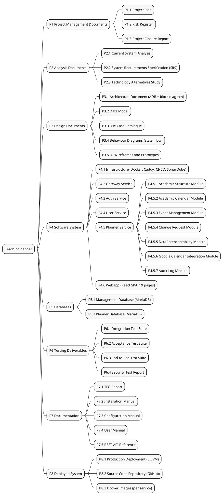

### 2.1.6 Initial Planning: Work Breakdown Structure (WBS)

The Work Breakdown Structure organises all project tasks into a hierarchy of phases and sub-tasks. To keep each diagram readable, the WBS is presented in multiple parts: the first shows the six top-level phases, and the diagrams that follow expand each one down to individual task level.

*Figure 2.4: WBS overview: six top-level phases*

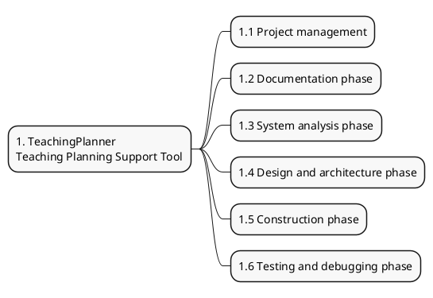

##### Phase 1.1: Project management

The management phase spans the entire project timeline, from kick-off to formal closure, and is organised into eight sub-groups: project initiation, one monitoring checkpoint per technical phase, infrastructure setup, and formal closure.

*Figure 2.5: WBS 1.1: Project management*

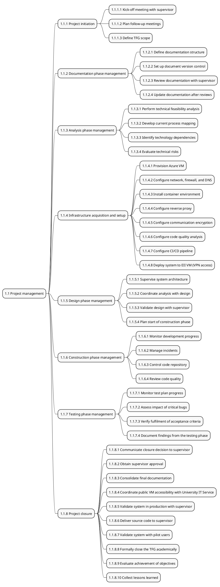

##### Phase 1.2: Documentation

This phase runs in parallel with the project initiation and the early analysis phase. It covers the TFG report, installation and configuration manuals, the user manual, the REST API reference, and the data model documentation.

*Figure 2.6: WBS 1.2: Documentation phase*

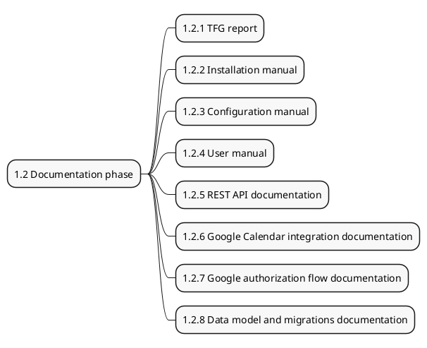

##### Phase 1.3: System analysis

This phase defines the scope and requirements before construction begins. It covers the current-system study, technology selection, functional and non-functional requirements, risk assessment, and the data model.

*Figure 2.7: WBS 1.3: System analysis phase*

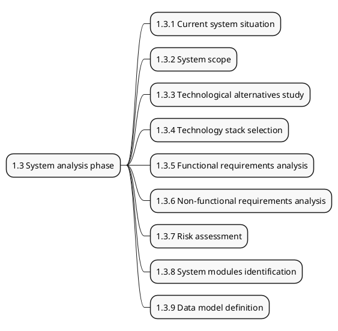

##### Phase 1.4: Design and architecture

This phase produces the architectural decisions (including ADRs), behavioural diagrams, and UI prototypes that guide the construction phase.

*Figure 2.8: WBS 1.4: Design and architecture phase*

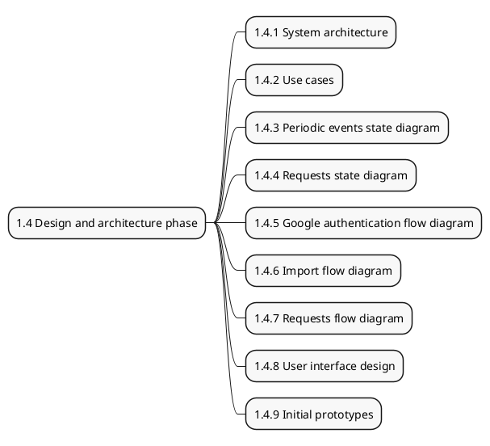

##### Phase 1.5: Construction

The construction phase is the largest in the project. Five services are built in sequence. This diagram shows the Gateway, Auth, and User services. The Planner Service and the Webapp are expanded in the diagrams that follow.

*Figure 2.9: WBS 1.5 (part 1): Gateway, Auth, and User services*

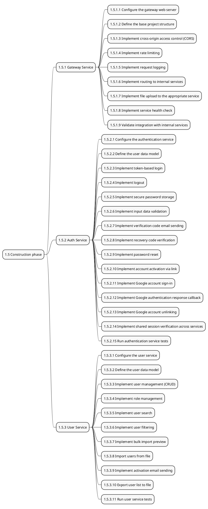

##### Phase 1.5 (continued): Planner Service

The Planner Service is the most complex component in the system. It manages academic calendars, one-off and periodic events, change requests, legacy file import/export, and Google Calendar synchronisation across thirteen sub-modules. Due to its size, its WBS diagram (Figure 2.10) covers all thirteen sub-modules and the Gantt screenshots below it are split into two parts for readability.

*Figure 2.10: WBS 1.5 (part 2): Planner Service*

```plantuml
@startmindmap
left to right direction
<style>
mindmapDiagram {
  .root {
    BackgroundColor #E8E8E8
    BorderColor #555555
  }
  node {
    BackgroundColor #F8F8F8
    BorderColor #555555
    FontName Arial
  }
}
</style>
+ 1.5.4 Planner Service
++ 1.5.4.1 Base configuration
+++ 1.5.4.1.1 Configure the planner service web server
+++ 1.5.4.1.2 Configure the planner database connection
+++ 1.5.4.1.3 Define the planner service data model
+++ 1.5.4.1.4 Implement change audit log
++ 1.5.4.2 Degree management
+++ 1.5.4.2.1 Implement degree CRUD
++ 1.5.4.3 Academic year management
+++ 1.5.4.3.1 Implement academic year CRUD
++ 1.5.4.4 Subject management
+++ 1.5.4.4.1 Implement subject CRUD
+++ 1.5.4.4.2 Implement subject query with associated groups
++ 1.5.4.5 Subject group management
+++ 1.5.4.5.1 Implement group CRUD
+++ 1.5.4.5.2 Implement group hour budget update
+++ 1.5.4.5.3 Validate hour budget per group
++ 1.5.4.6 Classroom management
+++ 1.5.4.6.1 Implement classroom CRUD
+++ 1.5.4.6.2 Implement classroom deletion with cascade removal
+++ 1.5.4.6.3 Implement classroom conflict detection
++ 1.5.4.7 Academic calendar management
+++ 1.5.4.7.1 Implement calendar CRUD
+++ 1.5.4.7.2 Implement school day management
+++ 1.5.4.7.3 Create calendar by importing legacy system files
+++ 1.5.4.7.4 Create calendar by duplicating another year's structure
+++ 1.5.4.7.5 Import event exceptions into an existing calendar
+++ 1.5.4.7.6 Implement active calendar filtering
+++ 1.5.4.7.7 Implement public calendar view
++ 1.5.4.8 Legacy format import
+++ 1.5.4.8.1 Read and process legacy system text files
+++ 1.5.4.8.2 Validate structure and consistency of imported files
+++ 1.5.4.8.3 Import subjects and groups from file
+++ 1.5.4.8.4 Import events and exceptions from file
++ 1.5.4.9 Legacy format export
+++ 1.5.4.9.1 Generate legacy system files and package as ZIP
++ 1.5.4.10 One-off event management
+++ 1.5.4.10.1 Define the one-off event data model
+++ 1.5.4.10.2 Implement one-off event CRUD
+++ 1.5.4.10.3 Implement event types
+++ 1.5.4.10.4 Implement one-off event cancellation
+++ 1.5.4.10.5 Implement atomic substitution of a periodic event occurrence
+++ 1.5.4.10.6 Implement conflict detection utility
+++ 1.5.4.10.7 Integrate conflict detection into one-off events
++ 1.5.4.11 Periodic event management
+++ 1.5.4.11.1 Define the periodic event data model
+++ 1.5.4.11.2 Implement event recurrence types (N, P, I)
+++ 1.5.4.11.3 Implement planned hours logic
+++ 1.5.4.11.4 Implement fair distribution of events within the same group
+++ 1.5.4.11.5 Implement periodic event CRUD
+++ 1.5.4.11.6 Implement custom recurrence periodic event
+++ 1.5.4.11.7 Integrate conflict detection into periodic events
++ 1.5.4.12 Change request module
+++ 1.5.4.12.1 Define the change request data model
+++ 1.5.4.12.2 Implement event creation request
+++ 1.5.4.12.3 Implement event edit request
+++ 1.5.4.12.4 Implement event cancellation request
+++ 1.5.4.12.5 Implement event substitution request
+++ 1.5.4.12.6 Implement conflict detection in change requests
+++ 1.5.4.12.7 Implement request listing
+++ 1.5.4.12.8 Implement pending request preview on the calendar
+++ 1.5.4.12.9 Implement request approval
+++ 1.5.4.12.10 Implement request rejection
+++ 1.5.4.12.11 Implement pending request deletion by the teacher
++ 1.5.4.13 Google Calendar integration
+++ 1.5.4.13.1 Configure project in Google Cloud Console
+++ 1.5.4.13.2 Configure external calendar service access
+++ 1.5.4.13.3 Configure Google account access authorisation
+++ 1.5.4.13.4 Sync events to Google Calendar
+++ 1.5.4.13.5 Implement access credential storage
+++ 1.5.4.13.6 Implement automatic credential renewal
+++ 1.5.4.13.7 Define the synchronisation data model
+++ 1.5.4.13.8 Implement periodic sync task
+++ 1.5.4.13.9 Implement one external calendar per classroom
+++ 1.5.4.13.10 Implement Google account unlinking
+++ 1.5.4.13.11 Run Google Calendar integration tests
@endmindmap
```

##### Phase 1.5 (continued): Webapp

The Webapp is a React single-page application with 19 pages covering authentication, user management, academic structure, calendar management, event scheduling, change requests, Google Calendar synchronisation, and the public timetable view.

*Figure 2.11: WBS 1.5 (part 3): Webapp*

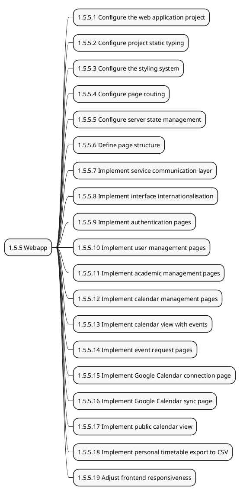

##### Phase 1.6: Testing and debugging

This phase begins once construction is complete. It covers integration, acceptance, end-to-end, and security testing, followed by a bug-fixing task. Its corresponding management block (1.1.7) runs in parallel via a Start-to-Start link.

*Figure 2.12: WBS 1.6: Testing and debugging phase*

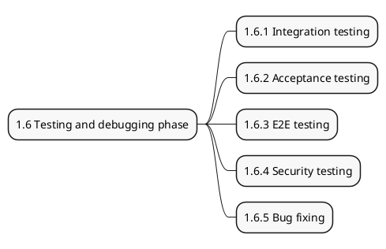

#### 2.1.6.1 Detailed Task Planning

Each phase is illustrated with two screenshots from Microsoft Project 2019: first a table view showing the task details, then the Gantt chart showing the timeline and dependencies. The role initials in the Resource Names column correspond to those defined in Table 2.1. In the Predecessors column, a plain number indicates a Finish-to-Start dependency (the predecessor must finish before the task starts), while the CC suffix denotes a Start-to-Start dependency (both tasks begin at the same time), used here to express the parallel relationship between each phase and its corresponding management block.

---

> **[CAPTURA — G0-tabla: Vista general — tabla de fases]**
> Vista Hoja de tareas. Vista → Esquema → Nivel 1: mostrar solo las 8 filas de resumen.
> Columnas: Número de esquema, Nombre de tarea, Duración, Comienzo, Fin, Trabajo.

*Figure: Task table — project overview (all phases)*

> **[CAPTURA — G0-gantt: Vista general — diagrama de Gantt]**
> Vista Diagrama de Gantt. Mismo nivel de esquema (Nivel 1).
> Ocultar la tabla izquierda al mínimo; mostrar solo las barras de Gantt con etiquetas de nombre.
> Escala temporal: trimestres/meses. Rango: 01/06/2025 – 22/05/2026.

*Figure: Gantt chart — project overview (all phases)*

---

##### Phase 1.1: Project management

This phase runs across the entire project timeline and covers initiation, one monitoring checkpoint per technical phase, infrastructure setup, and formal closure. Total effort: 19 hours.

> **[CAPTURA — G1a-tabla: Gestión del proyecto, parte 1/2 — tabla]**
> Vista Hoja de tareas. Expandir únicamente la fase 1.1, IDs 2–25.
> Columnas: Número de esquema, Nombre de tarea, Duración, Comienzo, Fin, Predecesoras, Nombres de los recursos, Trabajo.

*Figure: Task table — phase 1.1 Project management (part 1/2: IDs 2–25)*

> **[CAPTURA — G1a-gantt: Gestión del proyecto, parte 1/2 — Gantt]**
> Vista Diagrama de Gantt. Mismas tareas (IDs 2–25).
> Escala temporal: semanas. Rango: 01/06/2025 – 12/08/2025.

*Figure: Gantt chart — phase 1.1 Project management (part 1/2: IDs 2–25)*

> **[CAPTURA — G1b-tabla: Gestión del proyecto, parte 2/2 — tabla]**
> Vista Hoja de tareas. IDs 26–51 (gestión de diseño, construcción, pruebas y cierre).
> Columnas: Número de esquema, Nombre de tarea, Duración, Comienzo, Fin, Predecesoras, Nombres de los recursos, Trabajo.

*Figure: Task table — phase 1.1 Project management (part 2/2: IDs 26–51)*

> **[CAPTURA — G1b-gantt: Gestión del proyecto, parte 2/2 — Gantt]**
> Vista Diagrama de Gantt. Mismas tareas (IDs 26–51).
> Escala temporal: semanas. Rango: 10/09/2025 – 22/05/2026.

*Figure: Gantt chart — phase 1.1 Project management (part 2/2: IDs 26–51)*

---

##### Phase 1.2: Documentation

This phase runs in parallel with the project initiation and the early analysis phase. It covers the TFG report, installation and configuration manuals, user manual, REST API reference, and data model documentation. Total effort: 64 hours.

> **[CAPTURA — G2-tabla: Fase de documentación — tabla]**
> Vista Hoja de tareas. Expandir únicamente la fase 1.2, IDs 52–60.
> Columnas: Número de esquema, Nombre de tarea, Duración, Comienzo, Fin, Predecesoras, Nombres de los recursos, Trabajo.

*Figure: Task table — phase 1.2 Documentation (IDs 52–60)*

> **[CAPTURA — G2-gantt: Fase de documentación — Gantt]**
> Vista Diagrama de Gantt. Mismas tareas (IDs 52–60).
> Escala temporal: semanas. Rango: 05/06/2025 – 08/08/2025.

*Figure: Gantt chart — phase 1.2 Documentation (IDs 52–60)*

---

##### Phase 1.3: System analysis

This phase covers the current-system study, requirements elicitation, technology selection, risk assessment, and the data model definition. Total effort: 33 hours.

> **[CAPTURA — G3-tabla: Análisis del sistema — tabla]**
> Vista Hoja de tareas. Expandir únicamente la fase 1.3, IDs 61–70.
> Columnas: Número de esquema, Nombre de tarea, Duración, Comienzo, Fin, Predecesoras, Nombres de los recursos, Trabajo.

*Figure: Task table — phase 1.3 System analysis (IDs 61–70)*

> **[CAPTURA — G3-gantt: Análisis del sistema — Gantt]**
> Vista Diagrama de Gantt. Mismas tareas (IDs 61–70).
> Escala temporal: semanas. Rango: 08/08/2025 – 10/09/2025.

*Figure: Gantt chart — phase 1.3 System analysis (IDs 61–70)*

---

##### Phase 1.4: Design and architecture

This phase covers the microservices architecture (including ADRs), use case modelling, behavioural and flow diagrams, and initial UI prototypes. Total effort: 23.5 hours.

> **[CAPTURA — G4-tabla: Diseño y arquitectura — tabla]**
> Vista Hoja de tareas. Expandir únicamente la fase 1.4, IDs 71–80.
> Columnas: Número de esquema, Nombre de tarea, Duración, Comienzo, Fin, Predecesoras, Nombres de los recursos, Trabajo.

*Figure: Task table — phase 1.4 Design and architecture (IDs 71–80)*

> **[CAPTURA — G4-gantt: Diseño y arquitectura — Gantt]**
> Vista Diagrama de Gantt. Mismas tareas (IDs 71–80).
> Escala temporal: semanas. Rango: 10/09/2025 – 04/10/2025.

*Figure: Gantt chart — phase 1.4 Design and architecture (IDs 71–80)*

---

##### Phase 1.5: Construction

The construction phase builds all five services in sequence: Gateway, Auth, User, Planner, and Webapp. It is the longest phase, with 193.75 hours of estimated work spread across six months.

> **[CAPTURA — G5a-tabla: Gateway Service — tabla]**
> Vista Hoja de tareas. Expandir 1.5 y solo 1.5.1. Mostrar IDs 81–91.
> Columnas: Número de esquema, Nombre de tarea, Duración, Comienzo, Fin, Predecesoras, Nombres de los recursos, Trabajo.

*Figure: Task table — phase 1.5 Construction: Gateway Service (IDs 81–91)*

> **[CAPTURA — G5a-gantt: Gateway Service — Gantt]**
> Vista Diagrama de Gantt. Mismas tareas (IDs 81–91).
> Escala temporal: días. Rango: 04/10/2025 – 14/10/2025.

*Figure: Gantt chart — phase 1.5 Construction: Gateway Service (IDs 81–91)*

> **[CAPTURA — G5b-tabla: Auth Service — tabla]**
> Vista Hoja de tareas. Expandir únicamente 1.5.2, IDs 92–107.
> Columnas: Número de esquema, Nombre de tarea, Duración, Comienzo, Fin, Predecesoras, Nombres de los recursos, Trabajo.

*Figure: Task table — phase 1.5 Construction: Auth Service (IDs 92–107)*

> **[CAPTURA — G5b-gantt: Auth Service — Gantt]**
> Vista Diagrama de Gantt. Mismas tareas (IDs 92–107).
> Escala temporal: días. Rango: 14/10/2025 – 01/11/2025.

*Figure: Gantt chart — phase 1.5 Construction: Auth Service (IDs 92–107)*

> **[CAPTURA — G5c-tabla: User Service — tabla]**
> Vista Hoja de tareas. Expandir únicamente 1.5.3, IDs 108–119.
> Columnas: Número de esquema, Nombre de tarea, Duración, Comienzo, Fin, Predecesoras, Nombres de los recursos, Trabajo.

*Figure: Task table — phase 1.5 Construction: User Service (IDs 108–119)*

> **[CAPTURA — G5c-gantt: User Service — Gantt]**
> Vista Diagrama de Gantt. Mismas tareas (IDs 108–119).
> Escala temporal: semanas. Rango: 01/11/2025 – 23/11/2025.

*Figure: Gantt chart — phase 1.5 Construction: User Service (IDs 108–119)*

> **[CAPTURA — G5d1-tabla: Planner Service parte 1/2 — tabla]**
> Vista Hoja de tareas. Expandir únicamente 1.5.4, IDs 120–148 (configuración base, titulaciones, cursos, asignaturas, grupos, aulas, gestión de calendarios).
> Columnas: Número de esquema, Nombre de tarea, Duración, Comienzo, Fin, Predecesoras, Nombres de los recursos, Trabajo.

*Figure: Task table — phase 1.5 Construction: Planner Service part 1/2 (IDs 120–148)*

> **[CAPTURA — G5d1-gantt: Planner Service parte 1/2 — Gantt]**
> Vista Diagrama de Gantt. Mismas tareas (IDs 120–148).
> Escala temporal: semanas. Rango: 23/11/2025 – 05/01/2026.

*Figure: Gantt chart — phase 1.5 Construction: Planner Service part 1/2 (IDs 120–148)*

> **[CAPTURA — G5d2-tabla: Planner Service parte 2/2 — tabla]**
> Vista Hoja de tareas. IDs 149–195 (importación/exportación legacy, eventos puntuales, eventos periódicos, solicitudes de cambio, integración Google Calendar).
> Columnas: Número de esquema, Nombre de tarea, Duración, Comienzo, Fin, Predecesoras, Nombres de los recursos, Trabajo.

*Figure: Task table — phase 1.5 Construction: Planner Service part 2/2 (IDs 149–195)*

> **[CAPTURA — G5d2-gantt: Planner Service parte 2/2 — Gantt]**
> Vista Diagrama de Gantt. Mismas tareas (IDs 149–195).
> Escala temporal: semanas. Rango: 05/01/2026 – 22/03/2026.

*Figure: Gantt chart — phase 1.5 Construction: Planner Service part 2/2 (IDs 149–195)*

> **[CAPTURA — G5e-tabla: Webapp — tabla]**
> Vista Hoja de tareas. Expandir únicamente 1.5.5, IDs 196–215.
> Columnas: Número de esquema, Nombre de tarea, Duración, Comienzo, Fin, Predecesoras, Nombres de los recursos, Trabajo.

*Figure: Task table — phase 1.5 Construction: Webapp (IDs 196–215)*

> **[CAPTURA — G5e-gantt: Webapp — Gantt]**
> Vista Diagrama de Gantt. Mismas tareas (IDs 196–215).
> Escala temporal: semanas. Rango: 22/03/2026 – 16/04/2026.

*Figure: Gantt chart — phase 1.5 Construction: Webapp (IDs 196–215)*

---

##### Phase 1.6: Testing and debugging

This phase begins once construction is complete. It covers integration, acceptance, end-to-end, and security testing, followed by a bug-fixing task. Its corresponding management block (1.1.7) runs in parallel via a Start-to-Start link. Total effort: 32 hours.

> **[CAPTURA — G6-tabla: Pruebas y depuración — tabla]**
> Vista Hoja de tareas. Expandir únicamente la fase 1.6, IDs 216–221.
> Columnas: Número de esquema, Nombre de tarea, Duración, Comienzo, Fin, Predecesoras, Nombres de los recursos, Trabajo.

*Figure: Task table — phase 1.6 Testing and debugging (IDs 216–221)*

> **[CAPTURA — G6-gantt: Pruebas y depuración — Gantt]**
> Vista Diagrama de Gantt. Mismas tareas (IDs 216–221).
> Escala temporal: semanas. Rango: 16/04/2026 – 18/05/2026.

*Figure: Gantt chart — phase 1.6 Testing and debugging (IDs 216–221)*

#### 2.1.6.2 Hours Summary by Phase

The table below shows the estimated work hours per phase. Construction dominates the schedule, with the Planner Service alone accounting for roughly a third of the overall effort.

*Table: Hours summary by phase*

| Phase | Estimated hours | % of total |
|-------|----------------|------------|
| 1.1 Project management | 19 h | 5.2% |
| 1.2 Documentation | 64 h | 17.5% |
| 1.3 System analysis | 33 h | 9.0% |
| 1.4 Design and architecture | 23.5 h | 6.4% |
| 1.5 Construction | 193.75 h | 53.1% |
| 1.6 Testing and debugging | 32 h | 8.8% |
| **TOTAL** | **365.25 h** | **100%** |

#### 2.1.6.3 Assigned Resources and Hours by Role

The table below shows the total estimated hours per role across the whole project. The Developer accounts for the vast majority, which directly reflects the implementation-heavy nature of building five independent microservices.

*Table: Assigned hours by role*

| Initials | Role | Estimated hours |
|----------|------|----------------|
| PM | Project Manager | 19 h |
| SA | Systems Analyst | 19 h |
| ARCH | Software Architect | 14 h |
| TC | Technology Consultant | 9 h |
| DEV | Developer | 269.25 h |
| GD | Graphic Designer | 6 h |
| T | Tester | 29 h |
| **—** | **TOTAL** | **365.25 h** |

#### 2.1.6.4 Key Milestones

The milestones below mark the end of each major phase. They served as the main checkpoints during progress reviews with the supervisor.

*Table 2.16: Key project milestones*

| Milestone | Date | Description |
|-----------|------|-------------|
| M1 | 01/06/25 | Project start: kick-off meeting with supervisor |
| M2 | 08/08/25 | Base documentation complete |
| M3 | 10/09/25 | System analysis complete, SRS approved |
| M4 | 04/10/25 | Design and architecture complete, construction starts |
| M5 | 14/10/25 | Gateway Service operational |
| M6 | 01/11/25 | Auth Service complete |
| M7 | 23/11/25 | User Service complete |
| M8 | 22/03/26 | Planner Service and Google Calendar integration complete |
| M9 | 16/04/26 | Webapp complete |
| M10 | 18/05/26 | Testing phase complete |
| M11 | 22/05/26 | System deployed to production, project closed |

---

### 2.1.7 Risks

#### 2.1.7.1 Risk Management Plan

Eleven risks were identified for this project, including one positive risk. The methodology used for risk assessment and control, covering probability and impact scales, the prioritisation formula, and the response strategies, is described in full in Appendix 9.1.

#### 2.1.7.2 Risk Identification

The following table describes each identified risk and the reasoning behind its inclusion.

*Table 2.17: Risk identification (R1–R11)*

| ID | Name | Description |
|----|------|-------------|
| R1 | Time estimation errors | TeachingPlanner includes several technically demanding modules: the event character system (N/P/I/Custom), the Google Calendar synchronisation job, and the microservice architecture as a whole. Their real complexity may only become apparent during construction. The developer assumes all roles simultaneously, so an underestimate in any one module can quickly cascade into a schedule deviation that threatens the TFG submission deadline. |
| R2 | Changes in requirements by the client | The head of studies at the EII acts as the project client and may request changes to the functional scope once development is under way, such as new event types, a different import format, or adjustments to the change-request workflow. Because this is a real institutional commission, late changes can have cascading effects on the data model, the TypeORM migrations, and the frontend, making early agreement on scope essential. |
| R3 | Changes in requirements due to analysis errors | The academic calendar domain is complex enough (semester structures, day characters, planned-hours budgets, round-robin scheduling) that some requirements may be ambiguously specified during analysis and only surface as problems during construction or testing, requiring rework that was not planned for. |
| R4 | Dependency on external APIs (Google Calendar) | The system relies on the Google Calendar API v3 and OAuth 2.0 for calendar synchronisation. Google can introduce breaking changes, deprecate endpoints, tighten OAuth policies or alter quota limits without prior notice, any of which would disable or degrade the synchronisation feature entirely. |
| R5 | Slow adoption by users (EII staff) | The head of studies and teaching staff are used to managing schedules through manual processes and spreadsheets. Even with a well-designed system, transitioning away from a long-established workflow can meet resistance, and low adoption would directly undermine the project's main objective. |
| R6 | Early project completion *(Positive risk)* | Prior experience with the technology stack and a well-structured plan could allow certain phases to finish ahead of schedule. This surplus time is an opportunity to increase test coverage, improve the UI or address backlog items that were deprioritised due to scope constraints. |
| R7 | Cost estimation errors | The cost estimates are based on hourly rates applied to the work hours planned for each role. The Planner Service (~119 h) and the testing phase carry the most estimation uncertainty. Significant underestimates would distort the financial viability analysis in the initial and final budget reports. |
| R8 | Infrastructure availability issues (university VM) | The production system is deployed on a virtual machine managed by the EII IT systems team (STK-05). The developer has no direct control over this infrastructure: provisioning the machine, assigning network access through the institutional VPN, applying OS updates or scheduling maintenance windows are all decisions made by that team. Any delay in provisioning, unplanned maintenance or infrastructure failure could block deployment or make the system unavailable. |
| R9 | Low performance in production under peak load | Usage peaks at the start of each semester, when all teaching staff consult or update timetables simultaneously. The university VM has limited resources, and unoptimised queries, missing database indices or an inefficient synchronisation job could cause response times that violate the non-functional performance requirements. |
| R10 | Resource availability delay (sole developer) | The whole project is delivered by a single developer who simultaneously manages other academic commitments, examinations and personal obligations. Illness or an unexpected workload spike leaves no one to cover, meaning even a short interruption translates directly into schedule slippage. |
| R11 | Ineffective user training and onboarding | The long-term value of the system depends on EII staff actually using it. If the documentation is too technical or too sparse, users may find it easier to fall back to the existing Excel-based workflow, making the deployment a technical success but a practical failure. |

#### 2.1.7.3 Risk Register

The tables below show the full risk analysis and the planned response for each risk, applying the scales and methodology defined in Appendix 9.1.

*Table 2.18: Probability and impact scales*

| Scale | Levels |
|-------|--------|
| **Probability** | Low · Medium · High |
| **Impact** | Negligible · Low · Medium · High · Critical |
| **Total priority** | Qualitative ranking derived from combining probability and maximum impact across the four dimensions, expressed as a numeric score for comparison purposes (higher = more critical) |

*Table 2.19: Risk analysis and prioritisation*

| ID | Category | Probability | Budget | Planning | Scope | Quality | Total |
|----|----------|-------------|--------|----------|-------|---------|-------|
| R1 | Project Management (Estimation) | High | Medium | Critical | High | High | **0.63** |
| R2 | Technical (Requirements) | High | High | Critical | High | High | **0.63** |
| R3 | Technical (Requirements) | Medium | Medium | Critical | Medium | Medium | **0.45** |
| R4 | Technical (External APIs) | Medium | Critical | Critical | Medium | High | **0.45** |
| R5 | External (User) | Medium | Medium | Critical | High | Medium | **0.45** |
| R6 | Project Management (Planning) *(Positive risk)* | Medium | Critical | Critical | Negligible | Negligible | **0.27** |
| R7 | Project Management (Estimation) | Low | Critical | Negligible | Negligible | Negligible | **0.27** |
| R8 | Technical (Technology) | Low | Critical | Critical | Critical | Low | **0.27** |
| R9 | Technical (Performance) | Low | Medium | Medium | High | Critical | **0.27** |
| R10 | External (Human Resources) | Low | Low | Critical | Negligible | High | **0.27** |
| R11 | External (User) | Low | High | High | Medium | High | **0.17** |

The table below records the chosen management strategy and planned response for each risk.

*Table 2.20: Contingency plan*

| ID | Strategy | Risk response |
|----|----------|---------------|
| R1 | Mitigate | A two-week contingency buffer is built into the schedule. Progress will be reviewed weekly with the supervisor. If a deviation is detected, the backlog will be re-prioritised to protect delivery of the core features within the deadline. |
| R2 | Mitigate | Requirements will be elicited and agreed exhaustively with the EII before construction begins. Any subsequent scope change must go through a formal change-control process requiring supervisor approval. Time contingency in the schedule absorbs the impact of approved changes. |
| R3 | Mitigate | The full SRS will be reviewed and validated with the supervisor before construction starts. Requirements will be cross-checked against use cases and acceptance criteria iteratively, so that ambiguities are caught early rather than discovered mid-implementation. |
| R4 | Mitigate | All Google Calendar logic is isolated in a dedicated service (`google-calendar.service.ts`), keeping the dependency contained. The Google API changelog and OAuth policy announcements will be monitored regularly. Synchronisation failures will degrade gracefully, logging the error and retrying, without disrupting the rest of the application. |
| R5 | Mitigate | EII staff will be involved in user-acceptance testing before deployment. The UI will be designed with intuitive navigation and clear labels. A user manual and short walkthrough videos will be provided to lower the barrier for less technical users. |
| R6 | Exploit | If any phase finishes ahead of schedule, the freed time will be used to increase test coverage (target ≥ 70%), refine UI/UX details or document lower-priority features from the backlog. |
| R7 | Mitigate | Costs will be estimated carefully during planning, with explicit contingency margins in the budget. Actual hours will be logged at each phase closure and compared to estimates so that any systematic bias is caught before the final report. |
| R8 | Mitigate | The need for a university VM will be communicated to the EII IT systems team as early as possible to avoid provisioning delays. The application will be containerised with Docker so that it can be migrated to a different machine quickly if needed. The MariaDB database will be backed up regularly so that data can be restored after any infrastructure incident. |
| R9 | Mitigate | Database queries and indices will be optimised throughout construction. TypeORM relations will be reviewed to eliminate N+1 patterns. Load tests will be run before deployment to identify bottlenecks under realistic concurrent usage. |
| R10 | Mitigate | A running task log will make it easy to resume work after an interruption caused by examination periods or other commitments. Working intensity will be reduced during exam weeks rather than stopping entirely, and any significant delay will be reported to the supervisor immediately so that the plan can be adjusted together. |
| R11 | Mitigate | A user manual and installation guide written for non-technical staff will be delivered with the system. A pilot session with the head of studies will be run before final deployment to gather feedback and adjust documentation accordingly. |

---

### 2.1.8 Initial Budget

The budget is structured around the standard distinction between direct and indirect costs. Direct costs are those directly attributable to the work performed, calculated by applying a market hourly rate to the hours worked by each role. Indirect costs cover the tools, infrastructure, and services needed to run the project that are not tied to any specific task. Both are valued at market rates to reflect what a real commercial engagement would cost, even though the actual expenditure for this TFG was zero, as all roles were performed by the student and all tools were covered by academic programmes and institutional credits. The client-facing budget applies a 30% commercial markup to the total internal cost. This percentage is the standard reference used for software development engagements in Spain and broadly breaks down as follows: around 10% for net profit, around 12% for general overheads such as office space, insurance, and administrative costs, and around 8% as a commercial contingency margin. In this project none of those overheads actually exist, since it was developed individually without a company structure behind it. However, if the EII were to commission this system from an external provider, a markup of this order is what a real offer would include, so the figure is kept to give an accurate picture of the market value of the work delivered. Hourly rates are based on publicly available data for the Spanish IT sector (sources: Randstad Tech, Glassdoor Spain, 2025).

#### 2.1.8.1 Internal Cost Budget

**Direct costs**

Table 2.21 lists the market hourly rate applied to each role. Table 2.22 shows the resulting cost per role, with both the market value and the actual cost to the project.

*Table 2.21: Hourly rates (Spain, junior-to-mid market, 2025)*

| Role | Rate (€/h) |
|------|-----------|
| Project Manager | €35 |
| Systems Analyst | €32 |
| Software Architect | €40 |
| Technology Consultant | €38 |
| Developer | €30 |
| Graphic Designer | €28 |
| Tester | €28 |

*Table 2.22: Direct costs by role*

| Role | Hours | Rate (€/h) | Market cost (€) | Actual cost (€) |
|------|-------|-----------|----------------|----------------|
| Project Manager | 19 h | €35 | €665.00 | €0.00 |
| Systems Analyst | 19 h | €32 | €608.00 | €0.00 |
| Software Architect | 14 h | €40 | €560.00 | €0.00 |
| Technology Consultant | 9 h | €38 | €342.00 | €0.00 |
| Developer | 269.25 h | €30 | €8,077.50 | €0.00 |
| Graphic Designer | 6 h | €28 | €168.00 | €0.00 |
| Tester | 29 h | €28 | €812.00 | €0.00 |
| **TOTAL** | **365.25 h** | | **€11,232.50** | **€0.00** |

**Indirect costs**

Table 2.23 lists the tools and infrastructure used throughout the project. Market costs are calculated by applying the standard commercial price for each resource over the period it was used.

*Table 2.23: Indirect costs: tools and infrastructure*

| Resource | Market price | Duration | Market cost (€) | Actual cost (€) | Note |
|----------|-------------|----------|----------------|----------------|------|
| VM Azure B2s | ~€15/month | 3 months | ~€45.00 | €0.00 | Covered by Azure for Students credit |
| EII Server | ~€15/month | 6 months | ~€90.00 | €0.00 | VM provided by the EII IT systems team |
| GitHub Pro | ~€4/month | 12 months | ~€48.00 | €0.00 | GitHub Student Developer Pack |
| Microsoft Project 2019 | ~€30/month | 12 months | ~€360.00 | €0.00 | Academic licence, University of Oviedo |
| **TOTAL** | | | **~€543.00** | **€0.00** | |

**Total internal cost**

Table 2.24 consolidates direct and indirect costs into a single summary.

*Table 2.24: Total internal cost summary*

| Cost type | Market cost (€) | Actual cost (€) |
|-----------|----------------|----------------|
| Direct costs | €11,232.50 | €0.00 |
| Indirect costs | ~€543.00 | €0.00 |
| **TOTAL** | **~€11,775.50** | **€0.00** |

#### 2.1.8.2 Client-Facing Budget

The client-facing budget is built on the full internal cost, including both direct and indirect costs, with a 30% commercial markup applied to each line. The construction phase accounts for 51% of the total direct cost, which reflects the implementation-heavy nature of a five-service microservices architecture.

*Table 2.25: Internal cost by WBS phase*

| Phase | Hours | Internal cost (€) |
|-------|-------|---------|
| 1.1 Project management | 19 h | €665.00 |
| 1.2 Documentation | 64 h | €1,920.00 |
| 1.3 System analysis | 33 h | €1,156.00 |
| 1.4 Design and architecture | 23.5 h | €832.00 |
| 1.5 Construction | 193.75 h | €5,763.50 |
| 1.6 Testing and debugging | 32 h | €896.00 |
| Infrastructure and tools | — | €543.00 |
| **TOTAL** | | **€11,775.50** |

*Table 2.26: Client budget with 30% commercial markup*

| Phase | Internal cost (€) | Client budget (€) |
|-------|---------|-----------|
| 1.1 Project management | €665.00 | €864.50 |
| 1.2 Documentation | €1,920.00 | €2,496.00 |
| 1.3 System analysis | €1,156.00 | €1,502.80 |
| 1.4 Design and architecture | €832.00 | €1,081.60 |
| 1.5 Construction | €5,763.50 | €7,492.55 |
| 1.6 Testing and debugging | €896.00 | €1,164.80 |
| Infrastructure and tools | €543.00 | €705.90 |
| **TOTAL** | **€11,775.50** | **€15,308.15** |

---

## 2.2 PROJECT EXECUTION

This section covers what actually happened during development: how progress was tracked, which incidents arose, and which risks materialised.

### 2.2.1 Planning Monitoring Plan

Progress was tracked through a combination of regular supervisor meetings and continuous tooling. Fortnightly meetings with the supervisor served as informal sprint reviews where deliverables were demonstrated, blockers discussed, and scope adjusted when needed. Day-to-day task tracking was handled through a GitHub Projects board, with individual tasks as GitHub Issues. Code quality was monitored via SonarQube, integrated into the CI/CD pipeline so that any regression in coverage or code duplication was visible immediately after each merge.

To measure how the project evolved against the original plan, three baselines were established at key points in the timeline.

**Baseline 1: Initial plan (01/06/2025)**

This baseline corresponds to the approved plan at project kick-off. It sets the reference values for all subsequent comparisons: start date 01/06/2025, end date 22/05/2026, total work 365.25 hours, and a total market cost of approximately €11,775.50. All six technical phases were planned in sequence, with project management running in parallel throughout and a two-week contingency buffer built into the schedule. No risks had materialised and no incidents had been recorded.

**Baseline 2: Mid-project review (22/03/2026)**

This baseline was established at the completion of the Planner Service and Google Calendar integration (milestone M8), roughly nine months into the project. At this point the four most technically demanding phases (analysis, design, Gateway, Auth, User, and Planner services) had been completed. Three incidents had already occurred: estimation errors in the Planner Service (I1), OAuth complexity in the Google Calendar integration (I2), and the university VM provisioning delay (I3). The contingency buffer had been partially consumed but no tasks had been dropped and the delivery date remained unchanged. The EII had also requested one workflow adjustment (I5), which had been formally approved and absorbed. The project was on track to meet the planned end date.

**Baseline 3: Final (22/05/2026)**

The project closed on the planned end date with the full scope delivered. The conflict detection refactor (I6) had added further pressure on the schedule during the testing phase, but the remaining contingency buffer was sufficient to absorb it. Total work hours matched the initial estimate of 365.25 hours, the final cost matched the initial budget, and no features were descoped. The comparison between initial and final figures is presented in Table 2.28 in Section 2.3.1.

### 2.2.2 Project Issue Log

Not every task went as planned. The incidents below are those that had a measurable effect on the schedule or required a deliberate decision to resolve.

*Table 2.27: Project issue log (I1–I6)*

| ID | Issue | Impact | Resolution |
|----|-------|--------|------------|
| I1 | Time estimation errors in the Planner Service | The Planner Service proved significantly more complex than estimated. The event character system (N/P/I/Custom), the planned-hours logic, and conflict detection together required substantially more implementation time than planned. | Backlog was re-prioritised and the two-week contingency buffer absorbed part of the deviation. Core features were protected throughout. |
| I2 | Google Calendar API integration complexity | Configuring OAuth 2.0 token storage and automatic credential renewal required additional research time not accounted for in the initial estimate. | Resolution required consulting the Google API documentation in depth. Task 1.5.4.13 took longer than planned but was completed within the phase. |
| I3 | University VM provisioning delay | The EII production VM was not immediately available at the start of the deployment phase. Initial deployment was performed on a Microsoft Azure B2s instance while waiting for the EII IT systems team to provision the server, requiring a subsequent migration. | Azure for Students credit absorbed the interim cloud cost. Migration to the EII VM (task 1.1.4.8) was completed before the end of phase 1.5. |
| I4 | Overlap with university examinations and personal commitments | The development schedule overlapped with university examination periods, particularly at the start of the project in June 2025 and during the January 2026 exam session, reducing the effective working hours available during those weeks. | Overlaps were absorbed by the contingency buffer and by working at reduced intensity during exam weeks. |
| I5 | Requirement addition by the EII | During development, the EII requested an adjustment to the change-request workflow that had not been included in the initial requirements agreement. | The change was assessed, formally approved through the change-control process, and incorporated without affecting the delivery date. |
| I6 | Major refactor of the conflict detection module | The initial implementation of conflict detection for periodic events was found to be incorrect during integration testing: it did not correctly handle the N/P/I/Custom day-character logic for events of type N (which never appear in the raw `dayCharacter` field of a school day). A significant refactor was required. | The module was redesigned using the `generateCalendarEvents` service output as the source of truth for active periodic events on a given date, resolving the detection gap. |

### 2.2.3 Risks

Of the eleven risks identified at planning time, six had some degree of materialisation: one fully (R1) and five partially. None caused a delivery failure. All were contained by the mitigations already in place. Only those risks are recorded here.

- **R1 (Time estimation errors):** Materialised. Planner Service complexity (I1) and the conflict detection refactor (I6) consumed more time than estimated. Mitigated by the contingency buffer and backlog re-prioritisation.
- **R2 (Requirements change by client):** Materialised partially. The EII requested one workflow adjustment (I5). Contained by the formal change-control process with no impact on the delivery date.
- **R3 (Requirements due to analysis errors):** Materialised partially. The conflict detection logic was incorrectly specified during design (I6). Caught during integration testing and corrected before release.
- **R4 (Google Calendar API dependency):** Materialised partially. OAuth complexity increased implementation time for task 1.5.4.13 (I2). Isolated by the encapsulation in `google-calendar.service.ts`.
- **R8 (Infrastructure availability):** Materialised partially. The EII VM provisioning was delayed (I3). Resolved via Azure interim deployment with no disruption to the delivery timeline.
- **R10 (Resource availability):** Materialised partially. Overlap with university examinations (I4) reduced effective hours during those periods. Absorbed by the contingency buffer.

---

## 2.3 PROJECT CLOSURE

This section closes the project. It compares the final figures against the initial plan, records how each risk played out, presents the final cost, and draws the key lessons from the development process.

### 2.3.1 Final Planning

The project closed on 22/05/2026, on schedule. The contingency buffer was partially consumed by the incidents described in Section 2.2, but the delivery scope was never reduced and every planned feature was shipped. The table below compares the initial targets against the final figures.

*Table 2.28: Plan vs. final: key metrics*

| Metric | Initial plan | Final |
|--------|-------------|-------|
| Start date | 01/06/2025 | 01/06/2025 |
| End date | 22/05/2026 | 22/05/2026 |
| Duration | 44.38 days (critical path) | 44.38 days (critical path) |
| Total work | 365.25 h | 365.25 h |

### 2.3.2 Final Risk Report

In retrospect, the risk register proved accurate: the two highest-priority risks (R1 and R2) were precisely the ones that materialised, while most lower-priority risks did not. The table below records the final outcome of each risk.

*Table 2.29: Final risk report*

| ID | Risk | Materialised? | Actual impact | Mitigation effective? |
|----|------|---------------|--------------|----------------------|
| R1 | Time estimation errors | Yes | Planner Service took longer than estimated (I1) and conflict detection required a major refactor (I6), both absorbed by the contingency buffer | Yes |
| R2 | Changes in requirements by client | Partially | EII requested one workflow adjustment (I5), absorbed without impacting the delivery date | Yes: the change-control process contained the scope |
| R3 | Changes due to analysis errors | Partially | Conflict detection logic was incorrectly specified (I6), corrected during integration testing before release | Yes: caught before release |
| R4 | Google Calendar API dependency | Partially | OAuth complexity increased task 1.5.4.13 duration (I2) | Yes: encapsulation in `google-calendar.service.ts` isolated the impact |
| R5 | Slow user adoption | Not applicable | System not yet in full production use at project closure | N/A |
| R6 | Early completion (positive) | No | No phase finished significantly ahead of schedule | N/A |
| R7 | Cost estimation errors | No | Final cost matches the initial estimate exactly | N/A |
| R8 | Infrastructure availability | Partially | EII VM provisioning delayed (I3), resolved via Azure interim deployment | Yes |
| R9 | Low performance under peak load | No | Performance tested before deployment with no bottlenecks detected under simulated concurrent load | N/A |
| R10 | Resource availability | Partially | Overlap with university examinations (I4) reduced effective hours during exam weeks | Yes: the contingency buffer absorbed the impact |
| R11 | Ineffective user training | Not applicable | User manual delivered; pilot session with head of studies pending at project closure | N/A |

### 2.3.3 Final Cost Budget

The project closed within the planned scope and hours, so the final cost matches the initial estimate exactly. The interim Azure deployment (incident I3) was covered by the Azure for Students credit already included in the indirect costs estimate, so no additional expenditure arose.

*Table 2.30: Final direct costs by role*

| Role | Hours | Rate (€/h) | Market cost (€) | Actual cost (€) |
|------|-------|-----------|----------------|----------------|
| Project Manager | 19 h | €35 | €665.00 | €0.00 |
| Systems Analyst | 19 h | €32 | €608.00 | €0.00 |
| Software Architect | 14 h | €40 | €560.00 | €0.00 |
| Technology Consultant | 9 h | €38 | €342.00 | €0.00 |
| Developer | 269.25 h | €30 | €8,077.50 | €0.00 |
| Graphic Designer | 6 h | €28 | €168.00 | €0.00 |
| Tester | 29 h | €28 | €812.00 | €0.00 |
| **TOTAL** | **365.25 h** | | **€11,232.50** | **€0.00** |

The final client budget matches the initial estimate, as no scope changes were approved and no unplanned costs arose.

*Table 2.31: Final client budget with 30% commercial markup*

| Phase | Internal cost (€) | Client budget (€) |
|-------|---------|-----------|
| 1.1 Project management | €665.00 | €864.50 |
| 1.2 Documentation | €1,920.00 | €2,496.00 |
| 1.3 System analysis | €1,156.00 | €1,502.80 |
| 1.4 Design and architecture | €832.00 | €1,081.60 |
| 1.5 Construction | €5,763.50 | €7,492.55 |
| 1.6 Testing and debugging | €896.00 | €1,164.80 |
| Infrastructure and tools | €543.00 | €705.90 |
| **TOTAL** | **€11,775.50** | **€15,308.15** |

### 2.3.4 Lessons Learned Report

Looking back at the incidents and decisions recorded in Section 2.2, five clear lessons emerge. Each is stated as a practical principle applicable to future projects of similar scale.

1. **Estimate complex business domains conservatively.** The academic calendar domain (semester structures, day characters, planned-hours budgets, round-robin scheduling) proved more intricate than expected. Future projects in unfamiliar domains should add a domain-complexity buffer of at least 20% to initial estimates.
2. **Encapsulate third-party integrations from the start.** Isolating the Google Calendar API behind a dedicated service (`google-calendar.service.ts`) proved its value when OAuth complexity arose: the impact was contained and the rest of the application was unaffected.
3. **Initiate infrastructure provisioning early.** Dependency on the EII IT systems team for the production VM introduced a blocking delay. Any future project relying on institutional infrastructure should submit the provisioning request at least one phase before it is needed.
4. **Iterative development with CI/CD reduces integration risk.** Delivering one service at a time, with GitHub Actions running on every merge, meant integration issues surfaced immediately rather than accumulating until the end of the project.
5. **Document as you build, not after.** Writing documentation at the start of the project (phase 1.2 overlapping with the early analysis and infrastructure phases) proved more efficient than deferring it to a final documentation sprint.

In summary, TeachingPlanner closed on schedule and within scope because the initial plan was realistic enough to absorb genuine complexity, and the development process was flexible enough to adapt when reality diverged from the forecast. The lessons above reflect not abstract best practice but specific decisions and incidents that shaped how this project actually unfolded.
