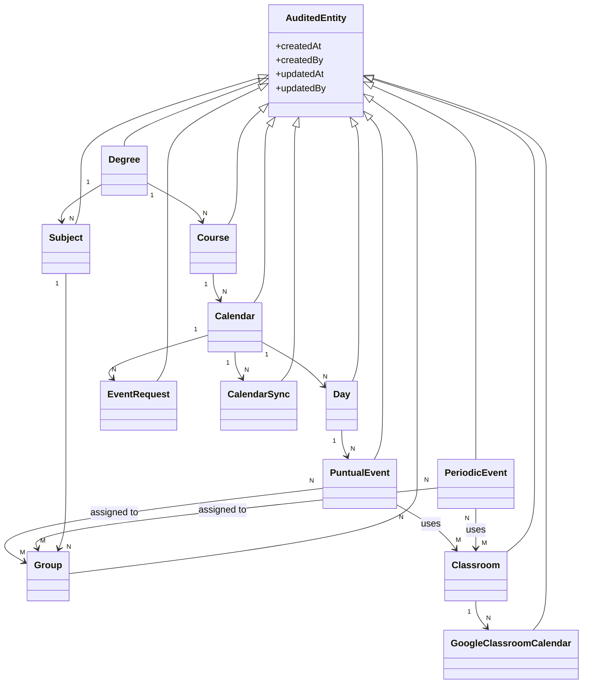

# Chapter 4 — SYSTEM REQUIREMENTS

---

## 4.1 Functional Requirements

### 4.1.1 System Functions

The functional requirements of the system are expressed through a detailed hierarchical list that transforms each user requirement from Chapter 3 into a technical specification of the expected system behaviour. The data requested, their mandatory nature, the validations applied, the error conditions and the system actions after completing each flow are included. The modules referenced correspond to the user requirement groups (UR) from Chapter 3.

For standard CRUD operations without complex business logic, duplication of redundant scenarios is avoided (in accordance with the academic guidelines), limiting the specification to enumerating the operation and its specific restrictions.

---

#### RF-AUTH — Authentication and access (→ UR1)

**RF-AUTH-01: Login**

RF-AUTH-01.1. The system shall present the unauthenticated user with a login form.

RF-AUTH-01.2. The system shall request the following data:

&nbsp;&nbsp;&nbsp;&nbsp;RF-AUTH-01.2.1. Email address.

&nbsp;&nbsp;&nbsp;&nbsp;&nbsp;&nbsp;&nbsp;&nbsp;RF-AUTH-01.2.1.1. It is a mandatory field.

&nbsp;&nbsp;&nbsp;&nbsp;RF-AUTH-01.2.2. Password.

&nbsp;&nbsp;&nbsp;&nbsp;&nbsp;&nbsp;&nbsp;&nbsp;RF-AUTH-01.2.2.1. It is a mandatory field.

RF-AUTH-01.3. The system shall verify that a registered user exists with the indicated email address and that their account is in active status (`isActive = true`).

RF-AUTH-01.4. The system shall compare the entered password with the hash stored in the database using an industry-standard cryptographic comparison function.

RF-AUTH-01.5. If the credentials are correct, the system shall generate a cryptographically signed authentication token containing user identity and role information, with a validity of 24 hours.

&nbsp;&nbsp;&nbsp;&nbsp;RF-AUTH-01.5.1. The system shall return the token to the client.

&nbsp;&nbsp;&nbsp;&nbsp;RF-AUTH-01.5.2. The system shall redirect the user to the main screen according to their role:

&nbsp;&nbsp;&nbsp;&nbsp;&nbsp;&nbsp;&nbsp;&nbsp;RF-AUTH-01.5.2.1. If the role is `ROLE_ADMIN`, the system shall redirect to the administration panel.

&nbsp;&nbsp;&nbsp;&nbsp;&nbsp;&nbsp;&nbsp;&nbsp;RF-AUTH-01.5.2.2. If the role is `ROLE_PROFESSOR`, the system shall redirect to the lecturer view.

RF-AUTH-01.6. If the email address does not exist in the system, the account is not active, or the password is incorrect, the system shall display the same generic error message (*"Invalid credentials"*) without revealing which condition was not met, and the user shall not be authenticated.

---

**RF-AUTH-02: Account activation**

RF-AUTH-02.1. When the administrator creates a new user, the system shall generate a unique activation token valid for 48 hours and store it associated with the user record in the database.

RF-AUTH-02.2. The system shall send an email to the user with the activation link that incorporates the token.

RF-AUTH-02.3. Upon accessing the link, the system shall check the token's validity.

&nbsp;&nbsp;&nbsp;&nbsp;RF-AUTH-02.3.1. If the token has expired or does not exist, the system shall display an error message indicating to the user that they should contact their administrator to have the link resent.

&nbsp;&nbsp;&nbsp;&nbsp;RF-AUTH-02.3.2. If the token is valid, the system shall display the activation form.

RF-AUTH-02.4. The system shall request the following data from the user:

&nbsp;&nbsp;&nbsp;&nbsp;RF-AUTH-02.4.1. New password.

&nbsp;&nbsp;&nbsp;&nbsp;&nbsp;&nbsp;&nbsp;&nbsp;RF-AUTH-02.4.1.1. It is a mandatory field.

&nbsp;&nbsp;&nbsp;&nbsp;&nbsp;&nbsp;&nbsp;&nbsp;RF-AUTH-02.4.1.2. It must be at least 8 characters and no more than 128.

&nbsp;&nbsp;&nbsp;&nbsp;&nbsp;&nbsp;&nbsp;&nbsp;RF-AUTH-02.4.1.3. It must contain at least one uppercase letter (A–Z).

&nbsp;&nbsp;&nbsp;&nbsp;&nbsp;&nbsp;&nbsp;&nbsp;RF-AUTH-02.4.1.4. It must contain at least one lowercase letter (a–z).

&nbsp;&nbsp;&nbsp;&nbsp;&nbsp;&nbsp;&nbsp;&nbsp;RF-AUTH-02.4.1.5. It must contain at least one digit (0–9).

&nbsp;&nbsp;&nbsp;&nbsp;&nbsp;&nbsp;&nbsp;&nbsp;RF-AUTH-02.4.1.6. It must contain at least one special character.

&nbsp;&nbsp;&nbsp;&nbsp;RF-AUTH-02.4.2. Confirmation of the new password.

&nbsp;&nbsp;&nbsp;&nbsp;&nbsp;&nbsp;&nbsp;&nbsp;RF-AUTH-02.4.2.1. It is a mandatory field.

&nbsp;&nbsp;&nbsp;&nbsp;&nbsp;&nbsp;&nbsp;&nbsp;RF-AUTH-02.4.2.2. It must exactly match the password entered in RF-AUTH-02.4.1.

RF-AUTH-02.5. If the password does not meet the complexity requirements, the system shall display a real-time indicator showing which condition is not satisfied and shall not complete the activation.

RF-AUTH-02.6. If the passwords do not match, the system shall display an error message and shall not complete the activation.

RF-AUTH-02.7. If the data are valid, the system shall encrypt the password using an industry-standard hashing function, update the user record setting `isActive = true`, invalidate the activation token and redirect the user to the login form.

---

**RF-AUTH-03: Password recovery via OTP code**

The process is carried out in three sequential steps.

RF-AUTH-03.1. **Step 1 — Request for verification code.**

&nbsp;&nbsp;&nbsp;&nbsp;RF-AUTH-03.1.1. The system shall request the user's email address.

&nbsp;&nbsp;&nbsp;&nbsp;&nbsp;&nbsp;&nbsp;&nbsp;RF-AUTH-03.1.1.1. It is a mandatory field.

&nbsp;&nbsp;&nbsp;&nbsp;RF-AUTH-03.1.2. The system shall check whether the email exists and the account is active. The system's response shall always be generic, without revealing whether the email is registered or not.

&nbsp;&nbsp;&nbsp;&nbsp;RF-AUTH-03.1.3. If the email exists and the account is active, the system shall generate a six-digit numeric OTP code valid for 15 minutes and send it by email.

&nbsp;&nbsp;&nbsp;&nbsp;RF-AUTH-03.1.4. The system shall apply a 60-second cooldown period: it shall not allow generating a new code for the same email until 60 seconds have elapsed since the previous request.

RF-AUTH-03.2. **Step 2 — OTP code verification.**

&nbsp;&nbsp;&nbsp;&nbsp;RF-AUTH-03.2.1. The system shall request the six-digit code received by email.

&nbsp;&nbsp;&nbsp;&nbsp;&nbsp;&nbsp;&nbsp;&nbsp;RF-AUTH-03.2.1.1. It is a mandatory field.

&nbsp;&nbsp;&nbsp;&nbsp;RF-AUTH-03.2.2. The system shall check that the entered code matches the one stored and has not expired.

&nbsp;&nbsp;&nbsp;&nbsp;RF-AUTH-03.2.3. If the code has expired, the system shall display an error message (*"The code has expired. Please request a new one."*) and shall not proceed to the next step.

&nbsp;&nbsp;&nbsp;&nbsp;RF-AUTH-03.2.4. If the code is incorrect, the system shall display an error message (*"Invalid verification code."*) and shall not proceed to the next step.

&nbsp;&nbsp;&nbsp;&nbsp;RF-AUTH-03.2.5. If the code is valid, the system shall generate a single-use `resetToken` and associate it internally with the recovery session.

RF-AUTH-03.3. **Step 3 — Set new password.**

&nbsp;&nbsp;&nbsp;&nbsp;RF-AUTH-03.3.1. The system shall request the following data from the user:

&nbsp;&nbsp;&nbsp;&nbsp;&nbsp;&nbsp;&nbsp;&nbsp;RF-AUTH-03.3.1.1. New password, with the same complexity requirements as RF-AUTH-02.4.1.

&nbsp;&nbsp;&nbsp;&nbsp;&nbsp;&nbsp;&nbsp;&nbsp;RF-AUTH-03.3.1.2. Confirmation of the new password.

&nbsp;&nbsp;&nbsp;&nbsp;RF-AUTH-03.3.2. If the password does not meet the complexity requirements, the system shall display an error message and shall not update the password.

&nbsp;&nbsp;&nbsp;&nbsp;RF-AUTH-03.3.3. If the passwords do not match, the system shall display an error message and shall not update the password.

&nbsp;&nbsp;&nbsp;&nbsp;RF-AUTH-03.3.4. If the data are valid, the system shall encrypt the new password using an industry-standard hashing function, store it in the database, invalidate the `resetToken` and redirect the user to the login form.

---

**RF-AUTH-04: Logout**

RF-AUTH-04.1. The system shall remove the JWT token from the client's storage.

RF-AUTH-04.2. The system shall redirect the user to the home screen.

---

**RF-AUTH-05: Google OAuth connection (for calendar synchronisation)**

RF-AUTH-05.1. From the settings page (`/settings`), the authenticated user shall be able to initiate the OAuth 2.0 flow with Google.

RF-AUTH-05.2. The system shall redirect the user to the Google consent screen, requesting access to the `calendar` scope of the Google Calendar API.

RF-AUTH-05.3. Google shall return an authorisation code to the system.

RF-AUTH-05.4. The system shall exchange the authorisation code for an `access_token` and a `refresh_token` via the Google API.

&nbsp;&nbsp;&nbsp;&nbsp;RF-AUTH-05.4.1. The system shall store both tokens encrypted in the database.

&nbsp;&nbsp;&nbsp;&nbsp;RF-AUTH-05.4.2. The system shall also store the expiration date of the `access_token`.

RF-AUTH-05.5. The system shall display to the user the email address of the linked Google account as confirmation of the successful connection.

RF-AUTH-05.6. If the user denies access on the Google consent screen, the system shall display an informational message and shall not store any token.

RF-AUTH-05.7. The user shall be able to disconnect their Google account from the same settings page.

&nbsp;&nbsp;&nbsp;&nbsp;RF-AUTH-05.7.1. The system shall request confirmation before proceeding.

&nbsp;&nbsp;&nbsp;&nbsp;RF-AUTH-05.7.2. The system shall obtain a valid `access_token` (renewing it if necessary) and delete all Google Classroom Calendars created by that user by calling the Google Calendar API.

&nbsp;&nbsp;&nbsp;&nbsp;RF-AUTH-05.7.3. The system shall delete the `GoogleClassroomCalendar` and `CalendarSync` records associated with the user in the database.

&nbsp;&nbsp;&nbsp;&nbsp;RF-AUTH-05.7.4. The system shall delete the user's stored Google tokens.

---

**RF-AUTH-06: Password change from profile**

RF-AUTH-06.1. The system shall allow any authenticated user to change their password from the profile settings page (`/settings`).

RF-AUTH-06.2. The system shall request the following data:

&nbsp;&nbsp;&nbsp;&nbsp;RF-AUTH-06.2.1. Current password.

&nbsp;&nbsp;&nbsp;&nbsp;&nbsp;&nbsp;&nbsp;&nbsp;RF-AUTH-06.2.1.1. It is a mandatory field.

&nbsp;&nbsp;&nbsp;&nbsp;RF-AUTH-06.2.2. New password.

&nbsp;&nbsp;&nbsp;&nbsp;&nbsp;&nbsp;&nbsp;&nbsp;RF-AUTH-06.2.2.1. It is a mandatory field.

&nbsp;&nbsp;&nbsp;&nbsp;&nbsp;&nbsp;&nbsp;&nbsp;RF-AUTH-06.2.2.2. It must meet the same complexity requirements defined in RF-AUTH-02.4.1.

&nbsp;&nbsp;&nbsp;&nbsp;RF-AUTH-06.2.3. Confirmation of the new password.

&nbsp;&nbsp;&nbsp;&nbsp;&nbsp;&nbsp;&nbsp;&nbsp;RF-AUTH-06.2.3.1. It is a mandatory field. It must match RF-AUTH-06.2.2.

RF-AUTH-06.3. The system shall verify the current password using an industry-standard cryptographic comparison function before proceeding.

&nbsp;&nbsp;&nbsp;&nbsp;RF-AUTH-06.3.1. If the current password is incorrect, the system shall display an error message and shall not make the change.

RF-AUTH-06.4. If all data are valid, the system shall encrypt the new password using an industry-standard hashing function and update the user record in the database.

---

#### RF-USER — User management (→ UR2)

**RF-USER-01: Register new user** *(ROLE_ADMIN only)*

RF-USER-01.1. The system shall request the following data from the administrator:

&nbsp;&nbsp;&nbsp;&nbsp;RF-USER-01.1.1. First name.

&nbsp;&nbsp;&nbsp;&nbsp;&nbsp;&nbsp;&nbsp;&nbsp;RF-USER-01.1.1.1. It is a mandatory field.

&nbsp;&nbsp;&nbsp;&nbsp;RF-USER-01.1.2. First surname.

&nbsp;&nbsp;&nbsp;&nbsp;&nbsp;&nbsp;&nbsp;&nbsp;RF-USER-01.1.2.1. It is a mandatory field.

&nbsp;&nbsp;&nbsp;&nbsp;RF-USER-01.1.3. Second surname.

&nbsp;&nbsp;&nbsp;&nbsp;&nbsp;&nbsp;&nbsp;&nbsp;RF-USER-01.1.3.1. It is a mandatory field.

&nbsp;&nbsp;&nbsp;&nbsp;RF-USER-01.1.4. Email address.

&nbsp;&nbsp;&nbsp;&nbsp;&nbsp;&nbsp;&nbsp;&nbsp;RF-USER-01.1.4.1. It is a mandatory field.

&nbsp;&nbsp;&nbsp;&nbsp;&nbsp;&nbsp;&nbsp;&nbsp;RF-USER-01.1.4.2. The system shall check that the email format is valid.

&nbsp;&nbsp;&nbsp;&nbsp;&nbsp;&nbsp;&nbsp;&nbsp;RF-USER-01.1.4.3. The system shall check that the email is not already registered in the user database (`management_db`).

&nbsp;&nbsp;&nbsp;&nbsp;RF-USER-01.1.5. Role.

&nbsp;&nbsp;&nbsp;&nbsp;&nbsp;&nbsp;&nbsp;&nbsp;RF-USER-01.1.5.1. It is a mandatory field.

&nbsp;&nbsp;&nbsp;&nbsp;&nbsp;&nbsp;&nbsp;&nbsp;RF-USER-01.1.5.2. The system shall allow choosing between `ROLE_ADMIN` and `ROLE_PROFESSOR`.

&nbsp;&nbsp;&nbsp;&nbsp;RF-USER-01.1.6. UniOvi username.

&nbsp;&nbsp;&nbsp;&nbsp;&nbsp;&nbsp;&nbsp;&nbsp;RF-USER-01.1.6.1. It is an optional field.

RF-USER-01.2. If the email address format is not valid, the system shall display an error message (*"Invalid email format"*) and shall not complete the registration.

RF-USER-01.3. If the email address is already registered in the system, the system shall display an error message (*"The email is already registered in the system"*) and shall not complete the registration.

RF-USER-01.4. If the data are valid, the system shall create the user record in the database with `isActive = false` and execute the account activation flow described in RF-AUTH-02.

---

**RF-USER-02: Import users from Excel** *(ROLE_ADMIN only)*

RF-USER-02.1. The system shall ask the administrator to upload a file in `.xlsx` format.

RF-USER-02.2. The system shall parse the file and process each row independently, reading columns by position (column 0, 1, 2, 3).

RF-USER-02.3. For each row, the system shall check that it contains the following columns with valid data:

&nbsp;&nbsp;&nbsp;&nbsp;RF-USER-02.3.1. Column 0 — UniOvi username (`unioviUser`). Mandatory.

&nbsp;&nbsp;&nbsp;&nbsp;RF-USER-02.3.2. Column 1 — First name (`name`). Mandatory.

&nbsp;&nbsp;&nbsp;&nbsp;RF-USER-02.3.3. Column 2 — Surnames (`surnames`). Mandatory. The system shall split this field by spaces: the first word shall be the first surname and the rest (if any) shall be the second surname.

&nbsp;&nbsp;&nbsp;&nbsp;RF-USER-02.3.4. Column 3 — Email address (`email`). Mandatory. The system shall check for valid format and that it is not already registered in the system.

RF-USER-02.4. For valid rows, the system shall create the user with `isActive = false` and `role = ROLE_PROFESSOR` by default, and send the activation email.

RF-USER-02.5. The system shall display to the administrator a final report indicating: number of users created successfully and, for each row with an error, the row number and the reason for the error.

---

**RF-USER-03: View user list** *(ROLE_ADMIN only)*

RF-USER-03.1. The system shall display the list of registered users with the columns: full name, email address, role, status (`Active` / `Inactive`) and registration date.

RF-USER-03.2. The system shall allow filtering the list by role (`ROLE_ADMIN`, `ROLE_PROFESSOR`, or all) and by status (active, inactive, or all).

RF-USER-03.3. The system shall allow searches by name or email address (case-insensitive search).

RF-USER-03.4. The system shall implement pagination in the list.

---

**RF-USER-04: Modify profile data** *(any authenticated user for their own profile; ROLE_ADMIN for any user)*

RF-USER-04.1. Any authenticated user shall be able to modify the following fields of their own profile: first name, first surname, second surname, email address and UniOvi username. The role and status are not modifiable by the user themselves.

RF-USER-04.2. The administrator shall be able to modify the following fields for any user: first name, first surname, second surname, UniOvi username, role and status (active/inactive).

RF-USER-04.3. The email address is not modifiable by the administrator once the user is created, as it is the unique identifier in the system. Only the user themselves can update it from their profile.

RF-USER-04.4. If the administrator attempts to change the role or deactivate the last active administrator in the system, the system shall display an error message (*"You cannot change the role of the last administrator"* or *"You cannot deactivate the last administrator"*) and shall not apply the change.

RF-USER-04.5. If the administrator attempts to deactivate their own account, the system shall display an error message (*"You cannot deactivate your own account"*) and shall not apply the change.

---

**RF-USER-05: Delete user** *(ROLE_ADMIN only)*

RF-USER-05.1. The system shall display a confirmation dialog before deleting a user, indicating that the action is irreversible.

RF-USER-05.2. If the administrator attempts to delete the last active administrator, the system shall display an error message and shall not perform the deletion.

RF-USER-05.3. If the administrator attempts to delete their own account, the system shall display an error message and shall not perform the deletion.

RF-USER-05.4. If the confirmation proceeds, the system shall delete the user record from the database.

---

**RF-USER-06: Resend activation email** *(ROLE_ADMIN only)*

RF-USER-06.1. The system shall allow the administrator to resend the activation email to a user who has been registered but has not yet activated their account (`isActive = false`).

RF-USER-06.2. The system shall generate a new activation token valid for 48 hours, invalidate the previous one if it existed, and send the activation email with the new link.

RF-USER-06.3. If the user already has the account active (`isActive = true`), the system shall display an error message and shall not perform the operation.

---

#### RF-STRUCT — Academic structure management (→ UR3)

**RF-STRUCT-01: Degree management** *(ROLE_ADMIN only)*

RF-STRUCT-01.1. **Create degree.** The system shall request the following data:

&nbsp;&nbsp;&nbsp;&nbsp;RF-STRUCT-01.1.1. Name.

&nbsp;&nbsp;&nbsp;&nbsp;&nbsp;&nbsp;&nbsp;&nbsp;RF-STRUCT-01.1.1.1. Mandatory. Maximum 100 characters.

&nbsp;&nbsp;&nbsp;&nbsp;&nbsp;&nbsp;&nbsp;&nbsp;RF-STRUCT-01.1.1.2. The system shall check that the name is not already registered in the system (`UNIQUE` constraint in the database).

&nbsp;&nbsp;&nbsp;&nbsp;RF-STRUCT-01.1.2. Acronym.

&nbsp;&nbsp;&nbsp;&nbsp;&nbsp;&nbsp;&nbsp;&nbsp;RF-STRUCT-01.1.2.1. Mandatory. Maximum 20 characters.

&nbsp;&nbsp;&nbsp;&nbsp;&nbsp;&nbsp;&nbsp;&nbsp;RF-STRUCT-01.1.2.2. The system shall check that the acronym is not already registered in the system (`UNIQUE` constraint in the database).

&nbsp;&nbsp;&nbsp;&nbsp;RF-STRUCT-01.1.3. If the name already exists, the system shall display an error message (*"A degree with that name already exists"*) and shall not complete the creation.

&nbsp;&nbsp;&nbsp;&nbsp;RF-STRUCT-01.1.4. If the acronym already exists, the system shall display an error message (*"A degree with that acronym already exists"*) and shall not complete the creation.

&nbsp;&nbsp;&nbsp;&nbsp;RF-STRUCT-01.1.5. If the data are valid, the system shall create the degree, record the audit metadata (`createdBy`, `createdAt`) and display a confirmation.

RF-STRUCT-01.2. **View degrees.** The system shall display the list of existing degrees with name, acronym and number of associated courses.

RF-STRUCT-01.3. **Modify degree.** The system shall allow editing the name and acronym, applying the same uniqueness validations as in creation.

RF-STRUCT-01.4. **Delete degree.**

&nbsp;&nbsp;&nbsp;&nbsp;RF-STRUCT-01.4.1. The system shall check that the degree has no associated academic courses.

&nbsp;&nbsp;&nbsp;&nbsp;RF-STRUCT-01.4.2. If it has associated courses, the system shall display an error message (*"You cannot delete a degree with associated academic courses"*) and shall not complete the deletion.

&nbsp;&nbsp;&nbsp;&nbsp;RF-STRUCT-01.4.3. If it has no associated courses, the system shall request confirmation and proceed with the deletion.

---

**RF-STRUCT-02: Academic course management** *(ROLE_ADMIN only)*

RF-STRUCT-02.1. **Create academic course.** The system shall request the following data:

&nbsp;&nbsp;&nbsp;&nbsp;RF-STRUCT-02.1.1. Degree to which it belongs.

&nbsp;&nbsp;&nbsp;&nbsp;&nbsp;&nbsp;&nbsp;&nbsp;RF-STRUCT-02.1.1.1. Mandatory. To be selected from the existing degrees.

&nbsp;&nbsp;&nbsp;&nbsp;RF-STRUCT-02.1.2. Start year (`startYear`).

&nbsp;&nbsp;&nbsp;&nbsp;&nbsp;&nbsp;&nbsp;&nbsp;RF-STRUCT-02.1.2.1. Mandatory.

&nbsp;&nbsp;&nbsp;&nbsp;RF-STRUCT-02.1.3. End year (`endYear`).

&nbsp;&nbsp;&nbsp;&nbsp;&nbsp;&nbsp;&nbsp;&nbsp;RF-STRUCT-02.1.3.1. Mandatory.

&nbsp;&nbsp;&nbsp;&nbsp;&nbsp;&nbsp;&nbsp;&nbsp;RF-STRUCT-02.1.3.2. Must be later than the start year.

&nbsp;&nbsp;&nbsp;&nbsp;RF-STRUCT-02.1.4. If a course with the same years already exists for that degree, the system shall display an error message and shall not complete the creation.

&nbsp;&nbsp;&nbsp;&nbsp;RF-STRUCT-02.1.5. If the data are valid, the system shall create the course with initial status `PLANIFICADO`.

RF-STRUCT-02.2. **Modify academic course.** The system shall allow editing the course status:

&nbsp;&nbsp;&nbsp;&nbsp;RF-STRUCT-02.2.1. The system shall allow choosing between the values: `PLANIFICADO`, `ACTIVO`, `FINALIZADO`.

&nbsp;&nbsp;&nbsp;&nbsp;RF-STRUCT-02.2.2. Status transitions are unidirectional: `PLANIFICADO` → `ACTIVO` → `FINALIZADO`. The system shall not allow reverting a course to a previous status.

RF-STRUCT-02.3. **Delete academic course.**

&nbsp;&nbsp;&nbsp;&nbsp;RF-STRUCT-02.3.1. If the course has calendars with associated events, the system shall display an error message and shall not complete the deletion.

---

**RF-STRUCT-03: Subject management** *(ROLE_ADMIN only)*

RF-STRUCT-03.1. **Create subject.** The system shall request the following data:

&nbsp;&nbsp;&nbsp;&nbsp;RF-STRUCT-03.1.1. Name.

&nbsp;&nbsp;&nbsp;&nbsp;&nbsp;&nbsp;&nbsp;&nbsp;RF-STRUCT-03.1.1.1. Mandatory.

&nbsp;&nbsp;&nbsp;&nbsp;&nbsp;&nbsp;&nbsp;&nbsp;RF-STRUCT-03.1.1.2. Must be unique within the same degree.

&nbsp;&nbsp;&nbsp;&nbsp;RF-STRUCT-03.1.2. Acronym.

&nbsp;&nbsp;&nbsp;&nbsp;&nbsp;&nbsp;&nbsp;&nbsp;RF-STRUCT-03.1.2.1. Mandatory.

&nbsp;&nbsp;&nbsp;&nbsp;&nbsp;&nbsp;&nbsp;&nbsp;RF-STRUCT-03.1.2.2. Must be unique within the same degree.

&nbsp;&nbsp;&nbsp;&nbsp;RF-STRUCT-03.1.3. SIES code (`siesCode`).

&nbsp;&nbsp;&nbsp;&nbsp;&nbsp;&nbsp;&nbsp;&nbsp;RF-STRUCT-03.1.3.1. Mandatory.

&nbsp;&nbsp;&nbsp;&nbsp;&nbsp;&nbsp;&nbsp;&nbsp;RF-STRUCT-03.1.3.2. It shall not be modifiable once the subject has been created.

&nbsp;&nbsp;&nbsp;&nbsp;RF-STRUCT-03.1.4. Degree.

&nbsp;&nbsp;&nbsp;&nbsp;&nbsp;&nbsp;&nbsp;&nbsp;RF-STRUCT-03.1.4.1. Mandatory. To be selected from the existing degrees.

&nbsp;&nbsp;&nbsp;&nbsp;RF-STRUCT-03.1.5. Semester (`semester`).

&nbsp;&nbsp;&nbsp;&nbsp;&nbsp;&nbsp;&nbsp;&nbsp;RF-STRUCT-03.1.5.1. Mandatory.

&nbsp;&nbsp;&nbsp;&nbsp;&nbsp;&nbsp;&nbsp;&nbsp;RF-STRUCT-03.1.5.2. The system shall accept only the values `1` or `2`.

&nbsp;&nbsp;&nbsp;&nbsp;RF-STRUCT-03.1.6. Year in which it is taught (`year`).

&nbsp;&nbsp;&nbsp;&nbsp;&nbsp;&nbsp;&nbsp;&nbsp;RF-STRUCT-03.1.6.1. Mandatory.

&nbsp;&nbsp;&nbsp;&nbsp;&nbsp;&nbsp;&nbsp;&nbsp;RF-STRUCT-03.1.6.2. The system shall accept the values `0` (no specific year — elective or free-choice subjects), `1`, `2`, `3` or `4`. This restriction is implemented as a `CHECK` constraint in the database.

&nbsp;&nbsp;&nbsp;&nbsp;RF-STRUCT-03.1.7. If the name or acronym already exist within the same degree, the system shall display a specific error message and shall not complete the creation.

RF-STRUCT-03.2. **Modify subject.** The system shall allow editing all fields except the SIES code, which shall be displayed as a read-only field.

RF-STRUCT-03.3. **Delete subject.**

&nbsp;&nbsp;&nbsp;&nbsp;RF-STRUCT-03.3.1. The system shall display a warning to the administrator indicating that the deletion will also cascade-delete all groups of the subject and all events associated with those groups.

&nbsp;&nbsp;&nbsp;&nbsp;RF-STRUCT-03.3.2. After the administrator's explicit confirmation, the system shall proceed with the cascade deletion.

---

**RF-STRUCT-04: Group management** *(ROLE_ADMIN only)*

RF-STRUCT-04.1. **Create group.** The system shall request the following data:

&nbsp;&nbsp;&nbsp;&nbsp;RF-STRUCT-04.1.1. Subject to which it belongs.

&nbsp;&nbsp;&nbsp;&nbsp;&nbsp;&nbsp;&nbsp;&nbsp;RF-STRUCT-04.1.1.1. Mandatory.

&nbsp;&nbsp;&nbsp;&nbsp;RF-STRUCT-04.1.2. Group type (`type`).

&nbsp;&nbsp;&nbsp;&nbsp;&nbsp;&nbsp;&nbsp;&nbsp;RF-STRUCT-04.1.2.1. Mandatory.

&nbsp;&nbsp;&nbsp;&nbsp;&nbsp;&nbsp;&nbsp;&nbsp;RF-STRUCT-04.1.2.2. The system shall accept the values: `T` (Theory), `S` (Seminar), `L` (Laboratory Practice), `TG` (Group Tutoring).

&nbsp;&nbsp;&nbsp;&nbsp;RF-STRUCT-04.1.3. Language (`language`).

&nbsp;&nbsp;&nbsp;&nbsp;&nbsp;&nbsp;&nbsp;&nbsp;RF-STRUCT-04.1.3.1. Mandatory.

&nbsp;&nbsp;&nbsp;&nbsp;&nbsp;&nbsp;&nbsp;&nbsp;RF-STRUCT-04.1.3.2. The system shall accept the values: `ES` (Spanish) and `EN` (English).

&nbsp;&nbsp;&nbsp;&nbsp;RF-STRUCT-04.1.4. Planned hours (`planifiedHours`).

&nbsp;&nbsp;&nbsp;&nbsp;&nbsp;&nbsp;&nbsp;&nbsp;RF-STRUCT-04.1.4.1. Mandatory.

&nbsp;&nbsp;&nbsp;&nbsp;&nbsp;&nbsp;&nbsp;&nbsp;RF-STRUCT-04.1.4.2. Must be a positive decimal number that is a multiple of 0.5 (e.g.: 0, 0.5, 1, 1.5, 6). The field is stored as `decimal(10,2)`. Negative values and decimals that are not multiples of 0.5 are not accepted.

&nbsp;&nbsp;&nbsp;&nbsp;RF-STRUCT-04.1.5. The group number (`number`) is automatically assigned by the system. The system shall select the next available number for the specified combination of subject, type and language.

&nbsp;&nbsp;&nbsp;&nbsp;RF-STRUCT-04.1.6. If the system cannot assign a unique number for the specified (subject, type, language) combination, it shall display an error message and shall not complete the creation.

RF-STRUCT-04.2. **View, modify and delete groups.** The system shall allow these operations with the same uniqueness validations on modification. Deletion shall request confirmation before proceeding.

---

**RF-STRUCT-05: Classroom management** *(ROLE_ADMIN only)*

RF-STRUCT-05.1. **Create classroom.** The system shall request the following data:

&nbsp;&nbsp;&nbsp;&nbsp;RF-STRUCT-05.1.1. Classroom code (`code`).

&nbsp;&nbsp;&nbsp;&nbsp;&nbsp;&nbsp;&nbsp;&nbsp;RF-STRUCT-05.1.1.1. Mandatory. Maximum 50 characters.

&nbsp;&nbsp;&nbsp;&nbsp;&nbsp;&nbsp;&nbsp;&nbsp;RF-STRUCT-05.1.1.2. The system shall check that the code is not already registered in the system (`UNIQUE` constraint in the database).

&nbsp;&nbsp;&nbsp;&nbsp;RF-STRUCT-05.1.2. GIS URL (`gisUrl`).

&nbsp;&nbsp;&nbsp;&nbsp;&nbsp;&nbsp;&nbsp;&nbsp;RF-STRUCT-05.1.2.1. Optional.

&nbsp;&nbsp;&nbsp;&nbsp;&nbsp;&nbsp;&nbsp;&nbsp;RF-STRUCT-05.1.2.2. If provided, the system shall check that the value has a valid URL format (starts with `http://` or `https://`).

&nbsp;&nbsp;&nbsp;&nbsp;RF-STRUCT-05.1.3. If the code already exists, the system shall display an error message (*"A classroom with that code already exists"*) and shall not complete the creation.

RF-STRUCT-05.2. **View and modify classrooms.** Standard operations with the same code uniqueness validations.

RF-STRUCT-05.3. **Delete classroom.**

&nbsp;&nbsp;&nbsp;&nbsp;RF-STRUCT-05.3.1. If the classroom has associated events, the system shall display a warning to the administrator indicating the number of affected events and shall request explicit additional confirmation (`force = true`) before proceeding.

&nbsp;&nbsp;&nbsp;&nbsp;RF-STRUCT-05.3.2. If the classroom has no associated events, the system shall request standard confirmation and delete the record.

---

#### RF-CAL — Academic calendar management (→ UR4)

**RF-CAL-01: Create academic calendar** *(ROLE_ADMIN only)*

RF-CAL-01.1. The system shall request the following data:

&nbsp;&nbsp;&nbsp;&nbsp;RF-CAL-01.1.1. Academic course.

&nbsp;&nbsp;&nbsp;&nbsp;&nbsp;&nbsp;&nbsp;&nbsp;RF-CAL-01.1.1.1. Mandatory. To be selected from the existing academic courses.

&nbsp;&nbsp;&nbsp;&nbsp;RF-CAL-01.1.2. Semester.

&nbsp;&nbsp;&nbsp;&nbsp;&nbsp;&nbsp;&nbsp;&nbsp;RF-CAL-01.1.2.1. Mandatory. The system shall accept the values `1` or `2`.

&nbsp;&nbsp;&nbsp;&nbsp;RF-CAL-01.1.3. Start date (`start`).

&nbsp;&nbsp;&nbsp;&nbsp;&nbsp;&nbsp;&nbsp;&nbsp;RF-CAL-01.1.3.1. Mandatory. Format `YYYY-MM-DD`.

&nbsp;&nbsp;&nbsp;&nbsp;RF-CAL-01.1.4. End date (`end`).

&nbsp;&nbsp;&nbsp;&nbsp;&nbsp;&nbsp;&nbsp;&nbsp;RF-CAL-01.1.4.1. Mandatory. Format `YYYY-MM-DD`.

&nbsp;&nbsp;&nbsp;&nbsp;&nbsp;&nbsp;&nbsp;&nbsp;RF-CAL-01.1.4.2. Must be later than the start date.

RF-CAL-01.2. If a calendar already exists for the (academic course, semester) combination, the system shall display an error message (*"A calendar already exists for this course and semester"*) and shall not complete the creation.

RF-CAL-01.3. If the end date is not later than the start date, the system shall display an error message and shall not complete the creation.

RF-CAL-01.4. If the data are valid, the system shall create the `Calendar` record and automatically generate one `Day` record for each working day (Monday to Friday) between `start` and `end` (excluding Saturdays and Sundays), with initial teaching status.

---

**RF-CAL-02: Manage teaching and holiday days** *(ROLE_ADMIN only)*

RF-CAL-02.1. The system shall allow the administrator to modify the status of any calendar day by marking it as a holiday or restoring its teaching status.

RF-CAL-02.2. The `dayCharacter` field of the `Day` record shall be updated accordingly.

---

**RF-CAL-03: View academic calendars**

RF-CAL-03.1. The system shall display the list of existing calendars with: academic course, semester, start date, end date, number of teaching days and number of scheduled events.

RF-CAL-03.2. The system shall allow filtering by academic course and by semester.

---

**RF-CAL-04: Duplicate academic calendar** *(ROLE_ADMIN only)*

RF-CAL-04.1. The system shall request the following data:

&nbsp;&nbsp;&nbsp;&nbsp;RF-CAL-04.1.1. Target academic course.

&nbsp;&nbsp;&nbsp;&nbsp;&nbsp;&nbsp;&nbsp;&nbsp;RF-CAL-04.1.1.1. Mandatory.

&nbsp;&nbsp;&nbsp;&nbsp;RF-CAL-04.1.2. Target semester.

&nbsp;&nbsp;&nbsp;&nbsp;&nbsp;&nbsp;&nbsp;&nbsp;RF-CAL-04.1.2.1. Mandatory.

&nbsp;&nbsp;&nbsp;&nbsp;RF-CAL-04.1.3. New start date.

&nbsp;&nbsp;&nbsp;&nbsp;&nbsp;&nbsp;&nbsp;&nbsp;RF-CAL-04.1.3.1. Mandatory.

&nbsp;&nbsp;&nbsp;&nbsp;RF-CAL-04.1.4. New end date.

&nbsp;&nbsp;&nbsp;&nbsp;&nbsp;&nbsp;&nbsp;&nbsp;RF-CAL-04.1.4.1. Mandatory. Must be later than the new start date.

RF-CAL-04.2. If a calendar already exists for the target course and target semester, the system shall display an error message and shall not complete the duplication.

RF-CAL-04.3. If the data are valid, the system shall create the new calendar, copy the teaching and holiday day structure (adjusted to the new dates) and copy the recurring events from the source calendar to the target calendar.

---

**RF-CAL-05: Delete academic calendar** *(ROLE_ADMIN only)*

RF-CAL-05.1. The system shall display a summary of the data that will be deleted (number of days, recurring events and one-off events) and shall request explicit confirmation before proceeding.

RF-CAL-05.2. The deletion shall be carried out in cascade: all `Day`, `PeriodicEvent`, `PuntualEvent` and `EventRequest` records associated with the calendar shall be deleted.

---

#### RF-EVENT — Event management (→ UR5)

**RF-EVENT-01: Create recurring event** *(ROLE_ADMIN only)*

RF-EVENT-01.1. The system shall request the following data:

&nbsp;&nbsp;&nbsp;&nbsp;RF-EVENT-01.1.1. Group or groups (`groups`).

&nbsp;&nbsp;&nbsp;&nbsp;&nbsp;&nbsp;&nbsp;&nbsp;RF-EVENT-01.1.1.1. Mandatory. The administrator may select one or more groups.

&nbsp;&nbsp;&nbsp;&nbsp;RF-EVENT-01.1.2. Classroom or classrooms (`classrooms`).

&nbsp;&nbsp;&nbsp;&nbsp;&nbsp;&nbsp;&nbsp;&nbsp;RF-EVENT-01.1.2.1. Optional.

&nbsp;&nbsp;&nbsp;&nbsp;RF-EVENT-01.1.3. Start time (`startTime`).

&nbsp;&nbsp;&nbsp;&nbsp;&nbsp;&nbsp;&nbsp;&nbsp;RF-EVENT-01.1.3.1. Mandatory. Format `HH:MM`.

&nbsp;&nbsp;&nbsp;&nbsp;RF-EVENT-01.1.4. End time (`endTime`).

&nbsp;&nbsp;&nbsp;&nbsp;&nbsp;&nbsp;&nbsp;&nbsp;RF-EVENT-01.1.4.1. Mandatory. Format `HH:MM`.

&nbsp;&nbsp;&nbsp;&nbsp;&nbsp;&nbsp;&nbsp;&nbsp;RF-EVENT-01.1.4.2. Must be later than the start time.

&nbsp;&nbsp;&nbsp;&nbsp;RF-EVENT-01.1.5. Day of the week (`weekDay`).

&nbsp;&nbsp;&nbsp;&nbsp;&nbsp;&nbsp;&nbsp;&nbsp;RF-EVENT-01.1.5.1. Mandatory. The administrator shall select one of the values: `L` (Monday), `M` (Tuesday), `X` (Wednesday), `J` (Thursday), `V` (Friday).

&nbsp;&nbsp;&nbsp;&nbsp;RF-EVENT-01.1.6. Repetition frequency (`eventCharacter`).

&nbsp;&nbsp;&nbsp;&nbsp;&nbsp;&nbsp;&nbsp;&nbsp;RF-EVENT-01.1.6.1. Mandatory. Determines on which teaching days of the calendar the event will appear. The system shall offer the following options:

&nbsp;&nbsp;&nbsp;&nbsp;&nbsp;&nbsp;&nbsp;&nbsp;&nbsp;&nbsp;&nbsp;&nbsp;RF-EVENT-01.1.6.1.1. Weekly: the event appears on all teaching days of the calendar that match the selected `weekDay`.

&nbsp;&nbsp;&nbsp;&nbsp;&nbsp;&nbsp;&nbsp;&nbsp;&nbsp;&nbsp;&nbsp;&nbsp;RF-EVENT-01.1.6.1.2. Biweekly — even weeks: the event appears on teaching days labelled as even weeks in the calendar.

&nbsp;&nbsp;&nbsp;&nbsp;&nbsp;&nbsp;&nbsp;&nbsp;&nbsp;&nbsp;&nbsp;&nbsp;RF-EVENT-01.1.6.1.3. Biweekly — odd weeks: the event appears on teaching days labelled as odd weeks in the calendar.

&nbsp;&nbsp;&nbsp;&nbsp;&nbsp;&nbsp;&nbsp;&nbsp;&nbsp;&nbsp;&nbsp;&nbsp;RF-EVENT-01.1.6.1.4. Custom: the administrator defines a custom character that is manually assigned to calendar days.

&nbsp;&nbsp;&nbsp;&nbsp;&nbsp;&nbsp;&nbsp;&nbsp;The technical implementation of this character system, including the internal values and the expansion engine, is described in §5.2.6.

&nbsp;&nbsp;&nbsp;&nbsp;RF-EVENT-01.1.7. Event type (`eventType`).

&nbsp;&nbsp;&nbsp;&nbsp;&nbsp;&nbsp;&nbsp;&nbsp;RF-EVENT-01.1.7.1. Mandatory. The system shall accept the following values:

&nbsp;&nbsp;&nbsp;&nbsp;&nbsp;&nbsp;&nbsp;&nbsp;&nbsp;&nbsp;&nbsp;&nbsp;RF-EVENT-01.1.7.1.1. `Class` (internally `NORMAL`): ordinary teaching session. Counts towards the group's planned hours budget and is included in `.txt` exports.

&nbsp;&nbsp;&nbsp;&nbsp;&nbsp;&nbsp;&nbsp;&nbsp;&nbsp;&nbsp;&nbsp;&nbsp;RF-EVENT-01.1.7.1.2. `Evaluation` (internally `EVALUACION`): exam or formal assessment. Does not consume planned hours. Displayed on the calendar with the prefix `EV·`.

&nbsp;&nbsp;&nbsp;&nbsp;&nbsp;&nbsp;&nbsp;&nbsp;&nbsp;&nbsp;&nbsp;&nbsp;RF-EVENT-01.1.7.1.3. `Review` (internally `REVISION`): exam review session. Does not consume planned hours. Displayed with the prefix `RE·`.

&nbsp;&nbsp;&nbsp;&nbsp;&nbsp;&nbsp;&nbsp;&nbsp;&nbsp;&nbsp;&nbsp;&nbsp;RF-EVENT-01.1.7.1.4. `Others` (internally `OTRO`): any other activity with a classroom booking that does not consume planned hours (talks, workshops, etc.). Displayed with the prefix `OT·`.

&nbsp;&nbsp;&nbsp;&nbsp;&nbsp;&nbsp;&nbsp;&nbsp;&nbsp;&nbsp;&nbsp;&nbsp;RF-EVENT-01.1.7.1.5. `Independent` (internally `BLOCKER`): classroom booking without an associated subject or group, to block a space for non-academic reasons.

RF-EVENT-01.2. If the end time is not later than the start time, the system shall display an error message and shall not complete the creation.

RF-EVENT-01.3. The `Independent` type does not require group or subject selection, as it represents a classroom booking without a teaching link. For all other types (`Class`, `Evaluation`, `Review`, `Others`), selecting at least one group is mandatory.

RF-EVENT-01.4. The system shall execute the conflict detection algorithm (RF-EVENT-03) with the entered data.

&nbsp;&nbsp;&nbsp;&nbsp;RF-EVENT-01.4.1. If a conflict is detected, the system shall display a detailed error message indicating the conflicting event and the affected resource (group or classroom), and shall prevent saving the event.

&nbsp;&nbsp;&nbsp;&nbsp;RF-EVENT-01.4.2. If no conflict is detected, the system shall create the `PeriodicEvent` record and establish the relationships with the selected groups and classrooms in the corresponding junction tables.

---

**RF-EVENT-02: Create one-off event** *(ROLE_ADMIN only)*

RF-EVENT-02.1. The system shall request the following data:

&nbsp;&nbsp;&nbsp;&nbsp;RF-EVENT-02.1.1. Calendar day (`day`).

&nbsp;&nbsp;&nbsp;&nbsp;&nbsp;&nbsp;&nbsp;&nbsp;RF-EVENT-02.1.1.1. Mandatory. Must be a `Day` record belonging to the active calendar.

&nbsp;&nbsp;&nbsp;&nbsp;RF-EVENT-02.1.2. Group or groups.

&nbsp;&nbsp;&nbsp;&nbsp;&nbsp;&nbsp;&nbsp;&nbsp;RF-EVENT-02.1.2.1. Mandatory for all event types except `Independent`, which does not require a group or subject (see RF-EVENT-01.3).

&nbsp;&nbsp;&nbsp;&nbsp;RF-EVENT-02.1.3. Classroom or classrooms.

&nbsp;&nbsp;&nbsp;&nbsp;&nbsp;&nbsp;&nbsp;&nbsp;RF-EVENT-02.1.3.1. Optional.

&nbsp;&nbsp;&nbsp;&nbsp;RF-EVENT-02.1.4. Start time and end time.

&nbsp;&nbsp;&nbsp;&nbsp;&nbsp;&nbsp;&nbsp;&nbsp;RF-EVENT-02.1.4.1. Both are mandatory. The end time must be later than the start time.

&nbsp;&nbsp;&nbsp;&nbsp;RF-EVENT-02.1.5. Event type.

&nbsp;&nbsp;&nbsp;&nbsp;&nbsp;&nbsp;&nbsp;&nbsp;RF-EVENT-02.1.5.1. Mandatory, with the same values as in RF-EVENT-01.1.7.1.

RF-EVENT-02.2. If the selected day is marked as a holiday (`dayCharacter` holiday), the system shall display a warning to the administrator. The creation can continue if the administrator confirms.

RF-EVENT-02.3. The system shall execute the conflict detection algorithm (RF-EVENT-03) for the specific date and time slot of the one-off event.

---

**RF-EVENT-03: Schedule conflict detection**

This module is invoked internally before creating or modifying any event (recurring or one-off) and before approving any change request.

RF-EVENT-03.1. The system shall determine the set of days affected by the new event:

&nbsp;&nbsp;&nbsp;&nbsp;RF-EVENT-03.1.1. For a recurring event: all teaching days of the calendar whose `dayCharacter` corresponds to the selected day of the week.

&nbsp;&nbsp;&nbsp;&nbsp;RF-EVENT-03.1.2. For a one-off event: only the specific day selected.

RF-EVENT-03.2. For each day in the set determined in RF-EVENT-03.1, the system shall check whether there is any active (non-cancelled) event that simultaneously:

&nbsp;&nbsp;&nbsp;&nbsp;RF-EVENT-03.2.1. Shares at least one of the selected groups, **and**

&nbsp;&nbsp;&nbsp;&nbsp;RF-EVENT-03.2.2. Overlaps in time: `startTime_A < endTime_B AND endTime_A > startTime_B`.

RF-EVENT-03.3. The system shall perform the same check for the selected classrooms.

RF-EVENT-03.4. If at least one group conflict is detected, the system shall generate an error message indicating the name of the conflicting group, the name of the existing event and the time slot.

RF-EVENT-03.5. If at least one classroom conflict is detected, the system shall generate an error message indicating the conflicting classroom code and the existing event.

RF-EVENT-03.6. If conflicts are detected, the system shall block the operation and display all conflicts found. The maximum response time of this module shall be 500 ms for calendars with up to 500 events.

RF-EVENT-03.7. If no conflict is detected, the operation shall continue.

---

**RF-EVENT-04: Modify recurring event** *(ROLE_ADMIN only)*

RF-EVENT-04.1. The system shall allow modifying the groups, classrooms, schedule, days of the week, event type and repetition frequency of an existing recurring event.

RF-EVENT-04.2. The system shall execute the conflict detection algorithm (RF-EVENT-03) with the new parameters before saving the change.

---

**RF-EVENT-05: Cancel one-off event** *(ROLE_ADMIN only)*

RF-EVENT-05.1. The system shall mark the `PuntualEvent` record with `cancelled = true`, without deleting it from the database.

RF-EVENT-05.2. Cancelled events shall be displayed on the calendar with a differentiated visual indication and shall not be counted in occupancy statistics.

---

**RF-EVENT-06: Delete event** *(ROLE_ADMIN only)*

RF-EVENT-06.1. For recurring events, the administrator may delete a specific occurrence or the entire series:

&nbsp;&nbsp;&nbsp;&nbsp;RF-EVENT-06.1.1. Delete a specific occurrence: the system shall create a `PuntualEvent` record with `cancelled = true` and `periodicEventSourceId` pointing to the source `PeriodicEvent`, selectively cancelling that occurrence without affecting the rest of the series.

&nbsp;&nbsp;&nbsp;&nbsp;RF-EVENT-06.1.2. Delete the entire series: the system shall display a warning dialog and, after confirmation, delete the `PeriodicEvent` record and its relationships in the junction tables.

RF-EVENT-06.2. For non-cancelled one-off events, the system shall delete the `PuntualEvent` record after requesting confirmation.

---

**RF-EVENT-07: Revert cancellation of a one-off event** *(ROLE_ADMIN only)*

RF-EVENT-07.1. The system shall allow the administrator to revert the cancellation of a one-off event that has `cancelled = true`.

RF-EVENT-07.2. The system shall update the `PuntualEvent` record setting `cancelled = false`.

RF-EVENT-07.3. The event shall be displayed again on the calendar with its normal visual state.

---

#### RF-VIEW — Schedule consultation (→ UR6)

**RF-VIEW-01: Public schedule consultation**

RF-VIEW-01.1. The system shall allow access to the calendar view without requiring authentication.

&nbsp;&nbsp;&nbsp;&nbsp;RF-VIEW-01.1.1. Unauthenticated users shall only be able to access calendars whose academic course has status `ACTIVO`.

&nbsp;&nbsp;&nbsp;&nbsp;RF-VIEW-01.1.2. Authenticated users shall be able to access calendars in any status.

RF-VIEW-01.2. The system shall ask the user to select the calendar to display via the hierarchy: degree → academic course → semester.

RF-VIEW-01.3. The system shall dynamically expand the recurring events of the calendar into their specific occurrences on each teaching day, respecting the day character system (`dayCharacter`) and the character of each recurring event (`eventCharacter`).

RF-VIEW-01.4. The system shall present the events in a calendar view with the following available modes:

&nbsp;&nbsp;&nbsp;&nbsp;RF-VIEW-01.4.1. Full week view.

&nbsp;&nbsp;&nbsp;&nbsp;RF-VIEW-01.4.2. Work week view.

&nbsp;&nbsp;&nbsp;&nbsp;RF-VIEW-01.4.3. Day view.

&nbsp;&nbsp;&nbsp;&nbsp;RF-VIEW-01.4.4. Month view.

&nbsp;&nbsp;&nbsp;&nbsp;RF-VIEW-01.4.5. Agenda view.

RF-VIEW-01.5. The system shall allow applying the following filters on the visible events:

&nbsp;&nbsp;&nbsp;&nbsp;RF-VIEW-01.5.1. Group year (`0` = elective, `1`, `2`, `3`, `4`).

&nbsp;&nbsp;&nbsp;&nbsp;RF-VIEW-01.5.2. Subject.

&nbsp;&nbsp;&nbsp;&nbsp;RF-VIEW-01.5.3. Group type (`T`, `S`, `L`, `TG`).

&nbsp;&nbsp;&nbsp;&nbsp;RF-VIEW-01.5.4. Specific group.

&nbsp;&nbsp;&nbsp;&nbsp;RF-VIEW-01.5.5. Classroom.

&nbsp;&nbsp;&nbsp;&nbsp;RF-VIEW-01.5.6. Language (`ES`, `EN`).

&nbsp;&nbsp;&nbsp;&nbsp;RF-VIEW-01.5.7. Event type (`Class`, `Evaluation`, `Review`, `Others`, `Independent`, or cancelled).

RF-VIEW-01.5.8. *(Property of the filter system, not an additional filter.)* Filters combine their criteria with AND logic between categories and OR within each category. Filter selections are automatically persisted in the user's browser between sessions.

RF-VIEW-01.6. Clicking on an event shall display a side panel with the event details: subject, group, event type, classroom, schedule and comments if any.

RF-VIEW-01.7. Events with `cancelled = true` shall be displayed with differentiated visual styling (strikethrough text, muted colour). Events from change requests in `PENDING` status shall be displayed with reduced opacity and a dashed border, indicating they are pending approval.

---

#### RF-REQ — Change requests (→ UR7)

**RF-REQ-01: Create change request** *(ROLE_PROFESSOR only)*

RF-REQ-01.1. The system shall allow the lecturer to create change requests of four types:

&nbsp;&nbsp;&nbsp;&nbsp;RF-REQ-01.1.1. `CREATE` — proposal to create a new event. The `originalEventId` field shall be null. The lecturer shall provide the complete data for the new event in the `eventData` field.

&nbsp;&nbsp;&nbsp;&nbsp;RF-REQ-01.1.2. `EDIT` — proposal to modify an existing event.

&nbsp;&nbsp;&nbsp;&nbsp;&nbsp;&nbsp;&nbsp;&nbsp;RF-REQ-01.1.2.1. The lecturer shall select the original event. The system shall store its identifier in `originalEventId`. Mandatory.

&nbsp;&nbsp;&nbsp;&nbsp;&nbsp;&nbsp;&nbsp;&nbsp;RF-REQ-01.1.2.2. The lecturer shall provide the modified data in `eventData`.

&nbsp;&nbsp;&nbsp;&nbsp;RF-REQ-01.1.3. `CANCEL` — proposal to cancel a specific occurrence of an event.

&nbsp;&nbsp;&nbsp;&nbsp;&nbsp;&nbsp;&nbsp;&nbsp;RF-REQ-01.1.3.1. The lecturer shall select the original event (`originalEventId`). Mandatory.

&nbsp;&nbsp;&nbsp;&nbsp;&nbsp;&nbsp;&nbsp;&nbsp;RF-REQ-01.1.3.2. The lecturer shall indicate the date of the occurrence to cancel in `eventData`.

&nbsp;&nbsp;&nbsp;&nbsp;RF-REQ-01.1.4. `REPLACE` — proposal to cancel an occurrence and create a new event in its place.

&nbsp;&nbsp;&nbsp;&nbsp;&nbsp;&nbsp;&nbsp;&nbsp;RF-REQ-01.1.4.1. The lecturer shall select the original event and the occurrence to cancel. Mandatory.

&nbsp;&nbsp;&nbsp;&nbsp;&nbsp;&nbsp;&nbsp;&nbsp;RF-REQ-01.1.4.2. The lecturer shall provide the data for the replacement event in `eventData`.

RF-REQ-01.2. Before sending, the system shall execute the conflict detection algorithm (RF-EVENT-03) with the data from `eventData` and inform the lecturer of the result. This check is advisory; the lecturer may send the request regardless of the result.

RF-REQ-01.3. Upon sending the request, the system shall create the `EventRequest` record with `status = PENDING` and send an email notification to all users with the `ROLE_ADMIN` role.

---

**RF-REQ-02: View own requests** *(ROLE_PROFESSOR only)*

RF-REQ-02.1. The system shall display to the lecturer the list of their own requests with: request type, submission date, status (`PENDING`, `APPROVED`, `REJECTED`) and reviewer comments (if any).

RF-REQ-02.2. The list shall implement pagination (10 rows per page) and allow filtering by status (`PENDING`, `APPROVED`, `REJECTED`, or all). The default filter status when opening the page is `PENDING`.

---

**RF-REQ-03: Delete own request** *(ROLE_PROFESSOR only)*

RF-REQ-03.1. The system shall check that the request belongs to the authenticated lecturer and that its status is `PENDING`.

&nbsp;&nbsp;&nbsp;&nbsp;RF-REQ-03.1.1. If the request has already been reviewed, the system shall display an error message (*"You cannot delete an already processed request"*) and shall not perform the deletion.

RF-REQ-03.2. If the request is in `PENDING` status, the system shall delete the `EventRequest` record after requesting confirmation.

---

**RF-REQ-04: View all requests** *(ROLE_ADMIN only)*

RF-REQ-04.1. The system shall display the list of all requests in the system with: type, requesting lecturer, calendar, submission date and status.

RF-REQ-04.2. The system shall allow filtering by status (`PENDING`, `APPROVED`, `REJECTED`), by degree and by calendar.

RF-REQ-04.3. Requests with `PENDING` status shall be shown with a differentiated visual indication.

---

**RF-REQ-05: Approve request** *(ROLE_ADMIN only)*

RF-REQ-05.1. The system shall check that the request status is `PENDING`. If not, the system shall display an error message (*"This request has already been processed"*).

RF-REQ-05.2. The system shall display to the administrator the result of the conflict detection algorithm (RF-EVENT-03) applied to the data in `eventData` in the current state of the calendar.

RF-REQ-05.3. Before confirming the approval, the administrator may adjust the frequency, dates and times of the proposed event. The subject, group and classroom fields are read-only (fixed by the lecturer in the request) and cannot be modified during the review.

RF-REQ-05.4. If the administrator confirms the approval, the system shall automatically execute the corresponding action for the request type with the definitive data (including any adjustments from the previous step):

&nbsp;&nbsp;&nbsp;&nbsp;RF-REQ-05.4.1. `CREATE`: the system shall create the event with the data from `eventData`.

&nbsp;&nbsp;&nbsp;&nbsp;RF-REQ-05.4.2. `EDIT`: the system shall modify the event referenced in `originalEventId` with the data from `eventData`.

&nbsp;&nbsp;&nbsp;&nbsp;RF-REQ-05.4.3. `CANCEL`: the system shall mark the occurrence indicated in `eventData` as cancelled (`cancelled = true`).

&nbsp;&nbsp;&nbsp;&nbsp;RF-REQ-05.4.4. `REPLACE`: the system shall cancel the original occurrence and create the new one-off event with the data from `eventData`, linking it to the original occurrence via `replacementEventId`.

RF-REQ-05.5. The system shall update the `EventRequest` record with `status = APPROVED`, `reviewedBy` (administrator's email) and `reviewedAt` (current timestamp).

RF-REQ-05.6. The system shall send an email notification to the lecturer informing them of the approval.

---

**RF-REQ-06: Reject request** *(ROLE_ADMIN only)*

RF-REQ-06.1. The system shall check that the request status is `PENDING`. If not, it shall display an error message.

RF-REQ-06.2. The system shall offer the administrator a field to enter the reason for rejection (`comments`).

&nbsp;&nbsp;&nbsp;&nbsp;RF-REQ-06.2.1. It is a recommended but not technically mandatory field (the field is nullable in the database). If omitted, the lecturer shall receive the rejection notification without detailed justification.

RF-REQ-06.3. The system shall update the `EventRequest` record with `status = REJECTED`, `reviewedBy`, `reviewedAt` and `comments` (or null if not provided).

RF-REQ-06.4. The system shall send an email notification to the lecturer with the reason for rejection, if any.

---

#### RF-SYNC — Google Calendar synchronisation (→ UR8)

**RF-SYNC-01: Initialise synchronisation entries**

RF-SYNC-01.1. Upon completing the connection of a Google account (RF-AUTH-05), the system shall automatically call the endpoint `POST /calendar-sync/initialize`.

RF-SYNC-01.2. The system shall query all active academic calendars in the system and create a `CalendarSync` record with initial idle status for each one that does not already have a synchronisation record associated with the user. State values are defined in §5.2.7.

---

**RF-SYNC-02: Synchronise academic calendar with Google Calendar** *(ROLE_ADMIN only)*

RF-SYNC-02.1. The administrator shall select the academic calendar to synchronise from the `/calendar-sync` page and launch the synchronisation.

RF-SYNC-02.2. The system shall update the `CalendarSync` status to synchronisation in progress.

RF-SYNC-02.3. The system shall automatically renew the Google `access_token` if it has expired or is about to expire, using the `refresh_token` stored encrypted in the database (RF-SYNC-03).

RF-SYNC-02.4. The system shall identify all classrooms that have events in the selected calendar.

&nbsp;&nbsp;&nbsp;&nbsp;RF-SYNC-02.4.1. For each new classroom (without a previous Google Calendar), the system shall create a new Google Calendar via the API with the classroom code as the name and store the `googleCalendarId` in a new `GoogleClassroomCalendar` record.

&nbsp;&nbsp;&nbsp;&nbsp;RF-SYNC-02.4.2. For existing classroom Google Calendars, the system shall first delete all previous events of the academic calendar in that Google Calendar.

RF-SYNC-02.5. The system shall create the academic calendar events in the Google Calendar of the corresponding classroom, with: title (subject and group), date and time, and classroom code as location.

RF-SYNC-02.6. All calls to the Google Calendar API shall respect the system's quota control so as not to exceed the project-level limit. If the limit is reached, the system shall pause calls until the time window is renewed before automatically continuing. The justification and details of the quota strategy are described in §3.3.3 and §5.2.7.

RF-SYNC-02.7. The system shall update progress in real time in the `CalendarSync` record: number of classroom calendars processed out of the total.

RF-SYNC-02.8. Upon completion, the system shall update the `CalendarSync` status according to the result of the operation: success, unrecoverable error or recoverable error with retry possibility. The specific state values are defined in the design model (§5.2.7).

---

**RF-SYNC-03: Automatic Google token renewal**

RF-SYNC-03.1. Before making any call to the Google Calendar API, the system shall check the validity of the stored `access_token`.

RF-SYNC-03.2. If the `access_token` has expired or is about to expire, the system shall use the stored `refresh_token` to obtain a new `access_token` from Google and update the database record with the new token and its expiration date.

RF-SYNC-03.3. If the `refresh_token` has been revoked or is invalid, the system shall mark the `CalendarSync` with error status and an error message indicating that the user must reconnect their Google account.

---

**RF-SYNC-04: Delete individual synchronisation** *(ROLE_ADMIN only)*

RF-SYNC-04.1. The administrator may delete the synchronisation of a specific academic calendar from the `/calendar-sync` page.

RF-SYNC-04.2. The system shall display a confirmation dialog with the name of the affected calendar before proceeding.

RF-SYNC-04.3. If the administrator confirms, the system shall update the synchronisation status to a deletion-in-progress state (persistent in the database to survive page reloads) and begin the cleanup process. State values are defined in §5.2.7.

RF-SYNC-04.4. The system shall delete the events of that academic calendar in each affected classroom Google Calendar, respecting the quota control described in RF-SYNC-02.6.

RF-SYNC-04.5. If a classroom Google Calendar is left without events from any academic calendar (even if it was already empty before the operation), the system shall delete it from Google and remove the corresponding `GoogleClassroomCalendar` record from the database.

RF-SYNC-04.6. The system shall delete the `CalendarSync` record from the database.

---

#### RF-EXPORT — Interoperability with the legacy system (→ UR9)

**RF-EXPORT-01: Export calendar in ZIP format** *(ROLE_ADMIN only)*

RF-EXPORT-01.1. The system shall generate a compressed file in ZIP format containing the following five text files:

&nbsp;&nbsp;&nbsp;&nbsp;RF-EXPORT-01.1.1. `ubicaciones.txt`: list of classrooms in the format `CLASSROOM_CODE:GIS_URL`, sorted by classroom code in ascending order.

&nbsp;&nbsp;&nbsp;&nbsp;RF-EXPORT-01.1.2. `asignaturas.txt`: catalogue of subjects with their groups by type and language, in the 12-field `:` separated format of the legacy system, sorted by acronym.

&nbsp;&nbsp;&nbsp;&nbsp;RF-EXPORT-01.1.3. `calendario.txt`: teaching days of the calendar with their corresponding day characters.

&nbsp;&nbsp;&nbsp;&nbsp;RF-EXPORT-01.1.4. `horarios.txt`: recurring events of the calendar in the legacy system's format, linking each group to a day of the week, time slot and classroom.

&nbsp;&nbsp;&nbsp;&nbsp;RF-EXPORT-01.1.5. `excepciones.txt`: one-off events of the calendar, including cancellations of specific occurrences.

RF-EXPORT-01.2. Only events of type `Class` (`eventType = 'Class'`) shall be included in the export. Events of type `Evaluation`, `Review`, `Others` and `Independent` shall not be included.

RF-EXPORT-01.3. All files in the ZIP shall be generated with UTF-8 encoding.

RF-EXPORT-01.4. The ZIP generation time shall not exceed 10 seconds for calendars with up to 200 events.

RF-EXPORT-01.5. The system shall automatically initiate the file download in the administrator's browser.

---

**RF-EXPORT-02: Import calendar from `.txt` files** *(ROLE_ADMIN only)*

RF-EXPORT-02.1. The system shall accept the upload of `.txt` files from the legacy system to create a new calendar. Required: `asignaturas.txt`, `calendario.txt`, `horarios.txt` and `ubicaciones.txt`. The `excepciones.txt` file is optional.

RF-EXPORT-02.2. The system shall parse and validate the content of each file, checking that the format is correct (`:` separator, expected number of fields per line, UTF-8 encoding).

RF-EXPORT-02.3. The system shall display a preview of the data to be imported (number of subjects, groups, events) before proceeding.

RF-EXPORT-02.4. After the administrator's confirmation, the system shall create the corresponding entities in the target calendar.

RF-EXPORT-02.5. The system shall display a report with the successfully imported data and the errors found, indicating the line and the reason for the error in each case.

---

**RF-EXPORT-03: Import exceptions onto an existing calendar** *(ROLE_ADMIN only)*

RF-EXPORT-03.1. The system shall allow the administrator to upload an `excepciones.txt` file onto an already existing calendar to add or update one-off events.

RF-EXPORT-03.2. The system shall offer two import modes that the administrator must select before confirming:

&nbsp;&nbsp;&nbsp;&nbsp;RF-EXPORT-03.2.1. Add: the events from the file are added to the already existing one-off events in the calendar, without deleting any of the existing ones.

&nbsp;&nbsp;&nbsp;&nbsp;RF-EXPORT-03.2.2. Replace: all existing one-off events in the calendar are deleted and completely replaced by those from the file.

RF-EXPORT-03.3. The system shall display a report with the result of the import.

---

**RF-EXPORT-04: Export calendar in CSV format for Google Calendar**

RF-EXPORT-04.1. The system shall generate a CSV file in Google Calendar import format from the schedule of the selected calendar.

RF-EXPORT-04.2. The generated file shall be in UTF-8 encoding and shall follow the Google Calendar field standard (Subject, Start Date, Start Time, End Date, End Time, Description, Location).

RF-EXPORT-04.3. The system shall automatically initiate the file download in the user's browser.

RF-EXPORT-04.4. This functionality is available from the semester calendar view for all profiles, including unauthenticated (guest) users.

---

**RF-EXPORT-05: Export calendar in native TXT format**

RF-EXPORT-05.1. The system shall allow downloading the schedule of a semester in the application's native `.txt` files directly from the semester calendar view.

RF-EXPORT-05.2. This functionality is available for all profiles, including unauthenticated (guest) users.

RF-EXPORT-05.3. The download shall generate the `.txt` files with the content currently visible on the calendar.

---

#### RF-AUDIT — Audit and traceability (→ UR10)

**RF-AUDIT-01: Automatic recording of audit metadata**

RF-AUDIT-01.1. All system entities inherit from the abstract class `AuditedEntity`, which automatically adds the following fields to each database table:

&nbsp;&nbsp;&nbsp;&nbsp;RF-AUDIT-01.1.1. `createdAt`: creation timestamp of the record. Set automatically on insertion and not modified thereafter.

&nbsp;&nbsp;&nbsp;&nbsp;RF-AUDIT-01.1.2. `createdBy`: email of the user who created the record. Extracted from the JWT token payload in the creation request.

&nbsp;&nbsp;&nbsp;&nbsp;RF-AUDIT-01.1.3. `updatedAt`: timestamp of the last modification of the record. Updated automatically on each update operation.

&nbsp;&nbsp;&nbsp;&nbsp;RF-AUDIT-01.1.4. `updatedBy`: email of the user who made the last modification. Extracted from the JWT token payload in the update request.

RF-AUDIT-01.2. The audited entities are: `Degree`, `Course`, `Calendar`, `Day`, `Subject`, `Group`, `Classroom`, `PeriodicEvent`, `PuntualEvent`, `EventRequest` and `CalendarSync`.

RF-AUDIT-01.3. The audit record is made automatically via server middleware; no additional action is required from controllers or users.

---

### 4.1.2 Domain Data Model

The system's data model is organised into four groups of entities: academic structure, events, change requests and Google Calendar integration. All entities inherit from `AuditedEntity`.

**Figure 4.1 — Domain class diagram**



The complete class diagram with all attributes is found in §5.2.3 (Detailed design). The entity structure by functional groups is summarised below:

- **Academic structure**: `Degree` → `Course` → `Calendar` → `Day` / `Subject` → `Group` → `Classroom`
- **Events**: `PeriodicEvent` (N:M with `Group` and `Classroom`) and `PuntualEvent` (N:M with `Group` and `Classroom`; linked to a specific `Day`)
- **Change requests**: `EventRequest` (linked to the `Calendar`)
- **Google Calendar integration**: `CalendarSync` (synchronisation status per user and calendar) and `GoogleClassroomCalendar` (mapping between `Classroom` and its Google Calendar ID)

All entities inherit from `AuditedEntity`, which automatically records the user and date of creation and last modification of each record.

**Enumerations:**

| Enumeration | Values |
|---|---|
| `CourseState` | `PLANIFICADO`, `ACTIVO`, `FINALIZADO` |
| `GroupType` | `T` (Theory), `S` (Seminar), `L` (Laboratory), `TG` (Group Tutoring) |
| `Language` | `ES`, `EN` |
| `EventType` | `Class`, `Evaluation`, `Review`, `Others`, `Independent` |
| `WeekDay` | `L`, `M`, `X`, `J`, `V` |
| `RequestType` | `CREATE`, `EDIT`, `CANCEL`, `REPLACE` |
| `RequestStatus` | `PENDING`, `APPROVED`, `REJECTED` |
| `SyncStatus` | Values defined in §5.2.7 |

**Key relationships:**

- `PuntualEvent.replacementEventId` — self-reference: points to the one-off event that replaces this one (REPLACE flow of change requests).
- `PuntualEvent.periodicEventSourceId` — reference to the `PeriodicEvent` from which this cancellation derives, allowing selective cancellation of an occurrence without affecting the rest of the series.
- `GoogleClassroomCalendar` — stores the mapping between each classroom and its Google Calendar ID, allowing events to be added and removed in the correct calendar during synchronisation.
- `ApiQuotaCounter` — global counter (not per user) of Google Calendar API quota consumption, reflecting how Google applies limits at the project level.

---

### 4.1.3 User Interface

This section describes the navigation structure of the application and the main screens. The figures below correspond to screenshots of the functional application; the actual images are included in the project presentation.

#### Navigation structure

The application has four public routes without an application layout and the rest organised under a common layout with a sidebar. The content visible in the sidebar varies according to the user's role.

**Figure 4.2 — Application navigation map**

```
Public routes (no sidebar):
  /              → Welcome screen
  /login         → Login form
  /forgot-password → Password recovery (3 steps: email → OTP → new password)
  /activate      → Account activation

Routes with sidebar (authenticated layout):
  Section "Main" — visible to all profiles:
    /home                                                        → Global calendar
    /degrees                                                     → Degree list
    /degrees/:acronym/courses                                    → Courses of a degree
    /degrees/:acronym/courses/:startYear/:endYear/semester/:n/calendar   → Calendar view
    /degrees/:acronym/courses/:startYear/:endYear/semester/:n/subjects   → Subjects
    /degrees/:acronym/courses/:startYear/:endYear/semester/:n/groups     → Groups
    /degrees/:acronym/courses/:startYear/:endYear/semester/:n/solicitudes → Requests (admin)
    /classrooms                                                  → Classroom list

  Section "System" — authenticated users only:
    Administrator:
      /users        → User management
      /solicitudes  → Global change request panel
    Lecturer:
      /my-requests  → My change requests

  User area (accessible from the bottom of the sidebar):
    /settings       → Profile and Google Calendar connection
    /calendar-sync  → Google Calendar synchronisation management
```

The sidebar includes a breadcrumb system that shows the current navigation path and allows jumping to any previous level with a click. Guest users (unauthenticated) can only access calendars of courses in `ACTIVO` status.

#### Main screens

> 📷 **Figure 4.3 — Welcome screen** (`/`): central card with the application title and two buttons: *"Continue as guest"* and *"Log in"*.

> 📷 **Figure 4.4 — Login form** (`/login`): email and password fields, *"Log in"* button and *"Forgot your password?"* link.

> 📷 **Figure 4.5 — Weekly calendar view** (`/home` or semester route): calendar selector at the top; side filter bar (degree, subject, group type, group, classroom, language); five view buttons (Week, Work week, Day, Month, Agenda); time navigation (previous, today, next); events coloured by type on the time grid; side details panel when clicking on an event.

> 📷 **Figure 4.6 — Conflict detection dialog**: warning message when attempting to create or edit an event that overlaps with another event of the same group or classroom, indicating the conflicting event name and the affected time slot.

> 📷 **Figure 4.7 — Change request panel (administrator)** (`/solicitudes`): request table with columns for status, requesting lecturer, request type and date; filters by status (pending, approved, rejected); approve and reject buttons per row; prominent visual indicator for requests in `PENDING` status.

> 📷 **Figure 4.8 — New request dialog (lecturer)**: form for creating a change request with type selector (`CREATE`, `EDIT`, `CANCEL`, `REPLACE`), source event selector (for types that require `originalEventId`), date, time, subject, group and classroom fields, and comment field. Real-time conflict indicator before sending.

> 📷 **Figure 4.9 — Google Calendar synchronisation page** (`/calendar-sync`): table with one row per active academic calendar, columns for status (`IDLE`, `SYNCING`, `SUCCESS`, `ERROR`, `DELETING`), progress bar during synchronisation (calendars processed / total), *"Synchronise"* button and delete synchronisation button. API quota widget with the project's accumulated consumption.

> 📷 **Figure 4.10 — Mobile device view**: sidebar collapsed into a hamburger menu; calendar view in agenda mode (more suitable for narrow screens); hideable filter panel.

#### Dialog conventions

- Mandatory fields in forms are marked with a red asterisk (`*`) and the `RequiredLabel` component.
- Validation errors are displayed in real time below the affected field, without waiting for form submission.
- Destructive actions (deleting entities, deleting synchronisation) require an explicit confirmation dialog before being executed.
- Long operations (synchronisation, import) display progress indicators and do not block navigation.
- The interface is fully internationalised in Spanish and English via an internationalisation (i18n) system.

---

## 4.2 Non-Functional Requirements

### 4.2.1 Performance

| ID | Operation | Maximum time | Conditions |
|---|---|---|---|
| RNF-PERF-01 | Login | 1 second | 95% of cases |
| RNF-PERF-02 | Entity listing (users, subjects, etc.) | 2 seconds | Up to 1,000 records |
| RNF-PERF-03 | Create or edit entity | 1 second | Simple operation |
| RNF-PERF-04 | Create event with conflict validation | 3 seconds | Calendar with up to 500 events |
| RNF-PERF-05 | Load schedule view | 3 seconds | Initial calendar load |
| RNF-PERF-06 | Duplicate calendar | 10 seconds | Up to 200 events |
| RNF-PERF-07 | Google Calendar synchronisation | 2 minutes | Up to 100 events |
| RNF-PERF-08 | Export calendar to ZIP | 10 seconds | Up to 200 events |

### 4.2.2 Scalability

- The system shall support at least **200 concurrent users** in normal operations and **500 in public read-only queries**.
- Estimated data volume at 5 years: up to 500 subjects, 2,000 groups, 10,000 recurring events and 5,000 one-off events.
- The microservices architecture allows scaling the `planner_service` (the most computationally demanding) independently without replicating the authentication and user services.

### 4.2.3 Availability

- **Availability target:** 99.5% annual uptime (maximum 43.8 hours of downtime per year).
- Scheduled maintenance shall be carried out exclusively during non-teaching periods with at least 7 days' notice.
- **RTO** (Recovery Time Objective): 4 hours. **RPO** (Recovery Point Objective): 24 hours.

### 4.2.4 Security

The implemented security measures are organised in layers:

**Transport:** HTTPS mandatory for all client-server communication. TLS is managed at the web server layer with an institutional certificate, with automatic HTTP → HTTPS redirection and HSTS enabled.

**Authentication:** Signed authentication tokens with 1-hour expiration. The signing secret is configured via environment variable with no default value in the code. Tokens contain only user identity and role information.

**Credentials:** passwords stored with an industry-standard adaptive hashing function. Never stored or transmitted in plain text. Password fields allow copying and pasting (compatible with password managers).

**Third-party tokens:** Google OAuth tokens are stored encrypted in the database using a key configured via environment variable.

**Access control:** RBAC with two roles (administrator and lecturer). The gateway applies CORS with an explicit origin whitelist. Token verification is performed in each service independently.

**Secrets:** no password, API key or secret is hardcoded in the source code. All are managed via environment variables and secrets stored in the CI/CD pipeline.

**Known security technical debt:**

- *Custom authentication system:* the system manages its own credentials (email + password) instead of delegating to an external provider. This constitutes a recognised security limitation, assumed due to the unavailability of the institutional SSO at the time of development (see §3.3.1). Integration with the University of Oviedo SSO (Microsoft/Azure AD) is documented as future work in chapter 8.
- *No WAF:* the system is deployed behind the university infrastructure without a dedicated WAF. Documented as a future improvement.
- *No rate limiting on API:* rate limiting on API endpoints has not been implemented in v1.0. Documented as a future improvement.
- *SonarQube not integrated in pipeline:* SonarQube is configured and can be run manually, but is not part of the automated CI/CD pipeline in v1.0. Documented as a future improvement.

### 4.2.5 Usability and accessibility

- The interface shall comply with **WCAG 2.1 level AA** guidelines: minimum colour contrast of 4.5:1 for text, full keyboard navigation, ARIA labels on interactive elements, and alternative texts on images.
- Mandatory fields are visually marked with a consistent indicator. Error messages are specific and action-oriented.
- The interface is **responsive**: adaptive design for mobile, tablet and desktop screen sizes.
- The interface is fully **internationalised** in Spanish and English.

### 4.2.6 Portability and deployment

- **RNF-PORT-01:** The system shall be deployable without modification on any platform that supports standard containerisation technology. The build and execution environment shall be fully reproducible from a configuration file without manual dependency installation steps.
- **RNF-PORT-02:** The system shall be accessible from the last two major versions of the main desktop browsers (Chrome, Firefox, Safari and Edge).

### 4.2.7 Maintainability

- **RNF-MAINT-01:** The system's automated test suite shall achieve a minimum line and branch coverage of 70%.
- **RNF-MAINT-02:** All changes to the main branch shall pass the automated test pipeline before being accepted.

---

## 4.3 Test Plan

### 4.3.1 General strategy

The TeachingPlanner testing strategy is structured in three complementary levels covering different layers of the system, from static analysis to complete user flows.

**Table 4.1 — Test levels**

| Level | Type | Scope | Tool | No. tests |
|---|---|---|---|---|
| 0 | Static code analysis | All services (backend + frontend) | SonarQube | — |
| 1 | Integration tests | Backend — business logic with real DB | Jest + Testcontainers | 27 |
| 2 | E2E tests | Complete user flows through the interface | Playwright (Chromium) | 57 |

The absence of unit tests with mocks is a deliberate decision: the most critical business logic of the system invariably involves database operations (uniqueness constraints, delete cascades, lazy/eager relationships) that mocks do not faithfully reproduce. Integration tests with Testcontainers run against a real database instance in an ephemeral container, verifying exactly the behaviour that will be deployed in production.

---

### 4.3.2 Level 0 — Static analysis (SonarQube)

**Test objects:** TypeScript code from the four backend services and the frontend.

**Tool:** SonarQube.

**What is analysed:** potential bugs and code smells; code coverage; code duplication; cyclomatic complexity.

**Acceptance criteria:** no new issues introduced; coverage above the minimum target; duplication and complexity within configured thresholds.

---

### 4.3.3 Level 1 — Integration tests (backend)

**Test objects:** data layer and business logic of the backend services.

**Tool:** Jest with Testcontainers. Each suite starts an isolated database container, runs the tests and destroys it upon completion, guaranteeing complete isolation between suites.

**Verification categories:**
- Cascade deletion: when deleting a high-level entity (Degree, Calendar, Subject, Classroom), all subordinate entities are transactionally deleted; entities outside the subtree remain intact.
- Conditional deletion logic: the `force` flag on classroom deletion must be respected.
- Database-level uniqueness constraints: unique fields must generate a constraint violation at the database layer, not only at the application layer.
- Field integrity in entities: domain-specific fields are correctly persisted with their expected values and constraints.
- Authentication contract: registration stores a hashed password (never plain text); login issues a valid authentication token with correct credentials and rejects it with incorrect credentials; email is unique.

**Total: 27 test cases distributed across 8 test files.**

**Coverage:** the test runner generates coverage reports consumed by the static analysis tool to calculate line and branch coverage.

---

### 4.3.4 Level 2 — E2E tests (frontend)

**Test objects:** complete user flows from the browser to the database, passing through all microservices.

**Tool:** Playwright configured on Chromium. Tests are located in the frontend project under a dedicated E2E directory.

**Data isolation:** before each suite, a reset endpoint cascade-deletes the planning domain data, guaranteeing the idempotence of each test regardless of execution order.

**Table 4.2 — E2E test suites**

| Module | Aspects verified | Tests |
|---|---|---|
| Authentication | Form rendering; empty field validation; error on incorrect credentials; successful login and redirect; authenticated navigation; logout | 6 |
| Classrooms | Listing; creation with unique code; error on duplicate code; editing (read-only code field); deletion without events; forced deletion with events; cancellation; filter by code | 8 |
| Academic courses | Listing; creation; error on duplicate year; status editing; deletion; cancellation; filtering; mandatory field validation; default initial status | 9 |
| Degrees | Listing; creation; error on duplicate acronym; editing; deletion; cancellation; filter by name; mandatory field validation; automatic uppercase conversion of acronym | 9 |
| Subjects | Listing; creation; error on duplicate acronym; editing; deletion; cancellation; field validation; name in uppercase; year options; multiple deletion | 10 |
| Calendars | Listing; creation with dates and semester; validation of end date before start date; editing; deletion with cascade warning; cancellation; filter by semester; mandatory field validation | 8 |
| Groups | Listing; creation with planned hours; validation error with zero hours; editing; deletion; cancellation; mandatory field validation | 7 |
| **Total** | | **57** |

**Outside the scope of automated tests:**
- User management (creation, email activation, password recovery): requires a real SMTP server.
- Google Calendar synchronisation: requires a Google account with OAuth configured.
- Load or performance tests.
- Accessibility (manual validation with WCAG tools).

**Risk coverage by functionality:**

| Functionality | Coverage level |
|---|---|
| Authentication (login, logout) | High — E2E |
| CRUD academic structure (degrees, courses, subjects, groups, classrooms, calendars) | High — E2E + integration |
| Referential integrity and uniqueness constraints | High — integration |
| Schedule conflict detection | High — integration |
| Change requests | Medium — partial integration |
| ZIP export / `.txt` import | Medium — partial integration |
| Google Calendar synchronisation | Low — manual only |
| Responsive interface | Low — manual only |
| WCAG accessibility | Low — manual only |
