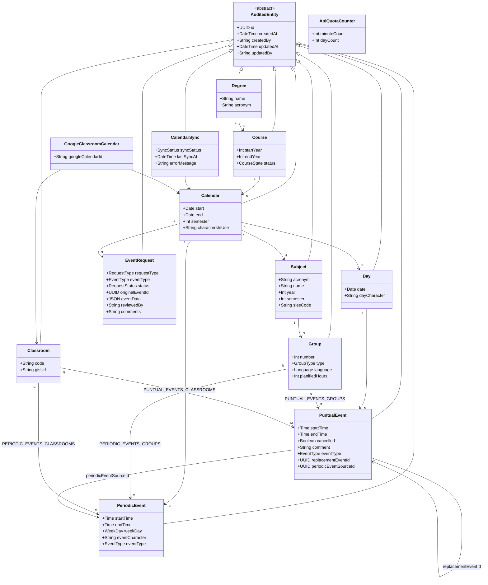

# Capítulo 4 — SYSTEM REQUIREMENTS (REQUISITOS DEL SISTEMA)

---

## 4.1 Functional Requirements

### 4.1.1 System Functions

Los requisitos funcionales del sistema se expresan mediante una lista jerárquica detallada que transforma cada requisito de usuario del Capítulo 3 en una especificación técnica del comportamiento esperado del sistema. Se incluyen los datos solicitados, su obligatoriedad, las validaciones aplicadas, los condicionales de error y las acciones del sistema tras completar cada flujo. Los módulos referenciados se corresponden con los grupos de requisitos de usuario (UR) del Capítulo 3.

Para las operaciones CRUD estándar sin lógica de negocio compleja, se evita la duplicación de escenarios redundantes (conforme a la nota del guion académico), limitándose a enumerar la operación y sus restricciones específicas.

---

#### RF-AUTH — Autenticación y acceso (→ UR1)

**RF-AUTH-01: Inicio de sesión**

RF-AUTH-01.1. El sistema presentará al usuario no autenticado un formulario de inicio de sesión.

RF-AUTH-01.2. El sistema solicitará los siguientes datos:

&nbsp;&nbsp;&nbsp;&nbsp;RF-AUTH-01.2.1. Correo electrónico.

&nbsp;&nbsp;&nbsp;&nbsp;&nbsp;&nbsp;&nbsp;&nbsp;RF-AUTH-01.2.1.1. Es un dato obligatorio.

&nbsp;&nbsp;&nbsp;&nbsp;RF-AUTH-01.2.2. Contraseña.

&nbsp;&nbsp;&nbsp;&nbsp;&nbsp;&nbsp;&nbsp;&nbsp;RF-AUTH-01.2.2.1. Es un dato obligatorio.

RF-AUTH-01.3. El sistema verificará que existe un usuario registrado con el correo electrónico indicado y que su cuenta está en estado activo (`isActive = true`).

RF-AUTH-01.4. El sistema comparará la contraseña introducida con el hash almacenado en base de datos mediante `bcrypt.compare()`.

RF-AUTH-01.5. Si las credenciales son correctas, el sistema generará un token JWT firmado con el algoritmo HS256, con el siguiente contenido en el payload: `userId`, `email` y `role`, y con una validez de 24 horas.

&nbsp;&nbsp;&nbsp;&nbsp;RF-AUTH-01.5.1. El sistema devolverá el token al cliente.

&nbsp;&nbsp;&nbsp;&nbsp;RF-AUTH-01.5.2. El sistema redirigirá al usuario a la pantalla principal según su rol:

&nbsp;&nbsp;&nbsp;&nbsp;&nbsp;&nbsp;&nbsp;&nbsp;RF-AUTH-01.5.2.1. Si el rol es `ROLE_ADMIN`, el sistema redirigirá al panel de administración.

&nbsp;&nbsp;&nbsp;&nbsp;&nbsp;&nbsp;&nbsp;&nbsp;RF-AUTH-01.5.2.2. Si el rol es `ROLE_PROFESSOR`, el sistema redirigirá a la vista de docente.

RF-AUTH-01.6. Si el correo electrónico no existe en el sistema, la cuenta no está activa, o la contraseña es incorrecta, el sistema mostrará el mismo mensaje de error genérico (*"Credenciales inválidas"*) sin revelar cuál de las condiciones no se ha cumplido, y el usuario no quedará autenticado.

---

**RF-AUTH-02: Activación de cuenta**

RF-AUTH-02.1. Cuando el administrador crea un nuevo usuario, el sistema generará un token de activación único con validez de 48 horas y lo almacenará asociado al registro del usuario en la base de datos.

RF-AUTH-02.2. El sistema enviará un correo electrónico al usuario con el enlace de activación que incorpora el token.

RF-AUTH-02.3. Al acceder al enlace, el sistema comprobará la validez del token.

&nbsp;&nbsp;&nbsp;&nbsp;RF-AUTH-02.3.1. Si el token ha expirado o no existe, el sistema mostrará un mensaje de error indicando al usuario que contacte con su administrador para que le reenvíe el enlace.

&nbsp;&nbsp;&nbsp;&nbsp;RF-AUTH-02.3.2. Si el token es válido, el sistema presentará el formulario de activación.

RF-AUTH-02.4. El sistema solicitará al usuario los siguientes datos:

&nbsp;&nbsp;&nbsp;&nbsp;RF-AUTH-02.4.1. Nueva contraseña.

&nbsp;&nbsp;&nbsp;&nbsp;&nbsp;&nbsp;&nbsp;&nbsp;RF-AUTH-02.4.1.1. Es un dato obligatorio.

&nbsp;&nbsp;&nbsp;&nbsp;&nbsp;&nbsp;&nbsp;&nbsp;RF-AUTH-02.4.1.2. Debe tener al menos 8 caracteres y no más de 128.

&nbsp;&nbsp;&nbsp;&nbsp;&nbsp;&nbsp;&nbsp;&nbsp;RF-AUTH-02.4.1.3. Debe contener al menos una letra mayúscula (A–Z).

&nbsp;&nbsp;&nbsp;&nbsp;&nbsp;&nbsp;&nbsp;&nbsp;RF-AUTH-02.4.1.4. Debe contener al menos una letra minúscula (a–z).

&nbsp;&nbsp;&nbsp;&nbsp;&nbsp;&nbsp;&nbsp;&nbsp;RF-AUTH-02.4.1.5. Debe contener al menos un dígito (0–9).

&nbsp;&nbsp;&nbsp;&nbsp;&nbsp;&nbsp;&nbsp;&nbsp;RF-AUTH-02.4.1.6. Debe contener al menos un carácter especial.

&nbsp;&nbsp;&nbsp;&nbsp;RF-AUTH-02.4.2. Confirmación de la nueva contraseña.

&nbsp;&nbsp;&nbsp;&nbsp;&nbsp;&nbsp;&nbsp;&nbsp;RF-AUTH-02.4.2.1. Es un dato obligatorio.

&nbsp;&nbsp;&nbsp;&nbsp;&nbsp;&nbsp;&nbsp;&nbsp;RF-AUTH-02.4.2.2. Debe coincidir exactamente con la contraseña introducida en RF-AUTH-02.4.1.

RF-AUTH-02.5. Si la contraseña no cumple los requisitos de complejidad, el sistema mostrará un indicador en tiempo real señalando qué condición no está satisfecha y no completará la activación.

RF-AUTH-02.6. Si las contraseñas no coinciden, el sistema mostrará un mensaje de error y no completará la activación.

RF-AUTH-02.7. Si los datos son válidos, el sistema cifrará la contraseña con `bcrypt.hash()` con factor de coste 10, actualizará el registro del usuario estableciendo `isActive = true`, invalidará el token de activación y redirigirá al usuario al formulario de inicio de sesión.

---

**RF-AUTH-03: Recuperación de contraseña mediante código OTP**

El proceso se realiza en tres pasos secuenciales.

RF-AUTH-03.1. **Paso 1 — Solicitud de código de verificación.**

&nbsp;&nbsp;&nbsp;&nbsp;RF-AUTH-03.1.1. El sistema solicitará al usuario su correo electrónico.

&nbsp;&nbsp;&nbsp;&nbsp;&nbsp;&nbsp;&nbsp;&nbsp;RF-AUTH-03.1.1.1. Es un dato obligatorio.

&nbsp;&nbsp;&nbsp;&nbsp;RF-AUTH-03.1.2. El sistema comprobará si el correo existe y la cuenta está activa. La respuesta del sistema será siempre genérica, sin revelar si el correo está registrado o no.

&nbsp;&nbsp;&nbsp;&nbsp;RF-AUTH-03.1.3. Si el correo existe y la cuenta está activa, el sistema generará un código OTP numérico de seis dígitos con una validez de 15 minutos y lo enviará por correo electrónico.

&nbsp;&nbsp;&nbsp;&nbsp;RF-AUTH-03.1.4. El sistema aplicará un período de enfriamiento de 60 segundos: no permitirá generar un nuevo código para el mismo correo hasta que hayan transcurrido 60 segundos desde la solicitud anterior.

RF-AUTH-03.2. **Paso 2 — Verificación del código OTP.**

&nbsp;&nbsp;&nbsp;&nbsp;RF-AUTH-03.2.1. El sistema solicitará al usuario el código de seis dígitos recibido por correo.

&nbsp;&nbsp;&nbsp;&nbsp;&nbsp;&nbsp;&nbsp;&nbsp;RF-AUTH-03.2.1.1. Es un dato obligatorio.

&nbsp;&nbsp;&nbsp;&nbsp;RF-AUTH-03.2.2. El sistema comprobará que el código introducido coincide con el almacenado y que no ha expirado.

&nbsp;&nbsp;&nbsp;&nbsp;RF-AUTH-03.2.3. Si el código ha expirado, el sistema mostrará un mensaje de error (*"El código ha expirado. Solicite uno nuevo."*) y no pasará al siguiente paso.

&nbsp;&nbsp;&nbsp;&nbsp;RF-AUTH-03.2.4. Si el código es incorrecto, el sistema mostrará un mensaje de error (*"Código de verificación inválido."*) y no pasará al siguiente paso.

&nbsp;&nbsp;&nbsp;&nbsp;RF-AUTH-03.2.5. Si el código es válido, el sistema generará un `resetToken` de un solo uso y lo asociará internamente a la sesión de recuperación.

RF-AUTH-03.3. **Paso 3 — Establecer nueva contraseña.**

&nbsp;&nbsp;&nbsp;&nbsp;RF-AUTH-03.3.1. El sistema solicitará al usuario los siguientes datos:

&nbsp;&nbsp;&nbsp;&nbsp;&nbsp;&nbsp;&nbsp;&nbsp;RF-AUTH-03.3.1.1. Nueva contraseña, con los mismos requisitos de complejidad de RF-AUTH-02.4.1.

&nbsp;&nbsp;&nbsp;&nbsp;&nbsp;&nbsp;&nbsp;&nbsp;RF-AUTH-03.3.1.2. Confirmación de la nueva contraseña.

&nbsp;&nbsp;&nbsp;&nbsp;RF-AUTH-03.3.2. Si la contraseña no cumple los requisitos de complejidad, el sistema mostrará un mensaje de error y no actualizará la contraseña.

&nbsp;&nbsp;&nbsp;&nbsp;RF-AUTH-03.3.3. Si las contraseñas no coinciden, el sistema mostrará un mensaje de error y no actualizará la contraseña.

&nbsp;&nbsp;&nbsp;&nbsp;RF-AUTH-03.3.4. Si los datos son válidos, el sistema cifrará la nueva contraseña con bcrypt (factor 10), la almacenará en base de datos, invalidará el `resetToken` y redirigirá al usuario al formulario de inicio de sesión.

---

**RF-AUTH-04: Cierre de sesión**

RF-AUTH-04.1. El sistema eliminará el token JWT del almacenamiento del cliente.

RF-AUTH-04.2. El sistema redirigirá al usuario a la pantalla de inicio.

---

**RF-AUTH-05: Conexión con Google OAuth (para sincronización de calendario)**

RF-AUTH-05.1. Desde la página de configuración (`/settings`), el usuario autenticado podrá iniciar el flujo OAuth 2.0 con Google.

RF-AUTH-05.2. El sistema redirigirá al usuario a la pantalla de consentimiento de Google, solicitando acceso al ámbito `calendar` de Google Calendar API.

RF-AUTH-05.3. Google devolverá un código de autorización al sistema.

RF-AUTH-05.4. El sistema intercambiará el código de autorización por un `access_token` y un `refresh_token` mediante la API de Google.

&nbsp;&nbsp;&nbsp;&nbsp;RF-AUTH-05.4.1. El sistema almacenará ambos tokens cifrados en base de datos mediante AES-256 usando la clave configurada en la variable de entorno `ENCRYPTION_KEY`.

&nbsp;&nbsp;&nbsp;&nbsp;RF-AUTH-05.4.2. El sistema almacenará también la fecha de expiración del `access_token`.

RF-AUTH-05.5. El sistema mostrará al usuario el correo electrónico de la cuenta de Google vinculada como confirmación de la conexión exitosa.

RF-AUTH-05.6. Si el usuario deniega el acceso en la pantalla de consentimiento de Google, el sistema mostrará un mensaje informativo y no almacenará ningún token.

RF-AUTH-05.7. El usuario podrá desconectar su cuenta de Google desde la misma página de configuración.

&nbsp;&nbsp;&nbsp;&nbsp;RF-AUTH-05.7.1. El sistema solicitará confirmación antes de proceder.

&nbsp;&nbsp;&nbsp;&nbsp;RF-AUTH-05.7.2. El sistema obtendrá un `access_token` válido (renovándolo si es necesario) y eliminará todos los Google Calendars de aulas creados por ese usuario llamando a la Google Calendar API.

&nbsp;&nbsp;&nbsp;&nbsp;RF-AUTH-05.7.3. El sistema eliminará los registros `GoogleClassroomCalendar` y `CalendarSync` asociados al usuario en base de datos.

&nbsp;&nbsp;&nbsp;&nbsp;RF-AUTH-05.7.4. El sistema eliminará los tokens de Google almacenados del usuario.

---

**RF-AUTH-06: Cambio de contraseña desde perfil**

RF-AUTH-06.1. El sistema permitirá a cualquier usuario autenticado cambiar su contraseña desde la página de configuración de perfil (`/settings`).

RF-AUTH-06.2. El sistema solicitará los siguientes datos:

&nbsp;&nbsp;&nbsp;&nbsp;RF-AUTH-06.2.1. Contraseña actual.

&nbsp;&nbsp;&nbsp;&nbsp;&nbsp;&nbsp;&nbsp;&nbsp;RF-AUTH-06.2.1.1. Es un dato obligatorio.

&nbsp;&nbsp;&nbsp;&nbsp;RF-AUTH-06.2.2. Nueva contraseña.

&nbsp;&nbsp;&nbsp;&nbsp;&nbsp;&nbsp;&nbsp;&nbsp;RF-AUTH-06.2.2.1. Es un dato obligatorio.

&nbsp;&nbsp;&nbsp;&nbsp;&nbsp;&nbsp;&nbsp;&nbsp;RF-AUTH-06.2.2.2. Debe cumplir los mismos requisitos de complejidad definidos en RF-AUTH-02.4.1.

&nbsp;&nbsp;&nbsp;&nbsp;RF-AUTH-06.2.3. Confirmación de la nueva contraseña.

&nbsp;&nbsp;&nbsp;&nbsp;&nbsp;&nbsp;&nbsp;&nbsp;RF-AUTH-06.2.3.1. Es un dato obligatorio. Debe coincidir con RF-AUTH-06.2.2.

RF-AUTH-06.3. El sistema verificará la contraseña actual mediante `bcrypt.compare()` antes de proceder.

&nbsp;&nbsp;&nbsp;&nbsp;RF-AUTH-06.3.1. Si la contraseña actual es incorrecta, el sistema mostrará un mensaje de error y no realizará el cambio.

RF-AUTH-06.4. Si todos los datos son válidos, el sistema cifrará la nueva contraseña con bcrypt (factor 10) y actualizará el registro del usuario en la base de datos. El endpoint utilizado es `PATCH /user/:id/password`.

---

#### RF-USER — Gestión de usuarios (→ UR2)

**RF-USER-01: Registrar nuevo usuario** *(solo ROLE_ADMIN)*

RF-USER-01.1. El sistema solicitará al administrador los siguientes datos:

&nbsp;&nbsp;&nbsp;&nbsp;RF-USER-01.1.1. Nombre.

&nbsp;&nbsp;&nbsp;&nbsp;&nbsp;&nbsp;&nbsp;&nbsp;RF-USER-01.1.1.1. Es un dato obligatorio.

&nbsp;&nbsp;&nbsp;&nbsp;RF-USER-01.1.2. Primer apellido.

&nbsp;&nbsp;&nbsp;&nbsp;&nbsp;&nbsp;&nbsp;&nbsp;RF-USER-01.1.2.1. Es un dato obligatorio.

&nbsp;&nbsp;&nbsp;&nbsp;RF-USER-01.1.3. Segundo apellido.

&nbsp;&nbsp;&nbsp;&nbsp;&nbsp;&nbsp;&nbsp;&nbsp;RF-USER-01.1.3.1. Es un dato obligatorio.

&nbsp;&nbsp;&nbsp;&nbsp;RF-USER-01.1.4. Correo electrónico.

&nbsp;&nbsp;&nbsp;&nbsp;&nbsp;&nbsp;&nbsp;&nbsp;RF-USER-01.1.4.1. Es un dato obligatorio.

&nbsp;&nbsp;&nbsp;&nbsp;&nbsp;&nbsp;&nbsp;&nbsp;RF-USER-01.1.4.2. El sistema comprobará que el formato del correo es válido.

&nbsp;&nbsp;&nbsp;&nbsp;&nbsp;&nbsp;&nbsp;&nbsp;RF-USER-01.1.4.3. El sistema comprobará que el correo no está ya registrado en la base de datos de usuarios (`management_db`).

&nbsp;&nbsp;&nbsp;&nbsp;RF-USER-01.1.5. Rol.

&nbsp;&nbsp;&nbsp;&nbsp;&nbsp;&nbsp;&nbsp;&nbsp;RF-USER-01.1.5.1. Es un dato obligatorio.

&nbsp;&nbsp;&nbsp;&nbsp;&nbsp;&nbsp;&nbsp;&nbsp;RF-USER-01.1.5.2. El sistema permitirá elegir entre `ROLE_ADMIN` y `ROLE_PROFESSOR`.

&nbsp;&nbsp;&nbsp;&nbsp;RF-USER-01.1.6. Usuario UniOvi.

&nbsp;&nbsp;&nbsp;&nbsp;&nbsp;&nbsp;&nbsp;&nbsp;RF-USER-01.1.6.1. Es un dato opcional.

RF-USER-01.2. Si el formato del correo electrónico no es válido, el sistema mostrará un mensaje de error (*"Formato de email inválido"*) y no completará el registro.

RF-USER-01.3. Si el correo electrónico ya está registrado en el sistema, el sistema mostrará un mensaje de error (*"El email ya está registrado en el sistema"*) y no completará el registro.

RF-USER-01.4. Si los datos son válidos, el sistema creará el registro de usuario en base de datos con `isActive = false` y ejecutará el flujo de activación de cuenta descrito en RF-AUTH-02.

---

**RF-USER-02: Importar usuarios desde Excel** *(solo ROLE_ADMIN)*

RF-USER-02.1. El sistema solicitará al administrador que cargue un fichero en formato `.xlsx`.

RF-USER-02.2. El sistema parseará el fichero utilizando la librería XLSX y procesará cada fila de forma independiente, leyendo las columnas por posición (columna 0, 1, 2, 3).

RF-USER-02.3. Para cada fila, el sistema comprobará que contiene las siguientes columnas con datos válidos:

&nbsp;&nbsp;&nbsp;&nbsp;RF-USER-02.3.1. Columna 0 — Usuario UniOvi (`unioviUser`). Es obligatorio.

&nbsp;&nbsp;&nbsp;&nbsp;RF-USER-02.3.2. Columna 1 — Nombre (`name`). Es obligatorio.

&nbsp;&nbsp;&nbsp;&nbsp;RF-USER-02.3.3. Columna 2 — Apellidos (`surnames`). Es obligatorio. El sistema dividirá este campo por espacios: la primera palabra será el primer apellido y el resto (si los hubiera) será el segundo apellido.

&nbsp;&nbsp;&nbsp;&nbsp;RF-USER-02.3.4. Columna 3 — Correo electrónico (`email`). Es obligatorio. El sistema comprobará formato válido y que no está ya registrado en el sistema.

RF-USER-02.4. Para las filas válidas, el sistema creará el usuario con `isActive = false` y `role = ROLE_PROFESSOR` por defecto, y enviará el correo de activación.

RF-USER-02.5. El sistema mostrará al administrador un informe final indicando: número de usuarios creados correctamente y, para cada fila con error, el número de fila y el motivo del error.

---

**RF-USER-03: Consultar listado de usuarios** *(solo ROLE_ADMIN)*

RF-USER-03.1. El sistema mostrará la lista de usuarios registrados con las columnas: nombre completo, correo electrónico, rol, estado (`Activo` / `Inactivo`) y fecha de registro.

RF-USER-03.2. El sistema permitirá filtrar el listado por rol (`ROLE_ADMIN`, `ROLE_PROFESSOR`, o todos) y por estado (activo, inactivo, o todos).

RF-USER-03.3. El sistema permitirá realizar búsquedas por nombre o correo electrónico (búsqueda insensible a mayúsculas).

RF-USER-03.4. El sistema implementará paginación en el listado.

---

**RF-USER-04: Modificar datos de perfil** *(cualquier usuario autenticado para su propio perfil; ROLE_ADMIN para cualquier usuario)*

RF-USER-04.1. Cualquier usuario autenticado podrá modificar los siguientes campos de su propio perfil: nombre, primer apellido, segundo apellido, correo electrónico y usuario UniOvi. El rol y el estado no son modificables por el propio usuario.

RF-USER-04.2. El administrador podrá modificar los siguientes campos de cualquier usuario: nombre, primer apellido, segundo apellido, usuario UniOvi, rol y estado (activo/inactivo).

RF-USER-04.3. El correo electrónico no es modificable por el administrador una vez creado el usuario, ya que es el identificador único en el sistema. Solo el propio usuario puede actualizarlo desde su perfil.

RF-USER-04.4. Si el administrador intenta cambiar el rol o desactivar al último administrador activo del sistema, el sistema mostrará un mensaje de error (*"No puede cambiar el rol del último administrador"* o *"No puede desactivar al último administrador"*) y no aplicará el cambio.

RF-USER-04.5. Si el administrador intenta desactivar su propia cuenta, el sistema mostrará un mensaje de error (*"No puede desactivar su propia cuenta"*) y no aplicará el cambio.

---

**RF-USER-05: Eliminar usuario** *(solo ROLE_ADMIN)*

RF-USER-05.1. El sistema mostrará un diálogo de confirmación antes de eliminar un usuario, indicando que la acción es irreversible.

RF-USER-05.2. Si el administrador intenta eliminar al último administrador activo, el sistema mostrará un mensaje de error y no realizará la eliminación.

RF-USER-05.3. Si el administrador intenta eliminar su propia cuenta, el sistema mostrará un mensaje de error y no realizará la eliminación.

RF-USER-05.4. Si la confirmación procede, el sistema eliminará el registro del usuario de la base de datos.

---

**RF-USER-06: Reenviar email de activación** *(solo ROLE_ADMIN)*

RF-USER-06.1. El sistema permitirá al administrador reenviar el correo electrónico de activación a un usuario que haya sido registrado pero aún no haya activado su cuenta (`isActive = false`).

RF-USER-06.2. El sistema generará un nuevo token de activación con validez de 48 horas, invalidará el anterior si existía, y enviará el correo de activación con el nuevo enlace.

RF-USER-06.3. Si el usuario ya tiene la cuenta activa (`isActive = true`), el sistema mostrará un mensaje de error y no realizará la operación.

---

#### RF-STRUCT — Gestión de la estructura académica (→ UR3)

**RF-STRUCT-01: Gestión de titulaciones** *(solo ROLE_ADMIN)*

RF-STRUCT-01.1. **Crear titulación.** El sistema solicitará los siguientes datos:

&nbsp;&nbsp;&nbsp;&nbsp;RF-STRUCT-01.1.1. Nombre.

&nbsp;&nbsp;&nbsp;&nbsp;&nbsp;&nbsp;&nbsp;&nbsp;RF-STRUCT-01.1.1.1. Es un dato obligatorio. Máximo 100 caracteres.

&nbsp;&nbsp;&nbsp;&nbsp;&nbsp;&nbsp;&nbsp;&nbsp;RF-STRUCT-01.1.1.2. El sistema comprobará que el nombre no está ya registrado en el sistema (restricción `UNIQUE` en base de datos).

&nbsp;&nbsp;&nbsp;&nbsp;RF-STRUCT-01.1.2. Acrónimo.

&nbsp;&nbsp;&nbsp;&nbsp;&nbsp;&nbsp;&nbsp;&nbsp;RF-STRUCT-01.1.2.1. Es un dato obligatorio. Máximo 20 caracteres.

&nbsp;&nbsp;&nbsp;&nbsp;&nbsp;&nbsp;&nbsp;&nbsp;RF-STRUCT-01.1.2.2. El sistema comprobará que el acrónimo no está ya registrado en el sistema (restricción `UNIQUE` en base de datos).

&nbsp;&nbsp;&nbsp;&nbsp;RF-STRUCT-01.1.3. Si el nombre ya existe, el sistema mostrará un mensaje de error (*"Ya existe una titulación con ese nombre"*) y no completará la creación.

&nbsp;&nbsp;&nbsp;&nbsp;RF-STRUCT-01.1.4. Si el acrónimo ya existe, el sistema mostrará un mensaje de error (*"Ya existe una titulación con ese acrónimo"*) y no completará la creación.

&nbsp;&nbsp;&nbsp;&nbsp;RF-STRUCT-01.1.5. Si los datos son válidos, el sistema creará la titulación, registrará los metadatos de auditoría (`createdBy`, `createdAt`) y mostrará una confirmación.

RF-STRUCT-01.2. **Consultar titulaciones.** El sistema mostrará el listado de titulaciones existentes con nombre, acrónimo y número de cursos asociados.

RF-STRUCT-01.3. **Modificar titulación.** El sistema permitirá editar el nombre y el acrónimo, aplicando las mismas validaciones de unicidad que en la creación.

RF-STRUCT-01.4. **Eliminar titulación.**

&nbsp;&nbsp;&nbsp;&nbsp;RF-STRUCT-01.4.1. El sistema comprobará que la titulación no tiene cursos académicos asociados.

&nbsp;&nbsp;&nbsp;&nbsp;RF-STRUCT-01.4.2. Si tiene cursos asociados, el sistema mostrará un mensaje de error (*"No puede eliminar una titulación con cursos académicos asociados"*) y no completará la eliminación.

&nbsp;&nbsp;&nbsp;&nbsp;RF-STRUCT-01.4.3. Si no tiene cursos asociados, el sistema solicitará confirmación y procederá con la eliminación.

---

**RF-STRUCT-02: Gestión de cursos académicos** *(solo ROLE_ADMIN)*

RF-STRUCT-02.1. **Crear curso académico.** El sistema solicitará los siguientes datos:

&nbsp;&nbsp;&nbsp;&nbsp;RF-STRUCT-02.1.1. Titulación a la que pertenece.

&nbsp;&nbsp;&nbsp;&nbsp;&nbsp;&nbsp;&nbsp;&nbsp;RF-STRUCT-02.1.1.1. Es un dato obligatorio. Se seleccionará de las titulaciones existentes.

&nbsp;&nbsp;&nbsp;&nbsp;RF-STRUCT-02.1.2. Año de inicio (`startYear`).

&nbsp;&nbsp;&nbsp;&nbsp;&nbsp;&nbsp;&nbsp;&nbsp;RF-STRUCT-02.1.2.1. Es un dato obligatorio.

&nbsp;&nbsp;&nbsp;&nbsp;RF-STRUCT-02.1.3. Año de fin (`endYear`).

&nbsp;&nbsp;&nbsp;&nbsp;&nbsp;&nbsp;&nbsp;&nbsp;RF-STRUCT-02.1.3.1. Es un dato obligatorio.

&nbsp;&nbsp;&nbsp;&nbsp;&nbsp;&nbsp;&nbsp;&nbsp;RF-STRUCT-02.1.3.2. Debe ser posterior al año de inicio.

&nbsp;&nbsp;&nbsp;&nbsp;RF-STRUCT-02.1.4. Si ya existe un curso con los mismos años para esa titulación, el sistema mostrará un mensaje de error y no completará la creación.

&nbsp;&nbsp;&nbsp;&nbsp;RF-STRUCT-02.1.5. Si los datos son válidos, el sistema creará el curso con estado inicial `PLANIFICADO`.

RF-STRUCT-02.2. **Modificar curso académico.** El sistema permitirá editar el estado del curso:

&nbsp;&nbsp;&nbsp;&nbsp;RF-STRUCT-02.2.1. El sistema permitirá elegir entre los valores: `PLANIFICADO`, `ACTIVO`, `FINALIZADO`.

&nbsp;&nbsp;&nbsp;&nbsp;RF-STRUCT-02.2.2. Las transiciones de estado son unidireccionales: `PLANIFICADO` → `ACTIVO` → `FINALIZADO`. El sistema no permitirá revertir un curso a un estado anterior.

RF-STRUCT-02.3. **Eliminar curso académico.**

&nbsp;&nbsp;&nbsp;&nbsp;RF-STRUCT-02.3.1. Si el curso tiene calendarios con eventos asociados, el sistema mostrará un mensaje de error y no completará la eliminación.

---

**RF-STRUCT-03: Gestión de asignaturas** *(solo ROLE_ADMIN)*

RF-STRUCT-03.1. **Crear asignatura.** El sistema solicitará los siguientes datos:

&nbsp;&nbsp;&nbsp;&nbsp;RF-STRUCT-03.1.1. Nombre.

&nbsp;&nbsp;&nbsp;&nbsp;&nbsp;&nbsp;&nbsp;&nbsp;RF-STRUCT-03.1.1.1. Es un dato obligatorio.

&nbsp;&nbsp;&nbsp;&nbsp;&nbsp;&nbsp;&nbsp;&nbsp;RF-STRUCT-03.1.1.2. Debe ser único dentro de la misma titulación.

&nbsp;&nbsp;&nbsp;&nbsp;RF-STRUCT-03.1.2. Acrónimo.

&nbsp;&nbsp;&nbsp;&nbsp;&nbsp;&nbsp;&nbsp;&nbsp;RF-STRUCT-03.1.2.1. Es un dato obligatorio.

&nbsp;&nbsp;&nbsp;&nbsp;&nbsp;&nbsp;&nbsp;&nbsp;RF-STRUCT-03.1.2.2. Debe ser único dentro de la misma titulación.

&nbsp;&nbsp;&nbsp;&nbsp;RF-STRUCT-03.1.3. Código SIES (`siesCode`).

&nbsp;&nbsp;&nbsp;&nbsp;&nbsp;&nbsp;&nbsp;&nbsp;RF-STRUCT-03.1.3.1. Es un dato obligatorio.

&nbsp;&nbsp;&nbsp;&nbsp;&nbsp;&nbsp;&nbsp;&nbsp;RF-STRUCT-03.1.3.2. No será modificable una vez creada la asignatura.

&nbsp;&nbsp;&nbsp;&nbsp;RF-STRUCT-03.1.4. Titulación.

&nbsp;&nbsp;&nbsp;&nbsp;&nbsp;&nbsp;&nbsp;&nbsp;RF-STRUCT-03.1.4.1. Es un dato obligatorio. Se seleccionará de las titulaciones existentes.

&nbsp;&nbsp;&nbsp;&nbsp;RF-STRUCT-03.1.5. Semestre (`semester`).

&nbsp;&nbsp;&nbsp;&nbsp;&nbsp;&nbsp;&nbsp;&nbsp;RF-STRUCT-03.1.5.1. Es un dato obligatorio.

&nbsp;&nbsp;&nbsp;&nbsp;&nbsp;&nbsp;&nbsp;&nbsp;RF-STRUCT-03.1.5.2. El sistema aceptará únicamente los valores `1` o `2`.

&nbsp;&nbsp;&nbsp;&nbsp;RF-STRUCT-03.1.6. Curso en el que se imparte (`year`).

&nbsp;&nbsp;&nbsp;&nbsp;&nbsp;&nbsp;&nbsp;&nbsp;RF-STRUCT-03.1.6.1. Es un dato obligatorio.

&nbsp;&nbsp;&nbsp;&nbsp;&nbsp;&nbsp;&nbsp;&nbsp;RF-STRUCT-03.1.6.2. El sistema aceptará los valores `0` (sin curso específico — asignaturas optativas o de libre elección), `1`, `2`, `3` o `4`. Esta restricción está implementada como constraint `CHECK` en la base de datos.

&nbsp;&nbsp;&nbsp;&nbsp;RF-STRUCT-03.1.7. Si el nombre o el acrónimo ya existen dentro de la misma titulación, el sistema mostrará un mensaje de error específico y no completará la creación.

RF-STRUCT-03.2. **Modificar asignatura.** El sistema permitirá editar todos los campos excepto el código SIES, que se mostrará como campo de solo lectura.

RF-STRUCT-03.3. **Eliminar asignatura.**

&nbsp;&nbsp;&nbsp;&nbsp;RF-STRUCT-03.3.1. El sistema mostrará un aviso al administrador indicando que la eliminación también eliminará en cascada todos los grupos de la asignatura y todos los eventos asociados a esos grupos.

&nbsp;&nbsp;&nbsp;&nbsp;RF-STRUCT-03.3.2. Tras la confirmación explícita del administrador, el sistema procederá con la eliminación en cascada.

---

**RF-STRUCT-04: Gestión de grupos** *(solo ROLE_ADMIN)*

RF-STRUCT-04.1. **Crear grupo.** El sistema solicitará los siguientes datos:

&nbsp;&nbsp;&nbsp;&nbsp;RF-STRUCT-04.1.1. Asignatura a la que pertenece.

&nbsp;&nbsp;&nbsp;&nbsp;&nbsp;&nbsp;&nbsp;&nbsp;RF-STRUCT-04.1.1.1. Es un dato obligatorio.

&nbsp;&nbsp;&nbsp;&nbsp;RF-STRUCT-04.1.2. Tipo de grupo (`type`).

&nbsp;&nbsp;&nbsp;&nbsp;&nbsp;&nbsp;&nbsp;&nbsp;RF-STRUCT-04.1.2.1. Es un dato obligatorio.

&nbsp;&nbsp;&nbsp;&nbsp;&nbsp;&nbsp;&nbsp;&nbsp;RF-STRUCT-04.1.2.2. El sistema aceptará los valores: `T` (Teoría), `S` (Seminario), `L` (Prácticas de Laboratorio), `TG` (Tutoría Grupal).

&nbsp;&nbsp;&nbsp;&nbsp;RF-STRUCT-04.1.3. Idioma (`language`).

&nbsp;&nbsp;&nbsp;&nbsp;&nbsp;&nbsp;&nbsp;&nbsp;RF-STRUCT-04.1.3.1. Es un dato obligatorio.

&nbsp;&nbsp;&nbsp;&nbsp;&nbsp;&nbsp;&nbsp;&nbsp;RF-STRUCT-04.1.3.2. El sistema aceptará los valores: `ES` (Español) y `EN` (Inglés).

&nbsp;&nbsp;&nbsp;&nbsp;RF-STRUCT-04.1.4. Horas planificadas (`planifiedHours`).

&nbsp;&nbsp;&nbsp;&nbsp;&nbsp;&nbsp;&nbsp;&nbsp;RF-STRUCT-04.1.4.1. Es un dato obligatorio.

&nbsp;&nbsp;&nbsp;&nbsp;&nbsp;&nbsp;&nbsp;&nbsp;RF-STRUCT-04.1.4.2. Debe ser un número decimal positivo múltiplo de 0,5 (por ejemplo: 0, 0.5, 1, 1.5, 6). El campo se almacena como `decimal(10,2)`. No se aceptan valores negativos ni decimales que no sean múltiplos de 0,5.

&nbsp;&nbsp;&nbsp;&nbsp;RF-STRUCT-04.1.5. El número de grupo (`number`) es asignado automáticamente por el sistema. El sistema seleccionará el siguiente número disponible para la combinación de asignatura, tipo e idioma especificados.

&nbsp;&nbsp;&nbsp;&nbsp;RF-STRUCT-04.1.6. Si la combinación (asignatura, tipo, idioma, número asignado) ya existe, el sistema mostrará un mensaje de error y no completará la creación.

RF-STRUCT-04.2. **Consultar, modificar y eliminar grupos.** El sistema permitirá estas operaciones con las mismas validaciones de unicidad en la modificación. La eliminación solicitará confirmación antes de proceder.

---

**RF-STRUCT-05: Gestión de aulas** *(solo ROLE_ADMIN)*

RF-STRUCT-05.1. **Crear aula.** El sistema solicitará los siguientes datos:

&nbsp;&nbsp;&nbsp;&nbsp;RF-STRUCT-05.1.1. Código del aula (`code`).

&nbsp;&nbsp;&nbsp;&nbsp;&nbsp;&nbsp;&nbsp;&nbsp;RF-STRUCT-05.1.1.1. Es un dato obligatorio. Máximo 50 caracteres.

&nbsp;&nbsp;&nbsp;&nbsp;&nbsp;&nbsp;&nbsp;&nbsp;RF-STRUCT-05.1.1.2. El sistema comprobará que el código no está ya registrado en el sistema (restricción `UNIQUE` en base de datos).

&nbsp;&nbsp;&nbsp;&nbsp;RF-STRUCT-05.1.2. URL GIS (`gisUrl`).

&nbsp;&nbsp;&nbsp;&nbsp;&nbsp;&nbsp;&nbsp;&nbsp;RF-STRUCT-05.1.2.1. Es un dato opcional.

&nbsp;&nbsp;&nbsp;&nbsp;&nbsp;&nbsp;&nbsp;&nbsp;RF-STRUCT-05.1.2.2. Si se proporciona, el sistema comprobará que el valor tiene formato de URL válido (comienza por `http://` o `https://`).

&nbsp;&nbsp;&nbsp;&nbsp;RF-STRUCT-05.1.3. Si el código ya existe, el sistema mostrará un mensaje de error (*"Ya existe un aula con ese código"*) y no completará la creación.

RF-STRUCT-05.2. **Consultar y modificar aulas.** Operaciones estándar con las mismas validaciones de unicidad del código.

RF-STRUCT-05.3. **Eliminar aula.**

&nbsp;&nbsp;&nbsp;&nbsp;RF-STRUCT-05.3.1. Si el aula tiene eventos asociados, el sistema mostrará una advertencia al administrador indicando el número de eventos afectados y solicitará una confirmación adicional explícita (`force = true`) antes de proceder.

&nbsp;&nbsp;&nbsp;&nbsp;RF-STRUCT-05.3.2. Si el aula no tiene eventos asociados, el sistema solicitará confirmación estándar y eliminará el registro.

---

#### RF-CAL — Gestión de calendarios académicos (→ UR4)

**RF-CAL-01: Crear calendario académico** *(solo ROLE_ADMIN)*

RF-CAL-01.1. El sistema solicitará los siguientes datos:

&nbsp;&nbsp;&nbsp;&nbsp;RF-CAL-01.1.1. Curso académico.

&nbsp;&nbsp;&nbsp;&nbsp;&nbsp;&nbsp;&nbsp;&nbsp;RF-CAL-01.1.1.1. Es un dato obligatorio. Se seleccionará de los cursos académicos existentes.

&nbsp;&nbsp;&nbsp;&nbsp;RF-CAL-01.1.2. Semestre.

&nbsp;&nbsp;&nbsp;&nbsp;&nbsp;&nbsp;&nbsp;&nbsp;RF-CAL-01.1.2.1. Es un dato obligatorio. El sistema aceptará los valores `1` o `2`.

&nbsp;&nbsp;&nbsp;&nbsp;RF-CAL-01.1.3. Fecha de inicio (`start`).

&nbsp;&nbsp;&nbsp;&nbsp;&nbsp;&nbsp;&nbsp;&nbsp;RF-CAL-01.1.3.1. Es un dato obligatorio. Formato `YYYY-MM-DD`.

&nbsp;&nbsp;&nbsp;&nbsp;RF-CAL-01.1.4. Fecha de fin (`end`).

&nbsp;&nbsp;&nbsp;&nbsp;&nbsp;&nbsp;&nbsp;&nbsp;RF-CAL-01.1.4.1. Es un dato obligatorio. Formato `YYYY-MM-DD`.

&nbsp;&nbsp;&nbsp;&nbsp;&nbsp;&nbsp;&nbsp;&nbsp;RF-CAL-01.1.4.2. Debe ser posterior a la fecha de inicio.

RF-CAL-01.2. Si ya existe un calendario para la combinación (curso académico, semestre), el sistema mostrará un mensaje de error (*"Ya existe un calendario para este curso y semestre"*) y no completará la creación.

RF-CAL-01.3. Si la fecha de fin no es posterior a la fecha de inicio, el sistema mostrará un mensaje de error y no completará la creación.

RF-CAL-01.4. Si los datos son válidos, el sistema creará el registro `Calendar` y generará automáticamente un registro `Day` por cada día laborable (lunes a viernes) comprendido entre `start` y `end` (excluyendo sábados y domingos), con estado lectivo inicial.

---

**RF-CAL-02: Gestionar días lectivos y festivos** *(solo ROLE_ADMIN)*

RF-CAL-02.1. El sistema permitirá al administrador modificar el estado de cualquier día del calendario marcándolo como festivo o recuperando su estado lectivo.

RF-CAL-02.2. El campo `dayCharacter` del registro `Day` se actualizará en consecuencia.

---

**RF-CAL-03: Consultar calendarios académicos**

RF-CAL-03.1. El sistema mostrará el listado de calendarios existentes con: curso académico, semestre, fecha de inicio, fecha de fin, número de días lectivos y número de eventos programados.

RF-CAL-03.2. El sistema permitirá filtrar por curso académico y por semestre.

---

**RF-CAL-04: Duplicar calendario académico** *(solo ROLE_ADMIN)*

RF-CAL-04.1. El sistema solicitará los siguientes datos:

&nbsp;&nbsp;&nbsp;&nbsp;RF-CAL-04.1.1. Curso académico destino.

&nbsp;&nbsp;&nbsp;&nbsp;&nbsp;&nbsp;&nbsp;&nbsp;RF-CAL-04.1.1.1. Es un dato obligatorio.

&nbsp;&nbsp;&nbsp;&nbsp;RF-CAL-04.1.2. Semestre destino.

&nbsp;&nbsp;&nbsp;&nbsp;&nbsp;&nbsp;&nbsp;&nbsp;RF-CAL-04.1.2.1. Es un dato obligatorio.

&nbsp;&nbsp;&nbsp;&nbsp;RF-CAL-04.1.3. Nueva fecha de inicio.

&nbsp;&nbsp;&nbsp;&nbsp;&nbsp;&nbsp;&nbsp;&nbsp;RF-CAL-04.1.3.1. Es un dato obligatorio.

&nbsp;&nbsp;&nbsp;&nbsp;RF-CAL-04.1.4. Nueva fecha de fin.

&nbsp;&nbsp;&nbsp;&nbsp;&nbsp;&nbsp;&nbsp;&nbsp;RF-CAL-04.1.4.1. Es un dato obligatorio. Debe ser posterior a la nueva fecha de inicio.

RF-CAL-04.2. Si ya existe un calendario para el curso destino y semestre destino, el sistema mostrará un mensaje de error y no completará la duplicación.

RF-CAL-04.3. Si los datos son válidos, el sistema creará el nuevo calendario, copiará la estructura de días lectivos y festivos (ajustada a las nuevas fechas) y copiará los eventos periódicos del calendario origen al calendario destino.

---

**RF-CAL-05: Eliminar calendario académico** *(solo ROLE_ADMIN)*

RF-CAL-05.1. El sistema mostrará un resumen de los datos que se eliminarán (número de días, eventos periódicos y eventos puntuales) y solicitará confirmación explícita antes de proceder.

RF-CAL-05.2. La eliminación se realizará en cascada: se eliminarán todos los registros `Day`, `PeriodicEvent`, `PuntualEvent` y `EventRequest` asociados al calendario.

---

#### RF-EVENT — Gestión de eventos (→ UR5)

**RF-EVENT-01: Crear evento periódico** *(solo ROLE_ADMIN)*

RF-EVENT-01.1. El sistema solicitará los siguientes datos:

&nbsp;&nbsp;&nbsp;&nbsp;RF-EVENT-01.1.1. Grupo o grupos (`groups`).

&nbsp;&nbsp;&nbsp;&nbsp;&nbsp;&nbsp;&nbsp;&nbsp;RF-EVENT-01.1.1.1. Es un dato obligatorio. El administrador podrá seleccionar uno o varios grupos.

&nbsp;&nbsp;&nbsp;&nbsp;RF-EVENT-01.1.2. Aula o aulas (`classrooms`).

&nbsp;&nbsp;&nbsp;&nbsp;&nbsp;&nbsp;&nbsp;&nbsp;RF-EVENT-01.1.2.1. Es un dato opcional.

&nbsp;&nbsp;&nbsp;&nbsp;RF-EVENT-01.1.3. Hora de inicio (`startTime`).

&nbsp;&nbsp;&nbsp;&nbsp;&nbsp;&nbsp;&nbsp;&nbsp;RF-EVENT-01.1.3.1. Es un dato obligatorio. Formato `HH:MM`.

&nbsp;&nbsp;&nbsp;&nbsp;RF-EVENT-01.1.4. Hora de fin (`endTime`).

&nbsp;&nbsp;&nbsp;&nbsp;&nbsp;&nbsp;&nbsp;&nbsp;RF-EVENT-01.1.4.1. Es un dato obligatorio. Formato `HH:MM`.

&nbsp;&nbsp;&nbsp;&nbsp;&nbsp;&nbsp;&nbsp;&nbsp;RF-EVENT-01.1.4.2. Debe ser posterior a la hora de inicio.

&nbsp;&nbsp;&nbsp;&nbsp;RF-EVENT-01.1.5. Día de la semana (`weekDay`).

&nbsp;&nbsp;&nbsp;&nbsp;&nbsp;&nbsp;&nbsp;&nbsp;RF-EVENT-01.1.5.1. Es un dato obligatorio. El administrador seleccionará uno de los valores: `L` (lunes), `M` (martes), `X` (miércoles), `J` (jueves), `V` (viernes).

&nbsp;&nbsp;&nbsp;&nbsp;RF-EVENT-01.1.6. Frecuencia de repetición (`eventCharacter`).

&nbsp;&nbsp;&nbsp;&nbsp;&nbsp;&nbsp;&nbsp;&nbsp;RF-EVENT-01.1.6.1. Es un dato obligatorio. Determina en qué días lectivos del calendario aparecerá el evento. El sistema ofrecerá las siguientes opciones:

&nbsp;&nbsp;&nbsp;&nbsp;&nbsp;&nbsp;&nbsp;&nbsp;&nbsp;&nbsp;&nbsp;&nbsp;RF-EVENT-01.1.6.1.1. Semanal (`N`): el evento aparece en todos los días lectivos del calendario que coincidan con el `weekDay` seleccionado.

&nbsp;&nbsp;&nbsp;&nbsp;&nbsp;&nbsp;&nbsp;&nbsp;&nbsp;&nbsp;&nbsp;&nbsp;RF-EVENT-01.1.6.1.2. Quincenal — semanas pares (`P`): el evento aparece en los días lectivos etiquetados como semanas pares en el calendario.

&nbsp;&nbsp;&nbsp;&nbsp;&nbsp;&nbsp;&nbsp;&nbsp;&nbsp;&nbsp;&nbsp;&nbsp;RF-EVENT-01.1.6.1.3. Quincenal — semanas impares (`I`): el evento aparece en los días lectivos etiquetados como semanas impares en el calendario.

&nbsp;&nbsp;&nbsp;&nbsp;&nbsp;&nbsp;&nbsp;&nbsp;&nbsp;&nbsp;&nbsp;&nbsp;RF-EVENT-01.1.6.1.4. Personalizado: el administrador define un carácter propio que se asigna a los días del calendario de forma manual.

&nbsp;&nbsp;&nbsp;&nbsp;RF-EVENT-01.1.7. Tipo de evento (`eventType`).

&nbsp;&nbsp;&nbsp;&nbsp;&nbsp;&nbsp;&nbsp;&nbsp;RF-EVENT-01.1.7.1. Es un dato obligatorio. El sistema aceptará los siguientes valores:

&nbsp;&nbsp;&nbsp;&nbsp;&nbsp;&nbsp;&nbsp;&nbsp;&nbsp;&nbsp;&nbsp;&nbsp;RF-EVENT-01.1.7.1.1. `Class` (internamente `NORMAL`): sesión docente ordinaria. Cuenta para el presupuesto de horas planificadas del grupo y se incluye en las exportaciones `.txt`.

&nbsp;&nbsp;&nbsp;&nbsp;&nbsp;&nbsp;&nbsp;&nbsp;&nbsp;&nbsp;&nbsp;&nbsp;RF-EVENT-01.1.7.1.2. `Evaluation` (internamente `EVALUACION`): examen o evaluación formal. No consume horas planificadas. Se muestra en el calendario con el prefijo `EV·`.

&nbsp;&nbsp;&nbsp;&nbsp;&nbsp;&nbsp;&nbsp;&nbsp;&nbsp;&nbsp;&nbsp;&nbsp;RF-EVENT-01.1.7.1.3. `Review` (internamente `REVISION`): sesión de revisión de examen. No consume horas planificadas. Se muestra con el prefijo `RE·`.

&nbsp;&nbsp;&nbsp;&nbsp;&nbsp;&nbsp;&nbsp;&nbsp;&nbsp;&nbsp;&nbsp;&nbsp;RF-EVENT-01.1.7.1.4. `Others` (internamente `OTRO`): cualquier otra actividad con reserva de aula que no consume horas planificadas (charlas, talleres, etc.). Se muestra con el prefijo `OT·`.

&nbsp;&nbsp;&nbsp;&nbsp;&nbsp;&nbsp;&nbsp;&nbsp;&nbsp;&nbsp;&nbsp;&nbsp;RF-EVENT-01.1.7.1.5. `Independent` (internamente `BLOCKER`): reserva de aula sin asignatura ni grupo asociado, para bloquear un espacio por razones no académicas.

RF-EVENT-01.2. Si la hora de fin no es posterior a la hora de inicio, el sistema mostrará un mensaje de error y no completará la creación.

RF-EVENT-01.3. El tipo `Independent` no requiere selección de grupo ni asignatura asociada, ya que representa una reserva de aula sin vínculo docente. Para todos los demás tipos (`Class`, `Evaluation`, `Review`, `Others`), la selección de al menos un grupo es obligatoria.

RF-EVENT-01.4. El sistema ejecutará el algoritmo de detección de conflictos (RF-EVENT-03) con los datos introducidos.

&nbsp;&nbsp;&nbsp;&nbsp;RF-EVENT-01.4.1. Si se detecta un conflicto, el sistema mostrará un mensaje de error detallado indicando el evento en conflicto y el recurso afectado (grupo o aula), e impedirá guardar el evento.

&nbsp;&nbsp;&nbsp;&nbsp;RF-EVENT-01.4.2. Si no se detecta ningún conflicto, el sistema creará el registro `PeriodicEvent` y establecerá las relaciones con los grupos y aulas seleccionados en las tablas intermedias correspondientes.

---

**RF-EVENT-02: Crear evento puntual** *(solo ROLE_ADMIN)*

RF-EVENT-02.1. El sistema solicitará los siguientes datos:

&nbsp;&nbsp;&nbsp;&nbsp;RF-EVENT-02.1.1. Día del calendario (`day`).

&nbsp;&nbsp;&nbsp;&nbsp;&nbsp;&nbsp;&nbsp;&nbsp;RF-EVENT-02.1.1.1. Es un dato obligatorio. Debe ser un registro `Day` perteneciente al calendario activo.

&nbsp;&nbsp;&nbsp;&nbsp;RF-EVENT-02.1.2. Grupo o grupos.

&nbsp;&nbsp;&nbsp;&nbsp;&nbsp;&nbsp;&nbsp;&nbsp;RF-EVENT-02.1.2.1. Es un dato obligatorio para todos los tipos de evento excepto `Independent`, que no requiere grupo ni asignatura (ver RF-EVENT-01.3).

&nbsp;&nbsp;&nbsp;&nbsp;RF-EVENT-02.1.3. Aula o aulas.

&nbsp;&nbsp;&nbsp;&nbsp;&nbsp;&nbsp;&nbsp;&nbsp;RF-EVENT-02.1.3.1. Es un dato opcional.

&nbsp;&nbsp;&nbsp;&nbsp;RF-EVENT-02.1.4. Hora de inicio y hora de fin.

&nbsp;&nbsp;&nbsp;&nbsp;&nbsp;&nbsp;&nbsp;&nbsp;RF-EVENT-02.1.4.1. Ambos son datos obligatorios. La hora de fin debe ser posterior a la de inicio.

&nbsp;&nbsp;&nbsp;&nbsp;RF-EVENT-02.1.5. Tipo de evento.

&nbsp;&nbsp;&nbsp;&nbsp;&nbsp;&nbsp;&nbsp;&nbsp;RF-EVENT-02.1.5.1. Es un dato obligatorio, con los mismos valores que en RF-EVENT-01.1.7.1.

RF-EVENT-02.2. Si el día seleccionado está marcado como festivo (`dayCharacter` festivo), el sistema mostrará una advertencia al administrador. La creación podrá continuar si el administrador confirma.

RF-EVENT-02.3. El sistema ejecutará el algoritmo de detección de conflictos (RF-EVENT-03) para la fecha y franja horaria específicas del evento puntual.

---

**RF-EVENT-03: Detección de conflictos de horario**

Este módulo es invocado internamente antes de crear o modificar cualquier evento (periódico o puntual) y antes de aprobar cualquier solicitud de cambio.

RF-EVENT-03.1. El sistema determinará el conjunto de días afectados por el nuevo evento:

&nbsp;&nbsp;&nbsp;&nbsp;RF-EVENT-03.1.1. Para un evento periódico: todos los días lectivos del calendario cuyo `dayCharacter` corresponda al día de la semana seleccionado.

&nbsp;&nbsp;&nbsp;&nbsp;RF-EVENT-03.1.2. Para un evento puntual: únicamente el día concreto seleccionado.

RF-EVENT-03.2. Para cada día del conjunto determinado en RF-EVENT-03.1, el sistema comprobará si existe algún evento activo (no cancelado) que cumpla simultáneamente:

&nbsp;&nbsp;&nbsp;&nbsp;RF-EVENT-03.2.1. Comparte al menos uno de los grupos seleccionados, **y**

&nbsp;&nbsp;&nbsp;&nbsp;RF-EVENT-03.2.2. Se solapa en horario: `horaInicio_A < horaFin_B AND horaFin_A > horaInicio_B`.

RF-EVENT-03.3. El sistema realizará la misma comprobación para las aulas seleccionadas.

RF-EVENT-03.4. Si se detecta al menos un conflicto de grupo, el sistema generará un mensaje de error indicando el nombre del grupo en conflicto, el nombre del evento existente y la franja horaria.

RF-EVENT-03.5. Si se detecta al menos un conflicto de aula, el sistema generará un mensaje de error indicando el código del aula en conflicto y el evento existente.

RF-EVENT-03.6. Si se detectan conflictos, el sistema bloqueará la operación y mostrará todos los conflictos encontrados. El tiempo máximo de respuesta de este módulo será de 500 ms para calendarios con hasta 500 eventos.

RF-EVENT-03.7. Si no se detecta ningún conflicto, la operación continuará.

---

**RF-EVENT-04: Modificar evento periódico** *(solo ROLE_ADMIN)*

RF-EVENT-04.1. El sistema permitirá modificar los grupos, aulas, horario, días de la semana, tipo de evento y frecuencia de repetición de un evento periódico existente.

RF-EVENT-04.2. El sistema ejecutará el algoritmo de detección de conflictos (RF-EVENT-03) con los nuevos parámetros antes de guardar el cambio.

---

**RF-EVENT-05: Cancelar evento puntual** *(solo ROLE_ADMIN)*

RF-EVENT-05.1. El sistema marcará el registro `PuntualEvent` con `cancelled = true`, sin eliminarlo de la base de datos.

RF-EVENT-05.2. Los eventos cancelados se mostrarán en el calendario con indicación visual diferenciada y no se contabilizarán en las estadísticas de ocupación.

---

**RF-EVENT-06: Eliminar evento** *(solo ROLE_ADMIN)*

RF-EVENT-06.1. Para eventos periódicos, el administrador podrá eliminar una ocurrencia concreta o toda la serie:

&nbsp;&nbsp;&nbsp;&nbsp;RF-EVENT-06.1.1. Eliminar una ocurrencia concreta: el sistema creará un registro `PuntualEvent` con `cancelled = true` y `periodicEventSourceId` apuntando al `PeriodicEvent` origen, cancelando selectivamente esa ocurrencia sin afectar al resto de la serie.

&nbsp;&nbsp;&nbsp;&nbsp;RF-EVENT-06.1.2. Eliminar toda la serie: el sistema mostrará un diálogo de advertencia y, tras la confirmación, eliminará el registro `PeriodicEvent` y sus relaciones en las tablas intermedias.

RF-EVENT-06.2. Para eventos puntuales no cancelados, el sistema eliminará el registro `PuntualEvent` tras solicitar confirmación.

---

**RF-EVENT-07: Revertir cancelación de evento puntual** *(solo ROLE_ADMIN)*

RF-EVENT-07.1. El sistema permitirá al administrador revertir la cancelación de un evento puntual que tenga `cancelled = true`.

RF-EVENT-07.2. El sistema actualizará el registro `PuntualEvent` estableciendo `cancelled = false`.

RF-EVENT-07.3. El evento volverá a mostrarse en el calendario con su estado visual normal.

---

#### RF-VIEW — Consulta de horarios (→ UR6)

**RF-VIEW-01: Consulta pública de horarios**

RF-VIEW-01.1. El sistema permitirá el acceso a la vista de calendario sin requerir autenticación.

&nbsp;&nbsp;&nbsp;&nbsp;RF-VIEW-01.1.1. Los usuarios no autenticados solo podrán acceder a los calendarios cuyo curso académico tenga estado `ACTIVO`.

&nbsp;&nbsp;&nbsp;&nbsp;RF-VIEW-01.1.2. Los usuarios autenticados podrán acceder a calendarios en cualquier estado.

RF-VIEW-01.2. El sistema solicitará al usuario que seleccione el calendario a visualizar mediante la jerarquía: titulación → curso académico → semestre.

RF-VIEW-01.3. El sistema expandirá dinámicamente los eventos periódicos del calendario a sus ocurrencias concretas en cada día lectivo, respetando el sistema de caracteres de día (`dayCharacter`) y el carácter de cada evento periódico (`eventCharacter`).

RF-VIEW-01.4. El sistema presentará los eventos en una vista de tipo calendario con los siguientes modos disponibles:

&nbsp;&nbsp;&nbsp;&nbsp;RF-VIEW-01.4.1. Vista de semana completa.

&nbsp;&nbsp;&nbsp;&nbsp;RF-VIEW-01.4.2. Vista de semana laboral.

&nbsp;&nbsp;&nbsp;&nbsp;RF-VIEW-01.4.3. Vista de día.

&nbsp;&nbsp;&nbsp;&nbsp;RF-VIEW-01.4.4. Vista de mes.

&nbsp;&nbsp;&nbsp;&nbsp;RF-VIEW-01.4.5. Vista de agenda.

RF-VIEW-01.5. El sistema permitirá aplicar los siguientes filtros sobre los eventos visibles:

&nbsp;&nbsp;&nbsp;&nbsp;RF-VIEW-01.5.1. Curso del grupo (`0` = optativa, `1`, `2`, `3`, `4`).

&nbsp;&nbsp;&nbsp;&nbsp;RF-VIEW-01.5.2. Asignatura.

&nbsp;&nbsp;&nbsp;&nbsp;RF-VIEW-01.5.3. Tipo de grupo (`T`, `S`, `L`, `TG`).

&nbsp;&nbsp;&nbsp;&nbsp;RF-VIEW-01.5.4. Grupo concreto.

&nbsp;&nbsp;&nbsp;&nbsp;RF-VIEW-01.5.5. Aula.

&nbsp;&nbsp;&nbsp;&nbsp;RF-VIEW-01.5.6. Idioma (`ES`, `EN`).

&nbsp;&nbsp;&nbsp;&nbsp;RF-VIEW-01.5.7. Tipo de evento (`Class`, `Evaluation`, `Review`, `Others`, `Independent`, o cancelado).

RF-VIEW-01.5.8. *(Propiedad del sistema de filtros, no un filtro adicional.)* Los filtros combinan sus criterios con lógica AND entre categorías y OR dentro de cada categoría. Las selecciones de filtro se persisten automáticamente en el navegador del usuario entre sesiones.

RF-VIEW-01.6. Al hacer clic sobre un evento, el sistema mostrará un panel lateral con los detalles del evento: asignatura, grupo, tipo de evento, aula, horario y comentarios si los hubiera.

RF-VIEW-01.7. Los eventos con `cancelled = true` se mostrarán con estilo visual diferenciado (texto tachado, color atenuado). Los eventos procedentes de solicitudes de cambio en estado `PENDING` se mostrarán con opacidad reducida y borde discontinuo, indicando que están pendientes de aprobación.

---

#### RF-REQ — Solicitudes de cambio (→ UR7)

**RF-REQ-01: Crear solicitud de cambio** *(solo ROLE_PROFESSOR)*

RF-REQ-01.1. El sistema permitirá al docente crear solicitudes de cambio de cuatro tipos:

&nbsp;&nbsp;&nbsp;&nbsp;RF-REQ-01.1.1. `CREATE` — propuesta de creación de un nuevo evento. El campo `originalEventId` será nulo. El docente proporcionará los datos completos del nuevo evento en el campo `eventData`.

&nbsp;&nbsp;&nbsp;&nbsp;RF-REQ-01.1.2. `EDIT` — propuesta de modificación de un evento existente.

&nbsp;&nbsp;&nbsp;&nbsp;&nbsp;&nbsp;&nbsp;&nbsp;RF-REQ-01.1.2.1. El docente deberá seleccionar el evento original. El sistema almacenará su identificador en `originalEventId`. Es un dato obligatorio.

&nbsp;&nbsp;&nbsp;&nbsp;&nbsp;&nbsp;&nbsp;&nbsp;RF-REQ-01.1.2.2. El docente proporcionará los datos modificados en `eventData`.

&nbsp;&nbsp;&nbsp;&nbsp;RF-REQ-01.1.3. `CANCEL` — propuesta de cancelación de una ocurrencia concreta de un evento.

&nbsp;&nbsp;&nbsp;&nbsp;&nbsp;&nbsp;&nbsp;&nbsp;RF-REQ-01.1.3.1. El docente deberá seleccionar el evento original (`originalEventId`). Es un dato obligatorio.

&nbsp;&nbsp;&nbsp;&nbsp;&nbsp;&nbsp;&nbsp;&nbsp;RF-REQ-01.1.3.2. El docente deberá indicar la fecha de la ocurrencia a cancelar en `eventData`.

&nbsp;&nbsp;&nbsp;&nbsp;RF-REQ-01.1.4. `REPLACE` — propuesta de cancelar una ocurrencia y crear un nuevo evento en su lugar.

&nbsp;&nbsp;&nbsp;&nbsp;&nbsp;&nbsp;&nbsp;&nbsp;RF-REQ-01.1.4.1. El docente deberá seleccionar el evento original y la ocurrencia a cancelar. Es un dato obligatorio.

&nbsp;&nbsp;&nbsp;&nbsp;&nbsp;&nbsp;&nbsp;&nbsp;RF-REQ-01.1.4.2. El docente proporcionará los datos del evento sustituto en `eventData`.

RF-REQ-01.2. Antes de enviar, el sistema ejecutará el algoritmo de detección de conflictos (RF-EVENT-03) con los datos de `eventData` e informará al docente del resultado. Esta comprobación es informativa; el docente podrá enviar la solicitud independientemente del resultado.

RF-REQ-01.3. Al enviar la solicitud, el sistema creará el registro `EventRequest` con `status = PENDING` y enviará una notificación por correo electrónico a todos los usuarios con rol `ROLE_ADMIN`.

---

**RF-REQ-02: Consultar solicitudes propias** *(solo ROLE_PROFESSOR)*

RF-REQ-02.1. El sistema mostrará al docente el listado de sus propias solicitudes con: tipo de solicitud, fecha de envío, estado (`PENDING`, `APPROVED`, `REJECTED`) y comentarios del revisor (si los hubiera).

---

**RF-REQ-03: Eliminar solicitud propia** *(solo ROLE_PROFESSOR)*

RF-REQ-03.1. El sistema comprobará que la solicitud pertenece al docente autenticado y que su estado es `PENDING`.

&nbsp;&nbsp;&nbsp;&nbsp;RF-REQ-03.1.1. Si la solicitud ya ha sido revisada, el sistema mostrará un mensaje de error (*"No puede eliminar una solicitud ya procesada"*) y no realizará la eliminación.

RF-REQ-03.2. Si la solicitud está en estado `PENDING`, el sistema eliminará el registro `EventRequest` tras solicitar confirmación.

---

**RF-REQ-04: Consultar todas las solicitudes** *(solo ROLE_ADMIN)*

RF-REQ-04.1. El sistema mostrará el listado de todas las solicitudes del sistema con: tipo, docente solicitante, calendario, fecha de envío y estado.

RF-REQ-04.2. El sistema permitirá filtrar por estado (`PENDING`, `APPROVED`, `REJECTED`), por titulación y por calendario.

RF-REQ-04.3. Las solicitudes con estado `PENDING` se mostrarán con una indicación visual diferenciada.

---

**RF-REQ-05: Aprobar solicitud** *(solo ROLE_ADMIN)*

RF-REQ-05.1. El sistema comprobará que el estado de la solicitud es `PENDING`. Si no lo es, el sistema mostrará un mensaje de error (*"Esta solicitud ya fue procesada anteriormente"*).

RF-REQ-05.2. El sistema mostrará al administrador el resultado del algoritmo de detección de conflictos (RF-EVENT-03) aplicado a los datos de `eventData` en el estado actual del calendario.

RF-REQ-05.3. Antes de confirmar la aprobación, el administrador podrá ajustar la frecuencia, las fechas y las horas del evento propuesto. Los campos de asignatura, grupo y aula son de solo lectura (fijados por el docente en la solicitud) y no podrán modificarse durante la revisión.

RF-REQ-05.4. Si el administrador confirma la aprobación, el sistema ejecutará automáticamente la acción correspondiente al tipo de solicitud con los datos definitivos (incluyendo los posibles ajustes del paso anterior):

&nbsp;&nbsp;&nbsp;&nbsp;RF-REQ-05.4.1. `CREATE`: el sistema creará el evento con los datos de `eventData`.

&nbsp;&nbsp;&nbsp;&nbsp;RF-REQ-05.4.2. `EDIT`: el sistema modificará el evento referenciado en `originalEventId` con los datos de `eventData`.

&nbsp;&nbsp;&nbsp;&nbsp;RF-REQ-05.4.3. `CANCEL`: el sistema marcará la ocurrencia indicada en `eventData` como cancelada (`cancelled = true`).

&nbsp;&nbsp;&nbsp;&nbsp;RF-REQ-05.4.4. `REPLACE`: el sistema cancelará la ocurrencia original y creará el nuevo evento puntual con los datos de `eventData`, vinculándolo a la ocurrencia original mediante `replacementEventId`.

RF-REQ-05.5. El sistema actualizará el registro `EventRequest` con `status = APPROVED`, `reviewedBy` (email del administrador) y `reviewedAt` (timestamp actual).

RF-REQ-05.6. El sistema enviará una notificación por correo electrónico al docente informando de la aprobación.

---

**RF-REQ-06: Rechazar solicitud** *(solo ROLE_ADMIN)*

RF-REQ-06.1. El sistema comprobará que el estado de la solicitud es `PENDING`. Si no lo es, mostrará un mensaje de error.

RF-REQ-06.2. El sistema ofrecerá al administrador un campo para introducir el motivo del rechazo (`comments`).

&nbsp;&nbsp;&nbsp;&nbsp;RF-REQ-06.2.1. Es un dato recomendado pero no técnicamente obligatorio (el campo es nullable en la base de datos). Si se omite, el docente recibirá la notificación de rechazo sin justificación detallada.

RF-REQ-06.3. El sistema actualizará el registro `EventRequest` con `status = REJECTED`, `reviewedBy`, `reviewedAt` y `comments` (o null si no se proporcionó).

RF-REQ-06.4. El sistema enviará una notificación por correo electrónico al docente con el motivo del rechazo, si lo hubiera.

---

#### RF-SYNC — Sincronización con Google Calendar (→ UR8)

**RF-SYNC-01: Inicializar entradas de sincronización**

RF-SYNC-01.1. Al completar la conexión de una cuenta de Google (RF-AUTH-05), el sistema llamará automáticamente al endpoint `POST /calendar-sync/initialize`.

RF-SYNC-01.2. El sistema consultará todos los calendarios académicos activos del sistema y creará un registro `CalendarSync` con estado `IDLE` por cada uno que no tenga ya un registro de sincronización asociado al usuario.

---

**RF-SYNC-02: Sincronizar calendario académico con Google Calendar** *(solo ROLE_ADMIN)*

RF-SYNC-02.1. El administrador seleccionará el calendario académico a sincronizar desde la página `/calendar-sync` y lanzará la sincronización.

RF-SYNC-02.2. El sistema actualizará el estado del `CalendarSync` a `SYNCING`.

RF-SYNC-02.3. El sistema renovará automáticamente el `access_token` de Google si ha expirado o está próximo a expirar, utilizando el `refresh_token` almacenado cifrado en base de datos (RF-SYNC-03).

RF-SYNC-02.4. El sistema identificará todas las aulas que tienen eventos en el calendario seleccionado.

&nbsp;&nbsp;&nbsp;&nbsp;RF-SYNC-02.4.1. Para cada aula nueva (sin Google Calendar previo), el sistema creará un nuevo Google Calendar mediante la API con el código del aula como nombre y almacenará el `googleCalendarId` en un nuevo registro `GoogleClassroomCalendar`.

&nbsp;&nbsp;&nbsp;&nbsp;RF-SYNC-02.4.2. Para los Google Calendars de aulas ya existentes, el sistema borrará primero todos los eventos previos del calendario académico en ese Google Calendar.

RF-SYNC-02.5. El sistema creará los eventos del calendario académico en el Google Calendar del aula correspondiente, con: título (asignatura y grupo), fecha y hora, y código del aula como ubicación.

RF-SYNC-02.6. Todas las llamadas a la Google Calendar API pasarán por el control de cuota del sistema:

&nbsp;&nbsp;&nbsp;&nbsp;RF-SYNC-02.6.1. El sistema aplicará un límite efectivo de 400 peticiones por minuto a nivel de proyecto (no por usuario).

&nbsp;&nbsp;&nbsp;&nbsp;RF-SYNC-02.6.2. Si se alcanza el límite, el sistema pausará las llamadas hasta que el ventana de tiempo se renueve antes de continuar automáticamente.

RF-SYNC-02.7. El sistema actualizará el progreso en tiempo real en el registro `CalendarSync`: número de calendarios de aula procesados sobre el total.

RF-SYNC-02.8. Al finalizar, el sistema actualizará el estado del `CalendarSync`. Los estados posibles son: `IDLE`, `SYNCING`, `SUCCESS`, `ERROR`, `DELETING` y `PENDING_RETRY`:

&nbsp;&nbsp;&nbsp;&nbsp;RF-SYNC-02.8.1. Si completó sin errores: `status = SUCCESS` y `lastSyncAt = timestamp actual`.

&nbsp;&nbsp;&nbsp;&nbsp;RF-SYNC-02.8.2. Si se produjo un error irrecuperable: `status = ERROR` y `errorMessage` con la descripción del error para diagnóstico desde la interfaz.

&nbsp;&nbsp;&nbsp;&nbsp;RF-SYNC-02.8.3. Si se produjo un error recuperable (por ejemplo, cuota agotada temporalmente): `status = PENDING_RETRY`, indicando que la sincronización puede reintentarse.

---

**RF-SYNC-03: Renovación automática de tokens de Google**

RF-SYNC-03.1. Antes de realizar cualquier llamada a la Google Calendar API, el sistema comprobará la validez del `access_token` almacenado.

RF-SYNC-03.2. Si el `access_token` ha expirado o está próximo a expirar, el sistema utilizará el `refresh_token` almacenado para obtener un nuevo `access_token` de Google y actualizará el registro en base de datos con el nuevo token y su fecha de expiración.

RF-SYNC-03.3. Si el `refresh_token` ha sido revocado o es inválido, el sistema marcará el `CalendarSync` con `status = ERROR` y un mensaje de error indicando que el usuario debe reconectar su cuenta de Google.

---

**RF-SYNC-04: Eliminar sincronización individual** *(solo ROLE_ADMIN)*

RF-SYNC-04.1. El administrador podrá eliminar la sincronización de un calendario académico concreto desde la página `/calendar-sync`.

RF-SYNC-04.2. El sistema mostrará un diálogo de confirmación con el nombre del calendario afectado antes de proceder.

RF-SYNC-04.3. Si el administrador confirma, el sistema actualizará el estado a `DELETING` (persistente en base de datos para sobrevivir recargas de página) y comenzará el proceso de limpieza.

RF-SYNC-04.4. El sistema eliminará los eventos de ese calendario académico en cada Google Calendar de aula afectado, respetando el control de cuota de RF-SYNC-02.6.

RF-SYNC-04.5. Si un Google Calendar de aula queda sin eventos de ningún calendario académico (incluso si ya estaba vacío antes de la operación), el sistema lo eliminará de Google y borrará el registro `GoogleClassroomCalendar` correspondiente de la base de datos.

RF-SYNC-04.6. El sistema eliminará el registro `CalendarSync` de la base de datos.

---

#### RF-EXPORT — Interoperabilidad con el sistema heredado (→ UR9)

**RF-EXPORT-01: Exportar calendario en formato ZIP** *(solo ROLE_ADMIN)*

RF-EXPORT-01.1. El sistema generará un archivo comprimido en formato ZIP que contendrá los siguientes cinco ficheros de texto:

&nbsp;&nbsp;&nbsp;&nbsp;RF-EXPORT-01.1.1. `ubicaciones.txt`: listado de aulas en formato `CÓDIGO_AULA:URL_GIS`, ordenado por código de aula de forma ascendente.

&nbsp;&nbsp;&nbsp;&nbsp;RF-EXPORT-01.1.2. `asignaturas.txt`: catálogo de asignaturas con sus grupos por tipo e idioma, en el formato de 12 campos separados por `:` del sistema heredado, ordenado por acrónimo.

&nbsp;&nbsp;&nbsp;&nbsp;RF-EXPORT-01.1.3. `calendario.txt`: días lectivos del calendario con sus caracteres de día correspondientes.

&nbsp;&nbsp;&nbsp;&nbsp;RF-EXPORT-01.1.4. `horarios.txt`: eventos periódicos del calendario en el formato del sistema heredado, vinculando cada grupo a un día de la semana, franja horaria y aula.

&nbsp;&nbsp;&nbsp;&nbsp;RF-EXPORT-01.1.5. `excepciones.txt`: eventos puntuales del calendario, incluidas cancelaciones de ocurrencias específicas.

RF-EXPORT-01.2. Solo se incluirán en la exportación los eventos de tipo `Class` (`eventType = 'Class'`). Los eventos de tipo `Evaluation`, `Review`, `Others` e `Independent` no se incluirán.

RF-EXPORT-01.3. Todos los ficheros del ZIP se generarán con codificación UTF-8.

RF-EXPORT-01.4. El tiempo de generación del ZIP no superará los 10 segundos para calendarios con hasta 200 eventos.

RF-EXPORT-01.5. El sistema iniciará la descarga automática del archivo en el navegador del administrador.

---

**RF-EXPORT-02: Importar calendario desde ficheros `.txt`** *(solo ROLE_ADMIN)*

RF-EXPORT-02.1. El sistema aceptará la carga de los ficheros `.txt` del sistema heredado para crear un nuevo calendario. Se requieren: `asignaturas.txt`, `calendario.txt`, `horarios.txt` y `ubicaciones.txt`. El fichero `excepciones.txt` es opcional.

RF-EXPORT-02.2. El sistema parseará y validará el contenido de cada fichero comprobando que el formato es correcto (separador `:`, número de campos esperado por línea, codificación UTF-8).

RF-EXPORT-02.3. El sistema mostrará una vista previa de los datos que se importarán (número de asignaturas, grupos, eventos) antes de proceder.

RF-EXPORT-02.4. Tras la confirmación del administrador, el sistema creará las entidades correspondientes en el calendario destino.

RF-EXPORT-02.5. El sistema mostrará un informe con los datos importados correctamente y los errores encontrados, indicando la línea y el motivo del error para cada caso.

---

**RF-EXPORT-03: Importar excepciones sobre un calendario existente** *(solo ROLE_ADMIN)*

RF-EXPORT-03.1. El sistema permitirá al administrador cargar un fichero `excepciones.txt` sobre un calendario ya existente para añadir o actualizar eventos puntuales.

RF-EXPORT-03.2. El sistema ofrecerá dos modos de importación que el administrador deberá seleccionar antes de confirmar:

&nbsp;&nbsp;&nbsp;&nbsp;RF-EXPORT-03.2.1. Agregar: los eventos del fichero se añaden a los eventos puntuales ya existentes en el calendario, sin eliminar ninguno de los existentes.

&nbsp;&nbsp;&nbsp;&nbsp;RF-EXPORT-03.2.2. Reemplazar: todos los eventos puntuales existentes en el calendario son eliminados y sustituidos íntegramente por los del fichero.

RF-EXPORT-03.3. El sistema mostrará un informe con el resultado de la importación.

---

**RF-EXPORT-04: Exportar calendario en formato CSV para Google Calendar**

RF-EXPORT-04.1. El sistema generará un fichero CSV con el formato de importación de Google Calendar a partir del horario del calendario seleccionado.

RF-EXPORT-04.2. El fichero generado estará en codificación UTF-8 y seguirá el estándar de campos de Google Calendar (Subject, Start Date, Start Time, End Date, End Time, Description, Location).

RF-EXPORT-04.3. El sistema iniciará la descarga automática del fichero en el navegador del usuario.

RF-EXPORT-04.4. Esta funcionalidad está disponible desde la vista del calendario de semestre para todos los perfiles, incluyendo usuarios no autenticados (invitados).

---

**RF-EXPORT-05: Exportar calendario en formato TXT nativo**

RF-EXPORT-05.1. El sistema permitirá descargar el calendario de un semestre en los ficheros `.txt` nativos de la aplicación directamente desde la vista del calendario de semestre.

RF-EXPORT-05.2. Esta funcionalidad está disponible para todos los perfiles, incluyendo usuarios no autenticados (invitados).

RF-EXPORT-05.3. La descarga generará los ficheros `.txt` con el contenido actualmente visible en el calendario.

---

#### RF-AUDIT — Auditoría y trazabilidad (→ UR10)

**RF-AUDIT-01: Registro automático de metadatos de auditoría**

RF-AUDIT-01.1. Todas las entidades del sistema heredan de la clase abstracta `AuditedEntity`, que añade automáticamente los siguientes campos a cada tabla de base de datos:

&nbsp;&nbsp;&nbsp;&nbsp;RF-AUDIT-01.1.1. `createdAt`: timestamp de creación del registro. Se establece automáticamente en la inserción y no se modifica posteriormente.

&nbsp;&nbsp;&nbsp;&nbsp;RF-AUDIT-01.1.2. `createdBy`: email del usuario que creó el registro. Se extrae del payload del token JWT en la petición de creación.

&nbsp;&nbsp;&nbsp;&nbsp;RF-AUDIT-01.1.3. `updatedAt`: timestamp de la última modificación del registro. Se actualiza automáticamente en cada operación de actualización.

&nbsp;&nbsp;&nbsp;&nbsp;RF-AUDIT-01.1.4. `updatedBy`: email del usuario que realizó la última modificación. Se extrae del payload del token JWT en la petición de actualización.

RF-AUDIT-01.2. Las entidades auditadas son: `Degree`, `Course`, `Calendar`, `Day`, `Subject`, `Group`, `Classroom`, `PeriodicEvent`, `PuntualEvent`, `EventRequest` y `CalendarSync`.

RF-AUDIT-01.3. El registro de auditoría se realiza de forma automática mediante middleware del servidor; no requiere ninguna acción adicional por parte de los controladores ni de los usuarios.

---

### 4.1.2 Domain Data Model

El modelo de datos del sistema se organiza en cuatro grupos de entidades: estructura académica, eventos, solicitudes de cambio e integración con Google Calendar. Todas las entidades heredan de `AuditedEntity`.

**Figura 4.1 — Diagrama de clases del dominio**



**Enumeraciones:**

| Enumeración | Valores |
|---|---|
| `CourseState` | `PLANIFICADO`, `ACTIVO`, `FINALIZADO` |
| `GroupType` | `T` (Teoría), `S` (Seminario), `L` (Laboratorio), `TG` (Tutoría Grupal) |
| `Language` | `ES`, `EN` |
| `EventType` | `Class`, `Evaluation`, `Review`, `Others`, `Independent` |
| `WeekDay` | `L`, `M`, `X`, `J`, `V` |
| `RequestType` | `CREATE`, `EDIT`, `CANCEL`, `REPLACE` |
| `RequestStatus` | `PENDING`, `APPROVED`, `REJECTED` |
| `SyncStatus` | `IDLE`, `SYNCING`, `SUCCESS`, `ERROR`, `DELETING`, `PENDING_RETRY` |

**Relaciones destacadas:**

- `PuntualEvent.replacementEventId` — autorreferencia: apunta al evento puntual que reemplaza a este (flujo REPLACE de solicitudes de cambio).
- `PuntualEvent.periodicEventSourceId` — referencia al `PeriodicEvent` del que deriva esta cancelación puntual, permitiendo cancelar selectivamente una ocurrencia sin afectar al resto de la serie.
- `GoogleClassroomCalendar` — almacena el mapeo entre cada aula y su Google Calendar ID, permitiendo añadir y eliminar eventos en el calendario correcto durante la sincronización.
- `ApiQuotaCounter` — contador global (no por usuario) del consumo de cuota de la API de Google Calendar, reflejando cómo Google aplica los límites a nivel de proyecto.

---

### 4.1.3 User Interface

Esta sección describe la estructura de navegación de la aplicación y las pantallas principales. Las capturas de pantalla se presentan como figuras sugeridas.

#### Estructura de navegación

La aplicación tiene cuatro rutas públicas sin layout de aplicación y el resto organizado bajo un layout común con barra lateral. El contenido visible en la barra lateral varía según el rol del usuario.

**Figura 4.2 — Mapa de navegación de la aplicación**

```
Rutas públicas (sin barra lateral):
  /              → Pantalla de bienvenida
  /login         → Formulario de inicio de sesión
  /forgot-password → Recuperación de contraseña (3 pasos: email → OTP → nueva contraseña)
  /activate      → Activación de cuenta

Rutas con barra lateral (AppLayout):
  Sección "Main" — visible para todos los perfiles:
    /home                                                        → Calendario global
    /degrees                                                     → Lista de titulaciones
    /degrees/:acronym/courses                                    → Cursos de una titulación
    /degrees/:acronym/courses/:startYear/:endYear/semester/:n/calendar   → Vista de calendario
    /degrees/:acronym/courses/:startYear/:endYear/semester/:n/subjects   → Asignaturas
    /degrees/:acronym/courses/:startYear/:endYear/semester/:n/groups     → Grupos
    /degrees/:acronym/courses/:startYear/:endYear/semester/:n/solicitudes → Solicitudes (admin)
    /classrooms                                                  → Lista de aulas

  Sección "System" — solo usuarios autenticados:
    Administrador:
      /users        → Gestión de usuarios
      /solicitudes  → Panel global de solicitudes de cambio
    Docente:
      /my-requests  → Mis solicitudes de cambio

  Área de usuario (accesible desde el pie de la barra lateral):
    /settings       → Perfil y conexión con Google Calendar
    /calendar-sync  → Gestión de sincronización con Google Calendar
```

La barra lateral incluye un sistema de breadcrumbs que muestra la ruta de navegación actual y permite saltar a cualquier nivel anterior con un clic. Los usuarios invitados (sin autenticación) solo pueden acceder a calendarios de cursos en estado `ACTIVO`.

#### Pantallas principales

> 📷 **Figura 4.3 — Pantalla de bienvenida** (`/`): tarjeta central con el título de la aplicación y dos botones: *"Continuar como invitado"* e *"Iniciar sesión"*.

> 📷 **Figura 4.4 — Formulario de inicio de sesión** (`/login`): campos de email y contraseña, botón *"Iniciar sesión"* y enlace *"¿Olvidó su contraseña?"*.

> 📷 **Figura 4.5 — Vista de calendario semanal** (`/home` o ruta de semestre): selector de calendario en la parte superior; barra de filtros lateral (titulación, asignatura, tipo de grupo, grupo, aula, idioma); cinco botones de vista (Semana, Semana laboral, Día, Mes, Agenda); navegación temporal (anterior, hoy, siguiente); eventos coloreados por tipo sobre la cuadrícula horaria; panel de detalles lateral al hacer clic sobre un evento.

> 📷 **Figura 4.6 — Dialog de detección de conflicto**: mensaje de advertencia en el momento de intentar crear o editar un evento que solapa en horario con otro evento del mismo grupo o aula, indicando el nombre del evento en conflicto y la franja afectada.

> 📷 **Figura 4.7 — Panel de solicitudes de cambio (administrador)** (`/solicitudes`): tabla de solicitudes con columnas de estado, docente solicitante, tipo de solicitud y fecha; filtros por estado (pendiente, aprobado, rechazado); botones de aprobar y rechazar por fila; indicador visual destacado para las solicitudes en estado `PENDING`.

> 📷 **Figura 4.8 — Dialog de nueva solicitud (docente)**: formulario para crear una solicitud de cambio con selector de tipo (`CREATE`, `EDIT`, `CANCEL`, `REPLACE`), selector de evento origen (para tipos que requieren `originalEventId`), campos de fecha, hora, asignatura, grupo y aula, y campo de comentario. Indicador de conflictos en tiempo real antes de enviar.

> 📷 **Figura 4.9 — Página de sincronización con Google Calendar** (`/calendar-sync`): tabla con una fila por cada calendario académico activo, columnas de estado (`IDLE`, `SYNCING`, `SUCCESS`, `ERROR`, `DELETING`), barra de progreso durante la sincronización (calendarios procesados / total), botón *"Sincronizar"* y botón de eliminar sincronización. Widget de cuota de API con el consumo acumulado del proyecto.

> 📷 **Figura 4.10 — Vista en dispositivo móvil**: barra lateral colapsada en menú hamburguesa; vista de calendario en modo agenda (más adecuado para pantallas estrechas); panel de filtros ocultable.

#### Convenios de diálogo

- Los campos obligatorios en formularios se marcan con un asterisco rojo (`*`) y el componente `RequiredLabel`.
- Los errores de validación se muestran en tiempo real bajo el campo afectado, sin esperar al envío del formulario.
- Las acciones destructivas (eliminar entidades, eliminar sincronización) requieren un diálogo de confirmación explícita antes de ejecutarse.
- Las operaciones largas (sincronización, importación) muestran indicadores de progreso y no bloquean la navegación.
- La interfaz está completamente internacionalizada en español e inglés mediante un sistema de internacionalización (i18n).

---

## 4.2 Non-Functional Requirements

### 4.2.1 Rendimiento

| ID | Operación | Tiempo máximo | Condiciones |
|---|---|---|---|
| RNF-PERF-01 | Login | 1 segundo | 95% de los casos |
| RNF-PERF-02 | Listado de entidades (usuarios, asignaturas, etc.) | 2 segundos | Hasta 1.000 registros |
| RNF-PERF-03 | Crear o editar entidad | 1 segundo | Operación simple |
| RNF-PERF-04 | Crear evento con validación de conflictos | 3 segundos | Calendario con hasta 500 eventos |
| RNF-PERF-05 | Cargar vista de horarios | 3 segundos | Carga inicial del calendario |
| RNF-PERF-06 | Duplicar calendario | 10 segundos | Hasta 200 eventos |
| RNF-PERF-07 | Sincronización con Google Calendar | 2 minutos | Hasta 100 eventos |
| RNF-PERF-08 | Exportar calendario a ZIP | 10 segundos | Hasta 200 eventos |

### 4.2.2 Escalabilidad

- El sistema soportará al menos **200 usuarios concurrentes** en operaciones normales y **500 en consultas públicas** de solo lectura.
- El volumen de datos estimado a 5 años: hasta 500 asignaturas, 2.000 grupos, 10.000 eventos periódicos y 5.000 eventos puntuales.
- La arquitectura de microservicios permite escalar el `planner_service` (el más exigente computacionalmente) de forma independiente sin replicar los servicios de autenticación y usuarios.

### 4.2.3 Disponibilidad

- **Objetivo de disponibilidad:** 99,5% de uptime anual (máximo 43,8 horas de caída por año).
- Los mantenimientos programados se realizarán exclusivamente en períodos no lectivos con al menos 7 días de preaviso.
- **RTO** (Recovery Time Objective): 4 horas. **RPO** (Recovery Point Objective): 24 horas.

### 4.2.4 Seguridad

Las medidas de seguridad implementadas se organizan en capas:

**Transporte:** HTTPS obligatorio en toda la comunicación cliente-servidor. El servidor web (Caddy) gestiona TLS con el certificado institucional GEANT proporcionado por el SUTIC, con redirección automática HTTP → HTTPS y HSTS habilitado.

**Autenticación:** tokens JWT firmados con HS256, expiración de 1 hora. El secreto de firma se configura mediante variable de entorno (`JWT_SECRET`); no existe valor por defecto en el código. Los tokens no contienen información sensible: solo `userId`, `email` y `role`.

**Credenciales:** contraseñas almacenadas con bcrypt (factor 10). Nunca se almacenan ni transmiten en texto plano. Los campos de contraseña permiten copiar y pegar (compatible con gestores de contraseñas).

**Tokens de terceros:** los `access_token` y `refresh_token` de Google OAuth se almacenan cifrados en la base de datos (AES-256 mediante la clave `ENCRYPTION_KEY` en variables de entorno).

**Control de acceso:** RBAC con dos roles (`ADMIN`, `PROFESSOR`). El gateway aplica CORS con lista blanca de orígenes explícita (sin wildcard `*`). La verificación del JWT se realiza en cada servicio de forma independiente.

**Secretos:** ninguna contraseña, API key ni secreto está hardcodeado en el código fuente. Todos se gestionan mediante variables de entorno (`.env`) y GitHub Secrets en el pipeline de CI/CD.

**Deudas técnicas de seguridad conocidas:**

- *Sistema de autenticación propio:* el sistema gestiona credenciales propias (email + contraseña) en lugar de delegar en un proveedor externo. Esto constituye una limitación de seguridad reconocida, asumida por falta de disponibilidad del SSO institucional en el momento del desarrollo (ver §3.3.1). La integración con el SSO de la Universidad de Oviedo (Microsoft/Azure AD) queda documentada como trabajo futuro en el capítulo 8.
- *Sin WAF:* el sistema está desplegado detrás de la infraestructura universitaria sin WAF dedicado. Se documenta como mejora futura.
- *Sin rate limiting en API:* no se ha implementado limitación de tasa en los endpoints de la API en v1.0. Se documenta como mejora futura.
- *SonarQube no integrado en pipeline:* SonarQube está configurado y puede ejecutarse manualmente, pero no forma parte del pipeline CI/CD automatizado en v1.0. Se documenta como mejora futura.

### 4.2.5 Usabilidad y accesibilidad

- La interfaz cumplirá con las pautas **WCAG 2.1 nivel AA**: contraste de color mínimo 4,5:1 para texto, navegación completa por teclado, etiquetas ARIA en elementos interactivos, y textos alternativos en imágenes.
- Los campos obligatorios se marcan visualmente con el componente `RequiredLabel`. Los mensajes de error son específicos y orientados a la acción.
- La interfaz es **responsive**: diseño adaptativo para móvil (<768 px), tableta (768–1.024 px) y escritorio (>1.024 px).
- La interfaz está completamente **internacionalizada** en español e inglés.

### 4.2.6 Portabilidad y despliegue

- El sistema se despliega íntegramente mediante **Docker** y **Docker Compose**. Cada componente (webapp, gateway, auth, user, planner, dos instancias MariaDB) tiene su propio `Dockerfile`.
- Compatible con Linux (Ubuntu 20.04+) y cualquier plataforma que soporte Docker Engine.
- Navegadores soportados: las dos últimas versiones de Chrome, Firefox, Safari y Edge.

### 4.2.7 Mantenibilidad

- Código TypeScript con modo `strict` habilitado en todos los servicios.
- Linting con ESLint y formateo con Prettier configurados de forma consistente.
- Cobertura de tests objetivo: >70% de líneas, ramas y funciones.
- Pipeline CI/CD con GitHub Actions que ejecuta tests automáticamente antes de autorizar merges.

---

## 4.3 Test Plan

### 4.3.1 Estrategia general

La estrategia de testing de TeachingPlanner se estructura en tres niveles complementarios que cubren distintas capas del sistema, desde el análisis estático hasta los flujos completos de usuario.

**Tabla 4.1 — Niveles de prueba**

| Nivel | Tipo | Scope | Herramienta | Nº tests |
|---|---|---|---|---|
| 0 | Análisis estático de código | Todos los servicios (backend + frontend) | SonarQube | — |
| 1 | Tests de integración | Backend — lógica de negocio con BD real | Jest 30 + Testcontainers (MariaDB 11) | 27 |
| 2 | Tests E2E | Flujos completos de usuario a través de la interfaz | Playwright 1.58 (Chromium) | 57 |

La ausencia de tests unitarios con mocks es una decisión deliberada: la lógica de negocio más crítica del sistema implica invariablemente operaciones de base de datos (restricciones de unicidad, cascadas de borrado, relaciones lazy/eager) que los mocks no reproducen fielmente. Los tests de integración con Testcontainers ejecutan contra una instancia real de MariaDB en un contenedor efímero, verificando exactamente el comportamiento que se desplegará en producción.

---

### 4.3.2 Nivel 0 — Análisis estático (SonarQube)

**Objetos de prueba:** código TypeScript de los cuatro servicios backend y el frontend.

**Herramienta:** SonarQube, ejecutado manualmente mediante `sonar-scanner` con la configuración de `sonar-project.properties`.

**Qué se analiza:** bugs potenciales y code smells; cobertura de código a partir de los informes LCOV generados por Jest; duplicación de código; complejidad ciclomática.

**Umbrales verificados antes de merge a `main`:** nuevos issues respecto a `main` = 0; duplicación < 30%; cobertura > 70%; complejidad ciclomática < 15 por función.

---

### 4.3.3 Nivel 1 — Tests de integración (backend)

**Objetos de prueba:** capa de datos y servicios de `planner_service`, `auth_service` y `user_service`.

**Herramienta:** Jest 30 con soporte TypeScript (`ts-jest`) y Testcontainers (`@testcontainers/mariadb 11.2`). Cada suite arranca un contenedor MariaDB efímero, ejecuta los tests y destruye el contenedor al finalizar, garantizando aislamiento completo entre suites.

**Categorías de verificación:**
- Eliminación en cascada: al borrar una entidad de alto nivel (Degree, Calendar, Subject, Classroom), se eliminan transaccionalmente todas las entidades subordinadas; las entidades fuera del subárbol permanecen intactas.
- Lógica de borrado condicional: el flag `force` en la eliminación de aulas debe respetarse.
- Restricciones de unicidad a nivel de base de datos: campos únicos (código de aula, acrónimo de asignatura, nombre de titulación, email de usuario) deben generar una violación de constraint en MariaDB, no solo en la capa de aplicación.
- Integridad de campos en entidades: los campos específicos del dominio (`planifiedHours`, `eventCharacter`, `dayCharacter`) se persisten correctamente.
- Contrato de autenticación: el registro almacena un hash bcrypt (nunca texto plano); el login emite un JWT válido con credenciales correctas y lo rechaza con credenciales incorrectas; el email es único.

**Total: 27 casos de prueba distribuidos en 8 ficheros de test.**

**Cobertura:** Jest genera informes LCOV consumidos por SonarQube para calcular la cobertura de líneas y ramas.

---

### 4.3.4 Nivel 2 — Tests E2E (frontend)

**Objetos de prueba:** flujos completos de usuario desde el navegador hasta la base de datos, pasando por todos los microservicios.

**Herramienta:** Playwright 1.58 configurado sobre Chromium. Los tests se ubican en `webapp/e2e/`.

**Aislamiento de datos:** antes de cada suite, el endpoint `POST /test/reset-database` borra en cascada los registros de 9 tablas del dominio de planificación, garantizando la idempotencia de cada test independientemente del orden de ejecución. Este endpoint solo está activo cuando `NODE_ENV=development` o `NODE_ENV=test`.

**Tabla 4.2 — Suites de tests E2E**

| Suite | Módulo | Aspectos verificados | Tests |
|---|---|---|---|
| `auth.spec.ts` | Autenticación | Renderizado del formulario; validación de campos vacíos; error en credenciales incorrectas; login exitoso y redirección; navegación autenticada; logout | 6 |
| `classroom.spec.ts` | Aulas | Listado; creación con código único; error en código duplicado; edición (campo `code` de solo lectura); borrado sin eventos; borrado forzado con eventos; cancelación; filtro por código | 8 |
| `course.spec.ts` | Cursos académicos | Listado; creación; error en año duplicado; edición de estado; borrado; cancelación; filtrado; validación de campos obligatorios; estado por defecto `PLANIFICADO` | 9 |
| `degree.spec.ts` | Titulaciones | Listado; creación; error en acrónimo duplicado; edición; borrado; cancelación; filtro por nombre; validación de campos obligatorios; conversión automática a mayúsculas del acrónimo | 9 |
| `subject.spec.ts` | Asignaturas | Listado; creación; error en acrónimo duplicado; edición; borrado; cancelación; validación de campos; nombre en mayúsculas; opciones de año (0–4); borrado múltiple | 10 |
| `calendar.spec.ts` | Calendarios | Listado; creación con fechas y semestre; validación fecha fin < inicio; edición; borrado con advertencia de cascada; cancelación; filtro por semestre; validación de campos obligatorios | 8 |
| `group.spec.ts` | Grupos | Listado; creación con horas planificadas; error de validación con horas a cero; edición; borrado; cancelación; validación de campos obligatorios | 7 |
| **Total** | | | **57** |

**Infraestructura CI** (job `e2e-tests` del pipeline GitHub Actions):
1. MariaDB 11 arranca como servicio Docker con credenciales de test.
2. Se crean las dos bases de datos de test (`planner_db_test`, `management_db_test`).
3. Los cuatro servicios backend se compilan y arrancan en background con `NODE_ENV=test`.
4. Se siembra un usuario administrador de test mediante script.
5. Se ejecuta `playwright test` con el reporter `html,github` generando artefactos (screenshots, vídeos, trazas) en caso de fallo.

**Fuera del alcance de los tests automatizados:**
- Gestión de usuarios (creación, activación por email, recuperación de contraseña): requieren servidor SMTP real.
- Sincronización con Google Calendar: requiere cuenta Google con OAuth configurado.
- Tests de carga o rendimiento.
- Accesibilidad (validación manual con herramientas WCAG).

**Cobertura de riesgo por funcionalidad:**

| Funcionalidad | Nivel de cobertura |
|---|---|
| Autenticación (login, logout) | Alta — E2E |
| CRUD estructura académica (titulaciones, cursos, asignaturas, grupos, aulas, calendarios) | Alta — E2E + integración |
| Integridad referencial y restricciones de unicidad | Alta — integración |
| Detección de conflictos de horario | Alta — integración |
| Solicitudes de cambio | Media — integración parcial |
| Exportación ZIP / importación `.txt` | Media — integración parcial |
| Sincronización Google Calendar | Baja — solo manual |
| Interfaz responsive | Baja — solo manual |
| Accesibilidad WCAG | Baja — solo manual |
