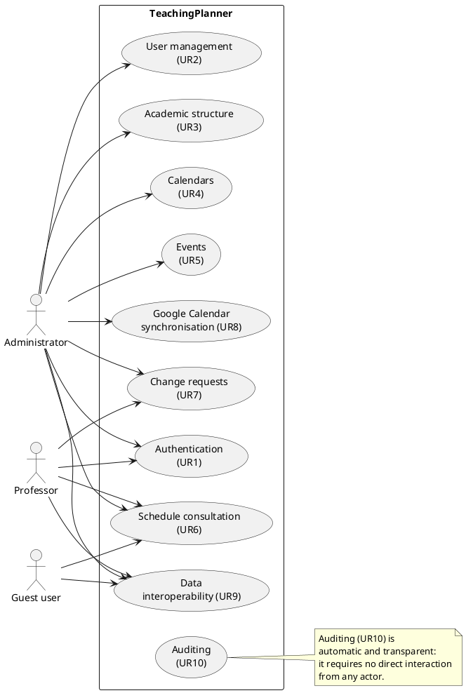
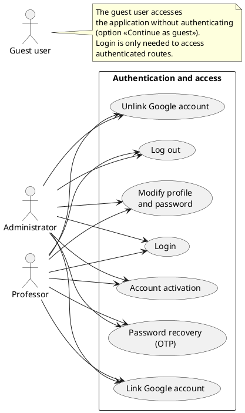
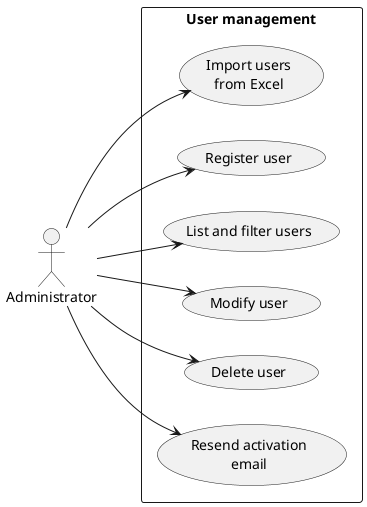
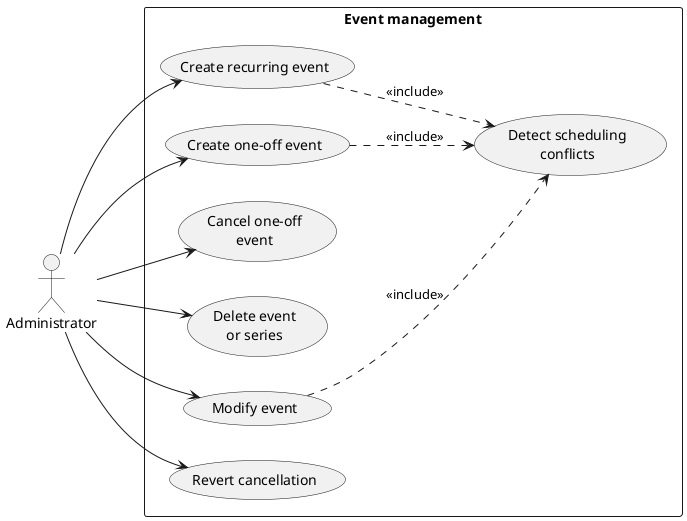
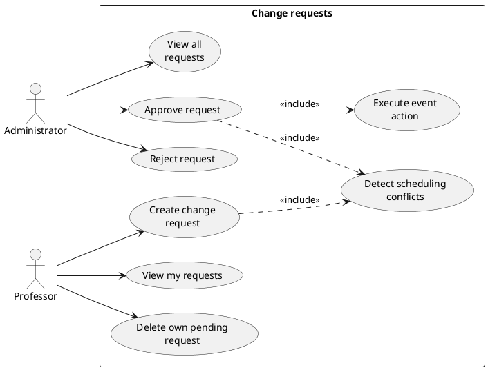
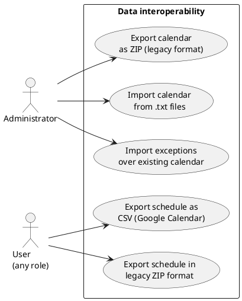

# Chapter 4 — SYSTEM REQUIREMENTS

---

## 4.1 Functional Requirements

### 4.1.1 System Functions

The system functions are specified through a **hierarchical list of functional requirements (FR)** complemented with **use case diagrams** that offer a graphical view of actors and modules. Each functional module (FR-AUTH, FR-USER, etc.) corresponds directly to a group of user requirements (UR1–UR10) from Chapter 3 and transforms those requirements into a detailed technical specification of the system's behaviour: specific validation conditions, exact status values, mandatory fields and automatic system behaviours.

**Figure 4.1 — General use case diagram**

---

#### FR-AUTH — Authentication and access (→ UR1)

**Figure 4.2 — Use case diagram: Authentication**

#### Detailed functional requirements — FR-AUTH (→ UR1)

**FR-AUTH-01.** The system shall allow registered users to log in to the application.

&nbsp;&nbsp;&nbsp;&nbsp;**FR-AUTH-01.1.** The system shall request the following data from the user:

&nbsp;&nbsp;&nbsp;&nbsp;&nbsp;&nbsp;&nbsp;&nbsp;**FR-AUTH-01.1.1.** Email address.

&nbsp;&nbsp;&nbsp;&nbsp;&nbsp;&nbsp;&nbsp;&nbsp;&nbsp;&nbsp;&nbsp;&nbsp;**FR-AUTH-01.1.1.1.** It is a mandatory field.

&nbsp;&nbsp;&nbsp;&nbsp;&nbsp;&nbsp;&nbsp;&nbsp;**FR-AUTH-01.1.2.** Password.

&nbsp;&nbsp;&nbsp;&nbsp;&nbsp;&nbsp;&nbsp;&nbsp;&nbsp;&nbsp;&nbsp;&nbsp;**FR-AUTH-01.1.2.1.** It is a mandatory field.

&nbsp;&nbsp;&nbsp;&nbsp;**FR-AUTH-01.2.** If the credentials are correct, the system shall redirect the user to the main screen according to their role.

&nbsp;&nbsp;&nbsp;&nbsp;**FR-AUTH-01.3.** If the email does not exist in the system or the password is incorrect, the system shall display the same generic error message without revealing which condition failed.

&nbsp;&nbsp;&nbsp;&nbsp;**FR-AUTH-01.4.** If the account exists but has not been activated, the system shall display a message indicating that the user must activate their account before being able to access.

**FR-AUTH-02.** The system shall allow users to recover access to their account if they have forgotten their password. The process shall be carried out in three steps:

&nbsp;&nbsp;&nbsp;&nbsp;**FR-AUTH-02.1.** First step — verification code request:

&nbsp;&nbsp;&nbsp;&nbsp;&nbsp;&nbsp;&nbsp;&nbsp;**FR-AUTH-02.1.1.** The system shall request the user's email address.

&nbsp;&nbsp;&nbsp;&nbsp;&nbsp;&nbsp;&nbsp;&nbsp;&nbsp;&nbsp;&nbsp;&nbsp;**FR-AUTH-02.1.1.1.** It is a mandatory field.

&nbsp;&nbsp;&nbsp;&nbsp;&nbsp;&nbsp;&nbsp;&nbsp;**FR-AUTH-02.1.2.** The system shall send a six-digit verification code to the indicated email address, valid for 15 minutes.

&nbsp;&nbsp;&nbsp;&nbsp;&nbsp;&nbsp;&nbsp;&nbsp;**FR-AUTH-02.1.3.** The system shall not reveal whether the email address is registered or not, always displaying the same confirmation message.

&nbsp;&nbsp;&nbsp;&nbsp;&nbsp;&nbsp;&nbsp;&nbsp;**FR-AUTH-02.1.4.** The system shall not allow requesting a new code until 60 seconds have elapsed since the previous request.

&nbsp;&nbsp;&nbsp;&nbsp;**FR-AUTH-02.2.** Second step — code verification:

&nbsp;&nbsp;&nbsp;&nbsp;&nbsp;&nbsp;&nbsp;&nbsp;**FR-AUTH-02.2.1.** The system shall request the six-digit code received by email.

&nbsp;&nbsp;&nbsp;&nbsp;&nbsp;&nbsp;&nbsp;&nbsp;&nbsp;&nbsp;&nbsp;&nbsp;**FR-AUTH-02.2.1.1.** It is a mandatory field.

&nbsp;&nbsp;&nbsp;&nbsp;&nbsp;&nbsp;&nbsp;&nbsp;**FR-AUTH-02.2.2.** If the code is correct and has not expired, the system shall proceed to the third step.

&nbsp;&nbsp;&nbsp;&nbsp;&nbsp;&nbsp;&nbsp;&nbsp;**FR-AUTH-02.2.3.** If the code has expired, the system shall display an error message and invite the user to request a new one.

&nbsp;&nbsp;&nbsp;&nbsp;&nbsp;&nbsp;&nbsp;&nbsp;**FR-AUTH-02.2.4.** If the code is incorrect, the system shall display an error message.

&nbsp;&nbsp;&nbsp;&nbsp;**FR-AUTH-02.3.** Third step — set new password:

&nbsp;&nbsp;&nbsp;&nbsp;&nbsp;&nbsp;&nbsp;&nbsp;**FR-AUTH-02.3.1.** The system shall request the following data from the user:

&nbsp;&nbsp;&nbsp;&nbsp;&nbsp;&nbsp;&nbsp;&nbsp;&nbsp;&nbsp;&nbsp;&nbsp;**FR-AUTH-02.3.1.1.** New password.

&nbsp;&nbsp;&nbsp;&nbsp;&nbsp;&nbsp;&nbsp;&nbsp;&nbsp;&nbsp;&nbsp;&nbsp;&nbsp;&nbsp;&nbsp;&nbsp;**FR-AUTH-02.3.1.1.1.** It is a mandatory field.

&nbsp;&nbsp;&nbsp;&nbsp;&nbsp;&nbsp;&nbsp;&nbsp;&nbsp;&nbsp;&nbsp;&nbsp;&nbsp;&nbsp;&nbsp;&nbsp;**FR-AUTH-02.3.1.1.2.** It must be at least 8 characters long.

&nbsp;&nbsp;&nbsp;&nbsp;&nbsp;&nbsp;&nbsp;&nbsp;&nbsp;&nbsp;&nbsp;&nbsp;&nbsp;&nbsp;&nbsp;&nbsp;**FR-AUTH-02.3.1.1.3.** It must contain at least one uppercase letter.

&nbsp;&nbsp;&nbsp;&nbsp;&nbsp;&nbsp;&nbsp;&nbsp;&nbsp;&nbsp;&nbsp;&nbsp;&nbsp;&nbsp;&nbsp;&nbsp;**FR-AUTH-02.3.1.1.4.** It must contain at least one lowercase letter.

&nbsp;&nbsp;&nbsp;&nbsp;&nbsp;&nbsp;&nbsp;&nbsp;&nbsp;&nbsp;&nbsp;&nbsp;&nbsp;&nbsp;&nbsp;&nbsp;**FR-AUTH-02.3.1.1.5.** It must contain at least one digit.

&nbsp;&nbsp;&nbsp;&nbsp;&nbsp;&nbsp;&nbsp;&nbsp;&nbsp;&nbsp;&nbsp;&nbsp;&nbsp;&nbsp;&nbsp;&nbsp;**FR-AUTH-02.3.1.1.6.** It must contain at least one special character.

&nbsp;&nbsp;&nbsp;&nbsp;&nbsp;&nbsp;&nbsp;&nbsp;&nbsp;&nbsp;&nbsp;&nbsp;**FR-AUTH-02.3.1.2.** Confirmation of the new password.

&nbsp;&nbsp;&nbsp;&nbsp;&nbsp;&nbsp;&nbsp;&nbsp;&nbsp;&nbsp;&nbsp;&nbsp;&nbsp;&nbsp;&nbsp;&nbsp;**FR-AUTH-02.3.1.2.1.** It is a mandatory field.

&nbsp;&nbsp;&nbsp;&nbsp;&nbsp;&nbsp;&nbsp;&nbsp;&nbsp;&nbsp;&nbsp;&nbsp;&nbsp;&nbsp;&nbsp;&nbsp;**FR-AUTH-02.3.1.2.2.** It must match the new password entered.

&nbsp;&nbsp;&nbsp;&nbsp;&nbsp;&nbsp;&nbsp;&nbsp;**FR-AUTH-02.3.2.** If the password does not meet the complexity requirements, the system shall display an error message indicating which condition has not been satisfied and shall not update the password.

&nbsp;&nbsp;&nbsp;&nbsp;&nbsp;&nbsp;&nbsp;&nbsp;**FR-AUTH-02.3.3.** If the passwords do not match, the system shall display an error message and shall not update the password.

&nbsp;&nbsp;&nbsp;&nbsp;&nbsp;&nbsp;&nbsp;&nbsp;**FR-AUTH-02.3.4.** If the data is valid, the system shall update the password and redirect the user to the login form.

**FR-AUTH-03.** The system shall allow authenticated users to close their active session.

&nbsp;&nbsp;&nbsp;&nbsp;**FR-AUTH-03.1.** The system shall close the user's session and redirect them to the home screen.

**FR-AUTH-04.** The system shall allow authenticated users to consult and modify their own profile data.

&nbsp;&nbsp;&nbsp;&nbsp;**FR-AUTH-04.1.** The user shall be able to modify their name, surname(s), email address and UniOvi username.

&nbsp;&nbsp;&nbsp;&nbsp;**FR-AUTH-04.2.** The user shall be able to change their password by entering their current password and a new password that meets the same complexity requirements established in FR-AUTH-02.3.1.1.

&nbsp;&nbsp;&nbsp;&nbsp;&nbsp;&nbsp;&nbsp;&nbsp;**FR-AUTH-04.2.1.** If the current password entered is incorrect, the system shall display an error message and shall not perform the change.

**FR-AUTH-05.** When the administrator creates a new account, the user shall receive an email with an activation link.

&nbsp;&nbsp;&nbsp;&nbsp;**FR-AUTH-05.1.** Upon accessing the link, the system shall ask the user to set their personal password, meeting the complexity requirements indicated in FR-AUTH-02.3.1.1. The link is valid for 48 hours from its generation.

&nbsp;&nbsp;&nbsp;&nbsp;**FR-AUTH-05.2.** If the link has expired, the system shall indicate to the user that they must contact the administrator to resend the activation email.

&nbsp;&nbsp;&nbsp;&nbsp;**FR-AUTH-05.3.** If the data is valid, the system shall activate the account and redirect the user to the login form.

**FR-AUTH-06.** The system shall allow authenticated users to link their account with a Google account to enable the synchronisation of academic calendars with Google Calendar.

&nbsp;&nbsp;&nbsp;&nbsp;**FR-AUTH-06.1.** The user shall be redirected to the Google consent screen, where they shall authorise access to the system.

&nbsp;&nbsp;&nbsp;&nbsp;**FR-AUTH-06.2.** If the user authorises access, the system shall link the Google account and display the email address of the linked Google account as confirmation.

&nbsp;&nbsp;&nbsp;&nbsp;**FR-AUTH-06.3.** If the user denies access, the system shall display an informative message and shall not link any account.

&nbsp;&nbsp;&nbsp;&nbsp;**FR-AUTH-06.4.** The system shall allow the user to disconnect their Google account. After disconnection, the system shall delete the Google Calendars created by that user and erase the stored link.

---

#### FR-USER — User management (→ UR2)

**Figure 4.3 — Use case diagram: User management**

#### Detailed functional requirements — FR-USER (→ UR2)

**FR-USER-01.** The system shall allow the administrator to register new users in the system.

&nbsp;&nbsp;&nbsp;&nbsp;**FR-USER-01.1.** The system shall request the following data from the administrator:

&nbsp;&nbsp;&nbsp;&nbsp;&nbsp;&nbsp;&nbsp;&nbsp;**FR-USER-01.1.1.** First name.

&nbsp;&nbsp;&nbsp;&nbsp;&nbsp;&nbsp;&nbsp;&nbsp;&nbsp;&nbsp;&nbsp;&nbsp;**FR-USER-01.1.1.1.** It is a mandatory field.

&nbsp;&nbsp;&nbsp;&nbsp;&nbsp;&nbsp;&nbsp;&nbsp;**FR-USER-01.1.2.** First surname.

&nbsp;&nbsp;&nbsp;&nbsp;&nbsp;&nbsp;&nbsp;&nbsp;&nbsp;&nbsp;&nbsp;&nbsp;**FR-USER-01.1.2.1.** It is a mandatory field.

&nbsp;&nbsp;&nbsp;&nbsp;&nbsp;&nbsp;&nbsp;&nbsp;**FR-USER-01.1.3.** Second surname.

&nbsp;&nbsp;&nbsp;&nbsp;&nbsp;&nbsp;&nbsp;&nbsp;&nbsp;&nbsp;&nbsp;&nbsp;**FR-USER-01.1.3.1.** It is a mandatory field.

&nbsp;&nbsp;&nbsp;&nbsp;&nbsp;&nbsp;&nbsp;&nbsp;**FR-USER-01.1.4.** Email address.

&nbsp;&nbsp;&nbsp;&nbsp;&nbsp;&nbsp;&nbsp;&nbsp;&nbsp;&nbsp;&nbsp;&nbsp;**FR-USER-01.1.4.1.** It is a mandatory field.

&nbsp;&nbsp;&nbsp;&nbsp;&nbsp;&nbsp;&nbsp;&nbsp;&nbsp;&nbsp;&nbsp;&nbsp;**FR-USER-01.1.4.2.** The system shall verify that the email format is valid.

&nbsp;&nbsp;&nbsp;&nbsp;&nbsp;&nbsp;&nbsp;&nbsp;&nbsp;&nbsp;&nbsp;&nbsp;**FR-USER-01.1.4.3.** The system shall verify that the email is not already registered in the system.

&nbsp;&nbsp;&nbsp;&nbsp;&nbsp;&nbsp;&nbsp;&nbsp;**FR-USER-01.1.5.** Role.

&nbsp;&nbsp;&nbsp;&nbsp;&nbsp;&nbsp;&nbsp;&nbsp;&nbsp;&nbsp;&nbsp;&nbsp;**FR-USER-01.1.5.1.** It is a mandatory field.

&nbsp;&nbsp;&nbsp;&nbsp;&nbsp;&nbsp;&nbsp;&nbsp;&nbsp;&nbsp;&nbsp;&nbsp;**FR-USER-01.1.5.2.** The system shall allow choosing between the following roles: Administrator or Professor.

&nbsp;&nbsp;&nbsp;&nbsp;&nbsp;&nbsp;&nbsp;&nbsp;**FR-USER-01.1.6.** UniOvi username.

&nbsp;&nbsp;&nbsp;&nbsp;&nbsp;&nbsp;&nbsp;&nbsp;&nbsp;&nbsp;&nbsp;&nbsp;**FR-USER-01.1.6.1.** It is an optional field.

&nbsp;&nbsp;&nbsp;&nbsp;**FR-USER-01.2.** If the email address is already registered in the system, the system shall display an error message and shall not complete the registration.

&nbsp;&nbsp;&nbsp;&nbsp;**FR-USER-01.3.** If the email address format is not valid, the system shall display an error message and shall not complete the registration.

&nbsp;&nbsp;&nbsp;&nbsp;**FR-USER-01.4.** If the registration is correct, the system shall create the account with inactive status and shall send the new user an email with a link to activate their account and set their password.

**FR-USER-02.** The system shall allow the administrator to import users in bulk from an Excel file.

&nbsp;&nbsp;&nbsp;&nbsp;**FR-USER-02.1.** The system shall ask the administrator to upload a file in `.xlsx` format.

&nbsp;&nbsp;&nbsp;&nbsp;**FR-USER-02.2.** The file must contain the following columns:

&nbsp;&nbsp;&nbsp;&nbsp;&nbsp;&nbsp;&nbsp;&nbsp;**FR-USER-02.2.1.** UniOvi username. It is a mandatory field per row.

&nbsp;&nbsp;&nbsp;&nbsp;&nbsp;&nbsp;&nbsp;&nbsp;**FR-USER-02.2.2.** First name. It is a mandatory field per row.

&nbsp;&nbsp;&nbsp;&nbsp;&nbsp;&nbsp;&nbsp;&nbsp;**FR-USER-02.2.3.** Surnames. It is a mandatory field per row. The system shall internally split this field into first surname and second surname.

&nbsp;&nbsp;&nbsp;&nbsp;&nbsp;&nbsp;&nbsp;&nbsp;**FR-USER-02.2.4.** Email address. It is a mandatory field per row. It must be unique in the system. If it already exists in the system, that row shall be marked as erroneous in the report and the rest shall continue to be processed.

&nbsp;&nbsp;&nbsp;&nbsp;**FR-USER-02.3.** The system shall validate each row of the file independently.

&nbsp;&nbsp;&nbsp;&nbsp;**FR-USER-02.4.** The system shall create the users from valid rows with inactive status and shall send each one an activation email.

&nbsp;&nbsp;&nbsp;&nbsp;**FR-USER-02.5.** The system shall display a report indicating how many users were created successfully and which rows contained errors and why.

**FR-USER-03.** The system shall allow the administrator to consult the list of users registered in the system.

&nbsp;&nbsp;&nbsp;&nbsp;**FR-USER-03.1.** The system shall display for each user: full name, email address, role and status (active or inactive).

&nbsp;&nbsp;&nbsp;&nbsp;**FR-USER-03.2.** The system shall allow filtering the list by role.

&nbsp;&nbsp;&nbsp;&nbsp;**FR-USER-03.3.** The system shall allow searching for users by name or email address.

**FR-USER-04.** The system shall allow the administrator to modify the data of an existing user.

&nbsp;&nbsp;&nbsp;&nbsp;**FR-USER-04.1.** The administrator shall be able to modify the user's name, surname(s) and role.

&nbsp;&nbsp;&nbsp;&nbsp;**FR-USER-04.2.** The system shall prevent the administrator from changing the role or deactivating the last active administrator in the system.

&nbsp;&nbsp;&nbsp;&nbsp;**FR-USER-04.3.** The system shall prevent the administrator from deactivating their own account.

**FR-USER-05.** The system shall allow the administrator to delete a user from the system.

&nbsp;&nbsp;&nbsp;&nbsp;**FR-USER-05.1.** The system shall request explicit confirmation before proceeding with the deletion.

&nbsp;&nbsp;&nbsp;&nbsp;**FR-USER-05.2.** The system shall prevent deleting the last active administrator in the system.

&nbsp;&nbsp;&nbsp;&nbsp;**FR-USER-05.3.** The system shall prevent the administrator from deleting their own account.

**FR-USER-06.** The system shall allow the administrator to resend the activation email to users who have been registered but have not yet activated their account.

&nbsp;&nbsp;&nbsp;&nbsp;**FR-USER-06.1.** This operation shall only be available for users with an inactive account. If the account is already active, the system shall display an error message indicating that it is not possible to resend the activation email.

**FR-USER-07.** The system shall manage three access profiles with differentiated levels:

&nbsp;&nbsp;&nbsp;&nbsp;**FR-USER-07.1.** Administrator: full access to all system management functions.

&nbsp;&nbsp;&nbsp;&nbsp;**FR-USER-07.2.** Professor: access to schedule consultation and to the creation and management of their own change requests.

&nbsp;&nbsp;&nbsp;&nbsp;**FR-USER-07.3.** Guest user (unauthenticated): read-only access to the schedules of academic courses in the Active state, without needing an account in the system.

---

#### FR-STRUCT — Academic structure management (→ UR3)

Administrator-only module (see Figure 4.1).

#### Detailed functional requirements — FR-STRUCT (→ UR3)

**FR-STRUCT-01.** The system shall allow the administrator to manage degrees.

&nbsp;&nbsp;&nbsp;&nbsp;**FR-STRUCT-01.1.** The system shall allow creating a new degree. The system shall request the following data:

&nbsp;&nbsp;&nbsp;&nbsp;&nbsp;&nbsp;&nbsp;&nbsp;**FR-STRUCT-01.1.1.** Name.

&nbsp;&nbsp;&nbsp;&nbsp;&nbsp;&nbsp;&nbsp;&nbsp;&nbsp;&nbsp;&nbsp;&nbsp;**FR-STRUCT-01.1.1.1.** It is a mandatory field.

&nbsp;&nbsp;&nbsp;&nbsp;&nbsp;&nbsp;&nbsp;&nbsp;&nbsp;&nbsp;&nbsp;&nbsp;**FR-STRUCT-01.1.1.2.** The system shall verify that the name is not already registered in the system.

&nbsp;&nbsp;&nbsp;&nbsp;&nbsp;&nbsp;&nbsp;&nbsp;**FR-STRUCT-01.1.2.** Acronym.

&nbsp;&nbsp;&nbsp;&nbsp;&nbsp;&nbsp;&nbsp;&nbsp;&nbsp;&nbsp;&nbsp;&nbsp;**FR-STRUCT-01.1.2.1.** It is a mandatory field.

&nbsp;&nbsp;&nbsp;&nbsp;&nbsp;&nbsp;&nbsp;&nbsp;&nbsp;&nbsp;&nbsp;&nbsp;**FR-STRUCT-01.1.2.2.** The system shall verify that the acronym is not already registered in the system.

&nbsp;&nbsp;&nbsp;&nbsp;&nbsp;&nbsp;&nbsp;&nbsp;**FR-STRUCT-01.1.3.** If the name or the acronym already exist, the system shall display a specific error message and shall not complete the creation.

&nbsp;&nbsp;&nbsp;&nbsp;&nbsp;&nbsp;&nbsp;&nbsp;**FR-STRUCT-01.1.4.** If the data is valid, the system shall create the degree and display a confirmation.

&nbsp;&nbsp;&nbsp;&nbsp;**FR-STRUCT-01.2.** The system shall allow consulting the list of existing degrees.

&nbsp;&nbsp;&nbsp;&nbsp;**FR-STRUCT-01.3.** The system shall allow modifying the name and acronym of an existing degree, with the same uniqueness validations as in the creation.

&nbsp;&nbsp;&nbsp;&nbsp;**FR-STRUCT-01.4.** The system shall allow deleting a degree.

&nbsp;&nbsp;&nbsp;&nbsp;&nbsp;&nbsp;&nbsp;&nbsp;**FR-STRUCT-01.4.1.** The system shall request explicit confirmation before proceeding, indicating that the deletion shall also delete all the academic courses, calendars and data associated with the degree.

&nbsp;&nbsp;&nbsp;&nbsp;&nbsp;&nbsp;&nbsp;&nbsp;**FR-STRUCT-01.4.2.** After the administrator's confirmation, the system shall delete the degree and all its associated data in cascade.

**FR-STRUCT-02.** The system shall allow the administrator to manage the academic courses associated with a degree.

&nbsp;&nbsp;&nbsp;&nbsp;**FR-STRUCT-02.1.** The system shall allow creating a new academic course. The system shall request the following data:

&nbsp;&nbsp;&nbsp;&nbsp;&nbsp;&nbsp;&nbsp;&nbsp;**FR-STRUCT-02.1.1.** Degree to which the course belongs.

&nbsp;&nbsp;&nbsp;&nbsp;&nbsp;&nbsp;&nbsp;&nbsp;&nbsp;&nbsp;&nbsp;&nbsp;**FR-STRUCT-02.1.1.1.** It is a mandatory field.

&nbsp;&nbsp;&nbsp;&nbsp;&nbsp;&nbsp;&nbsp;&nbsp;**FR-STRUCT-02.1.2.** Start year.

&nbsp;&nbsp;&nbsp;&nbsp;&nbsp;&nbsp;&nbsp;&nbsp;&nbsp;&nbsp;&nbsp;&nbsp;**FR-STRUCT-02.1.2.1.** It is a mandatory field.

&nbsp;&nbsp;&nbsp;&nbsp;&nbsp;&nbsp;&nbsp;&nbsp;**FR-STRUCT-02.1.3.** End year.

&nbsp;&nbsp;&nbsp;&nbsp;&nbsp;&nbsp;&nbsp;&nbsp;&nbsp;&nbsp;&nbsp;&nbsp;**FR-STRUCT-02.1.3.1.** It is a mandatory field.

&nbsp;&nbsp;&nbsp;&nbsp;&nbsp;&nbsp;&nbsp;&nbsp;&nbsp;&nbsp;&nbsp;&nbsp;**FR-STRUCT-02.1.3.2.** It must be later than the start year.

&nbsp;&nbsp;&nbsp;&nbsp;&nbsp;&nbsp;&nbsp;&nbsp;**FR-STRUCT-02.1.4.** If an academic course with the same years already exists in that degree, the system shall display an error message and shall not complete the creation.

&nbsp;&nbsp;&nbsp;&nbsp;&nbsp;&nbsp;&nbsp;&nbsp;**FR-STRUCT-02.1.5.** If the data is valid, the system shall create the academic course with the initial status «Planned».

&nbsp;&nbsp;&nbsp;&nbsp;**FR-STRUCT-02.2.** Each academic course shall have a status that the administrator can modify:

&nbsp;&nbsp;&nbsp;&nbsp;&nbsp;&nbsp;&nbsp;&nbsp;**FR-STRUCT-02.2.1.** Planned.

&nbsp;&nbsp;&nbsp;&nbsp;&nbsp;&nbsp;&nbsp;&nbsp;**FR-STRUCT-02.2.2.** Active.

&nbsp;&nbsp;&nbsp;&nbsp;&nbsp;&nbsp;&nbsp;&nbsp;**FR-STRUCT-02.2.3.** Completed.

&nbsp;&nbsp;&nbsp;&nbsp;&nbsp;&nbsp;&nbsp;&nbsp;**FR-STRUCT-02.2.4.** State transitions are one-way: Planned → Active → Completed. It is not possible to revert an academic course to a previous status.

&nbsp;&nbsp;&nbsp;&nbsp;**FR-STRUCT-02.3.** The system shall allow deleting an academic course.

&nbsp;&nbsp;&nbsp;&nbsp;&nbsp;&nbsp;&nbsp;&nbsp;**FR-STRUCT-02.3.1.** The system shall request explicit confirmation before proceeding, informing the administrator that the deletion shall affect all calendars, events and data associated with the academic course.

&nbsp;&nbsp;&nbsp;&nbsp;&nbsp;&nbsp;&nbsp;&nbsp;**FR-STRUCT-02.3.2.** After confirmation, the system shall delete the academic course and all its associated data in cascade.

**FR-STRUCT-03.** The system shall allow the administrator to manage the subjects of the active academic calendar.

&nbsp;&nbsp;&nbsp;&nbsp;**FR-STRUCT-03.1.** The system shall allow creating a new subject. The system shall request the following data:

&nbsp;&nbsp;&nbsp;&nbsp;&nbsp;&nbsp;&nbsp;&nbsp;**FR-STRUCT-03.1.1.** Name.

&nbsp;&nbsp;&nbsp;&nbsp;&nbsp;&nbsp;&nbsp;&nbsp;&nbsp;&nbsp;&nbsp;&nbsp;**FR-STRUCT-03.1.1.1.** It is a mandatory field.

&nbsp;&nbsp;&nbsp;&nbsp;&nbsp;&nbsp;&nbsp;&nbsp;&nbsp;&nbsp;&nbsp;&nbsp;**FR-STRUCT-03.1.1.2.** It must be unique within the same academic calendar.

&nbsp;&nbsp;&nbsp;&nbsp;&nbsp;&nbsp;&nbsp;&nbsp;**FR-STRUCT-03.1.2.** Acronym.

&nbsp;&nbsp;&nbsp;&nbsp;&nbsp;&nbsp;&nbsp;&nbsp;&nbsp;&nbsp;&nbsp;&nbsp;**FR-STRUCT-03.1.2.1.** It is a mandatory field.

&nbsp;&nbsp;&nbsp;&nbsp;&nbsp;&nbsp;&nbsp;&nbsp;&nbsp;&nbsp;&nbsp;&nbsp;**FR-STRUCT-03.1.2.2.** It must be unique within the same academic calendar.

&nbsp;&nbsp;&nbsp;&nbsp;&nbsp;&nbsp;&nbsp;&nbsp;**FR-STRUCT-03.1.3.** SIES code.

&nbsp;&nbsp;&nbsp;&nbsp;&nbsp;&nbsp;&nbsp;&nbsp;&nbsp;&nbsp;&nbsp;&nbsp;**FR-STRUCT-03.1.3.1.** It is a mandatory field.

&nbsp;&nbsp;&nbsp;&nbsp;&nbsp;&nbsp;&nbsp;&nbsp;**FR-STRUCT-03.1.4.** Semester in which it is taught.

&nbsp;&nbsp;&nbsp;&nbsp;&nbsp;&nbsp;&nbsp;&nbsp;&nbsp;&nbsp;&nbsp;&nbsp;**FR-STRUCT-03.1.4.1.** It is a mandatory field.

&nbsp;&nbsp;&nbsp;&nbsp;&nbsp;&nbsp;&nbsp;&nbsp;&nbsp;&nbsp;&nbsp;&nbsp;**FR-STRUCT-03.1.4.2.** The system shall allow choosing between the first semester and the second semester.

&nbsp;&nbsp;&nbsp;&nbsp;&nbsp;&nbsp;&nbsp;&nbsp;**FR-STRUCT-03.1.5.** Group year to which the subject corresponds.

&nbsp;&nbsp;&nbsp;&nbsp;&nbsp;&nbsp;&nbsp;&nbsp;&nbsp;&nbsp;&nbsp;&nbsp;**FR-STRUCT-03.1.5.1.** It is a mandatory field.

&nbsp;&nbsp;&nbsp;&nbsp;&nbsp;&nbsp;&nbsp;&nbsp;&nbsp;&nbsp;&nbsp;&nbsp;**FR-STRUCT-03.1.5.2.** The system shall allow choosing between: first, second, third, fourth, or without a specific year (for elective or free-choice subjects).

&nbsp;&nbsp;&nbsp;&nbsp;**FR-STRUCT-03.2.** The system shall allow consulting and filtering the list of subjects by semester and group year.

&nbsp;&nbsp;&nbsp;&nbsp;**FR-STRUCT-03.3.** The system shall allow modifying all the fields of a subject, including the SIES code.

&nbsp;&nbsp;&nbsp;&nbsp;**FR-STRUCT-03.4.** The system shall allow deleting a subject.

&nbsp;&nbsp;&nbsp;&nbsp;&nbsp;&nbsp;&nbsp;&nbsp;**FR-STRUCT-03.4.1.** The system shall display a warning indicating that the deletion shall also delete all the associated groups and the events of those groups.

&nbsp;&nbsp;&nbsp;&nbsp;&nbsp;&nbsp;&nbsp;&nbsp;**FR-STRUCT-03.4.2.** After the administrator's confirmation, the system shall delete the subject together with its associated groups and events.

**FR-STRUCT-04.** The system shall allow the administrator to manage the groups of each subject in the academic calendar.

&nbsp;&nbsp;&nbsp;&nbsp;**FR-STRUCT-04.1.** The system shall allow creating a new group. The system shall request the following data:

&nbsp;&nbsp;&nbsp;&nbsp;&nbsp;&nbsp;&nbsp;&nbsp;**FR-STRUCT-04.1.1.** Subject to which it belongs.

&nbsp;&nbsp;&nbsp;&nbsp;&nbsp;&nbsp;&nbsp;&nbsp;&nbsp;&nbsp;&nbsp;&nbsp;**FR-STRUCT-04.1.1.1.** It is a mandatory field.

&nbsp;&nbsp;&nbsp;&nbsp;&nbsp;&nbsp;&nbsp;&nbsp;**FR-STRUCT-04.1.2.** Group type.

&nbsp;&nbsp;&nbsp;&nbsp;&nbsp;&nbsp;&nbsp;&nbsp;&nbsp;&nbsp;&nbsp;&nbsp;**FR-STRUCT-04.1.2.1.** It is a mandatory field.

&nbsp;&nbsp;&nbsp;&nbsp;&nbsp;&nbsp;&nbsp;&nbsp;&nbsp;&nbsp;&nbsp;&nbsp;**FR-STRUCT-04.1.2.2.** The system shall allow choosing between: Theory (T), Seminar (S), Laboratory Practice (L), Group Tutoring (TG).

&nbsp;&nbsp;&nbsp;&nbsp;&nbsp;&nbsp;&nbsp;&nbsp;**FR-STRUCT-04.1.3.** Language.

&nbsp;&nbsp;&nbsp;&nbsp;&nbsp;&nbsp;&nbsp;&nbsp;&nbsp;&nbsp;&nbsp;&nbsp;**FR-STRUCT-04.1.3.1.** It is a mandatory field.

&nbsp;&nbsp;&nbsp;&nbsp;&nbsp;&nbsp;&nbsp;&nbsp;&nbsp;&nbsp;&nbsp;&nbsp;**FR-STRUCT-04.1.3.2.** The system shall allow choosing between: Spanish and English.

&nbsp;&nbsp;&nbsp;&nbsp;&nbsp;&nbsp;&nbsp;&nbsp;**FR-STRUCT-04.1.4.** The group number is automatically assigned by the system. The system shall assign the next available number for the combination of subject, type and language selected.

&nbsp;&nbsp;&nbsp;&nbsp;&nbsp;&nbsp;&nbsp;&nbsp;**FR-STRUCT-04.1.5.** If the system cannot assign a unique number for the combination of subject, type and language indicated, it shall display an error message and shall not complete the creation.

&nbsp;&nbsp;&nbsp;&nbsp;&nbsp;&nbsp;&nbsp;&nbsp;**FR-STRUCT-04.1.6.** The planned hours of the group are automatically managed by the system based on the recurring events of type Class assigned to the group; it is not a field that the administrator enters when creating the group.

&nbsp;&nbsp;&nbsp;&nbsp;**FR-STRUCT-04.2.** The system shall allow consulting the list of groups of a subject.

&nbsp;&nbsp;&nbsp;&nbsp;**FR-STRUCT-04.3.** The system shall allow modifying the data of an existing group, with the same uniqueness validations as in the creation.

&nbsp;&nbsp;&nbsp;&nbsp;**FR-STRUCT-04.4.** The system shall allow deleting a group.

**FR-STRUCT-05.** The system shall allow the administrator to manage the classrooms.

&nbsp;&nbsp;&nbsp;&nbsp;**FR-STRUCT-05.1.** The system shall allow creating a new classroom. The system shall request the following data:

&nbsp;&nbsp;&nbsp;&nbsp;&nbsp;&nbsp;&nbsp;&nbsp;**FR-STRUCT-05.1.1.** Classroom code.

&nbsp;&nbsp;&nbsp;&nbsp;&nbsp;&nbsp;&nbsp;&nbsp;&nbsp;&nbsp;&nbsp;&nbsp;**FR-STRUCT-05.1.1.1.** It is a mandatory field.

&nbsp;&nbsp;&nbsp;&nbsp;&nbsp;&nbsp;&nbsp;&nbsp;&nbsp;&nbsp;&nbsp;&nbsp;**FR-STRUCT-05.1.1.2.** The system shall verify that the code is not already registered in the system.

&nbsp;&nbsp;&nbsp;&nbsp;&nbsp;&nbsp;&nbsp;&nbsp;**FR-STRUCT-05.1.2.** Geographic location link (GIS URL).

&nbsp;&nbsp;&nbsp;&nbsp;&nbsp;&nbsp;&nbsp;&nbsp;&nbsp;&nbsp;&nbsp;&nbsp;**FR-STRUCT-05.1.2.1.** It is a mandatory field.

&nbsp;&nbsp;&nbsp;&nbsp;&nbsp;&nbsp;&nbsp;&nbsp;**FR-STRUCT-05.1.3.** If the code already exists, the system shall display an error message and shall not complete the creation.

&nbsp;&nbsp;&nbsp;&nbsp;**FR-STRUCT-05.2.** The system shall allow consulting the list of registered classrooms.

&nbsp;&nbsp;&nbsp;&nbsp;**FR-STRUCT-05.3.** The system shall allow modifying the GIS link of an existing classroom. The classroom code is not modifiable once created.

&nbsp;&nbsp;&nbsp;&nbsp;**FR-STRUCT-05.4.** The system shall allow deleting a classroom.

&nbsp;&nbsp;&nbsp;&nbsp;&nbsp;&nbsp;&nbsp;&nbsp;**FR-STRUCT-05.4.1.** If the classroom has associated events, the system shall request additional confirmation, warning that the deletion shall affect the events assigned to that classroom. The administrator must confirm explicitly.

---

#### FR-CAL — Academic calendar management (→ UR4)

Administrator-only module (see Figure 4.1).

#### Detailed functional requirements — FR-CAL (→ UR4)

**FR-CAL-01.** The system shall allow the administrator to create an academic calendar for a given semester by manually specifying its parameters (→ UR4.1). The system shall request the following data:

&nbsp;&nbsp;&nbsp;&nbsp;**FR-CAL-01.1.** Academic course to which the calendar belongs.

&nbsp;&nbsp;&nbsp;&nbsp;&nbsp;&nbsp;&nbsp;&nbsp;**FR-CAL-01.1.1.** It is a mandatory field.

&nbsp;&nbsp;&nbsp;&nbsp;**FR-CAL-01.2.** Semester.

&nbsp;&nbsp;&nbsp;&nbsp;&nbsp;&nbsp;&nbsp;&nbsp;**FR-CAL-01.2.1.** It is a mandatory field.

&nbsp;&nbsp;&nbsp;&nbsp;&nbsp;&nbsp;&nbsp;&nbsp;**FR-CAL-01.2.2.** The system shall allow choosing between the first semester and the second semester.

&nbsp;&nbsp;&nbsp;&nbsp;**FR-CAL-01.3.** Start date.

&nbsp;&nbsp;&nbsp;&nbsp;&nbsp;&nbsp;&nbsp;&nbsp;**FR-CAL-01.3.1.** It is a mandatory field.

&nbsp;&nbsp;&nbsp;&nbsp;**FR-CAL-01.4.** End date.

&nbsp;&nbsp;&nbsp;&nbsp;&nbsp;&nbsp;&nbsp;&nbsp;**FR-CAL-01.4.1.** It is a mandatory field.

&nbsp;&nbsp;&nbsp;&nbsp;&nbsp;&nbsp;&nbsp;&nbsp;**FR-CAL-01.4.2.** It must be later than the start date.

&nbsp;&nbsp;&nbsp;&nbsp;**FR-CAL-01.5.** If a calendar already exists for the same academic course and semester, the system shall display an error message and shall not complete the creation.

&nbsp;&nbsp;&nbsp;&nbsp;**FR-CAL-01.6.** If the end date is not later than the start date, the system shall display an error message and shall not complete the creation.

&nbsp;&nbsp;&nbsp;&nbsp;**FR-CAL-01.7.** If the data is valid, the system shall create the calendar and shall automatically generate one lective day for each working day (Monday to Friday) within the start and end dates.

&nbsp;&nbsp;&nbsp;&nbsp;**FR-CAL-01.8.** Optionally, during creation, the administrator may select holidays or non-lective days within the date range. Each holiday admits an optional descriptive comment.

**FR-CAL-02.** The system shall allow the administrator to create a calendar by importing the five `.txt` files of the legacy system, which reconstructs the complete calendar including days, subjects, groups, classrooms and events (→ UR4.2). The detailed specification of this mode is described in FR-EXPORT-03.

**FR-CAL-03.** The system shall allow the administrator to create a calendar by duplicating an existing one, copying its structure and adjusting it to new dates (→ UR4.3).

&nbsp;&nbsp;&nbsp;&nbsp;**FR-CAL-03.1.** The system shall request the target academic course and target semester.

&nbsp;&nbsp;&nbsp;&nbsp;&nbsp;&nbsp;&nbsp;&nbsp;**FR-CAL-03.1.1.** They are mandatory fields.

&nbsp;&nbsp;&nbsp;&nbsp;**FR-CAL-03.2.** The system shall request the new start and end dates.

&nbsp;&nbsp;&nbsp;&nbsp;&nbsp;&nbsp;&nbsp;&nbsp;**FR-CAL-03.2.1.** They are mandatory fields.

&nbsp;&nbsp;&nbsp;&nbsp;**FR-CAL-03.3.** If a calendar already exists for the target academic course and semester, the system shall display an error message and shall not complete the duplication.

&nbsp;&nbsp;&nbsp;&nbsp;**FR-CAL-03.4.** If the data is valid, the system shall create the new calendar by copying from the source calendar: the day structure (with the days marked as holidays adjusted proportionally to the new dates), the subjects, the groups and the recurring events with a standard pattern (weekly, bi-weekly on even weeks or bi-weekly on odd weeks). One-off events and events with custom recurrence patterns are not copied.

**FR-CAL-04.** The system shall allow the administrator to mark individual days of the calendar as holidays or non-lective, and restore their lective condition (→ UR4.4). The administrator shall be able to add an optional descriptive comment to each non-lective day.

**FR-CAL-05.** The system shall allow the administrator to consult the list of existing academic calendars (→ UR4.5).

**FR-CAL-06.** The system shall allow the administrator to delete a calendar and all its associated data (→ UR4.6).

&nbsp;&nbsp;&nbsp;&nbsp;**FR-CAL-06.1.** The system shall request explicit confirmation from the administrator, indicating which calendar (semester and academic course) shall be deleted, before proceeding with the deletion.

---

#### FR-EVENT — Event management (→ UR5)

Administrator-only module (see Figure 4.1). Scheduling conflict detection is executed automatically before confirming any event creation or modification (see Figure 4.4).

**Figure 4.4 — Use case diagram: Event management**

---

#### Detailed functional requirements — FR-EVENT (→ UR5)

**FR-EVENT-01.** The system shall allow the administrator to create recurring events (classes that repeat with a regular pattern in the calendar). The system shall request the following data:

&nbsp;&nbsp;&nbsp;&nbsp;**FR-EVENT-01.1.** Group or groups affected by the event.

&nbsp;&nbsp;&nbsp;&nbsp;&nbsp;&nbsp;&nbsp;&nbsp;**FR-EVENT-01.1.1.** It is a mandatory field for all event types except Independent. The administrator may select one or several groups. Independent events do not require an associated group or subject.

&nbsp;&nbsp;&nbsp;&nbsp;**FR-EVENT-01.2.** Classroom or classrooms assigned to the event.

&nbsp;&nbsp;&nbsp;&nbsp;&nbsp;&nbsp;&nbsp;&nbsp;**FR-EVENT-01.2.1.** It is an optional field. The administrator may select one or several classrooms, or none.

&nbsp;&nbsp;&nbsp;&nbsp;**FR-EVENT-01.3.** Start time.

&nbsp;&nbsp;&nbsp;&nbsp;&nbsp;&nbsp;&nbsp;&nbsp;**FR-EVENT-01.3.1.** It is a mandatory field.

&nbsp;&nbsp;&nbsp;&nbsp;**FR-EVENT-01.4.** End time.

&nbsp;&nbsp;&nbsp;&nbsp;&nbsp;&nbsp;&nbsp;&nbsp;**FR-EVENT-01.4.1.** It is a mandatory field.

&nbsp;&nbsp;&nbsp;&nbsp;&nbsp;&nbsp;&nbsp;&nbsp;**FR-EVENT-01.4.2.** It must be later than the start time.

&nbsp;&nbsp;&nbsp;&nbsp;**FR-EVENT-01.5.** Day of the week on which the event repeats.

&nbsp;&nbsp;&nbsp;&nbsp;&nbsp;&nbsp;&nbsp;&nbsp;**FR-EVENT-01.5.1.** It is a mandatory field.

&nbsp;&nbsp;&nbsp;&nbsp;&nbsp;&nbsp;&nbsp;&nbsp;**FR-EVENT-01.5.2.** The administrator shall select one of the days: Monday, Tuesday, Wednesday, Thursday or Friday.

&nbsp;&nbsp;&nbsp;&nbsp;**FR-EVENT-01.6.** Recurrence frequency.

&nbsp;&nbsp;&nbsp;&nbsp;&nbsp;&nbsp;&nbsp;&nbsp;**FR-EVENT-01.6.1.** It is a mandatory field. The system shall allow choosing between the following patterns:

&nbsp;&nbsp;&nbsp;&nbsp;&nbsp;&nbsp;&nbsp;&nbsp;&nbsp;&nbsp;&nbsp;&nbsp;**FR-EVENT-01.6.1.1.** Weekly: the event repeats every week on the selected day.

&nbsp;&nbsp;&nbsp;&nbsp;&nbsp;&nbsp;&nbsp;&nbsp;&nbsp;&nbsp;&nbsp;&nbsp;**FR-EVENT-01.6.1.2.** Bi-weekly — even weeks: the event repeats every two weeks, on the even weeks of the calendar.

&nbsp;&nbsp;&nbsp;&nbsp;&nbsp;&nbsp;&nbsp;&nbsp;&nbsp;&nbsp;&nbsp;&nbsp;**FR-EVENT-01.6.1.3.** Bi-weekly — odd weeks: the event repeats every two weeks, on the odd weeks of the calendar.

&nbsp;&nbsp;&nbsp;&nbsp;&nbsp;&nbsp;&nbsp;&nbsp;&nbsp;&nbsp;&nbsp;&nbsp;**FR-EVENT-01.6.1.4.** Custom: the administrator defines a custom recurrence pattern through calendar day characters.

&nbsp;&nbsp;&nbsp;&nbsp;**FR-EVENT-01.7.** Event type.

&nbsp;&nbsp;&nbsp;&nbsp;&nbsp;&nbsp;&nbsp;&nbsp;**FR-EVENT-01.7.1.** It is a mandatory field. The system shall allow choosing between the following types:

&nbsp;&nbsp;&nbsp;&nbsp;&nbsp;&nbsp;&nbsp;&nbsp;&nbsp;&nbsp;&nbsp;&nbsp;**FR-EVENT-01.7.1.1.** Class: ordinary teaching session. It consumes the planned hours of the group and is included in calendar exports.

&nbsp;&nbsp;&nbsp;&nbsp;&nbsp;&nbsp;&nbsp;&nbsp;&nbsp;&nbsp;&nbsp;&nbsp;**FR-EVENT-01.7.1.2.** Evaluation: exam or formal evaluation activity. It does not consume planned hours.

&nbsp;&nbsp;&nbsp;&nbsp;&nbsp;&nbsp;&nbsp;&nbsp;&nbsp;&nbsp;&nbsp;&nbsp;**FR-EVENT-01.7.1.3.** Review: exam review session. It does not consume planned hours.

&nbsp;&nbsp;&nbsp;&nbsp;&nbsp;&nbsp;&nbsp;&nbsp;&nbsp;&nbsp;&nbsp;&nbsp;**FR-EVENT-01.7.1.4.** Others: any activity that requires classroom booking without consuming planned hours (talks, workshops, open days, etc.).

&nbsp;&nbsp;&nbsp;&nbsp;&nbsp;&nbsp;&nbsp;&nbsp;&nbsp;&nbsp;&nbsp;&nbsp;**FR-EVENT-01.7.1.5.** Independent: classroom booking without an associated subject or group (for non-academic uses such as maintenance or external bookings).

&nbsp;&nbsp;&nbsp;&nbsp;**FR-EVENT-01.8.** If the end time is not later than the start time, the system shall display an error message and shall not complete the creation.

&nbsp;&nbsp;&nbsp;&nbsp;**FR-EVENT-01.9.** Before saving the event, the system shall check whether there is a scheduling conflict with other already registered events:

&nbsp;&nbsp;&nbsp;&nbsp;&nbsp;&nbsp;&nbsp;&nbsp;**FR-EVENT-01.9.1.** A conflict shall be considered when a selected group has another event on the same day of the week and in a time slot that overlaps with the new event's slot.

&nbsp;&nbsp;&nbsp;&nbsp;&nbsp;&nbsp;&nbsp;&nbsp;**FR-EVENT-01.9.2.** A conflict shall be considered when a selected classroom is assigned to another event on the same day of the week and in a time slot that overlaps.

&nbsp;&nbsp;&nbsp;&nbsp;&nbsp;&nbsp;&nbsp;&nbsp;**FR-EVENT-01.9.3.** If a conflict is detected, the system shall display an error message indicating which event and which resource (group or classroom) generates the conflict, and shall prevent saving the event until it is resolved.

&nbsp;&nbsp;&nbsp;&nbsp;&nbsp;&nbsp;&nbsp;&nbsp;**FR-EVENT-01.9.4.** If no conflict is detected, the system shall save the event.

**FR-EVENT-02.** The system shall allow the administrator to create one-off events (unique sessions on a specific date). The system shall request the following data:

&nbsp;&nbsp;&nbsp;&nbsp;**FR-EVENT-02.1.** Specific date within the calendar.

&nbsp;&nbsp;&nbsp;&nbsp;&nbsp;&nbsp;&nbsp;&nbsp;**FR-EVENT-02.1.1.** It is a mandatory field.

&nbsp;&nbsp;&nbsp;&nbsp;&nbsp;&nbsp;&nbsp;&nbsp;**FR-EVENT-02.1.2.** The date must belong to the selected calendar.

&nbsp;&nbsp;&nbsp;&nbsp;**FR-EVENT-02.2.** Group or groups affected by the event.

&nbsp;&nbsp;&nbsp;&nbsp;&nbsp;&nbsp;&nbsp;&nbsp;**FR-EVENT-02.2.1.** It is a mandatory field for all event types except Independent, which does not require an associated group or subject.

&nbsp;&nbsp;&nbsp;&nbsp;**FR-EVENT-02.3.** Assigned classroom or classrooms.

&nbsp;&nbsp;&nbsp;&nbsp;&nbsp;&nbsp;&nbsp;&nbsp;**FR-EVENT-02.3.1.** It is an optional field.

&nbsp;&nbsp;&nbsp;&nbsp;**FR-EVENT-02.4.** Start time.

&nbsp;&nbsp;&nbsp;&nbsp;&nbsp;&nbsp;&nbsp;&nbsp;**FR-EVENT-02.4.1.** It is a mandatory field.

&nbsp;&nbsp;&nbsp;&nbsp;**FR-EVENT-02.5.** End time.

&nbsp;&nbsp;&nbsp;&nbsp;&nbsp;&nbsp;&nbsp;&nbsp;**FR-EVENT-02.5.1.** It is a mandatory field.

&nbsp;&nbsp;&nbsp;&nbsp;&nbsp;&nbsp;&nbsp;&nbsp;**FR-EVENT-02.5.2.** It must be later than the start time.

&nbsp;&nbsp;&nbsp;&nbsp;**FR-EVENT-02.6.** Event type.

&nbsp;&nbsp;&nbsp;&nbsp;&nbsp;&nbsp;&nbsp;&nbsp;**FR-EVENT-02.6.1.** It is a mandatory field, with the same options as in FR-EVENT-01.7.1.

&nbsp;&nbsp;&nbsp;&nbsp;**FR-EVENT-02.7.** Events can only be created on lective days of the calendar. Days marked as holidays or non-lective are not available for selection and the system shall reject any attempt to create an event on those dates.

&nbsp;&nbsp;&nbsp;&nbsp;**FR-EVENT-02.8.** The system shall apply the same conflict detection as in FR-EVENT-01.9, but for the specific date and time slot of the one-off event.

**FR-EVENT-03.** The system shall allow the administrator to modify an existing event.

&nbsp;&nbsp;&nbsp;&nbsp;**FR-EVENT-03.1.** The administrator shall be able to modify the following fields of the event:

&nbsp;&nbsp;&nbsp;&nbsp;&nbsp;&nbsp;&nbsp;&nbsp;**FR-EVENT-03.1.1.** Date (only for one-off events). The new date must belong to the selected calendar.

&nbsp;&nbsp;&nbsp;&nbsp;&nbsp;&nbsp;&nbsp;&nbsp;**FR-EVENT-03.1.2.** Start time.

&nbsp;&nbsp;&nbsp;&nbsp;&nbsp;&nbsp;&nbsp;&nbsp;**FR-EVENT-03.1.3.** End time. It must be later than the start time.

&nbsp;&nbsp;&nbsp;&nbsp;&nbsp;&nbsp;&nbsp;&nbsp;**FR-EVENT-03.1.4.** Assigned group or groups.

&nbsp;&nbsp;&nbsp;&nbsp;&nbsp;&nbsp;&nbsp;&nbsp;**FR-EVENT-03.1.5.** Assigned classroom or classrooms.

&nbsp;&nbsp;&nbsp;&nbsp;&nbsp;&nbsp;&nbsp;&nbsp;**FR-EVENT-03.1.6.** Event type, with the same options as in FR-EVENT-01.7.1.

&nbsp;&nbsp;&nbsp;&nbsp;&nbsp;&nbsp;&nbsp;&nbsp;**FR-EVENT-03.1.7.** Descriptive comment (optional field).

&nbsp;&nbsp;&nbsp;&nbsp;**FR-EVENT-03.2.** Before saving the changes, the system shall apply the same conflict detection as in FR-EVENT-01.9.

&nbsp;&nbsp;&nbsp;&nbsp;&nbsp;&nbsp;&nbsp;&nbsp;**FR-EVENT-03.2.1.** If a conflict is detected with the new data, the system shall display an error message and shall not complete the modification.

&nbsp;&nbsp;&nbsp;&nbsp;&nbsp;&nbsp;&nbsp;&nbsp;**FR-EVENT-03.2.2.** If no conflict is detected, the system shall save the changes.

**FR-EVENT-04.** The system shall allow the administrator to cancel a specific occurrence of an event.

&nbsp;&nbsp;&nbsp;&nbsp;**FR-EVENT-04.1.** This operation applies both to independent one-off events and to specific occurrences of a recurring event, cancelling only that date without affecting the rest of the series.

&nbsp;&nbsp;&nbsp;&nbsp;**FR-EVENT-04.2.** The system shall mark the occurrence as cancelled, without deleting the record from the system.

&nbsp;&nbsp;&nbsp;&nbsp;**FR-EVENT-04.3.** Cancelled occurrences shall remain visible in the calendar with a differentiated visual indication.

&nbsp;&nbsp;&nbsp;&nbsp;**FR-EVENT-04.4.** The administrator may add an optional descriptive comment to the cancellation.

**FR-EVENT-05.** The system shall allow the administrator to delete events.

&nbsp;&nbsp;&nbsp;&nbsp;**FR-EVENT-05.1.** For recurring events, the administrator shall delete the complete series. The system shall request confirmation before proceeding.

&nbsp;&nbsp;&nbsp;&nbsp;&nbsp;&nbsp;&nbsp;&nbsp;**FR-EVENT-05.1.1.** The system shall automatically reject the pending change requests that reference the events of the deleted series.

&nbsp;&nbsp;&nbsp;&nbsp;**FR-EVENT-05.2.** For non-cancelled one-off events, the administrator may delete them permanently. The system shall request confirmation before proceeding.

&nbsp;&nbsp;&nbsp;&nbsp;**FR-EVENT-05.3.** If the one-off event is part of a replacement (blocker+replacement pair), the system shall delete both records atomically.

**FR-EVENT-06.** The system shall allow the administrator to revert the cancellation of a previously cancelled occurrence, restoring it to its original active state.

&nbsp;&nbsp;&nbsp;&nbsp;**FR-EVENT-06.1.** Before completing the reversal, the system shall check whether the restored event generates scheduling conflicts with other already registered events.

&nbsp;&nbsp;&nbsp;&nbsp;&nbsp;&nbsp;&nbsp;&nbsp;**FR-EVENT-06.1.1.** If a group or classroom conflict is detected upon restoring, the system shall display an error message and shall not complete the reversal.

&nbsp;&nbsp;&nbsp;&nbsp;&nbsp;&nbsp;&nbsp;&nbsp;**FR-EVENT-06.1.2.** If no conflict is detected, the system shall delete the cancellation record and the event shall become active again.

---

#### FR-VIEW — Schedule consultation (→ UR6)

Schedule consultation is accessible to the three system actors (see Figure 4.1). No standalone module diagram is included — the participation of actors is captured in the general diagram.

#### Detailed functional requirements — FR-VIEW (→ UR6)

**FR-VIEW-01.** The system shall allow anyone to consult the published academic schedules without the need to authenticate.

&nbsp;&nbsp;&nbsp;&nbsp;**FR-VIEW-01.1.** The public consultation interface only displays the calendars of academic courses in the Active state. Authenticated users may access calendars in any state by navigating directly.

**FR-VIEW-02.** The system shall allow selecting the calendar to consult through a hierarchical navigation.

&nbsp;&nbsp;&nbsp;&nbsp;**FR-VIEW-02.1.** The user shall first select the degree whose schedule they wish to consult.

&nbsp;&nbsp;&nbsp;&nbsp;**FR-VIEW-02.2.** Next, they shall select the academic course, identified by its start and end years.

&nbsp;&nbsp;&nbsp;&nbsp;**FR-VIEW-02.3.** Finally, they shall select the semester (first or second).

&nbsp;&nbsp;&nbsp;&nbsp;**FR-VIEW-02.4.** The system shall automatically load the calendar corresponding to the selected academic course and semester.

**FR-VIEW-03.** The system shall display the events of the selected calendar in a calendar-type view. The system shall offer the following views:

&nbsp;&nbsp;&nbsp;&nbsp;**FR-VIEW-03.1.** Full week view.

&nbsp;&nbsp;&nbsp;&nbsp;**FR-VIEW-03.2.** Work week view (Monday to Friday).

&nbsp;&nbsp;&nbsp;&nbsp;**FR-VIEW-03.3.** Day view.

&nbsp;&nbsp;&nbsp;&nbsp;**FR-VIEW-03.4.** Month view.

**FR-VIEW-04.** The system shall allow filtering the events visible in the calendar according to the following criteria:

&nbsp;&nbsp;&nbsp;&nbsp;**FR-VIEW-04.1.** Group year (first, second, third, fourth or elective).

&nbsp;&nbsp;&nbsp;&nbsp;**FR-VIEW-04.2.** Subject.

&nbsp;&nbsp;&nbsp;&nbsp;**FR-VIEW-04.3.** Group type.

&nbsp;&nbsp;&nbsp;&nbsp;**FR-VIEW-04.4.** Specific group.

&nbsp;&nbsp;&nbsp;&nbsp;**FR-VIEW-04.5.** Classroom.

&nbsp;&nbsp;&nbsp;&nbsp;**FR-VIEW-04.6.** Language.

&nbsp;&nbsp;&nbsp;&nbsp;**FR-VIEW-04.7.** Event type (class, evaluation, review, others, cancelled).

**FR-VIEW-05.** When selecting an event in the calendar, the system shall display its details: subject, group, event type, classroom, schedule and comments if any.

**FR-VIEW-06.** Cancelled events and events of pending review requests shall be displayed visually differentiated from the rest of the active events.

**FR-VIEW-07.** The schedule consultation interface shall work correctly on mobile devices.

**FR-VIEW-08.** The system shall automatically save the calendar filter selections in the user's browser, so that they are maintained between sessions without needing to reconfigure them.

---

#### FR-REQ — Change requests (→ UR7)

**Figure 4.5 — Use case diagram: Change requests**

---

#### Detailed functional requirements — FR-REQ (→ UR7)

**FR-REQ-01.** The system shall allow the professor to create change requests on the calendar events, without the need to use email. The professor may open the request form through the button in the calendar toolbar or by clicking and dragging over an empty time slot to automatically pre-fill the date and time. The system shall offer the following request types:

&nbsp;&nbsp;&nbsp;&nbsp;**FR-REQ-01.1.** Request to create a new event: the professor shall provide the data of the event they wish to create, with the same fields as in the direct creation of an event (FR-EVENT-01 or FR-EVENT-02).

&nbsp;&nbsp;&nbsp;&nbsp;**FR-REQ-01.2.** Request to edit an existing event: the professor shall select the original event and provide the proposed modified data.

&nbsp;&nbsp;&nbsp;&nbsp;&nbsp;&nbsp;&nbsp;&nbsp;**FR-REQ-01.2.1.** The selection of the original event is a mandatory field.

&nbsp;&nbsp;&nbsp;&nbsp;**FR-REQ-01.3.** Request to cancel an occurrence of an existing event: the professor shall select the original event and the specific date of the occurrence they wish to cancel.

&nbsp;&nbsp;&nbsp;&nbsp;&nbsp;&nbsp;&nbsp;&nbsp;**FR-REQ-01.3.1.** The selection of the original event and the date of the occurrence are mandatory fields.

&nbsp;&nbsp;&nbsp;&nbsp;**FR-REQ-01.4.** Request to substitute an occurrence: the professor shall select the original event, the occurrence to cancel, and shall provide the data of the new event that should replace it.

&nbsp;&nbsp;&nbsp;&nbsp;&nbsp;&nbsp;&nbsp;&nbsp;**FR-REQ-01.4.1.** The selection of the original event and the occurrence are mandatory fields.

**FR-REQ-02.** The system shall allow the professor to consult the list of their own requests and view the updated status and the reviewer's comments on each one. The list shall allow filtering by status (pending, approved, rejected, all).

**FR-REQ-03.** The system shall allow the professor to delete their own requests that are pending review.

&nbsp;&nbsp;&nbsp;&nbsp;**FR-REQ-03.1.** If the request has already been reviewed (approved or rejected), the system shall display an error message and shall not allow deleting it.

**FR-REQ-04.** The system shall allow the administrator to consult the list of all received requests.

&nbsp;&nbsp;&nbsp;&nbsp;**FR-REQ-04.1.** The system shall allow filtering the requests by status (pending, approved or rejected) and by calendar.

&nbsp;&nbsp;&nbsp;&nbsp;**FR-REQ-04.2.** Requests pending review shall be displayed with a differentiated visual indication.

**FR-REQ-05.** The system shall allow the administrator to approve a pending request.

&nbsp;&nbsp;&nbsp;&nbsp;**FR-REQ-05.1.** The system shall show the administrator whether the request data generates conflicts with the current state of the calendar.

&nbsp;&nbsp;&nbsp;&nbsp;**FR-REQ-05.2.** Before confirming the approval, the administrator may adjust the assigned classrooms and the planned hours of the proposed event. The other fields (subject, group, dates and times) are not modifiable at the time of approval.

&nbsp;&nbsp;&nbsp;&nbsp;**FR-REQ-05.3.** If the administrator approves the request, the system shall automatically execute the action corresponding to the request type (create, edit, cancel or substitute the event) with the final data after any possible adjustment.

**FR-REQ-06.** The system shall allow the administrator to reject a pending request.

&nbsp;&nbsp;&nbsp;&nbsp;**FR-REQ-06.1.** The system shall allow the administrator to enter the reason for the rejection.

&nbsp;&nbsp;&nbsp;&nbsp;&nbsp;&nbsp;&nbsp;&nbsp;**FR-REQ-06.1.1.** It is a recommended field. If omitted, the professor shall see the rejection without detailed justification.

&nbsp;&nbsp;&nbsp;&nbsp;**FR-REQ-06.2.** The professor shall be able to consult the rejection status and the reason provided in their request list (FR-REQ-02).

---

#### FR-SYNC — Google Calendar synchronisation (→ UR8)

Administrator-only module (see Figure 4.1). Requires the administrator to have a previously linked Google account (see FR-AUTH-06).

#### Detailed functional requirements — FR-SYNC (→ UR8)

**FR-SYNC-01.** The system shall allow the administrator to synchronise a complete academic calendar with Google Calendar.

&nbsp;&nbsp;&nbsp;&nbsp;**FR-SYNC-01.1.** The administrator shall select the academic calendar they wish to synchronise.

&nbsp;&nbsp;&nbsp;&nbsp;**FR-SYNC-01.2.** The system shall create an independent Google Calendar for each classroom that has events in the selected academic calendar. The name of each Google Calendar shall be the code of the corresponding classroom.

&nbsp;&nbsp;&nbsp;&nbsp;**FR-SYNC-01.3.** The system shall publish the events of the academic calendar in the Google Calendar of the corresponding classroom.

&nbsp;&nbsp;&nbsp;&nbsp;**FR-SYNC-01.4.** The system shall show the administrator the progress of the synchronisation in real time, indicating how many classroom calendars have been processed out of the total.

&nbsp;&nbsp;&nbsp;&nbsp;**FR-SYNC-01.5.** Upon completion, the system shall indicate whether the synchronisation has concluded correctly or whether any error has occurred, with a diagnostic message in case of failure.

**FR-SYNC-02.** The system shall guarantee that, when executing a synchronisation, the state of the Google Calendars is completely aligned with the current state of the system, deleting and recreating the events from scratch.

**FR-SYNC-03.** The system shall allow the administrator to consult the synchronisation status of each academic calendar. The possible states are: inactive (IDLE), synchronising (SYNCING), synchronised correctly (SUCCESS), with error (ERROR), deleting (DELETING) and pending retry (PENDING_RETRY).

&nbsp;&nbsp;&nbsp;&nbsp;**FR-SYNC-03.1.** The interface shall allow the administrator to filter the displayed calendar list by degree.

**FR-SYNC-04.** The system shall allow the administrator to delete the synchronisation of a specific academic calendar.

&nbsp;&nbsp;&nbsp;&nbsp;**FR-SYNC-04.1.** The system shall request confirmation before proceeding.

&nbsp;&nbsp;&nbsp;&nbsp;**FR-SYNC-04.2.** The system shall delete the events of that academic calendar in the Google Calendars of the affected classrooms. If any Google Calendar becomes empty, the system shall also delete it.

---

#### FR-EXPORT — Data interoperability (→ UR9)

ZIP export and import from `.txt` operations are exclusive to the Administrator. CSV exports are available to any authenticated or guest user from the calendar view.

**Figure 4.6 — Use case diagram: Interoperability**

---

#### Detailed functional requirements — FR-EXPORT (→ UR9)

**FR-EXPORT-01.** The system shall allow the administrator to export a complete academic calendar in the format of the legacy system.

&nbsp;&nbsp;&nbsp;&nbsp;**FR-EXPORT-01.1.** The system shall generate a compressed file in ZIP format containing the five `.txt` files of the previous system: `ubicaciones.txt`, `asignaturas.txt`, `calendario.txt`, `horarios.txt` and `excepciones.txt`.

&nbsp;&nbsp;&nbsp;&nbsp;**FR-EXPORT-01.2.** The export shall only include events of type Class; events of type Evaluation, Review, Others and Independent shall not be included.

&nbsp;&nbsp;&nbsp;&nbsp;**FR-EXPORT-01.3.** The file shall be downloaded automatically in the administrator's browser.

**FR-EXPORT-02.** The system shall allow any user to download the schedule of a semester in the format of the legacy system (ZIP file with the five `.txt` files), from the semester calendar view.

&nbsp;&nbsp;&nbsp;&nbsp;**FR-EXPORT-02.1.** This export shall be available from the semester calendar view for any user, regardless of their role.

**FR-EXPORT-03.** The system shall allow the administrator to create a new academic calendar from the five `.txt` files of the legacy system, to facilitate initial migration without needing to enter the data manually.

&nbsp;&nbsp;&nbsp;&nbsp;**FR-EXPORT-03.1.** The administrator shall upload the `.txt` files of the previous system (the following are required: `asignaturas.txt`, `calendario.txt`, `horarios.txt`, `ubicaciones.txt`; the `excepciones.txt` file is optional).

&nbsp;&nbsp;&nbsp;&nbsp;**FR-EXPORT-03.2.** After the administrator's confirmation, the system shall create a new academic calendar with all the entities (subjects, groups, classrooms, lective days and events) extracted from the files.

&nbsp;&nbsp;&nbsp;&nbsp;**FR-EXPORT-03.3.** The system shall display a report with the data imported correctly and the errors encountered.

**FR-EXPORT-04.** The system shall allow the administrator to load exceptions onto an existing calendar from a `.txt` file.

&nbsp;&nbsp;&nbsp;&nbsp;**FR-EXPORT-04.1.** The administrator must mandatorily select one of the two import modes before confirming:

&nbsp;&nbsp;&nbsp;&nbsp;&nbsp;&nbsp;&nbsp;&nbsp;**FR-EXPORT-04.1.1.** Add: the exceptions in the file are added to those already existing in the calendar.

&nbsp;&nbsp;&nbsp;&nbsp;&nbsp;&nbsp;&nbsp;&nbsp;**FR-EXPORT-04.1.2.** Replace: the existing exceptions in the calendar are completely replaced by those in the file.

&nbsp;&nbsp;&nbsp;&nbsp;**FR-EXPORT-04.2.** The system shall not start the import until the administrator has explicitly selected one of the two modes.

**FR-EXPORT-05.** The system shall allow exporting the schedule of a calendar in CSV format compatible with Google Calendar, so that users can import it into their personal calendar application.

&nbsp;&nbsp;&nbsp;&nbsp;**FR-EXPORT-05.1.** This export shall be available from the semester calendar view for any user.

---

#### FR-AUDIT — Auditing and traceability (→ UR10)

The system automatically records auditing metadata in all managed entities. This behaviour is completely transparent to the user: it does not require any additional action from either the actor or the controller. The recording is performed through server middleware that extracts the user's identity from the authentication token in each operation. No use case diagram is included as there is no direct user interaction with this module.

#### Detailed functional requirements — FR-AUDIT (→ UR10)

**FR-AUDIT-01.** The system shall automatically record auditing information in all managed entities.

&nbsp;&nbsp;&nbsp;&nbsp;**FR-AUDIT-01.1.** For each entity, the system shall store the following data automatically:

&nbsp;&nbsp;&nbsp;&nbsp;&nbsp;&nbsp;&nbsp;&nbsp;**FR-AUDIT-01.1.1.** User who created the record.

&nbsp;&nbsp;&nbsp;&nbsp;&nbsp;&nbsp;&nbsp;&nbsp;**FR-AUDIT-01.1.2.** Date and time of creation.

&nbsp;&nbsp;&nbsp;&nbsp;&nbsp;&nbsp;&nbsp;&nbsp;**FR-AUDIT-01.1.3.** User who performed the last modification.

&nbsp;&nbsp;&nbsp;&nbsp;&nbsp;&nbsp;&nbsp;&nbsp;**FR-AUDIT-01.1.4.** Date and time of the last modification.

&nbsp;&nbsp;&nbsp;&nbsp;**FR-AUDIT-01.2.** This recording shall be performed automatically in each creation or modification operation, without the need for any additional action from the user.

**Fields automatically recorded in each entity:**

| Field | Type | Description |
|---|---|---|
| `createdAt` | Timestamp | Date and time of record creation |
| `createdBy` | Text | Email address of the user who created the record, extracted from the JWT token |
| `updatedAt` | Timestamp | Date and time of the last modification |
| `updatedBy` | Text | Email address of the user who performed the last modification |

**Audited entities:**

`Degree`, `Course`, `Calendar`, `Day`, `Subject`, `Group`, `Classroom`, `PeriodicEvent`, `PuntualEvent`, `EventRequest`, `CalendarSync`, `GoogleClassroomCalendar`.

The complete data model is described in section §4.1.2 and in the detailed design in §5.2.3.

---

### 4.1.2 Domain Data Model

The domain data model is described in full in **§5.2.3** (Detailed design), which includes the complete class diagram with all entity attributes, database constraints and the audit base class, together with the justification for each design decision. A brief overview of the data model is provided in §4.1.1 in the context of the system functions that motivated it.

---

### 4.1.3 User Interface

#### Technology selection

The webapp module is built on React with Vite. Two categories of libraries were evaluated during the design phase:

**UI component library.** Three options were assessed: Ant Design, Radix UI and shadcn/ui. Ant Design was discarded because its comprehensive pre-built component set introduces a large bundle (~500 KB) and its theming system (token overrides) limits deep visual customisation. shadcn/ui — which layers pre-styled components on top of Radix UI primitives — was evaluated as an intermediate option. Ultimately the Radix UI primitives were used directly, combined with Tailwind CSS, as this approach inherits full WAI-ARIA accessibility while keeping complete control over styles without any intermediate abstraction layer.

**Calendar component.** FullCalendar and react-big-calendar were the main candidates. FullCalendar provides drag-and-drop out of the box but gates several features behind a paid licence (starting at $480/developer). react-big-calendar is fully MIT-licensed, follows React's component model natively and exposes sufficient customisation hooks (SASS variables, custom event renderers) to meet the project's visual requirements. It was therefore selected as the calendar component.

#### UI prototype and user manual

Prior to implementation, a complete UI prototype was produced in Excalidraw. The prototype functions as a navigation map: each frame represents one application route and the arrows between frames trace the user flows for both the *Student* (guest) and *Admin* roles. It covers all screens listed in Table 4.1 and served as the direct input for implementation decisions. The prototype is included in full in the project annexes (`prototipos/` folder, SVG format).

The screens of the functional application, with annotated screenshots, are documented in **§[REFERENCIA CRUZADA — manual de uso]**.

#### Navigation structure

The application has four public routes without a layout and the rest are organised under a common layout with a sidebar. The content visible in the sidebar varies according to the user's role.

**Table 4.1 — Route map by user role**

| Route | Description | Guest | Professor | Administrator |
|---|---|:---:|:---:|:---:|
| `/` | Welcome screen | Yes | Yes | Yes |
| `/login` | Login form | Yes | Yes | Yes |
| `/forgot-password` | Password recovery (3 steps) | Yes | Yes | Yes |
| `/activate` | Account activation with email link | Yes | Yes | Yes |
| `/home` | Global calendar view | No | Yes | Yes |
| `/degrees` | List of degrees (only ACTIVO courses for guests) | Partial | Yes | Yes |
| `/degrees/:acronym/courses` | Courses of a degree (only ACTIVO courses for guests) | Partial | Yes | Yes |
| `/degrees/.../semester/:n/calendar` | Semester calendar view (only if the course is ACTIVO for guests) | Partial | Yes | Yes |
| `/degrees/.../semester/:n/subjects` | Semester subjects | No | Yes | Yes |
| `/degrees/.../semester/:n/groups` | Semester groups | No | Yes | Yes |
| `/degrees/.../semester/:n/solicitudes` | Calendar requests | No | No | Yes |
| `/classrooms` | List of classrooms | No | Yes | Yes |
| `/users` | User management | No | No | Yes |
| `/solicitudes` | Global requests panel | No | No | Yes |
| `/my-requests` | My change requests | No | Yes | No |
| `/settings` | Profile and Google Calendar connection | No | Yes | Yes |
| `/calendar-sync` | Google Calendar synchronisation management | No | No | Yes |

\* «Partial» indicates that access is available to the guest user but limited to resources in the Active state (academic courses in the «Active» state).

The sidebar includes a breadcrumb system that shows the current navigation path and allows jumping to any previous level with a click.

#### Dialog and form conventions

- Mandatory fields are marked with a red asterisk (`*`) and the `RequiredLabel` component.
- Validation errors are displayed in real time below the affected field, without waiting for form submission.
- Destructive actions (deleting entities, deleting synchronisation) require an explicit confirmation dialog before execution.
- Long operations (synchronisation, import) display progress indicators and do not block navigation.
- The interface is fully internationalised in Spanish and English. The language selector is accessible from the bottom sidebar; the selection is persisted in the browser between sessions.

#### Visual conventions of the calendar

| Status / type | Visual representation |
|---|---|
| Event of type Class | Main colour (blue) |
| Event of type Evaluation | Differentiated colour (red) with `EV·` prefix |
| Event of type Review | Differentiated colour with `RE·` prefix |
| Event of type Others | Differentiated colour with `OT·` prefix |
| Event of type Independent | Neutral colour (grey) |
| Cancelled event | Strikethrough text, attenuated colour |
| Event of pending approval request | Reduced opacity, dashed border |

---

## 4.2 Non-functional Requirements

### 4.2.1 Performance

| ID | Operation | Maximum time | Conditions |
|---|---|---|---|
| NFR-PEFR-01 | Login | 1 second | 95% of cases |
| NFR-PEFR-02 | List of entities (users, subjects, etc.) | 2 seconds | Up to 1,000 records |
| NFR-PEFR-03 | Create or edit entity | 1 second | Simple operation |
| NFR-PEFR-04 | Create event with conflict validation | 3 seconds | Calendar with up to 500 events |
| NFR-PEFR-05 | Schedule view loading | 3 seconds | Initial calendar load |
| NFR-PEFR-06 | Duplicate calendar | 10 seconds | Up to 200 events |
| NFR-PEFR-07 | Synchronisation with Google Calendar | 2 minutes | Up to 100 events. This time is conditioned by the Google Calendar API quota limits (§3.3.3), not by the system architecture |
| NFR-PEFR-08 | Export calendar to ZIP | 10 seconds | Up to 200 events |

### 4.2.2 Scalability

| ID | Requirement |
|---|---|
| NFR-ESC-01 | The system shall support at least 200 concurrent users in normal operations and 500 in public read-only consultations without perceptible degradation of performance |
| NFR-ESC-02 | The system shall maintain the response times defined in §4.2.1 with a data volume of up to 500 subjects, 2,000 groups, 10,000 recurring events and 5,000 one-off events |
| NFR-ESC-03 | The architecture shall allow the planning service to be scaled independently of the rest of the services without modifying the code or configuration of the other services |

### 4.2.3 Availability

| ID | Requirement |
|---|---|
| NFR-DISP-01 | The system shall be operational 99.5% of the annual time, which is equivalent to a maximum of 43.8 hours of downtime per year |
| NFR-DISP-02 | Scheduled maintenance shall be performed exclusively during non-lective periods with at least 7 days of notice to users |
| NFR-DISP-03 | The system shall recover from an unplanned failure within a maximum time of 4 hours (RTO) and with a maximum data loss of 24 hours (RPO) |

### 4.2.4 Security

The security requirements have been defined following the recommendations of the chapter guide, which suggests as a minimum acceptable to consider the requirements of **Level 1 of the OWASP Application Security Verification Standard (ASVS)**. The following table summarises the implementation status of each relevant security measure.

| ID | Measure | Status | Description |
|---|---|---|---|
| NFR-SEG-01 | **Mandatory HTTPS** | Implemented | All client-server traffic is encrypted with TLS. Managed by the web server with an institutional GEANT certificate. Automatic HTTP → HTTPS redirection and HSTS activated |
| NFR-SEG-02 | **Hash-stored passwords** | Implemented | Passwords stored with an industry-standard adaptive hashing function (bcrypt). Never stored or transmitted in plain text |
| NFR-SEG-03 | **Copy/paste in password fields** | Implemented | Password fields allow copy and paste, being compatible with password managers |
| NFR-SEG-04 | **No hardcoded secrets** | Implemented | No password, API key or secret is included in the source code. All are managed through environment variables and secrets stored in the CI/CD pipeline |
| NFR-SEG-05 | **Encrypted third-party OAuth tokens** | Implemented | Google OAuth tokens are stored encrypted in the database using a key configured by environment variable |
| NFR-SEG-06 | **Role-based access control (RBAC)** | Implemented | Two roles (`ROLE_ADMIN`, `ROLE_PROFESSOR`) with token verification in each service independently |
| NFR-SEG-07 | **CORS with explicit whitelist** | Implemented | The gateway applies CORS with an explicit list of allowed origins |
| NFR-SEG-08 | **Short-lived JWT tokens** | Implemented | Authentication tokens with 1-hour expiration. The signing secret is configured by environment variable without a default value in the code |
| NFR-SEG-09 | **SCA scanning (vulnerable dependencies)** | Implemented | GitHub Dependabot active in the repository for detection of dependencies with known vulnerabilities |
| NFR-SEG-10 | **SAST scanning (static analysis)** | Partial | SonarQube configured and manually executable, but not integrated into the automated CI/CD pipeline in v1.0. Documented as future improvement |
| NFR-SEG-11 | **Own authentication system** | Technical debt | The system manages its own credentials (email + password) instead of delegating to an external provider. Limitation assumed due to the unavailability of the institutional SSO (Microsoft/Azure AD) at the time of development (see §3.3.1). Integration with the University of Oviedo's SSO is documented as future work in chapter 8 |
| NFR-SEG-12 | **WAF (Web Application Firewall)** | Not implemented | The system is deployed behind the university infrastructure without a dedicated WAF. Documented as future improvement |
| NFR-SEG-13 | **API rate limiting** | Not implemented | API endpoint rate limiting has not been implemented in v1.0. Documented as future improvement |

### 4.2.5 Usability and accessibility

| ID | Requirement |
|---|---|
| NFR-USA-01 | The interface shall comply with the **WCAG 2.1 level AA** guidelines: minimum colour contrast of 4.5:1 for text, full keyboard navigation, ARIA labels on interactive elements and alternative texts on images |
| NFR-USA-02 | Mandatory fields are visually marked with a consistent indicator (red asterisk `*` and `RequiredLabel` component, see §4.1.3). Error messages are specific and action-oriented |
| NFR-USA-03 | The interface is **responsive**: adaptive design for mobile, tablet and desktop screens |
| NFR-USA-04 | The interface shall be available in Spanish and English. The user shall be able to change the language from the sidebar at any time; the selection shall be persisted in the browser between sessions |

### 4.2.6 Privacy

| ID | Requirement |
|---|---|
| NFR-PRIV-01 | The system shall comply with the General Data Protection Regulation (GDPR) in the processing of users' personal data. The stored personal data (first name, surnames, email address) shall be used exclusively for the purpose for which they were collected (system access management and communications about change requests) |
| NFR-PRIV-02 | The system shall limit the processing of personal data to the minimum necessary for the provision of the service, in accordance with the principle of data minimisation of the GDPR |

### 4.2.7 Portability and deployment

| ID | Requirement |
|---|---|
| NFR-PORT-01 | The system shall be deployable without modifications on any platform that supports Docker and Docker Compose. The complete environment (all services and databases) shall be reproducible by executing `docker compose up` on the `docker-compose.yml` file of the repository, without manual dependency installation steps |
| NFR-PORT-02 | The system shall be accessible from the last two major versions of the most common desktop browsers (Chrome, Firefox, Safari and Edge) |

### 4.2.8 Maintainability

| ID | Requirement |
|---|---|
| NFR-MAINT-01 | The system's automated test suite shall reach a minimum line and branch coverage of 70% |
| NFR-MAINT-02 | All changes to the main branch must pass the automated test pipeline before being accepted |

The detailed testing strategy, tools, automation levels and coverage criteria are specified in §4.3 (Test Plan).

---

## 4.3 Test Plan

### 4.3.1 General strategy

The TeachingPlanner testing strategy is structured into three complementary levels that cover different layers of the system, from static analysis to complete user flows.

**Table 4.2 — Test levels**

| Level | Type | Scope | Tool | No. of tests | Automation |
|---|---|---|---|---|---|
| 0 | Static code analysis | All services (backend + frontend) | SonarQube | — | Manual (not integrated into CI in v1.0) |
| 1 | Integration tests | Backend — business logic with real DB | Jest + Testcontainers | 27 | Automatic on every PR |
| 2 | E2E tests | Complete user flows through the interface | Playwright (Chromium) | 57 | Automatic on every PR |

The absence of unit tests with mocks is a deliberate decision: the most critical business logic of the system invariably involves database operations (uniqueness constraints, cascading deletes, lazy/eager relationships) that mocks do not faithfully reproduce. The integration tests with Testcontainers are executed against a real database instance in an ephemeral container, verifying exactly the behaviour that will be deployed in production.

**Global plan acceptance criteria:**

| Criterion | Target value |
|---|---|
| Minimum line and branch coverage | ≥ 70% |
| E2E tests that must pass before deployment | 100% (0 failures) |
| Integration tests that must pass before deployment | 100% (0 failures) |
| New blocking SonarQube issues | 0 |
| Maximum execution time of the complete pipeline | 15 minutes |

**Continuous integration pipeline (GitHub Actions):**

The pipeline is defined in the `.github/workflows/` file of the repository and is executed automatically on each pull request to the main branch. The jobs are executed **sequentially** (each one starts only if the previous one succeeded):

| Order | Job | Tool | Result | Blocking condition |
|---|---|---|---|---|
| 1 | Integration tests | Jest + Testcontainers | Coverage report | Blocks the merge if any test fails |
| 2 | E2E tests | Playwright (Chromium) | Playwright HTML report | Blocks the merge if any test fails |
| 3 | Docker image build | Docker Compose | Built Docker image (not published) | Blocks the merge if the build fails |

The pipeline is activated automatically on each pull request to the main branch and also manually via `workflow_dispatch`. SonarQube is not part of the automated pipeline in v1.0 (see §4.3.3).

---

### 4.3.2 Test environment

| Component | Requirement |
|---|---|
| **Runtime** | Node.js ≥ 18.x (tested with Node 18 LTS and Node 20 LTS); npm ≥ 9 |
| **Containers** | Docker Desktop ≥ 24 or Docker Engine ≥ 24 with bridge network support (required for Testcontainers) |
| **Test database** | MariaDB 11.2 in ephemeral container (automatically managed by Testcontainers; no local installation required) |
| **E2E browser** | Chromium installed by Playwright (`npx playwright install chromium`) |
| **CI/CD** | GitHub Actions with `ubuntu-latest` runners; Docker available on the runner by default |
| **Environment variables** | `.env.test` file in the root of each service. The required variables are documented in the `.env.example` file included in the repository. The test user (`admin@test.com`) is generated with the script `npm run seed:test-user` before running the E2E tests |

---

### 4.3.3 Level 0 — Static analysis (SonarQube)

**Test objects:** TypeScript code of all the system components: the `auth_service`, `user_service`, `planner_service` and `gateway_service` services, and the frontend (`webapp`).

**Tool:** SonarQube (locally executable with `docker-compose -f docker-compose.sonarqube.yml up`).

**What is analysed:** possible bugs and *code smells*; code coverage; code duplication; cyclomatic complexity.

**Acceptance criteria:** no new blocking issues introduced; coverage above the minimum target; duplication and complexity within the configured thresholds.

**Note:** SonarQube is configured and can be executed manually. Its integration into the automated CI/CD pipeline is pending for v2.0.

---

### 4.3.4 Level 1 — Integration tests (backend)

**Test objects:** data layer and business logic of the backend services.

**Tool:** Jest with Testcontainers. Each suite starts an isolated database container, executes the tests and destroys it at the end, guaranteeing complete isolation between suites.

**Verification categories:**
- Cascading deletion: when deleting a high-level entity (Degree, Calendar, Subject, Classroom), all subordinate entities are transactionally deleted; entities outside the subtree remain intact.
- Conditional deletion logic: the `force` flag in classroom deletion must be respected.
- DB-level uniqueness constraints: unique fields must generate a constraint violation at the database layer, not just at the application layer.
- Field integrity in entities: domain-specific fields are correctly persisted with their expected values and constraints.
- Authentication contract: registration stores a hashed password (never in plain text); login issues a valid authentication token with correct credentials and rejects it with incorrect credentials; email is unique.

**Table 4.3 — Integration test suites**

| Suite | Category covered |
|---|---|
| Authentication | Authentication contract: password hashing, JWT token issuance, email uniqueness |
| Degrees | Name and acronym uniqueness constraints; deletion blocked with associated academic courses |
| Academic courses | Uniqueness of the (degree, start year, end year) combination; deletion blocked with associated calendars |
| Calendars | Uniqueness of the (academic course, semester) combination; automatic generation of lective days |
| Subjects | Name and acronym uniqueness per degree; immutability of the SIES code |
| Groups | Uniqueness of the number by (subject, type, language) combination; validation of `planifiedHours` |
| Classrooms | Code uniqueness; conditional deletion with `force` flag |
| Cascading deletion | Transactional deletion: Degree→Academic Courses→Calendars; Subject→Groups→Events; Classroom→Events |

**Total: 27 test cases distributed across the 8 previous suites.**

**Coverage:** the test runner generates coverage reports consumed by the static analysis tool to calculate line and branch coverage.

---

### 4.3.5 Level 2 — E2E tests (frontend)

**Test objects:** complete user flows from the browser to the database, passing through all microservices.

**Tool:** Playwright configured in Chromium. The tests are located in the frontend project under a dedicated E2E directory.

**Data isolation:** before each suite, a reset endpoint cascades the deletion of the planning domain data, guaranteeing the idempotence of each test regardless of the execution order.

**Table 4.4 — E2E test suites**

| Module | Aspects verified | Tests |
|---|---|---|
| Authentication | Form rendering; empty field validation; error with incorrect credentials; successful login and redirection; authenticated navigation; logout | 6 |
| Degrees | Listing; creation; error due to duplicate acronym; editing; deletion; cancellation; filter by name; mandatory field validation; automatic uppercase conversion of the acronym | 9 |
| Academic courses | Listing; creation; error due to duplicate year; status editing; deletion; cancellation; filtering; mandatory field validation; initial status by default | 9 |
| Classrooms | Listing; creation with unique code; error due to duplicate code; editing (read-only code field); deletion without events; forced deletion with events; cancellation; filter by code | 8 |
| Subjects | Listing; creation; error due to duplicate acronym; editing; deletion; cancellation; field validation; uppercase name; year options; multiple deletion | 10 |
| Calendars | Listing; creation with dates and semester; validation of end date earlier than start; editing; deletion with cascade warning; cancellation; filter by semester; mandatory field validation | 8 |
| Groups | Listing; creation with planned hours; validation error with zero hours; editing; deletion; cancellation; mandatory field validation | 7 |
| **Total** | | **57** |

**Outside the scope of automated testing:**
- User management (creation, email activation, password recovery): requires a real SMTP server.
- Google Calendar synchronisation: requires a Google account with OAuth configured.
- Load or performance tests.
- Accessibility (manual validation with WCAG tools).

**Risk coverage by functionality:**

Legend: **High** = covered by automated tests executed on every change (E2E and/or integration). **Medium** = partially covered (only some flows or only integration without E2E). **Low** = only manual validation; no automated tests.

| Functionality | Coverage level |
|---|---|
| Authentication (login, logout) | High — E2E |
| Password recovery (OTP) | Low — only manual (requires SMTP server) |
| Account activation by email | Low — only manual (requires SMTP server) |
| Academic structure CRUD (degrees, academic courses, subjects, groups, classrooms, calendars) | High — E2E + integration |
| User management (CRUD) | Low — only manual (requires SMTP server for sending the activation email) |
| Referential integrity and uniqueness constraints | High — integration |
| Scheduling conflict detection | High — only integration (not covered by E2E) |
| Change requests | Medium — partial integration |
| ZIP export / `.txt` import | Medium — partial integration |
| Google Calendar synchronisation | Low — only manual (requires Google account with OAuth configured) |
| Responsive interface | Low — only manual |
| WCAG accessibility | Low — only manual |
