# Chapter 5 — DESIGN

---

## 5.1 Architecture Design

### 5.1.1 Introduction and architectural rationale

TeachingPlanner has been designed following a **microservices architecture with an API Gateway pattern**. Newman [1] characterises this style as the decomposition of a system into small, independently deployable services that communicate through lightweight interfaces — each service owns its domain and can evolve without coordinating with the rest of the system. The choice here does not stem solely from technological trends, but from concrete requirements identified during the analysis phase: the need to evolve authentication and scheduling independently, to scale the most computationally intensive component in isolation, and to deploy changes with minimal operational risk. Three driving factors justify this decision:

- **Domain separation**: authentication and user management are structurally independent from academic scheduling. Isolating them into services with their own databases eliminates coupling between change cycles that evolve at different rates; modifying the password-reset flow, for instance, carries no risk of regressions in calendar generation.
- **Independent scalability**: the scheduling service is the most computationally demanding component — it generates complete calendars with recurring event expansion, handles export and Google Calendar synchronisation — and can scale autonomously without replicating the authentication services, which have comparatively low and uniform load.
- **Continuous, low-risk deployment**: each microservice is containerised and published as an independent image; deploying a change to the authentication service does not require restarting the scheduling service, which reduces the operational risk window and shortens the mean time to recovery in case of failure.

The following subsections detail the four key technology decisions made within this architectural style, presenting the alternatives evaluated and the rationale behind each choice.

##### System architecture: microservices vs. monolith

**Option A — Modular monolith (NestJS):** all modules (authentication, user management, scheduling) run in a single application and share the same deployment cycle. Simpler initial setup but couples all domains together: a change in authentication requires redeploying the scheduling module, and a failure in any module can bring down the entire system.

**Option B — Microservices with API Gateway:** each domain runs as an independent service with its own database and container. Services communicate through the gateway, which acts as the single entry point for all frontend requests. Each service can be deployed, scaled and restarted independently.

**Chosen option: Option B.** Authentication and scheduling evolve at different rates and have different computational demands. The scheduling service generates complete calendars, handles export and synchronises with Google Calendar, making it significantly more resource-intensive. Isolating it allows independent scaling without replicating the authentication services. A failure in one service does not affect the others.

##### Database engine: relational vs. document-oriented

**Option A — Relational database (MariaDB):** enforces referential integrity, cascade deletions and uniqueness constraints at the engine level. The academic data model, with strong relationships between degrees, courses, semesters, calendars, subjects, groups and events, maps naturally to a relational schema.

**Option B — Document-oriented database (MongoDB):** offers flexible schemas and horizontal scalability. However, the relationships and constraints that the academic domain requires would need to be reimplemented in the application code, since the engine does not enforce them natively.

**Chosen option: Option A.** The academic data model is fundamentally relational. Integrity constraints such as cascade deletions and uniqueness checks are critical for the correctness of the published timetable and must be guaranteed at the database level, not delegated to application code.

##### TLS termination: Caddy vs. Nginx

TLS (Transport Layer Security) encrypts all traffic between the user's browser and the server, ensuring that sensitive data such as passwords and session tokens cannot be intercepted in transit. The system requires a reverse proxy to handle this encryption at the entry point.

**Option A — Nginx with manual certificate management (certbot):** widely used and well documented. Requires configuring certificate renewal scripts and manual setup for each deployment environment.

**Option B — Caddy:** supports both automatic certificate management via the ACME protocol and manually provisioned certificates. In this deployment, the university-issued GEANT TLS certificate is supplied via GitHub Secrets and mounted at container startup, removing the need for in-container certificate management tooling.

**Chosen option: Option B.** Caddy handles the university's institutional certificate without requiring additional tooling or renewal scripts, simplifying the deployment configuration.

##### Frontend rendering: React SPA (Vite) vs. Next.js SSR

SSR (Server-Side Rendering) generates the HTML of each page on the server before sending it to the browser, improving the initial load time and search engine indexing.

**Option A — React SPA with Vite:** the interface is loaded once as static files and all subsequent interactions happen through API calls without full page reloads. The frontend is compiled into static assets and served from its own container with no server-side runtime.

**Option B — Next.js with server-side rendering:** generates pages on the server for each request. Provides benefits for public-facing pages that need search engine indexing and fast first-load times.

**Chosen option: Option A.** All management routes in TeachingPlanner require prior authentication, so there is no public content for search engines to index. SSR provides no value in this context. Vite offers a significantly faster development feedback cycle and the static output requires no server infrastructure beyond a simple file server.

The resulting component decomposition is described in detail in the following section.

---

### 5.1.2 Block diagram — Component view

The system is divided into **seven deployable components** organised across four layers: a frontend web application, an API gateway that acts as the single entry point, three backend services each responsible for a distinct domain (authentication, user management and academic scheduling), and two relational databases that persist their data independently. Figure 5.1 shows the components and their communication relationships.

**Figure 5.1 — System block diagram**

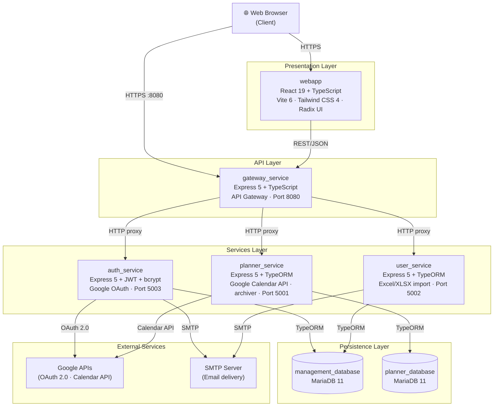

**Component descriptions:**

| Component | Main responsibility | Key technology |
|---|---|---|
| `webapp` | SPA user interface; display of calendars, degree programmes, classrooms and change requests | React 19, TypeScript, Vite 6, Tailwind CSS 4, Radix UI, TanStack Query |
| `gateway_service` | Single entry point for all frontend requests; routes and forwards HTTP requests to internal services; manages CORS and multipart file uploads | Express 5, TypeScript, Axios, Multer |
| `auth_service` | JWT authentication; account registration and activation; Google OAuth 2.0 integration; password reset with OTP via email | Express 5, TypeORM, bcrypt, jsonwebtoken, Nodemailer |
| `user_service` | User CRUD management; role control (`ADMIN`, `PROFESSOR`); bulk import from Excel (XLSX) files | Express 5, TypeORM, xlsx |
| `planner_service` | Business core of the system: manages calendars, degree programmes, academic years, subjects, groups, classrooms, recurring events and one-off events; processes change requests from teaching staff; synchronises academic calendars with Google Calendar; imports timetables from plain-text files and exports them as ZIP archives; audits all write operations | Express 5, TypeORM, xlsx, archiver |
| `management_database` | Relational store for users and credentials; shared between `auth_service` and `user_service` | MariaDB 11 |
| `planner_database` | Relational store for all academic information; exclusive use of `planner_service` | MariaDB 11 |

**Public exposure perimeter:** a key security property of this decomposition is that only the API gateway (port 8080) and the web frontend (ports 80/443) are accessible from outside the server. The three backend services and both databases reside in an isolated internal network with no ports exposed to the host or the Internet. This deliberate boundary limits the attack surface: every request to the backend must pass through the gateway, where the CORS policy is enforced and multipart file handling is centralised.

---

### 5.1.3 Deployment diagram

The system is deployed using Docker containers orchestrated with Docker Compose. Three deployment profiles are maintained:

- **Local development**: compiles all services from source with ports exposed on the host machine and hot-reload volumes for immediate feedback during development.
- **Production (two environments)**: pulls pre-built images from the container registry, limits public exposure to the gateway and the frontend, and keeps the remaining services on an isolated internal network. Two configurations are maintained: one for an Azure VM used during initial development, and one for the university's own server (EII), which is the current production environment accessible through the institutional VPN.
- **Quality analysis**: starts a local SonarQube instance to run the static code analysis pipeline against the full codebase.

**Figure 5.2 — Deployment diagram**

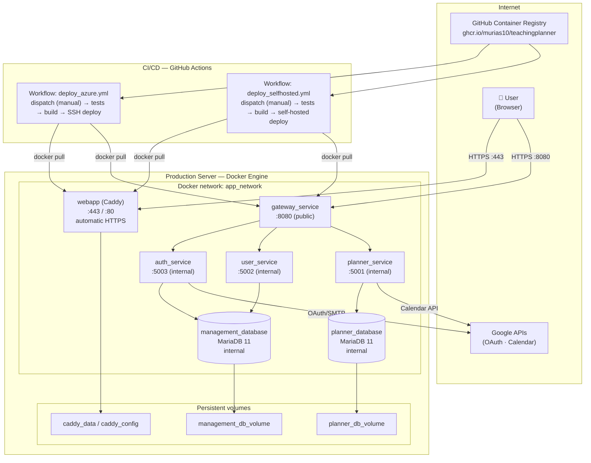

**CI/CD pipeline (four optional jobs):**

The deployment process is designed for deliberate, controlled releases rather than fully automated continuous deployment. It is structured in four configurable jobs defined in two GitHub Actions workflow files: `deploy_azure.yml` (public Azure VM, SSH access) and `deploy_selfhosted.yml` (university private network VM, self-hosted runner). Both workflows share the same structure, and each job can be independently enabled or disabled at run time:

1. **Integration tests** (`unit-tests`, optional): runs the scheduling service's integration tests against a real database container on Node.js 20.
2. **End-to-end tests** (`e2e-tests`, optional — depends on the previous step): starts all backend services in the background, launches MariaDB as a Docker service, seeds a test administrator user and runs the browser-based tests on Chromium.
3. **Image build and publish** (`build-and-push-images`, optional): builds the Docker images for all services and publishes them to the project's container registry.
4. **Deployment** (`deploy`, optional): in the Azure workflow, connects to the remote VM via SSH and restarts the services with the newly published images; in the self-hosted workflow, the same operations run directly on the university runner without an incoming SSH connection.

Both workflows are triggered exclusively by manual activation from the repository's Actions tab. When starting a run, the responsible person selects via checkboxes which jobs to execute, allowing combinations such as running only the tests, only the build, or the full pipeline. No code push triggers an automatic deployment; the decision to promote a build to production is always explicit and deliberate. The detailed operational steps are described in the [Installation Manual](./manual_instalacion.md).

**Key aspects of the production deployment:**

- Databases include *health checks* before dependent services start, ensuring that the backend services do not attempt to open database connections before the database engine is ready to accept them.
- Only the API gateway and the web frontend are reachable from outside the server. All backend services and databases operate within an isolated internal network with no ports exposed to the host or the Internet.
- The frontend is served from a **Caddy** container configured for HTTPS using a certificate issued by the university's IT department (GEANT TLS, valid for `*.ingenieriainformatica.uniovi.es`). The certificate and private key are stored as encrypted repository secrets and written to the server automatically on each deployment run.
- Database schema management follows an automatic synchronisation model: on each service start, the ORM compares the current schema with the entity definitions and applies any structural differences without manual intervention. This removes the need for an explicit migration pipeline, which is appropriate for the scope of this project — a single-tenant university deployment with a development cadence that favours iteration speed. In a multi-tenant or high-availability context this approach would be replaced by a versioned migration tool; the well-defined entity structure and shared audited base class already provide a clean foundation for that transition. Integration tests benefit from the same configuration, since each suite starts from an empty, freshly created database.

---

### 5.1.4 Technology stack by layer

**Table 5.2 — Technology stack by layer**

| Layer | Component | Language | Framework / Runtime | ORM / DB | Tests | External integration |
|---|---|---|---|---|---|---|
| Frontend | webapp | TypeScript | React 19, Vite 6, Tailwind 4 | — | Playwright 1.58 | — |
| API Gateway | gateway_service | TypeScript | Express 5, Node.js 23¹ | — | — | — |
| Authentication | auth_service | TypeScript | Express 5, Node.js 23¹ | TypeORM 0.3 | — | Google OAuth 2.0, SMTP |
| Users | user_service | TypeScript | Express 5, Node.js 23¹ | TypeORM 0.3 | — | SMTP |
| Scheduling | planner_service | TypeScript | Express 5, Node.js 23¹, archiver | TypeORM 0.3 | Jest 30 + Testcontainers | Google Calendar API |
| Persistence | management_database | SQL | MariaDB 11 | — | — | — |
| Persistence | planner_database | SQL | MariaDB 11 | — | — | — |
| Containers | — | YAML | Docker · Docker Compose | — | — | — |
| CI/CD | — | YAML | GitHub Actions | — | — | GitHub Container Registry |
| Code quality | — | — | SonarQube | — | — | — |

> ¹ Node.js 23 is used in the production container images, as it was the current active release at the time of deployment. The CI environment runs on Node.js 20, the Long-Term Support release that was pinned in the workflow configuration at project setup. Both versions are fully compatible with the framework and ORM versions used by the services; the version gap does not introduce behavioural differences in the tested code paths.

---

### 5.1.5 Security design

The system's security is organised into five complementary layers, each addressing a distinct attack surface:

1. **JWT-based authentication** — stateless identity verification on every API request.
2. **Password hashing (bcrypt)** — irreversible credential storage with per-password salt.
3. **Role-based access control (RBAC)** — fine-grained operation authorisation by user role.
4. **Transport layer security (HTTPS/TLS)** — encrypted communication between client and server.
5. **CORS protection** — browser-enforced origin restriction on API requests.

The following subsections describe the design of each layer in detail.

#### JWT-based authentication (stateless)

The system uses JWT tokens signed with a symmetric secret. The token payload carries only the minimum identity data needed by the backend — user identifier, email address and role — with no sensitive information. Tokens are stateless on the server: there is no session table or revocation list; validity is determined solely by the cryptographic signature and the expiry timestamp embedded in the token itself.

The absence of a server-side session store or revocation mechanism is an intentional trade-off appropriate for this system's scope: TeachingPlanner is an internal university tool with a small, known user base, where the risk of a compromised token remaining valid until its natural expiry is acceptable. In a higher-security context (e.g. a financial application), this design would be complemented with a token blacklist or short-lived access tokens paired with refresh-token rotation.

A further design decision is that token verification is performed **in each backend service independently**, not at the gateway. The gateway acts as an opaque proxy and forwards the token without validating it. This allows any service to be deployed and invoked directly — for example, from integration scripts or integration tests — without depending on the gateway as the authentication authority, which increases resilience and testability.

Account activation and password reset follow asynchronous flows via email. When a user registers, the system generates a random activation token that is stored against the account and sent by email; the account remains inactive until the user follows the activation link. Password reset generates a single-use one-time password with an expiry timestamp, also delivered by email.

Figure 5.3 shows the user account lifecycle.

**Figure 5.3 — User account lifecycle**

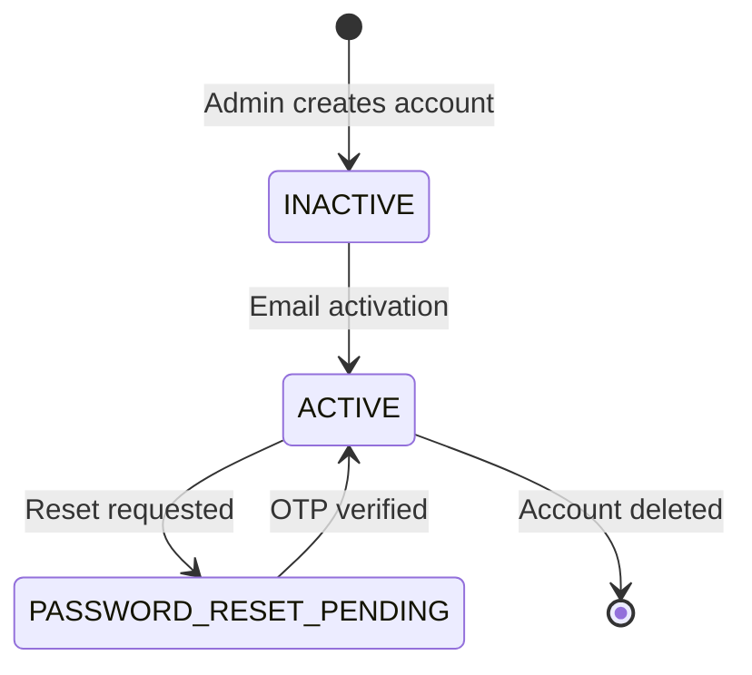

#### Password hashing (bcrypt)

Passwords are never stored in plain text. Each password is run through an irreversible hashing function with a unique random salt before it is persisted — the cost factor that controls hashing strength is configurable via an environment variable. Verification at login works by applying the same hashing function to the supplied password and comparing the result against the stored hash; the original password is never recovered or compared directly, which makes precomputed dictionary attacks ineffective.

#### Role-based access control (RBAC)

The system defines two roles with clearly delimited permissions:

- **Administrator** (`ADMIN`): full read and write access to all system entities; responsible for user management and for approving or rejecting change requests proposed by teaching staff.
- **Professor** (`PROFESSOR`): read access to calendars and scheduled events; can submit change requests — proposals to modify or cancel already scheduled events — which are then queued for the administrator's review.

Authorisation verification is applied via a chain of three Express middlewares that act before the controller on all protected routes:

```
authenticateToken → requireAuth → requireRole('ADMIN' | 'PROFESSOR') → controller
```

The chain works in three steps: first, the identity extractor reads the Bearer token from the request header and, if the signature is valid, attaches the decoded user data to the request context — if the token is missing or invalid it simply leaves the user context empty without rejecting outright. Second, the authentication guard rejects the request with `401 Unauthorized` if no valid user context was established. Third, the role guard rejects with `403 Forbidden` if the authenticated user does not hold the required role.

Splitting these responsibilities across three separate handlers means the identity-extraction step can be reused on routes that need to know who the caller is without requiring a specific role — for example, when a user retrieves their own profile.

#### Transport layer security (HTTPS/TLS)

In production, all external traffic to the frontend goes through Caddy on port 443, with TLS provided by a certificate issued by the university's systems administration team (GEANT TLS, scoped to `*.ingenieriainformatica.uniovi.es`). The certificate and its private key are stored as encrypted repository secrets and written to the server automatically by the deployment workflow on each run, eliminating the need for manual file transfers. HTTP traffic on port 80 is redirected to HTTPS. The gateway is exposed on port 8080 and also receives HTTPS connections.

Communication between services within the internal Docker network uses HTTP without TLS, which is acceptable from a security standpoint because the traffic never leaves the virtual machine and the Docker bridge network is isolated from external traffic.

#### CORS protection

The gateway implements a CORS policy with an allowlist of permitted origins, built dynamically from environment-supplied values for the production domain and the server's public IP address. Only the frontend deployed at those origins can read API responses from a browser, preventing unauthorised cross-origin data access.

It is worth noting that this system is **not vulnerable to classical CSRF attacks**: all API requests are authenticated by including the token in a custom HTTP request header, not in a cookie. Browsers do not automatically attach custom headers to cross-site requests, so a malicious third-party page cannot forge authenticated requests on behalf of a logged-in user. CORS reinforces this by additionally blocking unauthorised origins from reading any response that the browser does receive, providing defence in depth against cross-origin data exfiltration.

---

## 5.2 Detailed Design

### 5.2.1 Code structure

The three backend services share an identical **layered architecture** that separates the responsibility of routing, request processing, business logic and data access. This structural uniformity means that a developer familiar with one service can navigate any other without relearning the codebase conventions.

**Figure 5.4 — Backend layered architecture (pattern common to all three microservices)**

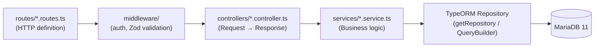

The flow of an HTTP request through the layers is as follows:

1. **Route definition layer** (`routes/`): registers the HTTP verbs and paths, composes the middleware chain and associates the final controller handler for each endpoint.
2. **Middleware layer** (`middleware/`): contains cross-cutting concerns applied before the controller. One middleware verifies the JWT and identifies the caller; a second enforces the required role; a third validates the request body against a schema before any business logic runs.
3. **Controller layer** (`controllers/`): receives the incoming request, extracts the necessary parameters, delegates to the corresponding service and assembles the HTTP response — status code, headers and JSON body.
4. **Service layer** (`services/`): contains the pure business logic. It reads and writes data through the repository abstraction and is the only place where domain rules, business validations and data transformations are executed.
5. **Repository layer** (TypeORM): abstracts database access. Controllers and services never write SQL directly; they interact with the database through the ORM's query API.

The directory structure of each backend microservice is:

```
<service>/src/
├── config/          # TypeORM DataSource and environment variable loading
├── entities/        # TypeORM entities (@Entity, @Column, @ManyToOne… decorators)
├── middleware/      # authenticateToken, requireRole, schema validation
├── routes/          # HTTP route definitions and middleware composition
├── controllers/     # Express controllers: Request → delegate → Response
├── services/        # Business logic and repository access
├── schemas/         # Zod schemas for API input validation
├── types/           # TypeScript types shared within the service
└── utils/           # Reusable utilities (formatting, helpers)
```

**Frontend (webapp):** the React application follows an organisation by functional responsibility:

```
webapp/src/
├── contexts/        # Global React state: AuthContext, AppContext,
│                    # BreadcrumbContext, FloatingAlertContext
├── hooks/           # Custom hooks organised by domain:
│                    # calendar/, classroom/, course/, degree/,
│                    # subject/, group/, user/, event-request/, google/
├── pages/           # SPA pages (one per React Router route)
├── components/      # Reusable components by domain and base UI components
├── services/        # HTTP call functions to the API (axios)
├── types/           # TypeScript types for the business domain
└── utils/           # Presentation and formatting utilities
```

The separation between the hooks directory (data logic) and the pages directory (presentation) applies the Single Responsibility Principle to the React component model: each page component is responsible solely for rendering and user interaction, while the corresponding domain hook encapsulates all fetching, caching and error-handling concerns. Page components are therefore unaware of the API endpoint details, cache configuration or retry strategies — they simply invoke the domain hook and react to the loading, data and error states it exposes. This decoupling also makes it straightforward to replace the data layer without touching any presentation component.

---

### 5.2.2 Design patterns

Table 5.3 summarises the five design patterns applied in TeachingPlanner before their detailed description.

**Table 5.3 — Design patterns summary**

| Pattern | Type | Component(s) | Purpose |
|---|---|---|---|
| API Gateway | Architectural (Structural) | `gateway_service` | Single entry point to the backend; encapsulates the internal URLs of the microservices |
| Repository | Structural | `*_service` (TypeORM) | Decouples business logic from relational storage |
| Middleware Chain (Chain of Responsibility) | Behavioural | `*_service` (Express) | Composable, reusable composition of cross-cutting concerns (auth, roles, validation) |
| Context | Behavioural (React) | `webapp` | Global state propagation without prop-drilling |
| Custom Hook + Query | Behavioural (React) | `webapp` | Encapsulation of fetching logic, caching and loading state per domain |

---

#### Pattern 1: API Gateway

**Name:** API Gateway

**Motivation:** the frontend should not need to know how the backend is decomposed internally — which services exist, on which ports they listen, or how requests are routed among them. A single entry point abstracts this topology, applies CORS and multipart handling uniformly, and reduces the HTTP client configuration in the web application to a single base URL.

**Instantiation: REST request routing**

| Role | Class / File | Description |
|---|---|---|
| Gateway (Façade) | `gateway_service/src/app.ts` | Single entry point. Registers all routes and applies global middlewares (CORS, Multer) |
| Domain router | `gateway_service/src/routes/*.routes.ts` | Four route files: `auth`, `planner`, `user`, `status` |
| Proxy controller | `gateway_service/src/controllers/*.controller.ts` | Forwards the HTTP request to the corresponding internal service |
| Proxy utility | `gateway_service/src/utils/proxy.ts` | Abstracts the outgoing HTTP call (Axios) and propagates the request headers and body |
| Service configuration | `gateway_service/src/config/services.ts` | Defines the base URLs of the internal services via environment variables |

---

#### Pattern 2: Repository (TypeORM)

**Name:** Repository

**Motivation:** business logic should not depend on how or where data is physically stored. The repository abstraction provided by the ORM decouples service code from the relational storage layer, with two concrete benefits: services can be tested in isolation by substituting a repository implementation; and queries are expressed in terms of the domain model rather than raw table and column names, which reduces the risk of injection vulnerabilities and makes schema changes less disruptive.

**Instantiation: Data access in planner_service**

| Role | Class / File | Description |
|---|---|---|
| Entity | `planner_service/src/entities/*.entity.ts` | Define the data schema using TypeORM decorators (`@Entity`, `@Column`, `@ManyToOne`, `@ManyToMany`, etc.) |
| Repository | `dataSource.getRepository(EntityClass)` | Runtime object that exposes `find`, `save`, `remove`, `createQueryBuilder`, etc. |
| DataSource | `planner_service/src/config/data-source.ts` | Initialises the MariaDB connection and registers the 13 entities of the scheduling domain |
| Service (repo client) | `planner_service/src/services/*.service.ts` | Obtains the repository from the DataSource and executes business logic on it |

---

#### Pattern 3: Middleware Chain (Chain of Responsibility)

**Name:** Middleware Chain (instantiation of the Chain of Responsibility pattern on Express)

**Motivation:** HTTP request processing is rarely a single operation — it involves authentication, authorisation, input validation, and only then the actual business logic. Structuring these steps as a composable chain of independent middleware functions allows each concern to be written, tested and reused in isolation, without polluting the controller with responsibilities that are orthogonal to its domain purpose.

**Instantiation: Protecting admin routes in the scheduling service**

The full chain for an administrator-protected route is the following sequence of four handlers:

| Order | Role | Class / File | Description |
|---|---|---|---|
| 1 | Identity extractor | `planner_service/src/middleware/auth.middleware.ts` → `authenticateToken` | Parses the Bearer token from the `Authorization` header and verifies the JWT signature; if valid, attaches `req.user`; if missing or invalid, leaves `req.user = undefined` (does not reject yet) |
| 2 | Authentication guard | `planner_service/src/middleware/auth.middleware.ts` → `requireAuth` | Rejects with `401 Unauthorized` if `req.user` is `undefined` |
| 3 | Authorisation guard | `planner_service/src/middleware/require-role.middleware.ts` → `requireRole('ADMIN')` | Rejects with `403 Forbidden` if the role in `req.user.role` does not match the required role |
| 4 | Controller | `planner_service/src/controllers/*.controller.ts` | Processes the request and generates the response only if the three preceding handlers have not cut the chain |

---

#### Pattern 4: Context (React)

**Name:** Context (global state propagation pattern in React)

**Motivation:** React's component model encourages composing the UI from a tree of independent, reusable components. However, some state is genuinely global — the authenticated user session, in-flight alerts, the active breadcrumb path — and must be available anywhere in the application without manually threading it through every intermediate component. The Context API provides a scoped dependency injection mechanism that makes this shared state accessible to any subscriber without coupling intermediate components to data they do not use.

**The system uses four contexts:**

**Instantiation 1: Authentication state**

| Role | Class / File | Description |
|---|---|---|
| Context | `webapp/src/contexts/AuthContext.tsx` | Defines the context type (`user`, `token`, `login`, `logout`) and its initial value |
| Provider | `AuthProvider` (in `AuthContext.tsx`) | Wraps the entire application; manages state with `useReducer`; persists the token in `localStorage`/`sessionStorage` |
| Access hook | `useAuth()` (exported from `AuthContext.tsx`) | Encapsulates `useContext(AuthContext)` for typed, safe access from any component |

**Instantiation 2: General application state**

| Role | Class / File | Description |
|---|---|---|
| Context | `webapp/src/contexts/AppContext.tsx` | Global SPA state: selected calendar, active degree programme and other navigation selections |

**Instantiation 3: Breadcrumb navigation**

| Role | Class / File | Description |
|---|---|---|
| Context | `webapp/src/contexts/BreadcrumbContext.tsx` | Allows any page to dynamically update the hierarchical navigation path shown in the top bar |

**Instantiation 4: Global notifications**

| Role | Class / File | Description |
|---|---|---|
| Context | `webapp/src/contexts/FloatingAlertContext.tsx` | Queue of floating alerts (success, error, warning) displayed above the interface; any component can emit an alert without knowing the display component |

---

#### Pattern 5: Custom Hook with React Query

**Name:** Custom Hook (data logic composition with TanStack React Query)

**Motivation:** React re-renders components reactively when state changes, but the logic that drives those state changes — HTTP fetching, cache invalidation, error handling, optimistic updates — follows the same structure for every domain entity in the application. Encapsulating this logic in domain-specific custom hooks eliminates duplication, keeps page components free of data-fetching concerns, and exposes a consistent, predictable interface — loading state, data, error, and mutation functions — across the entire frontend.

**Instantiation: Degree management hook (representative example)**

| Role | Class / File | Description |
|---|---|---|
| Custom hook | `webapp/src/hooks/degree/useDegrees.ts` | Calls React Query's `useQuery` for reads and `useMutation` for writes; exposes `data`, `isLoading`, `error` and mutation functions with automatic cache invalidation |
| QueryClient | Configured in `webapp/src/main.tsx` | Manages the global query cache, retry configuration and in-memory data TTLs |
| Consumer component | `webapp/src/pages/DegreePage.tsx` | Invokes the hook and renders based on the exposed states, with no coupling to Axios or the API URL |

This pattern is replicated uniformly across all application domains: calendars, classrooms, academic years, degree programmes, subjects, groups, users, change requests and Google Calendar integration.

---

### 5.2.3 Domain model — Main entities

The shape of the scheduling domain model is the result of a deliberate architectural choice between two fundamentally different approaches.

The alternative not taken would have modelled events the way a conventional calendar application does: each class occurrence stored as a concrete record with a specific date, a start time and an end time, with no notion of recurrence patterns, day characters, or group-level hours budgets. This is the model used by Google Calendar and most general-purpose scheduling applications, and it would have made the calendar view straightforward to implement — displaying events would simply mean reading stored records.

The approach taken instead mirrors the structure of the plain-text file format used across the school's institutional software ecosystem. In that format, a recurring class is described by its day of the week, its recurrence character, and the total hours planned for the group — not by an explicit list of dates. The domain model preserves this structure: recurring events have no stored dates, groups carry a hours budget, and teaching days carry characters that drive expansion. The reason for this choice is the institutional constraint the project must honour: TeachingPlanner must be able to import timetable data from existing files and export it back in exactly the same format, so that the other applications in the ecosystem — the one that assigns timetables to individual students, the one consumed by the head of studies — can continue to operate without modification. With a conventional date-based model, generating the required export files would demand a complex inverse transformation from concrete dates back to the recurrence-pattern format the ecosystem expects, with a real risk of information loss or ambiguity. With the current model, the export is a direct transcription and the import is a faithful reconstruction.

The trade-off is that generating the calendar view requires expanding the recurrence patterns at runtime — the more complex operation described in section 5.2.8 — rather than simply reading stored dates. This runtime complexity is the deliberate cost of maintaining full compatibility with the institutional ecosystem from the first day of deployment.

The following diagram shows the domain entities managed by the scheduling service and their relationships. All business entities inherit from a shared audited base class that automatically records the author and timestamp of every write operation.

**Figure 5.5a — Class diagram of the scheduling domain (`planner_db`)**

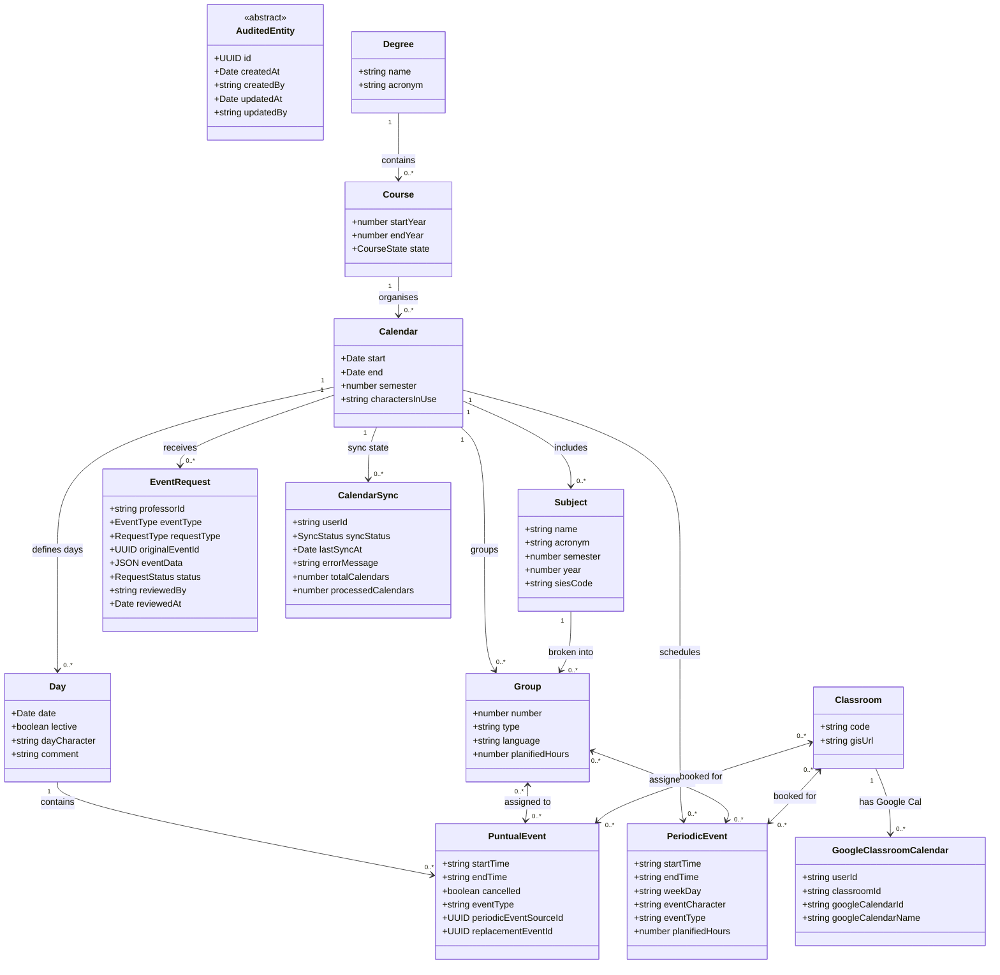

**Figure 5.5b — User entity (`management_db`)**

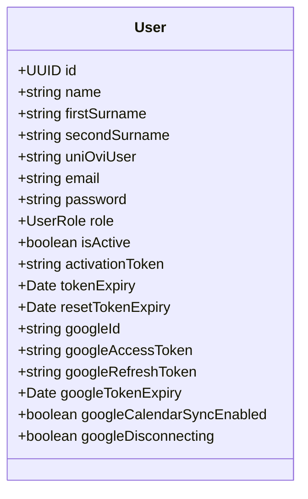

The user entity lives exclusively in the management database, where it is owned jointly by the authentication service and the user management service. It does not exist in the scheduling database: the scheduling service references users only by the identifier extracted from the JWT token — stored in the sync state and classroom calendar records — and by the email address recorded in the audit fields of every write operation. There is no foreign key constraint crossing the database boundary; referential integrity between the two databases is enforced at the application layer.

**Notes on the domain model:**

- Each group optionally carries a planned hours budget. Groups that have no recurring events of the standard type — for instance, those created to define the subject structure before any schedule is assigned — will have no budget set. Creating a standard recurring event for such a group requires the administrator to provide a budget at that point. Special-purpose event types (room blocks, revision sessions, assessments) do not require a budget and can be assigned to any group; when the system generates events for a group with no budget configured, it includes all of them without applying any hours limit.

- A change request (`EventRequest`) is a coordination entity between roles: it carries no direct foreign key to the event it targets. Instead, the reference to the event to be modified or cancelled is stored inside a JSON payload, which allows representing any type of event — whether one-off or recurring — without requiring schema changes when new request types are added. The trade-off of this design is the loss of referential integrity at the database level: if a referenced event is deleted before the request is processed, the system must handle the stale reference gracefully at the application layer rather than relying on a cascade or restrict constraint.

- An academic year moves through three stages during its lifetime: planned, before the semester begins; active, while it is in progress; and concluded, once it ends. This progression gates editing operations on the associated calendar — all management operations remain available in the first two stages, but once a course is concluded write operations are blocked to preserve the integrity of the historical record. Only administrators can advance a course to the next stage.

- For each combination of user and academic calendar, the system tracks the current synchronisation state, which covers the full range of possibilities a sync process can be in: idle, in progress, completed successfully, failed, or being deleted. The deletion state deserves special mention — it is recorded as soon as the user initiates the removal, before the Google API calls complete, so that the interface shows the correct state even if the page is reloaded mid-operation.

- Quota tracking for the Google Calendar API is handled by a dedicated infrastructure entity — not a business one — that persists the request counters between service restarts. It is effectively a singleton: at most one row exists in its table, identified by a fixed key for the monitored API. The counters implement both a per-minute sliding window and a daily budget. Persisting this state in the database rather than in memory ensures the quota tracking survives service restarts and remains consistent if the service is ever scaled to multiple replicas. This entity does not extend the audited base class because it is purely operational and does not benefit from creation and modification traceability.

- **Domain uniqueness constraints** (business invariants enforced as unique indexes in the database):
  - An academic year cannot have two calendars covering the same semester.
  - Within a given calendar, no two subjects may share the same name, and no two may share the same acronym.
  - A group is uniquely identified within a calendar by the combination of subject, group number, type and language of instruction.
  - Classroom codes are unique across the entire system, regardless of calendar or degree programme.
  - Each user may have at most one Google Calendar linked to any given classroom.

---

### 5.2.4 Sequence diagrams — Authentication flows

#### Flow 1: Email and password authentication (JWT)

This is the primary authentication flow and the entry point for all system users. The diagram traces the request from the moment the user submits their credentials through the microservice chain, covering both the error paths (inactive account, wrong credentials) and the success path that results in a JWT being issued and stored client-side.

**Figure 5.6 — Email/password authentication sequence**

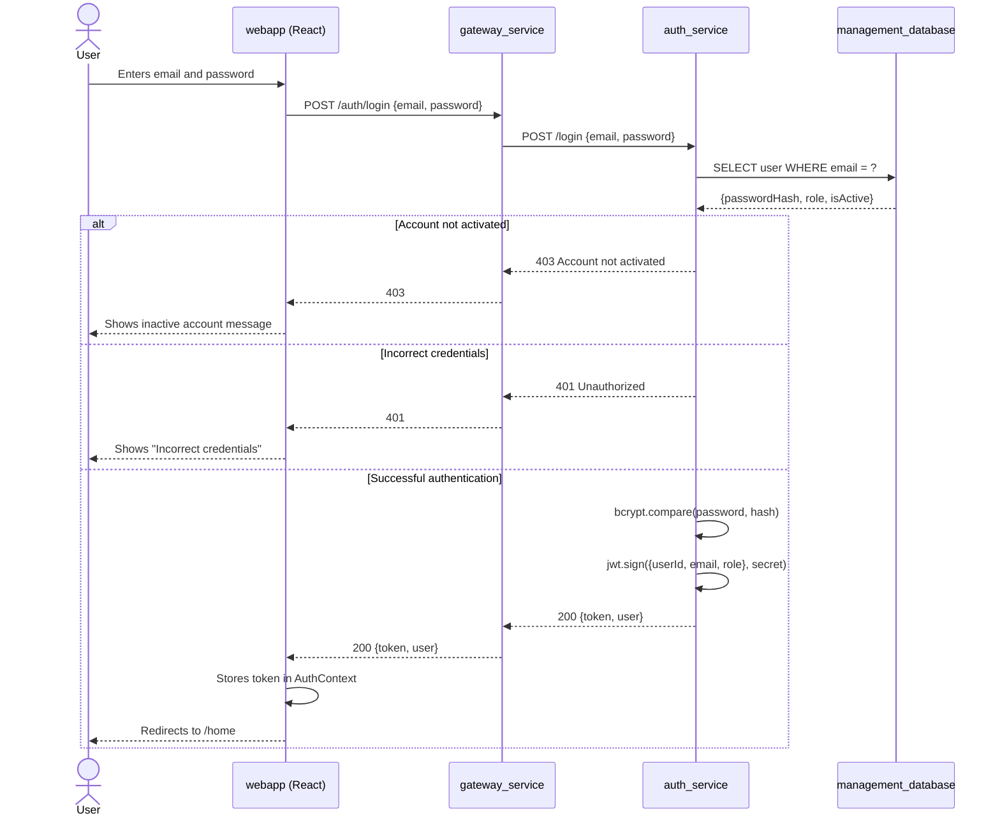

#### Flow 2: Google account linking

The second flow allows an already authenticated user to **connect their Google account** to enable synchronisation of the academic calendar with Google Calendar. It is not an alternative login path: the initiation endpoint requires a valid session token and is only reachable by users who are already logged in. The user triggers the process from the settings page.

This flow justifies the presence of Google identity and token fields in the user record. OAuth tokens are stored **encrypted** in the database; the authentication service handles encryption before writing and decryption when providing the tokens to the scheduling service on demand. The diagram distinguishes the two databases involved: the management database, which holds user credentials and OAuth tokens, and the scheduling database, which holds the synchronisation state records.

**Figure 5.7 — Google account linking sequence**

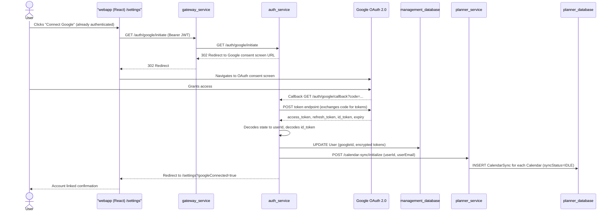

---

### 5.2.5 Change request design

The teaching calendar is a shared institutional resource. Giving teaching staff direct write access to it would mean that any scheduling error or uncoordinated change would immediately affect what every other user sees. Rather than prevent professors from proposing changes altogether, the system introduces a review layer: professors submit requests describing the change they need, and administrators evaluate and execute those requests. Under this model, the calendar only changes when an administrator explicitly decides that a change is correct and approves it. Professors have a structured channel to communicate scheduling needs, but no direct ability to modify the calendar that other users see.

The sequence below shows how a request travels from submission to resolution.

**Figure 5.8 — Change request flow sequence**

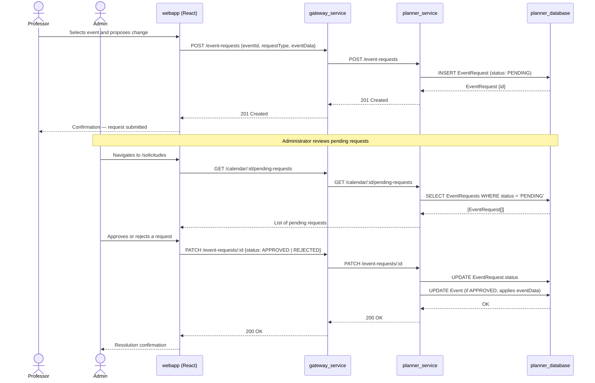

**Table 5.4 — EventRequest state transitions**

| State | Description | Possible transitions |
|---|---|---|
| `PENDING` | Request submitted by PROFESSOR, pending review by the administrator | → `APPROVED`, → `REJECTED` |
| `APPROVED` | Administrator approves; the change contained in `eventData` is applied to the original event | — (terminal state) |
| `REJECTED` | Administrator rejects; the original event is not modified | — (terminal state) |

The request flow involves two dedicated views in the web application: an administrator-facing view that lists all pending requests for a given semester, and a professor-facing personal view that shows all requests submitted by the logged-in user across all semesters, with the ability to filter by status and withdraw requests that are still pending.

**Request types (`requestType`):**

| Type | Description | `originalEventId` |
|---|---|---|
| `CREATE` | Proposal to create a new event | Not required (null) |
| `EDIT` | Modification of an existing event (time, classroom, groups) | Required |
| `CANCEL` | Cancellation of an existing event (a specific occurrence of a recurring series, or a one-off event) | Required |
| `REPLACE` | Cancellation of the original event (a specific occurrence of a recurring series, or a one-off event) and creation of a new one-off event in its place | Required |

A reference to an existing event is required for modification, cancellation and replacement requests because those operations are defined relative to something that already exists in the schedule — the administrator must be able to identify and locate the target event to apply or reject the change. Creation requests carry no such reference: the full specification of the new event is contained entirely within the request payload.

#### Four types of request

Not all scheduling changes are equivalent, and the design reflects this with four distinct request types, each with its own approval behaviour. The distinction is not merely organisational: each type triggers a different execution path at approval time. A single generic "change request" type would work as a free-text description that the administrator would have to interpret before knowing what to do — the four types make the intended operation unambiguous, so the system can execute it automatically and consistently the moment the administrator approves.

A *creation request* proposes adding a new event — one-off or recurring — that does not yet exist in the calendar. The request carries the full specification of the event to be created, and approval causes that event to appear in the calendar.

An *edit request* asks for a change to an event that already exists — typically a time adjustment or a note update. The original event remains in place until the administrator approves the request and applies the modification.

A *cancellation request* asks the system to suppress a specific occurrence of a recurring event — for instance, the class scheduled for a particular date that falls on a public holiday or an exam period. Cancelling that one occurrence does not mean the class no longer exists in the semester: the recurring definition remains intact and continues generating occurrences on all other applicable dates. Removing the definition entirely would wipe out the entire series for the rest of the semester, which is not the intended outcome. The cancellation request therefore targets only the date in question, leaving everything else untouched.

A *replacement request* covers the case where a class is not simply cancelled but moved — to a different day, time, or room. The professor is not removing the class from the semester; they are relocating it. This requires two things to happen together: the original occurrence must be suppressed, and a new event must appear in its place. The two operations are linked — the new event exists precisely because the original is being displaced — and they are applied as a single atomic action. If either part of the operation fails, neither is applied. This prevents the calendar from ending up in an inconsistent state where the original has been cancelled but no replacement exists, leaving a gap in the teaching schedule, or where the replacement has appeared but the original is still visible, creating a double-booking.

#### The lifecycle of a request

Every request enters the system in a pending state. While pending, the professor who submitted it can withdraw it without any administrator involvement — useful when the need changes between submission and review. The administrator can either approve the request, which triggers immediate execution of the corresponding calendar change, or reject it with a written comment explaining the reason. Once approved or rejected, the request is closed and cannot be revisited.

#### Field completion at approval time

Professors and administrators have access to different information. A professor knows what scheduling change they need — they want to move their class to a different room on a specific date — but they may not know which rooms are available at that time, or what the group's planned hours figure is if the group is not one they normally manage. Requiring the professor to complete those fields before submitting would force them to first ask the administrator for the missing data, defeating the purpose of the request system. Instead, the design allows a professor to submit a request with those logistical fields left empty. The administrator, who has full visibility of room availability and group configurations, fills them in at approval time. The information flows in the right direction: from the professor (intent) to the administrator (execution details), in a single cycle.

#### Conflict detection at approval time

The system checks for time-slot conflicts — between groups and between classrooms — at the moment of approval, not at the moment of submission. This is a deliberate choice. Consider two professors who submit requests on the same day for the same room at the same time: neither request conflicts with anything at the time of submission, because neither has been approved yet and neither appears in the calendar. If conflicts were validated only at submission time, both requests would pass validation and both could later be approved, producing a genuine double-booking. Checking at approval time prevents this: when the administrator approves the first request and it enters the calendar, the second request will fail its conflict check and cannot be approved in its current form. The calendar state at the moment of approval is the only state that matters for determining whether a change is safe to apply.

#### Automatic cleanup of stale requests

If an event that a pending request references — the target of an edit, cancellation or replacement — is deleted from the system, that request becomes impossible to execute: there is nothing left to edit, cancel or replace. Leaving it in the pending state would create a problem for the administrator: it would appear in the review queue as a normal pending request, but attempting to approve it would produce an error with no clear explanation of what went wrong. The administrator would have to investigate the discrepancy manually to understand why approval failed. The system prevents this by automatically rejecting all pending requests that reference a deleted event, and recording the reason in the rejection note. The professor is informed that the request was closed because its target no longer exists, and the administrator's queue stays free of requests that cannot be actioned.

---

### 5.2.6 Event system design: types, recurrence and characters

The event system is the most complex part of the scheduling domain. Its design is driven directly by the timetable format used across the school's institutional software ecosystem: multiple applications within that ecosystem — including the system responsible for assigning timetables to individual students — share the same plain-text file format and the same recurrence conventions. That format distinguishes three types of recurrence: regular weekly classes that repeat on every teaching week, fortnightly alternating classes (odd-week/even-week groups sharing a classroom or time slot), and arbitrary patterns where a specific character is assigned to each teaching day. The event model described below is a faithful representation of this three-tier recurrence structure, designed to remain compatible with all applications that consume or produce the shared format.

#### Event types: one-off vs. recurring

The system distinguishes two structurally different types of events:

- **One-off event** (`PuntualEvent`): tied directly to a specific day of the calendar. It can be flagged as cancelled to reflect that a class did not take place that day. When a cancellation suppresses a specific occurrence of a recurring series, the one-off event stores a reference to that series (`periodicEventSourceId`) — this is what makes the cancellation selective: the system knows which recurring event was blocked on that date without touching the series definition itself. If the class was not simply cancelled but moved to a different time or day, a second reference (`replacementEventId`) links the cancelled event to the new one-off event that replaced it, establishing bidirectional traceability: from the cancelled occurrence you can reach the replacement, and from the replacement you can reach what it displaced.

- **Recurring event** (`PeriodicEvent`): not tied to any specific calendar day, but defined by the day of the week and the academic year within the semester. It has no fixed date in the database; the calendar generation service dynamically expands it to all teaching days where it applies, according to its recurrence character.

#### The event character system (`eventCharacter`)

The recurrence character (`eventCharacter`) is the central mechanism that determines which teaching days each recurring event expands to. The system defines three standard values and a pool of custom ones:

**Table 5.5 — Expansion behaviour by `eventCharacter`**

| `eventCharacter` | Expansion pattern | Description |
|---|---|---|
| `N` (Normal) | All teaching weeks of the calendar | Regular weekly class |
| `P` (Even) | Teaching weeks with an even number from the start of the semester | Fortnightly class on even weeks |
| `I` (Odd) | Teaching weeks with an odd number from the start of the semester | Fortnightly class on odd weeks |
| Custom (e.g. `A`, `Α`, `А`) | `Day` entries whose `dayCharacter` field contains that character | Recurrence defined by the imported timetable |

The calendar maintains a record of all custom characters currently in use. When a new custom recurring event type is created, the system picks the first available character from a pool of roughly 90 options — Latin letters (excluding the reserved N, P and I), uppercase Greek, uppercase Cyrillic and digits — and returns it automatically. When all available characters have been assigned, the system raises an explanatory error.

Each teaching day in the calendar carries a day character assigned during the timetable import from the plain-text files. This character identifies which type of custom recurring event falls on that day, allowing the expansion engine to determine precisely which events should be generated on each teaching date.

#### Event types (`eventType`)

Regardless of their recurrence pattern, events are also classified by their functional purpose — a separate type attribute that determines how each event is counted towards teaching hours and how it is treated during data export:

**Table 5.6 — Behaviour by `eventType`**

| `eventType` | Counts towards planned hours | Exported to TXT | Allows multi-select of groups/classrooms |
|---|---|---|---|
| `NORMAL` | Yes | Yes | No |
| `BLOCKER` | No | No | No |
| `REVISION` | No | No | Yes |
| `EVALUACION` | No | No | Yes |
| `OTRO` | No | No | Yes |

- The standard class type (`NORMAL`) is the only one that counts towards the group's hours budget; the system tracks only non-cancelled events of this type when calculating how many teaching hours remain.
- The blocker type (`BLOCKER`) reserves a classroom for non-academic use without associating it with any subject or group.
- The remaining three types — revision, assessment and other (`REVISION`, `EVALUACION`, `OTRO`) — represent academic activities that occupy a time slot but do not consume the teaching hours budget, and allow assigning multiple groups and classrooms simultaneously.

#### Cancellation and replacement of recurring occurrences

When a specific occurrence of a recurring event is cancelled — for example, the Tuesday 14 October class — the system creates a one-off event on that date flagged as cancelled, with a reference to the source recurring series. This approach keeps the cancellation isolated: the recurring series itself is not modified, so all other occurrences continue to be generated normally. It also keeps the cancellation stable: if the recurring series is later modified or deleted, the already-created one-off cancellation remains in place and is not affected by changes to the series.

When the class is not just cancelled but relocated — moved to a different day, time, or room — the mechanism extends to cover traceability of the move. The system creates two records: a one-off event on the original date marked as cancelled (referencing the source recurring series), and a second one-off event on the new date with the updated details. The two are linked to each other: the cancelled event holds a reference to the replacement (`replacementEventId`), and the replacement holds a reference back to what it displaced. This bidirectional link allows the interface to show the full history of a rescheduled class — where it originally was, and where it ended up — without any ambiguity.

#### Conflict detection

The system prevents two events from overlapping in time if they share any class group or any classroom. The detection algorithm first applies a standard interval overlap check — two time slots conflict when one starts before the other ends — and then verifies whether the two events share at least one group or at least one classroom. If either condition holds and the time slots overlap, a conflict is reported. This validation is executed in six different event operations:

| Operation | What is checked |
|---|---|
| Create `PuntualEvent` | Vs. non-cancelled PuntualEvents of the same day + PeriodicEvents materialising that day |
| Create `PeriodicEvent` | Vs. all expanded events of the calendar (same day of the week and time overlap) |
| Move `PuntualEvent` (replace) | Vs. PuntualEvents + PeriodicEvents of the new date/time |
| Edit `PeriodicEvent` (individual) | Vs. all expanded events, excluding the event itself |
| Edit `PeriodicEvent` (batch) | Vs. all expanded events, excluding the edited ones |
| Revert cancellation | Vs. active PuntualEvents + PeriodicEvents on that day (the restored recurring event must not clash) |

When a conflict is detected, the API responds with HTTP 409 and includes up to five conflict entries, each describing the conflicting event type, the time slot, the affected groups and the classroom codes. Error messages are fully localised in Spanish and English to support the bilingual interface:

| i18n key | Condition |
|---|---|
| `shared_group` | Time overlap with ≥1 shared group |
| `shared_classroom` | Time overlap with ≥1 shared classroom |
| `shared_both` | Both conditions simultaneously |

> **Note:** `BLOCKER` events do not generate a group conflict (only a classroom conflict), since their purpose is to reserve a space without associating it with any subject.

---

### 5.2.7 Google Calendar integration design

The scheduling data built in TeachingPlanner exists within the system, but the people who need to consult it day to day — teaching staff — already live in tools like Google Calendar and the mobile apps connected to it. Without a bridge between the two, professors would have to check a separate application every time they wanted to know their timetable. The Google Calendar integration eliminates that friction: it exports the academic calendar into Google Calendar so that teaching staff can access their schedule from the tools they already use, without any manual effort on their part.

#### Integration architecture

Two design decisions shape the integration's architecture. First, rather than exporting everything into a single shared Google Calendar, the system creates one Google Calendar per physical classroom: this way, a professor can subscribe only to the rooms where they teach and see a clean, relevant feed rather than a wall of unrelated events. Second, because a synchronisation can take several minutes for a large calendar with hundreds of events, the synchronisation state cannot be held in server memory — if the administrator reloads the page mid-operation, the state would be lost. It is persisted in the database so the interface always reflects the true current situation regardless of page reloads or session interruptions. The design introduces two new domain entities and one dedicated service class to implement these decisions.

**Domain model extensions:**

- The link between each physical classroom and its counterpart Google Calendar needs to be stored explicitly, because the Google Calendar identifier is an external value assigned by Google and not derivable from anything in the local database. The entity that records this association (`GoogleClassroomCalendar`) is created automatically when an administrator connects their Google account, producing one Google Calendar per registered classroom. Teaching staff can then subscribe to only the classrooms relevant to their own timetable, rather than receiving a single undifferentiated stream of all events across all rooms.

- Tracking the state of a synchronisation — whether it is running, has completed, has failed, or is being cleaned up — requires a dedicated record that survives beyond the lifetime of a single HTTP request. This record (`CalendarSync`) carries a status field that the web interface reads to show the correct state at any moment, a human-readable description of the current step for display during long-running operations, and two counters that together express a completion percentage the administrator can watch in real time. The deletion state is written to this record as soon as the administrator confirms removal, before the Google API calls begin, so that the interface remains consistent even if the page is reloaded mid-operation.

**Service class:**

- All communication with the Google Calendar API — creating, updating and deleting calendar events, and creating and removing the calendars themselves — is handled by a single dedicated service component. This component also manages access token lifecycle: before issuing any API call, it checks whether the stored access token is still valid and requests a fresh one from Google when necessary, transparently and without requiring any action from the user.

#### Synchronisation flow

Synchronisation with Google Calendar is **exclusively manual** and restricted to administrator users. It is manual by design: triggering a sync automatically on every calendar change would issue one Google API call per modified event, and a full semester calendar with hundreds of expanded recurring occurrences would exhaust the API quota within seconds. The administrator instead synchronises each calendar explicitly with a dedicated button, at a moment they choose, keeping API consumption predictable and within limits. The synchronisation strategy is explained in detail in the following subsection. When an administrator no longer wishes to keep a calendar synchronised, they can remove it via a delete button that first opens a confirmation modal. The delete button only appears once the calendar has been synchronised at least once — before the first synchronisation there is no data in Google Calendar to clean up, so the option is irrelevant.

#### Motivation: external dependency on classroom Google Calendars

The per-classroom Google Calendar creation is not merely a convenience feature: it is a critical integration point within the school's digital ecosystem. A separate application used by the head of studies consumes these Google Calendars directly to drive its own functionality. Before TeachingPlanner existed, managing the timetable meant maintaining two separate artefacts in parallel: the timetable files used within the department, and the Google Calendar events visible to staff and to that external application. Any change to the timetable — a room swap, a cancelled class, a rescheduled exam — had to be applied manually in both places. The two could drift apart whenever one update was forgotten or applied inconsistently. The Google Calendar integration eliminates that dual-maintenance burden: a single synchronisation action propagates the current timetable state to all relevant Google Calendars, making the two systems always consistent with each other.

#### Synchronisation strategy: delete-and-recreate

The synchronisation strategy is a **full delete-and-recreate** rather than an incremental diff. An incremental approach would require identifying, for each event currently in Google Calendar, whether it still exists in TeachingPlanner and whether its data has changed since the last sync — and then issuing one API call per insert, update or delete. Both requirements are problematic here: recurring events have no stored dates in the database, so there is no persistent previous version of the expanded calendar to compare against; and a full semester calendar with hundreds of expanded occurrences would exhaust the per-minute API quota almost immediately if synced event by event. The delete-and-recreate strategy avoids both problems: on each sync operation, all existing events in the affected Google Calendars are deleted and the entire expanded event set is rewritten from the current state of the scheduling database. The manual, on-demand trigger — always initiated explicitly by the administrator — keeps the total number of API calls predictable and well within quota limits, while guaranteeing that after each synchronisation the Google Calendar state is fully consistent with TeachingPlanner.

The endpoints available in the scheduling service for this flow are:

| Verb | Route | Description |
|---|---|---|
| `GET` | `/calendar-sync/rate-limit-status` | Returns the current state of the Google Calendar API quota counters (minute and day usage, configured limits). Requires authentication; no specific role required |
| `POST` | `/calendar-sync/initialize` | Creates the `CalendarSync` entries after linking Google (called from `auth_service`, internal use) |
| `GET` | `/calendar-sync` | Returns the sync configurations for the authenticated user |
| `DELETE` | `/calendar-sync/:id` | Deletes an individual sync: cleans Google events, deletes the Google Calendar if empty and removes the database record |
| `POST` | `/calendar-sync/:id/sync-now` | Triggers the actual synchronisation of the calendar to Google Calendar |
| `DELETE` | `/calendar-sync/cleanup` | Internal endpoint: called from `auth_service` during disconnection; deletes all user syncs and cleans their Google calendars |

**Figure 5.9a — Delete individual synchronisation**

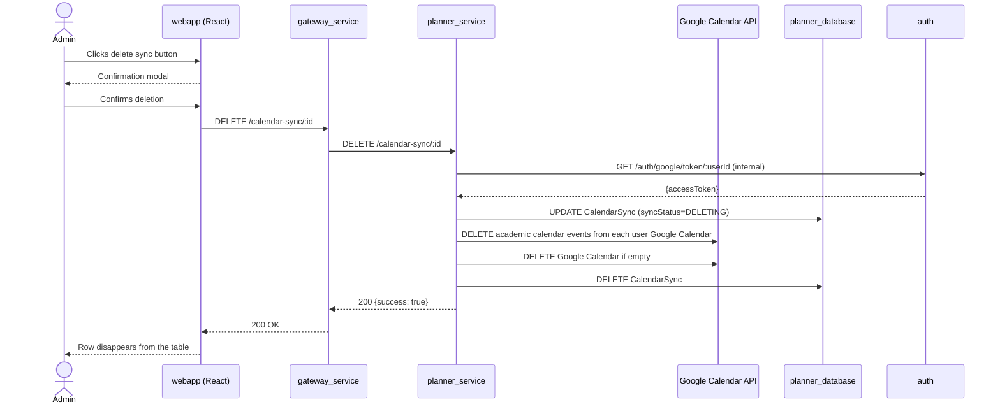

**Figure 5.9b — Manual synchronisation with Google Calendar**

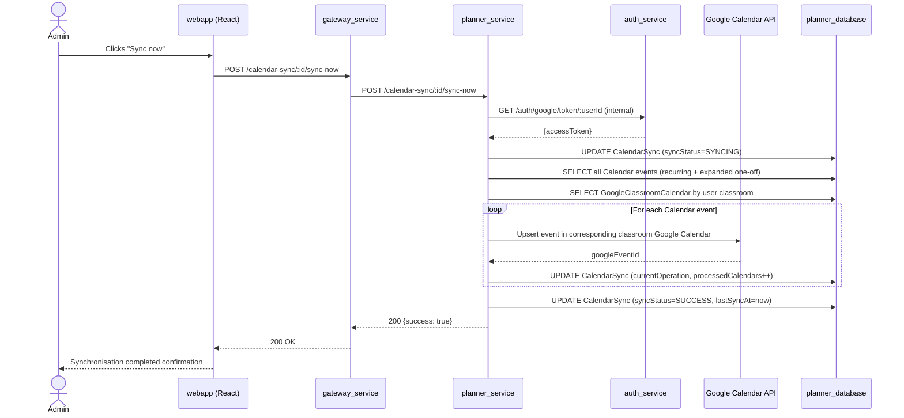

#### Google Calendar API quota control

The Google Calendar API imposes a limit of 600 requests per minute at the Google Cloud project level (shared among all system users). The service implements quota control that caps the effective sending rate at 400 requests per minute, leaving a safety headroom of 200 requests per minute — one third of the total quota. That margin exists because Google's quota is enforced on a sliding time window whose exact state is not visible to the server: the internal counter may show 350 requests in the current minute while Google's window already counts 420, because recent requests are not reflected instantaneously in the quota ledger. Without headroom, the service could unknowingly approach the real limit and receive quota-exceeded errors that are difficult to recover from mid-synchronisation. The 33% buffer ensures the server stays well within the limit even accounting for that reporting lag. When the counter reaches 400 within the current minute window, all further Google API calls are paused until the window resets, then automatically resumed.

The quota counter is **global to the service** — not per individual user — correctly reflecting how Google applies its limits. Every operation that generates HTTP calls to Google passes through a rate-limiting gate before executing, including event creation and deletion, calendar creation and deletion, and the cleanup performed when deleting an individual sync. This ensures that the quota widget in the interface reflects the actual accumulated usage across all operations.

When disconnecting the account, the system uses the same token validation mechanism as during synchronisation — automatically refreshing the access token from the stored encrypted refresh token if it is close to expiry or has already expired. This guarantees that calendar cleanup on disconnection works correctly even if the user has not interacted with the system for several hours.

In case of error during synchronisation or deletion — an unrecoverable token, an exceeded quota, or a network failure — the synchronisation record is updated to reflect the failure and the error description is stored alongside it. The administrator can read the cause directly from the interface without consulting server logs.

---

### 5.2.8 Event generation: on-demand expansion and the hours budget

The scheduling service does not store a concrete list of dates for recurring events. What it stores is the *pattern*: the day of the week the class takes place and the type of recurrence it follows. The system remembers that there is a class every Tuesday, not that there is a class on the 14th of October. The actual dates are computed each time the calendar is consulted, from that pattern and the state of the academic calendar — but not all mathematically possible dates are generated. The number of dates that actually appear is governed by a hours budget assigned to each teaching group, whose rules are explained in the next paragraph.

The hours budget is at the heart of the design. The academic plan of studies establishes how many teaching hours each group must receive during the semester — this is not a configurable preference but a fixed academic requirement that the timetable must honour. Each teaching group therefore carries a ceiling on the total hours of class it will receive, and this ceiling is the hard rule that governs how many recurring class dates actually materialise. Not all hours in the budget are equal: any one-off event already on the calendar (an extraordinary class, a replacement session, a previously confirmed appointment) consumes budget first, with no negotiation. Only the hours that remain after those one-off commitments are available for the recurring series to fill. The recurring classes are added to the calendar in chronological order, one by one, until those remaining hours run out; if the last occurrence would exceed the budget by a few minutes, its duration is trimmed to land exactly at the limit. The practical consequence is that changing the budget figure, or adding or cancelling a single one-off event, automatically changes the recurring schedule — with no need to touch the recurring event definition itself.

When a group has two or more recurring events that fall on the same day of the week, they compete for the same teaching days. Without a mechanism to regulate that competition, one event could end up assigned to all the early weeks of the semester while the other fills in later — an outcome that would distort the perceived weight of each class over time. To prevent this, the system assigns teaching days using a round-robin rotation among all competing events for the same day of the week: the first available teaching day goes to the first event, the next to the second, and so on in a repeating cycle. This reflects the physical reality of university scheduling: a classroom or laboratory can only accommodate one group at a time. When several groups from the same subject share the same time slot on the same day of the week, the timetable has them rotate on alternating weeks so that no two groups occupy the same space simultaneously. The round-robin algorithm reproduces that rotation automatically.

Knowing which events are active on a given date is also the foundation of conflict detection. Before a new event can be accepted — whether a one-off class, a room booking, or any other scheduled activity — the system must verify that it does not collide with something already on the calendar. For recurring events, this cannot be done with a simple database lookup, because recurring events have no stored dates. Whether a recurring event that runs "every Monday" actually appears on a particular Monday depends on whether that day is a teaching day, whether its recurrence pattern matches the character assigned to that day, whether it still falls within the remaining hours budget, and whether a one-off cancellation has already blocked it. The only way to get a reliable answer is to run the full generation pipeline for the entire calendar and examine the result. Using any other data source — querying the database directly, consulting a cached version of the schedule, or applying a simplified rule — would produce a result that might differ from what the user sees on screen. For the conflict check to be meaningful, it must reflect exactly the same reality as the calendar view. This is exactly what the conflict checker does: it produces the complete expanded schedule through the same generation function used to render the calendar, and then filters it down to the target date and time window.

When the frontend displays the calendar, the backend sends the already-expanded list of occurrences — every event on every date, with groups, classrooms, start times and end times all resolved. The interface is a passive recipient of truth already computed: it displays what it receives and runs no recalculation of its own. Each occurrence of a recurring event carries a composite identifier that combines the recurring event's database identity with the specific date of that occurrence. This is necessary because the database only stores one record per recurring event definition — there is no row for "the Tuesday 14 October occurrence" as distinct from "the Tuesday 21 October occurrence." Without the date component, the frontend would have no way to tell one occurrence of the same recurring event apart from another. The composite identifier solves this: it turns a definition identifier into an instance identifier, giving the frontend a precise handle for each individual class date it needs to reference in operations like cancellation or replacement.

---

### 5.2.9 Calendar creation from text files

The system supports creating a complete calendar structure from a set of plain-text files — classrooms, the academic calendar, subjects and groups, scheduled recurring classes, and one-off exceptions — which makes it possible to import an existing institutional timetable without entering each item manually. This file-based format is adopted because it is the format in which the department already generates and distributes timetable data: TeachingPlanner reads it directly, without requiring any intermediate conversion step, so the import fits naturally into the existing administrative workflow. These five files must be processed in a specific order, because each step builds on data that the previous step established.

The five files and their roles are:

- **Classrooms**: the first file to be processed. It defines the physical spaces available for teaching — their codes and locations. All subsequent files that assign classes to rooms depend on these records existing first.
- **Academic calendar**: defines the semester structure — which days are teaching days and which are not. Each teaching day receives a character marking whether it belongs to an even or odd week of the semester. Even/odd week parity is the natural unit of alternation used in university timetabling — courses described as "class on even weeks" or "lab on odd weeks" are commonplace. Assigning this character automatically during import means the administrator does not have to label each day manually; the system derives it from the week number and applies it consistently. This character is then the link between the calendar and the recurring event system described in section 5.2.6: a recurring event that runs on even weeks will only materialise on days carrying the even-week character, and never on others.
- **Subjects and groups**: creates the academic subjects and their associated teaching groups, along with the ceiling on how many groups of each type a subject may have. This ceiling is used to validate the files that follow.
- **Recurring schedules**: defines the periodic events — which group meets, in which classroom, at which time, and how many hours the group has planned for the semester. This is also where the connection between the academic plan of studies and the system's event model is established: the planned hours figure declared here is the budget that governs how many recurring occurrences are generated for each group, as described in section 5.2.8.
- **Exceptions**: introduces one-off events (extraordinary sessions, room changes, makeup classes) and cancellations of recurring occurrences. This file is processed last because it references events that must already exist.

Before creating any group or recurring class entry from the schedules file, the system checks that every line referencing the same group declares the same planned hours figure. If two lines for the same group carry different values — a common occurrence when timetable files are produced by external tools — the entire group is discarded and none of its events are created. If the system chose one of the conflicting values arbitrarily, the resulting schedule would have a hours ceiling that no entry in the file explicitly declared — the timetable would appear correct but would have been calculated from a number that nobody intended. There would be no way to verify after the fact whether the generated semester was right or not. Discarding the group entirely is the only response that preserves traceability: either the group exists in the system with an unambiguous budget, derived directly from a consistent source file, or it does not exist at all.

Cancellations in the exceptions file present a specific ordering problem. A cancellation is always a reference to a specific event — it says "suppress this occurrence of this recurring class" or "remove this one-off event" — and it can only be matched to its target if that target already exists when the cancellation is processed. This creates a problem when the same file contains both a new one-off event and a cancellation of that same event: if they were processed together in a single pass, the cancellation would be encountered before its target had been created and would be discarded with no warning — the event that was supposed to be suppressed would continue appearing in the calendar as if the cancellation line in the file had never existed. The import avoids this by applying the exceptions file in two passes when the import is set to replace existing data: it first creates all new one-off events, and only then processes the cancellations against the now-complete event set. This sequencing guarantees that every cancellation finds its target, regardless of the order in which entries appear in the file.

---

## 5.3 Testing Design

### 5.3.1 General strategy

The verification of TeachingPlanner is organised around three levels that complement each other: static code analysis, integration tests against a real database, and end-to-end tests that exercise the application through the browser. Table 5.7 summarises each level.

**Table 5.7 — Testing levels**

| Level | Type | Scope | Tool |
|---|---|---|---|
| 0 | Static code analysis | All services (backend + frontend) | SonarQube |
| 1 | Integration tests | Backend — business logic with a real database | Jest 30 + Testcontainers (MariaDB 11) |
| 2 | End-to-end tests (E2E) | Complete user flows through the web interface | Playwright 1.58 (Chromium) |

The strategy deliberately excludes unit tests that replace the database with mocks. The reason is straightforward: the most critical behaviour in the system — uniqueness constraints, deletion cascades, referential integrity — only manifests when running against a real relational database. A mock cannot reproduce these guarantees. A test suite built on mocks would pass for code that breaks in production. Running tests against a real database instance in an ephemeral container catches exactly the class of problems that matter here. This is a deliberate design decision, not a gap in coverage.

---

### 5.3.2 Level 0 — Static code analysis (SonarQube)

Static analysis scans the full TypeScript codebase of all four backend services and the frontend, looking for potential bugs, code smells, code duplication, and cyclomatic complexity violations. Test coverage reports produced by the integration test runner are also fed into the analysis. The scan is triggered manually after integration tests have run, and branch analysis compares the current branch against the main branch.

Not everything is included in the scope. The UI component scaffolds provided by the Radix UI library are excluded — they are third-party code that the project does not maintain, so any issues they contain would not be actionable. Project-owned components in the same directory — including the generic data table, the form drawer, the required-label wrapper, and a small number of custom input controls — are analysed, since these contain conditional logic where a defect would have real consequences. Build output directories and all test files are excluded as well.

Before merging to the main branch, the following thresholds must be met: no new issues introduced, code duplication below 30%, test coverage above 70%, and cyclomatic complexity below 15 per function.

---

### 5.3.3 Level 1 — Integration tests (backend)

The integration tests focus on the scheduling service, which is where the domain logic lives: write operations that touch multiple related entities, and the database constraints that enforce business rules. Each test suite runs against an ephemeral database container started fresh before the suite and destroyed when it finishes, giving every suite a fully isolated environment. The schema is synchronised automatically with the application model at startup, so there is no need to maintain a separate test migration set.

Five areas of behaviour are covered:

- **Cascade deletion**: when a high-level entity — a degree programme, a calendar, a subject, or a classroom — is deleted, all entities that depend on it must be removed atomically. Entities that are not part of the deleted subtree must remain untouched.
- **Conditional deletion**: classrooms that still have scheduled events cannot be deleted unless an explicit override is provided. The tests verify that the system rejects the operation without the override and accepts it when the override is given or when the classroom has no events.
- **Uniqueness constraints**: fields that must be unique — classroom code, subject acronym, degree name, user email — must be enforced at the database level, not only in application code.
- **Field persistence**: entities such as groups, recurring events, and calendar days must store their domain-specific attributes — planned hours, recurrence character, day character — correctly after creation.
- **Authentication invariants**: passwords must be stored in hashed form; a valid login must produce an authentication token; an incorrect password must be rejected; duplicate email registration must fail.

The 27 test cases that implement these verifications are listed in **§6.2.1 of Chapter 6**. Coverage reports are generated in a standard format and fed into the static analysis tool to produce the overall coverage metrics.

Two areas are intentionally left out of this level: HTTP routing and response codes, which are covered by the end-to-end tests; and Google Calendar synchronisation, which requires live external credentials that are not available in the test environment.

---

### 5.3.4 Level 2 — End-to-end tests (frontend)

The end-to-end tests drive the application through the browser, from a user action on the interface through the full service stack to the database and back, using a browser automation framework targeting Chromium. The frontend development server starts automatically before the suite runs, as configured in the test runner settings.

Data isolation across tests is handled by a reset endpoint that wipes all planning domain data — classrooms, degrees, courses, calendars, subjects, groups, and events — before each suite starts. Every run therefore starts from a known empty state, regardless of what previous tests left behind. This endpoint is only active in development and test environments and does not exist in the production build. Making it available in the development environment is a deliberate trade-off: it lets developers run the full suite against locally started services without any environment reconfiguration. The risk of accidentally resetting local data is low, since development databases contain only synthetic data that can be rebuilt from seed scripts.

Table 5.8 shows the coverage overview across all seven modules.

**Table 5.8 — E2E test coverage**

| Module | Aspects verified | No. tests |
|---|---|---|
| Authentication | Form rendering; empty field validation; error on incorrect credentials; successful login and redirect; authenticated navigation; logout | 6 |
| Classrooms | Listing; creation with unique code; error on duplicate code; editing (code read-only after creation); deletion without events; forced deletion with events; cancellation; filter by code | 8 |
| Academic years | Listing; creation; error on duplicate year; state editing; deletion; cancellation; filtering; required field validation; default state "Planned" | 9 |
| Degree programmes | Listing; creation; error on duplicate acronym; editing; deletion; cancellation; filter by name; required field validation; automatic acronym uppercase conversion | 9 |
| Subjects | Listing; creation; error on duplicate acronym; editing; deletion; cancellation; field validation; uppercase name; year options (0–4); bulk multi-delete | 10 |
| Calendars | Listing; creation with dates and semester; end-date-before-start validation; editing; deletion with cascade warning; cancellation; filter by semester; required field validation | 8 |
| Groups | Listing; creation with planned hours; validation error for zero/negative hours; editing; deletion; cancellation; required field validation | 7 |
| **Total** | | **57** |

The calendar and group suites are planned; the five remaining suites are currently implemented (42 tests). Tests run sequentially in CI to avoid race conditions on the shared database. The individual test cases are documented in **§6.2.2 of Chapter 6**, and the CI pipeline steps, estimated timings, and generated artefacts are described in **§6.2.3**.

Several areas fall outside the scope of the E2E tests: user account administration flows (creation, email activation, password reset) because they require a live mail server; complete calendar and event management from the interface; Google Calendar synchronisation; and performance or load testing.

---

### 5.3.5 Execution environments

The test suite can run in three different environments, summarised in Table 5.9. All three use the same test code; what differs is how services are started and how the pipeline is triggered.

**Table 5.9 — Test execution environments**

| Environment | Description | Activation |
|---|---|---|
| **Local development** | All services started manually or via the development Docker Compose profile; the test database is cleaned before each E2E run | Manual |
| **Continuous integration (CI)** | GitHub Actions: the database runs as a Docker service; backend services are compiled and started in the background; a test user is seeded; E2E tests run sequentially | Manual from the GitHub Actions UI |
| **Quality analysis (SonarQube)** | Local SonarQube instance; the scan runs after the integration tests have generated coverage reports | Manual, after integration tests |

The scripts, test case results, and CI pipeline details are described in **Chapter 6**.

---

## References

[1] S. Newman, *Building Microservices: Designing Fine-Grained Systems*, 2nd ed. O'Reilly Media, 2021.
