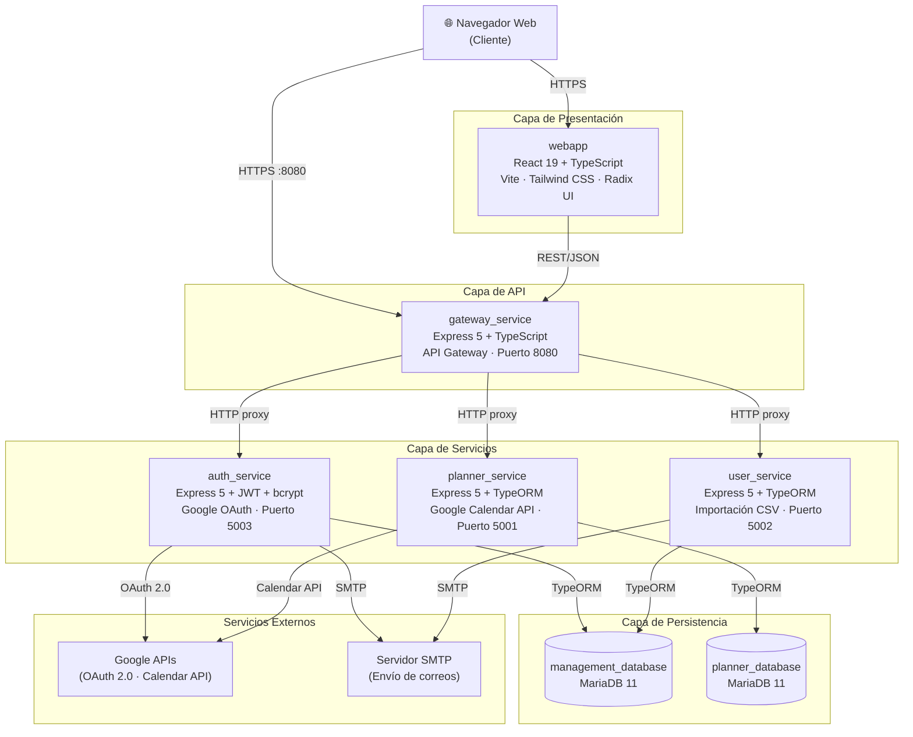
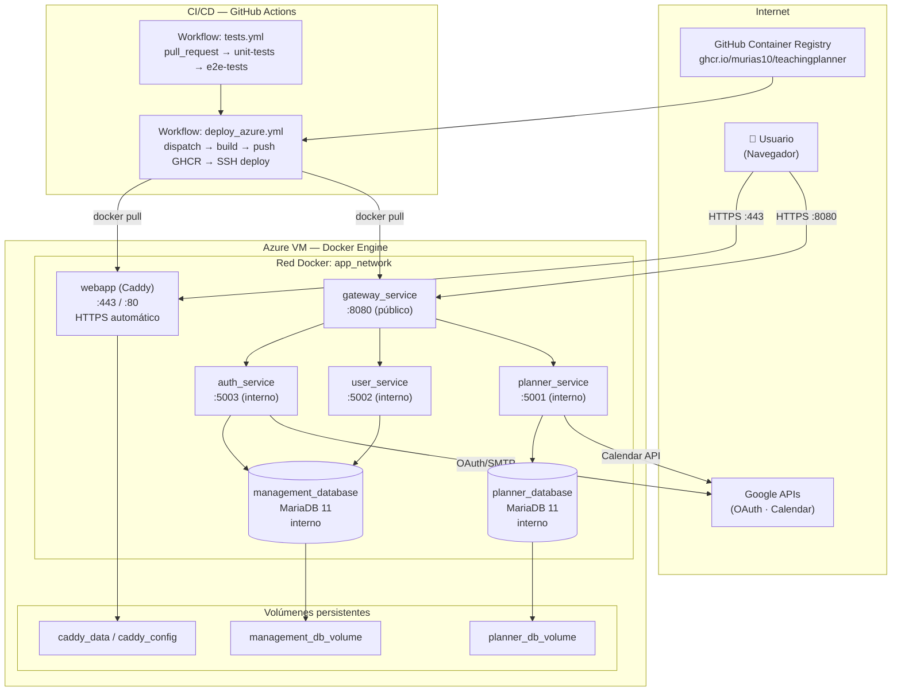
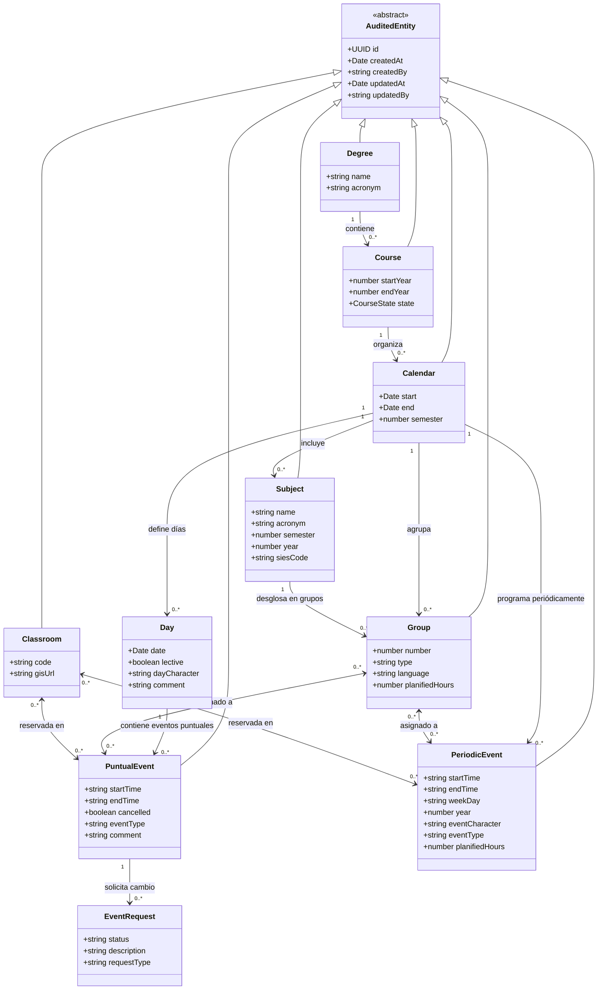
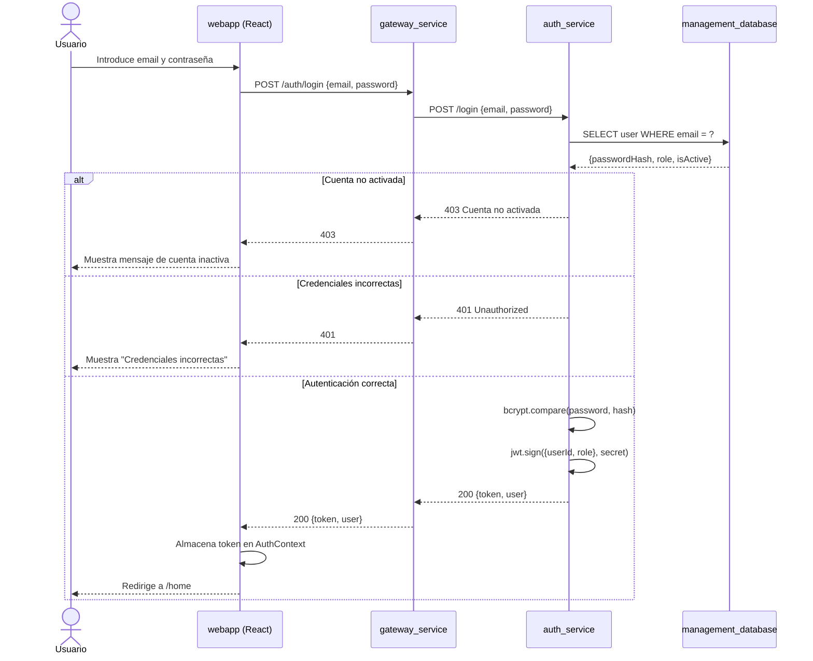
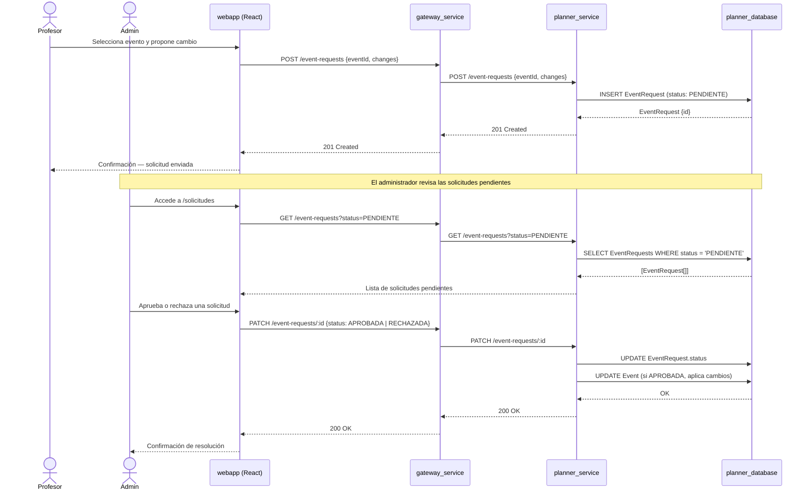

# Capítulo 5 — DISEÑO

---

## 5.1 Diseño de la Arquitectura

### 5.1.1 Introducción y justificación arquitectónica

TeachingPlanner se ha diseñado siguiendo una **arquitectura de microservicios** con patrón **API Gateway**. Esta decisión arquitectónica responde a varios criterios derivados de los requisitos del sistema (véase el documento SRS, §2):

- **Separación de dominios**: la lógica de autenticación de usuarios es independiente de la lógica de planificación académica, por lo que conviene aislarlas en servicios con ciclos de vida y bases de datos propias.
- **Escalabilidad independiente**: el servicio de planificación (`planner_service`) es el más exigente computacionalmente; con esta arquitectura puede escalar de forma autónoma.
- **Despliegue continuo**: cada microservicio se conteneriza y publica por separado, lo que reduce el riesgo de regresión al desplegar cambios parciales.

El sistema se divide en siete componentes desplegables: una aplicación frontend (`webapp`), un API Gateway (`gateway_service`), tres servicios backend (`auth_service`, `user_service`, `planner_service`) y dos bases de datos relacionales (`management_database`, `planner_database`).

---

### 5.1.2 Diagrama de bloques — Vista de componentes

El siguiente diagrama muestra los componentes del sistema y sus relaciones de comunicación. El navegador del cliente se comunica exclusivamente con el frontend y con el API Gateway, que actúa como único punto de entrada para el backend.

**Descripción de los componentes:**

| Componente | Responsabilidad principal | Tecnología clave |
|---|---|---|
| `webapp` | Interfaz de usuario SPA; visualización de calendarios, titulaciones, aulas y solicitudes | React 19, TypeScript, Vite, Tailwind CSS, Radix UI, React Query |
| `gateway_service` | Punto de entrada único; enruta y reenvía peticiones HTTP a los servicios internos; gestiona CORS y carga de ficheros | Express 5, TypeScript, Axios, Multer |
| `auth_service` | Autenticación mediante JWT; registro y activación de cuentas; integración con Google OAuth; reseteo de contraseñas | Express 5, TypeORM, bcrypt, jsonwebtoken, Nodemailer |
| `user_service` | Gestión CRUD de usuarios; control de roles (ROLE_ADMIN, ROLE_PROFESSOR); importación masiva desde CSV | Express 5, TypeORM, Zod |
| `planner_service` | Núcleo de negocio: gestión de calendarios, titulaciones, cursos, asignaturas, grupos, aulas, eventos y solicitudes de cambio; sincronización con Google Calendar; importación/exportación Excel; auditoría | Express 5, TypeORM, xlsx, Zod, node-cron |
| `management_database` | Almacén relacional para usuarios y credenciales; compartido entre `auth_service` y `user_service` | MariaDB 11 |
| `planner_database` | Almacén relacional para toda la información académica; uso exclusivo de `planner_service` | MariaDB 11 |

---

### 5.1.3 Diagrama de despliegue

El sistema se despliega mediante contenedores Docker orquestados con Docker Compose. Se mantienen dos perfiles de despliegue:

- **Desarrollo local** (`docker-compose.dev.yml`): compilación desde código fuente, puertos expuestos en el host, volúmenes de hot-reload.
- **Producción en Azure VM** (`docker-compose.azure.yml`): imágenes preconstruidas publicadas en GitHub Container Registry (`ghcr.io/murias10/teachingplanner`), exposición pública únicamente del gateway y del frontend, red interna para el resto de servicios.

**Aspectos relevantes del despliegue en producción:**

- Las bases de datos cuentan con *health checks* (`mysqladmin ping`) antes de que los servicios dependientes arranquen, lo que garantiza que `auth_service`, `user_service` y `planner_service` no inicien su conexión TypeORM sobre una base de datos no disponible.
- Solo `gateway_service` (puerto 8080) y `webapp` (puertos 80/443) son accesibles desde el exterior. Los servicios de backend y las bases de datos se encuentran en la red interna `app_network`.
- El frontend se sirve desde un contenedor **Caddy**, que gestiona automáticamente la obtención y renovación de certificados TLS.

---

### 5.1.4 Tabla de tecnologías por capa

| Capa | Componente | Lenguaje | Framework / Runtime | ORM / BD | Tests |
|---|---|---|---|---|---|
| Frontend | webapp | TypeScript | React 19, Vite 6, Tailwind 4 | — | Playwright 1.58 |
| API Gateway | gateway_service | TypeScript | Express 5, Node.js 20 | — | — |
| Autenticación | auth_service | TypeScript | Express 5, Node.js 20 | TypeORM 0.3 | — |
| Usuarios | user_service | TypeScript | Express 5, Node.js 20 | TypeORM 0.3 | — |
| Planificación | planner_service | TypeScript | Express 5, Node.js 20 | TypeORM 0.3 | Jest 30 + Testcontainers |
| Persistencia | management_database | SQL | MariaDB 11 | — | — |
| Persistencia | planner_database | SQL | MariaDB 11 | — | — |
| Contenedores | — | YAML | Docker · Docker Compose | — | — |
| CI/CD | — | YAML | GitHub Actions | — | — |
| Calidad de código | — | — | SonarQube | — | — |

---

## 5.2 Diseño de Detalle

### 5.2.1 Estructura del código

La estructura interna de cada componente se describe en detalle en el **§6.1 del Capítulo 6**, donde se presenta la vista de cajas blancas de cada servicio (ARC42 Building Block View, Nivel 2). En este apartado se documentan los conceptos y patrones de diseño que dan soporte a esa organización.

---

### 5.2.2 Patrones de diseño

A continuación se documentan los patrones de diseño aplicados en TeachingPlanner, siguiendo el esquema: nombre del patrón, instanciaciones y roles.

---

#### Patrón 1: API Gateway

**Nombre:** API Gateway

**Motivación:** el frontend no debe conocer las URLs ni los puertos internos de cada microservicio. Un componente central centraliza el enrutamiento, aplica CORS de manera uniforme y simplifica la configuración del cliente.

**Instanciación: Enrutamiento de peticiones REST**

| Rol ARC42 | Clase / Fichero | Descripción |
|---|---|---|
| Gateway (Fachada) | `gateway_service/src/app.ts` | Punto de entrada único. Registra todas las rutas y aplica middlewares globales |
| Router de dominio | `gateway_service/src/routes/*.routes.ts` | Cuatro ficheros de rutas: `auth`, `planner`, `user`, `status` |
| Controlador proxy | `gateway_service/src/controllers/*.controller.ts` | Reenvía la petición HTTP al servicio interno correspondiente |
| Utilidad proxy | `gateway_service/src/utils/proxy.ts` | Abstrae la llamada HTTP saliente (Axios) y propaga cabeceras y cuerpo |
| Configuración de servicios | `gateway_service/src/config/services.ts` | Define las URLs base de los servicios internos |

---

#### Patrón 2: Repository (TypeORM)

**Nombre:** Repository

**Motivación:** los controladores no deben acceder directamente a la fuente de datos; TypeORM proporciona una implementación del patrón Repository que desacopla la lógica de negocio del almacenamiento relacional.

**Instanciación: Acceso a datos en planner_service**

| Rol | Clase / Fichero | Descripción |
|---|---|---|
| Entity | `planner_service/src/entities/*.entity.ts` | Definen el esquema de datos mediante decoradores TypeORM (`@Entity`, `@Column`, `@ManyToOne`, etc.) |
| Repository | `dataSource.getRepository(EntityClass)` | Objeto en tiempo de ejecución que expone `find`, `save`, `remove`, `createQueryBuilder`, etc. |
| DataSource | `planner_service/src/config/data-source.ts` | Inicializa la conexión con MariaDB y registra todas las entidades |
| Service (cliente del repo) | `planner_service/src/services/*.service.ts` | Inyecta el repositorio para ejecutar la lógica de negocio |

---

#### Patrón 3: Middleware Chain (Chain of Responsibility)

**Nombre:** Middleware Chain (instanciación del patrón Chain of Responsibility sobre Express)

**Motivación:** Express procesa las peticiones HTTP a través de una cadena de funciones middleware. Esto permite aplicar preocupaciones transversales (autenticación, autorización, validación) de forma composable y reutilizable.

**Instanciación: Protección de rutas en planner_service**

| Rol | Clase / Fichero | Descripción |
|---|---|---|
| Handler 1 — Autenticación | `planner_service/src/middleware/auth.middleware.ts` | Verifica el JWT de la petición; rechaza con 401 si es inválido o ausente |
| Handler 2 — Autorización | `planner_service/src/middleware/require-role.middleware.ts` | Comprueba que el rol del usuario coincide con el rol requerido por la ruta; rechaza con 403 si no |
| Handler 3 — Controlador | `planner_service/src/controllers/*.controller.ts` | Procesa la petición y genera la respuesta si los handlers anteriores no han cortado la cadena |

---

#### Patrón 4: Context (React)

**Nombre:** Context (patrón de propagación de estado global en React)

**Motivación:** la información de sesión del usuario autenticado (token JWT, nombre, rol) debe estar disponible en cualquier componente de la aplicación sin necesidad de prop-drilling.

**Instanciación: Estado de autenticación**

| Rol | Clase / Fichero | Descripción |
|---|---|---|
| Contexto (definición) | `webapp/src/contexts/AuthContext.tsx` | Define el tipo del contexto y su valor inicial |
| Provider | `AuthProvider` (en `AuthContext.tsx`) | Envuelve toda la aplicación; gestiona el estado `user`, `token` y las funciones `login`/`logout` |
| Consumer | Cualquier page o componente que llame a `useAuth()` | Accede al contexto a través del hook personalizado |
| Hook de acceso | `useAuth()` (exportado desde `AuthContext.tsx`) | Encapsula `useContext(AuthContext)` para un acceso tipado y seguro |

---

#### Patrón 5: Custom Hook con React Query

**Nombre:** Custom Hook (composición de lógica de datos con React Query)

**Motivación:** la lógica de fetching, caché, revalidación y estado de carga es repetitiva; encapsularla en hooks personalizados por dominio evita la duplicación y desacopla los componentes de la capa de datos.

**Instanciación: Hook de gestión de Titulaciones**

| Rol | Clase / Fichero | Descripción |
|---|---|---|
| Hook personalizado | `webapp/src/hooks/degree/useDegrees.ts` (ejemplo) | Llama a `useQuery` / `useMutation` de React Query y expone `data`, `isLoading`, `error`, funciones de mutación |
| QueryClient | Configurado en `webapp/src/main.tsx` | Gestiona la caché global de consultas, configuración de reintento y TTL |
| Componente consumidor | `webapp/src/pages/DegreePage.tsx` | Invoca el hook y renderiza en función de los estados expuestos |

Este patrón se replica para cada dominio de la aplicación: titulaciones, cursos, calendarios, aulas, asignaturas, grupos, usuarios y solicitudes.

---

### 5.2.3 Modelo de dominio — Entidades principales

El siguiente diagrama muestra las entidades del dominio gestionadas por `planner_service` y sus relaciones. Todas las entidades de negocio extienden `AuditedEntity`, que proporciona los campos de trazabilidad (`createdAt`, `createdBy`, `updatedAt`, `updatedBy`).

**Nota:** `CourseState` es un enumerado con los valores `PLANIFICADO`, `ACTIVO` y `FINALIZADO`.

---

### 5.2.4 Diagrama de secuencia — Flujo de autenticación

El siguiente diagrama representa el flujo de autenticación mediante JWT cuando un usuario introduce sus credenciales en el formulario de login.

---

### 5.2.5 Diagrama de secuencia — Flujo de solicitud de cambio

Las solicitudes de cambio permiten al profesorado (ROLE_PROFESSOR) proponer modificaciones sobre eventos ya planificados. El administrador (ROLE_ADMIN) revisa y aprueba o rechaza cada solicitud.

---

## 5.3 Diseño de Pruebas

### 5.3.1 Estrategia general

La estrategia de pruebas de TeachingPlanner se articula en dos niveles complementarios que cubren distintas capas del sistema:

| Nivel | Tipo | Alcance | Herramienta |
|---|---|---|---|
| 1 | Tests de integración | Backend — lógica de negocio con base de datos real | Jest 30 + Testcontainers (MariaDB 11.2) |
| 2 | Tests end-to-end (E2E) | Flujos completos de usuario a través de la interfaz web | Playwright 1.58 (Chromium) |

No se definen tests unitarios aislados (con mocks) para este proyecto, ya que la lógica de negocio más crítica implica operaciones de base de datos cuyo comportamiento real (relaciones, cascadas, restricciones de unicidad) es precisamente lo que se desea verificar. En su lugar, los tests de integración con Testcontainers ejecutan sobre una base de datos MariaDB real levantada en un contenedor efímero.

---

### 5.3.2 Nivel 1 — Tests de integración (backend)

**Objeto de prueba:** la capa de datos y servicios del `planner_service`, con especial atención a las operaciones de escritura que afectan a múltiples entidades relacionadas.

**Herramientas:**
- **Jest 30** con soporte TypeScript mediante `ts-jest`.
- **Testcontainers** (`@testcontainers/mariadb 11.2`): levanta un contenedor MariaDB efímero por cada suite de pruebas; el contenedor se destruye automáticamente al finalizar.
- **TypeORM** con `synchronize: true` sobre la base de datos de test `test_planner_db`, lo que garantiza que el esquema es idéntico al de producción.

**Qué se prueba:**

1. **Eliminación en cascada de Calendar**: al eliminar un calendario, todas las entidades dependientes (días, eventos puntuales, eventos periódicos, grupos, asignaturas) deben eliminarse. Las entidades en cascada ascendente (titulación, curso) deben permanecer intactas.

2. **Eliminación de Classroom con flag `force`**:
   - Con `force=true`: se eliminan primero todos los eventos asociados al aula y después el aula misma.
   - Con `force=false`: si el aula tiene eventos asociados, la operación debe rechazarse (lógica equivalente a HTTP 409 Conflict).
   - Sin eventos asociados: eliminación directa sin efectos colaterales.

3. **Unicidad del código de aula**: la restricción `UNIQUE` sobre el campo `code` de `Classroom` debe ser respetada por la base de datos.

**Qué queda fuera del alcance en este nivel:**
- Lógica de autenticación y gestión de usuarios (`auth_service`, `user_service`).
- Controladores HTTP (rutas, cabeceras, códigos de estado).
- Sincronización con Google Calendar (depende de API externa).

---

### 5.3.3 Nivel 2 — Tests end-to-end (frontend)

**Objeto de prueba:** los flujos de usuario completos que implican interacción con la interfaz web, desde el navegador hasta la base de datos, pasando por todos los microservicios.

**Herramientas:**
- **Playwright 1.58** configurado para ejecutar en **Chromium** (Desktop Chrome).
- El servidor de desarrollo de Vite (`npm run dev`, puerto 5173) arranca automáticamente antes de la suite.
- Limpieza de base de datos previa mediante el endpoint `POST /test/reset-database` (solo activo cuando `NODE_ENV=development` o `NODE_ENV=test`), que elimina en cascada 9 tablas del dominio de planificación.

**Qué se prueba:**

| Fichero | Módulo | Aspectos verificados |
|---|---|---|
| `auth.spec.ts` | Autenticación | Renderizado del formulario; validación de campos vacíos; error por credenciales incorrectas; login exitoso y redirección; navegación autenticada; logout |
| `classroom.spec.ts` | Aulas | Listado; creación con código único; error por código duplicado; edición (campo `code` de solo lectura); eliminación sin eventos; eliminación forzada con eventos; cancelación; filtrado por código |
| `course.spec.ts` | Cursos | Listado; creación; error por año duplicado; edición de estado; eliminación; cancelación; filtrado; validación de campos obligatorios; estado por defecto `PLANIFICADO` |
| `degree.spec.ts` | Titulaciones | Listado; creación; error por acrónimo duplicado; edición; eliminación; cancelación; filtrado por nombre; validación de campos obligatorios; conversión automática a mayúsculas del acrónimo |
| `subject.spec.ts` | Asignaturas | Listado; creación; error por acrónimo duplicado; edición; eliminación; cancelación; validación de campos; mayúsculas en nombre; opciones de año (0–4); borrado múltiple en masa |

**Total de casos de prueba E2E: 42** (6 + 8 + 9 + 9 + 10).

**Qué queda fuera del alcance en este nivel:**
- Flujos de administración de usuarios (creación de cuentas, activación, reseteo de contraseña).
- Gestión completa de calendarios y eventos desde la interfaz.
- Sincronización con Google Calendar (requiere cuenta real de Google).
- Pruebas de rendimiento o carga.

---

### 5.3.4 Entornos de ejecución

| Entorno | Descripción | Activación |
|---|---|---|
| **Desarrollo local** | Todos los servicios levantados con `docker-compose.dev.yml` o manualmente; BD limpiada antes de cada ejecución E2E | Manual (`npm run test:e2e:clean`) |
| **Integración continua (CI)** | GitHub Actions con MariaDB como servicio Docker; servicios backend compilados y arrancados en background; seed de usuario de prueba | Automática en cada `pull_request` |

La implementación detallada de los scripts, casos de prueba y resultados se describe en el **§6.2 del Capítulo 6**.
