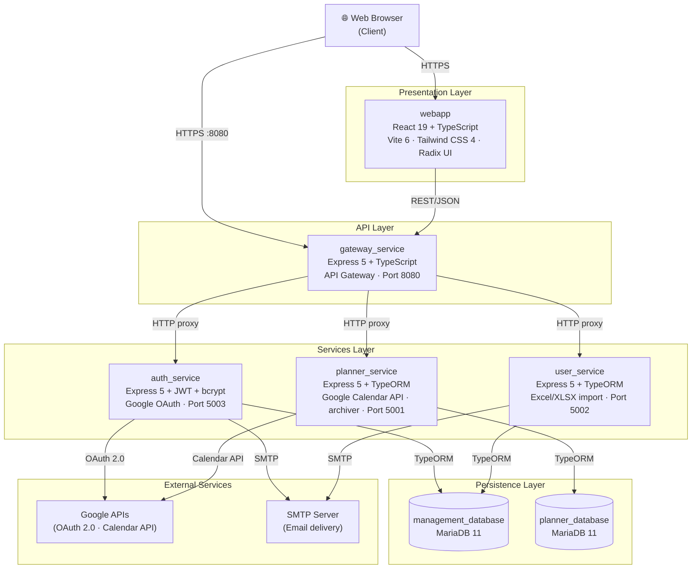
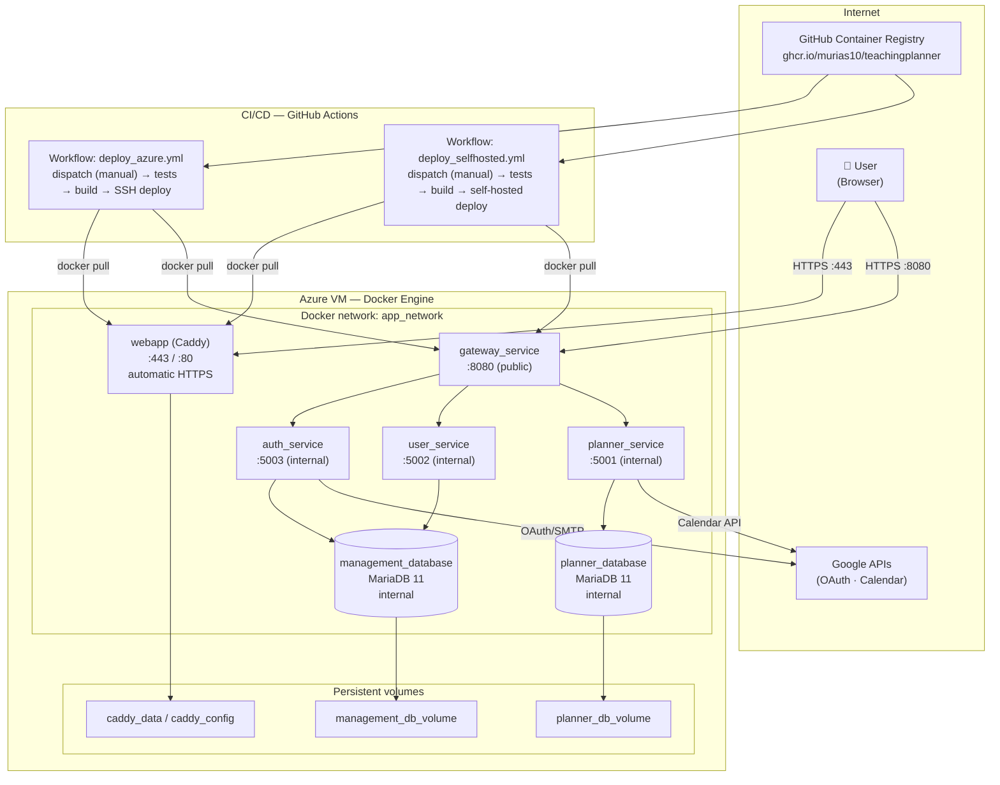
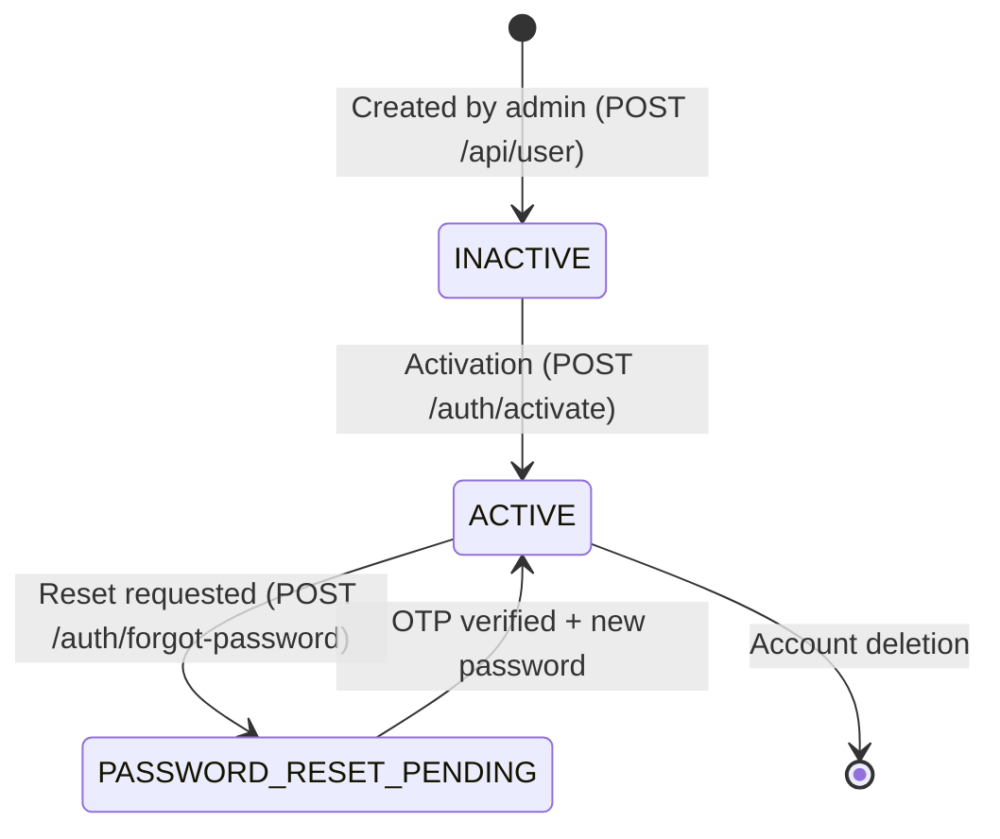
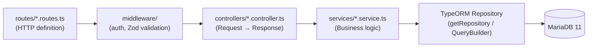
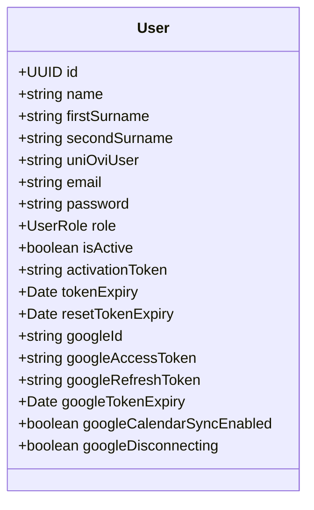
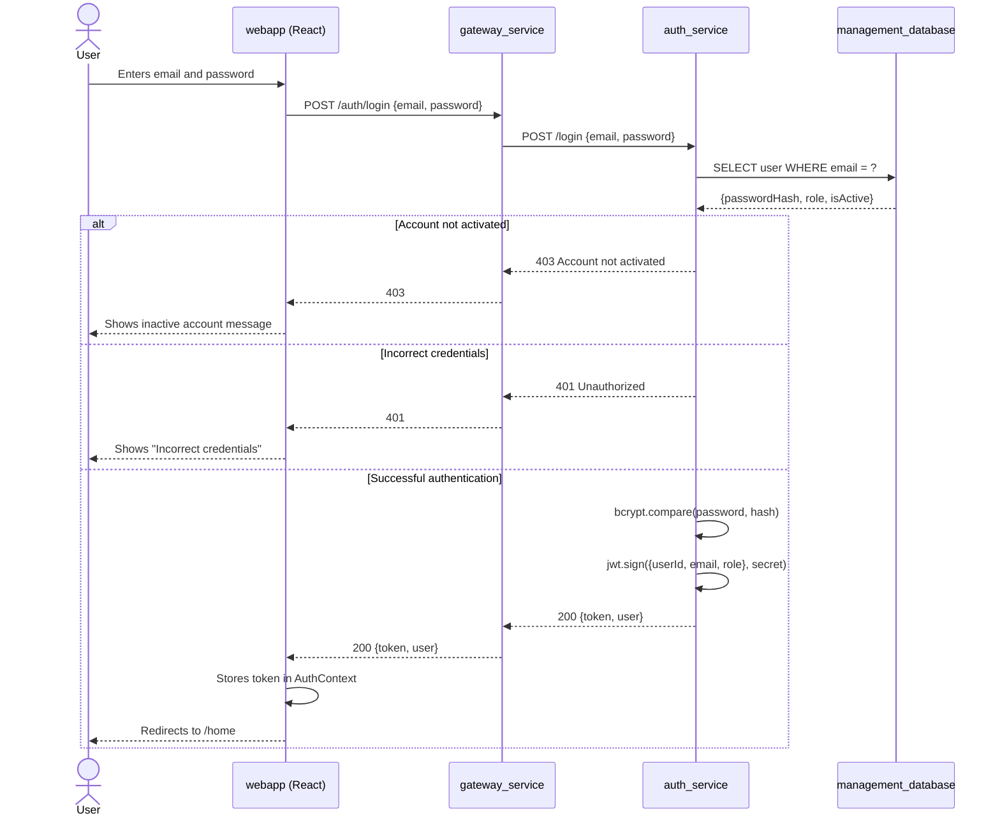
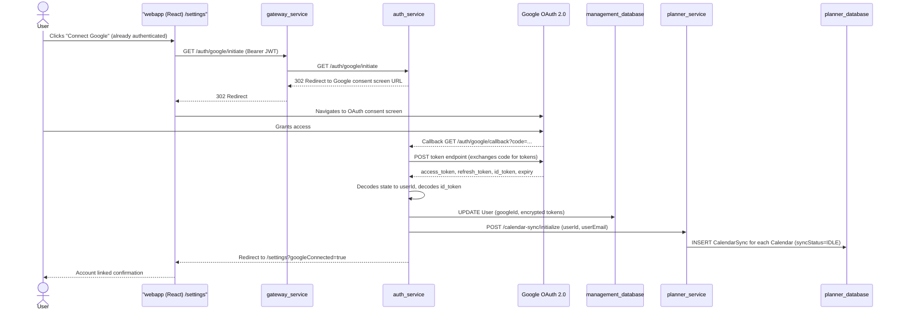
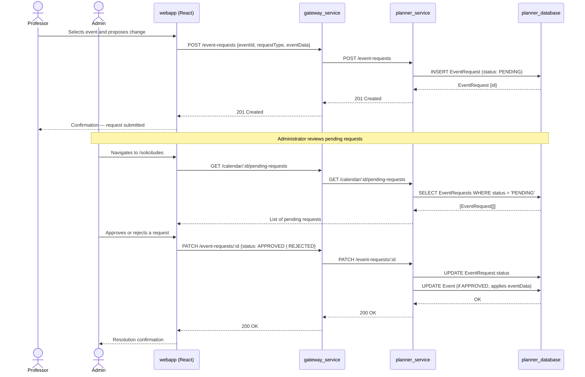
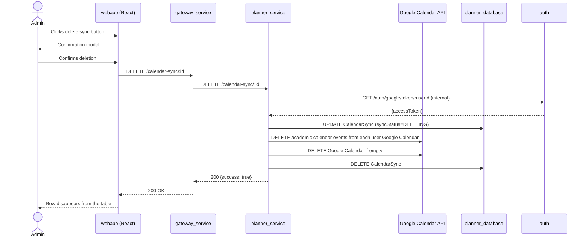
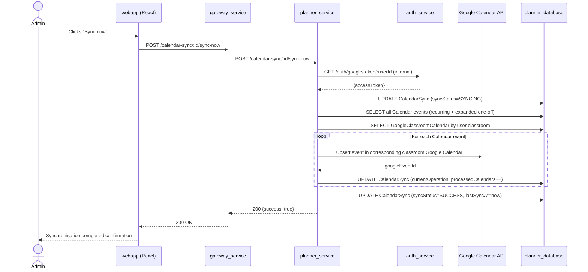

# Chapter 5 — DESIGN

---

## 5.1 Architecture Design

### 5.1.1 Introduction and architectural rationale

TeachingPlanner has been designed following a **microservices architecture with an API Gateway pattern**, a style formally defined by Newman [1] as the decomposition of a system into small, independently deployable services with well-defined domain boundaries and communication through lightweight interfaces (HTTP/REST). This choice does not stem solely from technological trends, but from concrete requirements identified during the analysis phase: the need to evolve authentication and scheduling independently, to scale the most computationally intensive service in isolation, and to deploy changes with minimal operational risk. Three driving factors justify this decision:

- **Domain separation**: authentication and user management logic is structurally independent from academic scheduling logic. Isolating them into services with their own databases eliminates coupling between change cycles that evolve at different rates; modifying the password-reset flow, for instance, does not risk regressions in calendar generation.
- **Independent scalability**: the scheduling service (`planner_service`) is the most computationally demanding component — it generates complete calendars with recurring event expansion, handles export and Google Calendar synchronisation — and can scale autonomously without replicating the authentication services, which have comparatively low and uniform load.
- **Continuous, low-risk deployment**: each microservice is containerised and published as an independent image; deploying a change to `auth_service` does not require restarting `planner_service`, which reduces the operational risk window and shortens the mean time to recovery in case of failure.

To justify the choice of specific technologies within this architectural style, Table 5.1 summarises the main decisions made and the alternatives that were evaluated before reaching them.

**Table 5.1 — Architectural decisions (simplified ADR)**

| Decision | Alternative considered | Reason for the choice |
|---|---|---|
| Microservices vs. monolith | Modular monolith (NestJS) | Fault isolation and independent scaling of the scheduling service; the monolith would have coupled the deployment cycles of authentication and scheduling |
| Relational MariaDB vs. NoSQL | MongoDB | The academic data model (calendars, groups, subjects, events) has strong relationships with referential integrity and uniqueness constraints that naturally fit a relational schema |
| Caddy vs. Nginx for TLS | Nginx with manual certbot | Caddy supports both automatic ACME-based TLS and manually provisioned certificates; in this deployment, the university-issued GEANT TLS certificate is supplied via GitHub Secrets and mounted at container startup, removing the need for in-container certificate management tooling |
| React SPA (Vite) vs. Next.js SSR | Next.js with server-side rendering | All application routes require prior authentication; SSR provides no value for a fully private SPA, and Vite's build pipeline offers a significantly faster development feedback cycle with no server infrastructure overhead |

The resulting component decomposition is described in detail in the following section.

---

### 5.1.2 Block diagram — Component view

The system is divided into **seven deployable components**: a frontend application (`webapp`), an API Gateway (`gateway_service`), three backend services (`auth_service`, `user_service`, `planner_service`) and two relational databases (`management_database`, `planner_database`). Figure 5.1 shows the components and their communication relationships.

**Figure 5.1 — System block diagram**



**Component descriptions:**

| Component | Main responsibility | Key technology |
|---|---|---|
| `webapp` | SPA user interface; display of calendars, degree programmes, classrooms and change requests | React 19, TypeScript, Vite 6, Tailwind CSS 4, Radix UI, TanStack Query |
| `gateway_service` | Single entry point for all frontend requests; routes and forwards HTTP requests to internal services; manages CORS and multipart file uploads | Express 5, TypeScript, Axios, Multer |
| `auth_service` | JWT authentication; account registration and activation; Google OAuth 2.0 integration; password reset with OTP via email | Express 5, TypeORM, bcrypt, jsonwebtoken, Nodemailer |
| `user_service` | User CRUD management; role control (`ADMIN`, `PROFESSOR`); bulk import from Excel (XLSX) files | Express 5, TypeORM, xlsx |
| `planner_service` | Business core of the system: manages calendars, degree programmes, academic years, subjects, groups, classrooms, recurring events and one-off events; processes change requests from teaching staff; synchronises academic calendars with Google Calendar; handles Excel import/export and generates ZIP archives; audits all write operations | Express 5, TypeORM, xlsx, archiver |
| `management_database` | Relational store for users and credentials; shared between `auth_service` and `user_service` | MariaDB 11 |
| `planner_database` | Relational store for all academic information; exclusive use of `planner_service` | MariaDB 11 |

**Public exposure perimeter:** a key security property of this decomposition is that only `gateway_service` (port 8080) and `webapp` (ports 80/443) are accessible from the outside. The three backend services (`auth_service`, `user_service`, `planner_service`) and both databases reside in the internal Docker network `app_network` and have no port exposed to the host or the Internet. This design decision limits the attack surface: any request to the backend must pass through the gateway, where the CORS policy is enforced and multipart files are handled.

---

### 5.1.3 Deployment diagram

The system is deployed using Docker containers orchestrated with Docker Compose. Three deployment profiles are maintained:

- **Local development** (`docker-compose.dev.yml`): compilation from source, ports exposed on the host, hot-reload volumes.
- **Production on Azure VM** (`docker-compose.azure.yml`): pre-built images published in GitHub Container Registry (`ghcr.io/murias10/teachingplanner`), public exposure limited to the gateway and the frontend, internal network for the rest of the services.
- **Quality analysis** (`docker-compose.sonarqube.yml`): local SonarQube instance for static code analysis.

**Figure 5.2 — Deployment diagram**



**CI/CD pipeline (four optional jobs):**

The deployment process is designed for deliberate, controlled releases rather than fully automated continuous deployment. It is structured in four configurable jobs defined in two GitHub Actions workflow files: `deploy_azure.yml` (public Azure VM, SSH access) and `deploy_selfhosted.yml` (university private network VM, self-hosted runner). Both workflows share the same structure, and each job can be independently enabled or disabled at run time:

1. **`unit-tests`** (optional): runs the integration tests for `planner_service` with Jest 30 and Testcontainers on Node.js 20.
2. **`e2e-tests`** (optional, depends on `unit-tests`): starts all backend services in the background, launches MariaDB as a Docker service, seeds a test administrator user and runs the Playwright tests on Chromium.
3. **`build-and-push-images`** (optional): builds the Docker images for all services and publishes them to `ghcr.io/murias10/teachingplanner/<service>`.
4. **`deploy`** (optional): in `deploy_azure.yml`, connects to the Azure VM via SSH and runs `docker compose pull` + `docker compose up -d`; in `deploy_selfhosted.yml`, the job runs directly on the runner installed on the university VM and performs the same operations without an incoming SSH connection.

Both workflows are triggered exclusively via `workflow_dispatch` (manual activation) from the *Actions* tab of the GitHub repository. When starting a run, the responsible person selects via checkboxes which jobs to execute, allowing combinations such as running only the tests, only the build, or the full pipeline. No `push` to `main` triggers an automatic deployment, ensuring that the decision to go to production is always conscious and deliberate. The detailed operational steps are described in the [Installation Manual](./manual_instalacion.md).

**Key aspects of the production deployment:**

- Databases include *health checks* (`mysqladmin ping -u root -p$MYSQL_ROOT_PASSWORD`) before dependent services start, ensuring that `auth_service`, `user_service` and `planner_service` do not initiate the TypeORM connection on an unavailable database.
- Only `gateway_service` (port 8080) and `webapp` (ports 80/443) are accessible from the outside. Backend services and databases reside in the internal `app_network` network.
- The frontend is served from a **Caddy** container configured to serve the application over HTTPS using a certificate issued by the university's IT department (GEANT TLS, valid for `*.ingenieriainformatica.uniovi.es`). The certificate and private key are stored as encrypted GitHub Actions secrets and written to the server automatically on each workflow run.
- TypeORM operates with `synchronize: true` in both production and integration tests, meaning the database schema is automatically synchronised with the TypeORM entities on each service start. This configuration is appropriate for the scope of this project: the system is deployed to a single-tenant university environment with no concurrent schema-migration constraints, and the development cadence favours rapid iteration over a formal migration pipeline. In a multi-tenant or high-availability production system this option would be replaced by a migration tool such as TypeORM Migrations or Flyway; the `AuditedEntity` base class and the well-defined entity structure already provide the foundation to adopt that approach without further redesign. In integration tests with Testcontainers this configuration is equally valid, since the ephemeral database always starts from scratch.

---

### 5.1.4 Technology stack by layer

**Table 5.2 — Technology stack by layer**

| Layer | Component | Language | Framework / Runtime | ORM / DB | Tests | External integration |
|---|---|---|---|---|---|---|
| Frontend | webapp | TypeScript | React 19, Vite 6, Tailwind 4 | — | Playwright 1.58 | — |
| API Gateway | gateway_service | TypeScript | Express 5, Node.js 23¹ | — | — | — |
| Authentication | auth_service | TypeScript | Express 5, Node.js 23¹ | TypeORM 0.3 | — | Google OAuth 2.0, SMTP |
| Users | user_service | TypeScript | Express 5, Node.js 23¹ | TypeORM 0.3 | — | SMTP |
| Scheduling | planner_service | TypeScript | Express 5, Node.js 23¹, archiver | TypeORM 0.3 | Jest 30 + Testcontainers | Google Calendar API |
| Persistence | management_database | SQL | MariaDB 11 | — | — | — |
| Persistence | planner_database | SQL | MariaDB 11 | — | — | — |
| Containers | — | YAML | Docker · Docker Compose | — | — | — |
| CI/CD | — | YAML | GitHub Actions | — | — | GitHub Container Registry |
| Code quality | — | — | SonarQube | — | — | — |

> ¹ Node.js 23 is used in production Docker images (`node:23-alpine`) as it was the current active release at the time of deployment. The CI environment (GitHub Actions) runs on Node.js 20, the Long-Term Support release pinned in the workflow configuration at the time of project setup. Both versions are fully compatible with the Express 5 and TypeORM 0.3 APIs used by the services; the version gap does not introduce behavioural differences in the tested code paths.

---

### 5.1.5 Security design

The system's security is organised into five complementary layers, each addressing a distinct attack surface:

1. **JWT-based authentication** — stateless identity verification on every API request.
2. **Password hashing (bcrypt)** — irreversible credential storage with per-password salt.
3. **Role-based access control (RBAC)** — fine-grained operation authorisation by user role.
4. **Transport layer security (HTTPS/TLS)** — encrypted communication between client and server.
5. **CORS protection** — browser-enforced origin restriction on API requests.

The following subsections describe the design of each layer in detail.

#### JWT-based authentication (stateless)

The system uses JWT tokens signed with the HS256 algorithm using a symmetric secret configured in the `JWT_SECRET` environment variable. The token payload contains exclusively the `userId`, `email` and `role` fields, with no sensitive information. Tokens are stateless on the server: there is no session table or revocation list; token validity is determined solely by the cryptographic signature.

The absence of a server-side session store or token revocation list is an intentional trade-off appropriate for this system's scope: TeachingPlanner is an internal university tool with a small, known user base, where the risk of a compromised token remaining valid until its natural expiry is acceptable. In a higher-security context (e.g. a financial application), this design would be complemented with a token blacklist or short-lived access tokens paired with refresh-token rotation.

A further design decision is that token verification is performed **in each backend service independently**, not at the gateway. The gateway acts as an opaque proxy and forwards the token without validating it. This allows any service to be deployed and invoked directly — for example, from integration scripts or integration tests — without depending on the gateway as the authentication authority, which increases resilience and testability.

Account activation and password reset follow asynchronous flows via email. When a user registers, the system generates a random `activationToken` that is stored in the `User` entity and sent by email; the account remains inactive (`isActive = false`) until the user visits the activation link. Password reset generates a single-use OTP with an expiry date (`resetTokenExpiry`), also sent by email.

Figure 5.3 shows the user account lifecycle.

**Figure 5.3 — User account lifecycle**



#### Password hashing (bcrypt)

Passwords are never stored in plain text. The `password` field of the `User` entity always stores the result of `bcrypt.hash(plaintext, saltRounds)`, where `saltRounds` is configurable via an environment variable. Credential verification at login is performed with `bcrypt.compare`, which incorporates the salt stored in the hash itself, preventing rainbow table attacks.

#### Role-based access control (RBAC)

The system defines two roles with clearly delimited permissions:

- **`ADMIN`**: full read and write access to all system entities; user management; approval or rejection of change requests proposed by teaching staff.
- **`PROFESSOR`**: read access to calendars and events; ability to create `EventRequest` (change requests on already scheduled events) for review by the administrator.

Authorisation verification is applied via a chain of three Express middlewares that act before the controller on all protected routes:

```
authenticateToken → requireAuth → requireRole('ADMIN' | 'PROFESSOR') → controller
```

- `authenticateToken` (`auth.middleware.ts`): extracts the Bearer token from the `Authorization` header and verifies it with `jwt.verify`. If the token is valid, it attaches the decoded payload to `req.user`. If it is invalid or absent, it does not reject the request but leaves `req.user` as `undefined`.
- `requireAuth`: rejects with `401 Unauthorized` if `req.user` is `undefined`.
- `requireRole(role)`: rejects with `403 Forbidden` if `req.user.role` does not match the required role.

This separation into three handlers allows `authenticateToken` to be reused in routes that need to identify the user but do not require a specific role (for example, retrieving one's own profile).

#### Transport layer security (HTTPS/TLS)

In production, all external traffic to `webapp` goes through Caddy on port 443, with TLS provided by a certificate issued by the university's systems administration team (GEANT TLS, scoped to `*.ingenieriainformatica.uniovi.es`). The certificate and its private key are stored as encrypted repository secrets (`SSL_CERT`, `SSL_KEY`) and written to the server by the deployment workflow on each run, eliminating the need for manual file transfers. HTTP traffic on port 80 is redirected to HTTPS. The gateway is exposed on port 8080 and also receives HTTPS connections (the web client configures the API base URL with `https://`).

Communication between services within the Docker `app_network` uses HTTP without TLS, which is acceptable from a security standpoint because the traffic never leaves the virtual machine and the Docker bridge network is isolated from external traffic.

#### CORS protection

The gateway implements a CORS policy with an allowlist of permitted origins, built dynamically from the `DOMAIN` (production domain) and `SERVER_IP` (server public IP) environment variables. Only the frontend deployed at those origins can read API responses from a browser, preventing unauthorised cross-origin data access.

It is worth noting that this system is **not vulnerable to classical CSRF attacks**: all API requests are authenticated by including the JWT in the `Authorization: Bearer` HTTP header, not in a cookie. Browsers do not automatically attach custom headers to cross-site requests, so a malicious third-party page cannot forge authenticated requests on behalf of a logged-in user. CORS reinforces this by additionally blocking unauthorised origins from reading any response that the browser does receive, providing defence in depth against cross-origin data exfiltration.

---

## 5.2 Detailed Design

### 5.2.1 Code structure

The three backend microservices (`auth_service`, `user_service`, `planner_service`) share an identical **layered architecture** that separates the responsibility of routing, request processing, business logic and data access. This uniformity facilitates navigation between services and reduces the learning curve for new contributors.

**Figure 5.4 — Backend layered architecture (pattern common to all three microservices)**



The flow of an HTTP request through the layers is as follows:

1. **`routes/*.routes.ts`**: registers the HTTP verbs and routes, composes the middleware chain and associates the final controller handler.
2. **`middleware/`**: contains the cross-cutting middlewares. `auth.middleware.ts` verifies the JWT; `require-role.middleware.ts` validates the role; Zod schemas validate the request body before the controller processes it.
3. **`controllers/*.controller.ts`**: receives the Express `Request` object, extracts the necessary parameters, delegates to the corresponding service and builds the HTTP response (status code, headers, JSON body).
4. **`services/*.service.ts`**: contains the pure business logic. Uses TypeORM repositories to read and write data; it is the only place where domain rules, business validations and data transformations are executed.
5. **`TypeORM Repository`**: abstracts database access. Controllers and services never write SQL directly; they use the TypeORM API (`find`, `save`, `remove`, `createQueryBuilder`).

The directory structure of each backend microservice is:

```
<service>/src/
├── config/          # TypeORM DataSource and environment variable loading
├── entities/        # TypeORM entities (@Entity, @Column, @ManyToOne… decorators)
├── middleware/      # authenticateToken, requireRole, schema validation
├── routes/          # HTTP route definitions and middleware composition
├── controllers/     # Express controllers: Request → delegate → Response
├── services/        # Business logic and repository access
├── schemas/         # Zod schemas for API input validation
├── types/           # TypeScript types shared within the service
└── utils/           # Reusable utilities (formatting, helpers)
```

**Frontend (webapp):** the React application follows an organisation by functional responsibility:

```
webapp/src/
├── contexts/        # Global React state: AuthContext, AppContext,
│                    # BreadcrumbContext, FloatingAlertContext
├── hooks/           # Custom hooks organised by domain:
│                    # calendar/, classroom/, course/, degree/,
│                    # subject/, group/, user/, event-request/, google/
├── pages/           # SPA pages (one per React Router route)
├── components/      # Reusable components by domain and base UI components
├── services/        # HTTP call functions to the API (axios)
├── types/           # TypeScript types for the business domain
└── utils/           # Presentation and formatting utilities
```

The separation between `hooks/` (data logic with TanStack Query) and `pages/` (presentation) applies the Single Responsibility Principle to the React component model: each page component is responsible solely for rendering and user interaction, while the corresponding domain hook encapsulates all fetching, caching and error-handling concerns. Page components are therefore unaware of Axios URLs, query keys or retry strategies; they simply invoke the domain hook and react to the `data`, `isLoading` and `error` states it exposes. This decoupling also makes it straightforward to replace the data layer (e.g. switching from REST to a different protocol) without touching any presentation component.

---

### 5.2.2 Design patterns

Table 5.3 summarises the five design patterns applied in TeachingPlanner before their detailed description.

**Table 5.3 — Design patterns summary**

| Pattern | Type | Component(s) | Purpose |
|---|---|---|---|
| API Gateway | Architectural (Structural) | `gateway_service` | Single entry point to the backend; encapsulates the internal URLs of the microservices |
| Repository | Structural | `*_service` (TypeORM) | Decouples business logic from relational storage |
| Middleware Chain (Chain of Responsibility) | Behavioural | `*_service` (Express) | Composable, reusable composition of cross-cutting concerns (auth, roles, validation) |
| Context | Behavioural (React) | `webapp` | Global state propagation without prop-drilling |
| Custom Hook + Query | Behavioural (React) | `webapp` | Encapsulation of fetching logic, caching and loading state per domain |

---

#### Pattern 1: API Gateway

**Name:** API Gateway

**Motivation:** the frontend should not know the internal URLs or ports of each microservice. A single entry point abstracts the internal topology of the backend, applies CORS and multipart handling uniformly, and simplifies the HTTP client configuration in the webapp to a single base URL.

**Instantiation: REST request routing**

| Role | Class / File | Description |
|---|---|---|
| Gateway (Façade) | `gateway_service/src/app.ts` | Single entry point. Registers all routes and applies global middlewares (CORS, Multer) |
| Domain router | `gateway_service/src/routes/*.routes.ts` | Four route files: `auth`, `planner`, `user`, `status` |
| Proxy controller | `gateway_service/src/controllers/*.controller.ts` | Forwards the HTTP request to the corresponding internal service |
| Proxy utility | `gateway_service/src/utils/proxy.ts` | Abstracts the outgoing HTTP call (Axios) and propagates the request headers and body |
| Service configuration | `gateway_service/src/config/services.ts` | Defines the base URLs of the internal services via environment variables |

---

#### Pattern 2: Repository (TypeORM)

**Name:** Repository

**Motivation:** controllers and services should not construct raw SQL queries or depend on database-engine-specific APIs. TypeORM's Repository abstraction decouples business logic from the relational storage layer, yielding two concrete benefits: (1) services are testable in isolation from the database by substituting the repository with a test double; and (2) query construction is expressed in terms of the domain model rather than table and column names, reducing the surface area for SQL injection and making schema refactors safer.

**Instantiation: Data access in planner_service**

| Role | Class / File | Description |
|---|---|---|
| Entity | `planner_service/src/entities/*.entity.ts` | Define the data schema using TypeORM decorators (`@Entity`, `@Column`, `@ManyToOne`, `@ManyToMany`, etc.) |
| Repository | `dataSource.getRepository(EntityClass)` | Runtime object that exposes `find`, `save`, `remove`, `createQueryBuilder`, etc. |
| DataSource | `planner_service/src/config/data-source.ts` | Initialises the MariaDB connection and registers the 13 entities of the scheduling domain |
| Service (repo client) | `planner_service/src/services/*.service.ts` | Obtains the repository from the DataSource and executes business logic on it |

---

#### Pattern 3: Middleware Chain (Chain of Responsibility)

**Name:** Middleware Chain (instantiation of the Chain of Responsibility pattern on Express)

**Motivation:** Express processes HTTP requests through a chain of middleware functions. This allows cross-cutting concerns (authentication, authorisation, body validation) to be applied in a composable, reusable and correctly ordered way, without polluting the controller logic.

**Instantiation: Protecting admin routes in planner_service**

The full chain for an administrator-protected route is the following sequence of four handlers:

| Order | Role | Class / File | Description |
|---|---|---|---|
| 1 | Identity extractor | `planner_service/src/middleware/auth.middleware.ts` → `authenticateToken` | Parses the Bearer token from the `Authorization` header and verifies the JWT signature; if valid, attaches `req.user`; if missing or invalid, leaves `req.user = undefined` (does not reject yet) |
| 2 | Authentication guard | `planner_service/src/middleware/auth.middleware.ts` → `requireAuth` | Rejects with `401 Unauthorized` if `req.user` is `undefined` |
| 3 | Authorisation guard | `planner_service/src/middleware/require-role.middleware.ts` → `requireRole('ADMIN')` | Rejects with `403 Forbidden` if the role in `req.user.role` does not match the required role |
| 4 | Controller | `planner_service/src/controllers/*.controller.ts` | Processes the request and generates the response only if the three preceding handlers have not cut the chain |

---

#### Pattern 4: Context (React)

**Name:** Context (global state propagation pattern in React)

**Motivation:** React's component model encourages composing the UI from a tree of independent, reusable components. However, certain state information — authenticated user session, global alerts, active breadcrumb path — must be available in any component of the application without the need for prop-drilling through multiple levels of the component tree. The Context API provides a scoped dependency injection mechanism that makes this shared state accessible to any subscriber without coupling intermediate components to data they do not use.

**The system uses four contexts:**

**Instantiation 1: Authentication state**

| Role | Class / File | Description |
|---|---|---|
| Context | `webapp/src/contexts/AuthContext.tsx` | Defines the context type (`user`, `token`, `login`, `logout`) and its initial value |
| Provider | `AuthProvider` (in `AuthContext.tsx`) | Wraps the entire application; manages state with `useReducer`; persists the token in `localStorage`/`sessionStorage` |
| Access hook | `useAuth()` (exported from `AuthContext.tsx`) | Encapsulates `useContext(AuthContext)` for typed, safe access from any component |

**Instantiation 2: General application state**

| Role | Class / File | Description |
|---|---|---|
| Context | `webapp/src/contexts/AppContext.tsx` | Global SPA state: selected calendar, active degree programme and other navigation selections |

**Instantiation 3: Breadcrumb navigation**

| Role | Class / File | Description |
|---|---|---|
| Context | `webapp/src/contexts/BreadcrumbContext.tsx` | Allows any page to dynamically update the hierarchical navigation path shown in the top bar |

**Instantiation 4: Global notifications**

| Role | Class / File | Description |
|---|---|---|
| Context | `webapp/src/contexts/FloatingAlertContext.tsx` | Queue of floating alerts (success, error, warning) displayed above the interface; any component can emit an alert without knowing the display component |

---

#### Pattern 5: Custom Hook with React Query

**Name:** Custom Hook (data logic composition with TanStack React Query)

**Motivation:** React re-renders components reactively when state changes, but the logic that drives those state changes — HTTP fetching, cache invalidation, error handling, optimistic updates — is identical in structure across every domain entity. Encapsulating this logic in domain-specific custom hooks built on top of TanStack React Query eliminates duplication, keeps page components free of data-fetching concerns, and provides a consistent, predictable interface (`data`, `isLoading`, `error`, mutation functions) across the entire frontend.

**Instantiation: Degree management hook (representative example)**

| Role | Class / File | Description |
|---|---|---|
| Custom hook | `webapp/src/hooks/degree/useDegrees.ts` | Calls React Query's `useQuery` for reads and `useMutation` for writes; exposes `data`, `isLoading`, `error` and mutation functions with automatic cache invalidation |
| QueryClient | Configured in `webapp/src/main.tsx` | Manages the global query cache, retry configuration and in-memory data TTLs |
| Consumer component | `webapp/src/pages/DegreePage.tsx` | Invokes the hook and renders based on the exposed states, with no coupling to Axios or the API URL |

This pattern is replicated for all application domains: `calendar/`, `classroom/`, `course/`, `degree/`, `subject/`, `group/`, `user/`, `event-request/` and `google/`.

---

### 5.2.3 Domain model — Main entities

The following diagram shows the domain entities managed by `planner_service` and their relationships. All business entities extend `AuditedEntity`, which provides the traceability fields common to all write operations.

**Figure 5.5a — Class diagram of the scheduling domain (`planner_db`)**


**Figure 5.5b — User entity (`management_db`)**



`User` is managed exclusively in `management_db` by `auth_service` (authentication, Google OAuth) and `user_service` (CRUD, bulk import). It does not appear in `planner_db`; `planner_service` references users only by their `userId` (UUID extracted from the JWT) in the `userId` fields of `CalendarSync` and `GoogleClassroomCalendar`, and by their email address in the `AuditedEntity.createdBy` / `updatedBy` audit fields. There is no foreign key constraint between the two databases — referential integrity across the database boundary is enforced at the application layer.

**Notes on the domain model:**

- `Group.planifiedHours` is stored as `decimal(10,2)` nullable in the database. A `null` value indicates that the group has no configured hours budget and its recurring events of type `N` expand without an hours limit.

- `EventRequest` is a coordination entity between roles: it has no direct foreign key relationship with `PuntualEvent` or `PeriodicEvent`. The reference to the event to be modified or cancelled is stored in the JSON field `eventData` (field `originalEventId`), which allows representing any type of event — whether one-off or recurring — without requiring schema changes when new request types are added. The trade-off of this design is the loss of referential integrity at the database level: if a referenced event is deleted before the request is processed, the system must handle the stale reference gracefully at the application layer rather than relying on a cascade or restrict constraint.

- `CourseState` is an enumeration with three values representing the lifecycle of an academic year: `PLANIFICADO` (planned — before the semester begins), `ACTIVO` (active — semester in progress) and `FINALIZADO` (concluded — semester ended). This state gates editing operations on the associated calendar: in `PLANIFICADO` and `ACTIVO` states, all calendar and event management operations are available; once a course reaches `FINALIZADO`, write operations are blocked to preserve the integrity of the historical record. Only `ADMIN` users can advance a course through the state machine.

- `SyncStatus` is an enumeration with the values `IDLE`, `SYNCING`, `SUCCESS`, `ERROR` and `DELETING`, reflecting the state of the last synchronisation process with Google Calendar for a (user, academic calendar) pair. The `DELETING` state is activated when the user initiates the deletion of an individual sync and allows the interface to display the correct state even if the user reloads the page during the deletion process.

- `ApiQuotaCounter` is an infrastructure entity (not a business one) that persists the Google Calendar API quota counters between server restarts. It is effectively a **singleton record**: there is at most one row in this table, identified by the fixed key `'google_calendar'`. The `apiKey` primary key is therefore a semantic identifier of the monitored API rather than a discriminator over a set of business instances. The `minuteCount`/`minuteWindowStart` fields implement a 1-minute sliding window for the per-minute limit; `dailyCount`, `dailyCalendarCreations` and `dailyWindowStart` control the daily quotas. Persisting these counters in the database — rather than in memory — ensures that quota state survives service restarts and remains consistent if the service is ever scaled to multiple replicas. This entity does not extend `AuditedEntity` because it is purely operational and does not benefit from creation/modification traceability.

- **Domain uniqueness constraints** (business invariants implemented as unique indexes in the database):
  - `Calendar`: `UNIQUE(courseId, semester)` — an academic year cannot have two calendars of the same semester.
  - `Subject`: `UNIQUE(name, calendarId)` and `UNIQUE(acronym, calendarId)` — two subjects of the same calendar cannot share name or acronym.
  - `Group`: `UNIQUE(calendarId, subjectId, number, type, language)` — the combination of calendar, subject, group number, type and language uniquely identifies a group.
  - `Classroom`: `UNIQUE(code)` — the classroom code is unique across the entire system.
  - `GoogleClassroomCalendar`: `UNIQUE(userId, classroomId)` — each user has at most one Google Calendar associated with each classroom.

---

### 5.2.4 Sequence diagrams — Authentication flows

#### Flow 1: Email and password authentication (JWT)

This is the primary authentication flow and the entry point for all system users. The diagram traces the request from the moment the user submits their credentials through the microservice chain, covering both the error paths (inactive account, wrong credentials) and the success path that results in a JWT being issued and stored client-side.

**Figure 5.6 — Email/password authentication sequence**



#### Flow 2: Google account linking

The second flow allows an already authenticated user to **connect their Google account** to enable synchronisation of the academic calendar with Google Calendar. It is not an alternative authentication flow: the route `GET /auth/google/initiate` requires the `authenticateToken` middleware, so it is only accessible with a valid JWT. The user initiates the process from the `/settings` page.

This flow justifies the existence of the `googleId`, `googleAccessToken`, `googleRefreshToken` and `googleTokenExpiry` fields in the `User` entity. Note that OAuth tokens are stored **encrypted** in the database; `auth_service` encrypts them before writing and decrypts them when providing them to `planner_service` on request. The diagram distinguishes the two databases involved: `management_database` (owned by `auth_service`, stores user credentials and OAuth tokens) and `planner_database` (owned by `planner_service`, stores the `CalendarSync` entries).

**Figure 5.7 — Google account linking sequence**



---

### 5.2.5 Sequence diagram — Change request flow

Change requests allow teaching staff (`PROFESSOR`) to propose modifications to already scheduled events. The administrator (`ADMIN`) reviews and approves or rejects each request without interrupting the normal workflow.

**Figure 5.8 — Change request flow sequence**



**Table 5.4 — EventRequest state transitions**

| State | Description | Possible transitions |
|---|---|---|
| `PENDING` | Request submitted by PROFESSOR, pending review by the administrator | → `APPROVED`, → `REJECTED` |
| `APPROVED` | Administrator approves; the change contained in `eventData` is applied to the original event | — (terminal state) |
| `REJECTED` | Administrator rejects; the original event is not modified | — (terminal state) |

The request flow involves two webapp routes:
- `/degrees/.../solicitudes` (`SolicitudPage`): semester-level view, accessible to ADMIN
- `/my-requests` (`MyRequestsPage`): personal view for the professor with all their requests across semesters, accessible to PROFESSOR; allows filtering by status and withdrawing pending requests

**Request types (`requestType`):**

| Type | Description | `originalEventId` |
|---|---|---|
| `CREATE` | Proposal to create a new event | Not required (null) |
| `EDIT` | Modification of an existing event (time, classroom, groups) | Required |
| `CANCEL` | Cancellation of an existing event (a specific occurrence of a recurring series, or a one-off event) | Required |
| `REPLACE` | Cancellation of the original event (a specific occurrence of a recurring series, or a one-off event) and creation of a new one-off event in its place | Required |

`originalEventId` is required for `EDIT`, `CANCEL` and `REPLACE` because those operations are defined relative to an event that already exists in the system — the administrator must be able to identify and locate the target event to apply or reject the change. `CREATE` does not reference any existing event: the full specification of the new event is contained entirely within `eventData`.

---

### 5.2.6 Event system design: types, recurrence and characters

The event system is the most complex part of the scheduling domain. Its design is driven directly by the structure of real academic timetables as exported from the SIES (Sistema de Información de la Escuela de Ingeniería — the School of Engineering Information System), which is the authoritative source of timetable data for the institution. SIES timetables combine three types of recurrence: regular weekly classes that repeat on every teaching week, fortnightly alternating classes (odd-week/even-week groups sharing a classroom), and arbitrary institution-defined patterns where a specific character is assigned to each teaching day. The event model described below is a faithful representation of this three-tier recurrence structure.

#### Event types: one-off vs. recurring

The system distinguishes two structurally different types of events:

- **`PuntualEvent`**: a one-off event tied directly to a specific `Day` of the calendar. It can be marked as `cancelled = true` to reflect that a class has been cancelled that day. The `periodicEventSourceId` field stores the reference to the `PeriodicEvent` that generated this one-off event (if it is a cancellation of a recurring occurrence). The `replacementEventId` field points to the one-off event that replaces it if it has been rescheduled.

- **`PeriodicEvent`**: a recurring event not tied to any specific `Day`, but defined via `weekDay` (day of the week) and `year` (academic year within the semester). It has no fixed date; the service `CalendarEventsService.generateCalendarEvents()` dynamically expands it to all teaching days of the calendar where it applies, according to its `eventCharacter`.

#### The event character system (`eventCharacter`)

The `eventCharacter` is the central mechanism that determines the recurrence of each `PeriodicEvent`. The system defines three standard characters and a pool of custom characters:

**Table 5.5 — Expansion behaviour by `eventCharacter`**

| `eventCharacter` | Expansion pattern | Description |
|---|---|---|
| `N` (Normal) | All teaching weeks of the calendar | Regular weekly class |
| `P` (Even) | Teaching weeks with an even number from the start of the semester | Fortnightly class on even weeks |
| `I` (Odd) | Teaching weeks with an odd number from the start of the semester | Fortnightly class on odd weeks |
| Custom (e.g. `A`, `Α`, `А`) | `Day` entries whose `dayCharacter` field contains that character | Recurrence defined by the imported timetable |

The `Calendar.charactersInUse` field maintains a record of all custom characters currently assigned in the calendar. When a new custom recurring event type is created, the function `findAvailableCharacter(charactersInUse)` in the file `event-characters.constants.ts` iterates through the pool of ~90 available characters (Latin letters excluding N/P/I, uppercase Greek alphabet, uppercase Cyrillic alphabet and digits 0–9) and returns the first unassigned character. When the number of distinct event types in a calendar reaches 90, the system throws an explanatory error.

The `Day` entries of the calendar have a `dayCharacter` field assigned during timetable import from Excel. This character identifies which type of custom recurring event occurs on that day, allowing the expansion engine to precisely determine which events should be generated on each teaching date.

#### Event types (`eventType`)

Regardless of their recurrence, each event — one-off or recurring — has an `eventType` that determines its business semantics and its behaviour in the hours accounting and export:

**Table 5.6 — Behaviour by `eventType`**

| `eventType` | Counts towards planned hours | Exported to TXT | Allows multi-select of groups/classrooms |
|---|---|---|---|
| `NORMAL` | Yes | Yes | No |
| `BLOCKER` | No | No | No |
| `REVISION` | No | No | Yes |
| `EVALUACION` | No | No | Yes |
| `OTRO` | No | No | Yes |

- `NORMAL` is the standard class type. The `Group.planifiedHours` field defines the total hours budget of the group; the system counts the hours of non-cancelled `NORMAL` events to determine how many weeks of recurring classes remain to be delivered.
- `BLOCKER` reserves a classroom for non-academic use without associating it with any subject or group.
- `REVISION`, `EVALUACION` and `OTRO` represent academic activities that occupy the time slot but do not consume the teaching hours budget. They allow assigning multiple groups and classrooms simultaneously.

#### Cancellation and replacement of recurring occurrences

When a specific occurrence of a `PeriodicEvent` is cancelled (for example, the Tuesday 14 October class), the system creates a `PuntualEvent` on that specific `Day` with `cancelled = true` and `periodicEventSourceId` pointing to the source `PeriodicEvent`. This mechanism guarantees two important properties:

1. The cancellation is selective: the remaining occurrences of the `PeriodicEvent` are not affected.
2. If the recurring series is subsequently modified or deleted, the previous one-off cancellations do not propagate to new series that may occupy the same time slot.

Replacement follows the same mechanism: the cancellation `PuntualEvent` is created and, additionally, a second `PuntualEvent` with the new event data, with `replacementEventId` pointing to the cancelled event, thus establishing bidirectional traceability of the change.

#### Conflict detection

The system prevents two events from overlapping in time if they share any class group or any classroom. The detection algorithm compares time intervals using a standard overlap condition (`startA < endB && endA > startB`) and then checks whether the two events share at least one group (by `groupId` intersection) or at least one classroom (by `classroomId` intersection). If either condition is met and the time slots overlap, a conflict is reported. This validation is executed in six different event operations, implemented in `calendar.controller.ts` with the help of the `conflict-detection.utils.ts` utility:

| Operation | What is checked |
|---|---|
| Create `PuntualEvent` | Vs. non-cancelled PuntualEvents of the same day + PeriodicEvents materialising that day |
| Create `PeriodicEvent` | Vs. all expanded events of the calendar (same day of the week and time overlap) |
| Move `PuntualEvent` (replace) | Vs. PuntualEvents + PeriodicEvents of the new date/time |
| Edit `PeriodicEvent` (individual) | Vs. all expanded events, excluding the event itself |
| Edit `PeriodicEvent` (batch) | Vs. all expanded events, excluding the edited ones |
| Revert cancellation | Vs. active PuntualEvents + PeriodicEvents on that day (the restored recurring event must not clash) |

When a conflict is detected, the API responds with **HTTP 409** and includes up to 5 conflict entries, each containing: the conflicting event type (one-off or recurring), the time slot, the affected groups and the classroom codes. Error messages are fully localised in Spanish and English via i18n keys to support the bilingual interface:

| i18n key | Condition |
|---|---|
| `shared_group` | Time overlap with ≥1 shared group |
| `shared_classroom` | Time overlap with ≥1 shared classroom |
| `shared_both` | Both conditions simultaneously |

> **Note:** `BLOCKER` events do not generate a group conflict (only a classroom conflict), since their purpose is to reserve a space without associating it with any subject.

---

### 5.2.7 Google Calendar integration design

The Google Calendar integration allows administrators to synchronise the TeachingPlanner academic calendar with Google Calendar, enabling teaching staff to consult their timetable from external applications (Google Calendar, mobile apps, etc.).

#### Integration architecture

The design introduces two new domain entities and one dedicated service class.

**Domain model extensions:**

- **`GoogleClassroomCalendar`**: links each `Classroom` in the system with a `googleCalendarId` from the user's Google account. When a user connects their Google account, the system automatically creates one Google Calendar per registered classroom, so that events from different classrooms appear in separate calendars in Google Calendar. This allows teaching staff to selectively subscribe only to the classrooms relevant to their schedule.

- **`CalendarSync`**: records the synchronisation state for each (user, academic calendar) pair. The `syncStatus` field (enumeration `IDLE / SYNCING / SUCCESS / ERROR / DELETING`) reflects the state of the last synchronisation process, and `currentOperation` provides a textual description of the current progress step that the web interface can display in real time. The `totalCalendars` and `processedCalendars` fields allow calculating a completion percentage. The `DELETING` state is set as soon as the user initiates a deletion, before the Google API calls complete, so that the UI shows the correct state even if the user reloads the page mid-deletion.

**Service class:**

- **`GoogleCalendarService`** (`planner_service/src/services/google-calendar.service.ts`): encapsulates all communication with the Google Calendar API v3 — creation, update (upsert) and deletion of calendar events, as well as calendar-level create/delete operations. It also manages automatic `access_token` refresh using the `refresh_token` stored encrypted in the `User` entity: before each API call, `getValidAccessToken()` checks the token's expiry and transparently obtains a new access token from Google if necessary, without requiring user interaction.

#### Synchronisation flow

Synchronisation with Google Calendar is **exclusively manual** and restricted to users with the `ADMIN` role: the administrator synchronises each calendar with the "Sync now" button. When the administrator no longer wishes to keep a calendar synchronised, they delete it via the trash button, which opens a confirmation modal before executing the action. The delete button only appears if the calendar has been synchronised at least once (i.e. when `syncStatus` is not `IDLE` or `lastSyncAt` exists), since before the first synchronisation there is no data in Google Calendar to clean up.

#### Motivation: external dependency on classroom Google Calendars

The per-classroom Google Calendar creation is not merely a convenience feature: it is a critical integration point within the EII ecosystem. A separate application used by the head of studies (jefatura de estudios) consumes these Google Calendars directly to drive its own functionality. Prior to TeachingPlanner, any modification to the `.txt` timetable files required a separate, manual update to the corresponding Google Calendar — a dual-maintenance workflow that was both time-consuming and prone to desynchronisation.

#### Synchronisation strategy: delete-and-recreate

The synchronisation strategy implemented in `GoogleCalendarService` is a **full delete-and-recreate** rather than an incremental diff. On each "Sync now" operation, all existing events in the affected Google Calendars are deleted and the entire expanded event set is rewritten from the current state of the `planner_database`. This approach guarantees that after each synchronisation the Google Calendar state is 100% consistent with TeachingPlanner — no orphaned events or stale data can accumulate from prior sync runs.

The alternative — synchronising incrementally with each individual change — would generate one Google Calendar API call per event insert, edit or delete. For a full semester calendar with hundreds of expanded events, this would exhaust the 400 req/min effective quota almost immediately and is therefore not feasible from a quota-cost perspective. The manual on-demand synchronisation model (triggered explicitly by the administrator) balances consistency guarantees with API quota consumption.

The endpoints available in `planner_service` for this flow are:

| Verb | Route | Description |
|---|---|---|
| `GET` | `/calendar-sync/rate-limit-status` | Returns the current state of the Google Calendar API quota counters (minute and day usage, configured limits). Requires authentication; no specific role required |
| `POST` | `/calendar-sync/initialize` | Creates the `CalendarSync` entries after linking Google (called from `auth_service`, internal use) |
| `GET` | `/calendar-sync` | Returns the sync configurations for the authenticated user |
| `DELETE` | `/calendar-sync/:id` | Deletes an individual sync: cleans Google events, deletes the Google Calendar if empty and removes the database record |
| `POST` | `/calendar-sync/:id/sync-now` | Triggers the actual synchronisation of the calendar to Google Calendar |
| `DELETE` | `/calendar-sync/cleanup` | Internal endpoint: called from `auth_service` during disconnection; deletes all user syncs and cleans their Google calendars |

**Figure 5.9a — Delete individual synchronisation**



**Figure 5.9b — Manual synchronisation with Google Calendar**



#### Google Calendar API quota control

The Google Calendar API imposes a limit of 600 requests per minute at the Google Cloud project level (shared among all system users). The service implements quota control that caps the effective sending rate at 400 requests per minute, leaving a safety headroom of 200 requests per minute (33% of the total quota) to absorb transient bursts and latency in the quota-tracking sliding window. When the counter reaches 400 within the current minute window, all further Google API calls are paused until the window resets, then automatically resumed.

The quota counter is **global to the service** — not per individual user — correctly reflecting how Google applies its limits. All operations that generate HTTP calls to Google go through `waitForRateLimit()`, including event creation and deletion, calendar creation and deletion, and event cleanup when deleting an individual sync. This ensures that the quota widget in the interface shows the actual accumulated usage of all operations.

When disconnecting the account, the system obtains a valid token via `getValidAccessToken()` — the same mechanism used during synchronisation — which automatically refreshes the `access_token` using the stored encrypted `refresh_token` if the former is close to expiry or has already expired. This guarantees that calendar cleanup on disconnection works correctly even if the user has not interacted with the system for several hours.

In case of error during synchronisation or deletion (unrecoverable token, exceeded quota, network error), the service updates `CalendarSync.syncStatus` to `ERROR` with the error message in `errorMessage`, allowing the administrator to diagnose the cause from the interface without needing to consult the server logs.

---

## 5.3 Testing Design

### 5.3.1 General strategy

The verification of TeachingPlanner is organised around three levels that complement each other: static code analysis, integration tests against a real database, and end-to-end tests that exercise the application through the browser. Table 5.7 summarises each level.

**Table 5.7 — Testing levels**

| Level | Type | Scope | Tool |
|---|---|---|---|
| 0 | Static code analysis | All services (backend + frontend) | SonarQube |
| 1 | Integration tests | Backend — business logic with a real database | Jest 30 + Testcontainers (MariaDB 11) |
| 2 | End-to-end tests (E2E) | Complete user flows through the web interface | Playwright 1.58 (Chromium) |

The strategy deliberately excludes unit tests that replace the database with mocks. The reason is straightforward: the most critical behaviour in the system — uniqueness constraints, deletion cascades, referential integrity — only manifests when running against a real relational database. A mock cannot reproduce these guarantees, which means a test suite built on mocks would pass for code that fails in production. Integration tests running against a real database instance in a temporary container catch exactly the problems that matter. This is a deliberate design decision, not a gap in coverage.

---

### 5.3.2 Level 0 — Static code analysis (SonarQube)

SonarQube analyses the full TypeScript codebase of all four backend services and the frontend, looking for potential bugs, code smells, code duplication, and cyclomatic complexity violations. Test coverage — measured from the reports produced by the integration test runner — is also fed into the analysis. The scan is triggered manually after integration tests have run, and branch analysis compares the current branch against the main branch.

Not everything is included in the scope. The 34 UI component scaffolds provided by the Radix UI library are excluded: they are third-party code that the project does not maintain, so any issues they contain would not be actionable. Project-owned components that share the same directory — including the generic data table, the form drawer, the required-label wrapper, and a small number of custom input controls — are analysed, since these contain conditional logic where a defect would have real consequences. Build output directories and all test files are excluded as well.

Before merging to the main branch, the following thresholds must be met: no new issues introduced, code duplication below 30%, test coverage above 70%, and cyclomatic complexity below 15 per function.

---

### 5.3.3 Level 1 — Integration tests (backend)

The integration tests focus on the scheduling service, which is where the domain logic lives: write operations that touch multiple related entities, and the database constraints that enforce business rules. Each test suite runs against an ephemeral database container that is started before the suite and destroyed when it finishes, giving every suite a fully isolated environment. The schema is synchronised automatically with the application model at startup, so there is no need to maintain a separate test migration set.

Five areas of behaviour are covered:

- **Cascade deletion**: when a high-level entity — a degree programme, a calendar, a subject, or a classroom — is deleted, all entities that depend on it must be removed atomically. Entities that are not part of the deleted subtree must remain untouched.
- **Conditional deletion**: classrooms that still have scheduled events cannot be deleted unless an explicit override is provided. The tests verify that the system rejects the operation without the override and accepts it when the override is present or the classroom has no events.
- **Uniqueness constraints**: fields that must be unique — classroom code, subject acronym, degree name, user email — must be enforced at the database level, not only in application code.
- **Field persistence**: entities such as groups, recurring events, and calendar days must store their domain-specific attributes (planned hours, recurrence character, day character) correctly after creation.
- **Authentication invariants**: passwords must be stored in hashed form; a valid login must produce an authentication token; an incorrect password must be rejected; duplicate email registration must fail.

The 27 test cases that implement these verifications are listed in **§6.2.1 of Chapter 6**. Coverage reports are generated in standard LCOV format and consumed by SonarQube.

Two areas are intentionally left out of this level: HTTP routing and status codes (covered by the E2E tests), and Google Calendar synchronisation (which requires live external credentials).

---

### 5.3.4 Level 2 — End-to-end tests (frontend)

The E2E tests drive the application through the browser, from a user action on the interface through the full microservices stack to the database and back. The test runner used is **Playwright 1.58**, configured for Chromium. The frontend development server starts automatically before the suite runs, as configured in the test runner settings.

Data isolation across tests is handled by a reset endpoint that wipes all planning domain data — classrooms, degrees, courses, calendars, subjects, groups, and events — before each suite starts. Every run therefore starts from a known empty state, regardless of what previous tests left behind. This endpoint is only active in development and test environments and does not exist in the production build. Making it available in the development environment is a deliberate trade-off: it lets developers run the full suite against locally started services without any environment reconfiguration. The risk of accidentally resetting local data is low, since development databases contain only synthetic data that can be rebuilt from seed scripts.

Table 5.8 shows the coverage overview across all seven modules.

**Table 5.8 — E2E test coverage**

| Module | Aspects verified | No. tests |
|---|---|---|
| Authentication | Form rendering; empty field validation; error on incorrect credentials; successful login and redirect; authenticated navigation; logout | 6 |
| Classrooms | Listing; creation with unique code; error on duplicate code; editing (code read-only after creation); deletion without events; forced deletion with events; cancellation; filter by code | 8 |
| Academic years | Listing; creation; error on duplicate year; state editing; deletion; cancellation; filtering; required field validation; default state "Planned" | 9 |
| Degree programmes | Listing; creation; error on duplicate acronym; editing; deletion; cancellation; filter by name; required field validation; automatic acronym uppercase conversion | 9 |
| Subjects | Listing; creation; error on duplicate acronym; editing; deletion; cancellation; field validation; uppercase name; year options (0–4); bulk multi-delete | 10 |
| Calendars | Listing; creation with dates and semester; end-date-before-start validation; editing; deletion with cascade warning; cancellation; filter by semester; required field validation | 8 |
| Groups | Listing; creation with planned hours; validation error for zero/negative hours; editing; deletion; cancellation; required field validation | 7 |
| **Total** | | **57** |

The calendar and group suites are planned; the five remaining suites are currently implemented (42 tests). Tests run sequentially in CI to avoid race conditions on the shared database. The individual test cases are documented in **§6.2.2 of Chapter 6**, and the CI pipeline steps, estimated timings, and generated artefacts are described in **§6.2.3**.

Several areas fall outside the scope of the E2E tests: user account administration flows (creation, email activation, password reset) because they require a live mail server; complete calendar and event management from the interface; Google Calendar synchronisation; and performance or load testing.

---

### 5.3.5 Execution environments

The test suite can run in three different environments, summarised in Table 5.9. All three use the same test code; what differs is how services are started and how the pipeline is triggered.

**Table 5.9 — Test execution environments**

| Environment | Description | Activation |
|---|---|---|
| **Local development** | All services started manually or via the development Docker Compose profile; the test database is cleaned before each E2E run | Manual |
| **Continuous integration (CI)** | GitHub Actions: the database runs as a Docker service; backend services are compiled and started in the background; a test user is seeded; E2E tests run sequentially | Manual from the GitHub Actions UI |
| **Quality analysis (SonarQube)** | Local SonarQube instance; the scan runs after the integration tests have generated coverage reports | Manual, after integration tests |

The scripts, test case results, and CI pipeline details are described in **Chapter 6**.

---

## References

[1] S. Newman, *Building Microservices: Designing Fine-Grained Systems*, 2nd ed. O'Reilly Media, 2021.
