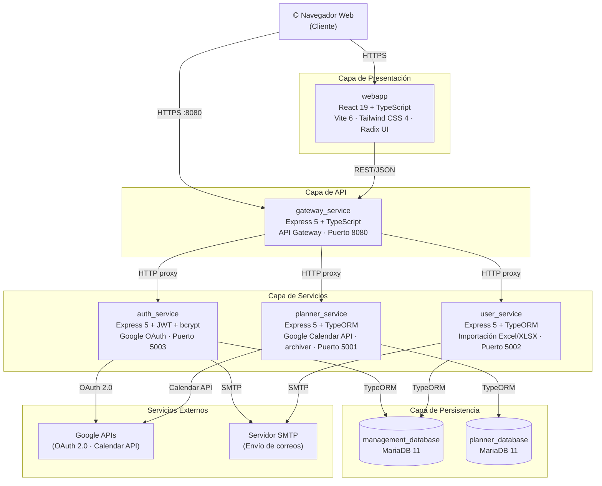
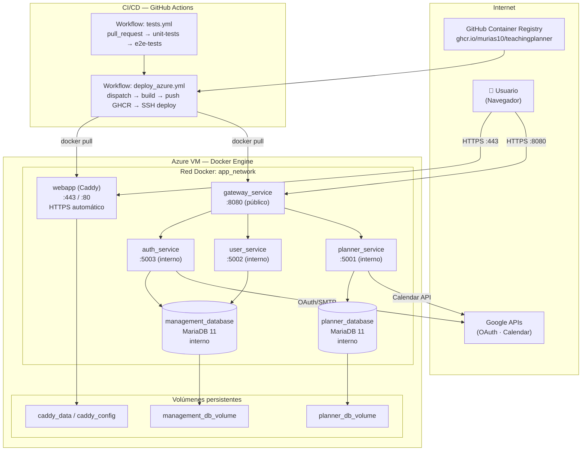
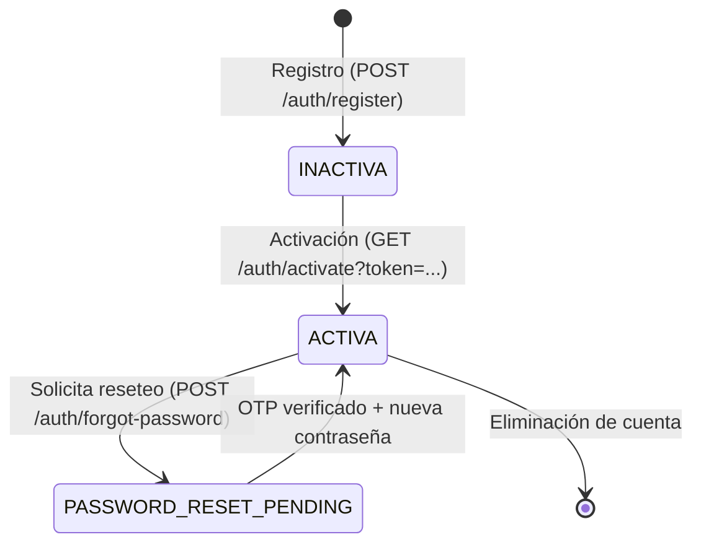
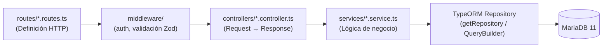
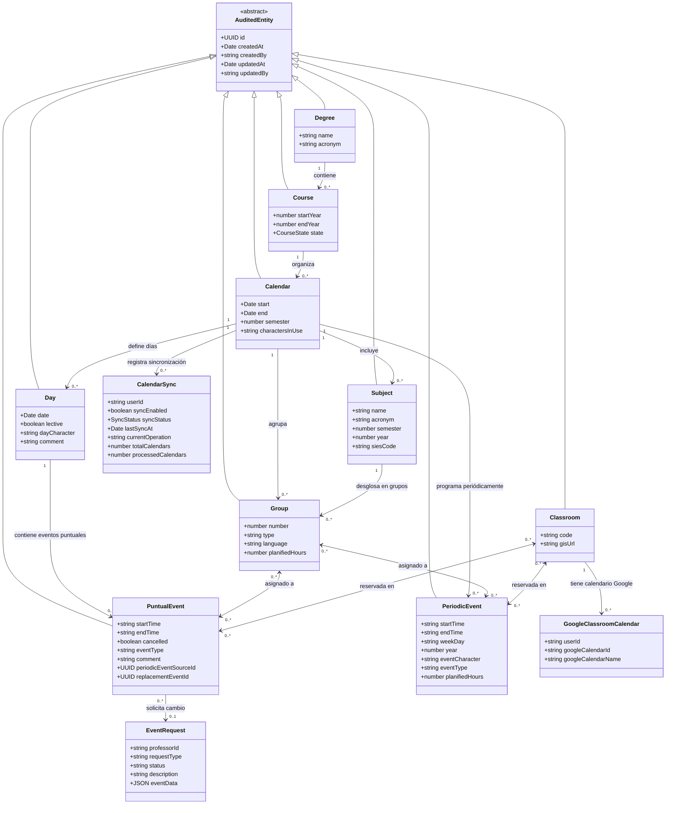
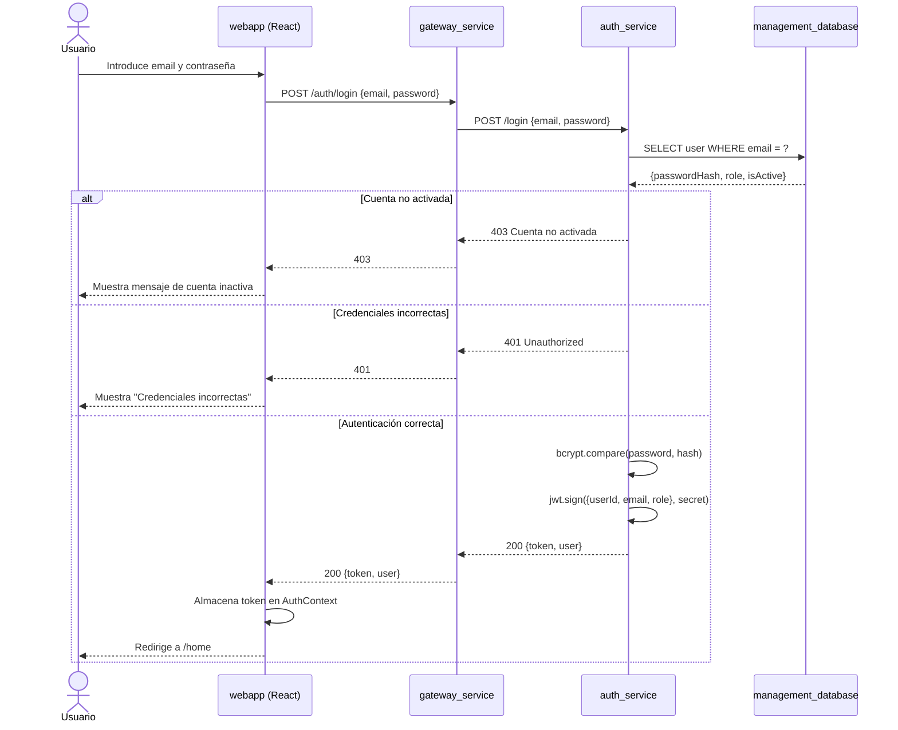
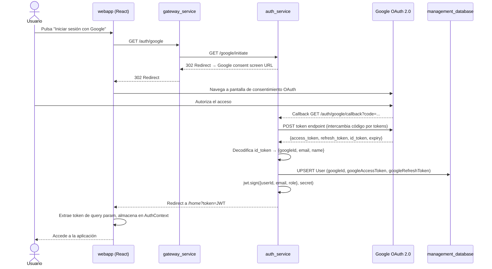
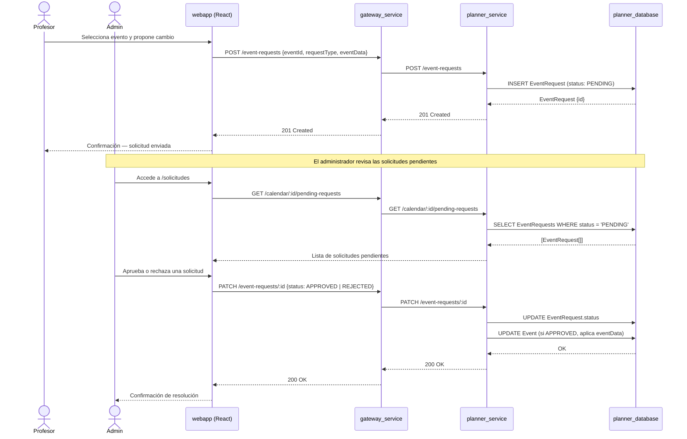
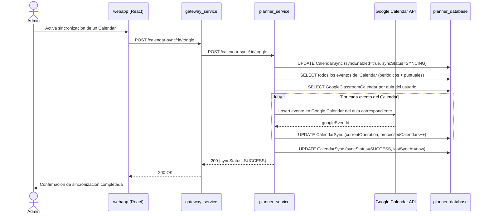

# Capítulo 5 — DISEÑO

---

## 5.1 Diseño de la Arquitectura

### 5.1.1 Introducción y justificación arquitectónica

TeachingPlanner se ha diseñado siguiendo una **arquitectura de microservicios con patrón API Gateway**, estilo definido formalmente por Newman [1] como la descomposición de un sistema en servicios pequeños, desplegables de forma independiente, con fronteras de dominio bien definidas y comunicación a través de interfaces ligeras (HTTP/REST). Esta elección no responde únicamente a tendencias tecnológicas, sino a necesidades concretas derivadas del análisis de requisitos:

- **Separación de dominios**: la lógica de autenticación y gestión de usuarios es estructuralmente independiente de la lógica de planificación académica. Aislarlas en servicios con bases de datos propias elimina el acoplamiento entre ciclos de cambio que evolucionan a ritmos distintos.
- **Escalabilidad independiente**: el servicio de planificación (`planner_service`) es el más exigente computacionalmente —genera calendarios completos con expansión de eventos periódicos, exportaciones y sincronizaciones— y puede escalar de forma autónoma sin replicar los servicios de autenticación.
- **Despliegue continuo y bajo riesgo**: cada microservicio se conteneriza y publica por separado; el despliegue de un cambio en `auth_service` no requiere reiniciar `planner_service`, lo que reduce la ventana de riesgo operacional.

Para fundamentar la elección de tecnologías específicas, la Tabla 5.1 resume las principales decisiones arquitectónicas adoptadas frente a las alternativas evaluadas.

**Tabla 5.1 — Decisiones arquitectónicas (ADR simplificado)**

| Decisión | Alternativa considerada | Motivo de la elección |
|---|---|---|
| Microservicios vs. monolito | Monolito modular (NestJS) | Aislamiento de fallos y escalado independiente del servicio de planificación; el monolito habría acoplado los ciclos de despliegue de autenticación y planificación |
| MariaDB relacional vs. NoSQL | MongoDB | El modelo de datos académico (calendarios, grupos, asignaturas, eventos) presenta relaciones fuertes con restricciones de integridad referencial y unicidad que encajan naturalmente en un esquema relacional |
| Caddy vs. Nginx para TLS | Nginx con Let's Encrypt manual | Caddy gestiona automáticamente la obtención y renovación de certificados TLS vía ACME, eliminando la configuración manual de certbot y los cron de renovación |
| Vite vs. Next.js para el frontend | Next.js (SSR) | La aplicación requiere autenticación previa para toda funcionalidad; el rendering en servidor no aporta valor en SPA privadas, y Vite ofrece un ciclo de desarrollo más rápido |

---

### 5.1.2 Diagrama de bloques — Vista de componentes

El sistema se divide en **siete componentes desplegables**: una aplicación frontend (`webapp`), un API Gateway (`gateway_service`), tres servicios backend (`auth_service`, `user_service`, `planner_service`) y dos bases de datos relacionales (`management_database`, `planner_database`). El diagrama de la Figura 5.1 muestra los componentes y sus relaciones de comunicación.

**Figura 5.1 — Diagrama de bloques del sistema**



**Descripción de los componentes:**

| Componente | Responsabilidad principal | Tecnología clave |
|---|---|---|
| `webapp` | Interfaz de usuario SPA; visualización de calendarios, titulaciones, aulas y solicitudes de cambio | React 19, TypeScript, Vite 6, Tailwind CSS 4, Radix UI, TanStack Query |
| `gateway_service` | Punto de entrada único para todas las peticiones del frontend; enruta y reenvía peticiones HTTP a los servicios internos; gestiona CORS y carga de ficheros multiparte | Express 5, TypeScript, Axios, Multer |
| `auth_service` | Autenticación mediante JWT; registro y activación de cuentas; integración con Google OAuth 2.0; reseteo de contraseñas con OTP por correo | Express 5, TypeORM, bcrypt, jsonwebtoken, Nodemailer |
| `user_service` | Gestión CRUD de usuarios; control de roles (`ADMIN`, `PROFESSOR`); importación masiva desde ficheros Excel (XLSX) | Express 5, TypeORM, xlsx |
| `planner_service` | Núcleo de negocio: gestión de calendarios, titulaciones, cursos, asignaturas, grupos, aulas, eventos periódicos y puntuales; solicitudes de cambio; sincronización con Google Calendar; importación/exportación Excel; auditoría de operaciones | Express 5, TypeORM, xlsx, archiver |
| `management_database` | Almacén relacional para usuarios y credenciales; compartido entre `auth_service` y `user_service` | MariaDB 11 |
| `planner_database` | Almacén relacional para toda la información académica; uso exclusivo de `planner_service` | MariaDB 11 |

**Perímetro de exposición pública:** únicamente `gateway_service` (puerto 8080) y `webapp` (puertos 80/443) son accesibles desde el exterior. Los tres servicios backend (`auth_service`, `user_service`, `planner_service`) y ambas bases de datos se encuentran en la red interna Docker `app_network` y no tienen ningún puerto expuesto al host ni a Internet. Esta decisión de diseño limita la superficie de ataque: cualquier petición al backend debe pasar obligatoriamente por el gateway, donde se aplica la política CORS y se gestionan los ficheros multiparte.

---

### 5.1.3 Diagrama de despliegue

El sistema se despliega mediante contenedores Docker orquestados con Docker Compose. Se mantienen tres perfiles de despliegue:

- **Desarrollo local** (`docker-compose.dev.yml`): compilación desde código fuente, puertos expuestos en el host, volúmenes de hot-reload.
- **Producción en Azure VM** (`docker-compose.azure.yml`): imágenes preconstruidas publicadas en GitHub Container Registry (`ghcr.io/murias10/teachingplanner`), exposición pública únicamente del gateway y del frontend, red interna para el resto de servicios.
- **Análisis de calidad** (`docker-compose.sonarqube.yml`): instancia local de SonarQube para análisis estático del código.

**Figura 5.2 — Diagrama de despliegue**



**Pipeline CI/CD (cuatro etapas secuenciales):**

El proceso de despliegue a producción se articula en cuatro etapas dependientes entre sí, definidas en los ficheros de GitHub Actions:

1. **`unit-tests`** (workflow `tests.yml`, trigger: `pull_request`): ejecuta los tests de integración de `planner_service` con Jest 30 y Testcontainers sobre Node.js 23.
2. **`e2e-tests`** (depende de `unit-tests`): levanta todos los servicios backend en background, arranca la base de datos MariaDB como servicio Docker, siembra un usuario administrador de prueba y ejecuta los tests Playwright en Chromium.
3. **`docker-push`** (workflow `deploy_azure.yml`, trigger: `workflow_dispatch` — manual): construye las imágenes Docker de todos los servicios usando `node:23-alpine` como base y las publica en `ghcr.io/murias10/teachingplanner/<servicio>`.
4. **`deploy`** (depende de `docker-push`): accede a la Azure VM por SSH, ejecuta `docker compose pull` para descargar las nuevas imágenes y `docker compose up -d` para reiniciar los servicios afectados con tiempo de inactividad mínimo.

El hecho de que el despliegue a producción sea siempre un `workflow_dispatch` (activación manual) es una decisión deliberada: ningún `push` a `main` desencadena un despliegue automático, garantizando que la decisión de poner en producción siempre sea consciente.

**Aspectos relevantes del despliegue en producción:**

- Las bases de datos cuentan con *health checks* (`mysqladmin ping -u root -p$MYSQL_ROOT_PASSWORD`) antes de que los servicios dependientes arranquen, garantizando que `auth_service`, `user_service` y `planner_service` no inicien la conexión TypeORM sobre una base de datos no disponible.
- Solo `gateway_service` (puerto 8080) y `webapp` (puertos 80/443) son accesibles desde el exterior. Los servicios backend y las bases de datos se encuentran en la red interna `app_network`.
- El frontend se sirve desde un contenedor **Caddy**, que gestiona automáticamente la obtención y renovación de certificados TLS vía ACME/Let's Encrypt, sin necesidad de cron ni certificados preaprovisionados.
- TypeORM opera con `synchronize: false` en producción, garantizando que los cambios de esquema sean explícitos y controlados. En los tests de integración, en cambio, se usa `synchronize: true` sobre la base de datos efímera de Testcontainers para garantizar que el esquema de prueba es siempre idéntico al de producción.

---

### 5.1.4 Tabla de tecnologías por capa

**Tabla 5.2 — Stack tecnológico por capa**

| Capa | Componente | Lenguaje | Framework / Runtime | ORM / BD | Tests | Integración externa |
|---|---|---|---|---|---|---|
| Frontend | webapp | TypeScript | React 19, Vite 6, Tailwind 4 | — | Playwright 1.58 | — |
| API Gateway | gateway_service | TypeScript | Express 5, Node.js 23 | — | — | — |
| Autenticación | auth_service | TypeScript | Express 5, Node.js 23 | TypeORM 0.3 | — | Google OAuth 2.0, SMTP |
| Usuarios | user_service | TypeScript | Express 5, Node.js 23 | TypeORM 0.3 | — | SMTP |
| Planificación | planner_service | TypeScript | Express 5, Node.js 23 | TypeORM 0.3 | Jest 30 + Testcontainers | Google Calendar API |
| Persistencia | management_database | SQL | MariaDB 11 | — | — | — |
| Persistencia | planner_database | SQL | MariaDB 11 | — | — | — |
| Contenedores | — | YAML | Docker · Docker Compose | — | — | — |
| CI/CD | — | YAML | GitHub Actions | — | — | GitHub Container Registry |
| Calidad de código | — | — | SonarQube | — | — | — |

---

### 5.1.5 Diseño de seguridad

La seguridad del sistema se articula en cinco capas complementarias que cubren la autenticación, la autorización, la protección de credenciales, la seguridad en el transporte y el control de orígenes.

#### Autenticación basada en JWT (stateless)

El sistema emplea tokens JWT firmados con el algoritmo HS256 mediante un secreto simétrico configurado en la variable de entorno `JWT_SECRET`. El payload del token contiene exclusivamente los campos `userId`, `email` y `role`, sin información sensible. Los tokens no tienen estado en el servidor (stateless): no existe ninguna tabla de sesiones ni lista de revocación; la validez del token se determina únicamente por la firma criptográfica.

Un aspecto de diseño relevante es que la verificación del token se realiza en **cada servicio backend de forma independiente**, no en el gateway. El gateway actúa como proxy opaco y reenvía el token sin validarlo. Esto permite que cualquier servicio sea desplegado e invocado directamente —por ejemplo, desde scripts de integración— sin depender del gateway como autoridad de autenticación, lo que incrementa la resiliencia y la testabilidad.

La activación de cuentas y el reseteo de contraseña siguen flujos asíncronos por correo electrónico. Cuando un usuario se registra, el sistema genera un `activationToken` aleatorio que se almacena en la entidad `User` y se envía por correo; la cuenta permanece inactiva (`isActive = false`) hasta que el usuario visita el enlace de activación. El reseteo de contraseña genera un OTP de un solo uso con fecha de expiración (`resetTokenExpiry`), también enviado por correo.

El diagrama 5.3 muestra el ciclo de vida de la cuenta de usuario.

**Figura 5.3 — Ciclo de vida de la cuenta de usuario**



#### Hashing de contraseñas (bcrypt)

Las contraseñas nunca se almacenan en texto plano. El campo `password` de la entidad `User` almacena siempre el resultado de `bcrypt.hash(plaintext, saltRounds)`, donde `saltRounds` es configurable por variable de entorno. La verificación de credenciales en el login se realiza con `bcrypt.compare`, que incorpora el salt almacenado en el propio hash, previniendo ataques de rainbow table.

#### Control de acceso basado en roles (RBAC)

El sistema define dos roles con permisos claramente delimitados:

- **`ADMIN`**: acceso completo de lectura y escritura sobre todas las entidades del sistema; gestión de usuarios; aprobación o rechazo de solicitudes de cambio propuestas por profesores.
- **`PROFESSOR`**: acceso de lectura sobre calendarios y eventos; capacidad de crear `EventRequest` (solicitudes de cambio sobre eventos ya planificados) para revisión por el administrador.

La verificación de autorización se aplica mediante una cadena de tres middlewares Express que actúa antes del controlador en todas las rutas protegidas:

```
authenticateToken → requireAuth → requireRole('ADMIN' | 'PROFESSOR') → controller
```

- `authenticateToken` (`auth.middleware.ts`): extrae el Bearer token del header `Authorization` y lo verifica con `jwt.verify`. Si el token es válido, adjunta el payload decodificado a `req.user`. Si es inválido o ausente, no rechaza la petición sino que deja `req.user` como `undefined`.
- `requireAuth`: rechaza con `401 Unauthorized` si `req.user` es `undefined`.
- `requireRole(role)`: rechaza con `403 Forbidden` si `req.user.role` no coincide con el rol requerido.

Esta separación en tres handlers permite reutilizar `authenticateToken` en rutas que deben identificar al usuario pero no requieren un rol específico (por ejemplo, obtener el perfil propio).

#### Seguridad en la capa de transporte (HTTPS/TLS)

En producción, todo el tráfico externo hacia `webapp` pasa por Caddy en el puerto 443, con TLS gestionado automáticamente vía ACME/Let's Encrypt. El tráfico HTTP en el puerto 80 es redirigido a HTTPS. El gateway, por su parte, está expuesto en el puerto 8080 y también recibe conexiones HTTPS (el cliente web configura la URL base de la API con `https://`).

La comunicación entre los servicios dentro de la red Docker `app_network` se realiza por HTTP sin TLS, lo cual es aceptable desde el punto de vista de seguridad porque el tráfico nunca abandona la máquina virtual y la red bridge de Docker está aislada del tráfico externo.

#### Protección CORS

El gateway implementa una política CORS con lista blanca de orígenes permitidos, construida dinámicamente a partir de las variables de entorno `DOMAIN` (dominio de producción) y `SERVER_IP` (IP pública del servidor). Solo el frontend desplegado en esos orígenes puede realizar peticiones al API desde un navegador, mitigando ataques CSRF desde dominios no autorizados.

---

## 5.2 Diseño de Detalle

### 5.2.1 Estructura del código

Los tres microservicios backend (`auth_service`, `user_service`, `planner_service`) comparten una **arquitectura en capas** idéntica, que separa la responsabilidad de enrutamiento, procesamiento de la petición, lógica de negocio y acceso a datos. Esta uniformidad facilita la navegación entre servicios y reduce la curva de aprendizaje para nuevos colaboradores.

**Figura 5.4 — Arquitectura en capas del backend (patrón común a los tres microservicios)**



El flujo de una petición HTTP a través de las capas es el siguiente:

1. **`routes/*.routes.ts`**: registra los verbos HTTP y las rutas, compone la cadena de middlewares y asocia el handler del controlador final.
2. **`middleware/`**: contiene los middlewares transversales. `auth.middleware.ts` verifica el JWT; `require-role.middleware.ts` valida el rol; los schemas Zod validan el cuerpo de la petición antes de que el controlador lo procese.
3. **`controllers/*.controller.ts`**: recibe el objeto `Request` de Express, extrae los parámetros necesarios, delega en el servicio correspondiente y construye la respuesta HTTP (código de estado, cabeceras, cuerpo JSON).
4. **`services/*.service.ts`**: contiene la lógica de negocio pura. Usa los repositorios TypeORM para leer y escribir datos; es el único lugar donde se ejecutan reglas de dominio, validaciones de negocio y transformaciones de datos.
5. **`TypeORM Repository`**: abstrae el acceso a la base de datos. Los controladores y servicios nunca escriben SQL directamente; usan la API de TypeORM (`find`, `save`, `remove`, `createQueryBuilder`).

La estructura de directorios de cada microservicio backend es:

```
<servicio>/src/
├── config/          # DataSource TypeORM y carga de variables de entorno
├── entities/        # Entidades TypeORM (decoradores @Entity, @Column, @ManyToOne…)
├── middleware/      # authenticateToken, requireRole, validación de schemas
├── routes/          # Definición de rutas HTTP y composición de middlewares
├── controllers/     # Controladores Express: Request → delegate → Response
├── services/        # Lógica de negocio y acceso a repositorios
├── schemas/         # Schemas Zod para validación de entrada de la API
├── types/           # Tipos TypeScript compartidos en el servicio
└── utils/           # Utilidades reutilizables (formateo, helpers)
```

**Frontend (webapp):** la aplicación React sigue una organización por responsabilidad funcional:

```
webapp/src/
├── contexts/        # Estado global React: AuthContext, AppContext,
│                    # BreadcrumbContext, FloatingAlertContext
├── hooks/           # Custom hooks organizados por dominio:
│                    # calendar/, classroom/, course/, degree/,
│                    # subject/, group/, user/, event-request/, google/
├── pages/           # Páginas de la SPA (una por ruta de React Router)
├── components/      # Componentes reutilizables por dominio y componentes UI base
├── services/        # Funciones de llamada HTTP a la API (axios)
├── types/           # Tipos TypeScript del dominio de negocio
└── utils/           # Utilidades de presentación y formateo
```

La separación entre `hooks/` (lógica de datos con TanStack Query) y `pages/` (presentación) es la inversión de dependencias propia de React: los componentes de página no conocen los detalles de fetching ni caché; únicamente invocan el hook del dominio correspondiente y reaccionan a los estados `data`, `isLoading` y `error` que este expone.

---

### 5.2.2 Patrones de diseño

La Tabla 5.3 resume los cinco patrones de diseño aplicados en TeachingPlanner antes de su descripción detallada.

**Tabla 5.3 — Resumen de patrones de diseño**

| Patrón | Tipo | Componente(s) | Propósito |
|---|---|---|---|
| API Gateway | Arquitectónico (Estructural) | `gateway_service` | Punto de entrada único al backend; encapsula las URLs internas de los microservicios |
| Repository | Estructural | `*_service` (TypeORM) | Desacopla la lógica de negocio del almacenamiento relacional |
| Middleware Chain (Chain of Responsibility) | Comportamiento | `*_service` (Express) | Composición de preocupaciones transversales (auth, roles, validación) de forma reutilizable |
| Context | Comportamiento (React) | `webapp` | Propagación de estado global sin prop-drilling |
| Custom Hook + Query | Comportamiento (React) | `webapp` | Encapsulación de la lógica de fetching, caché y estado de carga por dominio |

---

#### Patrón 1: API Gateway

**Nombre:** API Gateway

**Motivación:** el frontend no debe conocer las URLs ni los puertos internos de cada microservicio. Un componente central centraliza el enrutamiento, aplica CORS de manera uniforme y simplifica la configuración del cliente HTTP en la webapp.

**Instanciación: Enrutamiento de peticiones REST**

| Rol | Clase / Fichero | Descripción |
|---|---|---|
| Gateway (Fachada) | `gateway_service/src/app.ts` | Punto de entrada único. Registra todas las rutas y aplica middlewares globales (CORS, Multer) |
| Router de dominio | `gateway_service/src/routes/*.routes.ts` | Cuatro ficheros de rutas: `auth`, `planner`, `user`, `status` |
| Controlador proxy | `gateway_service/src/controllers/*.controller.ts` | Reenvía la petición HTTP al servicio interno correspondiente |
| Utilidad proxy | `gateway_service/src/utils/proxy.ts` | Abstrae la llamada HTTP saliente (Axios) y propaga cabeceras y cuerpo de la petición |
| Configuración de servicios | `gateway_service/src/config/services.ts` | Define las URLs base de los servicios internos mediante variables de entorno |

---

#### Patrón 2: Repository (TypeORM)

**Nombre:** Repository

**Motivación:** los controladores y servicios no deben acceder directamente al motor de base de datos. TypeORM proporciona una implementación del patrón Repository que desacopla la lógica de negocio del almacenamiento relacional, permitiendo intercambiar el motor de base de datos sin modificar la lógica de aplicación.

**Instanciación: Acceso a datos en planner_service**

| Rol | Clase / Fichero | Descripción |
|---|---|---|
| Entity | `planner_service/src/entities/*.entity.ts` | Definen el esquema de datos mediante decoradores TypeORM (`@Entity`, `@Column`, `@ManyToOne`, `@ManyToMany`, etc.) |
| Repository | `dataSource.getRepository(EntityClass)` | Objeto en tiempo de ejecución que expone `find`, `save`, `remove`, `createQueryBuilder`, etc. |
| DataSource | `planner_service/src/config/data-source.ts` | Inicializa la conexión con MariaDB y registra las 12 entidades del dominio de planificación |
| Service (cliente del repo) | `planner_service/src/services/*.service.ts` | Obtiene el repositorio del DataSource y ejecuta la lógica de negocio sobre él |

---

#### Patrón 3: Middleware Chain (Chain of Responsibility)

**Nombre:** Middleware Chain (instanciación del patrón Chain of Responsibility sobre Express)

**Motivación:** Express procesa las peticiones HTTP a través de una cadena de funciones middleware. Esto permite aplicar preocupaciones transversales (autenticación, autorización, validación del cuerpo) de forma composable, reutilizable y en el orden correcto, sin contaminar la lógica del controlador.

**Instanciación: Protección de rutas de administración en planner_service**

La cadena completa para una ruta protegida de administrador es la siguiente secuencia de cuatro handlers:

| Orden | Rol | Clase / Fichero | Descripción |
|---|---|---|---|
| 1 | Extractor de identidad | `planner_service/src/middleware/auth.middleware.ts` → `authenticateToken` | Parsea el Bearer token del header `Authorization` y verifica la firma JWT; si es válido, adjunta `req.user`; si falta o es inválido, deja `req.user = undefined` (no rechaza aún) |
| 2 | Guard de autenticación | `planner_service/src/middleware/auth.middleware.ts` → `requireAuth` | Rechaza con `401 Unauthorized` si `req.user` es `undefined` |
| 3 | Guard de autorización | `planner_service/src/middleware/require-role.middleware.ts` → `requireRole('ADMIN')` | Rechaza con `403 Forbidden` si el rol en `req.user.role` no coincide con el rol requerido |
| 4 | Controlador | `planner_service/src/controllers/*.controller.ts` | Procesa la petición y genera la respuesta solo si los tres handlers anteriores no han cortado la cadena |

---

#### Patrón 4: Context (React)

**Nombre:** Context (patrón de propagación de estado global en React)

**Motivación:** cierta información de estado —sesión del usuario autenticado, alertas globales, ruta de breadcrumb activa— debe estar disponible en cualquier componente de la aplicación sin necesidad de prop-drilling a través de múltiples niveles del árbol de componentes.

**El sistema utiliza cuatro contextos:**

**Instanciación 1: Estado de autenticación**

| Rol | Clase / Fichero | Descripción |
|---|---|---|
| Contexto | `webapp/src/contexts/AuthContext.tsx` | Define el tipo del contexto (`user`, `token`, `login`, `logout`) y su valor inicial |
| Provider | `AuthProvider` (en `AuthContext.tsx`) | Envuelve toda la aplicación; gestiona el estado con `useReducer`; persiste el token en `localStorage`/`sessionStorage` |
| Hook de acceso | `useAuth()` (exportado desde `AuthContext.tsx`) | Encapsula `useContext(AuthContext)` para un acceso tipado y seguro desde cualquier componente |

**Instanciación 2: Estado general de la aplicación**

| Rol | Clase / Fichero | Descripción |
|---|---|---|
| Contexto | `webapp/src/contexts/AppContext.tsx` | Estado global de la SPA: calendario seleccionado, titulación activa y otras selecciones de navegación |

**Instanciación 3: Navegación breadcrumb**

| Rol | Clase / Fichero | Descripción |
|---|---|---|
| Contexto | `webapp/src/contexts/BreadcrumbContext.tsx` | Permite a cualquier página actualizar dinámicamente la ruta de navegación jerárquica mostrada en la barra superior |

**Instanciación 4: Notificaciones globales**

| Rol | Clase / Fichero | Descripción |
|---|---|---|
| Contexto | `webapp/src/contexts/FloatingAlertContext.tsx` | Cola de alertas flotantes (éxito, error, advertencia) mostradas sobre la interfaz; cualquier componente puede emitir una alerta sin conocer el componente de visualización |

---

#### Patrón 5: Custom Hook con React Query

**Nombre:** Custom Hook (composición de lógica de datos con TanStack React Query)

**Motivación:** la lógica de fetching, caché, revalidación, estado de carga y gestión de errores es repetitiva en cada dominio. Encapsularla en hooks personalizados evita la duplicación en los componentes de página y desacopla completamente la capa de presentación de la capa de datos.

**Instanciación: Hook de gestión de titulaciones (ejemplo representativo)**

| Rol | Clase / Fichero | Descripción |
|---|---|---|
| Hook personalizado | `webapp/src/hooks/degree/useDegrees.ts` | Invoca `useQuery` de React Query para lectura y `useMutation` para escritura; expone `data`, `isLoading`, `error` y funciones de mutación con invalidación de caché automática |
| QueryClient | Configurado en `webapp/src/main.tsx` | Gestiona la caché global de consultas, la configuración de reintentos y los TTL de los datos en memoria |
| Componente consumidor | `webapp/src/pages/DegreePage.tsx` | Invoca el hook y renderiza en función de los estados expuestos, sin ningún acoplamiento con Axios ni con la URL de la API |

Este patrón se replica para todos los dominios de la aplicación: `calendar/`, `classroom/`, `course/`, `degree/`, `subject/`, `group/`, `user/`, `event-request/` y `google/`.

---

### 5.2.3 Modelo de dominio — Entidades principales

El siguiente diagrama muestra las entidades del dominio gestionadas por `planner_service` y sus relaciones. Todas las entidades de negocio extienden `AuditedEntity`, que proporciona los campos de trazabilidad comunes a todas las operaciones de escritura.

**Figura 5.5 — Diagrama de clases del dominio de planificación**



**Notas sobre el modelo de dominio:**

- `CourseState` es un enumerado con tres valores que representan el ciclo de vida de un curso académico: `PLANIFICADO` (antes del inicio del semestre), `ACTIVO` (curso en curso) y `FINALIZADO` (semestre concluido). Este estado controla qué operaciones de edición están permitidas sobre el calendario asociado.

- `SyncStatus` es un enumerado con los valores `IDLE`, `SYNCING`, `SUCCESS` y `ERROR`, que refleja el estado del último proceso de sincronización con Google Calendar para un par (usuario, calendario académico).

- **Restricciones de unicidad del dominio** (invariantes de negocio implementadas como índices únicos en la base de datos):
  - `Calendar`: `UNIQUE(courseId, semester)` — un curso no puede tener dos calendarios del mismo semestre.
  - `Subject`: `UNIQUE(name, calendarId)` y `UNIQUE(acronym, calendarId)` — dos asignaturas del mismo calendario no pueden compartir nombre ni acrónimo.
  - `Group`: `UNIQUE(calendarId, subjectId, number, type, language)` — la combinación de calendario, asignatura, número de grupo, tipo e idioma identifica unívocamente a un grupo.
  - `Classroom`: `UNIQUE(code)` — el código de aula es único en todo el sistema.
  - `GoogleClassroomCalendar`: `UNIQUE(userId, classroomId)` — cada usuario tiene a lo sumo un Google Calendar asociado a cada aula.

---

### 5.2.4 Diagramas de secuencia — Flujos de autenticación

#### Flujo 1: Autenticación con email y contraseña (JWT)

El siguiente diagrama representa el flujo de autenticación mediante JWT cuando un usuario introduce sus credenciales en el formulario de login.

**Figura 5.6 — Secuencia de autenticación por email/contraseña**



#### Flujo 2: Autenticación con Google OAuth 2.0

El segundo flujo de autenticación utiliza el protocolo OAuth 2.0 para delegar la verificación de identidad en Google. Este flujo justifica la existencia de los campos `googleId`, `googleAccessToken`, `googleRefreshToken` y `googleTokenExpiry` en la entidad `User`.

**Figura 5.7 — Secuencia de autenticación Google OAuth 2.0**



---

### 5.2.5 Diagrama de secuencia — Flujo de solicitud de cambio

Las solicitudes de cambio permiten al profesorado (`PROFESSOR`) proponer modificaciones sobre eventos ya planificados. El administrador (`ADMIN`) revisa y aprueba o rechaza cada solicitud sin que el flujo habitual de trabajo se interrumpa.

**Figura 5.8 — Secuencia del flujo de solicitud de cambio**



**Tabla 5.4 — Transición de estados de EventRequest**

| Estado | Descripción | Transiciones posibles |
|---|---|---|
| `PENDING` | Solicitud enviada por PROFESSOR, pendiente de revisión por el administrador | → `APPROVED`, → `REJECTED` |
| `APPROVED` | Administrador aprueba; el cambio contenido en `eventData` se aplica sobre el evento original | — (estado terminal) |
| `REJECTED` | Administrador rechaza; el evento original no se modifica | — (estado terminal) |

**Tipos de solicitud (`requestType`):**

| Tipo | Descripción | `originalEventId` |
|---|---|---|
| `CREATE` | Propuesta de creación de un nuevo evento | No requerido (null) |
| `EDIT` | Modificación de un evento existente (hora, aula, grupos) | Obligatorio |
| `CANCEL` | Cancelación de una ocurrencia puntual de un evento periódico | Obligatorio |
| `REPLACE` | Cancelación del evento original y creación de uno nuevo en su lugar | Obligatorio |

---

### 5.2.6 Diseño del sistema de eventos: tipos, periodicidad y caracteres

El sistema de eventos es la parte más compleja del dominio de planificación. Su diseño responde a la necesidad de representar horarios académicos reales, que combinan clases semanales regulares, clases quincenales alternas y esquemas de periodicidad arbitrarios derivados de la importación de horarios desde ficheros Excel del SIES (Sistema de Información de la Escuela Superior de Ingeniería).

#### Tipos de eventos: puntuales vs. periódicos

El sistema distingue dos tipos estructuralmente distintos de eventos:

- **`PuntualEvent`**: evento de una sola ocurrencia, ligado directamente a un `Day` concreto del calendario. Puede estar marcado como `cancelled = true` para reflejar que una clase ha sido cancelada ese día. El campo `periodicEventSourceId` almacena la referencia al `PeriodicEvent` que generó este evento puntual (si es una cancelación de una ocurrencia periódica). El campo `replacementEventId` apunta al evento puntual que lo reemplaza en caso de haber sido reprogramado.

- **`PeriodicEvent`**: evento recurrente no ligado a ningún `Day` específico, sino definido mediante `weekDay` (día de la semana) y `year` (año académico dentro del semestre). No tiene fecha fija; el servicio `CalendarEventsService.generateCalendarEvents()` lo expande dinámicamente a todas las semanas lectivas del calendario en las que corresponda según su `eventCharacter`.

#### El sistema de caracteres de evento (`eventCharacter`)

El `eventCharacter` es el mecanismo central que determina la periodicidad de cada `PeriodicEvent`. El sistema define tres caracteres estándar y un pool de caracteres personalizados:

**Tabla 5.5 — Comportamiento de expansión según `eventCharacter`**

| `eventCharacter` | Patrón de expansión | Descripción |
|---|---|---|
| `N` (Normal) | Todas las semanas lectivas del calendario | Clase semanal regular |
| `P` (Par) | Semanas lectivas con número par desde el inicio del semestre | Clase quincenal en semanas pares |
| `I` (Impar) | Semanas lectivas con número impar desde el inicio del semestre | Clase quincenal en semanas impares |
| Personalizado (ej. `A`, `Α`, `А`) | Los `Day` cuyo campo `dayCharacter` contiene ese carácter | Periodicidad definida por el horario importado |

El campo `Calendar.charactersInUse` mantiene un registro de todos los caracteres personalizados actualmente asignados en el calendario. Cuando se crea un nuevo tipo de evento periódico personalizado, la función `findAvailableCharacter(charactersInUse)` del fichero `event-characters.constants.ts` recorre el pool de ~90 caracteres disponibles (letras latinas sin N/P/I, alfabeto griego en mayúsculas, alfabeto cirílico en mayúsculas y dígitos 0–9) y devuelve el primer carácter no asignado. Cuando el número de tipos distintos de eventos en un calendario alcanza los 90, el sistema lanza un error explicativo.

Los `Day` del calendario tienen un campo `dayCharacter` asignado durante la importación del horario desde Excel. Este carácter identifica qué tipo de evento periódico personalizado ocurre ese día, permitiendo que el motor de expansión determine con precisión qué eventos deben generarse en cada fecha lectiva.

#### Tipos de evento (`eventType`)

Independientemente de su periodicidad, cada evento —puntual o periódico— tiene un `eventType` que determina su semántica de negocio y su comportamiento en el cómputo de horas y la exportación:

**Tabla 5.6 — Comportamiento según `eventType`**

| `eventType` | Cuenta horas planificadas | Se exporta a TXT | Permite multiselect grupos/aulas |
|---|---|---|---|
| `NORMAL` | Sí | Sí | No |
| `BLOCKER` | No | No | No |
| `REVISION` | No | No | Sí |
| `EVALUACION` | No | No | Sí |
| `OTRO` | No | No | Sí |

- `NORMAL` es el tipo de clase estándar. El campo `Group.planifiedHours` define el presupuesto total de horas del grupo; el sistema cuenta las horas de eventos `NORMAL` no cancelados para determinar cuántas semanas de clases periódicas quedan por impartir.
- `BLOCKER` reserva un aula para un uso no académico sin asociarlo a ninguna asignatura ni grupo.
- `REVISION`, `EVALUACION` y `OTRO` representan actividades académicas que ocupan el espacio horario pero no consumen el presupuesto de horas de docencia. Permiten asignar múltiples grupos y aulas simultáneamente.

#### Cancelación y reemplazo de ocurrencias periódicas

Cuando se cancela una ocurrencia concreta de un `PeriodicEvent` (por ejemplo, la clase del martes 14 de octubre), el sistema crea un `PuntualEvent` en ese `Day` específico con `cancelled = true` y `periodicEventSourceId` apuntando al `PeriodicEvent` origen. Este mecanismo garantiza dos propiedades importantes:

1. La cancelación es selectiva: el resto de ocurrencias del `PeriodicEvent` no se ven afectadas.
2. Si la serie periódica es modificada o eliminada posteriormente, las cancelaciones puntuales anteriores no se propagan a nuevas series que puedan ocupar el mismo slot temporal.

El reemplazo sigue el mismo mecanismo: se crea el `PuntualEvent` de cancelación y, adicionalmente, un segundo `PuntualEvent` con los nuevos datos del evento de reemplazo, con `replacementEventId` apuntando al evento cancelado, estableciendo así la trazabilidad bidireccional del cambio.

---

### 5.2.7 Diseño de la integración con Google Calendar

La integración con Google Calendar permite que los administradores sincronicen el calendario académico de TeachingPlanner con Google Calendar, facilitando al profesorado la consulta de su horario desde aplicaciones externas (Google Calendar, apps móviles, etc.).

#### Arquitectura de la integración en tres elementos

El diseño se apoya en dos entidades nuevas del modelo de dominio y un servicio dedicado:

1. **`GoogleClassroomCalendar`**: vincula cada `Classroom` del sistema con un `googleCalendarId` de la cuenta de Google del usuario. Cuando un usuario conecta su cuenta de Google, el sistema crea automáticamente un Google Calendar por cada aula registrada, de forma que los eventos de distintas aulas aparezcan en calendarios separados. Esto permite al profesorado suscribirse selectivamente solo a las aulas de su interés.

2. **`CalendarSync`**: registra el estado de la sincronización para cada par (usuario, calendario académico). El campo `syncStatus` (enumerado `IDLE / SYNCING / SUCCESS / ERROR`) refleja el estado del último proceso de sincronización, y `currentOperation` proporciona una descripción textual del progreso que la interfaz web puede mostrar en tiempo real durante una sincronización activa. Los campos `totalCalendars` y `processedCalendars` permiten calcular un porcentaje de progreso.

3. **`GoogleCalendarService`** (`planner_service/src/services/google-calendar.service.ts`): contiene toda la lógica de comunicación con la Google Calendar API v3. Implementa la creación, actualización (upsert) y eliminación de eventos en Google Calendar, así como la gestión del refresco automático del `access_token` cuando ha expirado usando el `refresh_token` almacenado en la entidad `User`.

#### Flujo de sincronización

**Figura 5.9 — Secuencia de sincronización con Google Calendar**



#### Control de cuotas de la Google Calendar API

La Google Calendar API impone un límite de 600 peticiones por minuto por usuario. El servicio implementa un control de cuotas que limita el ritmo de envío a 400 peticiones por minuto (margen de seguridad del 33%), pausando automáticamente el proceso cuando se acerca al límite y reanudándolo tras la ventana temporal correspondiente.

En caso de error durante la sincronización (token expirado y no renovable, límite de cuota superado, error de red), el servicio actualiza `CalendarSync.syncStatus` a `ERROR` con el mensaje de error en `errorMessage`, permitiendo al administrador diagnosticar la causa desde la interfaz sin necesidad de consultar los logs del servidor.

---

## 5.3 Diseño de Pruebas

### 5.3.1 Estrategia general

La estrategia de pruebas de TeachingPlanner se articula en tres niveles complementarios que cubren distintas capas del sistema, desde el análisis estático del código hasta los flujos completos de usuario.

**Tabla 5.7 — Niveles de prueba**

| Nivel | Tipo | Alcance | Herramienta |
|---|---|---|---|
| 0 | Análisis estático de código | Todos los servicios (backend + frontend) | SonarQube (sonar-project.properties) |
| 1 | Tests de integración | Backend — lógica de negocio con base de datos real | Jest 30 + Testcontainers (MariaDB 11) |
| 2 | Tests end-to-end (E2E) | Flujos completos de usuario a través de la interfaz web | Playwright 1.58 (Chromium) |

**Justificación de la ausencia de tests unitarios con mocks:** la lógica de negocio más crítica del sistema implica invariablemente operaciones sobre la base de datos: restricciones de unicidad, cascadas de eliminación y relaciones lazy/eager. Aislar TypeORM con mocks en tests unitarios introduciría una discrepancia fundamental: el mock no reproduce el comportamiento real del motor MariaDB (índices únicos, cascadas ON DELETE, check constraints). En su lugar, los tests de integración con Testcontainers ejecutan sobre una instancia MariaDB real en un contenedor efímero, verificando exactamente el comportamiento que se desplegará en producción. Esta es una decisión de diseño informada, no una omisión.

---

### 5.3.2 Nivel 0 — Análisis estático de código (SonarQube)

**Objeto de análisis:** la totalidad del código fuente TypeScript de los cuatro servicios backend (`auth_service`, `user_service`, `gateway_service`, `planner_service`) y el frontend (`webapp`).

**Herramienta:** SonarQube desplegado localmente mediante `docker-compose.sonarqube.yml`. El análisis se activa manualmente mediante `sonar-scanner` con la configuración del fichero `sonar-project.properties`.

**Qué se analiza:**
- Bugs potenciales y code smells detectados por las reglas de SonarQube para TypeScript.
- Cobertura de código: el fichero `sonar-project.properties` configura las rutas a los informes LCOV generados por Jest (`auth_service/coverage/lcov.info`, `planner_service/coverage/lcov.info`, etc.).
- Duplicación de código y complejidad ciclomática.

**Qué queda excluido del análisis:**
- `webapp/src/components/ui/**`: componentes de UI basados en shadcn/ui, generados automáticamente y no mantenidos directamente.
- Directorios `dist/`, `build/`, `coverage/` y todos los ficheros de test (`*.test.ts`, `*.spec.ts`).

---

### 5.3.3 Nivel 1 — Tests de integración (backend)

**Objeto de prueba:** la capa de datos y servicios del `planner_service`, con especial atención a las operaciones de escritura que afectan a múltiples entidades relacionadas y a las restricciones de integridad de la base de datos.

**Herramientas:**
- **Jest 30** con soporte TypeScript mediante `ts-jest`. Timeout configurado a 120 segundos por suite para dar margen suficiente al arranque del contenedor MariaDB mediante Testcontainers.
- **Testcontainers** (`@testcontainers/mariadb 11.2`): levanta un contenedor MariaDB efímero por suite de pruebas y lo destruye automáticamente al finalizar, garantizando aislamiento total entre suites.
- **TypeORM** con `synchronize: true` sobre la base de datos de test, asegurando que el esquema es siempre idéntico al de producción sin requerir migraciones.
- **supertest 7.2.2**: para aserciones sobre respuestas HTTP en los tests que ejercitan controladores.

**Qué se prueba:**

Los ficheros de test se encuentran en `planner_service/src/__tests__/integration/`:

1. **`calendar.delete.test.ts` — Eliminación en cascada de Calendar**: al eliminar un calendario, todas las entidades dependientes (días, eventos puntuales, eventos periódicos, grupos, asignaturas, relaciones de tablas pivote) deben eliminarse en cascada. Las entidades en posición ascendente en la jerarquía (titulación, curso) deben permanecer intactas.

2. **`classroom.delete.test.ts` — Eliminación de Classroom con flag `force`**:
   - Con `force=true`: se eliminan primero todos los eventos (`PuntualEvent`, `PeriodicEvent`) asociados al aula y después el aula misma.
   - Con `force=false` y eventos asociados: la operación debe rechazarse (lógica equivalente a HTTP 409 Conflict).
   - Sin eventos asociados: eliminación directa sin efectos colaterales, independientemente del valor de `force`.

3. **Restricción `UNIQUE` de `Classroom.code`**: el test intenta insertar dos entidades `Classroom` con el mismo valor en el campo `code` y verifica que TypeORM propaga la excepción de violación de clave única lanzada por MariaDB (código de error 1062), garantizando que la restricción actúa a nivel de base de datos y no solo a nivel de aplicación.

**Cobertura:** Jest genera informes de cobertura en formato LCOV (`planner_service/coverage/lcov.info`) que son consumidos por SonarQube para calcular la cobertura de líneas y ramas del código.

**Qué queda fuera del alcance en este nivel:**
- Lógica de autenticación y gestión de usuarios (`auth_service`, `user_service`): sus controladores son delgados y el comportamiento relevante es la integración con bcrypt y JWT, cubierta por los tests E2E.
- Controladores HTTP: la lógica de enrutamiento y códigos de estado se verifica en los tests E2E.
- Sincronización con Google Calendar: depende de API externa que requiere credenciales reales.

---

### 5.3.4 Nivel 2 — Tests end-to-end (frontend)

**Objeto de prueba:** los flujos de usuario completos que implican interacción con la interfaz web, desde el navegador hasta la base de datos, pasando por todos los microservicios.

**Herramientas:**
- **Playwright 1.58** configurado para ejecutar en **Chromium** (Desktop Chrome).
- El servidor de desarrollo de Vite (`npm run dev`, puerto 5173) arranca automáticamente antes de la suite mediante el mecanismo `webServer` de la configuración de Playwright.
- **Limpieza de base de datos previa** mediante el endpoint `POST /test/reset-database`, activo únicamente cuando `NODE_ENV=development` o `NODE_ENV=test`, que elimina en cascada 9 tablas del dominio de planificación (`GROUPS`, `SUBJECTS`, `PERIODIC_EVENTS`, `PUNTUAL_EVENTS`, `DAYS`, `CALENDARS`, `COURSES`, `DEGREES`, `CLASSROOMS`), garantizando la idempotencia de cada test independientemente del orden de ejecución.

**Qué se prueba:**

**Tabla 5.8 — Cobertura de los tests E2E**

| Fichero | Módulo | Aspectos verificados | Nº tests |
|---|---|---|---|
| `auth.spec.ts` | Autenticación | Renderizado del formulario; validación de campos vacíos; error por credenciales incorrectas; login exitoso y redirección; navegación autenticada; logout | 6 |
| `classroom.spec.ts` | Aulas | Listado; creación con código único; error por código duplicado; edición (campo `code` de solo lectura); eliminación sin eventos; eliminación forzada con eventos; cancelación; filtrado por código | 8 |
| `course.spec.ts` | Cursos | Listado; creación; error por año duplicado; edición de estado; eliminación; cancelación; filtrado; validación de campos obligatorios; estado por defecto `PLANIFICADO` | 9 |
| `degree.spec.ts` | Titulaciones | Listado; creación; error por acrónimo duplicado; edición; eliminación; cancelación; filtrado por nombre; validación de campos obligatorios; conversión automática a mayúsculas del acrónimo | 9 |
| `subject.spec.ts` | Asignaturas | Listado; creación; error por acrónimo duplicado; edición; eliminación; cancelación; validación de campos; mayúsculas en nombre; opciones de año (0–4); borrado múltiple en masa | 10 |
| **Total** | | | **42** |

**Estrategia de aislamiento de datos:** el endpoint `POST /test/reset-database` garantiza que cada suite de tests comienza con una base de datos limpia. Los tests dentro de cada suite se ejecutan secuencialmente para evitar condiciones de carrera sobre los datos. En el entorno de CI, Playwright se configura con `workers: 1` para evitar conflictos entre suites paralelas sobre la base de datos compartida.

**Infraestructura de ejecución en CI** (workflow `tests.yml`, job `e2e-tests`):
1. Se levanta MariaDB 11 como servicio Docker con credenciales de test.
2. Se crean las dos bases de datos de test (`planner_db_test`, `management_db_test`).
3. Se compilan y arrancan en background los cuatro servicios backend con `NODE_ENV=test`.
4. Se siembra un usuario administrador de prueba mediante un script de seed.
5. Se instalan los navegadores de Playwright.
6. Se ejecuta `playwright test` con el reporter `html,github` para generar artefactos subibles a GitHub Actions en caso de fallo.

**Qué queda fuera del alcance en este nivel:**
- Flujos de administración de usuarios: creación de cuentas, activación por correo y reseteo de contraseña (requieren servidor SMTP real).
- Gestión completa de calendarios y eventos desde la interfaz.
- Sincronización con Google Calendar (requiere cuenta real de Google con credenciales OAuth configuradas).
- Pruebas de rendimiento o carga.

---

### 5.3.5 Entornos de ejecución

**Tabla 5.9 — Entornos de ejecución de las pruebas**

| Entorno | Descripción | Activación |
|---|---|---|
| **Desarrollo local** | Todos los servicios levantados con `docker-compose.dev.yml` o manualmente; BD limpiada antes de cada ejecución E2E con `npm run test:e2e:clean` | Manual |
| **Integración continua (CI)** | GitHub Actions con MariaDB como servicio Docker; servicios backend compilados y arrancados en background; seed de usuario de prueba; Playwright en `workers: 1` | Automática en cada `pull_request` |
| **Análisis de calidad (SonarQube)** | Instancia SonarQube local levantada con `docker-compose.sonarqube.yml`; análisis ejecutado con `sonar-scanner` tras la generación de informes LCOV por Jest | Manual, tras ejecución de tests de integración |

La implementación detallada de los scripts, casos de prueba y resultados obtenidos se describe en el **Capítulo 6**.

---

## Referencias

[1] S. Newman, *Building Microservices: Designing Fine-Grained Systems*, 2nd ed. O'Reilly Media, 2021.
