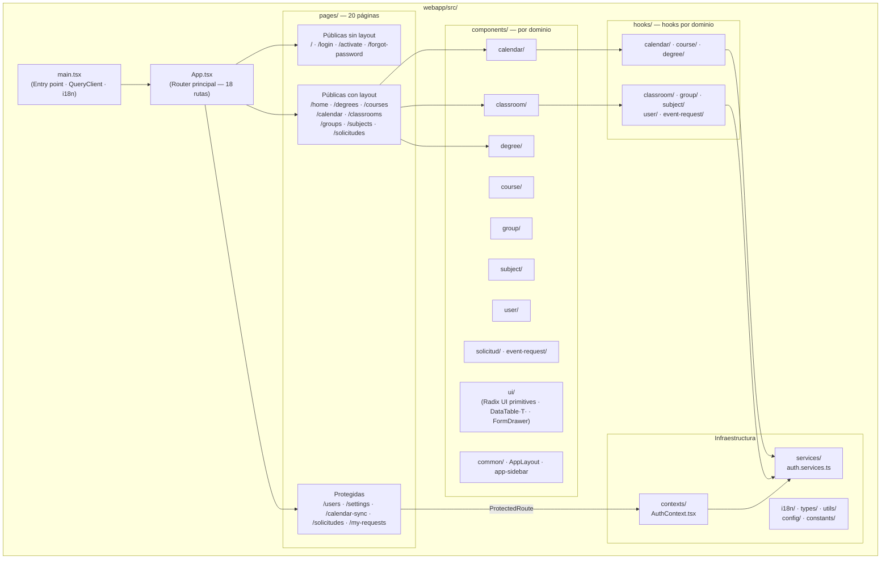
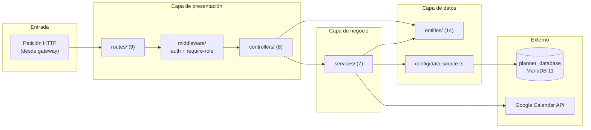
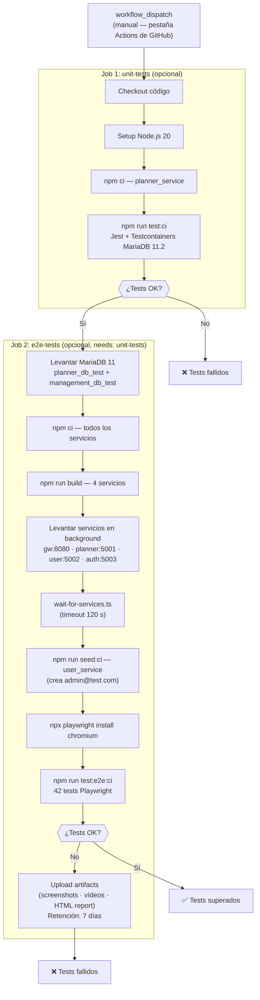

# Capítulo 6 — IMPLEMENTACIÓN

---

## 6.1 Estructura de la Aplicación

La arquitectura general del sistema, incluyendo el diagrama de bloques de componentes y el diagrama de despliegue, se ha descrito en el **§5.1 del Capítulo 5**. En este apartado se describe la organización interna del código de cada componente siguiendo la vista de cajas blancas del estándar ARC42 (*Building Block View, Nivel 2*).

---

### 6.1.1 webapp — Aplicación frontend

El frontend es una aplicación de página única (*SPA*) construida con React 19 y TypeScript. Su estructura interna sigue una organización por dominio funcional, lo que facilita la localización y mantenimiento de cada módulo.



**Componentes genéricos en `ui/`:**

Además de los 37 primitivos de Radix UI (generados con shadcn/ui y no modificados directamente), la carpeta `components/ui/` alberga dos componentes de proyecto de mantenimiento manual:

| Componente | Descripción | Usos directos |
|---|---|---|
| `DataTable<T>` | Tabla genérica con TanStack React Table: filtrado por columna, visibilidad de columnas, ordenación, paginación (10 filas/página) y selección múltiple opcional. Reemplaza la lógica de ~40 líneas repetida en 5 tablas idénticas (Classroom, Course, Degree, Subject, User). | 5 tablas de dominio |
| `FormDrawer` | Drawer de formulario genérico con header i18n, área de contenido desplazable y footer con botones Cancel/Save (deshabilitados según `isValid` e `isLoading`). Reemplaza el shell repetido en 10 drawers de creación/edición. | 10 drawers de dominio |

**Rutas de la aplicación:**

| Ruta | Componente | Acceso |
|---|---|---|
| `/` | Start | Público |
| `/login` | LoginPage | Público |
| `/forgot-password` | ForgotPasswordPage | Público |
| `/activate` | ActivatePage | Público |
| `/home` | HomePage | Con layout |
| `/degrees` | DegreePage | Con layout |
| `/degrees/:acronym/courses` | CoursePage | Con layout |
| `/degrees/:acronym/courses/:startYear/:endYear/semester/:semester/calendar` | CalendarPage | Con layout |
| `/degrees/:acronym/courses/.../solicitudes` | SolicitudPage | Con layout |
| `/degrees/:acronym/courses/.../groups` | GroupPage | Con layout |
| `/degrees/:acronym/courses/.../subjects` | SubjectPage | Con layout |
| `/classrooms` | ClassroomPage | Con layout |
| `/settings` | SettingsPage | **Protegido** |
| `/calendar-sync` | CalendarSyncPage | **Protegido** |
| `/users` | UserPage | **Protegido** |
| `/solicitudes` | AllSolicitudesPage | **Protegido** (ADMIN) |
| `/my-requests` | MyRequestsPage | **Protegido** (PROFESSOR) |
| `*` | — | Redirección a `/` |

---

### 6.1.2 gateway_service — API Gateway

El gateway actúa como único punto de entrada externo para el backend. Su estructura es deliberadamente simple: no contiene lógica de negocio ni acceso a base de datos.

```
gateway_service/src/
├── app.ts                        # Inicialización Express, CORS, Multer, registro de rutas
├── index.ts                      # Punto de entrada (listen)
├── config/
│   └── services.ts               # URLs base de los servicios internos
├── controllers/
│   ├── auth.controller.ts        # Proxy hacia auth_service
│   ├── planner.controller.ts     # Proxy hacia planner_service (mayor volumen de endpoints)
│   ├── user.controller.ts        # Proxy hacia user_service
│   └── status.controller.ts     # Endpoint de salud /status
├── routes/
│   ├── auth.routes.ts
│   ├── planner.routes.ts
│   ├── user.routes.ts
│   └── status.routes.ts
└── utils/
    └── proxy.ts                  # Abstracción de la llamada HTTP saliente (Axios)
```

---

### 6.1.3 auth_service — Servicio de autenticación

Gestiona la identidad de los usuarios: registro, activación, login con JWT, integración con Google OAuth y reseteo de contraseñas.

```
auth_service/src/
├── app.ts · index.ts · env.ts
├── config/
│   └── data-source.ts            # Conexión TypeORM → management_database
├── controllers/
│   └── auth.controller.ts
├── entities/
│   └── user.entity.ts            # Entidad User (gestión DB compartida con user_service)
├── middleware/
│   ├── auth.middleware.ts        # Validación JWT entrante
│   └── validate.middleware.ts   # Validación de cuerpo de petición con Zod
├── routes/
│   └── auth.routes.ts            # POST /login /validate /logout /forgot-password /verify-otp /reset-password /activate · GET /profile · GET+POST /google/*
├── schemas/
│   └── auth.schemas.ts           # Esquemas Zod de validación
├── services/
│   ├── auth.service.ts           # Lógica de autenticación principal
│   ├── email.service.ts          # Envío de correos (activación, reseteo)
│   ├── google-oauth.service.ts  # Integración Google OAuth 2.0
│   └── password-reset.service.ts
├── scripts/
│   └── seed-database.ts          # Script de inicialización de datos
├── types/
│   └── auth.types.ts
└── utils/
    └── jwt.ts                    # Generación y verificación de tokens JWT
```

---

### 6.1.4 user_service — Servicio de gestión de usuarios

Gestiona el ciclo de vida de los usuarios (alta, baja, modificación, consulta) y permite la importación masiva desde ficheros **Excel (XLSX)**. La creación de usuarios incluye validación de formato de email (schema Zod) y detección de email duplicado: si el email ya existe en la base de datos, el servicio devuelve **HTTP 409** con un mensaje de error localizado (ES/EN).

```
user_service/src/
├── app.ts · index.ts · env.ts
├── config/
│   ├── data-source.ts            # Conexión TypeORM → management_database
│   └── email.config.ts
├── controllers/
│   └── user.controller.ts
├── entities/
│   └── user.entity.ts
├── middleware/
│   ├── error.middleware.ts
│   └── validate.middleware.ts
├── routes/
│   └── user.routes.ts            # CRUD + importación masiva
├── schemas/
│   └── user.schemas.ts
├── service/                      # Nota: carpeta en singular
│   ├── user.service.ts
│   ├── user-import.service.ts   # Procesamiento de Excel/XLSX (importación masiva)
│   └── email.service.ts
├── types/
│   └── user.types.ts
└── utils/
    └── jwt.ts
```

---

### 6.1.5 planner_service — Servicio de planificación (núcleo de negocio)

Es el componente más complejo del sistema. Gestiona todas las entidades del dominio académico y expone 9 grupos de rutas.

```
planner_service/src/
├── app.ts · index.ts · env.ts
├── config/
│   └── data-source.ts            # Conexión TypeORM → planner_database
├── constants/
│   └── event-characters.constants.ts
├── controllers/           # 8 controladores
│   ├── calendar.controller.ts
│   ├── classroom.controller.ts
│   ├── course.controller.ts
│   ├── degree.controller.ts
│   ├── event-request.controller.ts
│   ├── group.controller.ts
│   ├── subject.controller.ts
│   └── test.controller.ts        # Endpoint de limpieza para tests
├── entities/              # 15 ficheros de entidad; 13 registradas en el DataSource (excluye audited.entity —clase abstracta— y request.entity —auxiliar no registrada—)
│   ├── audited.entity.ts         # Clase abstracta base (id, createdAt/By, updatedAt/By)
│   ├── api-quota-counter.entity.ts  # Contadores globales de cuota de la Google Calendar API
│   ├── calendar.entity.ts
│   ├── calendar-sync.entity.ts
│   ├── classroom.entity.ts
│   ├── course.entity.ts
│   ├── day.entity.ts
│   ├── degree.entity.ts
│   ├── event-request.entity.ts
│   ├── google-classroom-calendar.entity.ts
│   ├── group.entity.ts
│   ├── periodic_event.entity.ts
│   ├── puntual_event.entity.ts
│   ├── request.entity.ts
│   └── subject.entity.ts
├── middleware/
│   ├── auth.middleware.ts
│   └── require-role.middleware.ts
├── routes/                # 9 ficheros de rutas
│   ├── calendar.routes.ts
│   ├── calendar-sync.routes.ts
│   ├── classrooms.routes.ts
│   ├── course.routes.ts
│   ├── degree.routes.ts
│   ├── event-request.routes.ts
│   ├── group.routes.ts
│   ├── subject.routes.ts
│   └── test.routes.ts
├── services/              # 7 servicios
│   ├── calendar-events.service.ts    # Expansión de eventos periódicos a fechas concretas
│   ├── calendar-formatting.service.ts
│   ├── calendar-import.service.ts
│   ├── calendar-repository.service.ts
│   ├── event-request.service.ts
│   ├── google-calendar.service.ts    # Comunicación con Google Calendar API v3
│   └── validation.service.ts         # Validación de UUIDs y existencia de entidades
├── utils/
│   └── conflict-detection.utils.ts  # Detección de conflictos de horario (grupo/aula) en 6 operaciones
└── __tests__/
    ├── setup/
    │   └── testDatabase.ts       # Setup/teardown de Testcontainers
    └── integration/
        ├── calendar.delete.test.ts
        └── classroom.delete.test.ts
```

El siguiente diagrama ilustra la arquitectura interna en capas de `planner_service`:



---

### 6.1.6 Bases de datos

El sistema emplea dos bases de datos MariaDB 11 completamente independientes:

| Base de datos | Servicio propietario | Entidades gestionadas |
|---|---|---|
| `management_database` | `auth_service`, `user_service` | `User` (autenticación y perfil de usuario) |
| `planner_database` | `planner_service` | 13 entidades del dominio académico registradas en el DataSource |

Esta separación garantiza que un fallo o una migración en la base de datos de planificación no afecte a la autenticación, y viceversa.

---

### 6.1.7 Vista de despliegue — Resumen textual

Véase el **§5.1.3** del Capítulo 5 para el diagrama UML de despliegue completo. A continuación se recogen los aspectos más relevantes desde el punto de vista de la implementación:

- Cada componente dispone de su propio `Dockerfile` (7 en total). La imagen de `webapp` utiliza **Caddy** como servidor web con soporte HTTPS automático.
- En el entorno de desarrollo, todos los servicios se levantan con `docker-compose.dev.yml`, que monta los directorios fuente como volúmenes para permitir hot-reload.
- En producción (Azure VM), `docker-compose.azure.yml` utiliza imágenes preconstruidas publicadas en GitHub Container Registry con la convención `ghcr.io/murias10/teachingplanner/{servicio}:latest`. Solo `gateway_service` (puerto 8080) y `webapp` (443/80) son accesibles desde el exterior.
- El pipeline de CI/CD (GitHub Actions) ejecuta los tests en cada *pull request* antes de autorizar el merge. El mecanismo de despliegue manual (`workflow_dispatch`) y su justificación se describen en **§5.1.3**.

---

## 6.2 Implementación de las Pruebas

La estrategia y el diseño de las pruebas (qué se prueba y por qué) se han definido en el **§5.3 del Capítulo 5**. Este apartado describe la implementación concreta: herramientas, scripts, casos de prueba con su resultado esperado y el mecanismo de integración continua.

---

### 6.2.1 Tests de integración — Jest + Testcontainers

#### Infraestructura

Los tests de integración se ubican en `planner_service/src/__tests__/integration/` y se ejecutan con **Jest 30** y soporte TypeScript mediante `ts-jest`. La peculiaridad de esta suite es el uso de **Testcontainers** (`@testcontainers/mariadb 11.2`): antes de que comience la suite, se levanta automáticamente un contenedor MariaDB efímero con una base de datos `test_planner_db` en la que TypeORM sincroniza el esquema completo (`synchronize: true`). Al finalizar, el contenedor se destruye.

El ciclo de vida de cada suite es:

```
beforeAll  → setupTestDatabase()   — levanta contenedor MariaDB 11.2 (timeout: 120 s)
afterEach  → cleanDatabase()       — elimina todos los registros entre tests
afterAll   → teardownTestDatabase() — destruye el contenedor
```

#### Scripts de ejecución

```bash
cd planner_service

# Ejecutar todos los tests
npm test

# Con informe de cobertura (genera coverage/lcov-report/index.html)
npm run test:coverage

# Solo tests de integración
npm run test:integration

# Modo watch (durante el desarrollo)
npm run test:watch

# Modo CI (--ci --coverage --maxWorkers=2)
npm run test:ci
```

**Configuración relevante de `jest.config.js`:**

| Parámetro | Valor | Motivo |
|---|---|---|
| `preset` | `ts-jest` | Soporte TypeScript |
| `testEnvironment` | `node` | Entorno Node.js (no DOM) |
| `testTimeout` | `60000` ms | Tiempo de arranque de Testcontainers |
| `forceExit` | `true` | Evita que Jest quede colgado tras destruir el contenedor |
| `clearMocks` | `true` | Limpia mocks entre tests |
| `resetMocks` | `true` | Restablece estado de mocks entre tests |
| `restoreMocks` | `true` | Restaura implementaciones originales entre tests |

#### Casos de prueba

**Fichero: `calendar.delete.test.ts`**

| ID | Descripción | Precondición | Resultado esperado |
|---|---|---|---|
| TC-INT-01 | Eliminación en cascada de Calendar con entidades dependientes | Calendar con 1 Subject, 1 Group, 2 Days, 1 PuntualEvent y 1 PeriodicEvent | Calendar, Subject, Group, Days, PuntualEvent y PeriodicEvent eliminados; Degree y Course permanecen |
| TC-INT-02 | Eliminación de Calendar sin entidades dependientes | Calendar vacío (sin eventos, sin grupos, sin días) | Calendar eliminado; Degree y Course permanecen |

**Fichero: `classroom.delete.test.ts`**

| ID | Descripción | Precondición | Resultado esperado |
|---|---|---|---|
| TC-INT-03 | Eliminación forzada de Classroom con eventos (`force=true`) | Classroom con 1 PuntualEvent y 1 PeriodicEvent asociados | Classroom y ambos eventos eliminados; Group y Calendar permanecen |
| TC-INT-04 | Rechazo de eliminación cuando `force=false` y hay eventos | Classroom con 1 PuntualEvent asociado | Classroom no eliminada; `totalRelatedEvents > 0` y `force === false` (lógica de 409 Conflict verificada) |
| TC-INT-05 | Eliminación de Classroom sin eventos | Classroom sin eventos asociados | Classroom eliminada; `count() === 0` |
| TC-INT-06 | Unicidad del código de aula — duplicado rechazado | Classroom con código `UNIQUE-CODE` ya existente | `classroomRepo.save(classroom2)` lanza excepción |
| TC-INT-07 | Creación de dos Classrooms con códigos distintos | BD vacía | Ambos registros creados; `count() === 2` |

A continuación se muestra un fragmento representativo del test TC-INT-01, que ilustra la pauta *Arrange–Act–Assert* empleada:

```typescript
// ARRANGE: crear estructura completa
const calendar = await calendarRepo.save(
  calendarRepo.create({ start: new Date('2024-09-01'), end: new Date('2025-01-31'), semester: 1, course })
);
// ... (creación de Subject, Group, Days, PuntualEvent, PeriodicEvent)

// ACT: eliminar en cascada (replicando la lógica del controlador)
await periodicEventRepo.remove(periodicEvents);
await puntualEventRepo.remove(day.puntualEvents);
await groupRepo.remove(groups);
await calendarRepo.remove(calendar);   // CASCADE elimina Subject y Day

// ASSERT
expect(await calendarRepo.count()).toBe(0);
expect(await subjectRepo.count()).toBe(0);
expect(await groupRepo.count()).toBe(0);
expect(await puntualEventRepo.count()).toBe(0);
expect(await periodicEventRepo.count()).toBe(0);
// Degree y Course NO deben ser eliminados
expect(await degreeRepo.count()).toBe(1);
expect(await courseRepo.count()).toBe(1);
```

#### Generación del informe de cobertura

```bash
npm run test:coverage
# Informe HTML disponible en: planner_service/coverage/lcov-report/index.html
```

---

### 6.2.2 Tests end-to-end — Playwright

#### Infraestructura

Los tests E2E se ubican en `webapp/e2e/` y se ejecutan con **Playwright 1.58** sobre Chromium. Antes de cada ejecución se recomienda limpiar la base de datos de planificación mediante el endpoint `POST /test/reset-database`, disponible únicamente cuando `NODE_ENV=development` o `NODE_ENV=test`. Este endpoint elimina en cascada los registros de 9 tablas: `EventRequests`, `PuntualEvents`, `PeriodicEvents`, `Calendars`, `Groups`, `Subjects`, `Classrooms`, `Courses` y `Degrees`.

La motivación de esta limpieza previa es garantizar la determinación de los tests: sin ella, registros de ejecuciones anteriores pueden causar fallos por paginación, nombres duplicados o estado inconsistente.

**Requisitos previos para la ejecución local:**
1. Todos los servicios backend en ejecución: `auth_service` (5003), `gateway_service` (8080), `planner_service` (5001), `user_service` (5002).
2. Usuario de prueba creado (`npm run seed:test-user` en `user_service`): `admin@test.com` / `Admin123!` con rol `ROLE_ADMIN`.
3. `NODE_ENV=development` en el fichero `.env`.

#### Scripts de ejecución

```bash
cd webapp

# Limpiar BD y ejecutar tests (recomendado)
npm run test:e2e:clean

# Ejecutar sin limpiar BD
npm run test:e2e

# Solo limpiar BD
npm run clean:test-db

# Modo UI interactivo de Playwright
npm run test:e2e:ui

# Modo debug paso a paso
npm run test:e2e:debug

# Ver informe HTML de la última ejecución
npm run test:e2e:report
```

**Configuración relevante de `playwright.config.ts`:**

| Parámetro | Desarrollo | CI |
|---|---|---|
| `baseURL` | `http://localhost:5173` | `http://localhost:5173` |
| `retries` | 0 | 2 |
| `workers` | ilimitado (paralelo) | 1 (secuencial) |
| `screenshot` | Solo en fallo | Solo en fallo |
| `video` | Solo en fallo | Solo en fallo |
| `trace` | En primer reintento | En primer reintento |
| `devServer timeout` | 120 s | 120 s |

#### Casos de prueba

**Suite: `auth.spec.ts` — 6 tests**

| ID | Nombre del test | Verificación principal |
|---|---|---|
| TC-E2E-01 | should display login form | URL `/login`; visibilidad de campos email, contraseña y botón |
| TC-E2E-02 | should show validation error for empty fields | Envío sin rellenar campos; permanece en `/login` |
| TC-E2E-03 | should show error for incorrect credentials | Email/contraseña erróneos; mensaje de error visible |
| TC-E2E-04 | should login successfully with valid credentials | Login con `admin@test.com`; redirección a `/home` |
| TC-E2E-05 | should navigate to different pages after login | Navegación a `/classrooms` y `/degrees` sin pérdida de sesión |
| TC-E2E-06 | should logout successfully | Clic en logout; redirección a `/` |

**Suite: `classroom.spec.ts` — 8 tests**

| ID | Nombre del test | Verificación principal |
|---|---|---|
| TC-E2E-07 | should display classrooms list | URL `/classrooms`; cabeceras de tabla correctas |
| TC-E2E-08 | should create new classroom successfully | Creación con código `TEST-{timestamp}`; alerta "Classroom created"; fila visible en tabla |
| TC-E2E-09 | should show error when creating classroom with duplicate code | Segundo aula con mismo código; mensaje de error |
| TC-E2E-10 | should edit classroom successfully | Campo `code` de solo lectura; actualización de GIS URL; alerta "Classroom edited" |
| TC-E2E-11 | should delete classroom without events | Diálogo de confirmación; alerta "Classroom deleted"; fila eliminada de tabla |
| TC-E2E-12 | should delete classroom with related events (force delete) | Diálogo con advertencia de eventos en cascada; eliminación forzada |
| TC-E2E-13 | should cancel delete operation | Clic en "Cancelar"; aula permanece en la tabla |
| TC-E2E-14 | should filter classrooms by code | Filtro por código; solo se muestra la fila correspondiente |

**Suite: `course.spec.ts` — 9 tests**

| ID | Nombre del test | Verificación principal |
|---|---|---|
| TC-E2E-15 | should display courses list | Listado de cursos de la titulación |
| TC-E2E-16 | should create new course successfully | Creación con año inicio/fin únicos; confirmación visible |
| TC-E2E-17 | should show error when creating course with duplicate year | Mismo año académico; mensaje de error |
| TC-E2E-18 | should edit course state successfully | Cambio de estado; alerta de confirmación |
| TC-E2E-19 | should delete course successfully | Diálogo de confirmación; curso eliminado |
| TC-E2E-20 | should cancel delete operation | Clic en cancelar; curso permanece |
| TC-E2E-21 | should filter courses by academic year | Filtro funcional por año |
| TC-E2E-22 | should validate required fields in create form | Botón de guardado deshabilitado si faltan campos |
| TC-E2E-23 | should have default state as PLANIFICADO | Estado inicial `PLANIFICADO` al crear nuevo curso |

**Suite: `degree.spec.ts` — 9 tests**

| ID | Nombre del test | Verificación principal |
|---|---|---|
| TC-E2E-24 | should display degrees list | URL `/degrees`; cabeceras nombre y acrónimo |
| TC-E2E-25 | should create new degree successfully | Creación con nombre y acrónimo únicos; alerta "Degree created" |
| TC-E2E-26 | should show error when creating degree with duplicate acronym | Acrónimo duplicado; mensaje de error |
| TC-E2E-27 | should edit degree successfully | Modificación de nombre y acrónimo; alerta "Degree updated" |
| TC-E2E-28 | should delete degree successfully | Diálogo con advertencia de cascada sobre cursos/asignaturas; alerta "Degree deleted" |
| TC-E2E-29 | should cancel delete operation | Clic en cancelar; titulación permanece |
| TC-E2E-30 | should filter degrees by name | Filtro funcional; solo muestra la titulación buscada |
| TC-E2E-31 | should validate required fields in create form | Botón deshabilitado con campos vacíos o parcialmente rellenos |
| TC-E2E-32 | should enforce uppercase on acronym field | Entrada en minúscula `abc` → convertida a `ABC` |

**Suite: `subject.spec.ts` — 10 tests**

| ID | Nombre del test | Verificación principal |
|---|---|---|
| TC-E2E-33 | should display subjects list | Listado de asignaturas del calendario |
| TC-E2E-34 | should create new subject successfully | Creación con acrónimo y código SIES únicos; confirmación |
| TC-E2E-35 | should show error when creating subject with duplicate acronym | Acrónimo duplicado; mensaje de error |
| TC-E2E-36 | should edit subject successfully | Modificación de campos; alerta de confirmación |
| TC-E2E-37 | should delete subject successfully | Diálogo de confirmación; asignatura eliminada |
| TC-E2E-38 | should cancel delete operation | Clic en cancelar; asignatura permanece |
| TC-E2E-39 | should validate required fields in create form | Botón deshabilitado si faltan campos obligatorios |
| TC-E2E-40 | should enforce uppercase on name field | Nombre de asignatura convertido a mayúsculas automáticamente |
| TC-E2E-41 | should display correct year options (0–4) | Selector de año muestra opciones del 0 al 4 |
| TC-E2E-42 | should delete multiple subjects in bulk | Selección múltiple y borrado en masa; todos los registros seleccionados eliminados |

**Total: 42 tests E2E** (6 + 8 + 9 + 9 + 10).

A continuación se muestra un fragmento representativo de un test E2E (creación de titulación), que ilustra el uso de selectores semánticos y la estrategia de datos únicos basada en *timestamp*:

```typescript
test('should create new degree successfully', async ({ page }) => {
  const uniqueId = String(Date.now()).slice(-6);
  const degreeName = `INGENIERÍA AEROESPACIAL AVANZADA`;
  const acronym   = `IAA${uniqueId}`;

  await clickCreateButton(page);
  await page.getByLabel(/name|nombre/i).fill(degreeName);
  await page.getByLabel(/acronym|acrónimo/i).fill(acronym);
  await page.getByRole('button', { name: /save|guardar/i }).click();

  await expectSuccessAlert(page, ALERT_MESSAGES.CREATED);
  await filterAndFindRow(page, degreeName);
  await expect(page.getByText(acronym)).toBeVisible();
});
```

---

### 6.2.3 Ejecución en CI/CD — GitHub Actions

Los tests se ejecutan en **GitHub Actions** como parte de los workflows de despliegue, activados manualmente desde la pestaña *Actions* del repositorio. No existe un workflow independiente para tests: tanto `deploy_azure.yml` como `deploy_selfhosted.yml` incluyen los jobs `unit-tests` y `e2e-tests` directamente. Al lanzar cualquiera de estos workflows, el responsable selecciona mediante checkboxes qué jobs ejecutar, pudiendo optar por ejecutar únicamente los tests, solo el despliegue, o el pipeline completo.



**Servicios y puertos verificados en CI** (script `webapp/scripts/wait-for-services.ts`):

| Servicio | Puerto | Health check |
|---|---|---|
| gateway_service | 8080 | `GET http://localhost:8080/api/degrees` |
| planner_service | 5001 | `GET http://localhost:5001/degrees` |
| user_service | 5002 | `GET http://localhost:5002/health` |
| auth_service | 5003 | `GET http://localhost:5003/health` |
| MariaDB (CI) | 3306 | `mariadb-admin ping` (health check del servicio Docker) |

**Bases de datos en CI:**
- `planner_db_test` — entidades del dominio de planificación
- `management_db_test` — entidades de usuario y autenticación

**Artefactos generados en caso de fallo:**
- Informe HTML de Playwright (`playwright-report/`)
- Capturas de pantalla de los tests fallidos
- Vídeos de las ejecuciones fallidas
- Logs de los servicios backend

Los artefactos se conservan durante **7 días** y son accesibles desde la pestaña *Actions* del repositorio → workflow fallido → sección *Artifacts*.

**Tiempos estimados de ejecución en CI:**

| Fase | Tiempo estimado |
|---|---|
| Setup MariaDB + instalación de dependencias + compilación | ~3–4 minutos |
| Arranque de servicios y espera | ~30–60 segundos |
| Tests de integración (Jest + Testcontainers) | ~30–60 segundos |
| Tests E2E (42 tests Playwright) | ~2–3 minutos |
| **Total** | **~6–8 minutos** |
