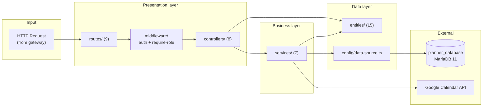
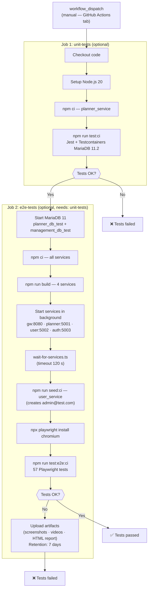

# Chapter 6 — IMPLEMENTATION

---

## 6.1 Application Structure

The architecture diagrams and deployment topology are covered in **§5.1 of Chapter 5**. What follows here is the internal organisation of each component — how each one is structured and what it exposes — following the ARC42 Building Block View at level 2.

---

### 6.1.1 webapp — Frontend application

The frontend is a single-page application that runs entirely in the browser; it communicates exclusively with the API gateway. The code is organised by functional domain — calendar, classroom, degree, group, subject, user, and change requests — each with its own pages, components, and data-fetching hooks. Shared UI primitives and layout components live in a common layer used across all domains. A global authentication context controls access to protected pages based on the user's role.

The application has 17 routes. Some are public, others require an authenticated session, and a few are restricted to a specific role (administrator or professor):

| Route | Description | Access |
|---|---|---|
| `/` | Landing page | Public |
| `/login` | Login | Public |
| `/forgot-password` | Password recovery | Public |
| `/activate` | Account activation | Public |
| `/home` | Home page | With layout |
| `/degrees` | Degree programme listing | With layout |
| `/degrees/:acronym/courses` | Academic years for a degree | With layout |
| `/degrees/:acronym/courses/:startYear/:endYear/semester/:semester/calendar` | Calendar view for a course | With layout |
| `/degrees/:acronym/courses/.../solicitudes` | Change requests for a course | With layout |
| `/degrees/:acronym/courses/.../groups` | Groups for a course | With layout |
| `/degrees/:acronym/courses/.../subjects` | Subjects for a course | With layout |
| `/classrooms` | Classroom listing | With layout |
| `/settings` | User settings | **Protected** |
| `/calendar-sync` | Google Calendar synchronisation | **Protected** |
| `/users` | User management | **Protected** |
| `/solicitudes` | All change requests | **Protected** (ADMIN) |
| `/my-requests` | My submitted requests | **Protected** (PROFESSOR) |
| `*` | — | Redirect to `/` |

> **Note:** two additional pages — for audit logs and for reports — exist in the source but are not yet connected to the router. They are planned extensions described in §8.2.

The shared UI layer provides generic components that eliminate repeated patterns across the application. Three of them underpin most of the form and table structure:

| Component | Description | Used by |
|---|---|---|
| Generic data table | Table with column filtering, visibility toggling, sorting, pagination, and optional multi-selection; used by all five main entity listings. | 5 domain listings |
| Generic form drawer | Slide-in panel with a header, scrollable body, and a footer with Cancel/Save buttons that disable when the form is invalid or a request is in progress; used by all creation and editing forms. | 10 domain forms |
| Required field label | Label wrapper that adds a visible asterisk and screen-reader-accessible text to mark mandatory fields consistently across all forms. | All creation and editing forms |

Five additional custom components cover input controls — a time picker, a searchable dropdown, a multi-value selector, a password-strength indicator, and a loading spinner — that have no direct equivalent in the shared UI library.

---

### 6.1.2 gateway\_service — API Gateway

The gateway is the sole external entry point for all backend traffic: it receives requests from the frontend, routes them to the appropriate internal service (authentication, user management, or scheduling), and returns the response. It contains no business logic and touches no database.

---

### 6.1.3 auth\_service — Authentication service

The authentication service manages all aspects of user identity. It handles account registration and activation, login with email and password, password recovery via one-time code sent by email, JWT token issuance and validation, and the OAuth flow used to link a user's account to their Google profile (required for calendar synchronisation). It exposes an HTTP API consumed exclusively through the gateway and shares the user database with the user management service.

---

### 6.1.4 user\_service — User management service

The user management service is responsible for user account administration — including bulk import from Excel files — and shares the user database with the authentication service. All its operations are exposed through the gateway.

---

### 6.1.5 planner\_service — Scheduling service (business core)

The scheduling service is the most complex component in the system. It owns the entire academic domain: degree programmes, academic years, calendars, subjects, groups, classrooms, one-off events, recurring events, change requests, and Google Calendar synchronisation state. It is structured into three internal layers — presentation (routes and controllers), business logic (services), and data access (entities) — and communicates with the Google Calendar API as an external dependency. Conflict detection across all event operations is handled by a dedicated utility that checks both group-level and classroom-level overlaps before any write is committed.

The calendar event expansion service combines one-off and recurring events into the flat, date-ordered list consumed by both the frontend and the Google Calendar sync. For recurring events bound by a planned-hours budget, it uses a **round-robin algorithm** to distribute sessions equitably across all sharing groups — no group accumulates more sessions than another before the budget is exhausted.

The following diagram illustrates the internal layered architecture of the scheduling service:



**Calendar management endpoints**:

The calendar controller is the most extensive in the system, with 20 endpoints covering the full management of the academic calendar and its events:

| Verb | Route | Required role | Description |
|---|---|---|---|
| `GET` | `/calendars/active` | — | Active calendars in the system |
| `GET` | `/calendar/:id` | — | Calendar details |
| `GET` | `/calendar/:id/days` | — | Calendar days with their one-off events |
| `GET` | `/calendar/:id/events` | — | All expanded events of the calendar |
| `GET` | `/calendar/:id/pending-requests` | ADMIN or PROFESSOR | Pending requests represented as events |
| `GET` | `/calendar/:id/export` | — | Exports the calendar to a ZIP file with TXT files |
| `POST` | `/calendar` | ADMIN | Creates a new empty calendar |
| `POST` | `/calendar/import` | ADMIN | Creates a calendar from an Excel file |
| `POST` | `/calendar/:calendarId/import-exceptions` | ADMIN | Imports exceptions (public holidays, special days) |
| `POST` | `/calendar/duplicate` | ADMIN | Duplicates an existing calendar |
| `POST` | `/calendar/puntual-event` | ADMIN | Creates a one-off event |
| `POST` | `/calendar/periodic-event` | ADMIN | Creates a standard recurring event (N/P/I) |
| `POST` | `/calendar/custom-periodic-event` | ADMIN | Creates a recurring event with a custom character |
| `POST` | `/calendar/replace-event` | ADMIN | Cancels a recurring event and creates its replacement |
| `PUT` | `/calendar/puntual-event/:eventId` | ADMIN | Edits a one-off event |
| `PUT` | `/calendar/periodic-event/:eventId` | ADMIN | Edits a standard recurring event |
| `PUT` | `/calendar/custom-periodic-event` | ADMIN | Edits a recurring event with a custom character |
| `DELETE` | `/calendar/puntual-event/:eventId` | ADMIN | Deletes a one-off event |
| `DELETE` | `/calendar/periodic-event/:eventId` | ADMIN | Deletes a recurring event |
| `DELETE` | `/calendar/:id` | ADMIN | Deletes a calendar and all its dependent entities |

---

### 6.1.6 Databases

The system uses two completely independent MariaDB 11 databases:

| Database | Owning services | Managed entities |
|---|---|---|
| Authentication and user database | Authentication service, user management service | User accounts (credentials and profile) |
| Scheduling database | Scheduling service | 13 academic domain entities (calendars, events, groups, classrooms, etc.) |

This separation guarantees that a failure or migration in the scheduling database does not affect authentication, and vice versa.

The deployment configuration — Dockerfiles, Docker Compose profiles, and CI/CD pipeline structure — is described in **§5.1.3 of Chapter 5**.

---

## 6.2 Test Implementation

The testing strategy — what is tested and why — is defined in **§5.3 of Chapter 5**. This section covers the concrete implementation: execution scripts, test case tables, and the CI/CD pipeline.

---

### 6.2.1 Integration tests — Jest + Testcontainers

#### Infrastructure

Each integration test suite starts its own ephemeral database container, runs against it, and tears it down on completion. The schema is synchronised automatically at startup, and the database is wiped between individual tests so each one starts clean. The full suite is designed for **27 test cases across 8 files**; 7 of those cases (2 files) are currently implemented and the rest are planned.

#### Execution scripts

```bash
cd planner_service

# Run all tests
npm test

# With coverage report
npm run test:coverage

# Integration tests only
npm run test:integration

# Watch mode (during development)
npm run test:watch

# CI mode (single worker, with coverage)
npm run test:ci
```

The test timeout is set to 60 seconds to accommodate the time needed to start the database container.

#### Test cases

**Calendar deletion tests**

| ID | Description | Precondition | Expected result |
|---|---|---|---|
| TC-INT-01 | Cascade deletion of Calendar with dependent entities | Calendar with 1 Subject, 1 Group, 2 Days, 1 one-off event and 1 recurring event | Calendar, Subject, Group, Days and all events deleted; Degree and Course remain |
| TC-INT-02 | Deletion of Calendar with no dependent entities | Empty Calendar (no events, no groups, no days) | Calendar deleted; Degree and Course remain |

**Classroom deletion tests**

| ID | Description | Precondition | Expected result |
|---|---|---|---|
| TC-INT-03 | Forced deletion of Classroom with related events | Classroom with 1 one-off event and 1 recurring event | Classroom and both events deleted; Group and Calendar remain |
| TC-INT-04 | Rejection of deletion when the classroom has related events | Classroom with 1 associated one-off event | Deletion rejected; HTTP 409 returned because the classroom still has related events |
| TC-INT-05 | Deletion of Classroom with no events | Classroom with no associated events | Classroom no longer exists in the database |
| TC-INT-06 | Classroom code uniqueness — duplicate rejected | Classroom with a given code already existing | Second creation rejected with a uniqueness error |
| TC-INT-07 | Creation of two Classrooms with different codes | Empty database | Both records are present in the database |

**Subject deletion tests**

| ID | Description | Precondition | Expected result |
|---|---|---|---|
| TC-INT-08 | Cascade deletion of Subject with groups and events | Subject with 2 Groups, each with one-off and recurring events | Subject, Groups and all associated events deleted; Calendar and Course remain |
| TC-INT-09 | Deletion of Subject with no groups | Empty Subject (no groups) | Subject deleted; Calendar and Course remain |
| TC-INT-10 | Subject acronym uniqueness — duplicate rejected | Subject with a given acronym already existing | Creation rejected with a uniqueness constraint error |

**Degree cascade deletion tests**

| ID | Description | Precondition | Expected result |
|---|---|---|---|
| TC-INT-11 | Full cascade deletion Degree → Course → Calendar → events | Degree with 1 Course, 1 Calendar, 1 Subject, 1 Group, 2 Days, 1 one-off event, 1 recurring event | All entities deleted; nothing remains in the database |
| TC-INT-12 | Deletion of Degree with no associated courses | Degree with no courses | Degree no longer exists in the database |
| TC-INT-13 | Degree name uniqueness — duplicate rejected | Degree with a given name already existing | Creation rejected with a uniqueness constraint error |

**Group planned-hours tests**

| ID | Description | Precondition | Expected result |
|---|---|---|---|
| TC-INT-14 | Creation of Group with valid planned hours | Calendar and Subject existing; 60 planned hours configured | Group created with 60 planned hours; value correctly persisted |
| TC-INT-15 | Multiple groups within same Subject — independent planned hours | Subject with 2 Groups (30h and 45h) | Both groups exist; hours are stored independently |
| TC-INT-16 | Deletion of Group deletes associated events | Group with 1 one-off event and 1 recurring event | Group and both events deleted; Subject and Calendar remain |

**Recurring event creation tests**

| ID | Description | Precondition | Expected result |
|---|---|---|---|
| TC-INT-17 | Creation of recurring event with weekly recurrence (type N) | Group and Classroom existing | Recurring event created with weekly recurrence; one record in the database |
| TC-INT-18 | Creation of recurring event with bi-weekly even-week recurrence (type P) | Group and Classroom existing | Recurring event created with bi-weekly even-week recurrence; one record in the database |
| TC-INT-19 | Multiple recurring events in same Group with different recurrence types | Group with two recurring events of different types | Both events exist and are distinguishable by their recurrence type |

**Calendar day creation tests**

| ID | Description | Precondition | Expected result |
|---|---|---|---|
| TC-INT-20 | Creation of a day with even-week character | Calendar existing | Day correctly persisted with even-week recurrence character |
| TC-INT-21 | Creation of days with different recurrence characters in same Calendar | Calendar existing | 3 days (even-week, odd-week, custom) created and retrievable by their recurrence character |

**Authentication integration tests**

| ID | Description | Precondition | Expected result |
|---|---|---|---|
| TC-INT-22 | Successful user registration stores hashed password | Empty users table | User created; password stored in hashed form; login with original password succeeds |
| TC-INT-23 | Login with correct credentials returns a token | User registered in the database | Response includes a valid access token containing the user's identity and role |
| TC-INT-24 | Login with incorrect password rejected | User registered in the database | Authentication rejected; no token issued |
| TC-INT-25 | Duplicate email registration rejected | User with a given email already existing | Registration rejected with a uniqueness constraint error |

**User management integration tests**

| ID | Description | Precondition | Expected result |
|---|---|---|---|
| TC-INT-26 | User creation with administrator role | Empty users table | User created with administrator role; one record in the database |
| TC-INT-27 | Role update persisted correctly | User with standard user role | Role updated to administrator; change correctly persisted |

The following is a representative fragment of test TC-INT-01, illustrating the *Arrange–Act–Assert* pattern used:

```typescript
// ARRANGE: create full structure
const calendar = await calendarRepo.save(
  calendarRepo.create({ start: new Date('2024-09-01'), end: new Date('2025-01-31'), semester: 1, course })
);
// ... (creation of Subject, Group, Days, PuntualEvent, PeriodicEvent)

// ACT: cascade deletion (replicating the controller logic)
await periodicEventRepo.remove(periodicEvents);
await puntualEventRepo.remove(day.puntualEvents);
await groupRepo.remove(groups);
await calendarRepo.remove(calendar);   // CASCADE deletes Subject and Day

// ASSERT
expect(await calendarRepo.count()).toBe(0);
expect(await subjectRepo.count()).toBe(0);
expect(await groupRepo.count()).toBe(0);
expect(await puntualEventRepo.count()).toBe(0);
expect(await periodicEventRepo.count()).toBe(0);
// Degree and Course must NOT be deleted
expect(await degreeRepo.count()).toBe(1);
expect(await courseRepo.count()).toBe(1);
```

---

### 6.2.2 End-to-end tests — Playwright

#### Infrastructure

The data isolation strategy is described in **§5.3.4 of Chapter 5**. To run the suite locally, all four backend services must be running, a test administrator account must exist (created with the provided seeding script), and the environment must be set to development mode.

#### Execution scripts

```bash
cd webapp

# Clean database and run tests (recommended for local development)
npm run test:e2e:clean       # equivalent to: npm run clean:test-db && playwright test

# Run without cleaning database
npm run test:e2e

# Clean database only
npm run clean:test-db

# CI mode (cleans DB + tests + html,github reporter)
npm run test:e2e:ci          # equivalent to: npm run clean:test-db && playwright test --reporter=html,github

# Playwright interactive UI mode
npm run test:e2e:ui

# Step-by-step debug mode
npm run test:e2e:debug

# View HTML report of the last run
npm run test:e2e:report
```

Tests run in parallel locally and sequentially in CI. Retries are enabled only in CI (up to 2 per test). Screenshots and videos are captured on failure in both environments.

#### Test cases

**Authentication tests — 6 tests**

| ID | Test name | Main verification |
|---|---|---|
| TC-E2E-01 | should display login form | Login page visible; email, password and submit fields present |
| TC-E2E-02 | should show validation error for empty fields | Submission without filling fields; page remains on login |
| TC-E2E-03 | should show error for incorrect credentials | Wrong credentials; error message visible |
| TC-E2E-04 | should login successfully with valid credentials | Login with a valid administrator account; redirect to home page |
| TC-E2E-05 | should navigate to different pages after login | Navigation to classrooms and degrees pages without session loss |
| TC-E2E-06 | should logout successfully | Click on logout; redirect to landing page |

**Classroom tests — 8 tests**

| ID | Test name | Main verification |
|---|---|---|
| TC-E2E-07 | should display classrooms list | Classrooms page visible; correct table headers present |
| TC-E2E-08 | should create new classroom successfully | Creation with a unique code generated for the test; success alert; row visible in table |
| TC-E2E-09 | should show error when creating classroom with duplicate code | Second classroom with same code; error message |
| TC-E2E-10 | should edit classroom successfully | Code field is read-only after creation; GIS URL updated; success alert |
| TC-E2E-11 | should delete classroom without events | Confirmation dialog; success alert; row removed from table |
| TC-E2E-12 | should delete classroom with related events (force delete) | Dialog with cascade events warning; forced deletion confirmed |
| TC-E2E-13 | should cancel delete operation | Cancel clicked; classroom remains in the table |
| TC-E2E-14 | should filter classrooms by code | Filter applied; only the matching row is shown |

**Academic year tests — 9 tests**

| ID | Test name | Main verification |
|---|---|---|
| TC-E2E-15 | should display courses list | Academic year listing visible |
| TC-E2E-16 | should create new course successfully | Creation with unique start/end year; confirmation visible |
| TC-E2E-17 | should show error when creating course with duplicate year | Same academic year; error message |
| TC-E2E-18 | should edit course state successfully | State change; confirmation alert |
| TC-E2E-19 | should delete course successfully | Confirmation dialog; course deleted |
| TC-E2E-20 | should cancel delete operation | Cancel clicked; course remains |
| TC-E2E-21 | should filter courses by academic year | Filter applied; matching rows shown |
| TC-E2E-22 | should validate required fields in create form | Save button disabled if required fields are missing |
| TC-E2E-23 | should have default state as Planned | The default state when creating a new academic year is "Planned" |

**Degree programme tests — 9 tests**

| ID | Test name | Main verification |
|---|---|---|
| TC-E2E-24 | should display degrees list | Degree programmes page visible; name and acronym columns present |
| TC-E2E-25 | should create new degree successfully | Creation with unique name and acronym; success alert |
| TC-E2E-26 | should show error when creating degree with duplicate acronym | Duplicate acronym; error message |
| TC-E2E-27 | should edit degree successfully | Name and acronym modification; success alert |
| TC-E2E-28 | should delete degree successfully | Dialog with cascade warning; success alert |
| TC-E2E-29 | should cancel delete operation | Cancel clicked; degree programme remains |
| TC-E2E-30 | should filter degrees by name | Filter applied; only the matching degree shown |
| TC-E2E-31 | should validate required fields in create form | Save button disabled with empty or partially filled fields |
| TC-E2E-32 | should enforce uppercase on acronym field | Lowercase input automatically converted to uppercase |

**Subject tests — 10 tests**

| ID | Test name | Main verification |
|---|---|---|
| TC-E2E-33 | should display subjects list | Subject listing visible |
| TC-E2E-34 | should create new subject successfully | Creation with unique acronym and SIES code; confirmation |
| TC-E2E-35 | should show error when creating subject with duplicate acronym | Duplicate acronym; error message |
| TC-E2E-36 | should edit subject successfully | Field modification; confirmation alert |
| TC-E2E-37 | should delete subject successfully | Confirmation dialog; subject deleted |
| TC-E2E-38 | should cancel delete operation | Cancel clicked; subject remains |
| TC-E2E-39 | should validate required fields in create form | Save button disabled if required fields are missing |
| TC-E2E-40 | should enforce uppercase on name field | Subject name automatically converted to uppercase |
| TC-E2E-41 | should display correct year options (0–4) | Year selector shows options from 0 to 4 |
| TC-E2E-42 | should delete multiple subjects in bulk | Multiple selection and bulk deletion; all selected records deleted |

**Calendar tests — 8 tests**

| ID | Test name | Main verification |
|---|---|---|
| TC-E2E-43 | should display calendars list | Calendars page visible; semester and date columns present |
| TC-E2E-44 | should create new calendar successfully | Creation with start/end date and semester; success alert; row visible in table |
| TC-E2E-45 | should show error when end date is before start date | Invalid date range; error message visible |
| TC-E2E-46 | should edit calendar dates successfully | Date modification; success alert |
| TC-E2E-47 | should delete calendar successfully | Cascade warning dialog; success alert; row removed |
| TC-E2E-48 | should cancel delete operation | Cancel clicked; calendar remains in table |
| TC-E2E-49 | should filter calendars by semester | Filter applied; only matching rows shown |
| TC-E2E-50 | should validate required fields in create form | Save button disabled if start date, end date or semester is missing |

**Group tests — 7 tests**

| ID | Test name | Main verification |
|---|---|---|
| TC-E2E-51 | should display groups list | Group listing visible with name and planned hours columns |
| TC-E2E-52 | should create new group successfully | Creation with name and hours; success alert; row visible in table |
| TC-E2E-53 | should show error when planned hours is zero or negative | Validation error for non-positive hours value |
| TC-E2E-54 | should edit group successfully | Hours modification; success alert |
| TC-E2E-55 | should delete group successfully | Confirmation dialog; success alert; row removed |
| TC-E2E-56 | should cancel delete operation | Cancel clicked; group remains in table |
| TC-E2E-57 | should validate required fields in create form | Save button disabled if name or planned hours is missing |

**Total: 57 E2E tests** (6 + 8 + 9 + 9 + 10 + 8 + 7).

> *The authentication, classroom, academic year, degree, and subject suites are currently implemented (42 tests). The calendar and group suites are designed and planned for implementation.*

The following is a representative fragment of an E2E test (degree programme creation), illustrating the use of semantic selectors and the timestamp-based unique data strategy:

```typescript
test('should create new degree successfully', async ({ page }) => {
  const uniqueId = String(Date.now()).slice(-6);
  const degreeName = `INGENIERÍA AEROESPACIAL AVANZADA`;
  const acronym   = `IAA${uniqueId}`;

  await clickCreateButton(page);
  await page.getByLabel(/name|nombre/i).fill(degreeName);
  await page.getByLabel(/acronym|acrónimo/i).fill(acronym);
  await page.getByRole('button', { name: /save|guardar/i }).click();

  await expectSuccessAlert(page, ALERT_MESSAGES.CREATED);
  await filterAndFindRow(page, degreeName);
  await expect(page.getByText(acronym)).toBeVisible();
});
```

---

### 6.2.3 CI/CD execution — GitHub Actions

Tests run on **GitHub Actions** as part of the deployment workflows, triggered manually from the repository's Actions tab. There is no standalone test workflow: integration and end-to-end jobs are embedded directly in the deployment workflows. When starting a run, the operator selects via checkboxes whether to run tests only, the deployment only, or the full pipeline.



**Services verified in CI:**

In the CI environment all services run on the same host, so each one is accessed directly by its port rather than going through the gateway:

| Service | Port | Health check (direct access) |
|---|---|---|
| Gateway service | 8080 | `GET http://localhost:8080/api/degrees` |
| Scheduling service | 5001 | `GET http://localhost:5001/degrees` |
| User management service | 5002 | `GET http://localhost:5002/health` |
| Authentication service | 5003 | `GET http://localhost:5003/health` |
| MariaDB (CI) | 3306 | `mariadb-admin ping` (Docker service health check) |

Two isolated test databases are used: one for the scheduling domain and one for user and authentication entities.

On failure, the workflow uploads screenshots, videos, backend logs, and an HTML report as artefacts. These are retained for **7 days** and are accessible from the Actions tab under the failed run.

**Estimated execution times:**

| Phase | Estimated time |
|---|---|
| MariaDB setup + dependency installation + compilation | ~3–4 minutes |
| Service startup and wait | ~30–60 seconds |
| Integration tests (Jest + Testcontainers) | ~30–60 seconds |
| E2E tests (Playwright) | ~3–4 minutes |
| **Total** | **~7–9 minutes** |
