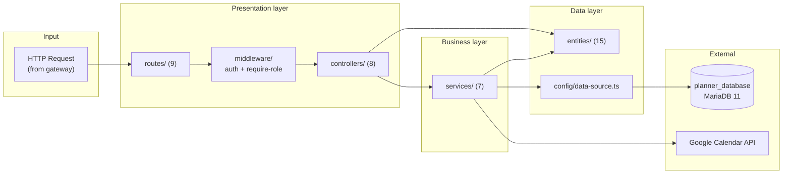
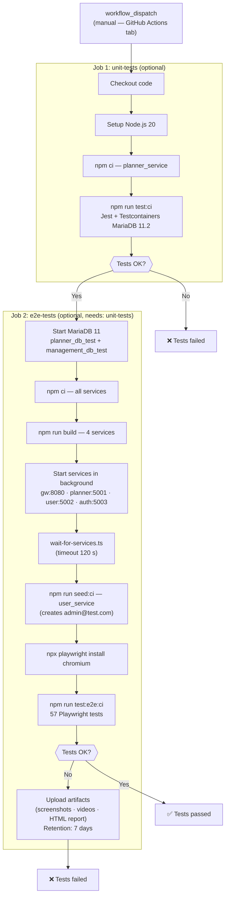

# Chapter 6 — IMPLEMENTATION

---

## 6.1 Application Structure

The overall system architecture, including the component block diagram and the deployment diagram, has been described in **§5.1 of Chapter 5**. This section describes the internal code organisation of each component following the white-box view of the ARC42 standard (*Building Block View, Level 2*).

---

### 6.1.1 webapp — Frontend application

The frontend is a single-page application (*SPA*) built with React 19 and TypeScript. Its internal structure follows an organisation by functional domain, which facilitates the location and maintenance of each module.


**Generic components in `ui/`:**

The `components/ui/` folder contains 40 files: **32 Radix UI primitives** generated with shadcn/ui (not directly modified) and **8 project-owned components** maintained manually. The three most relevant for the form architecture are:

| Component | Description | Direct uses |
|---|---|---|
| `DataTable<T>` | Generic table with TanStack React Table: column filtering, column visibility, sorting, pagination (10 rows/page) and optional multi-selection. Replaces the ~40 lines of repeated logic across 5 identical tables (Classroom, Course, Degree, Subject, User). | 5 domain tables |
| `FormDrawer` | Generic form drawer with i18n header, scrollable content area and footer with Cancel/Save buttons (disabled according to `isValid` and `isLoading`). Replaces the repeated shell across 10 creation/editing drawers. | 10 domain drawers |
| `RequiredLabel` | Wraps a `<label>` adding a red asterisk and `(required)` text accessible to screen readers. Standardises the visual marking of required fields across project forms. | Creation/editing forms |

The five additional project-owned components (`spinner.tsx`, `time-picker.tsx`, `searchable-select.tsx`, `password-requirements.tsx`, `multi-select.tsx`) encapsulate input controls that have no direct equivalent in the shadcn/ui library.

**Application routes:**

| Route | Component | Access |
|---|---|---|
| `/` | Start | Public |
| `/login` | LoginPage | Public |
| `/forgot-password` | ForgotPasswordPage | Public |
| `/activate` | ActivatePage | Public |
| `/home` | HomePage | With layout |
| `/degrees` | DegreePage | With layout |
| `/degrees/:acronym/courses` | CoursePage | With layout |
| `/degrees/:acronym/courses/:startYear/:endYear/semester/:semester/calendar` | CalendarPage | With layout |
| `/degrees/:acronym/courses/.../solicitudes` | SolicitudPage | With layout |
| `/degrees/:acronym/courses/.../groups` | GroupPage | With layout |
| `/degrees/:acronym/courses/.../subjects` | SubjectPage | With layout |
| `/classrooms` | ClassroomPage | With layout |
| `/settings` | SettingsPage | **Protected** |
| `/calendar-sync` | CalendarSyncPage | **Protected** |
| `/users` | UserPage | **Protected** |
| `/solicitudes` | AllSolicitudesPage | **Protected** (ADMIN) |
| `/my-requests` | MyRequestsPage | **Protected** (PROFESSOR) |
| `*` | — | Redirect to `/` |

> **Note:** the files `webapp/src/pages/LogsPage.tsx` and `webapp/src/pages/ReportPage.tsx` exist in the source code but have no registered route in `App.tsx`. They are pages under development pending inclusion in the router.

---

### 6.1.2 gateway_service — API Gateway

The gateway acts as the sole external entry point for the backend. Its structure is deliberately simple: it contains no business logic or database access.

```
gateway_service/src/
├── app.ts                        # Express initialisation, CORS, Multer, route registration
├── index.ts                      # Entry point (listen)
├── config/
│   └── services.ts               # Base URLs of the internal services
├── controllers/
│   ├── auth.controller.ts        # Proxy to auth_service
│   ├── planner.controller.ts     # Proxy to planner_service (largest volume of endpoints)
│   ├── user.controller.ts        # Proxy to user_service
│   └── status.controller.ts      # Health endpoint /status
├── routes/
│   ├── auth.routes.ts
│   ├── planner.routes.ts
│   ├── user.routes.ts
│   └── status.routes.ts
└── utils/
    └── proxy.ts                  # Abstraction of the outgoing HTTP call (Axios)
```

---

### 6.1.3 auth_service — Authentication service

Manages user identity: registration, activation, JWT login, Google OAuth integration and password reset.

```
auth_service/src/
├── app.ts · index.ts · env.ts
├── config/
│   └── data-source.ts            # TypeORM connection → management_database
├── controllers/
│   └── auth.controller.ts
├── entities/
│   └── user.entity.ts            # User entity (shared DB management with user_service)
├── middleware/
│   ├── auth.middleware.ts        # Incoming JWT validation
│   └── validate.middleware.ts    # Request body validation with Zod
├── routes/
│   └── auth.routes.ts            # POST /login /validate /logout /forgot-password /verify-otp /reset-password /activate · GET /profile · GET+POST /google/*
├── schemas/
│   └── auth.schemas.ts           # Zod validation schemas
├── services/
│   ├── auth.service.ts           # Main authentication logic
│   ├── email.service.ts          # Email sending (activation, reset)
│   ├── google-oauth.service.ts   # Google OAuth 2.0 integration
│   └── password-reset.service.ts
├── scripts/
│   └── seed-database.ts          # Data initialisation script
├── types/
│   └── auth.types.ts
└── utils/
    └── jwt.ts                    # JWT token generation and verification
```

---

### 6.1.4 user_service — User management service

Manages the user lifecycle (creation, deletion, modification, query) and allows bulk import from **Excel (XLSX)** files. User creation includes email format validation (Zod schema) and duplicate email detection: if the email already exists in the database, the service returns **HTTP 409** with a localised error message (ES/EN).

```
user_service/src/
├── app.ts · index.ts · env.ts
├── config/
│   ├── data-source.ts            # TypeORM connection → management_database
│   └── email.config.ts
├── controllers/
│   └── user.controller.ts
├── entities/
│   └── user.entity.ts
├── middleware/
│   ├── error.middleware.ts
│   └── validate.middleware.ts
├── routes/
│   └── user.routes.ts            # CRUD + bulk import
├── schemas/
│   └── user.schemas.ts
├── service/                      # Note: singular folder name
│   ├── user.service.ts
│   ├── user-import.service.ts    # Excel/XLSX processing (bulk import)
│   └── email.service.ts
├── types/
│   └── user.types.ts
└── utils/
    └── jwt.ts
```

---

### 6.1.5 planner_service — Scheduling service (business core)

It is the most complex component of the system. It manages all academic domain entities and exposes 9 route groups.

```
planner_service/src/
├── app.ts · index.ts · env.ts
├── config/
│   └── data-source.ts            # TypeORM connection → planner_database
├── constants/
│   └── event-characters.constants.ts
├── controllers/           # 8 controllers
│   ├── calendar.controller.ts
│   ├── classroom.controller.ts
│   ├── course.controller.ts
│   ├── degree.controller.ts
│   ├── event-request.controller.ts
│   ├── group.controller.ts
│   ├── subject.controller.ts
│   └── test.controller.ts        # Cleanup endpoint for tests
├── entities/              # 15 entity files; 13 registered in the DataSource (excludes audited.entity —abstract class— and request.entity —unregistered auxiliary—)
│   ├── audited.entity.ts         # Abstract base class (id, createdAt/By, updatedAt/By)
│   ├── api-quota-counter.entity.ts  # Global counters for Google Calendar API quota
│   ├── calendar.entity.ts
│   ├── calendar-sync.entity.ts
│   ├── classroom.entity.ts
│   ├── course.entity.ts
│   ├── day.entity.ts
│   ├── degree.entity.ts
│   ├── event-request.entity.ts
│   ├── google-classroom-calendar.entity.ts
│   ├── group.entity.ts
│   ├── periodic_event.entity.ts
│   ├── puntual_event.entity.ts
│   ├── request.entity.ts
│   └── subject.entity.ts
├── middleware/
│   ├── auth.middleware.ts
│   └── require-role.middleware.ts
├── routes/                # 9 route files
│   ├── calendar.routes.ts
│   ├── calendar-sync.routes.ts
│   ├── classrooms.routes.ts
│   ├── course.routes.ts
│   ├── degree.routes.ts
│   ├── event-request.routes.ts
│   ├── group.routes.ts
│   ├── subject.routes.ts
│   └── test.routes.ts
├── services/              # 7 services
│   ├── calendar-events.service.ts    # Expansion of recurring events to concrete dates; round-robin algorithm for groups with shared hours
│   ├── calendar-formatting.service.ts
│   ├── calendar-import.service.ts
│   ├── calendar-repository.service.ts
│   ├── event-request.service.ts
│   ├── google-calendar.service.ts    # Communication with Google Calendar API v3
│   └── validation.service.ts         # UUID validation and entity existence checks
├── utils/
│   └── conflict-detection.utils.ts  # Schedule conflict detection (group/classroom) across 6 operations
└── __tests__/
    ├── setup/
    │   └── testDatabase.ts       # Testcontainers setup/teardown
    └── integration/
        ├── calendar.delete.test.ts
        └── classroom.delete.test.ts
```

The `calendar-events.service.ts` service deserves special mention for its complexity. Its public method `generateCalendarEvents(calendarId)` combines one-off and recurring events into a chronologically sorted list. For recurring events of type `N` (Normal) with `planifiedHours` configured, it implements a **round-robin algorithm**: it distributes each teaching week's sessions equitably among all groups sharing a hours budget, so that no group accumulates more sessions than another before the group's total budget is exhausted. This mechanism guarantees that the count of delivered hours respects the academic contract defined in `Group.planifiedHours`.

The following diagram illustrates the internal layered architecture of `planner_service`:



**Calendar controller endpoints** (`calendar.controller.ts`):

The calendar controller is the most extensive in the system, with 20 endpoints covering the full management of the academic calendar and its events:

| Verb | Route | Required role | Description |
|---|---|---|---|
| `GET` | `/calendars/active` | — | Active calendars in the system |
| `GET` | `/calendar/:id` | — | Calendar details |
| `GET` | `/calendar/:id/days` | — | Calendar days with their one-off events |
| `GET` | `/calendar/:id/events` | — | All expanded events of the calendar |
| `GET` | `/calendar/:id/pending-requests` | ADMIN or PROFESSOR | Pending requests represented as events |
| `GET` | `/calendar/:id/export` | — | Exports the calendar to a ZIP file with TXT files |
| `POST` | `/calendar` | ADMIN | Creates a new empty calendar |
| `POST` | `/calendar/import` | ADMIN | Creates a calendar from an Excel file |
| `POST` | `/calendar/:calendarId/import-exceptions` | ADMIN | Imports exceptions (public holidays, special days) |
| `POST` | `/calendar/duplicate` | ADMIN | Duplicates an existing calendar |
| `POST` | `/calendar/puntual-event` | ADMIN | Creates a one-off event |
| `POST` | `/calendar/periodic-event` | ADMIN | Creates a standard recurring event (N/P/I) |
| `POST` | `/calendar/custom-periodic-event` | ADMIN | Creates a recurring event with a custom character |
| `POST` | `/calendar/replace-event` | ADMIN | Cancels a recurring event and creates its replacement |
| `PUT` | `/calendar/puntual-event/:eventId` | ADMIN | Edits a one-off event |
| `PUT` | `/calendar/periodic-event/:eventId` | ADMIN | Edits a standard recurring event |
| `PUT` | `/calendar/custom-periodic-event` | ADMIN | Edits a recurring event with a custom character |
| `DELETE` | `/calendar/puntual-event/:eventId` | ADMIN | Deletes a one-off event |
| `DELETE` | `/calendar/periodic-event/:eventId` | ADMIN | Deletes a recurring event |
| `DELETE` | `/calendar/:id` | ADMIN | Deletes a calendar and all its dependent entities |

---

### 6.1.6 Databases

The system uses two completely independent MariaDB 11 databases:

| Database | Owning service | Managed entities |
|---|---|---|
| `management_database` | `auth_service`, `user_service` | `User` (authentication and user profile) |
| `planner_database` | `planner_service` | 13 academic domain entities registered in the DataSource |

This separation guarantees that a failure or migration in the scheduling database does not affect authentication, and vice versa.

---

### 6.1.7 Deployment view — Textual summary

See **§5.1.3** of Chapter 5 for the complete UML deployment diagram. The most relevant aspects from the implementation perspective are:

- Each component has its own `Dockerfile` (7 in total). The `webapp` image uses **Caddy** as the web server, configured to serve HTTPS using the university-issued GEANT TLS certificate supplied via GitHub Secrets.
- In the development environment, all services are started with `docker-compose.dev.yml`, which mounts the source directories as volumes to allow hot-reload.
- In production (Azure VM), `docker-compose.azure.yml` uses pre-built images published in GitHub Container Registry following the convention `ghcr.io/murias10/teachingplanner/{service}:latest`. Only `gateway_service` (port 8080) and `webapp` (443/80) are accessible from the outside.
- The CI/CD pipeline (GitHub Actions) runs tests on each *pull request* before authorising the merge. The manual deployment mechanism (`workflow_dispatch`) and its justification are described in **§5.1.3**.

---

## 6.2 Test Implementation

The testing strategy and design (what is tested and why) have been defined in **§5.3 of Chapter 5**. This section describes the concrete implementation: tools, scripts, test cases with their expected results and the continuous integration mechanism.

---

### 6.2.1 Integration tests — Jest + Testcontainers

#### Infrastructure

The integration tests are distributed across **`planner_service/src/__tests__/integration/`**, **`auth_service/src/__tests__/integration/`** and **`user_service/src/__tests__/integration/`**, and run with **Jest 30** and TypeScript support via `ts-jest`. The distinctive feature of this suite is the use of **Testcontainers** (`@testcontainers/mariadb 11.2`): before each suite begins, an ephemeral MariaDB container is automatically started with a dedicated test database where TypeORM synchronises the full schema (`synchronize: true`). Upon completion, the container is destroyed. The suite totals **8 test files and 27 test cases**.

The lifecycle of each suite is:

```
beforeAll  → setupTestDatabase()    — starts MariaDB 11.2 container (timeout: 120 s)
afterEach  → cleanDatabase()        — deletes all records between tests
afterAll   → teardownTestDatabase() — destroys the container
```

#### Execution scripts

```bash
cd planner_service

# Run all tests
npm test

# With coverage report (generates coverage/lcov-report/index.html)
npm run test:coverage

# Integration tests only
npm run test:integration

# Watch mode (during development)
npm run test:watch

# CI mode (--ci --coverage --maxWorkers=2)
npm run test:ci
```

**Relevant `jest.config.js` configuration:**

| Parameter | Value | Reason |
|---|---|---|
| `preset` | `ts-jest` | TypeScript support |
| `testEnvironment` | `node` | Node.js environment (not DOM) |
| `testTimeout` | `60000` ms | Testcontainers startup time |
| `forceExit` | `true` | Prevents Jest from hanging after destroying the container |
| `clearMocks` | `true` | Clears mocks between tests |
| `resetMocks` | `true` | Resets mock state between tests |
| `restoreMocks` | `true` | Restores original implementations between tests |

#### Test cases

**File: `calendar.delete.test.ts`**

| ID | Description | Precondition | Expected result |
|---|---|---|---|
| TC-INT-01 | Cascade deletion of Calendar with dependent entities | Calendar with 1 Subject, 1 Group, 2 Days, 1 PuntualEvent and 1 PeriodicEvent | Calendar, Subject, Group, Days, PuntualEvent and PeriodicEvent deleted; Degree and Course remain |
| TC-INT-02 | Deletion of Calendar with no dependent entities | Empty Calendar (no events, no groups, no days) | Calendar deleted; Degree and Course remain |

**File: `classroom.delete.test.ts`**

| ID | Description | Precondition | Expected result |
|---|---|---|---|
| TC-INT-03 | Forced deletion of Classroom with events (`force=true`) | Classroom with 1 PuntualEvent and 1 PeriodicEvent associated | Classroom and both events deleted; Group and Calendar remain |
| TC-INT-04 | Rejection of deletion when `force=false` and events exist | Classroom with 1 associated PuntualEvent | Classroom not deleted; `totalRelatedEvents > 0` and `force === false` (409 Conflict logic verified) |
| TC-INT-05 | Deletion of Classroom with no events | Classroom with no associated events | Classroom deleted; `count() === 0` |
| TC-INT-06 | Classroom code uniqueness — duplicate rejected | Classroom with code `UNIQUE-CODE` already existing | `classroomRepo.save(classroom2)` throws an exception |
| TC-INT-07 | Creation of two Classrooms with different codes | Empty database | Both records created; `count() === 2` |

**File: `subject.delete.test.ts`**

| ID | Description | Precondition | Expected result |
|---|---|---|---|
| TC-INT-08 | Cascade deletion of Subject with groups and events | Subject with 2 Groups, each with PuntualEvent and PeriodicEvent | Subject, Groups and all associated events deleted; Calendar and Course remain |
| TC-INT-09 | Deletion of Subject with no groups | Empty Subject (no groups) | Subject deleted; Calendar and Course remain |
| TC-INT-10 | Subject acronym uniqueness — duplicate rejected | Subject with acronym `SUBJ-DUP` already existing | `subjectRepo.save()` throws unique key violation (error 1062) |

**File: `degree.cascade.test.ts`**

| ID | Description | Precondition | Expected result |
|---|---|---|---|
| TC-INT-11 | Full cascade deletion Degree → Course → Calendar → events | Degree with 1 Course, 1 Calendar, 1 Subject, 1 Group, 2 Days, 1 PuntualEvent, 1 PeriodicEvent | All entities deleted; `count() === 0` for each repository |
| TC-INT-12 | Deletion of Degree with no associated courses | Degree with no courses | Degree deleted; `count() === 0` |
| TC-INT-13 | Degree name uniqueness — duplicate rejected | Degree with name `INGENIERÍA TEST` already existing | `degreeRepo.save()` throws unique key violation |

**File: `group.hours.test.ts`**

| ID | Description | Precondition | Expected result |
|---|---|---|---|
| TC-INT-14 | Creation of Group with valid planifiedHours | Calendar and Subject existing; planifiedHours = 60 | Group created; `planifiedHours === 60` in the retrieved entity |
| TC-INT-15 | Multiple groups within same Subject — independent planifiedHours | Subject with 2 Groups (30h and 45h) | Both groups exist; hours are stored independently |
| TC-INT-16 | Deletion of Group deletes associated events | Group with 1 PuntualEvent and 1 PeriodicEvent | Group and both events deleted; Subject and Calendar remain |

**File: `periodicEvent.create.test.ts`**

| ID | Description | Precondition | Expected result |
|---|---|---|---|
| TC-INT-17 | Creation of PeriodicEvent with eventCharacter N | Group and Classroom existing | PeriodicEvent created with `eventCharacter = 'N'`; `count() === 1` |
| TC-INT-18 | Creation of PeriodicEvent with eventCharacter P | Group and Classroom existing | PeriodicEvent created with `eventCharacter = 'P'`; `count() === 1` |
| TC-INT-19 | Multiple PeriodicEvents in same Group with different characters | Group with PeriodicEvents N and I | Both events exist; retrievable and distinguishable by `eventCharacter` |

**File: `day.create.test.ts`**

| ID | Description | Precondition | Expected result |
|---|---|---|---|
| TC-INT-20 | Creation of Day with dayCharacter P | Calendar existing | Day persisted with `dayCharacter = 'P'` and correct `date`; `count() === 1` |
| TC-INT-21 | Creation of Days with different dayCharacters in same Calendar | Calendar existing | 3 Days (P, I, custom A) created; retrievable by `dayCharacter` |

**File: `auth.integration.test.ts`** (`auth_service/src/__tests__/integration/`)

| ID | Description | Precondition | Expected result |
|---|---|---|---|
| TC-INT-22 | Successful user registration stores hashed password | Empty users table | User created; stored `passwordHash` differs from plain text; `bcrypt.compare()` returns true |
| TC-INT-23 | Login with correct credentials returns JWT | User registered in DB | Response includes `accessToken`; JWT payload contains `userId` and `role` |
| TC-INT-24 | Login with incorrect password rejected | User registered in DB | `bcrypt.compare()` returns false; no token issued |
| TC-INT-25 | Duplicate email registration rejected | User with email `test@uni.es` already existing | `userRepo.save()` throws unique key violation |

**File: `user.integration.test.ts`** (`user_service/src/__tests__/integration/`)

| ID | Description | Precondition | Expected result |
|---|---|---|---|
| TC-INT-26 | User creation with role ROLE_ADMIN | Empty users table | User created; `role === 'ROLE_ADMIN'`; `count() === 1` |
| TC-INT-27 | Role update persisted correctly | User with role `ROLE_USER` | After update; `role === 'ROLE_ADMIN'` in re-fetched entity |

The following is a representative fragment of test TC-INT-01, illustrating the *Arrange–Act–Assert* pattern used:

```typescript
// ARRANGE: create full structure
const calendar = await calendarRepo.save(
  calendarRepo.create({ start: new Date('2024-09-01'), end: new Date('2025-01-31'), semester: 1, course })
);
// ... (creation of Subject, Group, Days, PuntualEvent, PeriodicEvent)

// ACT: cascade deletion (replicating the controller logic)
await periodicEventRepo.remove(periodicEvents);
await puntualEventRepo.remove(day.puntualEvents);
await groupRepo.remove(groups);
await calendarRepo.remove(calendar);   // CASCADE deletes Subject and Day

// ASSERT
expect(await calendarRepo.count()).toBe(0);
expect(await subjectRepo.count()).toBe(0);
expect(await groupRepo.count()).toBe(0);
expect(await puntualEventRepo.count()).toBe(0);
expect(await periodicEventRepo.count()).toBe(0);
// Degree and Course must NOT be deleted
expect(await degreeRepo.count()).toBe(1);
expect(await courseRepo.count()).toBe(1);
```

#### Coverage report generation

```bash
npm run test:coverage
# HTML report available at: planner_service/coverage/lcov-report/index.html
```

---

### 6.2.2 End-to-end tests — Playwright

#### Infrastructure

The E2E tests are located in `webapp/e2e/` and run with **Playwright 1.58** on Chromium. Before each run it is recommended to clean the scheduling database via the `POST /test/reset-database` endpoint, available only when `NODE_ENV=development` or `NODE_ENV=test`. This endpoint cascade-deletes records from 9 tables: `EventRequests`, `PuntualEvents`, `PeriodicEvents`, `Calendars`, `Groups`, `Subjects`, `Classrooms`, `Courses` and `Degrees`.

The motivation for this prior cleanup is to guarantee test determinism: without it, records from previous runs can cause failures due to pagination, duplicate names or inconsistent state.

**Prerequisites for local execution:**
1. All backend services running: `auth_service` (5003), `gateway_service` (8080), `planner_service` (5001), `user_service` (5002).
2. Test user created (`npm run seed:test-user` in `user_service`): `admin@test.com` / `Admin123!` with role `ROLE_ADMIN`.
3. `NODE_ENV=development` in the `.env` file.

#### Execution scripts

```bash
cd webapp

# Clean database and run tests (recommended for local development)
npm run test:e2e:clean       # equivalent to: npm run clean:test-db && playwright test

# Run without cleaning database
npm run test:e2e

# Clean database only
npm run clean:test-db

# CI mode (cleans DB + tests + html,github reporter)
npm run test:e2e:ci          # equivalent to: npm run clean:test-db && playwright test --reporter=html,github

# Playwright interactive UI mode
npm run test:e2e:ui

# Step-by-step debug mode
npm run test:e2e:debug

# View HTML report of the last run
npm run test:e2e:report
```

**Relevant `playwright.config.ts` configuration:**

| Parameter | Development | CI |
|---|---|---|
| `baseURL` | `http://localhost:5173` | `http://localhost:5173` |
| `retries` | 0 | 2 |
| `workers` | unlimited (parallel) | 1 (sequential) |
| `screenshot` | On failure only | On failure only |
| `video` | On failure only | On failure only |
| `trace` | On first retry | On first retry |
| `devServer timeout` | 120 s | 120 s |

#### Test cases

**Suite: `auth.spec.ts` — 6 tests**

| ID | Test name | Main verification |
|---|---|---|
| TC-E2E-01 | should display login form | URL `/login`; visibility of email, password and button fields |
| TC-E2E-02 | should show validation error for empty fields | Submission without filling fields; remains on `/login` |
| TC-E2E-03 | should show error for incorrect credentials | Wrong email/password; error message visible |
| TC-E2E-04 | should login successfully with valid credentials | Login with `admin@test.com`; redirect to `/home` |
| TC-E2E-05 | should navigate to different pages after login | Navigation to `/classrooms` and `/degrees` without session loss |
| TC-E2E-06 | should logout successfully | Click on logout; redirect to `/` |

**Suite: `classroom.spec.ts` — 8 tests**

| ID | Test name | Main verification |
|---|---|---|
| TC-E2E-07 | should display classrooms list | URL `/classrooms`; correct table headers |
| TC-E2E-08 | should create new classroom successfully | Creation with code `TEST-{timestamp}`; "Classroom created" alert; row visible in table |
| TC-E2E-09 | should show error when creating classroom with duplicate code | Second classroom with same code; error message |
| TC-E2E-10 | should edit classroom successfully | `code` field read-only; GIS URL updated; "Classroom edited" alert |
| TC-E2E-11 | should delete classroom without events | Confirmation dialog; "Classroom deleted" alert; row removed from table |
| TC-E2E-12 | should delete classroom with related events (force delete) | Dialog with cascade events warning; forced deletion |
| TC-E2E-13 | should cancel delete operation | Click "Cancel"; classroom remains in the table |
| TC-E2E-14 | should filter classrooms by code | Filter by code; only the corresponding row is shown |

**Suite: `course.spec.ts` — 9 tests**

| ID | Test name | Main verification |
|---|---|---|
| TC-E2E-15 | should display courses list | Listing of academic year courses |
| TC-E2E-16 | should create new course successfully | Creation with unique start/end year; confirmation visible |
| TC-E2E-17 | should show error when creating course with duplicate year | Same academic year; error message |
| TC-E2E-18 | should edit course state successfully | State change; confirmation alert |
| TC-E2E-19 | should delete course successfully | Confirmation dialog; course deleted |
| TC-E2E-20 | should cancel delete operation | Click cancel; course remains |
| TC-E2E-21 | should filter courses by academic year | Functional filter by year |
| TC-E2E-22 | should validate required fields in create form | Save button disabled if fields are missing |
| TC-E2E-23 | should have default state as PLANIFICADO | Initial state `PLANIFICADO` when creating a new academic year |

**Suite: `degree.spec.ts` — 9 tests**

| ID | Test name | Main verification |
|---|---|---|
| TC-E2E-24 | should display degrees list | URL `/degrees`; name and acronym headers |
| TC-E2E-25 | should create new degree successfully | Creation with unique name and acronym; "Degree created" alert |
| TC-E2E-26 | should show error when creating degree with duplicate acronym | Duplicate acronym; error message |
| TC-E2E-27 | should edit degree successfully | Name and acronym modification; "Degree updated" alert |
| TC-E2E-28 | should delete degree successfully | Dialog with cascade warning over academic years/subjects; "Degree deleted" alert |
| TC-E2E-29 | should cancel delete operation | Click cancel; degree programme remains |
| TC-E2E-30 | should filter degrees by name | Functional filter; shows only the searched degree programme |
| TC-E2E-31 | should validate required fields in create form | Button disabled with empty or partially filled fields |
| TC-E2E-32 | should enforce uppercase on acronym field | Lowercase input `abc` → converted to `ABC` |

**Suite: `subject.spec.ts` — 10 tests**

| ID | Test name | Main verification |
|---|---|---|
| TC-E2E-33 | should display subjects list | Listing of calendar subjects |
| TC-E2E-34 | should create new subject successfully | Creation with unique acronym and SIES code; confirmation |
| TC-E2E-35 | should show error when creating subject with duplicate acronym | Duplicate acronym; error message |
| TC-E2E-36 | should edit subject successfully | Field modification; confirmation alert |
| TC-E2E-37 | should delete subject successfully | Confirmation dialog; subject deleted |
| TC-E2E-38 | should cancel delete operation | Click cancel; subject remains |
| TC-E2E-39 | should validate required fields in create form | Button disabled if required fields are missing |
| TC-E2E-40 | should enforce uppercase on name field | Subject name automatically converted to uppercase |
| TC-E2E-41 | should display correct year options (0–4) | Year selector shows options from 0 to 4 |
| TC-E2E-42 | should delete multiple subjects in bulk | Multiple selection and bulk deletion; all selected records deleted |

**Suite: `calendar.spec.ts` — 8 tests**

| ID | Test name | Main verification |
|---|---|---|
| TC-E2E-43 | should display calendars list | URL `/calendars`; semester and date columns visible |
| TC-E2E-44 | should create new calendar successfully | Creation with start/end date and semester; "Calendar created" alert; row visible in table |
| TC-E2E-45 | should show error when end date is before start date | Invalid date range; error message visible |
| TC-E2E-46 | should edit calendar dates successfully | Date modification; "Calendar updated" alert |
| TC-E2E-47 | should delete calendar successfully | Cascade warning dialog; "Calendar deleted" alert; row removed |
| TC-E2E-48 | should cancel delete operation | Click "Cancel"; calendar remains in table |
| TC-E2E-49 | should filter calendars by semester | Filter by semester; only matching rows shown |
| TC-E2E-50 | should validate required fields in create form | Save button disabled if start date, end date or semester is missing |

**Suite: `group.spec.ts` — 7 tests**

| ID | Test name | Main verification |
|---|---|---|
| TC-E2E-51 | should display groups list | Listing with name and planified hours columns |
| TC-E2E-52 | should create new group successfully | Creation with name and hours; "Group created" alert; row visible in table |
| TC-E2E-53 | should show error when planified hours is zero or negative | Validation error for non-positive hours value |
| TC-E2E-54 | should edit group successfully | Hours modification; "Group updated" alert |
| TC-E2E-55 | should delete group successfully | Confirmation dialog; "Group deleted" alert; row removed |
| TC-E2E-56 | should cancel delete operation | Click "Cancel"; group remains in table |
| TC-E2E-57 | should validate required fields in create form | Save button disabled if name or planified hours is missing |

**Total: 57 E2E tests** (6 + 8 + 9 + 9 + 10 + 8 + 7).

The following is a representative fragment of an E2E test (degree programme creation), illustrating the use of semantic selectors and the timestamp-based unique data strategy:

```typescript
test('should create new degree successfully', async ({ page }) => {
  const uniqueId = String(Date.now()).slice(-6);
  const degreeName = `INGENIERÍA AEROESPACIAL AVANZADA`;
  const acronym   = `IAA${uniqueId}`;

  await clickCreateButton(page);
  await page.getByLabel(/name|nombre/i).fill(degreeName);
  await page.getByLabel(/acronym|acrónimo/i).fill(acronym);
  await page.getByRole('button', { name: /save|guardar/i }).click();

  await expectSuccessAlert(page, ALERT_MESSAGES.CREATED);
  await filterAndFindRow(page, degreeName);
  await expect(page.getByText(acronym)).toBeVisible();
});
```

---

### 6.2.3 CI/CD execution — GitHub Actions

Tests run on **GitHub Actions** as part of the deployment workflows, triggered manually from the *Actions* tab of the repository. There is no independent workflow for tests: both `deploy_azure.yml` and `deploy_selfhosted.yml` include the `unit-tests` and `e2e-tests` jobs directly. When launching either of these workflows, the responsible person selects via checkboxes which jobs to run, being able to choose to run only the tests, only the deployment, or the full pipeline.



**Services and ports verified in CI** (script `webapp/scripts/wait-for-services.ts`):

The script accesses each service directly by its port (without going through the gateway), since in CI all services run on `localhost`:

| Service | Port | Health check (direct access) |
|---|---|---|
| gateway_service | 8080 | `GET http://localhost:8080/api/degrees` |
| planner_service | 5001 | `GET http://localhost:5001/degrees` |
| user_service | 5002 | `GET http://localhost:5002/health` |
| auth_service | 5003 | `GET http://localhost:5003/health` |
| MariaDB (CI) | 3306 | `mariadb-admin ping` (Docker service health check) |

**Databases in CI:**
- `planner_db_test` — scheduling domain entities
- `management_db_test` — user and authentication entities

**Artefacts generated on failure:**
- Playwright HTML report (`playwright-report/`)
- Screenshots of failed tests
- Videos of failed runs
- Backend service logs

Artefacts are retained for **7 days** and are accessible from the *Actions* tab of the repository → failed workflow → *Artifacts* section.

**Estimated CI execution times:**

| Phase | Estimated time |
|---|---|
| MariaDB setup + dependency installation + compilation | ~3–4 minutes |
| Service startup and wait | ~30–60 seconds |
| Integration tests (Jest + Testcontainers) | ~30–60 seconds |
| E2E tests (57 Playwright tests) | ~3–4 minutes |
| **Total** | **~7–9 minutes** |
