# Project Planning: TeachingPlanner

**Project:** Academic Planning Management System — TeachingPlanner
**Type:** Bachelor's Final Project (TFG)
**Institution:** School of Computer Engineering — University of Oviedo
**Start date:** 01/09/2025
**End date:** 11/03/2026
**Total duration:** 44.38 days
**Total estimated work:** 365.25 hours

> **Note on hours:** In the context of a TFG developed individually, the student assumes all roles. The hours reflect the estimated real effort for development, documentation, and testing.

---

## 1. Project Resources

This section describes the human, material, and cost resources involved in the project, along with the initial budget estimate. Since the TFG is developed by a single person, the focus is on defining the roles and the associated cost structure rather than on team allocation.

### Work Resources

Since one person takes on every role — from requirements gathering to deployment — the table below lists each role alongside its function in the project. These roles recur throughout the document as the unit for assigning work and responsibility.

| Role | Function in the TFG |
|------|---------------------|
| Project Manager | Planning, monitoring, meetings with supervisor |
| Systems Analyst | Requirements analysis, system scope |
| Software Architect | Microservices architecture design |
| Technology Consultant | Technology decisions, stack, external APIs |
| Developer | Implementation of all microservices |
| Graphic Designer | Interface design, wireframes, and prototypes |
| Tester | Integration, acceptance, E2E, and security testing |

> All roles are assumed by the student-developer of the TFG.

### Organisation Chart

Even with a single developer, making the hierarchy explicit helps clarify the decision-making structure used during the project. The Project Manager coordinates all other roles; the Software Architect supervises the implementation team; technology decisions flow through the Architect and the Technology Consultant.

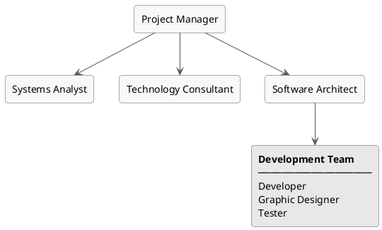

### Methodology

The project followed an iterative and incremental approach, adapted to a single-developer context rather than to a team. Rather than completing the full analysis before writing any code, each microservice was designed, built, and tested in sequence — only moving on once the previous one was stable enough to build on. GitHub Actions handled continuous integration on every merge, and GitHub Issues served as the running task backlog, reviewed at each meeting with the supervisor.

The plan was not rigid: design decisions were revisited during construction whenever the real complexity of a feature turned out to be higher than expected. Documentation ran in parallel with development throughout, while formal testing was consolidated once construction was complete.

The table below maps each iteration to its main deliverable and the period in which it ran.

| Iteration | Deliverable | Period |
|-----------|-------------|--------|
| 0 | Project setup, infrastructure, CI/CD pipeline | Oct 2025 |
| 1 | Gateway Service | Nov 2025 |
| 2 | Auth Service | Nov 2025 |
| 3 | User Service | Nov–Dec 2025 |
| 4 | Planner Service — base + academic structure | Dec 2025 |
| 5 | Planner Service — calendars, events, conflict detection | Dec 2025–Jan 2026 |
| 6 | Planner Service — change requests + Google Calendar sync | Jan 2026 |
| 7 | Webapp | Feb 2026 |
| 8 | Testing and bug fixing | Feb–Mar 2026 |

### Stakeholder Identification

TeachingPlanner is a real institutional commission, so the range of parties with an interest in the outcome goes well beyond the immediate client. Six stakeholders were identified at the start of the project; their detailed needs and influence on the requirements are analysed in Chapter 3.

| ID | Stakeholder | Role in the project |
|----|-------------|---------------------|
| STK-01 | Academic Affairs Office (EII) | Primary client; main beneficiary; defines scheduling requirements |
| STK-02 | EII teaching staff | End users; consult timetables and submit change requests |
| STK-03 | Students and general public | Read-only consumers of the published schedule and CSV export |
| STK-04 | Other EII ecosystem applications | Depend on legacy .txt files and Google Calendars produced by the system |
| STK-05 | University IT Service (SUTIC) | Manages the production VM and VPN; controls infrastructure outside the project |
| STK-06 | Development team (TFG student) | Assumes all technical roles throughout the project |

### Responsibility Matrices

The matrices below map task groups to the roles that contribute to them. An X marks participation; an empty cell means no involvement. Since a single person assumes all roles in this TFG, the matrices reflect division of responsibility rather than division of people.

**Phase 1.1 — Project management**

| Task group | PM | SA | ARCH | TC | DEV | GD | T |
|---|---|---|---|---|---|---|---|
| Project initiation (kick-off, scope, meetings) | X | | | | | | |
| Phase monitoring (documentation, analysis, design, construction, testing) | X | X | X | X | X | | X |
| Infrastructure acquisition and setup | X | | | | X | | |
| Project closure | X | | | | | | |

**Phase 1.2 — Documentation**

| Task group | PM | SA | ARCH | TC | DEV | GD | T |
|---|---|---|---|---|---|---|---|
| TFG report | X | X | X | X | X | | |
| Technical manuals (installation, configuration, user) | X | | | | X | | |
| REST API and integration documentation | X | | X | | X | | |
| Data model and migrations documentation | X | | X | | X | | |

**Phase 1.3 — System analysis**

| Task group | PM | SA | ARCH | TC | DEV | GD | T |
|---|---|---|---|---|---|---|---|
| Current system analysis and scope definition | X | X | | | | | |
| Technology alternatives study and stack selection | X | | | X | | | |
| Functional and non-functional requirements | X | X | | | | | |
| Risk assessment and modules identification | X | X | | | | | |
| Data model definition | X | | X | | | | |

**Phase 1.4 — Design and architecture**

| Task group | PM | SA | ARCH | TC | DEV | GD | T |
|---|---|---|---|---|---|---|---|
| System architecture and ADRs | X | | X | | | | |
| Use cases | X | | | | X | | |
| State and flow diagrams | X | | X | | X | | |
| User interface design and prototypes | X | | | | | X | |

**Phase 1.5 — Construction**

| Task group | PM | SA | ARCH | TC | DEV | GD | T |
|---|---|---|---|---|---|---|---|
| All microservice implementation tasks | X | | X | | X | | |
| UI implementation (Webapp) | X | | X | | X | X | |

**Phase 1.6 — Testing**

| Task group | PM | SA | ARCH | TC | DEV | GD | T |
|---|---|---|---|---|---|---|---|
| Integration, acceptance, E2E, and security tests | X | | | | X | | X |
| Bug fixing | X | | | | | | X |

### Material Resources

The hardware used was limited to what was already available, with no additional purchases. Two devices were used throughout the project:

| Resource | Use in the project |
|----------|--------------------|
| Desktop computer | PC where the entire application was developed |
| Mobile device | Validation of the frontend responsive design |

### Cost Resources

All software tools and hosting were obtained free of charge through academic programmes, keeping infrastructure costs at zero. The table below shows the market price of each resource alongside the actual cost to the project.

| Resource | Market price | Actual cost (student) | Note |
|----------|--------------|-----------------------|------|
| VM Azure B2s | ~€15/month | €0 | Initial deployment; covered by Azure for Students credit (€100) |
| EII Server | ~€15/month | €0 | Final production VM provided by SUTIC |
| GitHub Pro | ~$4/month | €0 | Free licence via GitHub Student Developer Pack |
| Microsoft Project 2019 | ~€30/month | €0 | Academic licence included by the University of Oviedo |

### Initial Budget

The budget was built by applying Spanish junior–mid market hourly rates (2025) to the planned hours for each role. Infrastructure is costed at zero because all tools and hosting were covered by academic programmes, as detailed in the Cost Resources section above. Three views are provided: by role (hours × rate), by phase (aggregated per WBS phase), and the client-facing budget applying a 1.30 commercial margin.

**Hourly rates (Spain, junior–mid, 2025)**

| Role | Rate (€/h) |
|------|-----------|
| Project Manager | €35 |
| Systems Analyst | €32 |
| Software Architect | €40 |
| Technology Consultant | €38 |
| Developer | €30 |
| Graphic Designer | €28 |
| Tester | €28 |

**Cost budget by role**

Based on these rates, the total cost is calculated by multiplying each role's estimated hours by its hourly rate:

| Role | Hours | Rate (€/h) | Cost (€) |
|------|-------|-----------|---------|
| Project Manager | 19 h | €35 | €665.00 |
| Systems Analyst | 19 h | €32 | €608.00 |
| Software Architect | 14 h | €40 | €560.00 |
| Technology Consultant | 9 h | €38 | €342.00 |
| Developer | 269.25 h | €30 | €8,077.50 |
| Graphic Designer | 6 h | €28 | €168.00 |
| Tester | 29 h | €28 | €812.00 |
| Infrastructure | — | — | €0.00 |
| **TOTAL** | **365.25 h** | | **€11,232.50** |

**Cost budget by phase**

The same total, broken down by WBS phase rather than by role:

| Phase | Hours | Cost (€) |
|-------|-------|---------|
| 1.1 Project management | 19 h | €665.00 |
| 1.2 Documentation | 64 h | €1,920.00 |
| 1.3 System analysis | 33 h | €1,156.00 |
| 1.4 Design and architecture | 23.5 h | €832.00 |
| 1.5 Construction | 193.75 h | €5,763.50 |
| 1.6 Testing and debugging | 32 h | €896.00 |
| Infrastructure | — | €0.00 |
| **TOTAL** | **365.25 h** | **€11,232.50** |

**Client budget (commercial margin ×1.30)**

| Phase | Cost (€) | Client budget (€) |
|-------|---------|-----------|
| 1.1 Project management | €665.00 | €864.50 |
| 1.2 Documentation | €1,920.00 | €2,496.00 |
| 1.3 System analysis | €1,156.00 | €1,502.80 |
| 1.4 Design and architecture | €832.00 | €1,081.60 |
| 1.5 Construction | €5,763.50 | €7,492.55 |
| 1.6 Testing and debugging | €896.00 | €1,164.80 |
| Infrastructure | €0.00 | €0.00 |
| **TOTAL** | **€11,232.50** | **€14,602.25** |

---

## 2. Work Breakdown Structure (WBS)

The work breakdown is split across several diagrams to keep each one readable. The first shows the six top-level phases; the diagrams that follow expand each phase down to its individual tasks.

### Overview

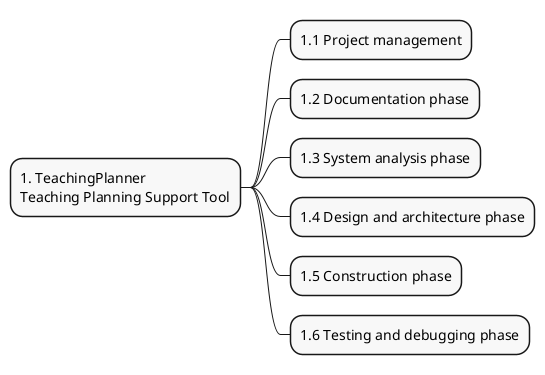

### 1.1 Project management

The management phase runs across the full project duration — from kick-off to formal closure — structured around eight sub-groups: project initiation, one monitoring block per technical phase, infrastructure setup, and project closure.

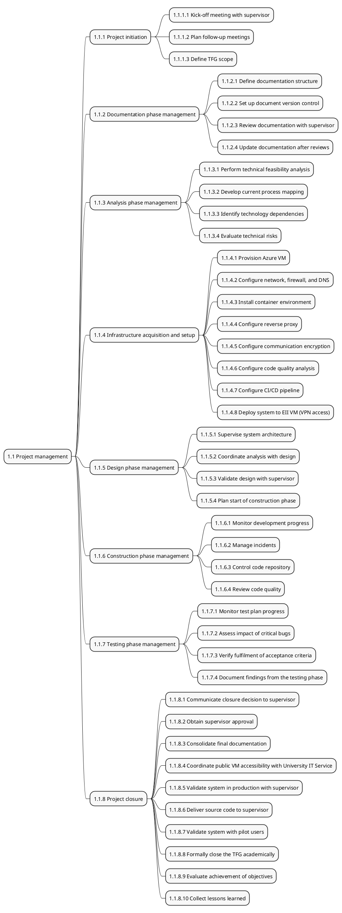

### 1.2 Documentation phase

This phase runs in parallel with the technical phases. It covers the TFG report, installation and configuration manuals, the user manual, the REST API reference, and the data model documentation.

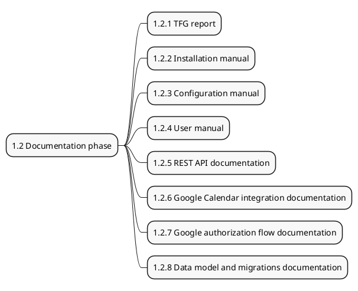

### 1.3 System analysis phase

This phase defines the scope and requirements before construction begins. It covers the current-system study, technology selection, functional and non-functional requirements, risk assessment, and the data model.

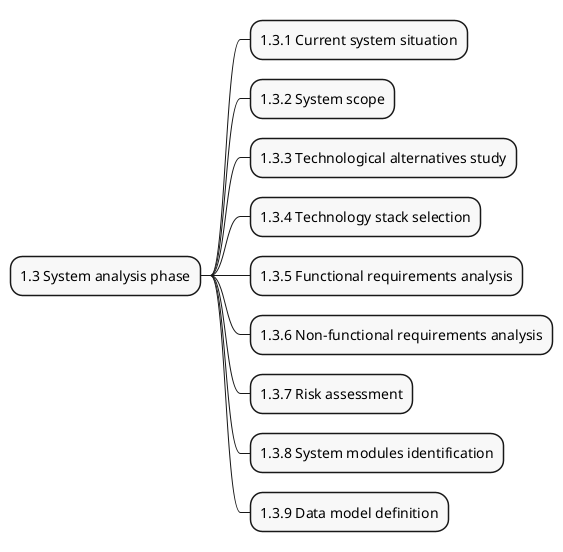

### 1.4 Design and architecture phase

This phase produces the architectural decisions (including ADRs), behavioural diagrams, and UI prototypes that guide the construction phase.

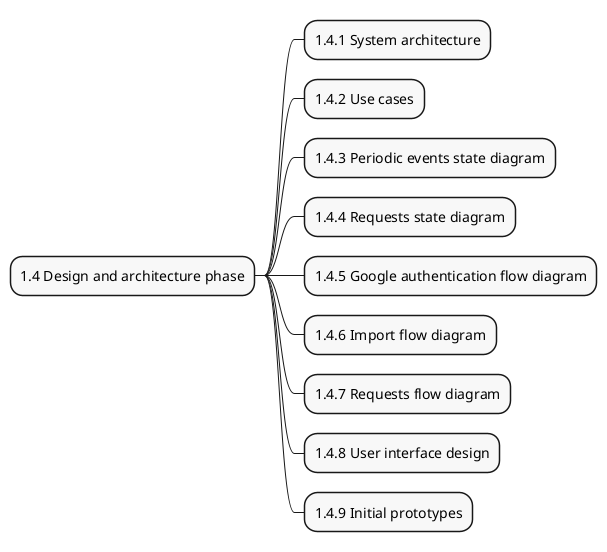

### 1.5 Construction phase — Services

The construction phase is the largest in the project. Five microservices are built in sequence; this diagram shows the Gateway, Auth, and User services. The Planner Service and the Webapp are expanded in the diagrams that follow.

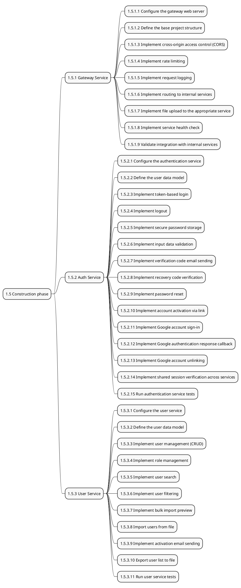

### 1.5 Construction phase — Planner Service

The Planner Service is the most complex component in the system. It manages academic calendars, one-off and periodic events, change requests, legacy file import/export, and Google Calendar synchronisation — thirteen sub-modules in total.

```plantuml
@startmindmap
left to right direction
<style>
mindmapDiagram {
  .root {
    BackgroundColor #E8E8E8
    BorderColor #555555
  }
  node {
    BackgroundColor #F8F8F8
    BorderColor #555555
    FontName Arial
  }
}
</style>
+ 1.5.4 Planner Service
++ 1.5.4.1 Base configuration
+++ 1.5.4.1.1 Configure the planner service web server
+++ 1.5.4.1.2 Configure the planner database connection
+++ 1.5.4.1.3 Define the planner service data model
+++ 1.5.4.1.4 Implement change audit log
++ 1.5.4.2 Degree management
+++ 1.5.4.2.1 Implement degree CRUD
++ 1.5.4.3 Academic year management
+++ 1.5.4.3.1 Implement academic year CRUD
++ 1.5.4.4 Subject management
+++ 1.5.4.4.1 Implement subject CRUD
+++ 1.5.4.4.2 Implement subject query with associated groups
++ 1.5.4.5 Subject group management
+++ 1.5.4.5.1 Implement group CRUD
+++ 1.5.4.5.2 Implement group hour budget update
+++ 1.5.4.5.3 Validate hour budget per group
++ 1.5.4.6 Classroom management
+++ 1.5.4.6.1 Implement classroom CRUD
+++ 1.5.4.6.2 Implement classroom deletion with cascade removal
+++ 1.5.4.6.3 Implement classroom conflict detection
++ 1.5.4.7 Academic calendar management
+++ 1.5.4.7.1 Implement calendar CRUD
+++ 1.5.4.7.2 Implement school day management
+++ 1.5.4.7.3 Create calendar by importing legacy system files
+++ 1.5.4.7.4 Create calendar by duplicating another year's structure
+++ 1.5.4.7.5 Import event exceptions into an existing calendar
+++ 1.5.4.7.6 Implement active calendar filtering
+++ 1.5.4.7.7 Implement public calendar view
++ 1.5.4.8 Legacy format import
+++ 1.5.4.8.1 Read and process legacy system text files
+++ 1.5.4.8.2 Validate structure and consistency of imported files
+++ 1.5.4.8.3 Import subjects and groups from file
+++ 1.5.4.8.4 Import events and exceptions from file
++ 1.5.4.9 Legacy format export
+++ 1.5.4.9.1 Generate legacy system files and package as ZIP
++ 1.5.4.10 One-off event management
+++ 1.5.4.10.1 Define the one-off event data model
+++ 1.5.4.10.2 Implement one-off event CRUD
+++ 1.5.4.10.3 Implement event types
+++ 1.5.4.10.4 Implement one-off event cancellation
+++ 1.5.4.10.5 Implement atomic substitution of a periodic event occurrence
+++ 1.5.4.10.6 Implement conflict detection utility
+++ 1.5.4.10.7 Integrate conflict detection into one-off events
++ 1.5.4.11 Periodic event management
+++ 1.5.4.11.1 Define the periodic event data model
+++ 1.5.4.11.2 Implement event recurrence types (N, P, I)
+++ 1.5.4.11.3 Implement planned hours logic
+++ 1.5.4.11.4 Implement fair distribution of events within the same group
+++ 1.5.4.11.5 Implement periodic event CRUD
+++ 1.5.4.11.6 Implement custom recurrence periodic event
+++ 1.5.4.11.7 Integrate conflict detection into periodic events
++ 1.5.4.12 Change request module
+++ 1.5.4.12.1 Define the change request data model
+++ 1.5.4.12.2 Implement event creation request
+++ 1.5.4.12.3 Implement event edit request
+++ 1.5.4.12.4 Implement event cancellation request
+++ 1.5.4.12.5 Implement event substitution request
+++ 1.5.4.12.6 Implement conflict detection in change requests
+++ 1.5.4.12.7 Implement request listing
+++ 1.5.4.12.8 Implement pending request preview on the calendar
+++ 1.5.4.12.9 Implement request approval
+++ 1.5.4.12.10 Implement request rejection
+++ 1.5.4.12.11 Implement pending request deletion by the teacher
++ 1.5.4.13 Google Calendar integration
+++ 1.5.4.13.1 Configure project in Google Cloud Console
+++ 1.5.4.13.2 Configure external calendar service access
+++ 1.5.4.13.3 Configure Google account access authorisation
+++ 1.5.4.13.4 Sync events to Google Calendar
+++ 1.5.4.13.5 Implement access credential storage
+++ 1.5.4.13.6 Implement automatic credential renewal
+++ 1.5.4.13.7 Define the synchronisation data model
+++ 1.5.4.13.8 Implement periodic sync task
+++ 1.5.4.13.9 Implement one external calendar per classroom
+++ 1.5.4.13.10 Implement Google account unlinking
+++ 1.5.4.13.11 Run Google Calendar integration tests
@endmindmap
```

### 1.5 Construction phase — Webapp

The Webapp is a React single-page application with 19 pages covering authentication, user management, academic structure, calendar management, event scheduling, change requests, Google Calendar synchronisation, and the public timetable view.

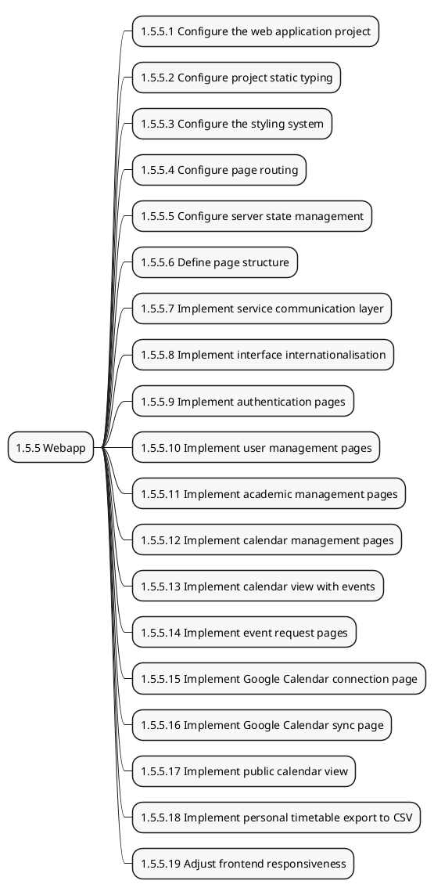

### 1.6 Testing and debugging phase

This phase runs sequentially after the construction phase is complete. It covers integration, acceptance, end-to-end, and security testing, followed by a bug-fixing task.

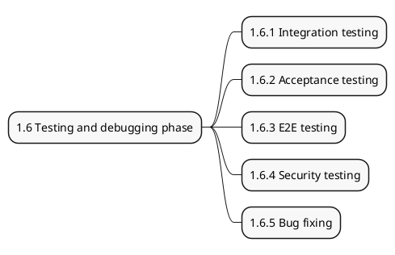

---

## 3. Product Breakdown Structure (PBS)

Where the WBS describes the work to be done, the PBS organises the project by what it produces. The two diagrams below show the eight product families at a glance, then expand each one into its individual deliverables.

### Overview

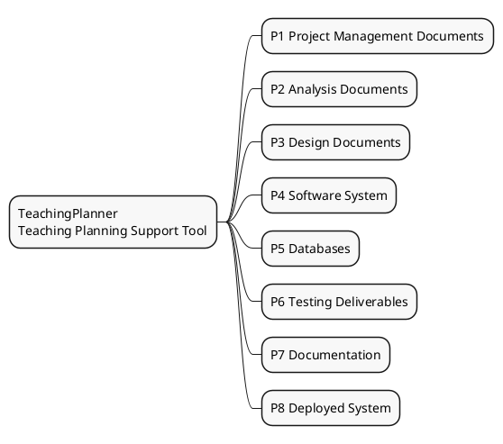

### Detail

The diagram below expands each product family into its individual deliverables.

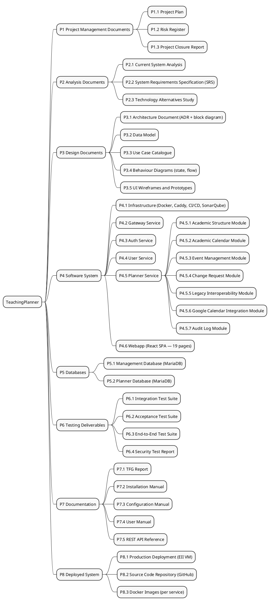

---

## 4. Detailed Task Planning

Every project task is listed below, formatted for direct input into Microsoft Project 2019. The column legend immediately following this note describes each field.

> **[CAPTURA GANTT — G0: Visión general del proyecto]**
> Colapsar todas las fases al primer nivel: mostrar únicamente las filas de resumen (IDs 1–8, es decir, la raíz del proyecto y las seis fases de nivel 1).
> Rango de fechas: 01/09/2025 – 11/03/2026. Escala temporal: meses.
> Columnas visibles: ID, Nombre de tarea, Duración, Inicio, Fin.
> _Captura horizontal; orientar la página en apaisado en el Word._

> **Format for Microsoft Project 2019**
> — Duration in days (as reported by MS Project)
> — Predecessors: task ID, with CC suffix for Start-to-Start (CC) dependencies

### Column legend

| Field | Description |
|-------|-------------|
| **ID** | Sequential numeric identifier |
| **WBS** | WBS outline number |
| **Task name** | Name of the task |
| **Dur.** | Duration in days |
| **Start** | Start date (dd/mm/yy) |
| **Finish** | Finish date (dd/mm/yy) |
| **Hours** | Estimated work in hours |
| **Pred.** | Predecessor task ID(s); CC = Start-to-Start |
| **Resource** | Main assigned role |

---

### 1.1 Project management

This phase covers project initiation, the monitoring of each technical phase, infrastructure setup, and formal project closure. It runs across the full project duration (01/09/2025 – 11/03/2026) with a total of 19 hours assigned to the Project Manager role.

| ID | WBS | Task name | Dur. | Start | Finish | Hours | Pred. | Resource |
|----|-----|-----------|------|-------|--------|-------|-------|----------|
| 1 | 1 | **TeachingPlanner — Teaching Planning Support Tool** | **44.38 d** | **01/09/25** | **11/03/26** | **365.25 h** | — | — |
| 2 | 1.1 | **Project management** | **44.38 d** | **01/09/25** | **11/03/26** | **19 h** | — | — |
| 3 | 1.1.1 | **Project initiation** | **0.6 d** | **01/09/25** | **03/09/25** | **4.8 h** | — | — |
| 4 | 1.1.1.1 | Kick-off meeting with supervisor | 0.2 d | 01/09/25 | 02/09/25 | 1.6 h | — | Project Manager |
| 5 | 1.1.1.2 | Plan follow-up meetings | 0.2 d | 02/09/25 | 03/09/25 | 1.6 h | 4 | Project Manager |
| 6 | 1.1.1.3 | Define TFG scope | 0.2 d | 03/09/25 | 03/09/25 | 1.6 h | 5 | Project Manager |
| 7 | 1.1.2 | **Documentation phase management** | **0.2 d** | **03/09/25** | **04/09/25** | **1.6 h** | **52CC;3** | — |
| 8 | 1.1.2.1 | Define documentation structure | 0.05 d | 03/09/25 | 04/09/25 | 0.4 h | — | Project Manager |
| 9 | 1.1.2.2 | Set up document version control | 0.05 d | 04/09/25 | 04/09/25 | 0.4 h | 8 | Project Manager |
| 10 | 1.1.2.3 | Review documentation with supervisor | 0.05 d | 04/09/25 | 04/09/25 | 0.4 h | 9 | Project Manager |
| 11 | 1.1.2.4 | Update documentation after reviews | 0.05 d | 04/09/25 | 04/09/25 | 0.4 h | 10 | Project Manager |
| 12 | 1.1.3 | **Analysis phase management** | **0.2 d** | **08/10/25** | **09/10/25** | **1.6 h** | **61CC;7** | — |
| 13 | 1.1.3.1 | Perform technical feasibility analysis | 0.05 d | 08/10/25 | 08/10/25 | 0.4 h | — | Project Manager |
| 14 | 1.1.3.2 | Develop current process mapping | 0.05 d | 08/10/25 | 08/10/25 | 0.4 h | 13 | Project Manager |
| 15 | 1.1.3.3 | Identify technology dependencies | 0.05 d | 08/10/25 | 08/10/25 | 0.4 h | 14 | Project Manager |
| 16 | 1.1.3.4 | Evaluate technical risks | 0.05 d | 09/10/25 | 09/10/25 | 0.4 h | 15 | Project Manager |
| 17 | 1.1.4 | **Infrastructure acquisition and setup** | **0.23 d** | **09/10/25** | **10/10/25** | **1.8 h** | **12** | — |
| 18 | 1.1.4.1 | Provision Azure VM | 0.03 d | 09/10/25 | 09/10/25 | 0.25 h | — | Developer |
| 19 | 1.1.4.2 | Configure network, firewall, and DNS | 0.06 d | 09/10/25 | 09/10/25 | 0.5 h | 18 | Developer |
| 20 | 1.1.4.3 | Install container environment | 0.02 d | 09/10/25 | 09/10/25 | 0.13 h | 19 | Developer |
| 21 | 1.1.4.4 | Configure reverse proxy | 0.02 d | 09/10/25 | 09/10/25 | 0.13 h | 20 | Developer |
| 22 | 1.1.4.5 | Configure communication encryption | 0.02 d | 09/10/25 | 09/10/25 | 0.13 h | 21 | Developer |
| 23 | 1.1.4.6 | Configure code quality analysis | 0.02 d | 09/10/25 | 09/10/25 | 0.13 h | 22 | Developer |
| 24 | 1.1.4.7 | Configure CI/CD pipeline | 0.02 d | 09/10/25 | 09/10/25 | 0.13 h | 23 | Developer |
| 25 | 1.1.4.8 | Deploy system to EII VM (VPN access) | 0.05 d | 09/10/25 | 10/10/25 | 0.4 h | 24 | Developer |
| 26 | 1.1.5 | **Design phase management** | **0.2 d** | **25/10/25** | **26/10/25** | **1.6 h** | **71CC;17** | — |
| 27 | 1.1.5.1 | Supervise system architecture | 0.05 d | 25/10/25 | 26/10/25 | 0.4 h | — | Project Manager |
| 28 | 1.1.5.2 | Coordinate analysis with design | 0.05 d | 26/10/25 | 26/10/25 | 0.4 h | 27 | Project Manager |
| 29 | 1.1.5.3 | Validate design with supervisor | 0.05 d | 26/10/25 | 26/10/25 | 0.4 h | 28 | Project Manager |
| 30 | 1.1.5.4 | Plan start of construction phase | 0.05 d | 26/10/25 | 26/10/25 | 0.4 h | 29 | Project Manager |
| 31 | 1.1.6 | **Construction phase management** | **0.2 d** | **07/11/25** | **08/11/25** | **1.6 h** | **81CC;26** | — |
| 32 | 1.1.6.1 | Monitor development progress | 0.05 d | 07/11/25 | 07/11/25 | 0.4 h | — | Project Manager |
| 33 | 1.1.6.2 | Manage incidents | 0.05 d | 07/11/25 | 08/11/25 | 0.4 h | 32 | Project Manager |
| 34 | 1.1.6.3 | Control code repository | 0.05 d | 08/11/25 | 08/11/25 | 0.4 h | 33 | Project Manager |
| 35 | 1.1.6.4 | Review code quality | 0.05 d | 08/11/25 | 08/11/25 | 0.4 h | 34 | Project Manager |
| 36 | 1.1.7 | **Testing phase management** | **0.25 d** | **20/02/26** | **21/02/26** | **2 h** | **216CC;31** | — |
| 37 | 1.1.7.1 | Monitor test plan progress | 0.06 d | 20/02/26 | 20/02/26 | 0.5 h | — | Project Manager |
| 38 | 1.1.7.2 | Assess impact of critical bugs | 0.06 d | 20/02/26 | 20/02/26 | 0.5 h | 37 | Project Manager |
| 39 | 1.1.7.3 | Verify fulfilment of acceptance criteria | 0.06 d | 20/02/26 | 20/02/26 | 0.5 h | 38 | Project Manager |
| 40 | 1.1.7.4 | Document findings from the testing phase | 0.06 d | 20/02/26 | 21/02/26 | 0.5 h | 39 | Project Manager |
| 41 | 1.1.8 | **Project closure** | **0.5 d** | **09/03/26** | **11/03/26** | **4 h** | **221;36** | — |
| 42 | 1.1.8.1 | Communicate closure decision to supervisor | 0.05 d | 09/03/26 | 09/03/26 | 0.4 h | — | Project Manager |
| 43 | 1.1.8.2 | Obtain supervisor approval | 0.05 d | 09/03/26 | 09/03/26 | 0.4 h | 42 | Project Manager |
| 44 | 1.1.8.3 | Consolidate final documentation | 0.05 d | 09/03/26 | 10/03/26 | 0.4 h | 43 | Project Manager |
| 45 | 1.1.8.4 | Coordinate public VM accessibility with University IT Service | 0.05 d | 10/03/26 | 10/03/26 | 0.4 h | 44 | Project Manager |
| 46 | 1.1.8.5 | Validate system in production with supervisor | 0.05 d | 10/03/26 | 10/03/26 | 0.4 h | 45 | Project Manager |
| 47 | 1.1.8.6 | Deliver source code to supervisor | 0.05 d | 10/03/26 | 10/03/26 | 0.4 h | 46 | Project Manager |
| 48 | 1.1.8.7 | Validate system with pilot users | 0.05 d | 10/03/26 | 10/03/26 | 0.4 h | 47 | Project Manager |
| 49 | 1.1.8.8 | Formally close the TFG academically | 0.05 d | 10/03/26 | 11/03/26 | 0.4 h | 48 | Project Manager |
| 50 | 1.1.8.9 | Evaluate achievement of objectives | 0.05 d | 11/03/26 | 11/03/26 | 0.4 h | 49 | Project Manager |
| 51 | 1.1.8.10 | Collect lessons learned | 0.05 d | 11/03/26 | 11/03/26 | 0.4 h | 50 | Project Manager |

> **[CAPTURA GANTT — G1a: Gestión del proyecto, parte 1/2 — IDs 2–25]**
> Expandir únicamente la fase 1.1. Mostrar desde ID 2 (resumen de 1.1) hasta ID 25 (última tarea de 1.1.4 — infraestructura).
> Rango de fechas: 01/09/2025 – 10/10/2025. Escala temporal: semanas.
> Columnas visibles: ID, Nombre de tarea, Duración, Inicio, Fin, Predecesoras.

> **[CAPTURA GANTT — G1b: Gestión del proyecto, parte 2/2 — IDs 26–51]**
> Continuación de la fase 1.1. Mostrar desde ID 26 (resumen de 1.1.5, gestión de diseño) hasta ID 51 (última tarea de 1.1.8, cierre).
> Rango de fechas: 25/10/2025 – 11/03/2026. Escala temporal: semanas.
> Columnas visibles: ID, Nombre de tarea, Duración, Inicio, Fin, Predecesoras.

---

### 1.2 Documentation phase

This phase produces all written deliverables: the TFG report, installation and configuration manuals, user manual, REST API reference, and data model documentation. It runs from project start through mid-October 2025 with 64 hours of estimated work.

| ID | WBS | Task name | Dur. | Start | Finish | Hours | Pred. | Resource |
|----|-----|-----------|------|-------|--------|-------|-------|----------|
| 52 | 1.2 | **Documentation phase** | **8 d** | **03/09/25** | **08/10/25** | **64 h** | **3** | — |
| 53 | 1.2.1 | TFG report | 5 d | 03/09/25 | 25/09/25 | 40 h | — | Developer |
| 54 | 1.2.2 | Installation manual | 0.38 d | 25/09/25 | 26/09/25 | 3 h | 53 | Developer |
| 55 | 1.2.3 | Configuration manual | 0.38 d | 26/09/25 | 28/09/25 | 3 h | 54 | Developer |
| 56 | 1.2.4 | User manual | 0.75 d | 28/09/25 | 01/10/25 | 6 h | 55 | Developer |
| 57 | 1.2.5 | REST API documentation | 0.75 d | 01/10/25 | 04/10/25 | 6 h | 56 | Developer |
| 58 | 1.2.6 | Google Calendar integration documentation | 0.25 d | 04/10/25 | 05/10/25 | 2 h | 57 | Developer |
| 59 | 1.2.7 | Google authorization flow documentation | 0.25 d | 05/10/25 | 07/10/25 | 2 h | 58 | Developer |
| 60 | 1.2.8 | Data model and migrations documentation | 0.25 d | 07/10/25 | 08/10/25 | 2 h | 59 | Developer |

> **[CAPTURA GANTT — G2: Fase de documentación — IDs 52–60]**
> Expandir únicamente la fase 1.2. Mostrar IDs 52–60 (resumen de 1.2 y sus 8 sub-tareas).
> Rango de fechas: 03/09/2025 – 08/10/2025. Escala temporal: semanas.
> Columnas visibles: ID, Nombre de tarea, Duración, Inicio, Fin, Predecesoras.

---

### 1.3 System analysis phase

This phase encompasses the current system study, requirements elicitation (functional and non-functional), technology selection, risk assessment, and the data model definition. It runs from mid-October to late October 2025 with 33 hours of estimated work.

| ID | WBS | Task name | Dur. | Start | Finish | Hours | Pred. | Resource |
|----|-----|-----------|------|-------|--------|-------|-------|----------|
| 61 | 1.3 | **System analysis phase** | **4.13 d** | **08/10/25** | **25/10/25** | **33 h** | **52** | — |
| 62 | 1.3.1 | Current system situation | 0.63 d | 08/10/25 | 10/10/25 | 5 h | — | Systems Analyst |
| 63 | 1.3.2 | System scope | 0.38 d | 10/10/25 | 12/10/25 | 3 h | 62 | Systems Analyst |
| 64 | 1.3.3 | Technological alternatives study | 0.38 d | 12/10/25 | 14/10/25 | 3 h | 63 | Technology Consultant |
| 65 | 1.3.4 | Technology stack selection | 0.38 d | 14/10/25 | 15/10/25 | 3 h | 64 | Technology Consultant |
| 66 | 1.3.5 | Functional requirements analysis | 0.38 d | 15/10/25 | 17/10/25 | 3 h | 65 | Systems Analyst |
| 67 | 1.3.6 | Non-functional requirements analysis | 0.25 d | 17/10/25 | 18/10/25 | 2 h | 66 | Systems Analyst |
| 68 | 1.3.7 | Risk assessment | 0.38 d | 18/10/25 | 19/10/25 | 3 h | 67 | Systems Analyst |
| 69 | 1.3.8 | System modules identification | 0.38 d | 19/10/25 | 21/10/25 | 3 h | 68 | Systems Analyst |
| 70 | 1.3.9 | Data model definition | 1 d | 21/10/25 | 25/10/25 | 8 h | 69 | Software Architect |

> **[CAPTURA GANTT — G3: Fase de análisis del sistema — IDs 61–70]**
> Expandir únicamente la fase 1.3. Mostrar IDs 61–70 (resumen de 1.3 y sus 9 sub-tareas).
> Rango de fechas: 08/10/2025 – 25/10/2025. Escala temporal: semanas.
> Columnas visibles: ID, Nombre de tarea, Duración, Inicio, Fin, Predecesoras.

---

### 1.4 Design and architecture phase

This phase covers microservices architecture design (including ADRs), use case modelling, behavioural and flow diagrams, and initial UI prototypes. It runs from late October to early November 2025 with 23.5 hours of estimated work.

| ID | WBS | Task name | Dur. | Start | Finish | Hours | Pred. | Resource |
|----|-----|-----------|------|-------|--------|-------|-------|----------|
| 71 | 1.4 | **Design and architecture phase** | **2.94 d** | **25/10/25** | **07/11/25** | **23.5 h** | **61** | — |
| 72 | 1.4.1 | System architecture | 0.75 d | 25/10/25 | 29/10/25 | 6 h | — | Software Architect |
| 73 | 1.4.2 | Use cases | 0.5 d | 29/10/25 | 31/10/25 | 4 h | 72 | Developer |
| 74 | 1.4.3 | Periodic events state diagram | 0.25 d | 31/10/25 | 01/11/25 | 2 h | 73 | Developer |
| 75 | 1.4.4 | Requests state diagram | 0.25 d | 01/11/25 | 02/11/25 | 2 h | 74 | Developer |
| 76 | 1.4.5 | Google authentication flow diagram | 0.19 d | 02/11/25 | 03/11/25 | 1.5 h | 75 | Developer |
| 77 | 1.4.6 | Import flow diagram | 0.13 d | 03/11/25 | 04/11/25 | 1 h | 76 | Developer |
| 78 | 1.4.7 | Requests flow diagram | 0.13 d | 04/11/25 | 04/11/25 | 1 h | 77 | Developer |
| 79 | 1.4.8 | User interface design | 0.38 d | 04/11/25 | 06/11/25 | 3 h | 78 | Graphic Designer |
| 80 | 1.4.9 | Initial prototypes | 0.38 d | 06/11/25 | 07/11/25 | 3 h | 79 | Graphic Designer |

> **[CAPTURA GANTT — G4: Fase de diseño y arquitectura — IDs 71–80]**
> Expandir únicamente la fase 1.4. Mostrar IDs 71–80 (resumen de 1.4 y sus 9 sub-tareas).
> Rango de fechas: 25/10/2025 – 07/11/2025. Escala temporal: semanas.
> Columnas visibles: ID, Nombre de tarea, Duración, Inicio, Fin, Predecesoras.

---

### 1.5 Construction phase

The construction phase builds all five services in sequence: Gateway, Auth, User, Planner, and Webapp. It is the longest phase in the project, running from November 2025 to February 2026 with 193.75 hours of estimated work.

| ID | WBS | Task name | Dur. | Start | Finish | Hours | Pred. | Resource |
|----|-----|-----------|------|-------|--------|-------|-------|----------|
| 81 | 1.5 | **Construction phase** | **24.22 d** | **07/11/25** | **20/02/26** | **193.75 h** | **71** | — |

#### 1.5.1 Gateway Service

> Single entry point of the system. Receives all client requests and routes them to the corresponding services. Controls access, limits API abuse, and logs activity.

| ID | WBS | Task name | Dur. | Start | Finish | Hours | Pred. | Resource |
|----|-----|-----------|------|-------|--------|-------|-------|----------|
| 82 | 1.5.1 | **Gateway Service** | **1.25 d** | **07/11/25** | **13/11/25** | **10 h** | — | — |
| 83 | 1.5.1.1 | Configure the gateway web server | 0.13 d | 07/11/25 | 08/11/25 | 1 h | — | Developer |
| 84 | 1.5.1.2 | Define the base project structure | 0.13 d | 08/11/25 | 08/11/25 | 1 h | 83 | Developer |
| 85 | 1.5.1.3 | Implement cross-origin access control (CORS) | 0.06 d | 08/11/25 | 08/11/25 | 0.5 h | 84 | Developer |
| 86 | 1.5.1.4 | Implement rate limiting | 0.06 d | 08/11/25 | 09/11/25 | 0.5 h | 85 | Developer |
| 87 | 1.5.1.5 | Implement request logging | 0.06 d | 09/11/25 | 09/11/25 | 0.5 h | 86 | Developer |
| 88 | 1.5.1.6 | Implement routing to internal services | 0.38 d | 09/11/25 | 11/11/25 | 3 h | 87 | Developer |
| 89 | 1.5.1.7 | Implement file upload to the appropriate service | 0.25 d | 11/11/25 | 12/11/25 | 2 h | 88 | Developer |
| 90 | 1.5.1.8 | Implement service health check | 0.13 d | 12/11/25 | 12/11/25 | 1 h | 89 | Developer |
| 91 | 1.5.1.9 | Validate integration with internal services | 0.06 d | 12/11/25 | 13/11/25 | 0.5 h | 90 | Developer |

> **[CAPTURA GANTT — G5a: Construcción — Gateway Service — IDs 81–91]**
> Expandir únicamente la fase 1.5 y dentro de ella sólo 1.5.1. Mostrar ID 81 (resumen de 1.5) y IDs 82–91 (Gateway Service y sus 9 sub-tareas).
> Rango de fechas: 07/11/2025 – 13/11/2025. Escala temporal: días.
> Columnas visibles: ID, Nombre de tarea, Duración, Inicio, Fin, Predecesoras.

#### 1.5.2 Auth Service

> Service responsible for user authentication and authorisation. Manages login, password recovery via verification code, account activation, and Google account sign-in.

| ID | WBS | Task name | Dur. | Start | Finish | Hours | Pred. | Resource |
|----|-----|-----------|------|-------|--------|-------|-------|----------|
| 92 | 1.5.2 | **Auth Service** | **2.25 d** | **13/11/25** | **22/11/25** | **18 h** | **82** | — |
| 93 | 1.5.2.1 | Configure the authentication service | 0.25 d | 13/11/25 | 14/11/25 | 2 h | — | Developer |
| 94 | 1.5.2.2 | Define the user data model | 0.25 d | 14/11/25 | 15/11/25 | 2 h | 93 | Developer |
| 95 | 1.5.2.3 | Implement token-based login | 0.25 d | 15/11/25 | 16/11/25 | 2 h | 94 | Developer |
| 96 | 1.5.2.4 | Implement logout | 0.13 d | 16/11/25 | 16/11/25 | 1 h | 95 | Developer |
| 97 | 1.5.2.5 | Implement secure password storage | 0.06 d | 16/11/25 | 16/11/25 | 0.5 h | 96 | Developer |
| 98 | 1.5.2.6 | Implement input data validation | 0.06 d | 16/11/25 | 17/11/25 | 0.5 h | 97 | Developer |
| 99 | 1.5.2.7 | Implement verification code email sending | 0.25 d | 17/11/25 | 18/11/25 | 2 h | 98 | Developer |
| 100 | 1.5.2.8 | Implement recovery code verification | 0.06 d | 18/11/25 | 18/11/25 | 0.5 h | 99 | Developer |
| 101 | 1.5.2.9 | Implement password reset | 0.06 d | 18/11/25 | 19/11/25 | 0.5 h | 100 | Developer |
| 102 | 1.5.2.10 | Implement account activation via link | 0.13 d | 19/11/25 | 19/11/25 | 1 h | 101 | Developer |
| 103 | 1.5.2.11 | Implement Google account sign-in | 0.13 d | 19/11/25 | 20/11/25 | 1 h | 102 | Developer |
| 104 | 1.5.2.12 | Implement Google authentication response callback | 0.13 d | 20/11/25 | 20/11/25 | 1 h | 103 | Developer |
| 105 | 1.5.2.13 | Implement Google account unlinking | 0.13 d | 20/11/25 | 21/11/25 | 1 h | 104 | Developer |
| 106 | 1.5.2.14 | Implement shared session verification across services | 0.13 d | 21/11/25 | 21/11/25 | 1 h | 105 | Developer |
| 107 | 1.5.2.15 | Run authentication service tests | 0.25 d | 21/11/25 | 22/11/25 | 2 h | 106 | Developer |

> **[CAPTURA GANTT — G5b: Construcción — Auth Service — IDs 92–107]**
> Expandir únicamente 1.5.2. Mostrar IDs 92–107 (resumen de Auth Service y sus 15 sub-tareas).
> Rango de fechas: 13/11/2025 – 22/11/2025. Escala temporal: días.
> Columnas visibles: ID, Nombre de tarea, Duración, Inicio, Fin, Predecesoras.

#### 1.5.3 User Service

> User management service. Allows creating, reading, updating, and deleting users, assigning roles, searching and filtering by criteria, bulk-importing users from a file, and sending activation emails.

| ID | WBS | Task name | Dur. | Start | Finish | Hours | Pred. | Resource |
|----|-----|-----------|------|-------|--------|-------|-------|----------|
| 108 | 1.5.3 | **User Service** | **2.75 d** | **22/11/25** | **04/12/25** | **22 h** | **92** | — |
| 109 | 1.5.3.1 | Configure the user service | 0.25 d | 22/11/25 | 23/11/25 | 2 h | — | Developer |
| 110 | 1.5.3.2 | Define the user data model | 0.13 d | 23/11/25 | 24/11/25 | 1 h | 109 | Developer |
| 111 | 1.5.3.3 | Implement user management (CRUD) | 0.25 d | 24/11/25 | 25/11/25 | 2 h | 110 | Developer |
| 112 | 1.5.3.4 | Implement role management | 0.25 d | 25/11/25 | 26/11/25 | 2 h | 111 | Developer |
| 113 | 1.5.3.5 | Implement user search | 0.06 d | 26/11/25 | 26/11/25 | 0.5 h | 112 | Developer |
| 114 | 1.5.3.6 | Implement user filtering | 0.06 d | 26/11/25 | 27/11/25 | 0.5 h | 113 | Developer |
| 115 | 1.5.3.7 | Implement bulk import preview | 0.25 d | 27/11/25 | 28/11/25 | 2 h | 114 | Developer |
| 116 | 1.5.3.8 | Import users from file | 0.25 d | 28/11/25 | 29/11/25 | 2 h | 115 | Developer |
| 117 | 1.5.3.9 | Implement activation email sending | 0.13 d | 29/11/25 | 29/11/25 | 1 h | 116 | Developer |
| 118 | 1.5.3.10 | Export user list to file | 0.13 d | 29/11/25 | 30/11/25 | 1 h | 117 | Developer |
| 119 | 1.5.3.11 | Run user service tests | 1 d | 30/11/25 | 04/12/25 | 8 h | 118 | Developer |

> **[CAPTURA GANTT — G5c: Construcción — User Service — IDs 108–119]**
> Expandir únicamente 1.5.3. Mostrar IDs 108–119 (resumen de User Service y sus 11 sub-tareas).
> Rango de fechas: 22/11/2025 – 04/12/2025. Escala temporal: semanas.
> Columnas visibles: ID, Nombre de tarea, Duración, Inicio, Fin, Predecesoras.

#### 1.5.4 Planner Service

> Core business logic of the system. Manages academic calendars, degrees, subjects, groups, classrooms, one-off and periodic events, event change requests, and Google Calendar integration. It is the most complex microservice in the system.

| ID | WBS | Task name | Dur. | Start | Finish | Hours | Pred. | Resource |
|----|-----|-----------|------|-------|--------|-------|-------|----------|
| 120 | 1.5.4 | **Planner Service** | **14.91 d** | **04/12/25** | **06/02/26** | **119.25 h** | **108** | — |

##### 1.5.4.1 — Base configuration

| ID | WBS | Task name | Dur. | Start | Finish | Hours | Pred. | Resource |
|----|-----|-----------|------|-------|--------|-------|-------|----------|
| 121 | 1.5.4.1 | **Base configuration** | **0.63 d** | **04/12/25** | **07/12/25** | **5 h** | — | — |
| 122 | 1.5.4.1.1 | Configure the planner service web server | 0.13 d | 04/12/25 | 05/12/25 | 1 h | — | Developer |
| 123 | 1.5.4.1.2 | Configure the planner database connection | 0.13 d | 05/12/25 | 05/12/25 | 1 h | 122 | Developer |
| 124 | 1.5.4.1.3 | Define the planner service data model | 0.25 d | 05/12/25 | 06/12/25 | 2 h | 123 | Developer |
| 125 | 1.5.4.1.4 | Implement change audit log | 0.13 d | 06/12/25 | 07/12/25 | 1 h | 124 | Developer |

##### 1.5.4.2 — Degree management

| ID | WBS | Task name | Dur. | Start | Finish | Hours | Pred. | Resource |
|----|-----|-----------|------|-------|--------|-------|-------|----------|
| 126 | 1.5.4.2 | **Degree management** | **0.25 d** | **07/12/25** | **08/12/25** | **2 h** | **121** | — |
| 127 | 1.5.4.2.1 | Implement degree CRUD | 0.25 d | 07/12/25 | 08/12/25 | 2 h | — | Developer |

##### 1.5.4.3 — Academic year management

| ID | WBS | Task name | Dur. | Start | Finish | Hours | Pred. | Resource |
|----|-----|-----------|------|-------|--------|-------|-------|----------|
| 128 | 1.5.4.3 | **Academic year management** | **0.25 d** | **08/12/25** | **09/12/25** | **2 h** | **126** | — |
| 129 | 1.5.4.3.1 | Implement academic year CRUD | 0.25 d | 08/12/25 | 09/12/25 | 2 h | — | Developer |

##### 1.5.4.4 — Subject management

| ID | WBS | Task name | Dur. | Start | Finish | Hours | Pred. | Resource |
|----|-----|-----------|------|-------|--------|-------|-------|----------|
| 130 | 1.5.4.4 | **Subject management** | **0.5 d** | **09/12/25** | **11/12/25** | **4 h** | **128** | — |
| 131 | 1.5.4.4.1 | Implement subject CRUD | 0.25 d | 09/12/25 | 10/12/25 | 2 h | — | Developer |
| 132 | 1.5.4.4.2 | Implement subject query with associated groups | 0.25 d | 10/12/25 | 11/12/25 | 2 h | 131 | Developer |

##### 1.5.4.5 — Subject group management

| ID | WBS | Task name | Dur. | Start | Finish | Hours | Pred. | Resource |
|----|-----|-----------|------|-------|--------|-------|-------|----------|
| 133 | 1.5.4.5 | **Subject group management** | **0.63 d** | **11/12/25** | **14/12/25** | **5 h** | **130** | — |
| 134 | 1.5.4.5.1 | Implement group CRUD | 0.25 d | 11/12/25 | 12/12/25 | 2 h | — | Developer |
| 135 | 1.5.4.5.2 | Implement group hour budget update | 0.13 d | 12/12/25 | 13/12/25 | 1 h | 134 | Developer |
| 136 | 1.5.4.5.3 | Validate hour budget per group | 0.25 d | 13/12/25 | 14/12/25 | 2 h | 135 | Developer |

##### 1.5.4.6 — Classroom management

| ID | WBS | Task name | Dur. | Start | Finish | Hours | Pred. | Resource |
|----|-----|-----------|------|-------|--------|-------|-------|----------|
| 137 | 1.5.4.6 | **Classroom management** | **0.56 d** | **14/12/25** | **16/12/25** | **4.5 h** | **133** | — |
| 138 | 1.5.4.6.1 | Implement classroom CRUD | 0.25 d | 14/12/25 | 15/12/25 | 2 h | — | Developer |
| 139 | 1.5.4.6.2 | Implement classroom deletion with cascade removal of associated events | 0.06 d | 15/12/25 | 15/12/25 | 0.5 h | 138 | Developer |
| 140 | 1.5.4.6.3 | Implement classroom conflict detection | 0.25 d | 15/12/25 | 16/12/25 | 2 h | 139 | Developer |

##### 1.5.4.7 — Academic calendar management

> Full lifecycle management of academic calendars: creation, school day setup, import from legacy files, duplication from a prior year, exception import, active-calendar filtering, and the public calendar view.

| ID | WBS | Task name | Dur. | Start | Finish | Hours | Pred. | Resource |
|----|-----|-----------|------|-------|--------|-------|-------|----------|
| 141 | 1.5.4.7 | **Academic calendar management** | **2.63 d** | **16/12/25** | **27/12/25** | **21 h** | **137** | — |
| 142 | 1.5.4.7.1 | Implement calendar CRUD | 0.38 d | 16/12/25 | 18/12/25 | 3 h | — | Developer |
| 143 | 1.5.4.7.2 | Implement school day management | 0.38 d | 18/12/25 | 19/12/25 | 3 h | 142 | Developer |
| 144 | 1.5.4.7.3 | Create calendar by importing legacy system files | 0.38 d | 19/12/25 | 21/12/25 | 3 h | 143 | Developer |
| 145 | 1.5.4.7.4 | Create calendar by duplicating another year's structure | 0.25 d | 21/12/25 | 22/12/25 | 2 h | 144 | Developer |
| 146 | 1.5.4.7.5 | Import event exceptions into an existing calendar | 0.13 d | 22/12/25 | 23/12/25 | 1 h | 145 | Developer |
| 147 | 1.5.4.7.6 | Implement active calendar filtering | 0.13 d | 23/12/25 | 23/12/25 | 1 h | 146 | Developer |
| 148 | 1.5.4.7.7 | Implement public calendar view | 1 d | 23/12/25 | 27/12/25 | 8 h | 147 | Developer |

##### 1.5.4.8 — Legacy format import

| ID | WBS | Task name | Dur. | Start | Finish | Hours | Pred. | Resource |
|----|-----|-----------|------|-------|--------|-------|-------|----------|
| 149 | 1.5.4.8 | **Legacy format import** | **1 d** | **27/12/25** | **01/01/26** | **8 h** | **141** | — |
| 150 | 1.5.4.8.1 | Read and process legacy system text files | 0.19 d | 27/12/25 | 28/12/25 | 1.5 h | — | Developer |
| 151 | 1.5.4.8.2 | Validate structure and consistency of imported files | 0.19 d | 28/12/25 | 29/12/25 | 1.5 h | 150 | Developer |
| 152 | 1.5.4.8.3 | Import subjects and groups from file | 0.38 d | 29/12/25 | 31/12/25 | 3 h | 151 | Developer |
| 153 | 1.5.4.8.4 | Import events and exceptions from file | 0.25 d | 31/12/25 | 01/01/26 | 2 h | 152 | Developer |

##### 1.5.4.9 — Legacy format export

| ID | WBS | Task name | Dur. | Start | Finish | Hours | Pred. | Resource |
|----|-----|-----------|------|-------|--------|-------|-------|----------|
| 154 | 1.5.4.9 | **Legacy format export** | **0.25 d** | **01/01/26** | **02/01/26** | **2 h** | **149** | — |
| 155 | 1.5.4.9.1 | Generate legacy system files and package as ZIP | 0.25 d | 01/01/26 | 02/01/26 | 2 h | — | Developer |

##### 1.5.4.10 — One-off event management

| ID | WBS | Task name | Dur. | Start | Finish | Hours | Pred. | Resource |
|----|-----|-----------|------|-------|--------|-------|-------|----------|
| 156 | 1.5.4.10 | **One-off event management** | **1.5 d** | **02/01/26** | **08/01/26** | **12 h** | **154** | — |
| 157 | 1.5.4.10.1 | Define the one-off event data model | 0.25 d | 02/01/26 | 03/01/26 | 2 h | — | Developer |
| 158 | 1.5.4.10.2 | Implement one-off event CRUD | 0.38 d | 03/01/26 | 04/01/26 | 3 h | 157 | Developer |
| 159 | 1.5.4.10.3 | Implement event types | 0.25 d | 04/01/26 | 06/01/26 | 2 h | 158 | Developer |
| 160 | 1.5.4.10.4 | Implement one-off event cancellation | 0.13 d | 06/01/26 | 06/01/26 | 1 h | 159 | Developer |
| 161 | 1.5.4.10.5 | Implement atomic substitution of a periodic event occurrence | 0.13 d | 06/01/26 | 07/01/26 | 1 h | 160 | Developer |
| 162 | 1.5.4.10.6 | Implement conflict detection utility | 0.25 d | 07/01/26 | 08/01/26 | 2 h | 161 | Developer |
| 163 | 1.5.4.10.7 | Integrate conflict detection into one-off events | 0.13 d | 08/01/26 | 08/01/26 | 1 h | 162 | Developer |

##### 1.5.4.11 — Periodic event management

> Recurring class events with N (normal, round-robin weekly), P (even-week), I (odd-week), and Custom (user-defined day-character) recurrence types. Includes planned-hours budget enforcement and conflict detection.

| ID | WBS | Task name | Dur. | Start | Finish | Hours | Pred. | Resource |
|----|-----|-----------|------|-------|--------|-------|-------|----------|
| 164 | 1.5.4.11 | **Periodic event management** | **2.5 d** | **08/01/26** | **19/01/26** | **20 h** | **156** | — |
| 165 | 1.5.4.11.1 | Define the periodic event data model | 0.25 d | 08/01/26 | 09/01/26 | 2 h | — | Developer |
| 166 | 1.5.4.11.2 | Implement event recurrence types (N, P, I) | 0.38 d | 09/01/26 | 11/01/26 | 3 h | 165 | Developer |
| 167 | 1.5.4.11.3 | Implement planned hours logic | 0.19 d | 11/01/26 | 12/01/26 | 1.5 h | 166 | Developer |
| 168 | 1.5.4.11.4 | Implement fair distribution of events within the same group | 0.19 d | 12/01/26 | 13/01/26 | 1.5 h | 167 | Developer |
| 169 | 1.5.4.11.5 | Implement periodic event CRUD | 0.25 d | 13/01/26 | 14/01/26 | 2 h | 168 | Developer |
| 170 | 1.5.4.11.6 | Implement custom recurrence periodic event | 0.25 d | 14/01/26 | 15/01/26 | 2 h | 169 | Developer |
| 171 | 1.5.4.11.7 | Integrate conflict detection into periodic events | 1 d | 15/01/26 | 19/01/26 | 8 h | 170 | Developer |

##### 1.5.4.12 — Change request module

> Workflow for teaching staff to propose event changes (creation, edit, cancellation, substitution) that require head-of-studies approval. Includes conflict detection, calendar preview of pending requests, approval, and rejection.

| ID | WBS | Task name | Dur. | Start | Finish | Hours | Pred. | Resource |
|----|-----|-----------|------|-------|--------|-------|-------|----------|
| 172 | 1.5.4.12 | **Change request module** | **1.47 d** | **19/01/26** | **25/01/26** | **11.75 h** | **164** | — |
| 173 | 1.5.4.12.1 | Define the change request data model | 0.25 d | 19/01/26 | 20/01/26 | 2 h | — | Developer |
| 174 | 1.5.4.12.2 | Implement event creation request | 0.19 d | 20/01/26 | 21/01/26 | 1.5 h | 173 | Developer |
| 175 | 1.5.4.12.3 | Implement event edit request | 0.09 d | 21/01/26 | 22/01/26 | 0.75 h | 174 | Developer |
| 176 | 1.5.4.12.4 | Implement event cancellation request | 0.09 d | 22/01/26 | 22/01/26 | 0.75 h | 175 | Developer |
| 177 | 1.5.4.12.5 | Implement event substitution request | 0.09 d | 22/01/26 | 22/01/26 | 0.75 h | 176 | Developer |
| 178 | 1.5.4.12.6 | Implement conflict detection in change requests | 0.13 d | 22/01/26 | 23/01/26 | 1 h | 177 | Developer |
| 179 | 1.5.4.12.7 | Implement request listing | 0.06 d | 23/01/26 | 23/01/26 | 0.5 h | 178 | Developer |
| 180 | 1.5.4.12.8 | Implement pending request preview on the calendar | 0.06 d | 23/01/26 | 23/01/26 | 0.5 h | 179 | Developer |
| 181 | 1.5.4.12.9 | Implement request approval | 0.38 d | 23/01/26 | 25/01/26 | 3 h | 180 | Developer |
| 182 | 1.5.4.12.10 | Implement request rejection | 0.06 d | 25/01/26 | 25/01/26 | 0.5 h | 181 | Developer |
| 183 | 1.5.4.12.11 | Implement pending request deletion by the teacher | 0.06 d | 25/01/26 | 25/01/26 | 0.5 h | 182 | Developer |

##### 1.5.4.13 — Google Calendar integration

> OAuth 2.0 integration with the Google Calendar API: configuring the Google Cloud project, authorising access, syncing events per classroom to individual external calendars, storing and auto-renewing credentials, and running a periodic background sync task.

| ID | WBS | Task name | Dur. | Start | Finish | Hours | Pred. | Resource |
|----|-----|-----------|------|-------|--------|-------|-------|----------|
| 184 | 1.5.4.13 | **Google Calendar integration** | **2.75 d** | **25/01/26** | **06/02/26** | **22 h** | **172** | — |
| 185 | 1.5.4.13.1 | Configure project in Google Cloud Console | 0.13 d | 25/01/26 | 26/01/26 | 1 h | — | Developer |
| 186 | 1.5.4.13.2 | Configure external calendar service access | 0.19 d | 26/01/26 | 27/01/26 | 1.5 h | 185 | Developer |
| 187 | 1.5.4.13.3 | Configure Google account access authorisation | 0.19 d | 27/01/26 | 28/01/26 | 1.5 h | 186 | Developer |
| 188 | 1.5.4.13.4 | Sync events to Google Calendar | 0.5 d | 28/01/26 | 30/01/26 | 4 h | 187 | Developer |
| 189 | 1.5.4.13.5 | Implement access credential storage | 0.19 d | 30/01/26 | 31/01/26 | 1.5 h | 188 | Developer |
| 190 | 1.5.4.13.6 | Implement automatic credential renewal | 0.19 d | 31/01/26 | 31/01/26 | 1.5 h | 189 | Developer |
| 191 | 1.5.4.13.7 | Define the synchronisation data model | 0.25 d | 31/01/26 | 01/02/26 | 2 h | 190 | Developer |
| 192 | 1.5.4.13.8 | Implement periodic sync task | 0.25 d | 01/02/26 | 03/02/26 | 2 h | 191 | Developer |
| 193 | 1.5.4.13.9 | Implement one external calendar per classroom | 0.25 d | 03/02/26 | 04/02/26 | 2 h | 192 | Developer |
| 194 | 1.5.4.13.10 | Implement Google account unlinking | 0.25 d | 04/02/26 | 05/02/26 | 2 h | 193 | Developer |
| 195 | 1.5.4.13.11 | Run Google Calendar integration tests | 0.38 d | 05/02/26 | 06/02/26 | 3 h | 194 | Developer |

> **[CAPTURA GANTT — G5d-1: Construcción — Planner Service, parte 1/2 — IDs 120–148]**
> Expandir únicamente 1.5.4. Mostrar ID 120 (resumen de Planner Service) e IDs 121–148 (módulos: configuración base, grados, año académico, asignaturas, grupos, aulas, gestión de calendarios académicos hasta la tarea 1.5.4.7.7).
> Rango de fechas: 04/12/2025 – 27/12/2025. Escala temporal: semanas.
> Columnas visibles: ID, Nombre de tarea, Duración, Inicio, Fin, Predecesoras.

> **[CAPTURA GANTT — G5d-2: Construcción — Planner Service, parte 2/2 — IDs 149–195]**
> Continuación del Planner Service. Mostrar IDs 149–195 (módulos: importación/exportación de formato legacy, eventos puntuales, eventos periódicos, solicitudes de cambio, integración con Google Calendar).
> Rango de fechas: 27/12/2025 – 06/02/2026. Escala temporal: semanas.
> Columnas visibles: ID, Nombre de tarea, Duración, Inicio, Fin, Predecesoras.

#### 1.5.5 Webapp

> Single-page web application with an administration interface and public timetable view. Includes approximately 19 pages and a communication layer with the backend services.

| ID | WBS | Task name | Dur. | Start | Finish | Hours | Pred. | Resource |
|----|-----|-----------|------|-------|--------|-------|-------|----------|
| 196 | 1.5.5 | **Webapp** | **3.06 d** | **06/02/26** | **20/02/26** | **24.5 h** | **184** | — |
| 197 | 1.5.5.1 | Configure the web application project | 0.06 d | 06/02/26 | 07/02/26 | 0.5 h | — | Developer |
| 198 | 1.5.5.2 | Configure project static typing | 0.06 d | 07/02/26 | 07/02/26 | 0.5 h | 197 | Developer |
| 199 | 1.5.5.3 | Configure the styling system | 0.06 d | 07/02/26 | 07/02/26 | 0.5 h | 198 | Developer |
| 200 | 1.5.5.4 | Configure page routing | 0.06 d | 07/02/26 | 07/02/26 | 0.5 h | 199 | Developer |
| 201 | 1.5.5.5 | Configure server state management | 0.06 d | 07/02/26 | 08/02/26 | 0.5 h | 200 | Developer |
| 202 | 1.5.5.6 | Define page structure | 0.06 d | 08/02/26 | 08/02/26 | 0.5 h | 201 | Developer |
| 203 | 1.5.5.7 | Implement service communication layer | 0.25 d | 08/02/26 | 09/02/26 | 2 h | 202 | Developer |
| 204 | 1.5.5.8 | Implement interface internationalisation | 0.25 d | 09/02/26 | 10/02/26 | 2 h | 203 | Developer |
| 205 | 1.5.5.9 | Implement authentication pages | 0.25 d | 10/02/26 | 11/02/26 | 2 h | 204 | Developer |
| 206 | 1.5.5.10 | Implement user management pages | 0.25 d | 11/02/26 | 12/02/26 | 2 h | 205 | Developer |
| 207 | 1.5.5.11 | Implement academic management pages | 0.38 d | 12/02/26 | 14/02/26 | 3 h | 206 | Developer |
| 208 | 1.5.5.12 | Implement calendar management pages | 0.25 d | 14/02/26 | 15/02/26 | 2 h | 207 | Developer |
| 209 | 1.5.5.13 | Implement calendar view with events | 0.25 d | 15/02/26 | 16/02/26 | 2 h | 208 | Developer |
| 210 | 1.5.5.14 | Implement event request pages | 0.25 d | 16/02/26 | 17/02/26 | 2 h | 209 | Developer |
| 211 | 1.5.5.15 | Implement Google Calendar connection page | 0.13 d | 17/02/26 | 18/02/26 | 1 h | 210 | Developer |
| 212 | 1.5.5.16 | Implement Google Calendar sync page | 0.13 d | 18/02/26 | 18/02/26 | 1 h | 211 | Developer |
| 213 | 1.5.5.17 | Implement public calendar view | 0.13 d | 18/02/26 | 19/02/26 | 1 h | 212 | Developer |
| 214 | 1.5.5.18 | Implement personal timetable export to CSV | 0.06 d | 19/02/26 | 19/02/26 | 0.5 h | 213 | Developer |
| 215 | 1.5.5.19 | Adjust frontend responsiveness | 0.13 d | 19/02/26 | 20/02/26 | 1 h | 214 | Developer |

> **[CAPTURA GANTT — G5e: Construcción — Webapp — IDs 196–215]**
> Expandir únicamente 1.5.5. Mostrar IDs 196–215 (resumen de Webapp y sus 19 sub-tareas).
> Rango de fechas: 06/02/2026 – 20/02/2026. Escala temporal: semanas.
> Columnas visibles: ID, Nombre de tarea, Duración, Inicio, Fin, Predecesoras.

---

### 1.6 Testing and debugging phase

> **Note:** This phase runs strictly sequentially, after the construction phase is complete (ID 81). The dates shown correspond to the formal execution of the full test plan at the end of development.

| ID | WBS | Task name | Dur. | Start | Finish | Hours | Pred. | Resource |
|----|-----|-----------|------|-------|--------|-------|-------|----------|
| 216 | 1.6 | **Testing and debugging phase** | **4 d** | **20/02/26** | **09/03/26** | **32 h** | **81** | — |
| 217 | 1.6.1 | Run integration tests | 0.75 d | 20/02/26 | 23/02/26 | 6 h | — | Tester |
| 218 | 1.6.2 | Run acceptance tests | 0.75 d | 23/02/26 | 26/02/26 | 6 h | 217 | Tester |
| 219 | 1.6.3 | Run end-to-end tests | 1.25 d | 26/02/26 | 04/03/26 | 10 h | 218 | Tester |
| 220 | 1.6.4 | Run security tests | 0.63 d | 04/03/26 | 06/03/26 | 5 h | 219 | Tester |
| 221 | 1.6.5 | Fix detected bugs | 0.63 d | 06/03/26 | 09/03/26 | 5 h | 220 | Tester |

> **[CAPTURA GANTT — G6: Fase de pruebas y depuración — IDs 216–221]**
> Expandir únicamente la fase 1.6. Mostrar IDs 216–221 (resumen de 1.6 y sus 5 sub-tareas).
> Rango de fechas: 20/02/2026 – 09/03/2026. Escala temporal: semanas.
> Columnas visibles: ID, Nombre de tarea, Duración, Inicio, Fin, Predecesoras.

---

## 5. Hours summary by phase

The table below breaks down the 365.25 hours of estimated work by phase. Construction dominates the schedule, with the Planner Service alone accounting for roughly a third of total effort.

| Phase | Hours |
|-------|-------|
| 1.1 Project management | 19 h |
| 1.2 Documentation | 64 h |
| 1.3 Analysis | 33 h |
| 1.4 Design | 23.5 h |
| 1.5.1 Gateway Service | 10 h |
| 1.5.2 Auth Service | 18 h |
| 1.5.3 User Service | 22 h |
| 1.5.4 Planner Service | 119.25 h |
| 1.5.5 Webapp | 24.5 h |
| 1.6 Testing and debugging | 32 h |
| **TOTAL** | **365.25 h** |

---

## 6. Assigned resources and hours by role

Each role is assigned to one or more phases; the table below shows the total estimated hours per role across the full project. The Developer accounts for the vast majority of work, which reflects the implementation-heavy nature of a six-microservice system.

| Resource | Estimated hours |
|----------|----------------|
| Project Manager | 19 h |
| Systems Analyst | 19 h |
| Software Architect | 14 h |
| Technology Consultant | 9 h |
| Developer | 269.25 h |
| Graphic Designer | 6 h |
| Tester | 29 h |
| **TOTAL** | **365.25 h** |

---

## 7. Instructions for importing into Microsoft Project 2019

To reproduce the schedule in Microsoft Project 2019, follow the steps below. The column mapping at the end of this section shows which MS Project field corresponds to each column in the task table.

### Recommended import steps

1. **Open MS Project 2019** → New blank project
2. **Configure the project calendar:**
   - File → Properties → Project Information
   - Start date: **01/09/2025**
   - Base calendar: **Standard** (Mon–Sun, 8 h/day)
3. **Enter tasks manually** following the table in section 4:
   - The **WBS** column defines the indentation level of each task in MS Project
   - The **Dur.** column is in days (as reported by MS Project)
   - The **Pred.** column is entered in the "Predecessors" column in MS Project; CC suffix indicates a Start-to-Start dependency
   - The **Hours** column goes in the "Work" column in MS Project
4. **Assign resources:**
   - Resource → Resource Sheet → Enter the roles from section 1
   - Assign to each task the resource indicated in the "Resource" column

### Columns to use in MS Project

| MS Project column | Equivalent in this plan |
|-------------------|-------------------------|
| Id | ID |
| Outline Number | WBS |
| Task Name | Task name |
| Duration | Dur. (in days) |
| Start | Start |
| Finish | Finish |
| Work | Hours |
| Predecessors | Pred. |
| Resource Names | Resource |

---

## 8. Key milestones

The milestones below mark the completion of each major phase and the delivery of key system components. They served as the primary checkpoints for progress reviews with the academic supervisor.

| Milestone | Date | Description |
|-----------|------|-------------|
| M1 | 01/09/25 | Project start — kick-off meeting with supervisor |
| M2 | 08/10/25 | Base documentation complete |
| M3 | 25/10/25 | System analysis complete, SRS approved |
| M4 | 07/11/25 | Design and architecture complete, construction starts |
| M5 | 13/11/25 | Gateway Service operational |
| M6 | 22/11/25 | Auth Service complete |
| M7 | 04/12/25 | User Service complete |
| M8 | 06/02/26 | Planner Service and Google Calendar integration complete |
| M9 | 20/02/26 | Webapp complete |
| M10 | 09/03/26 | Testing phase complete |
| M11 | 11/03/26 | System deployed to production, project closed |

---

## 9. Risk management

Risk identification took place during the analysis phase. Given that the project has a single developer who also acts as the main point of contact with the client, the analysis focused in particular on estimation errors, external dependencies, and the constraints imposed by institutional infrastructure that lies outside the project's control. Eleven risks were identified in total — one of which is a positive risk.

For each risk, the probability of occurrence and its potential impact on four dimensions (budget, planning, scope, quality) were assessed. The priority value is the product of the probability and the highest impact score across those four dimensions.

### Risk identification

The following risks were identified. Each one is described in enough detail to understand the specific context and why it was considered relevant to this project.

| ID | Name | Description |
|----|------|-------------|
| R1 | Time estimation errors | TeachingPlanner includes several technically demanding modules — the event character system (N/P/I/Custom), the Google Calendar synchronisation job and the microservice architecture as a whole — whose real complexity may only become apparent during construction. The developer assumes all roles simultaneously, so an underestimate in any one module can quickly cascade into a schedule deviation that threatens the TFG submission deadline. |
| R2 | Changes in requirements by the client | The Academic Affairs Office acts as the project client and may request changes to the functional scope once development is under way — for example, new event types, a different import format or adjustments to the change-request workflow. Because this is a real institutional commission, late changes can have cascading effects on the data model, the TypeORM migrations and the frontend, making early agreement on scope essential. |
| R3 | Changes in requirements due to analysis errors | The academic calendar domain is complex enough (semester structures, day characters, planned-hours budgets, round-robin scheduling) that some requirements may be ambiguously specified during analysis and only surface as problems during construction or testing, requiring rework that was not planned for. |
| R4 | Dependency on external APIs (Google Calendar) | The system relies on the Google Calendar API v3 and OAuth 2.0 for calendar synchronisation. Google can introduce breaking changes, deprecate endpoints, tighten OAuth policies or alter quota limits without prior notice, any of which would disable or degrade the synchronisation feature entirely. |
| R5 | Slow adoption by users (EII staff) | The head of studies and teaching staff are used to managing schedules through manual processes and spreadsheets. Even with a well-designed system, transitioning away from a long-established workflow can meet resistance, and low adoption would directly undermine the project's main objective. |
| R6 | Early project completion *(Positive risk)* | Prior experience with the technology stack and a well-structured plan could allow certain phases to finish ahead of schedule. This surplus time is an opportunity to increase test coverage, improve the UI or address backlog items that were deprioritised due to scope constraints. |
| R7 | Cost estimation errors | The cost estimates are based on hourly rates applied to the work hours planned for each role. The Planner Service (~106 h) and the testing phase carry the most estimation uncertainty. Significant underestimates would distort the financial viability analysis in the initial and final budget reports. |
| R8 | Infrastructure availability issues (university VM) | The production system is deployed on a virtual machine managed by the University IT Service (SUTIC, STK-05). The developer has no direct control over this infrastructure: provisioning the machine, assigning network access through the institutional VPN, applying OS updates or scheduling maintenance windows are all decisions made by SUTIC. Any delay in provisioning, unplanned maintenance or infrastructure failure could block deployment or make the system unavailable. |
| R9 | Low performance in production under peak load | Usage peaks at the start of each semester, when all teaching staff consult or update timetables simultaneously. The university VM has limited resources, and unoptimised queries, missing database indices or an inefficient synchronisation job could cause response times that violate the non-functional performance requirements. |
| R10 | Resource availability delay (sole developer) | The whole project is delivered by a single developer who simultaneously manages other academic commitments, examinations and personal obligations. Illness or an unexpected workload spike leaves no one to cover, meaning even a short interruption translates directly into schedule slippage. |
| R11 | Ineffective user training and onboarding | The long-term value of the system depends on EII staff actually using it. If the documentation is too technical or too sparse, users may find it easier to fall back to the existing Excel-based workflow, making the deployment a technical success but a practical failure. |

### Risk analysis and prioritisation

Each risk was rated on the probability of occurring and its potential impact on budget, planning, scope, and quality. The scale used for both dimensions is defined below. The total priority score — used to rank and triage risks — is the product of the probability value and the highest of the four impact scores.

**Probability levels:** Low = 0.1 · Medium = 0.45 · High = 0.7
**Impact levels:** Negligible = 0 · Low = 1 · Medium = 2 · High = 3 · Critical = 4
**Total priority = Probability × max(Budget, Planning, Scope, Quality)**

| ID | Category | Probability | Budget | Planning | Scope | Quality | Total |
|----|----------|-------------|--------|----------|-------|---------|-------|
| R1 | Project Management (Estimation) | High | Medium | Critical | High | High | **0.63** |
| R2 | Technical (Requirements) | High | High | Critical | High | High | **0.63** |
| R3 | Technical (Requirements) | Medium | Medium | Critical | Medium | Medium | **0.45** |
| R4 | Technical (External APIs) | Medium | Critical | Critical | Medium | High | **0.45** |
| R5 | External (User) | Medium | Medium | Critical | High | Medium | **0.45** |
| R6 | Project Management (Planning) — *Positive* | Medium | Critical | Critical | Negligible | Negligible | **0.27** |
| R7 | Project Management (Estimation) | Low | Critical | Negligible | Negligible | Negligible | **0.27** |
| R8 | Technical (Technology) | Low | Critical | Critical | Critical | Low | **0.27** |
| R9 | Technical (Performance) | Low | Medium | Medium | High | Critical | **0.27** |
| R10 | External (Human Resources) | Low | Low | Critical | Negligible | High | **0.27** |
| R11 | External (User) | Low | High | High | Medium | High | **0.17** |

### Contingency plan

For each risk, the table below records the chosen management strategy and the planned response if the risk materialises.

| ID | Strategy | Risk response |
|----|----------|---------------|
| R1 | Mitigate | A two-week contingency buffer is built into the schedule. Progress will be reviewed weekly with the supervisor; if a deviation is detected, the backlog will be re-prioritised to protect delivery of the core features within the deadline. |
| R2 | Mitigate | Requirements will be elicited and agreed exhaustively with the EII before construction begins. Any subsequent scope change must go through a formal change-control process requiring supervisor approval. Time contingency in the schedule absorbs the impact of approved changes. |
| R3 | Mitigate | The full SRS will be reviewed and validated with the supervisor before construction starts. Requirements will be cross-checked against use cases and acceptance criteria iteratively, so that ambiguities are caught early rather than discovered mid-implementation. |
| R4 | Mitigate | All Google Calendar logic is encapsulated in `google-calendar.service.ts`, isolating the dependency. The Google API changelog and OAuth policy announcements will be monitored regularly. Synchronisation failures will degrade gracefully — logging the error and retrying — without disrupting the rest of the application. |
| R5 | Mitigate | EII staff will be involved in user-acceptance testing before deployment. The UI will be designed with intuitive navigation and clear labels. A user manual and short walkthrough videos will be provided to lower the barrier for less technical users. |
| R6 | Exploit | If any phase finishes ahead of schedule, the freed time will be used to increase test coverage (target ≥ 70%), refine UI/UX details or document lower-priority features from the backlog. |
| R7 | Mitigate | Costs will be estimated carefully during planning, with explicit contingency margins in the budget. Actual hours will be logged at each phase closure and compared to estimates so that any systematic bias is caught before the final report. |
| R8 | Mitigate | The need for a university VM will be communicated to SUTIC (STK-05) as early as possible to avoid provisioning delays. The application will be containerised with Docker so that it can be migrated to a different machine quickly if needed. The MariaDB database will be backed up regularly so that data can be restored after any infrastructure incident. |
| R9 | Mitigate | Database queries and indices will be optimised throughout construction. TypeORM relations will be reviewed to eliminate N+1 patterns. Load tests will be run before deployment to identify bottlenecks under realistic concurrent usage. |
| R10 | Mitigate | The delivery schedule will be planned to avoid overlap with university examination periods. A running task log will make it easy to resume work after an interruption. Any significant delay will be reported to the supervisor immediately so that the plan can be adjusted together. |
| R11 | Mitigate | A user manual and installation guide written for non-technical staff will be delivered with the system. A pilot session with the head of studies will be run before final deployment to gather feedback and adjust documentation accordingly. |

---

## 10. Project execution

This section covers what actually happened during the development of TeachingPlanner: how progress was monitored, which incidents deviated from the original plan, and which of the identified risks materialised.

### 10.1 Planning monitoring plan

Progress was monitored mainly through bi-weekly meetings with the supervisor, which served as informal sprint reviews — deliverables were shown, blockers discussed, and scope adjusted when needed. Day-to-day task tracking used a GitHub Projects board as the iteration backlog, with individual tasks as GitHub Issues. Code quality was kept in check via SonarQube, integrated into the CI/CD pipeline so that regressions in coverage or duplication were visible immediately after each merge.

### 10.2 Project issue log

Not every task went as planned. The incidents below are the ones that had a measurable effect on the schedule or required a deliberate decision to resolve.

| ID | Issue | Impact | Resolution |
|----|-------|--------|------------|
| I1 | Time estimation errors in the Planner Service | The Planner Service proved significantly more complex than estimated — the event character system (N/P/I/Custom), the planned-hours logic, and conflict detection together required substantially more implementation time than planned. | Backlog was re-prioritised; the two-week contingency buffer absorbed part of the deviation. Core features were protected throughout. |
| I2 | Google Calendar API integration complexity | Configuring OAuth 2.0 token storage and automatic credential renewal required additional research time not accounted for in the initial estimate. | Resolution required consulting the Google API documentation in depth. Task 1.5.4.13 took longer than planned but was completed within the phase. |
| I3 | University VM provisioning delay (SUTIC) | The EII production VM was not immediately available at the start of the deployment phase. Initial deployment was performed on a Microsoft Azure B2s instance while waiting for SUTIC provisioning, requiring a subsequent migration. | Azure for Students credit absorbed the interim cloud cost. Migration to the EII VM (task 1.1.4.8) was completed before the end of phase 1.5. |
| I4 | Overlap with university examinations and personal commitments | The development schedule overlapped with university examination periods, reducing the effective working hours available during those weeks. | The schedule had been planned to avoid major exam periods; minor overlaps were absorbed by the contingency buffer and by working at reduced intensity during exam weeks. |
| I5 | Requirement addition by the EII (Academic Affairs Office) | During development, the EII requested an adjustment to the change-request workflow that had not been included in the initial requirements agreement. | The change was assessed, formally approved through the change-control process, and incorporated without affecting the delivery date. |
| I6 | Major refactor of the conflict detection module | The initial implementation of conflict detection for periodic events was found to be incorrect during integration testing — it did not correctly handle the N/P/I/Custom day-character logic for events of type N (which never appear in the raw `dayCharacter` field of a school day). A significant refactor was required. | The module was redesigned using the `generateCalendarEvents` service output as the source of truth for active periodic events on a given date, resolving the detection gap. |

### 10.3 Risk monitoring

Of the eleven risks identified during planning, six had some degree of materialisation. None caused a delivery failure — all were contained by the mitigations already in place. Only those that materialised are listed below.

- **R1 (Time estimation errors):** Materialised. Planner Service complexity (I1) and the conflict detection refactor (I6) consumed more time than estimated. Mitigated by the contingency buffer and backlog re-prioritisation.
- **R2 (Requirements change by client):** Materialised partially. The EII requested one workflow adjustment (I5). Contained by the formal change-control process; no impact on the delivery date.
- **R3 (Requirements due to analysis errors):** Materialised partially. The conflict detection logic was incorrectly specified during design (I6). Caught during integration testing and corrected before release.
- **R4 (Google Calendar API dependency):** Materialised partially. OAuth complexity increased implementation time for task 1.5.4.13 (I2). Isolated by the encapsulation in `google-calendar.service.ts`.
- **R8 (Infrastructure availability):** Materialised partially. SUTIC VM provisioning was delayed (I3). Resolved via Azure interim deployment; no disruption to the delivery timeline.
- **R10 (Resource availability):** Materialised partially. Overlap with university examinations (I4) reduced effective hours during those periods. Absorbed by the contingency buffer.

---

## 11. Project closure

This section closes the project formally. It compares the final figures against the initial plan, summarises the outcome of each identified risk, presents the final cost budget, and records the key lessons from the development process.

### 11.1 Final planning

The project closed on 11/03/2026, on schedule. The two-week contingency buffer built into the plan was partially consumed by the incidents described in Section 10, but the delivery scope was not reduced — every planned feature was shipped. The table below compares the initial targets against the final figures.

| Metric | Initial plan | Final |
|--------|-------------|-------|
| Start date | 01/09/2025 | 01/09/2025 |
| End date | 11/03/2026 | 11/03/2026 |
| Duration | 44.38 days | 44.38 days |
| Total work | 365.25 h | 365.25 h |

### 11.2 Final risk report

Looking back, the risk register proved accurate: the highest-priority risks (R1, R2) were the ones that partially materialised, while most lower-priority ones did not. The table below records the final outcome of each risk.

| ID | Risk | Materialised? | Actual impact | Mitigation effective? |
|----|------|---------------|--------------|----------------------|
| R1 | Time estimation errors | Partially | Planner Service took longer than estimated (I1) and conflict detection required a major refactor (I6); both absorbed by the contingency buffer | Yes |
| R2 | Changes in requirements by client | Partially | EII requested one workflow adjustment (I5); absorbed without impacting the delivery date | Yes — change-control process contained the scope |
| R3 | Changes due to analysis errors | Partially | Conflict detection logic was incorrectly specified (I6); corrected during integration testing before release | Yes — caught before release |
| R4 | Google Calendar API dependency | Partially | OAuth complexity increased task 1.5.4.13 duration (I2) | Yes — encapsulation in `google-calendar.service.ts` isolated the impact |
| R5 | Slow user adoption | Not applicable | System not yet in full production use at project closure | N/A |
| R6 | Early completion (positive) | No | No phase finished significantly ahead of schedule | N/A |
| R7 | Cost estimation errors | No | Final cost matches the initial estimate | N/A |
| R8 | Infrastructure availability | Partially | SUTIC VM provisioning delayed (I3); resolved via Azure interim deployment | Yes |
| R9 | Low performance under peak load | No | Performance tested before deployment; no bottlenecks detected under simulated concurrent load | N/A |
| R10 | Resource availability | Partially | Overlap with university examinations (I4) reduced effective hours during exam weeks | Yes — contingency buffer absorbed the impact |
| R11 | Ineffective user training | Not applicable | User manual delivered; pilot session with head of studies pending at project closure | N/A |

### 11.3 Final cost budget

Since the project closed within the planned scope and hours, the final cost is identical to the initial estimate. No additional costs were incurred.

**Final cost budget by role**

| Role | Hours | Rate (€/h) | Cost (€) |
|------|-------|-----------|---------|
| Project Manager | 19 h | €35 | €665.00 |
| Systems Analyst | 19 h | €32 | €608.00 |
| Software Architect | 14 h | €40 | €560.00 |
| Technology Consultant | 9 h | €38 | €342.00 |
| Developer | 269.25 h | €30 | €8,077.50 |
| Graphic Designer | 6 h | €28 | €168.00 |
| Tester | 29 h | €28 | €812.00 |
| Infrastructure | — | — | €0.00 |
| **TOTAL** | **365.25 h** | | **€11,232.50** |

**Final client budget (commercial margin ×1.30)**

The client budget applies a 1.30 commercial margin to each phase cost, representing the price that would be invoiced in a real-world engagement.

| Phase | Cost (€) | Client budget (€) |
|-------|---------|-----------|
| 1.1 Project management | €665.00 | €864.50 |
| 1.2 Documentation | €1,920.00 | €2,496.00 |
| 1.3 System analysis | €1,156.00 | €1,502.80 |
| 1.4 Design and architecture | €832.00 | €1,081.60 |
| 1.5 Construction | €5,763.50 | €7,492.55 |
| 1.6 Testing and debugging | €896.00 | €1,164.80 |
| Infrastructure | €0.00 | €0.00 |
| **TOTAL** | **€11,232.50** | **€14,602.25** |

### 11.4 Lessons learned report

Several things became clearer only once the project was under way. The most useful takeaways are recorded below.

1. **Estimate complex business domains conservatively.** The academic calendar domain — semester structures, day characters, planned-hours budgets, round-robin scheduling — proved more intricate than expected. Future projects in unfamiliar domains should add a domain-complexity buffer of at least 20% to initial estimates.
2. **Encapsulate third-party integrations from the start.** Isolating the Google Calendar API behind a dedicated service (`google-calendar.service.ts`) proved its value when OAuth complexity arose — the impact was contained and the rest of the application was unaffected.
3. **Initiate infrastructure provisioning early.** Dependency on SUTIC for the production VM introduced a blocking delay. Any future project relying on institutional infrastructure should submit the provisioning request at least one phase before it is needed.
4. **Iterative development with CI/CD reduces integration risk.** Delivering one microservice at a time, with GitHub Actions running on every merge, meant integration issues surfaced immediately rather than accumulating until the end of the project.
5. **Document as you build, not after.** Writing documentation alongside development (phase 1.2 running in parallel with phases 1.3–1.6) proved more efficient than deferring it to a final documentation sprint.

---

*Bachelor's Final Project Planning — School of Computer Engineering, University of Oviedo.*
*Last updated: 27/05/2026.*
