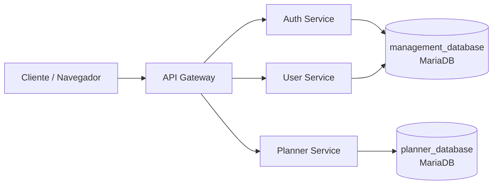
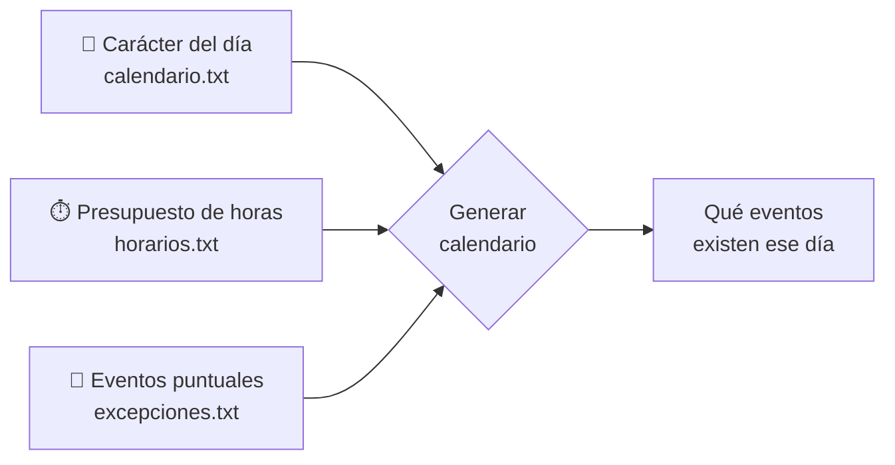
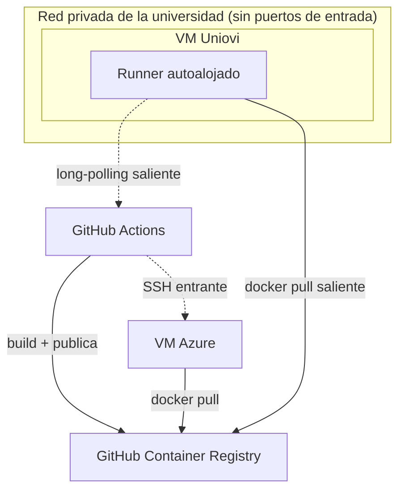

# Presentación — TeachingPlanner

> **Duración objetivo:** ~13-14 minutos de exposición oral (puede subir a 14-15 al hablarlo en voz alta con pausas naturales)
> **Formato total:** presentación (~13-15 min) + vídeo demo (~12 min) + preguntas
>
> **Guía de tiempo por sección:**
> - Portada (diapositiva 1): ~10 s
> - Motivación (diapositivas 2–3): ~1 min 25 s
> - Objetivos (diapositiva 4): ~50 s
> - Roles: qué puede hacer cada uno (diapositiva 5): ~75 s
> - Solución técnica — arquitectura y motor de planificación (diapositivas 6–9, 14): ~4 min 35 s
> - Validación con feedback real: problemas reales + secuencia del issue #31 (diapositivas 10–13): ~2 min 40 s
> - Calidad y despliegue (diapositiva 15): ~85 s
> - Conclusiones y trabajo futuro (diapositiva 16): ~65 s
> - Cierre / paso a demo (diapositiva 17): ~5 s
>
> **Nota:** con las 17 diapositivas actuales, la presentación ronda los 13-14 minutos según el guion escrito (puede llegar a 14-15 hablado en voz alta). Sigue habiendo margen respecto al límite de 15 min, aunque más ajustado.
>
> **Cómo usar este documento:** cada diapositiva tiene dos bloques.
> - **Contenido** → lo que aparece en pantalla (para generar el diseño en Canva). Bullets cortos o tabla; nada de párrafos.
> - **Guion** → lo que se dice en voz alta mientras esa diapositiva está proyectada. No se lee literalmente, es apoyo para practicar.

---

## Diapositiva 1 — Portada

### Contenido
- **TeachingPlanner**
- Sistema web de gestión de horarios académicos para la EII
- Diego Murias · Escuela de Ingeniería Informática · Universidad de Oviedo
- Trabajo de Fin de Grado — Curso 2025-2026

### Guion
> "Buenos días. Voy a presentar TeachingPlanner, un sistema web de gestión de horarios académicos desarrollado para la Escuela de Ingeniería Informática de la Universidad de Oviedo, como Trabajo de Fin de Grado."

*(~10 s)*

---

## Diapositiva 2 — La situación de partida

### Contenido
- El sistema actual de la EII tiene dos piezas:
  - Un **visualizador público** de solo lectura, sin panel de administración
  - Cinco **ficheros de texto plano** editados a mano en el servidor
- Sin interfaz para personal administrativo ni docentes

### Guion
> "Antes de ver qué hace este sistema, hay que entender qué había antes. La EII gestionaba sus horarios con dos piezas: un visualizador público de solo lectura, sin ningún panel de administración, y cinco ficheros de texto plano que se editaban directamente en el servidor de la escuela. Para cualquier cambio en el horario había que acceder a ese servidor y editar los ficheros a mano con un editor de texto. No existía ninguna interfaz para el personal administrativo ni para los docentes."

*(~30 s)*

---

## Diapositiva 3 — Las consecuencias

### Contenido
- **Sin validación de formato ni de conflictos.** Un error de sintaxis se guarda sin avisar y un aula puede reservarse dos veces a la misma hora sin que el sistema lo detecte
- **El mecanismo de código de letra es frágil.** La periodicidad de los grupos no semanales depende de que el mismo código coincida exactamente en dos ficheros distintos. Una mayúscula de más o un espacio hace que el grupo desaparezca del horario publicado sin ningún error visible
- **Solicitudes por correo,** con hilos interminables y sin trazabilidad
- **Doble mantenimiento,** porque hay que replicar cambios a mano en Google Calendar
- **Sin móvil.** El visualizador no funciona en teléfono ni tablet

> Todo apuntaba en la misma dirección: hacía falta una **plataforma web centralizada**, con una interfaz real para administrar el horario y validaciones automáticas. No más ficheros de texto editados a mano

### Guion
> "El sistema funcionaba... hasta que dejaba de funcionar. Y cuando fallaba, no avisaba. Si se introducía un error de sintaxis al editar un fichero, el sistema no lo detectaba ni avisaba: el dato erróneo se guardaba silenciosamente. Tampoco se comprobaba si un cambio generaba solapamientos: un aula podía quedar asignada dos veces a la misma hora sin ningún aviso. Había además un problema más sutil y específico. La periodicidad de los grupos no semanales dependía de un código de letra que tenía que coincidir exactamente entre dos ficheros distintos, calendario.txt y horarios.txt. Una diferencia de mayúscula o un espacio de más rompía esa coincidencia, y el grupo desaparecía del horario publicado sin producir ningún error visible. Quien no supiera que ese mecanismo existía no tenía forma de saber por qué faltaba una clase. Las solicitudes de cambio se gestionaban por correo: docente escribe a jefatura, comprobación manual, respuesta, contraoferta, hilos interminables sin trazabilidad. Cada cambio en los ficheros había que replicarlo también a mano en Google Calendar. Y el visualizador no funcionaba en móviles ni tablets. Todos son problemas de proceso diario. El sistema no fallaba de forma dramática, fallaba de forma silenciosa y costosa en tiempo. Y todos apuntaban en la misma dirección: hacía falta sustituir la edición manual de ficheros por una plataforma web centralizada, con una interfaz real para administrar el horario y validaciones automáticas que hoy no existían. Esa es la dirección de mejora que aborda este trabajo."

*(~55 s)*

---

## Diapositiva 4 — Objetivos

### Contenido
1. Interfaz web de administración
2. Detección de conflictos en tiempo real
3. Sistema de solicitudes integrado (sustituye el correo)
4. Sincronización automática con Google Calendar
5. Compatibilidad total con el formato de ficheros heredado
6. Consulta pública sin autenticación
7. Vista de calendario interactiva (semana, día, mes, agenda)

> Sistema nuevo desde cero, pero conserva el modelo de dominio que ya funcionaba

### Guion
> "De todo lo que se identificó como mejorable, este proyecto da respuesta a siete objetivos concretos: una interfaz web de administración para que cualquier persona gestione el horario sin acceder al servidor, detección de conflictos en tiempo real antes de guardar cualquier cambio, un sistema de solicitudes integrado que reemplaza el flujo por correo, sincronización automática con Google Calendar con un calendario por aula, compatibilidad total con el formato de ficheros heredado para no romper el ecosistema existente, consulta pública sin autenticación conservando lo que ya ofrecía el sistema anterior, y una vista de calendario interactiva completa. El sistema anterior no era solo problemas: su modelo de datos reflejaba necesidades académicas reales, y varios puntos de partida se conservan, como el modelo de recurrencia, el presupuesto de horas lectivas por grupo, los enlaces al GIS y al SIES, y el catálogo bilingüe. La aplicación no extiende el visualizador heredado, es un sistema nuevo construido desde cero. Pero no parte de cero en su modelo de dominio."

*(~50 s)*

---

## Diapositiva 5 — Roles: qué puede hacer cada uno

### Contenido
🌐 **Invitado (sin cuenta)**
- Consultar el horario (5 vistas + filtros + detalle de evento)
- Ver titulaciones, cursos activos, asignaturas, grupos y aulas (solo lectura)
- Exportar CSV del calendario

👤 **Profesor** *(todo lo anterior, más)*
- Recuperar contraseña y activar su cuenta
- Editar su perfil y contraseña
- Ver también cursos planificados/finalizados, no solo activos
- Enviar y editar sus solicitudes de cambio (crear, editar, cancelar, reemplazar)
- Consultar y retirar sus propias solicitudes pendientes

🛠️ **Administrador** *(todo lo anterior, más)*
- Gestión completa de titulaciones, cursos, asignaturas, grupos y aulas
- Crear calendarios: manual (asistente de 3 pasos), importar 5 TXT, o duplicar un año anterior
- Crear/editar/cancelar/reemplazar/eliminar eventos, con detección automática de conflictos
- Importar excepciones y exportar el formato TXT nativo
- Revisar y ajustar, aprobar directamente, o rechazar las solicitudes de los profesores
- Gestión de usuarios (crear, importar Excel, editar, eliminar)
- Vincular Google y gestionar la sincronización con Google Calendar

### Guion
> "Antes de entrar en la arquitectura, conviene dejar claro quién usa este sistema y qué puede hacer cada uno, porque de ahí se derivan buena parte de las decisiones de diseño que vienen después. Hay tres roles, cada uno con más privilegios que el anterior.
>
> Cualquier persona sin cuenta, como invitado, puede consultar el horario con todas sus vistas y filtros, ver el detalle de cualquier evento, y también consultar en modo solo lectura las titulaciones, los cursos activos, las asignaturas, los grupos y las aulas. Además, puede exportar el calendario visible en formato CSV.
>
> El profesor tiene todo lo anterior, y además puede recuperar su contraseña y activar su cuenta la primera vez, editar su perfil y contraseña, y ver también los cursos planificados o finalizados, no solo los activos. Pero sobre todo, en vez de escribir un correo, envía solicitudes de cambio estructuradas: crear un evento nuevo, editar una serie existente, cancelar una ocurrencia, o reemplazarla por otra en distinta fecha. Puede editarlas o retirarlas mientras sigan pendientes de revisión. No gestiona nada directamente, todo pasa por la aprobación del administrador.
>
> Y el administrador tiene todo lo anterior, más el acceso completo. Gestiona toda la estructura académica (titulaciones, cursos, asignaturas, grupos y aulas), y puede crear un calendario de tres formas distintas: con un asistente manual de tres pasos, importando los cinco ficheros de texto heredados, o duplicando el calendario de un año anterior y ajustando las fechas. Crea, edita, cancela, reemplaza y elimina eventos con detección automática de conflictos, importa excepciones y exporta el formato de texto nativo del sistema heredado. Sobre las solicitudes de los profesores tiene tres opciones: revisarlas y ajustar la frecuencia o el horario antes de aprobar, aprobarlas directamente tal como llegaron, o rechazarlas con un comentario. Además gestiona las cuentas de usuario, y es el único que puede vincular una cuenta de Google y gestionar la sincronización con Google Calendar."

*(~75 s)*

---

## Diapositiva 6 — Monolito o microservicios

### Contenido
**¿Monolito o microservicios?** Se optó por microservicios con API Gateway

| Razón | Detalle |
|-------|---------|
| Ritmos de evolución distintos | Auth y planificación cambian por separado, sin riesgo cruzado |
| Coste computacional distinto | Planificación escala sola (calendarios, exportación, sync) |
| Despliegue de bajo riesgo | Actualizar un servicio no reinicia los demás |

- 3 servicios backend + 1 gateway: auth, usuarios, planificación, gateway
- 2 bases de datos: una compartida por auth+usuarios, otra exclusiva de planificación
- Docker Compose (dev / VM universitaria / Azure)

**Diagrama a insertar en Canva:**

### Guion
> "La primera decisión fue: ¿un único sistema integrado o servicios independientes? Se optó por microservicios con API Gateway, por tres razones concretas, no por tendencia tecnológica. Primero, autenticación y planificación evolucionan a ritmos distintos: un cambio en el sistema de contraseñas no debe poder romper el calendario, y con un monolito ambos módulos comparten ciclo de despliegue. Segundo, el servicio de planificación es computacionalmente más costoso, genera calendarios completos, exporta, sincroniza con Google Calendar, y puede escalar de forma independiente. Tercero, despliegue de bajo riesgo: actualizar el servicio de usuarios no requiere reiniciar el de planificación, y si algo falla, solo el servicio afectado se detiene. El resultado son siete componentes desplegables: el frontend, el gateway, tres servicios backend (autenticación, usuarios y planificación) y dos bases de datos relacionales. Autenticación y usuarios comparten una misma base de datos, porque ambos dominios están fuertemente relacionados entre sí. Planificación tiene la suya propia y exclusiva, separada precisamente porque es el dominio que más se aísla del resto. Todo corre en Docker Compose, con configuraciones para desarrollo, VM universitaria y Azure."

*(~55 s)*

---

## Diapositiva 7 — Patrones frente a fechas concretas

### Contenido
**El camino no tomado:** modelo tipo Google Calendar, un registro por cada ocurrencia concreta, enlazadas por clave foránea si son recurrentes

**El camino elegido:** patrones de recurrencia, la regla se guarda y las fechas se calculan al consultar

- **La razón de fondo:** qué eventos existen un día concreto depende de varias cosas que cambian por separado, como el presupuesto de horas del grupo, los eventos puntuales ya confirmados y el carácter del propio día del calendario
- Con registros concretos, cada cambio en cualquiera de esas piezas exigiría *buscar y regenerar* las ocurrencias afectadas
- Con patrones, el cambio se refleja solo con generar el calendario de nuevo, sin nada que sincronizar a mano

**Diagrama a insertar en Canva** (añadir un icono pequeño junto a cada caja de entrada para que se lea de un vistazo: 📅 calendario/festivos, ⏱️ presupuesto de horas del grupo, 📌 evento puntual/cita concreta):

### Guion
> "Para representar los eventos del horario, la opción más natural habría sido el modelo que usa Google Calendar: cada clase como un registro concreto con su fecha, y si es recurrente, esas ocurrencias enlazadas entre sí por clave foránea a una serie. Esa opción se descartó, y la razón no es solo compatibilidad de ficheros, es que el propio proceso de generación está profundamente interrelacionado.
>
> Qué eventos existen un día concreto no depende de una sola cosa. Depende del carácter que tiene ese día en el calendario, si es festivo, semana par o impar, dato que en el formato heredado vive en calendario.txt. Depende también del presupuesto de horas que tiene planificado cada grupo ese semestre, un campo que pertenece al propio grupo, no al evento, y que se declara al importar los eventos periódicos desde horarios.txt: si un grupo tiene más de una serie periódica, todas deben declarar la misma cifra de horas, y si no coinciden, el grupo entero se descarta al importar. Y depende de si ya hay eventos puntuales confirmados que consuman parte de ese presupuesto, las excepciones del fichero excepciones.txt. Estas tres piezas cambian de forma independiente y en cualquier momento: un administrador puede marcar un nuevo festivo, ajustar el presupuesto de horas de un grupo, o confirmar una clase extraordinaria.
>
> Con un modelo de registros concretos, cada uno de esos cambios dejaría desactualizados los registros ya guardados, habría que localizar activamente todas las ocurrencias afectadas y regenerarlas para que la base de datos siguiera reflejando la realidad. Con el modelo de patrones no hace falta: como las fechas concretas no se guardan, sino que se calculan cada vez que se consulta el calendario, cualquier cambio en el presupuesto, en un evento puntual o en el calendario de días lectivos se refleja automáticamente la próxima vez que se genera, sin tocar la definición del evento recurrente, y sin ningún proceso de sincronización que pueda quedarse a medias o desactualizado.
>
> Y hay una segunda ventaja, la que ya conocíamos: el sistema heredado de la EII describe sus horarios exactamente así, con un carácter de recurrencia y un presupuesto de horas, no con listas de fechas. Exportar de vuelta a ese formato desde un modelo de registros concretos habría exigido inferir el patrón de recurrencia a partir de fechas sueltas, un proceso de adivinar la regla a partir de ejemplos, con riesgo real de equivocarse. Partiendo ya del mismo modelo que usa el formato heredado, la exportación es una transcripción directa. El coste que se asume conscientemente es que generar la vista de calendario exige recalcular estas tres dependencias cada vez que se consulta, en lugar de simplemente leer fechas ya guardadas. Es la operación más costosa del sistema. Cómo funciona ese cálculo, en detalle, lo vemos en las dos siguientes diapositivas."

*(~65 s)*

---

## Diapositiva 8 — El reparto del presupuesto de horas

### Contenido
Los eventos **periódicos** no guardan fecha, guardan la **regla**. (Los eventos **puntuales** sí tienen fecha exacta, como una cita concreta)

- **Los puntuales se incluyen siempre, sin condición.** Consumen presupuesto primero, sin importar su fecha ni su orden cronológico
- **Los periódicos rellenan lo que sobra.** Se añaden uno a uno hasta agotar las horas restantes
- **Ni la duración es un dato fijo:** si al generar el calendario la última sesión de un grupo excede por poco las horas que le quedan, esa ocurrencia se recorta automáticamente para encajar justo en el límite. La duración real es una consecuencia calculada, no un valor guardado de antemano

### Guion
> "El sistema distingue dos tipos de eventos. Los eventos puntuales sí tienen una fecha concreta guardada, como cualquier cita en un calendario normal. Pero los eventos periódicos no almacenan ninguna fecha, almacenan la regla, 'esta clase ocurre todos los martes', y las fechas concretas se calculan cada vez que se consulta el calendario.
>
> El reparto del presupuesto de horas de cada grupo sigue un orden estricto, no una mezcla por fecha. Primero, todos los eventos puntuales del grupo se incluyen siempre, sin ninguna condición. No compiten por orden de fecha con nada, y sus horas se restan primero del presupuesto total. Solo con lo que queda libre después de eso se van generando eventos periódicos, uno a uno, hasta agotar ese resto. Esto significa que si un puntual ya consume todo el presupuesto, ese grupo no tendrá ningún evento periódico ese semestre, aunque cronológicamente algún periódico caería antes que el puntual en el calendario. El puntual no gana por ir primero en el tiempo, gana porque siempre tiene prioridad absoluta sobre el presupuesto.
>
> Y hay un detalle que ilustra bien hasta qué punto está todo interrelacionado: ni siquiera la duración de una clase concreta es un dato fijo que viva en la serie del evento recurrente. La serie define una franja horaria estándar, pero si al generar el calendario la última sesión de un grupo excede por poco las horas que le quedan de presupuesto, esa última ocurrencia se recorta automáticamente para encajar justo en el límite. La duración real de esa clase concreta es, literalmente, una consecuencia calculada de la relación entre el patrón y el presupuesto, no un valor que el sistema guarde en ningún sitio de antemano."

*(~55 s)*

---

## Diapositiva 9 — Cuando varias series comparten presupuesto: round-robin

### Contenido
**Tipos de recurrencia:** Normal / Par / Impar / Personalizado

**Rotación round-robin:** cuando un mismo grupo tiene varias series periódicas Normal (comparten presupuesto de horas), se generan **por turnos**, una fecha de cada serie, en rondas, en vez de agotar primero todas las de una serie

- **Dos fases separadas:** primero el round-robin genera *todas* las fechas candidatas posibles, sin mirar el presupuesto. Después, el filtro de horas recorre esa lista ya ordenada y acepta candidatas hasta agotar el presupuesto
- Por eso importa el orden: si el presupuesto no llega para todas, con turnos repartidos ninguna serie se queda sin ninguna sesión

### Guion
> "Antes de ver el último mecanismo, un apunte rápido sobre los tipos de recurrencia: normal aparece todas las semanas lectivas, par y impar solo en esas semanas alternas, y personalizado solo en los días marcados con un código específico del calendario importado.
>
> Y aquí entra el tercer mecanismo. Cuando un grupo tiene más de una serie periódica de tipo Normal, por ejemplo porque comparte una franja horaria con otro grupo en la misma aula y hay que alternar semanas, esas series compiten por el mismo presupuesto de horas del grupo. El sistema no genera primero todas las fechas de una serie y luego todas las de la otra, las genera por turnos, con un algoritmo round-robin: una fecha de la primera serie, una de la segunda, otra de la primera, y así sucesivamente, en rondas.
>
> Esto ocurre en dos fases separadas. Primero, el round-robin genera todas las fechas candidatas posibles para esas series, sin mirar todavía cuántas horas hay disponibles. Después, un segundo paso filtra esa lista ya ordenada y va aceptando candidatas hasta agotar el presupuesto de horas del grupo. Por eso importa el orden en que se generaron: si el presupuesto no llega para todas las candidatas, al haberlas repartido por turnos, ninguna serie se queda sin ninguna sesión. El corte llega repartido entre todas, no solo a la última en la cola."

*(~55 s)*

---

## Diapositiva 10 — De correos sueltos a un flujo estructurado con el cliente

### Contenido
Además de las decisiones de diseño, el desarrollo generó **problemas reales y mejoras concretas**, detectados y resueltos con los tutores actuando como jefatura de estudios (el cliente real)

**45 issues en GitHub, con conversación trazable,** que sustituyen el correo suelto como canal de validación

| Etiqueta | Ejemplo real | Resultado de la conversación |
|---|---|---|
| 🐛 **Bug** | Importar dos ficheros de excepciones seguidos revertía una cancelación ya aplicada | Se preguntó explícitamente qué comportamiento se esperaba; el tutor aportó el criterio real de uso y se fijó la prioridad |
| ✨ **Enhancement** | Mejoras al correo de activación (remitente, visualización del botón, flujo de login) | Se implementó y se documentó en el propio hilo la configuración SMTP alternativa |
| ❓ **Question** | Confusión entre "Aprobar solicitud" y "Revisar solicitud" | Primero se unificaron iconos y se explicó el propósito de cada una; al reabrir el issue, se decidió eliminar la opción redundante |
| 🚫 **Invalid** | Festivos de fechas pasadas al duplicar un calendario a otro curso | Se valoró y se descartó: el asistente ya permite ajustarlos manualmente |

> El propio flujo de trabajo también se rediseñó: cada duda o hallazgo queda en un hilo propio, con contexto, capturas y la decisión final, en vez de un correo que se pierde entre muchos otros

### Guion
> "Hasta ahora he hablado de decisiones de diseño tomadas de antemano. Pero durante el desarrollo también aparecieron problemas reales y mejoras que no se habían previsto, y quiero mostrar cómo se gestionaron, porque el propio proceso de detectarlos y resolverlos fue una parte importante del trabajo. Se gestionó con los tutores actuando como jefatura de estudios, el cliente real que va a usar la aplicación. En vez de intercambiar correos sueltos, el mismo problema de trazabilidad que motivó sustituir las solicitudes de los profesores por un sistema propio, se usó GitHub Issues: cada duda, bug o mejora abre su propio hilo, con contexto, capturas de pantalla, y una conversación que queda documentada hasta llegar a una decisión. En total, cuarenta y cinco issues gestionados así.
>
> Un ejemplo de tipo bug: al importar dos ficheros de excepciones seguidos, una cancelación ya aplicada se revertía sin querer. En vez de arreglarlo a ciegas, pregunté directamente en el hilo qué comportamiento se esperaba, si debía mantenerse la cancelación, si la recuperación debía tener prioridad, o si había que mostrar ambas, y el tutor aportó el criterio real de cómo se usaría en la práctica antes de decidir la solución.
>
> Un ejemplo de tipo enhancement: mejoras al correo de activación de cuentas, el remitente, un problema de visualización del botón, y el flujo de inicio de sesión posterior. Se implementó la mejora y, en el propio hilo, se documentó cómo configurar un remitente alternativo con SMTP.
>
> Y un ejemplo de tipo invalid, para mostrar que el proceso también sirve para descartar con criterio: se reportó que duplicar un calendario a otro curso copiaba festivos de fechas ya pasadas. Se valoró y se cerró como no aplicable, porque el propio asistente de duplicación ya permite ajustar esos festivos manualmente antes de confirmar.
>
> El cuarto tipo, question, lo voy a enseñar paso a paso en las siguientes tres capturas, porque es un buen ejemplo visual de cómo funcionaba esta conversación en la práctica."

*(~75 s)*

---

## Diapositiva 11 — GitHub como canal de trabajo (1/3 — se abre el hilo)

### Contenido
**⚠️ Nota de diseño para Canva:** las diapositivas 10, 11 y 12 comparten el mismo título fijo **"GitHub como canal de trabajo"**, en la misma posición, tamaño y estilo en las tres. Solo cambia el subtítulo de paso y el contenido central (la captura). El efecto buscado es que el espectador sienta continuidad al pasar de diapositiva, no un tema nuevo cada vez.

**📷 Captura a insertar (de fondo/apoyo, no protagonista):** issue #31 en GitHub (`Murias10/TeachingPlanner`), solo el **post original** de juanrperez, recortado (sin cabecera de GitHub ni sidebar)

**Paso del flujo:** cualquier duda, bug o mejora se abre como un issue propio, con contexto y capturas, quedando abierto hasta que se cierra con una decisión explícita

### Guion
> "Para no quedarme en lo abstracto, voy a apoyarme en uno de esos cuarenta y cinco issues como ejemplo visual, uno sencillo, de tipo duda. No es el más importante ni el más complejo, lo elijo precisamente porque se ve bien en pantalla; lo que importa no es este caso concreto, es el flujo detrás, que se repite igual en los otros cuarenta y cuatro. Cada vez que un tutor, probando la aplicación como lo haría jefatura de estudios, encontraba una duda o un problema, abría un issue: un espacio propio, con su contexto y sus capturas, que queda abierto hasta que hay una respuesta clara. Es la misma filosofía que aplico a las solicitudes de los profesores dentro de la propia aplicación: nada se resuelve en un intercambio informal que luego nadie puede rastrear."

*(~30 s)*

---

## Diapositiva 12 — GitHub como canal de trabajo (2/3 — se responde y se decide)

### Contenido
**📷 Captura a insertar (de fondo/apoyo):** issue #31, comentario de respuesta con capturas

**Paso del flujo:** la respuesta se da en el mismo hilo, con evidencia visual del estado, y si la primera solución no es suficiente, el hilo se reabre en vez de perderse en otro canal

### Guion
> "La respuesta no se da por correo ni en una conversación pasajera, se responde en el propio hilo, con capturas de la aplicación real, explicando qué se ha hecho o por qué se propone algo. Y aquí hay un matiz importante del método: si esa primera respuesta no cierra el tema del todo, el hilo se reabre. No se abre uno nuevo, no se pierde el hilo de la conversación anterior. Todo el histórico de idas y vueltas queda en un único sitio, consultable después."

*(~20 s)*

---

## Diapositiva 13 — GitHub como canal de trabajo (3/3 — se corrige y se despliega)

### Contenido
**📷 Captura a insertar (de fondo/apoyo):** issue #31, comentario de cierre definitivo

**Paso del flujo:** la decisión final queda enlazada a un commit concreto del código, y desde ahí, al pipeline de despliegue

### Guion
> "El cierre definitivo del issue no es solo una frase de conformidad, queda enlazado a un commit concreto del código que implementa la decisión. Y aquí está la clave de todo el método: una vez ese commit existe, lanzar el pipeline de despliegue lleva la corrección directamente a producción, sin pasos intermedios ni fricción. Lo veremos con detalle en la siguiente diapositiva. El ciclo completo es corto: detectar en una conversación, decidir con criterio, corregir en el código, y desplegar. Es esa rapidez de principio a fin la que hace que merezca la pena mantener este nivel de trazabilidad en cada uno de los cuarenta y cinco issues, en vez de resolver las cosas de forma más informal."

*(~25 s)*

---

## Diapositiva 14 — Más decisiones técnicas

### Contenido
| Decisión | Elegido | En vez de | Por qué |
|----------|---------|-----------|---------|
| Base de datos | MariaDB (relacional) | MongoDB | Relaciones e integridad fuertes en el dominio académico |
| Frontend | React + Vite (SPA) | Next.js SSR | Ninguna página necesita indexación SEO, toda la gestión requiere login |
| TLS | Caddy | Nginx | Certificado GEANT ya emitido, sin necesidad de certbot |

### Guion
> "Tres decisiones técnicas más, con consecuencias reales.
>
> Base de datos relacional, MariaDB, en lugar de documental como MongoDB. El modelo académico tiene relaciones fuertes entre sus entidades y restricciones de unicidad que importan de verdad: si se borra una asignatura, sus grupos y eventos asociados tienen que desaparecer con ella, en cascada, y no puede haber dos aulas con el mismo código, ni dos asignaturas con el mismo acrónimo. Una base de datos relacional aplica esas garantías a nivel de motor. Son restricciones declaradas en el propio esquema, y el motor las hace cumplir siempre, sin excepción. Con una base de datos documental, esas mismas garantías habría que reimplementarlas a mano en el código de la aplicación, y cualquier punto donde se nos olvidara comprobarlas sería una vía para que aparecieran datos inconsistentes.
>
> Frontend en React con Vite, como aplicación de una sola página, en lugar de Next.js con renderizado en servidor. El renderizado en servidor, o SSR, sirve sobre todo para que los buscadores como Google puedan indexar el contenido de una página pública. Aquí sí existe una vista pública sin login, la consulta de horarios, pero a nadie le interesa buscar eso en Google, y el resto de la aplicación exige login de todas formas. Como ese caso de uso no aplica, no compensa la complejidad de mantener un servidor de renderizado, y una aplicación de una sola página con Vite tiene un ciclo de desarrollo bastante más rápido.
>
> Y TLS con Caddy en lugar de Nginx. Aquí quiero ser honesto sobre el alcance de esta decisión: los dos me habrían servido igual de bien, el resultado final, HTTPS funcionando, es idéntico con cualquiera de los dos. No es una diferencia de funcionamiento, es una diferencia de cuánta configuración hace falta escribir para llegar ahí. Nginx no gestiona certificados por sí mismo, la forma habitual de dárselos es añadir certbot al lado, una herramienta aparte que los pide y los renueva. Pero yo no necesito pedir ni renovar nada, porque la universidad ya me entrega el certificado hecho, el GEANT, y solo tengo que dárselo al contenedor al arrancar. Como no uso esa función de pedir y renovar, montar certbot solo para no usarla habría sido una pieza de más. Caddy acepta directamente un certificado ya emitido, con menos configuración, así que para mi caso concreto es simplemente menos verboso, no mejor en la práctica, solo más simple de montar."

*(~65 s)*

---

## Diapositiva 15 — Calidad y despliegue

### Contenido
**Sin mocks en tests del núcleo.** Base de datos real en contenedor efímero, no simulada

| Etapa del pipeline (GitHub Actions) | Qué hace |
|-------------|---------------|
| Análisis estático | SonarQube: code smells, duplicación, complejidad ciclomática |
| Tests de integración | Contra base de datos real en contenedor efímero |
| Tests end-to-end | Playwright, flujos completos en navegador real |
| Build + despliegue | Imagen Docker → VM universitaria o Azure |

- Pipeline activado **manualmente y de forma deliberada,** no en cada push, decisión consciente del desarrollador sobre cuándo desplegar
- **Dos entornos de producción:** Azure (despliegue inicial durante el desarrollo) y VM de la Universidad de Oviedo (entorno definitivo actual)
- La VM universitaria vive en una **red privada** de la universidad, sin puertos abiertos hacia el exterior, solo accesible por VPN institucional
- **Problema:** el despliegue a Azure se hace por SSH entrante (GitHub se conecta a la VM). Replicar eso en la VM universitaria exigiría abrir un puerto de entrada en el firewall institucional
- **Solución:** un **runner autoalojado** (self-hosted runner), instalado directamente **en la propia VM de la universidad**. Todo el despliegue se ejecuta localmente, dentro de esa VM. El runner mantiene una conexión saliente en long-polling con GitHub Actions (nunca entrante) para recibir el aviso de despliegue, y otra saliente al Container Registry para bajar las imágenes
- La cobertura de tests es un área de trabajo en progreso, no un resultado cerrado

**Diagrama a insertar en Canva** (etiquetas cortas en las flechas; dejar margen suficiente para que no se corten; el rectángulo punteado de la red universitaria debe leerse como un perímetro cerrado, sin puertos de entrada):

### Guion
> "Antes mencioné que, tras cerrar el issue número treinta y uno con un commit, lanzar el pipeline llevaba esa corrección directamente a producción sin fricción. Esta diapositiva es precisamente ese pipeline. La decisión de testing más importante es no usar simulaciones. Para los tests del núcleo se tomó una decisión deliberada de no usar bases de datos mockeadas, sino una base de datos real en un contenedor efímero que se crea antes de cada suite y se destruye al terminar. La razón es que la lógica más crítica del sistema (restricciones de unicidad, eliminaciones en cascada, integridad referencial) solo se manifiesta con una base de datos real. Un mock no reproduce esas garantías, y una suite construida sobre mocks pasaría tests para código que falla en producción.
>
> Sobre esa base se construyó un pipeline completo de integración y despliegue continuo con GitHub Actions, con cuatro pasos: análisis estático del código con SonarQube, tests de integración contra esa base de datos real, tests end-to-end con Playwright sobre navegador real, y por último build de las imágenes Docker de cada servicio, que se publican en el registro de contenedores de GitHub, el GitHub Container Registry. Hasta aquí el flujo es igual para los dos entornos de despliegue.
>
> A partir de ahí, las conexiones son distintas según el entorno. En Azure, el flujo es el estándar: GitHub Actions se conecta por SSH *hacia dentro* de la VM de Azure, es GitHub quien inicia la conexión, y una vez dentro, ejecuta el comando para descargar, con `docker pull`, las imágenes recién publicadas en el registro, y reinicia los servicios con la versión nueva.
>
> Con la VM de la universidad ese mismo flujo no era viable: esa máquina vive en una red privada, sin ningún puerto abierto hacia el exterior, y solo es accesible mediante la VPN institucional. Replicar el SSH entrante habría exigido pedir que se abriera un puerto en el firewall institucional, algo que, con buen criterio de seguridad, la universidad no iba a conceder fácilmente. La solución fue instalar un runner autoalojado directamente en esa misma VM universitaria, en vez de dejar que el trabajo lo ejecute un runner genérico alojado por GitHub. Con esto, todo el despliegue ocurre en local, dentro de la propia VM, y solo hacen falta dos conexiones salientes desde dentro hacia fuera, nunca al revés. La primera es del propio proceso del runner hacia GitHub Actions: mantiene abierta una conexión de tipo long-polling, es decir, una petición que GitHub deja pendiente de responder durante un tiempo, unos cincuenta segundos, en vez de contestar al instante. Si en ese tiempo no hay ningún trabajo asignado, la conexión se cierra y el runner abre otra igual inmediatamente. No es preguntar constantemente cada segundo, es una única conexión persistente que se va renovando, y en el momento en que hay un despliegue pendiente, esa misma conexión ya abierta recibe la respuesta al instante, sin latencia añadida. La segunda conexión, ya con el trabajo recibido, es el propio runner conectándose al registro de contenedores para hacer `docker pull` y traerse las imágenes nuevas, de nuevo una conexión que sale desde la VM hacia fuera, no una entrada externa. Con las imágenes ya descargadas localmente, el runner reinicia los contenedores ahí mismo, en la misma máquina donde está instalado. Mismo resultado final que en Azure, pero sin necesitar ninguna conexión entrante ni ninguna excepción nueva en el firewall.
>
> El pipeline, en ambos entornos, no se dispara automáticamente en cada push, sino que se activa manualmente cuando se decide desplegar, con control consciente sobre cuándo el código llega a producción. Soy consciente de que la cobertura de tests todavía es un área de trabajo en progreso, no un resultado cerrado. Lo que quiero destacar aquí no es una cifra, sino que existe una infraestructura real de integración continua, con base de datos real en los tests y despliegue automatizado, funcionando de extremo a extremo en dos entornos con topologías de red distintas. La aplicación está desplegada en la VM de la Universidad de Oviedo y se presentó formalmente al personal de la EII como candidata para sustituir el sistema actual."

*(~85 s)*

---

## Diapositiva 16 — Conclusiones y trabajo futuro

### Contenido
**Conclusiones**
- Sistema desplegado, funcional y presentado formalmente a la EII
- Los problemas de partida (edición manual, errores silenciosos, correo) están resueltos
- Todas las decisiones técnicas respondieron a restricciones reales, no fueron arbitrarias
- El dominio académico resultó más complejo de lo estimado. El motor de planificación completo llevó más tiempo del previsto, absorbido con el colchón de contingencia sin recortar alcance

**Trabajo futuro**
- Autenticación Microsoft (cuentas institucionales `uoXXXXXX@uniovi.es`)
- Interfaz de auditoría
- Undo/redo en el calendario
- Notificaciones en tiempo real (WebSockets)
- WAF y rate limiting

### Guion
> "Para concluir: el objetivo principal está cumplido, la EII tiene un sistema desplegado, funcional y presentado formalmente como sustituto del actual. Los problemas de partida (edición manual en el servidor, errores silenciosos, solicitudes por correo) están resueltos. Todas las decisiones técnicas tuvieron restricciones reales detrás, la compatibilidad con el ecosistema de ficheros heredado, el dominio académico real de la escuela, la disponibilidad del portal universitario de Azure, ninguna fue arbitraria. Una lección honesta del proyecto es que el dominio académico resultó más complejo de lo estimado inicialmente. El motor de planificación, con el sistema de caracteres de recurrencia, el presupuesto de horas y la detección de conflictos, llevó bastante más tiempo de implementación del que se había previsto en la planificación. Se absorbió reajustando el orden del backlog y con el colchón de contingencia de dos semanas, sin recortar ninguna funcionalidad ni retrasar la entrega. El trabajo demuestra que una arquitectura de microservicios con CI/CD y despliegue real en producción es abordable dentro de un TFG si las decisiones se toman con criterio desde el principio, y si la planificación deja margen para la complejidad real del dominio. Como trabajo futuro queda: autenticación con cuentas de Microsoft de la universidad, que requería un registro institucional fuera del alcance del TFG; una interfaz de auditoría, ya que los campos de trazabilidad están en la base de datos pero falta la UI; undo/redo en el calendario; notificaciones en tiempo real por WebSockets cuando se aprueba o rechaza una solicitud; y WAF con rate limiting antes de cualquier despliegue más amplio."

*(~65 s)*

---

## Diapositiva 17 — Demostración

### Contenido
- A continuación, vídeo de demostración de la aplicación
- *(~10 minutos)*

### Guion
> "A continuación se proyecta el vídeo de demostración de la aplicación."

*(~5 s)*
