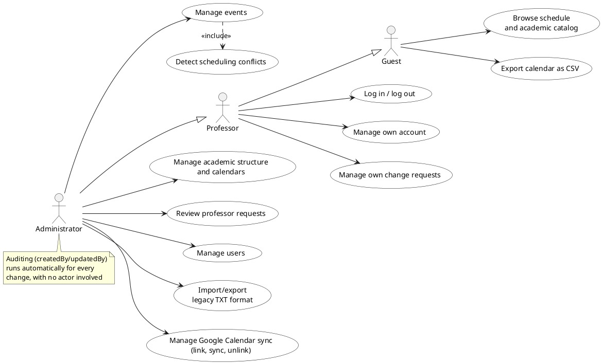
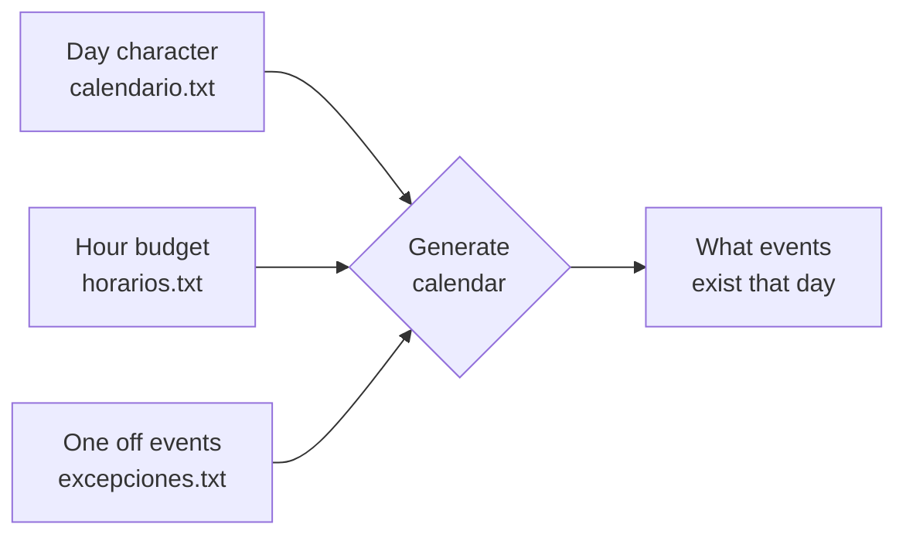
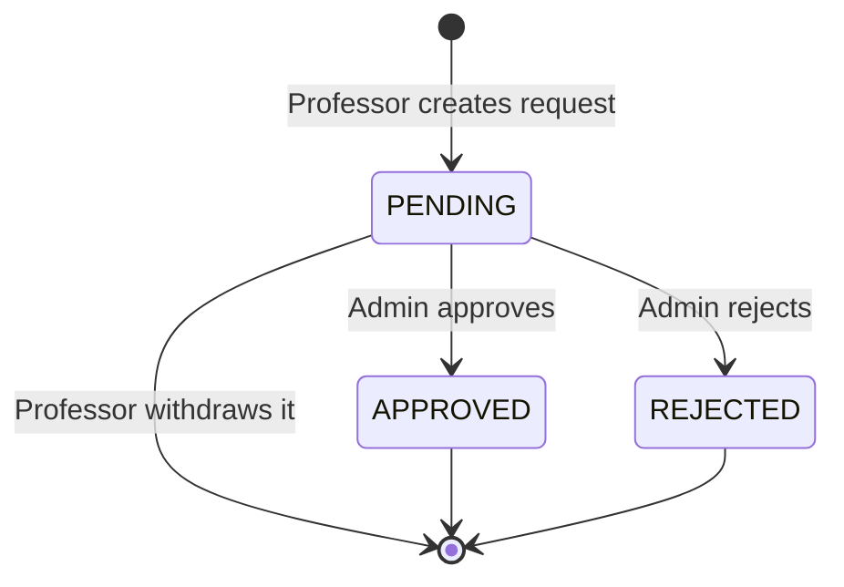
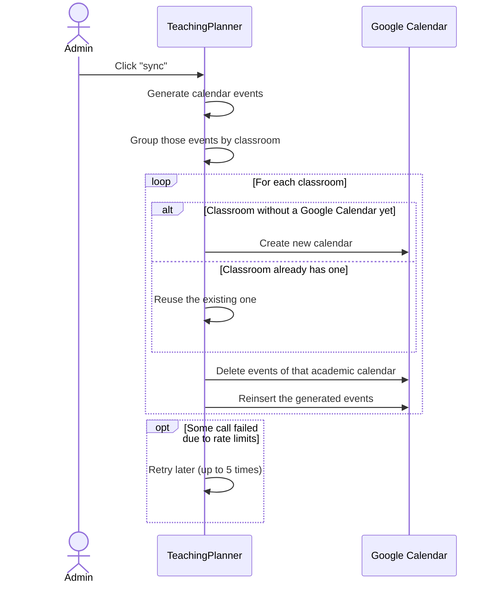
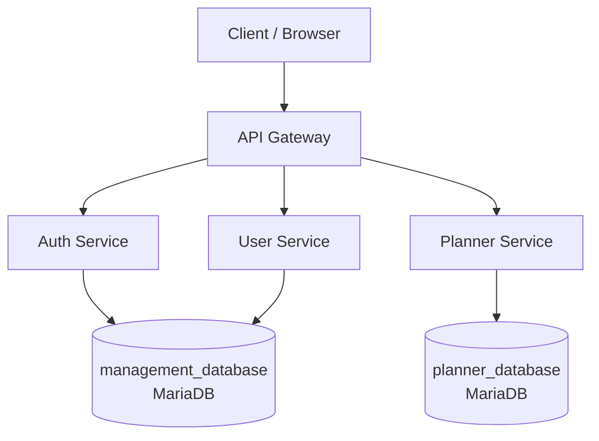
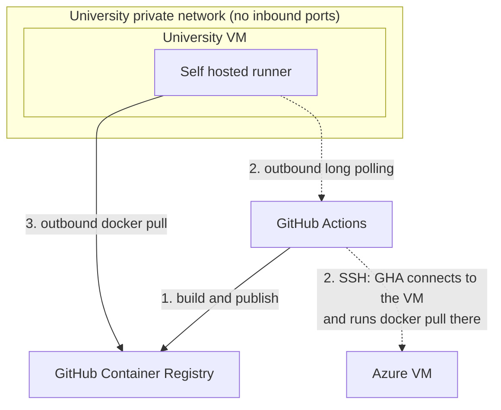

# Presentación — TeachingPlanner

> **Cómo usar este documento:** cada diapositiva tiene un bloque **Contenido**, que es lo que aparece en pantalla (bullets cortos o tabla, nada de párrafos). El guion oral de cada diapositiva, con su tiempo estimado, está en `guion.md`.

---

## Diapositiva 1 — Cover

### Contenido
- **TeachingPlanner**
- Web based academic schedule management system for the EII
- Diego Murias, School of Computer Engineering, University of Oviedo
- Final Degree Project, Academic Year 2025-2026

---

## Diapositiva 2 — The Complexity of University Scheduling

### Contenido
- **The problem:** hundreds of weekly sessions, limited classrooms, no overlaps allowed
- Comes from the **Teaching Organisation Plan (POD)**, with changes throughout the year
- **Why a generic calendar app isn't enough:** no teaching periods, no holidays, no recurrence patterns, no hour budgets, no group-classroom conflict detection, no filtering at scale

---

## Diapositiva 3 — The Previous System

### Contenido
- Two pieces: **public viewer** plus data stored in **plain text files**
- **Viewer:** 3 formats (list, table, CSV), group checkboxes, GIS links, split by semester
- **Admin filters:** by professor, by group, by date range
- Met all the complexity requirements from before, and worked well for years
- **Real limitation:** changes required SSH access and domain knowledge, only one specialist could do it

---

## Diapositiva 4 — Operational Consequences

### Contenido
- **No validation.** Syntax errors and classroom overlaps go unnoticed
- **Requests by email.** Endless threads, no traceability
- **Double maintenance** in Google Calendar
- **No mobile support**

> Everything pointed to the same need. A **centralised web platform**, with a real interface and automatic validation. No more hand edited text files

---

## Diapositiva 5 — Objectives

### Contenido
1. **Interactive calendar view** (week, work week, day, month)
2. **Fast filtering**: degree, course, subject, group, classroom
3. Web based administration interface
4. Real time conflict detection
5. Integrated request system (replaces email)
6. Automatic Google Calendar sync
7. Full compatibility with the legacy file format
8. Public access without authentication

> A new system built from scratch, but keeping the domain model that already worked

---

## Diapositiva 6 — Roles: What Each One Can Do

### Contenido
**Use case diagram, 3 actors:** Guest, Professor (extends Guest), Administrator (extends Professor)

---

## Diapositiva 7 — Sharing the Hour Budget

### Contenido
- **Each group has an hour budget for the semester,** filled with real sessions
- **Special events** (Review, Evaluation, Independent, Others) don't consume budget, can be periodic or one-off
- **One off events go first,** unconditionally, before anything else
- **All different frequencies share the budget after that:** Normal, Even, Odd, Custom, consumed in chronological order, earliest date first
- **Duration is not fixed:** the last session is trimmed automatically if less than a full session remains

**Example: group Est.T.I-1,** 8h budget
- One off event: Wednesday 15/04, 9h to 10h, classroom A-S-02
- Normal weekly series: Tuesdays, 9h to 11h, classroom A-S-02
- Odd-week series: Wednesdays, 10h to 12h, classroom A-S-02
- Normal weekly series (2nd session): Tuesdays, 9h to 11h, classroom A-S-02
- Last session, trimmed to fit: 1h left in the budget

```mermaid
gantt
    dateFormat HH:mm
    axisFormat %-Hh
    tickInterval 1hour
    section Hours consumed out of 8h budget
    One off replacement, 0 to 1h        :done, 00:00, 1h
    Normal session 1, 1 to 3h           :active, 01:00, 2h
    Odd session 1, 3 to 5h              :active, 03:00, 2h
    Normal session 2, 5 to 7h           :active, 05:00, 2h
    Last session trimmed, 7 to 8h       :crit, 07:00, 1h
```

---

## Diapositiva 8 — Patterns Versus Concrete Dates

### Contenido
- **Path not taken:** one record per occurrence, Google Calendar style
- **Path chosen:** recurrence patterns, dates calculated when queried
- **Why:** a new one-off event shifts the whole budget, so fixed records would need manual updates every time
- **Cost control:** cached in memory per calendar, recalculated only on real changes

---

## Diapositiva 9 — Professor Change Requests

### Contenido

- Request types: **create, edit, cancel, or replace** an event. Classroom or time can be left unknown
- Administrator can **fill in the missing details** before approving

---

## Diapositiva 10 — Google Calendar Sync

### Contenido
- **Push only, on demand.** TeachingPlanner sends data to Google Calendar, never reads it back
- **Calendars are reused,** created only once per classroom (Google limits how often you can create one)
- **Automatic retry** if it fails: waits longer each time, up to 5 tries, then shows an error

---

## Diapositiva 11 — More Technical Decisions

### Contenido
| Decision | Chosen | Instead of | Why |
|----------|---------|-----------|---------|
| Database | MariaDB (relational) | MongoDB | Strong relationships between academic data |
| Calendar component | react-big-calendar | FullCalendar | FullCalendar needs a paid licence for advanced features. react-big-calendar is free and works natively with React |
| Frontend | React + Vite (SPA) | Next.js SSR | No SEO needed, every page requires login |
| TLS | Caddy | Nginx | Already accepts the university's GEANT certificate, no extra setup |

---

## Diapositiva 12 — Monolith or Microservices

### Contenido
**Monolith or microservices?** Microservices with an API Gateway were chosen

| Reason | Detail |
|-------|---------|
| Independent evolution | Auth and planning change separately |
| Independent scaling | Planning scales on its own |
| Low risk deployment | Updating one service doesn't restart the others |
| Real partial resilience | If auth/users go down, public schedule keeps working |

---

## Diapositiva 13 — A Structured Client Workflow

### Contenido
- Tutors acted as the real client: they found real problems, I built real improvements
- **45 GitHub issues:** bugs, improvements, questions, and rejected ideas
- Each one in its own thread, with context, screenshots, and a final decision

**Visual support:** issue #31 on GitHub (`Murias10/TeachingPlanner`)

**The flow, in three steps:**
1. **Open:** a question, bug or improvement becomes its own issue
2. **Answer:** reply in the same thread. Reopen it if not solved
3. **Close:** linked to the commit that fixes it

---

## Diapositiva 14 — Quality and Deployment

### Contenido
| Pipeline stage (GitHub Actions) | What it does |
|-------------|---------------|
| Static analysis | SonarQube: code smells, duplication, complexity |
| Integration tests | Real database in a temporary container |
| End to end tests | Playwright, full flows in a real browser |
| Build | Docker images built and pushed to GitHub Container Registry |
| Deploy | Images pulled and started on the university VM or Azure |

---

## Diapositiva 15 — Conclusions and Future Work

### Contenido
**Conclusions**
- System deployed and formally presented to the EII, original problems solved
- **Academic domain harder than estimated,** costing extra development time
- **Added extra features on my own:** conflict validation, professor requests
- They added real value, but also extra time, adding to the delay

**Future work**
- **Login with university accounts** (`uoXXXXXX@uniovi.es`), instead of separate passwords
- **Audit log:** track who changed what and when
- **Undo/redo** for calendar edits
- **Live notifications** when a request is approved or rejected
- **Stronger security:** WAF and rate limiting against abuse

---

## Diapositiva 16 — Demonstration

### Contenido
- Next, a demonstration video of the application
- *(~10 minutes)*
